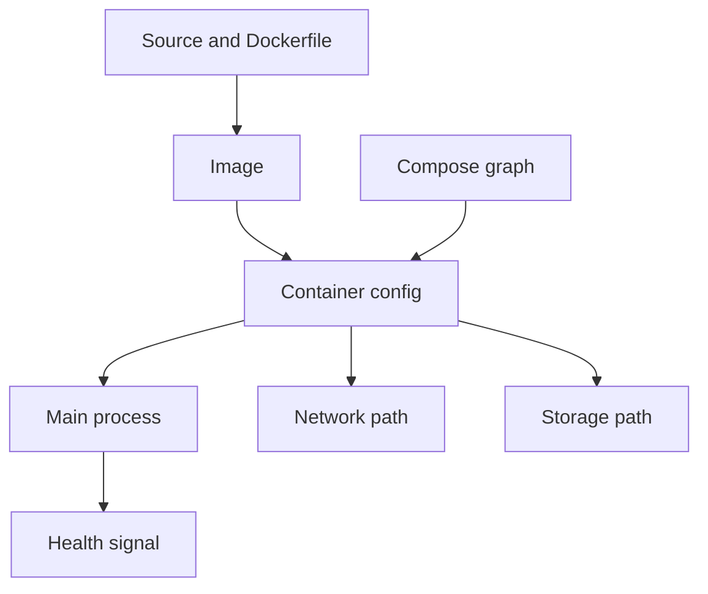

## Table of Contents

1. [Why Docker Debugging Needs a Map](#why-docker-debugging-needs-a-map)
2. [The Mental Model](#the-mental-model)
3. [State Before Shells](#state-before-shells)
4. [Logs as Process Evidence](#logs-as-process-evidence)
5. [Image and Command](#image-and-command)
6. [Environment](#environment)
7. [Network Path](#network-path)
8. [Storage Path](#storage-path)
9. [Health and Readiness](#health-and-readiness)
10. [A Full Walkthrough](#a-full-walkthrough)
11. [Putting It All Together](#putting-it-all-together)

## Why Docker Debugging Needs a Map

Docker debugging is boundary tracing: match the symptom to the image, command, process, environment, network, storage, health, or Compose graph that owns it.

The local orders stack is now described by Compose. It has an API service, a database service, a project network, a published host port, a named volume, environment variables, a health check, and a development workflow. Then someone posts the sentence every Docker user eventually sees:

```text
The stack is up, but the API does not work.
```

That sentence is too broad to debug. "Up" might mean the containers exist. It might mean the database is healthy while the API is restarting. It might mean the API is listening inside the container but no host port is published. It might mean the API points at `localhost` for Postgres. It might mean a bind mount hides the built application. It might mean the image was rebuilt but the running container still uses old state.

Docker debugging needs a map because Docker itself is a set of boundaries. The image boundary answers what was packaged. The runtime boundary answers which command started and which environment was passed. The process boundary answers whether the main process is alive. The network boundary answers how a caller reaches a port. The storage boundary answers where a path gets its files. Compose adds a graph boundary around several services.

The faster you find the first boundary that disagrees with reality, the less time you spend changing unrelated settings.

## The Mental Model

The debugging model is the same dependency chain Docker used to create the stack: source becomes image, image plus runtime settings becomes container, and the process then uses network, storage, and health boundaries.


*A debugging map keeps you from jumping into a shell before reading the available evidence.*

A boundary is a place where Docker changes what the process can see or use. The image boundary controls files, the runtime boundary controls command and environment, the network boundary controls routes and names, and the storage boundary controls where paths come from.

The Docker module built the pieces one by one:



Debugging follows the same shape. If the image does not contain `dist/server.js`, no port mapping can fix it. If the runtime environment points to `localhost` for Postgres, rebuilding the image will not fix it. If a bind mount hides `/app/dist`, the Dockerfile can be correct and the container can still fail. If the health check tests the wrong URL, Compose can report a misleading state.

This order does not mean every investigation starts at the Dockerfile. It means each symptom should be matched to the earliest boundary that could explain it.

## State Before Shells

Container state is the first debugging branch because it decides whether shell access is possible and whether logs or live inspection should come next.

Start by reading state:

```bash
docker compose ps
```

Example:

```text
NAME              IMAGE                         COMMAND                  SERVICE   STATUS
orders-api-1      devpolaris/orders-api:local   "node dist/server.js"    api       Restarting (1) 8 seconds ago
orders-db-1       postgres:18                   "docker-entrypoint.s..." db        Up 34 seconds (healthy)
```

This output gives the first runtime facts. Docker can create the API container. Docker can start the configured command. The command exits with code 1, and the stack keeps trying. The database is running and healthy. A shell into the API container is probably not the first useful move because the container keeps restarting. The next evidence is the API logs.

If the status were `Up`, the branch would be different. You would ask whether the service is reachable, healthy, and configured correctly. If it were `Exited (0)`, the command may have completed successfully rather than failed. A one-off migration container should exit. A long-running API should not.

State is not the answer. It is the first fork in the investigation.

## Logs as Process Evidence

Logs are process-owned evidence: they show what the application wrote before exiting or while handling requests.

Logs are output from the main process. They show what the application knew before it exited or while it handled requests.

```bash
docker compose logs api
```

One failure might look like this:

```text
api-1  | Error: Cannot find module '/app/dist/server.js'
api-1  |     at Module._resolveFilename (node:internal/modules/cjs/loader:1207:15)
api-1  | Node.js v22.11.0
```

The first boundary is the process path. The process could not load the file named by its command. The image may not contain the build output, the command may point at the wrong path, or a runtime mount may be covering `/app`.

Another failure points elsewhere:

```text
api-1  | Error: connect ECONNREFUSED 127.0.0.1:5432
```

This one is runtime configuration and networking. The API started, read a database URL, and tried to call `127.0.0.1:5432`. Inside the API container, that points back to the API container. The database service is probably `db:5432`.

Logs are powerful because they preserve the application viewpoint. They are also limited by that viewpoint. If the host port is missing, the app may never know a browser tried to connect. If Docker DNS cannot resolve `db`, the log may name the failed hostname but not the Compose network that should have provided it. Logs tell you where to look next.

## Image and Command

Image and command metadata define what filesystem and startup instruction Docker tried to run.

Example: if metadata says `WorkingDir` is `/app` and `Cmd` is `node dist/server.js`, the next concrete question is whether `/app/dist/server.js` exists in the container's current filesystem view.

When logs point at a missing file or unexpected command, inspect the image and container configuration:

```bash
docker inspect orders-api-1
```

Useful fields include:

```json
{
  "Config": {
    "Image": "devpolaris/orders-api:local",
    "WorkingDir": "/app",
    "Cmd": ["node", "dist/server.js"]
  },
  "Path": "node",
  "Args": ["dist/server.js"]
}
```

This says the container tried to run `node dist/server.js` from `/app`. Now the question is precise: does the image contain `/app/dist/server.js`, and does the container still see that file at runtime?

If the image build is suspect, rebuild with plain progress:

```bash
docker compose build --progress=plain api
```

Build output tells you which Dockerfile steps ran and which were cached. A cached dependency layer is often fine. A cached source copy when you expected new source can mean the changed file is outside the build context, ignored by `.dockerignore`, or not copied by the Dockerfile. The image-layer model turns the build log into evidence.

If the Compose file overrides `command`, the image's `CMD` may not be the command Docker actually ran. In that case, the fix belongs to the Compose service definition, not the Dockerfile.

## Environment

Environment is runtime input attached to the container at creation time and read from inside the process viewpoint.

When the process starts but behaves as though it is in the wrong world, inspect environment:

```bash
docker compose exec api env | sort
```

Example:

```text
DATABASE_URL=postgres://orders:orders@db:5432/orders
NODE_ENV=development
PORT=3000
```

Those values are runtime input. They can come from the Compose file, an env file, the host environment, or explicit command flags. The application sees the final values inside the container.

If `DATABASE_URL` is missing, the problem is not Postgres yet. The API was never given the address. If it points at `localhost`, the problem is the caller viewpoint. If it points at `db` and authentication fails, the network name may be correct while credentials or database initialization are wrong.

Do not repair this by exporting variables inside a shell in the running container. That changes one process or shell session. The repeatable fix belongs in the Compose file, env file, or secret mechanism that creates the container.

## Network Path

Network debugging starts by identifying the caller because host-to-container traffic and container-to-container traffic use different routes.

Network debugging starts by choosing the caller. A browser on the host and the API inside a container use different paths.

For browser-to-API traffic, read the published port:

```bash
docker compose ps api
```

Example:

```text
SERVICE   STATUS   PORTS
api       Up       127.0.0.1:8080->3000/tcp
```

This tells the host caller to use `127.0.0.1:8080`. It also tells you Docker forwards to container port `3000`. If `PORTS` is empty, nothing is published for host callers.

If the port is published and the browser still fails, enter the container viewpoint:

```bash
docker compose exec api sh -lc "ss -tlnp || netstat -tlnp"
```

Useful output:

```text
State   Local Address:Port
LISTEN  0.0.0.0:3000
```

That proves the process listens on a container interface Docker can reach. If it listens only on `127.0.0.1:3000`, the process may be reachable from inside the container but not through Docker's forwarded path.

For API-to-database traffic, test from the API container:

```bash
docker compose exec api sh -lc "getent hosts db && nc -vz db 5432"
```

Name resolution and TCP connection are separate pieces of evidence. If `db` does not resolve, inspect the Compose network and service names. If `db` resolves but the port refuses, inspect the database process and readiness. If the port connects but the application still fails, move up to credentials, database name, schema, migrations, or application logic.

## Storage Path

Storage debugging starts by identifying which source owns the path: image layer, writable layer, named volume, or bind mount.

Storage debugging asks where a path gets its contents. Start with mounts:

```bash
docker inspect orders-api-1
```

Useful excerpt:

```json
{
  "Mounts": [
    {
      "Type": "bind",
      "Source": "/Users/senlin/projects/orders-api",
      "Destination": "/app",
      "RW": true
    }
  ]
}
```

If the API command is `node dist/server.js`, and `/app` is a bind mount, the container sees the host project directory at `/app`, not the image's baked `/app`. The missing file might be missing from the host directory even though the image built it correctly.

For database state, inspect the database mounts and volumes:

```bash
docker inspect orders-db-1
docker volume inspect orders-db-data
```

If `/var/lib/postgresql/data` is not mounted to the expected volume, the database may be writing into the container's writable layer. If someone ran `docker compose down -v`, the old volume may be gone and a new empty database may have been initialized.

Permissions are also storage evidence:

```bash
docker compose exec api id
docker compose exec api ls -ld /app /app/tmp
```

If the process runs as one uid and the mounted directory is owned by another, the failure may appear in application logs even though the real boundary is filesystem ownership.

## Health and Readiness

Health and readiness debugging checks whether Docker's service-level signal matches what callers actually need.

Example: a health check that runs `curl http://127.0.0.1:3000/health` proves the service can answer from inside the container. It does not prove the browser can reach the published host port.

A container can be running and unhealthy. A service can be started and not ready. Health checks are Docker's way of letting a running process report a service-level signal.

Inspect health output when a service is marked unhealthy:

```bash
docker inspect orders-api-1 --format '{{json .State.Health}}'
```

The health log usually shows the command Docker ran and the output it received. That command is part of the service contract. If it curls `http://localhost:3000/health` inside the container, it tests the app from the container's own network namespace. It does not prove the host published port works.

Compose readiness depends on this signal when you use:

```yaml
depends_on:
  db:
    condition: service_healthy
```

If the health check is shallow, Compose waits for a shallow signal. If it is wrong, Compose can wait forever or start dependents based on misleading evidence. Health is useful because it gives Docker more than "process exists," but it is only as good as the check.

## A Full Walkthrough

Suppose the API is restarting. The team says the stack is up because `docker compose up -d` returned successfully. You start with state:


*Symptoms become easier to debug when each one points to a specific evidence layer.*

```text
orders-api-1   Restarting (1) 8 seconds ago
orders-db-1    Up 34 seconds (healthy)
```

The database is probably not the first problem. The API process exits. Logs show:

```text
api-1 | Error: Cannot find module '/app/dist/server.js'
```

The command expects a built file. Inspecting the container shows:

```json
{
  "Config": {
    "WorkingDir": "/app",
    "Cmd": ["node", "dist/server.js"]
  },
  "Mounts": [
    {
      "Type": "bind",
      "Source": "/Users/senlin/projects/orders-api",
      "Destination": "/app"
    }
  ]
}
```

Now the boundary is clear. The image may have built `dist/server.js`, but the bind mount replaces `/app` with the host project directory. If the host has TypeScript source but no `dist` directory, the runtime command fails. Rebuilding the image will not fix the running container as long as the mount hides the built output.

There are several valid fixes depending on the intended workflow. A production-like local run can remove the `/app` bind mount and use the built image. A live-development run can change the command to a development server that reads source. A narrower bind mount can mount only `./src` rather than replacing the whole application directory. The right fix follows the boundary you found.

That is the goal of Docker debugging: not one universal command, but the shortest path from symptom to owner.

## Putting It All Together

The Docker stack has several layers of evidence:

- State tells you whether the main process is running, exited, restarting, or unhealthy.
- Logs show what the process saw.
- Image and command metadata explain what Docker tried to start.
- Environment shows runtime input from the container's viewpoint.
- Network checks must follow the caller path: host to container, or container to container.
- Storage checks reveal whether a path comes from the image, writable layer, volume, or bind mount.
- Health checks report service readiness, not merely process existence.
- Compose ties the services together as a graph.

The habits carry forward into Kubernetes and cloud container platforms. The names change, but the questions remain: what image ran, what command started, what environment was passed, what network path was used, what storage was mounted, and what health signal the platform believed?


*The debugging summary turns container troubleshooting into structured evidence gathering.*

---

**References**

- [Docker Docs: docker inspect](https://docs.docker.com/reference/cli/docker/inspect/) - Official reference for inspecting Docker objects such as containers, images, networks, and volumes.
- [Docker Docs: docker container logs](https://docs.docker.com/reference/cli/docker/container/logs/) - Official reference for fetching and following container logs from stdout and stderr.
- [Docker Docs: docker compose exec](https://docs.docker.com/reference/cli/docker/compose/exec/) - Official reference for executing commands inside running Compose service containers.
- [Docker Docs: Networking in Compose](https://docs.docker.com/compose/how-tos/networking/) - Official guide to Compose service discovery, project networks, service names, and host versus container ports.
- [Docker Docs: Control startup and shutdown order in Compose](https://docs.docker.com/compose/how-tos/startup-order/) - Official guidance on `depends_on`, health checks, and dependency order.
