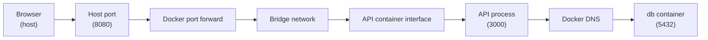

## Table of Contents

1. [Why Networking Feels Weird](#why-networking-feels-weird)
2. [The Mental Model](#the-mental-model)
3. [Host to Container](#host-to-container)
4. [Container to Container](#container-to-container)
5. [The Bind Address](#the-bind-address)
6. [Seeing the Path](#seeing-the-path)
7. [Where Networking Breaks](#where-networking-breaks)
8. [Putting It All Together](#putting-it-all-together)
9. [What's Next](#whats-next)

## Why Networking Feels Weird

The orders API container is running. The logs say `Listening on 3000`. You open `http://localhost:3000` and the browser fails. A few minutes later, the API tries to connect to Postgres at `localhost:5432` and fails too, even though the database container is healthy.

Those two failures look similar because both are connection failures. They are different paths. The browser is outside the container, trying to enter from the host. The API is inside one container, trying to reach another container. The word `localhost` means something different in each place.

A request does not simply "go to Docker." It crosses boundaries. Each boundary answers a different question: where is the caller, is there a published host port, which Docker network carries the traffic, which name resolves on that network, and which address is the process listening on inside the container.

## The Mental Model

A container has its own network namespace. That means it has its own interfaces, routes, ports, and loopback address. From inside the container, `localhost` means that container. From the host, `localhost` means the host. From another container, `localhost` means the other container making the call.

| Viewpoint | What it can see directly | What `localhost` means |
| --- | --- | --- |
| Host | Host ports and Docker-published ports | The Docker host |
| One container | Its own interfaces and loopback | That same container |
| Docker bridge network | Peer containers attached to the network | Each caller's own container |

The useful picture is two paths:



The top path is host-to-container traffic. The bottom path is container-to-container traffic. They use different names, ports, and evidence.

## Host to Container

A process inside a container can listen on port 3000 without opening port 3000 on the host. That port belongs to the container's network namespace. Two containers can both listen on port 3000 internally because they do not share the same port table.

Publishing creates a path from a host address and port to a container port:

```bash
docker run -d \
  --name orders-api \
  -p 127.0.0.1:8080:3000 \
  devpolaris/orders-api:local
```

Read the mapping as `host address:host port -> container port`. A browser on the host calls `127.0.0.1:8080`. Docker forwards that traffic to port `3000` inside the container. The application still listens on `3000`. The outside caller uses `8080`.

The host address matters. Publishing `8080:3000` publishes on all host interfaces by default. Publishing `127.0.0.1:8080:3000` limits the host entry point to loopback. For local APIs, databases, and admin tools, loopback publishing is usually the safer development default.

`EXPOSE 3000` in a Dockerfile does not create this forwarding path. It documents the intended container port. Publishing happens when the container is created.

## Container to Container

Containers on the same user-defined bridge network can reach each other directly on that network. Docker also provides name resolution so a container can use another container's name or network alias instead of a changing IP address.

Compose makes this normal:

```yaml
services:
  api:
    build: .
    environment:
      DATABASE_URL: postgres://orders:orders@db:5432/orders

  db:
    image: postgres:18
```

Compose creates a project network and attaches both services. The API uses `db` because `db` is the service name. Docker's embedded DNS resolves that name to the current database container address on the project network.

Container IP addresses are weak configuration. A container can get a different IP when it is recreated. Service names are stronger because they describe the role the application wants. The API does not care which private address the current database container has. It cares that the database service is reachable as `db` on port 5432.

This is also why service-to-service traffic should not usually go through the host published port. The API does not need to call `localhost:8080` to reach another service on the same Compose network. It should use the service name and the container port.

## The Bind Address

Publishing a port and resolving a name only get traffic to the container. The application process still has to accept the connection.

Many development servers bind to `127.0.0.1` by default. On a laptop without containers, that often works because the browser is on the same machine. Inside a container, `127.0.0.1` is the container's loopback interface. A process bound only to loopback may accept connections from inside the same container while rejecting traffic arriving through the container's network interface.

For an HTTP service that should receive Docker network traffic, the process usually needs to bind to `0.0.0.0` inside the container:

```text
Listening on 0.0.0.0:3000
```

That does not mean the service is automatically exposed to the world. It means the process accepts connections on the container's interfaces. The host-side publication can still be restricted to loopback:

```bash
docker run -p 127.0.0.1:8080:3000 devpolaris/orders-api:local
```

The process bind address and host publish address live at different boundaries.

## Seeing the Path

Start with the host path:

```text
CONTAINER ID   IMAGE                         STATUS        PORTS                        NAMES
9f7a8c2d4d1a   devpolaris/orders-api:local   Up 2 minutes  127.0.0.1:8080->3000/tcp     orders-api
```

The `PORTS` column shows the host-to-container translation. If it is empty, the host has no published entry point. If it says `127.0.0.1:8080->3000/tcp`, the host should call port 8080 and Docker should forward to port 3000 inside the container.

Then check the listener from inside the container:

```bash
docker exec orders-api sh -lc "ss -tlnp || netstat -tlnp"
```

Useful output looks like this:

```text
State   Local Address:Port
LISTEN  0.0.0.0:3000
```

For container-to-container paths, inspect the network and test from the caller:

```bash
docker network inspect orders_default
docker exec orders-api sh -lc "getent hosts db && nc -vz db 5432"
```

`getent hosts db` proves name resolution from the API's viewpoint. `nc -vz db 5432` proves a TCP connection to the database port. If DNS works and TCP fails, the name is fine but the database process or port is not ready.

## Where Networking Breaks

Host-to-container failures often start with missing or wrong port publication. The container can be healthy, the app can listen on 3000, and the browser can still fail because nothing forwards host traffic into the container.

Container-to-container failures often start with `localhost`. From inside the API container, `localhost` is the API container. If the database is another container, the hostname should be `db` or another network alias on a shared Docker network.

Bind-address failures are subtler. The port is published. The container is on the right network. The process is running. The app still only listens on `127.0.0.1` inside the container, so traffic arriving from Docker's bridge cannot reach it.

Stale-container failures happen when the name or port belongs to an old container. You rebuild an image, but the running container still came from the previous image. Or port 8080 is already attached to a container you forgot about. `docker ps -a` tells that story.

## Putting It All Together

The opening failures were not one networking problem. They were two paths:

- Browser to host port to Docker forwarding rule to container port to API process.
- API container to Docker DNS to database container to Postgres port.

The word `localhost` changed meaning depending on the caller. The published host port existed only for callers outside the container. The service name existed on the Docker network. The process bind address decided whether Docker-delivered traffic could actually enter the app.

Once you can draw the path, the evidence lines up. `docker ps` shows the host entry point. `ss` inside the container shows whether the process listens on the right address. `docker network inspect` shows shared network membership and aliases. A caller-side DNS and TCP test shows whether one container can reach another.

## What's Next

Networking explains how traffic crosses the container boundary. The next article covers the filesystem boundary. A container can be reachable and still lose data, hide built files, or write host files with surprising ownership if storage is not placed deliberately.

---

**References**

- [Docker Docs: Networking overview](https://docs.docker.com/engine/network/) - Official overview of Docker networks, drivers, and the default bridge network.
- [Docker Docs: Bridge network driver](https://docs.docker.com/engine/network/drivers/bridge/) - Official details on bridge networks, port publishing, isolation, and container communication.
- [Docker Docs: Publishing and exposing ports](https://docs.docker.com/get-started/docker-concepts/running-containers/publishing-ports/) - Official explanation of host ports, container ports, and default publication behavior.
- [Docker Docs: Networking in Compose](https://docs.docker.com/compose/how-tos/networking/) - Official guide to Compose service names, default networks, and container IP behavior.
