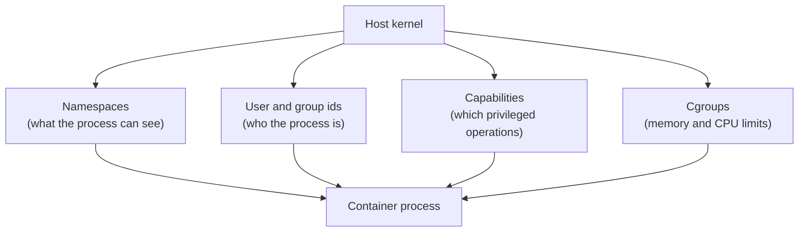

## Table of Contents

1. [Why Isolation Has Edges](#why-isolation-has-edges)
2. [The Mental Model](#the-mental-model)
3. [Container Users](#container-users)
4. [Bind Mount Permissions](#bind-mount-permissions)
5. [Capabilities](#capabilities)
6. [Memory Limits](#memory-limits)
7. [CPU Limits](#cpu-limits)
8. [Where Boundaries Break](#where-boundaries-break)
9. [Putting It All Together](#putting-it-all-together)
10. [What's Next](#whats-next)

## Why Isolation Has Edges

Docker isolation narrows a host process, but the process still uses the host kernel's user, permission, capability, memory, and CPU enforcement systems.

The orders API now has clear network and storage boundaries. Then a different kind of problem appears. A test container writes reports into the project directory, and the host editor cannot modify them. A runaway local process eats all available memory and Docker kills it. A container needs to bind a low port or change a network setting and gets `Operation not permitted`. Someone says "but it is inside Docker" as if that should answer everything.

Docker containers are isolated processes, not separate physical machines. They share the host kernel. Docker uses Linux features such as namespaces, cgroups, capabilities, and filesystem mounts to give each container a controlled view of the system. That control is real, but it has edges.

Understanding those edges prevents two opposite mistakes: treating a container as harmless because it is "inside Docker," or treating it as a full VM with completely separate users, resources, and kernel behavior.

## The Mental Model

The container process runs on the host kernel with a narrowed view.

The simple rule is that Docker narrows several host-controlled systems at once. Namespaces decide what the process can see, users decide what files it can access, capabilities decide which privileged operations it can attempt, and cgroups decide how much CPU and memory it may consume.



Namespaces shape the process's view of files, processes, and networking. User and group ids decide file access. Capabilities break root privilege into smaller pieces. Cgroups limit resource usage. Docker combines these into a container boundary.

## Container Users

Container users are numeric Linux users and groups applied to the process running inside the container.


*User identity, capabilities, and cgroup limits protect different boundaries and should not be treated as interchangeable.*

Inside a container, a process still has a user id and group id:

```bash
docker exec orders-api id
```

Example:

```text
uid=1000(node) gid=1000(node) groups=1000(node)
```

The username is convenient, but the numeric ids are the important part. Linux filesystems store ownership as numbers. If the container process runs as uid 1000 and writes to a mounted directory, the host sees files owned by uid 1000. If the process runs as uid 0, the host sees root-owned files.

Images can set a default user:

```dockerfile
USER node
```

Runs can override it:

```bash
docker run --user 1000:1000 devpolaris/orders-api:local
```

Running as a non-root user narrows what the process can do inside the container and reduces the damage from mistakes. It does not erase every risk. A non-root process can still write to paths it owns, make network requests, consume resources, and modify bind-mounted files if permissions allow.

## Bind Mount Permissions

Bind mount permissions expose host filesystem ownership directly to the container process.


*A bind mount exposes a real host path, so UID and mode bits still decide whether the container process can read or write.*

Bind mounts make user ids visible because they connect a host path directly into the container.

```bash
docker run --rm \
  --mount type=bind,src="$(pwd)/reports",dst=/reports \
  devpolaris/orders-api:local \
  sh -lc "node test.js > /reports/results.txt"
```

If that command runs as root inside the container, `results.txt` may be root-owned on a Linux host. The next host-side edit fails because your normal user does not own the file.

There are several ways to avoid that. Run the container as your host uid and gid for development commands. Make the image's application directories writable by the runtime user during the build. Use named volumes for service-owned data rather than bind-mounting arbitrary host directories. Mount host paths read-only when the container only needs to read them.

The exact behavior can differ on Docker Desktop because the daemon runs inside a VM and file sharing translates between host and VM filesystems. The model still helps: ask which numeric user wrote the file and which filesystem boundary carried it.

## Capabilities

Linux capabilities are smaller privilege bits that split up what root-like processes are allowed to do.

Example: a process may need `NET_BIND_SERVICE` to bind a low port such as `80`, but it does not need every device and kernel permission on the host. Capabilities let you grant that narrower operation instead of making the whole container privileged.

On Linux, root privilege is split into capabilities. Docker grants a default set and drops many others. That is why root inside a container can install packages into the container filesystem but may still fail to change kernel networking behavior.

For example, a process may need extra privileges for packet capture, mounting filesystems, or changing network settings. Docker can add capabilities:

```bash
docker run --cap-add NET_ADMIN some-image
```

It can also drop them:

```bash
docker run --cap-drop ALL --cap-add NET_BIND_SERVICE some-image
```

Capability changes should be narrow and explained by the workload. `--privileged` is the broad escape hatch. It grants much more access to host devices and kernel features, which is why it is a poor default for application containers. If a tutorial says to use `--privileged`, treat that as a reason to ask which exact capability or device the container actually needs.

## Memory Limits

Memory limits are cgroup ceilings that tell the kernel how much memory the container's process tree may allocate.

Example: `--memory 512m` says the process tree can allocate up to 512 MB. If a leak tries to grow beyond that ceiling, the kernel can kill the process instead of letting it consume the whole host.

By default, a container can use as much memory as the host kernel scheduler allows. That is convenient for local experiments and dangerous for noisy processes. Docker memory limits use cgroups to put a ceiling around the container.

```bash
docker run --memory 512m devpolaris/orders-api:local
```

When the process goes beyond the allowed memory, the kernel can kill it. From Docker's viewpoint, the container exits. From the application's viewpoint, it may appear as an abrupt termination with little graceful cleanup. That is why an out-of-memory exit is different from a handled application error.

Memory limits help in production and in local work. A runaway test should not be able to consume the whole laptop. A local database should have enough memory to behave realistically, but not so much that it hides a leak until CI or staging.

Swap settings add more detail, and platform support varies. The beginner-safe rule is to set a clear memory limit when you need predictable behavior, then read container state and host logs if a process disappears under load.

## CPU Limits

CPU limits are cgroup scheduling rules that control how much CPU time a container can consume under host load.

Example: `--cpus "1.5"` does not create a new CPU. It tells the kernel scheduler to give this container process tree roughly one and a half CPUs worth of runtime when CPU is contested.

CPU limits are also cgroup controls. The most readable flag is `--cpus`:

```bash
docker run --cpus "1.5" devpolaris/orders-api:local
```

That limits how much CPU time the container can consume. It does not make the process see a different program. It changes scheduling. Under CPU pressure, the process may slow down, time out, or expose race conditions that never appeared when it could use the whole machine.

CPU shares and quotas are useful when several containers run on the same host. A local stack with an API, worker, database, and search service can feel random if one service consumes all CPU. Limits and shares make the resource boundary explicit.

Resource limits are not a replacement for application tuning. They are the fence around bad behavior and the shape of expected capacity. If the service constantly hits the fence, the application or sizing decision still needs attention.

## Where Boundaries Break

Permissions break when the user model is ignored. A container writes to a bind mount as root, then the host user cannot clean up. Or an image switches to a non-root user before making `/app` writable, so startup fails with a permission error.

Security boundaries break when broad privileges become habit. A container that only needs to bind a low port should not get `--privileged`. A container that only needs read access to source code should not get a writable bind mount.

Resource boundaries break in two directions. Without limits, one container can harm the host or other containers. With limits that are too tight, the kernel kills the process or CPU throttling makes ordinary requests time out. The symptom appears inside the application, but the cause sits at the runtime boundary.

Platform assumptions break when moving between Linux Docker Engine and Docker Desktop. File sharing, uid behavior, host networking, and cgroup details can differ. The mental model still applies, but the evidence may live in a different place.

## Putting It All Together

The opening problems came from treating the container boundary as either stronger or simpler than it is:

- Container users are numeric Linux users from the filesystem's point of view.
- Bind mounts expose host ownership and write permissions directly to the container process.
- Capabilities decide which privileged kernel operations the process can perform.
- Memory and CPU limits use cgroups to put resource fences around the container.
- Docker isolation narrows a host process; it does not turn the process into a separate machine.

Once those pieces are visible, permission errors and resource kills stop feeling arbitrary. They become questions about which user wrote the file, which privilege was missing, which limit was hit, and which host boundary carried the effect.

## What's Next

The next Docker article uses Compose to put these choices into one application graph: services, images, commands, environment, networks, volumes, health, and repeatable lifecycle commands.


*The users and limits summary separates permission identity from resource ceilings.*

---

**References**

- [Docker Docs: Resource constraints](https://docs.docker.com/engine/containers/resource_constraints/) - Official guide to memory, swap, CPU, and GPU constraints for containers.
- [Docker Docs: docker container run](https://docs.docker.com/reference/cli/docker/container/run/) - CLI reference for `--user`, capabilities, resource flags, and runtime security options.
- [Docker Docs: Isolate containers with a user namespace](https://docs.docker.com/engine/security/userns-remap/) - Official guide to user namespace remapping and host uid/gid considerations.
- [Docker Docs: Bind mounts](https://docs.docker.com/engine/storage/bind-mounts/) - Official notes on bind mount write access, host coupling, Docker Desktop behavior, and read-only mounts.
