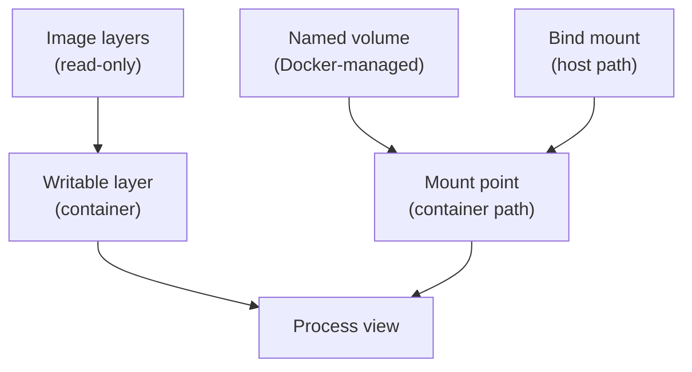

## Table of Contents

1. [Why Storage Needs a Boundary](#why-storage-needs-a-boundary)
2. [The Mental Model](#the-mental-model)
3. [The Writable Layer](#the-writable-layer)
4. [Named Volumes](#named-volumes)
5. [Bind Mounts](#bind-mounts)
6. [Mounts Hide Files](#mounts-hide-files)
7. [Ownership](#ownership)
8. [Seeing Mounts](#seeing-mounts)
9. [Where Storage Breaks](#where-storage-breaks)
10. [Putting It All Together](#putting-it-all-together)
11. [What's Next](#whats-next)

## Why Storage Needs a Boundary

The orders API is reachable now. The browser can call it through a published port, and the API can reach Postgres by service name. Then storage creates a different kind of surprise. You remove and recreate the database container, and yesterday's orders are gone. You bind-mount the source directory for live editing, and suddenly the `dist` directory that existed in the image has disappeared. You run tests in a container, and the generated files on the host are owned by a user your editor cannot modify.

Those are all questions about where a path gets its contents and how long those contents should live.

A container has a filesystem view, but Docker assembles that view from several places. Some files come from read-only image layers. Some runtime changes go into the container's writable layer. Some paths are replaced by volumes Docker manages. Some paths are replaced by host directories through bind mounts. The process sees one path tree, but Docker built that tree from sources with different lifetimes.

## The Mental Model

The image is the base filesystem. When Docker creates a container, it adds a writable layer on top. That writable layer catches changes the container makes at runtime unless a mount redirects the path elsewhere.

Mounts act like doors cut into that filesystem view. At a mount point, Docker shows content from somewhere else. A named volume shows Docker-managed storage. A bind mount shows a specific host path. The process does not need to know that `/var/lib/postgresql/data` came from a volume or that `/app` came from your laptop. It just sees files.



The important rule is that a mount replaces what the process sees at its destination path. The underlying image files may still exist in the image, but the container view at that path comes from the mount while the mount is active.

## The Writable Layer

The writable layer is created with the container and removed with the container. It is useful precisely because it is disposable. A process can write temporary files, package managers can create caches during a debugging shell, and an application can write short-lived output without changing the image.

This is why two containers from the same image get separate runtime filesystems. They share the read-only image layers, but each gets its own writable layer. If one container writes `/tmp/audit.log`, the other container does not automatically see it.

The writable layer is the wrong place for data that defines the application over time. A database directory, user uploads, queue state, and source-code edits need a lifetime outside one disposable container. If they live only in the writable layer, `docker rm` removes them.

## Named Volumes

A named volume is storage Docker creates and manages outside the container's writable layer. You mount it into a container at a path:

```bash
docker volume create orders-db-data

docker run -d \
  --name orders-db \
  --mount source=orders-db-data,target=/var/lib/postgresql/data \
  postgres:18
```

Postgres sees `/var/lib/postgresql/data`. Docker maps that path to the `orders-db-data` volume. If you remove the `orders-db` container and create another one with the same volume mounted at the same path, the new container sees the old database files.

The useful idea is ownership. Docker owns the volume's location on the host. The database owns the contents from inside the container. You usually do not edit the volume directory by hand. You let the database write its files, and you let Docker attach that storage to containers.

Named volumes fit data that belongs to Docker-managed services: local databases, package caches shared across throwaway containers, and service state that should survive recreation.

## Bind Mounts

A bind mount takes a path that already exists on the host and shows it inside the container:

```bash
docker run --rm \
  --name orders-api \
  --mount type=bind,src="$(pwd)",dst=/app \
  -p 127.0.0.1:8080:3000 \
  devpolaris/orders-api:local
```

Now `/app` inside the container is the current host directory. Edit a file on the host, and the container sees the edit. Write a file in `/app` from inside the container, and the host sees the file. The source of truth is the host path.

That makes bind mounts excellent for development loops. You can run a tool inside a container while editing source in your normal editor. You can mount one config file for a local experiment. You can collect generated reports into a host directory.

Bind mounts also carry host coupling. The path must exist in the right place. The Docker environment must be allowed to access it. On Docker Desktop, the path crosses a small virtual machine boundary. On Linux, the path is directly on the host filesystem. Permissions come from user and group ids, not from the fact that Docker is involved.

Use a bind mount when the host should own the files. Use a named volume when Docker should own the storage location and containers should consume it.

## Mounts Hide Files

Mount hiding is one of the least obvious Docker storage behaviors. If a mount destination already has files from the image, the mount covers them for that container.

Imagine the image contains:

```text
/app
  dist/
    server.js
  node_modules/
  package.json
```

That image can run because `CMD ["node", "dist/server.js"]` finds the built file. Now you start the container with this bind mount:

```bash
docker run --rm \
  --mount type=bind,src="$(pwd)",dst=/app \
  devpolaris/orders-api:local
```

If the host directory does not contain `dist/server.js`, the command fails. Docker did not delete the image's `dist` directory. The bind mount replaced the container's view of `/app` with the host directory. The process looks at `/app/dist/server.js`, sees the mounted host directory, and finds whatever the host has there.

This is the storage equivalent of `localhost` in networking. The same path can refer to a different source depending on the container's runtime configuration.

## Ownership

Containers share the host kernel. File ownership is still represented by numeric user ids and group ids. A process running as root inside a container can write root-owned files into a bind-mounted host directory. On the host, your normal user may then fail to edit or delete those files.

You can see the process user from inside the container:

```bash
docker exec orders-api id
```

Example:

```text
uid=1000(node) gid=1000(node) groups=1000(node)
```

The numeric uid and gid matter more than the username. If the container writes to a bind mount as uid 1000 and your host user is also uid 1000, ownership usually feels natural. If the container writes as uid 0, the host sees root-owned files.

Named volumes have ownership issues too, but they usually show up inside the container path. A database image often initializes its data directory with the expected user. A custom image that writes to `/data` should make that path writable by the user the process will run as.

## Seeing Mounts

`docker inspect` shows how Docker assembled the filesystem view. The useful part is the `Mounts` array:

```json
[
  {
    "Type": "bind",
    "Source": "/Users/senlin/projects/orders-api",
    "Destination": "/app",
    "RW": true
  },
  {
    "Type": "volume",
    "Name": "orders-db-data",
    "Destination": "/var/lib/postgresql/data",
    "RW": true
  }
]
```

Read each entry from destination backward. The process sees `/app`; Docker fills that path from a host source because the type is `bind`. The process sees `/var/lib/postgresql/data`; Docker fills that path from a named volume because the type is `volume`.

You can inspect the volume itself:

```bash
docker volume inspect orders-db-data
```

That output includes a mountpoint on the Docker host. Treat it as evidence of where Docker stores the volume, not as the normal editing interface. For application data, use the application, a backup process, or a deliberate restore flow.

## Where Storage Breaks

Data disappears when it was written to the container's writable layer and the container was removed. This is common with databases started without a volume. The database worked while the container existed. It had no durable home after `docker rm`.

Built files disappear when a mount hides the path where the image put them. This is common with development bind mounts at `/app`. The image may contain `dist`, but the container sees the host's `/app` instead.

Permissions break when the writing process and host editor do not agree on ownership. This is common when a container writes into a bind mount as root.

Reset commands surprise people when they remove volumes. `docker compose down` removes containers and networks for the Compose project. `docker compose down -v` also removes named volumes declared by the Compose file. That `-v` is the difference between "start clean containers" and "delete local service data."

## Putting It All Together

The opening storage problems all come from path lifetime and ownership:

- Database data should not live only in a disposable container layer.
- Source bind mounts show host files and can hide image files at the same destination.
- Host ownership still matters when a container writes through a bind mount.
- Named volumes let Docker manage durable local service storage.
- Bind mounts let the host own files that containers should see directly.

The container process sees one filesystem tree. Docker builds that tree from image layers, a writable layer, and any mounts. Once you know which source owns a path, storage behavior becomes much less surprising.

## What's Next

Storage showed that containers share more with the host than they first appear to. The next article makes that boundary explicit for users, file permissions, Linux capabilities, memory, and CPU limits.

---

**References**

- [Docker Docs: Storage](https://docs.docker.com/engine/storage/) - Official overview of writable layers, volumes, bind mounts, tmpfs mounts, and persistence.
- [Docker Docs: Volumes](https://docs.docker.com/engine/storage/volumes/) - Official guide to Docker-managed persistent volumes and their lifecycle.
- [Docker Docs: Bind mounts](https://docs.docker.com/engine/storage/bind-mounts/) - Official guide to host path mounts, mount obscuring behavior, read-only mounts, and bind mount constraints.
