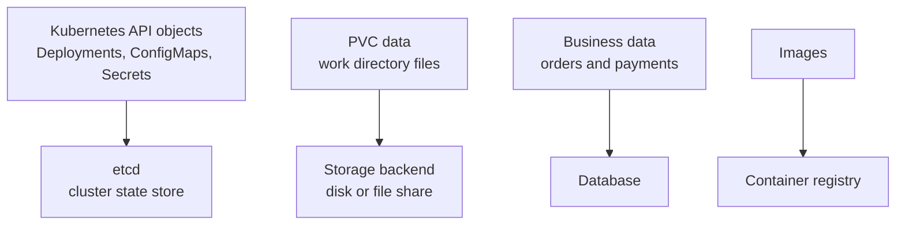

## Table of Contents

1. [Backups Start with Knowing Where State Lives](#backups-start-with-knowing-where-state-lives)
2. [Kubernetes API Objects and etcd](#kubernetes-api-objects-and-etcd)
3. [Application Data Is Often Outside etcd](#application-data-is-often-outside-etcd)
4. [A Recovery Inventory for devpolaris-orders-api](#a-recovery-inventory-for-devpolaris-orders-api)
5. [Backing Up Manifests and Cluster State](#backing-up-manifests-and-cluster-state)
6. [Volume Snapshots and PVC Recovery](#volume-snapshots-and-pvc-recovery)
7. [Restore Drills and Verification](#restore-drills-and-verification)
8. [Failure Mode: The Backup Exists but Cannot Restore the Service](#failure-mode-the-backup-exists-but-cannot-restore-the-service)
9. [A Beginner Recovery Checklist](#a-beginner-recovery-checklist)

## Backups Start with Knowing Where State Lives

A backup plan fails when it protects the wrong thing. In Kubernetes, state is split across several places. The API server stores objects such as Deployments, ConfigMaps, Secrets, Services, PVCs, and RBAC rules. Persistent volumes store mounted application files. Databases and object stores often live outside the cluster. Container images live in a registry.

Backup and restore basics are about mapping those locations before choosing a tool. If `devpolaris-orders-api` loses a ConfigMap, the fix is different from losing a PostgreSQL table or a PVC full of invoice work files. One restore command cannot cover every kind of state unless it knows all the systems involved.



The first operational skill is inventory. List what the service needs to run, where each piece lives, who owns it, and how it is restored.

## Kubernetes API Objects and etcd

Kubernetes stores cluster state in etcd, a distributed key-value store used by the control plane. When you create a ConfigMap, Secret, Deployment, or PVC, that object becomes API state. If etcd is lost without a backup, the cluster can lose the record of what should exist.

Many managed Kubernetes platforms handle control plane backups for you, but you still need to understand the boundary. A managed control plane backup may restore API objects. It does not automatically restore data inside an external database. It may not restore a deleted cloud disk if the disk was removed by a reclaim policy.

For self-managed clusters, etcd snapshot commands are part of the administrator runbook. A simplified snapshot command looks like this:

```bash
$ ETCDCTL_API=3 etcdctl snapshot save /var/backups/etcd/snapshot-2026-05-07.db   --endpoints=https://127.0.0.1:2379   --cacert=/etc/kubernetes/pki/etcd/ca.crt   --cert=/etc/kubernetes/pki/etcd/server.crt   --key=/etc/kubernetes/pki/etcd/server.key
Snapshot saved at /var/backups/etcd/snapshot-2026-05-07.db
```

Do not copy this blindly into a managed cluster. The file paths and operational responsibility vary by installation. The point is the concept: API state has its own backup path, and that path is separate from application data backups.

## Application Data Is Often Outside etcd

A common beginner mistake is assuming that backing up Kubernetes backs up the application. A Deployment manifest can be restored perfectly while the database is still empty. A PVC object can be restored while the underlying disk data is gone. A Secret can be restored while the external credential it points to has already been revoked.

`devpolaris-orders-api` has at least four state surfaces:

| State | Example | Backup Owner |
|-------|---------|--------------|
| Kubernetes config | ConfigMaps, Secrets, Deployment YAML | Platform or GitOps system |
| Work files | PVC mounted at `/var/lib/devpolaris/orders-work` | Storage platform |
| Business records | PostgreSQL orders tables | Database team or managed database |
| Images | `ghcr.io/devpolaris/orders-api:1.18.0` | CI and registry retention |

This table prevents false confidence. If someone says "we have Kubernetes backups," ask which row they mean. A real recovery plan covers every row needed to serve traffic again.

## A Recovery Inventory for devpolaris-orders-api

A small recovery inventory can live beside the service runbook. It should be specific enough that a teammate can use it during a restore drill.

```text
Service: devpolaris-orders-api
Namespace: devpolaris-prod
Deployment: orders-api
ConfigMap: orders-api-config
Secret: orders-api-secrets
PVC: orders-api-workdir
Database: postgres cluster orders-prod, database orders
Registry image: ghcr.io/devpolaris/orders-api
Critical endpoints: /healthz, /readyz, /internal/config
```

Add recovery expectations, not only object names.

```text
Recovery expectations
- Config and workload manifests can be reapplied from Git.
- Secret material comes from the production secret manager.
- PVC workdir can be restored from the latest storage snapshot if invoice handoff files are missing.
- Orders database recovery follows the database team's point-in-time restore process.
- Service is considered restored only after /readyz passes and a test order can be read.
```

That last line matters. Restore is not complete when YAML applies successfully. Restore is complete when the application performs the business behavior users need.

## Backing Up Manifests and Cluster State

Git is not a full backup of a Kubernetes cluster, but it is a strong backup of intended configuration when you practice declarative delivery. If your Deployments, ConfigMaps, Services, RBAC, and PVC manifests live in Git, you can recreate much of the desired API state.

A simple export command can help during learning, but it is not a clean source of truth because live objects contain generated fields.

```bash
$ kubectl get deploy,svc,configmap,secret,pvc -n devpolaris-prod -o yaml > devpolaris-prod-api-objects.yaml
```

That file may contain resource versions, managed fields, timestamps, and data you should not commit. Use exports for emergency inspection, not as your normal backup strategy.

A better steady-state pattern is:

| Object Type | Source of Truth |
|-------------|-----------------|
| Deployment and Service | Git manifests or Helm chart |
| ConfigMap | Git manifest when values are non-secret |
| Secret | External secret store or encrypted manifest process |
| PVC | Git manifest for the claim, storage snapshot for the data |
| RBAC | Git manifests reviewed by platform team |

The API object and the data behind it are different layers. Back up both when both matter.

## Volume Snapshots and PVC Recovery

Many CSI storage drivers support VolumeSnapshot resources. A snapshot captures the state of a volume at a point in time. The exact guarantees depend on the driver and storage system, especially when applications are writing during the snapshot.

A snapshot object usually points at a PVC.

```yaml
apiVersion: snapshot.storage.k8s.io/v1
kind: VolumeSnapshot
metadata:
  name: orders-api-workdir-2026-05-07
  namespace: devpolaris-prod
spec:
  volumeSnapshotClassName: standard-snapshot
  source:
    persistentVolumeClaimName: orders-api-workdir
```

After creation, inspect readiness.

```bash
$ kubectl get volumesnapshot -n devpolaris-prod
NAME                            READYTOUSE   SOURCEPVC            RESTORESIZE   AGE
orders-api-workdir-2026-05-07   true         orders-api-workdir    20Gi          3m
```

A restore often creates a new PVC from a snapshot, then mounts that claim into a recovery Pod or replacement workload. Do not overwrite the original path in production until you have verified the restored data.

```yaml
apiVersion: v1
kind: PersistentVolumeClaim
metadata:
  name: orders-api-workdir-restore
  namespace: devpolaris-prod
spec:
  storageClassName: standard-retain
  dataSource:
    name: orders-api-workdir-2026-05-07
    kind: VolumeSnapshot
    apiGroup: snapshot.storage.k8s.io
  accessModes:
    - ReadWriteOnce
  resources:
    requests:
      storage: 20Gi
```

Snapshots are not always application-consistent. If the app writes several files as one logical operation, a storage snapshot might capture the middle of that operation. Databases need database-aware backup procedures, not only disk snapshots.

## Restore Drills and Verification

A restore drill is a planned practice restore. It proves that your backup can become a working service. Without drills, teams often discover missing permissions, missing encryption keys, expired registry tags, or incomplete runbooks during a real outage.

For `devpolaris-orders-api`, a safe drill can use a temporary namespace.

```bash
$ kubectl create namespace devpolaris-restore-drill
namespace/devpolaris-restore-drill created

$ kubectl apply -n devpolaris-restore-drill -f k8s/prod/orders-api-configmap.yaml
configmap/orders-api-config created

$ kubectl get pods -n devpolaris-restore-drill
NAME                          READY   STATUS    RESTARTS   AGE
orders-api-6c78464b7b-ppt5n   1/1     Running   0          74s
```

The useful verification goes beyond `Running`.

```bash
$ kubectl logs deploy/orders-api -n devpolaris-restore-drill | grep 'configuration loaded' | tail -1
2026-05-07T15:03:22.721Z INFO configuration loaded service=devpolaris-orders-api databaseUrl=present workdir=/var/lib/devpolaris/orders-work

$ kubectl exec deploy/orders-api -n devpolaris-restore-drill -- wget -qO- http://127.0.0.1:8080/readyz
ok
```

A restored Pod that cannot connect to its database is not restored. A restored volume that contains files but wrong ownership is not restored. Verification should match the service's real job.

## Failure Mode: The Backup Exists but Cannot Restore the Service

The painful failure is not "there was no backup." It is "there was a backup, but it did not restore the service." This happens when the backup covers only one layer.

A realistic incident might look like this:

```text
Incident: orders-api restore drill failed
Observed: Deployment restored, Pods CrashLoopBackOff
Pod log: database migration table missing
Kubernetes objects: restored from Git
PVC: restored from snapshot
Database: no restore performed in drill namespace
Result: service cannot pass /readyz
```

The diagnostic path follows the state inventory. Check API objects, then mounted storage, then external dependencies.

```bash
$ kubectl get deploy,configmap,secret,pvc -n devpolaris-restore-drill
$ kubectl logs deploy/orders-api -n devpolaris-restore-drill --previous
$ kubectl exec deploy/orders-api -n devpolaris-restore-drill -- ls -l /var/lib/devpolaris/orders-work
$ kubectl describe secret orders-api-secrets -n devpolaris-restore-drill
```

If the database was not restored or reachable, no amount of Kubernetes object recovery will make the service healthy. The fix is to update the runbook so database restore is part of the drill, with a test database target and clear ownership.

## A Beginner Recovery Checklist

A backup checklist should be short enough to use and specific enough to prevent false confidence. Start with the service, then map state to restore evidence.

| Layer | Backup Question | Restore Evidence |
|-------|-----------------|------------------|
| Manifests | Can we recreate intended objects? | `kubectl apply` succeeds in a test namespace |
| Secrets | Can the service receive valid credentials? | App logs redacted `present` checks and auth succeeds |
| PVC data | Can files be restored to a claim? | Recovery Pod lists expected files |
| Database | Can business records be recovered? | Application reads a known test order |
| Registry | Can Kubernetes pull the required image? | Pod starts with the expected image digest |
| DNS and ingress | Can users reach the service? | Health check passes through the real route |

Run the checklist before you need it. A restore drill turns backup from a hopeful file into an operational capability. The goal is not to memorize every Kubernetes recovery tool. The goal is to know which state you lost, which system owns that state, and which evidence proves the service is useful again.

### Restore Order Matters

A restore plan also needs an order. Restoring a Deployment before its Secret, PVC, or database is ready may create noisy CrashLoopBackOff Pods. That noise is not fatal, but it can hide the real missing dependency.

For `devpolaris-orders-api`, a clean restore order is usually infrastructure first, data second, workload last.

```text
Suggested restore order
1. Namespace, RBAC, and service accounts.
2. ConfigMaps and Secret delivery mechanism.
3. PVCs or restored claims.
4. Database or external dependency restore.
5. Deployment, Service, and ingress route.
6. Readiness checks and one business transaction check.
```

This order prevents the application from starting into an empty environment. It also gives you clearer checkpoints. If PVC restore fails at step 3, you know the Deployment is not the problem yet.

You can still use automation. The point is not to run every step by hand. The point is for the automation to respect dependency order and report which layer failed.

### What Not to Call a Backup

Several useful things are not backups by themselves. A replica is not a backup because it can faithfully copy deletion or corruption. A retained PV is not a backup because it may live in the same failure domain. A Git manifest is not a data backup because it cannot recreate rows in a database.

This distinction helps when people use the word backup loosely during planning.

| Artifact | Useful For | Missing Piece |
|----------|------------|---------------|
| Git manifests | Recreating intended Kubernetes objects | Runtime data and secret material |
| Replica count of 3 | Surviving one Pod failure | Deleted or corrupted data |
| Retained PV | Preventing automatic disk deletion | Point-in-time recovery |
| Container image tag | Recreating software version | Config, data, and credentials |
| Database read replica | Read scaling or failover | Protection from logical deletion unless configured |

A real backup gives you a separate recovery point and a tested restore path. The word tested matters. Until you have restored from it, the backup is only a candidate.

A restore drill should leave a small evidence bundle. Keep it boring and specific so the next drill can compare results.

```text
Restore drill evidence
Namespace: devpolaris-restore-drill
Image: ghcr.io/devpolaris/orders-api@sha256:7b1f4c
Config loaded: yes
Secret delivery: redacted presence checks passed
PVC files restored: 128 files
Readiness: /readyz returned ok
Business check: test order ord_restore_001 read successfully
```

That evidence is more useful than saying "restore succeeded." It names the layers that were tested and gives the next engineer a baseline.

---

**References**

- [Operating etcd clusters for Kubernetes](https://kubernetes.io/docs/tasks/administer-cluster/configure-upgrade-etcd/) - Official administration guide that includes snapshot commands and restore concepts for cluster state.
- [Volume Snapshots](https://kubernetes.io/docs/concepts/storage/volume-snapshots/) - Official concept page for snapshot resources and CSI snapshot behavior.
- [Persistent Volumes](https://kubernetes.io/docs/concepts/storage/persistent-volumes/) - Official concept page for PersistentVolume and PersistentVolumeClaim lifecycle, binding, access modes, and reclaim policy.
- [Kubernetes Secrets](https://kubernetes.io/docs/concepts/configuration/secret/) - Official concept page for Secret types, storage cautions, and Pod usage patterns.
- [Troubleshooting Applications](https://kubernetes.io/docs/tasks/debug/debug-application/) - Official debugging entry point for inspecting Pods, events, logs, and application failures.
