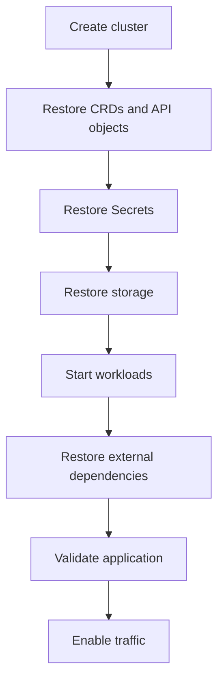

## Table of Contents

1. [Why does recovery begin by locating state?](#why-does-recovery-begin-by-locating-state)
2. [What do etcd snapshots, Git, and cluster backups recover?](#what-do-etcd-snapshots-git-and-cluster-backups-recover)
3. [How can persistent data be copied consistently?](#how-can-persistent-data-be-copied-consistently)
4. [Which Secrets, artifacts, and external services extend the recovery boundary?](#which-secrets-artifacts-and-external-services-extend-the-recovery-boundary)
5. [How do RPO, RTO, and failure scope shape the design?](#how-do-rpo-rto-and-failure-scope-shape-the-design)
6. [Why must a restore drill rebuild and validate the whole application?](#why-must-a-restore-drill-rebuild-and-validate-the-whole-application)
7. [How does the five-step model turn an inventory into a recovery plan?](#how-does-the-five-step-model-turn-an-inventory-into-a-recovery-plan)
8. [Check Your Answers](#check-your-answers)
9. [References](#references)

The explanation follows 7 practical questions:

1. **Why does recovery begin by locating state?**
2. **What do etcd snapshots, Git, and cluster backups recover?**
3. **How can persistent data be copied consistently?**
4. **Which Secrets, artifacts, and external services extend the recovery boundary?**
5. **How do RPO, RTO, and failure scope shape the design?**
6. **Why must a restore drill rebuild and validate the whole application?**
7. **How does the five-step model turn an inventory into a recovery plan?**

## Why does recovery begin by locating state?
<!-- section-summary: A recovery plan starts by finding every piece of state, its authoritative home, and the mechanism that can recreate it. -->

The easiest way to understand Kubernetes backup is to ask a more fundamental question: if the entire system disappeared, what information would be required to recreate the application correctly?

That question leads to the central principle:

> A backup is not a copy of “the cluster.” It is a collection of recovery sources for every piece of state the system depends on.

**State** is information that must survive long enough for the system to continue correctly. Some state describes the desired system, such as a Deployment manifest. Other state records what the system has actually done, such as database rows or user uploads.

Consider PostgreSQL running in Kubernetes:

```text
Git
└── Deployment, StatefulSet, and Service manifests
        ↓
Kubernetes API
└── live objects stored in etcd

PostgreSQL Pod
└── actual database rows
        ↓
PersistentVolume
        ↓
Cloud disk or storage system
```

The same application may also depend on state elsewhere:

```text
Secret            → etcd or an external secret manager
Container image   → container registry
DNS               → DNS provider
Load balancer     → cloud provider
TLS certificate   → Kubernetes, a certificate manager, or an external CA
User uploads      → object storage
```

Follow one request through that system. A customer opens the site through DNS and a load balancer. The frontend image supplies the executable code, a Deployment describes how to run it, a Secret supplies the database credential, PostgreSQL returns the customer record from its disk, and object storage returns an uploaded receipt. Losing any one of those pieces can break the request even when every other backup is healthy.

This is why “rebuild” and “restore” are related but different operations. Git and infrastructure code can often **rebuild** replaceable structure: a cluster, Namespace, Deployment, or DNS record. A database backup or object-store replica **restores** information that cannot be derived from those declarations. The recovery plan needs both paths and must know where they meet.

There is no single place containing “the application.” An etcd backup protects Kubernetes API state, but it does not copy PostgreSQL rows from a persistent disk. The first recovery task is therefore to find every stateful component, determine where its authoritative copy lives, and assign it a recovery mechanism.

An **authoritative copy** is the version the system treats as the source of truth. A generated search index may be rebuilt from a database, while the underlying customer or order records may be irreplaceable. That difference determines what must be backed up and what can be reproduced.

A **CustomResourceDefinition (CRD)** extends the Kubernetes API with another kind of object, often for an operator to manage. The definition and the objects created from it are API state, so their recovery order matters later.

A state map can look like this:

| State | Usually lives in | Typical recovery source |
|---|---|---|
| Deployments, Services, StatefulSets | etcd | Git and/or cluster backup |
| CustomResourceDefinitions | etcd | Git plus cluster backup |
| Dynamically created Kubernetes resources | etcd | Cluster backup |
| Secrets | etcd or external secret manager | Cluster backup or secret-manager recovery |
| Application database | PV or managed database | Volume snapshot or database backup |
| User uploads | Object storage | Object-store replication or versioning |
| Container images | Registry | Registry replication or retention |
| DNS | DNS provider | Infrastructure as code or provider configuration |
| Cloud resources | Cloud provider | Terraform, Pulumi, or another infrastructure source |
| Encryption keys | KMS or HSM | Key-management recovery mechanism |

A **KMS** is a key management system, and an **HSM** is a hardware security module. Both can hold cryptographic keys required to interpret encrypted backups. Losing the key can make a perfectly copied backup unusable.

The complete recovery design should answer:

- What state exists?
- Where does each piece actually live?
- Which copy is authoritative?
- How will it be backed up?
- How frequently is it protected?
- In what order must the pieces be restored?
- Which credentials or encryption keys are required?
- How will the team prove the restore works?

If any answer is missing, the recovery design probably has a gap.

A useful beginner exercise is to start with one user-visible operation and trace every durable fact it touches. For “place an order,” the order row may live in PostgreSQL, a receipt may live in object storage, a payment reference may live in an external service, and the configuration that connects those systems may live in Kubernetes and Git. That trace turns an abstract inventory into a concrete dependency map.

## What do etcd snapshots, Git, and cluster backups recover?
<!-- section-summary: etcd snapshots protect API state, Git protects reviewed desired configuration, and cluster backups can preserve live objects not represented in Git. -->

Kubernetes API state is stored through the API server in **etcd**, Kubernetes' authoritative key-value datastore:

```text
kubectl → API server → etcd
```

Namespaces, Deployments, StatefulSets, Services, ConfigMaps, Secrets, CustomResourceDefinitions, RBAC objects, Jobs, Ingresses, and PVC objects are examples of state that can be preserved in an etcd snapshot.

After catastrophic control-plane failure, restoring the snapshot lets the API server see those older objects again. Kubernetes controllers then reconcile them. The important idea is that recovery does not restore the old running container processes. It restores enough API state for Kubernetes to recreate the desired workloads.

### An etcd snapshot does not contain volume data

Suppose etcd stores this claim:

```yaml
apiVersion: v1
kind: PersistentVolumeClaim
metadata:
  name: postgres-data
```

The claim object can be present in the snapshot while its disk holds the actual `customers`, `orders`, `payments`, and `invoices` tables. The PVC describes and references storage; it does not contain those database records. The disk needs its own recovery source.

### Git and live cluster state solve different problems

Git can contain reviewed desired configuration:

```text
deployment.yaml
service.yaml
ingress.yaml
configmap.yaml
```

A GitOps controller such as Argo CD or Flux can use that repository to recreate the declared objects. Git contributes history, review, versioning, desired configuration, and a basis for reconstructing environments.

The live cluster may also contain objects that were never committed:

```text
Git
├── Deployment
├── Service
└── Ingress

Cluster
├── Deployment
├── Service
├── Ingress
├── generated Secret
├── dynamically created PVC
├── certificate
├── operator-generated resources
└── runtime metadata
```

A Kubernetes-resource or cluster backup can preserve point-in-time API objects, including selected runtime-created resources. Git is therefore not necessarily the whole cluster state, and an etcd or cluster backup is not a replacement for Git. A mature plan often uses both.

This is also the difference between desired state and business state. A WordPress manifest can recreate replicas, an image reference, and a database endpoint. It cannot recreate posts, users, comments, orders, transactions, or uploads stored in MySQL or object storage.

Declarative infrastructure is usually reproducible state. Business data is usually irreplaceable state. Recovery effort should reflect that difference.

The boundary also explains why restoring an object is not the same as restoring its effect. Recreating a PVC object tells Kubernetes that a claim should exist; it does not prove that the newly bound volume contains the old records. Recreating a Secret object may restore a credential; it does not prove that the external account still accepts it. Each restored declaration must eventually be checked against the system it names.

## How can persistent data be copied consistently?
<!-- section-summary: Storage snapshots capture bytes, while crash consistency, application consistency, and coordinated timing determine whether those bytes form usable application state. -->

Persistent storage introduces a consistency problem. Imagine a database updating a data page, writing its transaction log, changing an index, and committing a transaction. A disk snapshot can occur in the middle of that sequence.

The snapshot may be a valid storage-level copy while still representing an incomplete application operation. Two consistency models help explain the difference.

### Crash-consistent backup

A crash-consistent copy resembles the disk after sudden power loss. The application must recover through its normal mechanisms, such as a filesystem journal or database transaction log. Many databases can recover this way, but the result depends on the application's guarantees and restore procedure.

### Application-consistent backup

An application-consistent copy lets the application participate:

```text
pause or flush writes
        ↓
reach a known application state
        ↓
take the snapshot
        ↓
resume writes
```

The application may instead use a native backup mechanism such as `pg_dump`, `pg_basebackup`, PostgreSQL write-ahead log archiving, MySQL backup tooling, or MongoDB backup tooling. A **write-ahead log (WAL)** records changes before the database applies them to its main data files, which can support recovery to a consistent point.

The first-principles lesson is simple: backing up storage bytes is not automatically the same as backing up a database correctly. The mechanism must provide the consistency the application requires.

Think of a backup as choosing a point in a stream of writes. A crash-consistent snapshot chooses a storage point and asks the application to recover from it as if the machine stopped suddenly. An application-consistent mechanism first establishes a boundary the application understands, then copies state from that boundary. The distinction is not whether a snapshot command succeeded; it is whether the restored application can interpret the captured bytes as a valid history.

That question should be answered before the backup is automated. If PostgreSQL recovery depends on its WAL, the restore procedure must preserve and replay the required log records. If a native dump is the recovery source, the drill must prove that the dump can recreate the intended database. A backup format without a tested interpretation path is only stored data, not yet a recovery capability.

### Configuration and data must also match in time

Copies from different systems can each be valid but incompatible together:

```text
10:00  Kubernetes objects backed up
10:05  Database schema migration
10:10  Persistent data copied
```

Restoring the 10:00 objects beside the 10:10 database could pair application version v1 with a schema expected by v2. Neither copy is corrupt; their logical times do not match.

Some recovery designs therefore coordinate a common recovery point across Kubernetes objects, persistent volumes, and database state:

```text
                 Recovery point T

Kubernetes objects ─┐
Persistent volume ──┼── same logical point
Database state ─────┘
```

This coordination becomes more important as a stateful system gains more components and more relationships between them.

## Which Secrets, artifacts, and external services extend the recovery boundary?
<!-- section-summary: Anything required to interpret, start, connect, or serve the recovered application belongs inside the recovery dependency map. -->

An application running inside Kubernetes can still depend on systems outside it. A `payments-service`, for example, might call PostgreSQL, Stripe, S3, Redis Cloud, Vault, and a DNS provider.

If its Kubernetes Secret contains `DATABASE_PASSWORD`, `STRIPE_API_KEY`, or `S3_ACCESS_KEY`, recreating Pods is not enough when those credentials are unavailable. The recovery plan must include the authoritative secret source and the identities or credentials needed to reach it.

Encryption creates a similar dependency:

```text
Secret
  ↓
encrypted value in etcd
  ↓
external KMS key decrypts it
```

A perfect etcd snapshot cannot be used if the required encryption key has disappeared. A recovery dependency is therefore anything without which restored state cannot be interpreted or used. This can include:

- encryption keys;
- credentials and certificates;
- DNS and identity providers;
- container images;
- external databases and object storage;
- cloud configuration.

Container images are easy to overlook. A restored Deployment may request `company/payments:v1.8.2`, but recovery still fails if the registry deleted that artifact. For important systems, image retention or registry replication is part of recoverability.

The recovery boundary is not determined by the Kubernetes namespace. It follows every dependency needed to turn restored objects and data into a usable application.

## How do RPO, RTO, and failure scope shape the design?
<!-- section-summary: RPO limits acceptable data loss, RTO limits acceptable downtime, and the backup location must survive the failure it is meant to cover. -->

Backup design should begin with what the system can tolerate, not an arbitrary schedule.

### Recovery Point Objective

**Recovery Point Objective (RPO)** asks how much recent data the organization can afford to lose.

If backups run hourly and a disaster occurs at 12:47, restoring the 12:00 copy can lose 47 minutes of changes. If the business can lose at most 15 minutes of orders, a daily or hourly copy is insufficient. The design may need continuous WAL shipping, more frequent snapshots, or another form of change capture.

RPO is approximately the maximum acceptable data loss. Backup frequency primarily affects it.

Put the objective on a timeline before choosing a tool. If the last recoverable point is 12:30 and the failure happens at 12:47, the gap is 17 minutes. A 15-minute RPO has already been missed even if the 12:30 copy is flawless. Conversely, taking a copy every five minutes can satisfy a 15-minute point objective only if those copies remain usable and survive the failure.

### Recovery Time Objective

**Recovery Time Objective (RTO)** asks how long the service can remain unavailable.

Suppose recovery requires 25 minutes to create a cluster, 15 minutes to restore Kubernetes state, three hours to restore a 5 TB database, and 30 minutes to validate the application. The total is about four hours and ten minutes. A one-hour RTO cannot be met merely because the backup is valid.

Meeting a shorter RTO may require a warm standby, a replicated database, pre-created infrastructure, cross-region storage, or more automated restoration. Recovery architecture primarily affects RTO.

RPO and RTO measure different axes, so one does not compensate for the other. Continuous WAL shipping may leave only seconds of data at risk while restoring a multi-terabyte base backup still takes hours. A pre-created standby may become ready quickly while containing an older recovery point. A design is acceptable only when its recoverable time and its restoration duration both satisfy the stated objectives.

### Backup and high availability solve different failures

**High availability (HA)** keeps a service running when a component fails. Backup recovers an earlier valid state after important data is destroyed or corrupted.

A database replica can take over when the primary server fails. But if someone deletes the `customers` table, replication can faithfully copy the deletion to the replica. The service is highly available and the data is still wrong. A point-in-time backup from before the deletion provides a recovery path.

Most important systems therefore need both availability and recoverability.

### The copy must survive the protected failure

If a Kubernetes cluster, database, and backup bucket all live in the same cloud account, an account-wide compromise or deletion can remove all three. The design has not protected against that failure scope.

Ask whether the backup can survive the event that destroys the primary system. Depending on the threat model, that may require a different bucket, region, account, or credential set; immutable storage; or an offline copy. Immutability is especially important when defending against ransomware or credential compromise because the backup cannot be changed through the normal write path.

## Why must a restore drill rebuild and validate the whole application?
<!-- section-summary: A real restore test reveals ordering and dependency problems and succeeds only when business behavior, not just Pod status, is restored. -->

A successful backup job proves that a copy operation ran. A successful **restore drill** proves that the copies can be reassembled into a working system.

A full recovery can follow this order:


```mermaid
flowchart TD
    A[Create cluster] --> B[Restore CRDs and API objects]
    B --> C[Restore Secrets]
    C --> D[Restore storage]
    D --> E[Start workloads]
    E --> F[Restore external dependencies]
    F --> G[Validate application]
    G --> H[Enable traffic]
```

The order matters. An operator's CustomResourceDefinition must exist before its Custom Resources can be restored. A `PostgreSQLCluster` object cannot be understood until the API knows the `postgresql.example.com` definition. A StatefulSet may also start before its database volume is ready and fail repeatedly.

A restore exercise exposes those relationships before a real disaster.

The drill should begin from the failure scope it claims to cover. If the plan protects against losing the cluster, restoring into the original healthy cluster proves too little. Starting with an empty replacement environment forces the team to exercise cluster creation, access to backup storage, key recovery, object ordering, image availability, and storage attachment. It also reveals hidden manual knowledge that never made it into Git or the recovery procedure.

Validation must go beyond `kubectl get pods`. `Running` means a container process started; it does not prove that customers exist, users can log in, payments work, TLS works, DNS resolves, or external APIs respond.

For an e-commerce application, meaningful validation might follow the actual user path:

```text
DNS resolves
    ↓
HTTPS works
    ↓
user logs in
    ↓
product catalogue loads
    ↓
historical order appears
    ↓
new order can be created
```

That sequence proves far more than green Pod status because it tests the recovered system's business behavior.

The last write is especially valuable. Reading an old order proves that historical data returned; creating a new order proves that storage is writable, current application configuration matches the recovered schema, credentials still authorize the operation, and dependent services can participate. Only after those checks pass should traffic be enabled.

## How does the five-step model turn an inventory into a recovery plan?
<!-- section-summary: A complete plan identifies state, locates its authority, protects it, reassembles dependencies, and proves the result against recovery objectives. -->

Consider a small application with a frontend, an API, PostgreSQL, Redis, and S3 uploads.

Its state is distributed across several sources:

```text
Git
├── Deployments
├── StatefulSet
├── Services
├── Ingress
└── ConfigMaps

Kubernetes backup
├── Secrets
├── PVC metadata
├── TLS certificate
└── runtime-created resources

Database backup
└── PostgreSQL state

Storage snapshots
└── persistent disks

Object storage
└── versioning or replication for uploads

Container registry
└── retained images

Terraform
├── cluster
├── DNS
└── cloud infrastructure
```

The plan is understandable because every important state location has a corresponding recovery source. Recovery is the act of reassembling those sources in the required order.

Now walk one artifact across the plan. The API Deployment comes from Git, its live generated Secret comes from the Kubernetes backup, its image comes from the retained registry, its PostgreSQL rows come from the database backup, and its uploaded objects come from replicated object storage. Terraform can recreate the cluster and DNS, but none of those infrastructure declarations substitutes for the business data. The application works only after all of these independently protected sources converge.

The process can be reduced to five steps:

1. **Identify:** What state would hurt if it were lost?
2. **Locate:** Where is the authoritative copy?
3. **Protect:** Which mechanism creates a recoverable copy?
4. **Reassemble:** In what order do those copies become a working system?
5. **Prove:** Can the team restore them and meet its RPO and RTO?

This model shifts the goal away from merely installing a Kubernetes backup tool:

```text
application
    ↓
discover state
    ↓
find where each state lives
    ↓
assign a recovery source
    ↓
understand dependencies
    ↓
restore in the correct order
    ↓
validate business functionality
```

You do not back up Kubernetes as one object. You protect the state required to reconstruct the system. From that perspective, etcd snapshots, GitOps, Kubernetes backup tools, CSI volume snapshots, database-native backups, secret managers, object-storage replication, registry retention, RPO and RTO, and restore drills all fit into one recovery design.

## Check Your Answers
<!-- section-summary: The closing questions reconnect state locations, recovery sources, consistency, external dependencies, objectives, restore order, and proof. -->

:::expand[Why does recovery begin by locating state?]{kind="recap"}
An application is spread across API objects, volumes, databases, registries, providers, and external services. Recovery begins by identifying every important state set, locating its authoritative copy, and assigning a suitable recovery source. No single “cluster backup” automatically covers them all.
:::

:::expand[What do etcd snapshots, Git, and cluster backups recover?]{kind="recap"}
An etcd snapshot protects Kubernetes API state but not the bytes inside persistent storage. Git protects reviewed desired configuration and its history. A cluster-resource backup can preserve selected live objects not represented in Git. Mature recovery designs often combine these sources.
:::

:::expand[How can persistent data be copied consistently?]{kind="recap"}
A crash-consistent copy resembles sudden power loss and depends on the application's recovery mechanisms. An application-consistent backup coordinates writes or uses native database tools. Kubernetes configuration and persistent data may also need copies from the same logical recovery point so application and schema versions agree.
:::

:::expand[Which Secrets, artifacts, and external services extend the recovery boundary?]{kind="recap"}
Every credential, encryption key, certificate, image, DNS record, identity provider, external database, object store, and cloud setting required to interpret or run the recovered system belongs in the plan. A copied object is useless when a missing key, artifact, or external dependency prevents its use.
:::

:::expand[How do RPO, RTO, and failure scope shape the design?]{kind="recap"}
RPO limits acceptable data loss and drives copy frequency. RTO limits acceptable downtime and drives recovery architecture and automation. Backups complement rather than replace high availability, and their location must survive the same failure or compromise that destroys the primary system.
:::

:::expand[Why must a restore drill rebuild and validate the whole application?]{kind="recap"}
A restore drill exposes dependency order, such as CRDs before Custom Resources and storage before stateful workloads. Pod status is not enough; the drill must validate DNS, TLS, authentication, historical data, new writes, and other real business behavior before traffic returns.
:::

:::expand[How does the five-step model turn an inventory into a recovery plan?]{kind="recap"}
Identify important state, locate its authoritative home, protect it with an appropriate copy, reassemble all sources in dependency order, and prove the result against RPO and RTO. That sequence turns a list of backup tools into a coherent application recovery plan.
:::

## References

- [Operating etcd clusters for Kubernetes](https://kubernetes.io/docs/tasks/administer-cluster/configure-upgrade-etcd/)
- [Declarative Management of Kubernetes Objects](https://kubernetes.io/docs/tasks/manage-kubernetes-objects/declarative-config/)
- [Volume Snapshots](https://kubernetes.io/docs/concepts/storage/volume-snapshots/)
- [Good Practices for Kubernetes Secrets](https://kubernetes.io/docs/concepts/security/secrets-good-practices/)
- [PostgreSQL Backup and Restore](https://www.postgresql.org/docs/current/backup.html)
