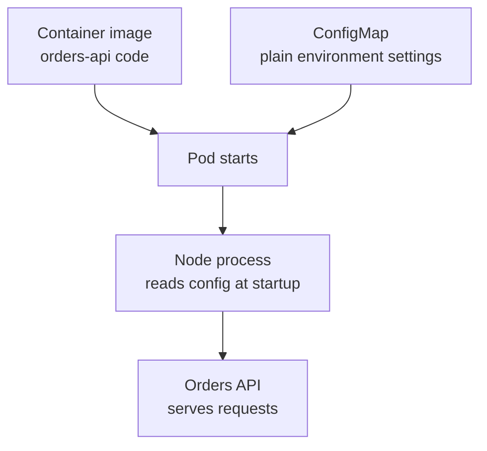

## Table of Contents

1. [Configuration Outside the Image](#configuration-outside-the-image)
2. [The First ConfigMap for devpolaris-orders-api](#the-first-configmap-for-devpolaris-orders-api)
3. [Injecting ConfigMap Keys as Environment Variables](#injecting-configmap-keys-as-environment-variables)
4. [How Updates Reach Running Pods](#how-updates-reach-running-pods)
5. [Failure Mode: Missing or Invalid Keys](#failure-mode-missing-or-invalid-keys)
6. [Reviewing ConfigMap Changes](#reviewing-configmap-changes)
7. [ConfigMaps Versus Other Configuration Paths](#configmaps-versus-other-configuration-paths)
8. [A Small Operating Checklist](#a-small-operating-checklist)
9. [A Small Change Record](#a-small-change-record)

## Configuration Outside the Image

A container image should answer one question: what software should run? It should not answer every question about where the software runs. The same `devpolaris-orders-api` image can run in a developer namespace, staging, and production, but each environment needs different feature flags, log levels, downstream URLs, and cache settings.

A ConfigMap is a Kubernetes API object that stores non-secret configuration as key-value data. Non-secret means the value is safe enough to show in manifests, `kubectl describe` output, and normal review. A ConfigMap exists so you can change configuration without rebuilding the image every time an environment value changes.

This fits between the Deployment and the application process. The Deployment says which image should run. The ConfigMap says which plain configuration values the Pod should receive. The kubelet, which is the node agent that starts containers, injects those values as environment variables or mounted files before the process starts.

The running example is a Node.js API called `devpolaris-orders-api`. It reads `PORT`, `LOG_LEVEL`, `FEATURE_REFUNDS`, and `CATALOG_API_URL` during startup. You will move those values out of the Deployment so the team can review configuration changes without mixing them into image changes.



The important boundary is that a ConfigMap is not a password store. If a value would let someone call a private database, sign a token, or impersonate a service, it belongs in a Secret or an external secret manager. Keep ConfigMaps for plain operational settings that help the process choose behavior.

## The First ConfigMap for devpolaris-orders-api

Start with the values the application already needs. A small Node service often reads configuration through `process.env`, which is just a map of strings. Kubernetes can fill that map from a ConfigMap, so the application code does not need to know where the values came from.

Here is a ConfigMap for staging. It contains only values that a teammate can safely read in a pull request.

```yaml
apiVersion: v1
kind: ConfigMap
metadata:
  name: orders-api-config
  namespace: devpolaris-staging
  labels:
    app.kubernetes.io/name: devpolaris-orders-api
    app.kubernetes.io/component: api
data:
  PORT: "8080"
  LOG_LEVEL: "info"
  FEATURE_REFUNDS: "false"
  CATALOG_API_URL: "http://catalog-api.devpolaris-staging.svc.cluster.local:8080"
```

The `data` field is the part your application cares about. Every key and value is a string. Even values that look like booleans or numbers, such as `"false"` and `"8080"`, reach the container as strings. Your application should parse them deliberately and fail with a clear message when the value is invalid.

The namespace matters because ConfigMaps are namespaced objects. A Deployment in `devpolaris-staging` cannot directly reference a ConfigMap in `devpolaris-prod`. That separation protects you from accidentally pointing staging Pods at production configuration just because two objects have the same name.

A team usually keeps this file near the workload manifest, for example:

```text
k8s/
  staging/
    orders-api-configmap.yaml
    orders-api-deployment.yaml
  prod/
    orders-api-configmap.yaml
    orders-api-deployment.yaml
```

That layout makes the environment boundary visible. The staging and production files may share keys, but their values and review path can differ.

## Injecting ConfigMap Keys as Environment Variables

The shortest way to use a ConfigMap is `envFrom`. It copies every key from the ConfigMap into the container environment. This is convenient when the ConfigMap exists only for one application and every key is meant for that container.

```yaml
apiVersion: apps/v1
kind: Deployment
metadata:
  name: orders-api
  namespace: devpolaris-staging
spec:
  replicas: 2
  selector:
    matchLabels:
      app: orders-api
  template:
    metadata:
      labels:
        app: orders-api
    spec:
      containers:
        - name: api
          image: ghcr.io/devpolaris/orders-api:1.18.0
          ports:
            - containerPort: 8080
          envFrom:
            - configMapRef:
                name: orders-api-config
```

When the Pod starts, the process sees the keys as normal environment variables. You can verify this in a temporary shell if the image includes a shell. In production images that do not include a shell, use logs or a small diagnostic endpoint instead.

```bash
$ kubectl exec deploy/orders-api -n devpolaris-staging -- printenv | grep -E 'PORT|LOG_LEVEL|FEATURE_REFUNDS'
FEATURE_REFUNDS=false
LOG_LEVEL=info
PORT=8080
```

`envFrom` has a tradeoff. It is quick, but it makes every key available to the process. If the ConfigMap holds values for several containers, or if you want the Deployment to document exactly which keys it needs, use explicit `env` entries with `valueFrom` instead.

```yaml
env:
  - name: LOG_LEVEL
    valueFrom:
      configMapKeyRef:
        name: orders-api-config
        key: LOG_LEVEL
  - name: CATALOG_API_URL
    valueFrom:
      configMapKeyRef:
        name: orders-api-config
        key: CATALOG_API_URL
```

Explicit keys make review slower but clearer. A reviewer can see that the API depends on `CATALOG_API_URL` without opening the ConfigMap first.

## How Updates Reach Running Pods

A ConfigMap update changes the Kubernetes object, but it does not rewrite the environment of a process that is already running. Environment variables are captured when the container starts. If `devpolaris-orders-api` reads `LOG_LEVEL` at startup, updating the ConfigMap object will not change the value inside existing Pods.

You can see that split with a simple status check.

```bash
$ kubectl apply -f k8s/staging/orders-api-configmap.yaml
configmap/orders-api-config configured

$ kubectl get configmap orders-api-config -n devpolaris-staging -o jsonpath='{.data.LOG_LEVEL}'
debug

$ kubectl exec deploy/orders-api -n devpolaris-staging -- printenv LOG_LEVEL
info
```

The API object now says `debug`, but the running process still says `info`. That is expected. To make environment-variable changes take effect, restart or roll out the Pods.

```bash
$ kubectl rollout restart deployment/orders-api -n devpolaris-staging
deployment.apps/orders-api restarted

$ kubectl rollout status deployment/orders-api -n devpolaris-staging
deployment "orders-api" successfully rolled out
```

Many teams automate this by adding a checksum annotation to the Pod template. When the ConfigMap file changes, the annotation changes too, which gives the Deployment controller a reason to create a new ReplicaSet.

```yaml
spec:
  template:
    metadata:
      annotations:
        devpolaris.io/config-checksum: "sha256:8a4f7c9e"
```

The exact checksum tooling depends on Helm, Kustomize, or your CI system. The principle is the same: a Pod template change triggers a rollout, while a ConfigMap-only change does not restart existing environment variables.

## Failure Mode: Missing or Invalid Keys

The most common ConfigMap failure is a Pod that cannot start because a required ConfigMap or key is missing. Kubernetes catches missing references before the application process runs, which is helpful because it tells you the problem is in the workload wiring, not in the Node.js code.

```bash
$ kubectl get pods -n devpolaris-staging
NAME                          READY   STATUS                       RESTARTS   AGE
orders-api-7d9b9c8b7f-r46kb   0/1     CreateContainerConfigError   0          42s

$ kubectl describe pod orders-api-7d9b9c8b7f-r46kb -n devpolaris-staging
Events:
  Type     Reason  Age   From     Message
  Warning  Failed  41s   kubelet  Error: configmap "orders-api-config" not found
```

Start with `kubectl describe pod`, not the application logs. The container has not started yet, so logs may be empty. The event message points at the missing API object.

The diagnostic path is short:

| Check | Command | What You Learn |
|-------|---------|----------------|
| Pod event | `kubectl describe pod <pod>` | Whether kubelet could assemble the container config |
| ConfigMap exists | `kubectl get configmap orders-api-config -n devpolaris-staging` | Whether the object exists in the same namespace |
| Key exists | `kubectl get configmap orders-api-config -o yaml` | Whether the referenced key is present |
| Rollout state | `kubectl rollout status deploy/orders-api` | Whether fixed Pods replaced broken ones |

Invalid values are different. Kubernetes can inject `PORT="eighty"` because it is still a string. Your application must validate it and exit with a useful message.

```text
2026-05-07T10:12:14.221Z ERROR config validation failed
field=PORT value=eighty reason="expected integer between 1 and 65535"
```

That log line is much better than a later connection failure. Configuration should fail early while the Pod is still becoming ready.

## Reviewing ConfigMap Changes

ConfigMap reviews are small, but they can still change production behavior. A feature flag can enable a code path. A URL can send traffic to the wrong service. A timeout can turn a slow dependency into many failed requests. Treat configuration changes as application changes, not as harmless text edits.

For `devpolaris-orders-api`, a reviewer should ask three questions. Does the key belong in a ConfigMap rather than a Secret? Does the value match the target namespace and environment? Does the rollout plan restart the Pods if the app reads the value at startup?

A useful pull request description can be short:

```text
Change: enable refund preview in staging only
File: k8s/staging/orders-api-configmap.yaml
Key: FEATURE_REFUNDS=false -> true
Rollout: kubectl rollout restart deployment/orders-api -n devpolaris-staging
Verification: GET /internal/config reports featureRefunds=true in staging
```

The verification line matters because the Kubernetes API object is only one half of the work. You also need evidence that the running process received the new value.

```bash
$ kubectl logs deploy/orders-api -n devpolaris-staging | grep 'configuration loaded' | tail -1
2026-05-07T10:24:02.533Z INFO configuration loaded port=8080 logLevel=info featureRefunds=true
```

A mature team eventually standardizes this review pattern. The habit saves time during incidents because people know where configuration lives, who approved it, and which rollout made it active.

## ConfigMaps Versus Other Configuration Paths

ConfigMaps are not the only place configuration can live. A value can be baked into the image, passed as an environment variable by the Deployment, mounted as a file, fetched from a database, or served by a configuration service. Kubernetes gives you ConfigMaps because many settings are small, environment-specific, and easy to review as YAML.

| Option | Good For | Tradeoff |
|--------|----------|----------|
| Image default | Safe fallback values | Requires rebuild to change |
| Deployment literal | One-off tiny values | Hides config inside workload wiring |
| ConfigMap env | Startup settings | Existing Pods need restart |
| ConfigMap file | App config files | App may need reload support |
| External service | Dynamic config | More moving parts and permissions |

The simplest rule is to start with the least surprising choice. If the value is plain text, environment-specific, and safe for normal reviewers, use a ConfigMap. If the value is secret, use a Secret or external secret manager. If the value must change every minute without a restart, a ConfigMap probably is not the right primary mechanism.

For `devpolaris-orders-api`, `LOG_LEVEL` and `CATALOG_API_URL` fit well in a ConfigMap. The database password does not. A pricing rule that product managers update during the day probably belongs in a database or feature-management system rather than a Kubernetes manifest.

## A Small Operating Checklist

A ConfigMap is easy to create, so most mistakes come from weak boundaries rather than hard syntax. Keep the object close to the workload, keep secrets out of it, and make the restart behavior explicit.

Before merging a ConfigMap change for `devpolaris-orders-api`, check the manifest and the running system.

```bash
$ kubectl diff -f k8s/staging/orders-api-configmap.yaml
diff -u -N /tmp/LIVE-188223721/v1.ConfigMap.devpolaris-staging.orders-api-config /tmp/MERGED-399428304/v1.ConfigMap.devpolaris-staging.orders-api-config
--- /tmp/LIVE-188223721/v1.ConfigMap.devpolaris-staging.orders-api-config
+++ /tmp/MERGED-399428304/v1.ConfigMap.devpolaris-staging.orders-api-config
@@ -8,7 +8,7 @@
   CATALOG_API_URL: http://catalog-api.devpolaris-staging.svc.cluster.local:8080
-  FEATURE_REFUNDS: "false"
+  FEATURE_REFUNDS: "true"
   LOG_LEVEL: info
   PORT: "8080"
```

`kubectl diff` shows the API change before you apply it. After applying, verify both object state and application state. If those two disagree, you probably updated the ConfigMap without restarting Pods that read environment variables at startup.

The checklist is small enough to remember:

| Step | Question |
|------|----------|
| Scope | Is this plain non-secret configuration? |
| Namespace | Is the ConfigMap in the same namespace as the workload? |
| Key shape | Are required keys present with parseable string values? |
| Rollout | Will existing Pods receive the change? |
| Evidence | Which command or log proves the app is using it? |

This is the operating skill: connect the YAML object to the process that will actually run. Once you can trace that path, ConfigMaps stop feeling like loose Kubernetes paperwork and become a practical part of deployment hygiene.

## A Small Change Record

The last useful ConfigMap habit is keeping a small change record in the same pull request. Kubernetes will store object history only indirectly through events and managed fields. Your team gets a clearer story when the manifest change, rollout command, and verification evidence are connected in review.

```text
Config change record
Service: devpolaris-orders-api
Namespace: devpolaris-staging
Key changed: FEATURE_REFUNDS
Old value: false
New value: true
Rollout needed: yes, value is read from environment at startup
Verification: application log shows featureRefunds=true after rollout
```

This record does not need to become heavy process. It is a shared memory aid. When someone asks why refunds were enabled in staging, the answer is in the review instead of someone's terminal scrollback.

During incidents, that same record helps you decide whether to roll forward or roll back. If a change only touched `FEATURE_REFUNDS`, you can inspect requests using that code path first. If the change touched `CATALOG_API_URL`, you start with service discovery, DNS, and dependency health.

```bash
$ kubectl rollout history deployment/orders-api -n devpolaris-staging
deployment.apps/orders-api
REVISION  CHANGE-CAUSE
12        config checksum sha256:6fd3c1b2
13        config checksum sha256:8a4f7c9e
```

The checksum does not explain the whole change, but it links the rollout to the config artifact that produced it. That is enough to connect Kubernetes state back to Git review.

---

**References**

- [Kubernetes ConfigMaps](https://kubernetes.io/docs/concepts/configuration/configmap/) - Official concept page for ConfigMap objects, keys, size guidance, and common usage patterns.
- [Configure a Pod to Use a ConfigMap](https://kubernetes.io/docs/tasks/configure-pod-container/configure-pod-configmap/) - Official task guide for mounting ConfigMaps and exposing them to containers.
- [Define Environment Variables for a Container](https://kubernetes.io/docs/tasks/inject-data-application/define-environment-variable-container/) - Official task guide for setting container environment variables in Pods.
- [Troubleshooting Applications](https://kubernetes.io/docs/tasks/debug/debug-application/) - Official debugging entry point for inspecting Pods, events, logs, and application failures.
