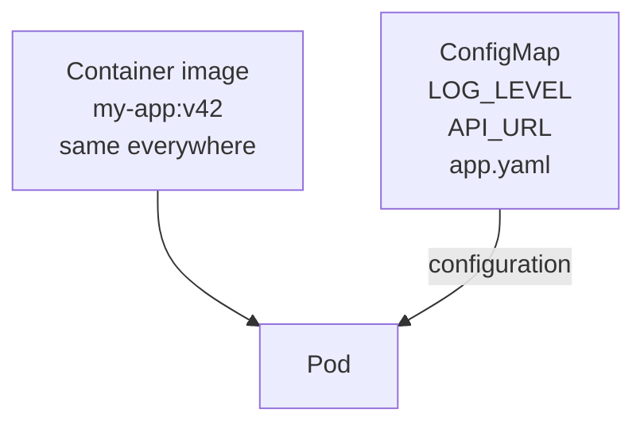
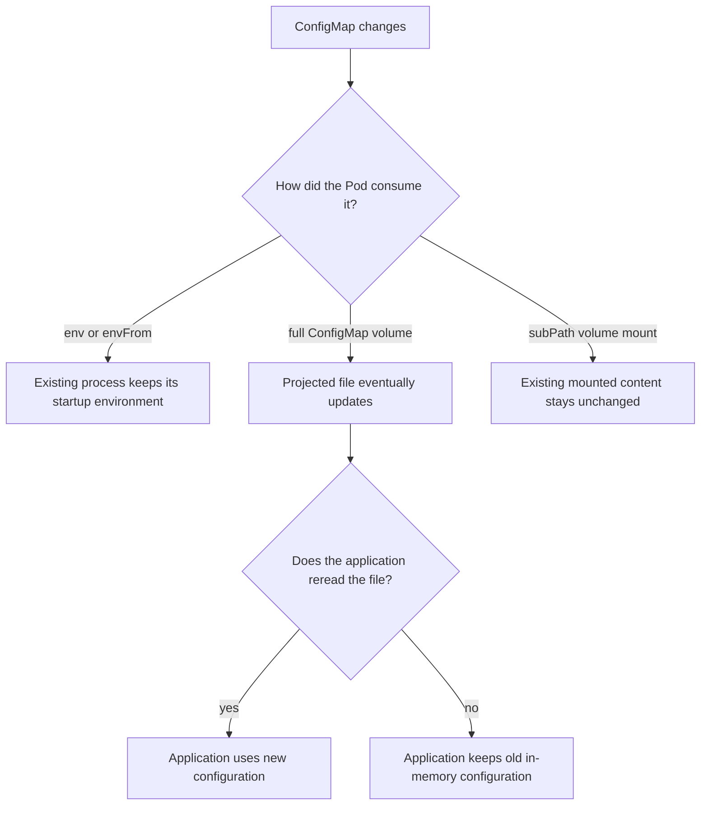
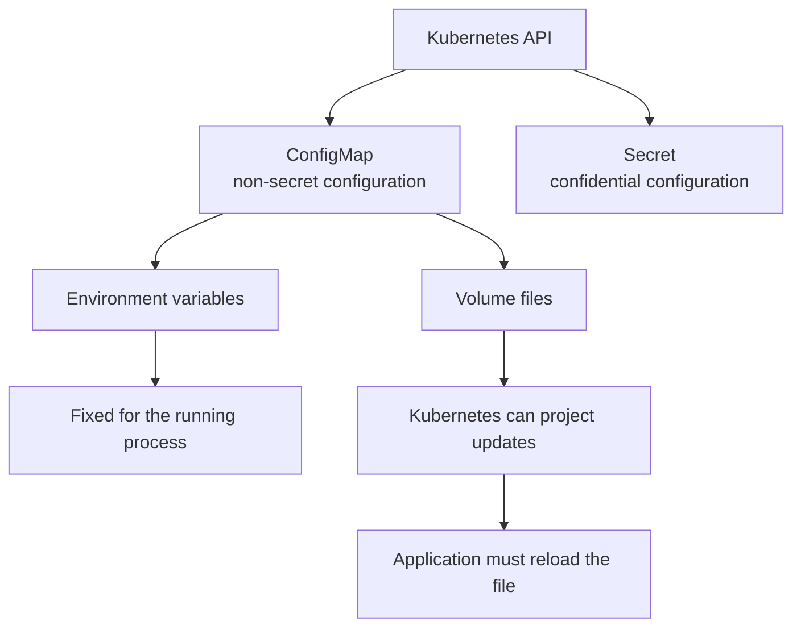

## Table of Contents

1. [What problem does a ConfigMap solve?](#what-problem-does-a-configmap-solve)
2. [What values can a ConfigMap hold?](#what-values-can-a-configmap-hold)
3. [How does a Pod receive ConfigMap values?](#how-does-a-pod-receive-configmap-values)
4. [How do ConfigMap keys become file paths?](#how-do-configmap-keys-become-file-paths)
5. [What happens after a ConfigMap changes?](#what-happens-after-a-configmap-changes)
6. [How should a team roll out a configuration change?](#how-should-a-team-roll-out-a-configuration-change)
7. [Which values belong in a Secret?](#which-values-belong-in-a-secret)
8. [Check Your Answers](#check-your-answers)
9. [References](#references)

The easiest way to understand a Kubernetes ConfigMap is to begin one level below Kubernetes: with the inputs a running program needs. Code, ordinary configuration, confidential configuration, and runtime state each have different jobs and lifecycles. A ConfigMap exists to keep one of those inputs—ordinary configuration—independent of the container image.

The article develops that model through seven questions:

1. **What problem does a ConfigMap solve?**
2. **What values can a ConfigMap hold?**
3. **How does a Pod receive ConfigMap values?**
4. **How do ConfigMap keys become file paths?**
5. **What happens after a ConfigMap changes?**
6. **How should a team roll out a configuration change?**
7. **Which values belong in a Secret?**

## What problem does a ConfigMap solve?
<!-- section-summary: A ConfigMap separates ordinary configuration from application code so the same container image can run with different settings. -->

A **container image** is the packaged application: its code, libraries, and the files placed in the image during the build. Kubernetes starts that image inside a **Pod**, its basic unit for running one or more containers, and the application then runs as a process. That running process usually needs inputs that do not belong permanently inside the image.

A useful first model is:

```text
running application = code + configuration + secrets + runtime state
```

Each part means something different:

- **code** contains application behavior, such as the instruction to connect to `DATABASE_HOST`;
- **configuration** supplies ordinary settings such as `DATABASE_HOST=db.prod.svc`, `LOG_LEVEL=info`, or `FEATURE_X=true`;
- **secrets** supply confidential values such as `DATABASE_PASSWORD`;
- **runtime state** includes data created or changed while the application runs, such as cached data, uploaded files, and database contents.

Code and configuration usually change on different schedules. A team may want the exact same image, `my-app:v42`, to run in development, staging, and production while each environment supplies its own settings.

Without an external configuration mechanism, the team would need to build environment-specific images such as `my-app-dev:v42`, `my-app-staging:v42`, and `my-app-prod:v42`, or repeat all of the configuration directly inside every Pod definition. The first choice ties a configuration change to an image build. The second repeats settings across workload definitions.

A Kubernetes **object** is a named record managed through the cluster API. A **ConfigMap** is the object Kubernetes provides for non-secret configuration. The container image can stay the same everywhere, while each Pod receives the settings intended for its environment.


```mermaid
flowchart TD
    Image["Container image<br/>my-app:v42<br/>same everywhere"] --> Pod[Pod]
    ConfigMap["ConfigMap<br/>LOG_LEVEL<br/>API_URL<br/>app.yaml"] -->|configuration| Pod
```

That decoupling is the fundamental problem a ConfigMap solves: configuration can vary without changing the image that contains the code. To understand how a Pod uses that separation, the next step is to inspect the data stored inside the ConfigMap object.

## What values can a ConfigMap hold?
<!-- section-summary: A ConfigMap stores named UTF-8 strings or base64-represented bytes, including values that contain complete configuration files. -->

At its simplest, a ConfigMap is a map from keys to values:

A **key** is the name used to identify one piece of configuration, and its **value** is the content stored under that name.

```yaml
apiVersion: v1
kind: ConfigMap
metadata:
  name: my-app-config
data:
  LOG_LEVEL: "info"
  API_URL: "https://api.internal"
  MAX_CONNECTIONS: "20"
```

Conceptually, the object contains three named entries:

```text
my-app-config
├── LOG_LEVEL       -> "info"
├── API_URL         -> "https://api.internal"
└── MAX_CONNECTIONS -> "20"
```

ConfigMaps are not strongly typed configuration stores. Values such as these still reach the application as strings:

```yaml
data:
  MAX_CONNECTIONS: "20"
  FEATURE_ENABLED: "true"
```

The application decides whether to parse those strings as a number and a Boolean. Kubernetes stores the values without applying those application-level types.

A ConfigMap has two fields for its values:

- `data` holds ordinary text encoded as UTF-8;
- `binaryData` holds arbitrary bytes written as base64 text so they can travel in YAML or JSON.

Base64 represents bytes as text; it does not make the value secret. A ConfigMap is also limited to 1 MiB, so it is intended for configuration rather than large files.

A single value can contain an entire configuration file. Suppose the application normally reads `/etc/myapp/app.yaml` with this content:

```yaml
server:
  port: 8080
logging:
  level: info
```

The file can become one value under the `app.yaml` key. In YAML, the `|` after the key starts a multi-line string, so the indented lines remain one value:

```yaml
apiVersion: v1
kind: ConfigMap
metadata:
  name: my-app-config
data:
  app.yaml: |
    server:
      port: 8080
    logging:
      level: info
```

Kubernetes still sees one string value. The key names that value `app.yaml`; the value contains the text that the application expects to read from the file.

Once the configuration exists as named data, the Pod must decide how to present it to the running process.

## How does a Pod receive ConfigMap values?
<!-- section-summary: A Pod can turn ConfigMap values into environment variables or files, matching interfaces applications already understand. -->

An **environment variable** is a named string supplied to a process when it starts. A **file** is data placed at a path in the container's filesystem. ConfigMaps support both interfaces, so the Pod can match the way the application already expects to read configuration.

The two common delivery models are:

```text
ConfigMap -> environment variables
ConfigMap -> files
```

A Pod can map one key to one environment variable with `configMapKeyRef`:

```yaml
env:
  - name: LOG_LEVEL
    valueFrom:
      configMapKeyRef:
        name: my-app-config
        key: LOG_LEVEL
```

Here, `env[].name` names the variable inside the container. `valueFrom` says that its value comes from another Kubernetes object, and `configMapKeyRef` identifies the ConfigMap and key to read.

If `my-app-config` contains `LOG_LEVEL: "info"`, the process receives this startup environment value:

```bash
echo $LOG_LEVEL
```

```console
info
```

The Pod can also import every suitable key as an environment variable with `envFrom`:

```yaml
envFrom:
  - configMapRef:
      name: my-app-config
```

Given this data:

```yaml
data:
  LOG_LEVEL: "info"
  API_HOST: "api.internal"
  PORT: "8080"
```

the process receives approximately this environment:

```text
LOG_LEVEL=info
API_HOST=api.internal
PORT=8080
```

Environment variables work well for applications that already expect individual settings in their startup environment. Applications that expect configuration files can receive the same ConfigMap through a volume instead.

The individual and whole-map forms also create different configuration contracts. With `configMapKeyRef`, the Pod template names each required input and can rename it inside the container. A reviewer can see that this process depends specifically on `LOG_LEVEL` from one object. With `envFrom`, every suitable key becomes part of the process environment automatically, which is compact when the ConfigMap is intentionally designed as that application's complete environment.

That convenience also increases coupling. Adding another suitable key to a ConfigMap used through `envFrom` changes the startup environment of every new Pod that imports the whole object. Individual mappings expose more YAML but keep each dependency explicit. The delivery choice therefore describes both how much configuration enters the process and who owns the interface between the ConfigMap and the application.

Neither form changes the underlying value type: both deliver strings, and the application remains responsible for validating and parsing values such as ports, connection counts, and feature flags.

Suppose the ConfigMap contains two complete files:

```yaml
data:
  app.yaml: |
    port: 8080
    logLevel: info
  feature-flags.json: |
    {
      "checkoutV2": true
    }
```

A **volume** gives Pod-managed data a place in the container filesystem. The `volumes` entry defines that data source for the Pod, while `volumeMounts` makes it visible to one container at the location named by `mountPath`. The Pod below declares a ConfigMap-backed volume and mounts it at `/etc/myapp`:

```yaml
spec:
  containers:
    - name: app
      image: my-app:v42
      volumeMounts:
        - name: config
          mountPath: /etc/myapp
  volumes:
    - name: config
      configMap:
        name: my-app-config
```

Kubernetes **projects** the two values into the container filesystem, meaning that it turns the ConfigMap entries into files inside the mounted volume:

```text
/etc/myapp/
├── app.yaml
└── feature-flags.json
```

By default, every ConfigMap key becomes a filename and its value becomes the file contents.

Less common delivery paths also exist. A Pod can use a ConfigMap value indirectly in a command or argument, and an application can read ConfigMap objects through the Kubernetes API. Environment variables and mounted files remain the two central models because they match interfaces that many processes already understand.

File delivery introduces one more mapping to understand: the relationship between the ConfigMap key and the final path in the container.

## How do ConfigMap keys become file paths?
<!-- section-summary: By default a ConfigMap key becomes a filename, while items can select keys and assign different relative paths. -->

For a normal ConfigMap volume, the default rule is:

```text
final path = mountPath + "/" + ConfigMap key
```

Given this key:

```yaml
data:
  nginx.conf: "..."
```

and this mount path:

```yaml
mountPath: /etc/nginx/config
```

the container receives the file at `/etc/nginx/config/nginx.conf`.

The `items` field can select keys and change their relative paths. This volume selects `app.yaml` and places it below a nested path:

```yaml
volumes:
  - name: config
    configMap:
      name: my-app-config
      items:
        - key: app.yaml
          path: settings/application.yaml
```

When the volume is mounted at `/etc/myapp`, the mapping is:

```text
ConfigMap key: app.yaml
        -> items path: settings/application.yaml
        -> mount path: /etc/myapp
        -> final path: /etc/myapp/settings/application.yaml
```

When `items` is present, only the selected keys are projected into the volume. The ConfigMap key identifies the stored data, while `items[].path` determines where that data appears relative to `mountPath`. The key and the filesystem path therefore do not have to be the same.

The location of a value is only half of the runtime contract. A team must also understand whether a running process can see later changes to that value.

## What happens after a ConfigMap changes?
<!-- section-summary: Environment values remain fixed for the running process, while mounted files can be projected again and still require application reload behavior. -->

The result depends on how the Pod consumed the ConfigMap. Suppose `LOG_LEVEL` changes from `info` to `debug`.

If the Pod used `env` or `envFrom`, the running process keeps `LOG_LEVEL=info`. Kubernetes populated the environment when the container started, and changing the ConfigMap cannot rewrite the startup environment of an existing process. New Pods are required for the process to receive `LOG_LEVEL=debug`.

Mounted files behave differently. When a ConfigMap is mounted as a volume, Kubernetes eventually updates the projected files after the ConfigMap changes. The update is not necessarily immediate. The **kubelet**, the Kubernetes agent running on each node—the machine hosting the Pod—detects the changed ConfigMap and refreshes the volume according to its synchronization and change-detection behavior.

A ConfigMap volume mounted with `subPath` is the important exception. A `subPath` mount exposes one selected path from a volume instead of mounting the volume at its root. That mount does not receive ConfigMap updates, so its content remains unchanged in the existing Pod.

An updated file also does not guarantee updated application behavior. Consider a process that reads its file once and keeps the result in memory:

```python
config = read("/etc/myapp/app.yaml")

while True:
    handle_requests(config)
```

Kubernetes may replace `/etc/myapp/app.yaml` with new content while the `config` variable still holds the old value in the process's memory. The file on disk and the copy already loaded into memory are separate. Kubernetes manages delivery of the configuration file; the application determines whether it rereads that file.


```mermaid
flowchart TD
    Change[ConfigMap changes] --> Delivery{How did the Pod consume it?}
    Delivery -->|env or envFrom| Environment[Existing process keeps its startup environment]
    Delivery -->|full ConfigMap volume| File[Projected file eventually updates]
    Delivery -->|subPath volume mount| SubPath[Existing mounted content stays unchanged]
    File --> Reload{Does the application reread the file?}
    Reload -->|yes| New[Application uses new configuration]
    Reload -->|no| Old[Application keeps old in-memory configuration]
```

This distinction explains why many teams restart Pods even when they use ConfigMap volumes.

Even when the application needs a new Pod, changing the ConfigMap alone does not automatically create one. A **Deployment** manages replaceable Pods from a **Pod template**, which is the blueprint Kubernetes uses when creating those Pods. A **ReplicaSet** represents one population created from a particular version of that template.

If the Pod template still refers to the same name, `my-app-config`, then the template itself has not changed. The Deployment controller—the Kubernetes control loop that watches the Deployment—has no reason to create a new ReplicaSet and replace the existing Pods.

Three separate changes must therefore stay distinct:

- **ConfigMap delivery** decides whether the process receives an environment value or a projected file;
- **application reload** decides whether new file content replaces old in-memory configuration;
- **Deployment rollout** decides whether Kubernetes creates new Pods.

Once a team separates those mechanisms, it can choose a rollout method deliberately instead of assuming that one change triggers all three.

### Trace one setting through each delivery contract

Consider the same image, `my-app:v42`, running in two environments. Development needs `LOG_LEVEL=debug`; production needs `LOG_LEVEL=info`. The executable code is identical. Only the input differs.

For environment-variable delivery, production stores:

```yaml
apiVersion: v1
kind: ConfigMap
metadata:
  name: my-app-config-v17
data:
  LOG_LEVEL: "info"
```

and the Pod template maps that key into its startup environment:

```yaml
env:
  - name: LOG_LEVEL
    valueFrom:
      configMapKeyRef:
        name: my-app-config-v17
        key: LOG_LEVEL
```

The complete path is:

```text
ConfigMap object
-> key LOG_LEVEL
-> Pod template reference
-> container startup environment
-> application reads LOG_LEVEL=info
```

Changing the stored value to `debug` modifies only the first item in that chain. The current process already received its environment, so the last item does not change. A new container process is needed.

File delivery follows a related but different path. If the ConfigMap stores `app.yaml`, a volume projects that key into `/etc/myapp/app.yaml`. The kubelet can eventually refresh the file after the ConfigMap changes, but the application's in-memory `config` variable changes only if the program rereads the file. Kubernetes can own the object and filesystem projection without owning the application's reload behavior.

This gives the operator three separate observations to verify:

| Boundary | Question |
|---|---|
| API object | Does the ConfigMap contain the intended value? |
| Pod delivery | Did the value reach the environment or projected file? |
| Application behavior | Did a new process start or did the existing process reload the file? |

A correct ConfigMap at the API boundary therefore does not prove that the process uses it. The delivery method and the application's loading model complete the configuration contract.

## How should a team roll out a configuration change?
<!-- section-summary: Versioned ConfigMaps, immutable data, checksum annotations, or an explicit restart can give new Pods updated configuration. -->

A **rollout** is the controlled replacement of Pods created from an older Pod template with Pods created from a newer one. For production systems, configuration is usually best treated as versioned application input rather than mutable global state. Instead of updating one object named `my-app-config` forever, a team can create successive objects:

```text
my-app-config-v17
my-app-config-v18
```

The Deployment then changes its ConfigMap reference from `v17` to `v18`:

```yaml
volumes:
  - name: config
    configMap:
      name: my-app-config-v18
```

That name change modifies the Pod template, which gives the Deployment controller a reason to create new Pods. A readiness check reports when a new Pod is prepared to receive work, allowing the rollout to replace the old Pods gradually. The lifecycle becomes:

1. Create configuration `v18`.
2. Change the Deployment reference from `v17` to `v18`.
3. Let the Deployment perform its rolling update.
4. Use readiness checks to verify the new Pods.
5. Remove the old Pods after the new Pods become ready.

If `v18` fails, changing the Deployment reference back to `v17` returns new Pods to the previous configuration.

ConfigMaps can also be marked immutable:

```yaml
apiVersion: v1
kind: ConfigMap
metadata:
  name: my-app-config-c92be8
immutable: true
data:
  LOG_LEVEL: "info"
```

`immutable: true` prevents the data in that object from being changed. Each name can represent one fixed configuration, such as `my-app-config-a81fd2`, `my-app-config-c92be8`, or `my-app-config-e71ab3`. Kubernetes documents immutable ConfigMaps both as protection against accidental updates and as an optimization for large clusters.

**Helm** is a tool that renders reusable Kubernetes manifest packages. It commonly produces the same rollout relationship by placing a configuration checksum in the Pod template annotation. A **checksum** is a short fingerprint calculated from content: when the ConfigMap content changes, the fingerprint changes too.

```text
ConfigMap changes
        -> checksum changes
        -> Pod template changes
        -> Deployment rolls Pods
```

A simpler operational sequence keeps the same ConfigMap name and explicitly restarts the Deployment:

```bash
kubectl apply -f configmap.yaml
kubectl rollout restart deployment/my-app
```

That restart gives new processes the latest startup environment or startup-read files. Versioned or immutable configuration generally leaves a clearer record of which configuration a Deployment used and gives rollback a precise previous version to restore.

### Follow one versioned change from proposal to rollback

Suppose `my-app-config-v17` contains `LOG_LEVEL=info`, and the team wants to test `debug`. Instead of mutating `v17`, it creates `my-app-config-v18` with the new value. The Deployment's Pod template then changes only its reference:

```text
old Pod template -> my-app-config-v17
new Pod template -> my-app-config-v18
```

That name change is operationally important. It makes the desired configuration version visible in the Deployment and creates a new Pod-template generation. New Pods start with `v18`; readiness checks decide when those Pods are usable; the Deployment gradually removes Pods that still use `v17`.

If the application behaves incorrectly, recovery does not require reconstructing yesterday's mutable object. The team changes the reference back to `v17`, and replacement Pods start with the known earlier input. Immutable ConfigMaps strengthen this model because neither version can be silently edited after its name has been associated with a rollout.

The same sequence also explains the checksum technique. Helm may keep the ConfigMap name stable but place a content checksum in the Pod template. New content changes the checksum, which changes the template, which creates a new ReplicaSet. The ConfigMap name and checksum approaches look different in YAML, but both make a configuration change visible to the Deployment controller.

The rollout question resolves the lifecycle of ordinary configuration. The remaining boundary is deciding which values are ordinary enough to belong in a ConfigMap at all.

## Which values belong in a Secret?
<!-- section-summary: Ordinary configuration belongs in ConfigMaps, while values whose disclosure grants access or reveals confidential information belong in Secrets. -->

Return to the original model:

```text
application = code + configuration + secrets + runtime state
```

Kubernetes gives ordinary configuration and confidential configuration different object types:

```text
ordinary configuration     -> ConfigMap
confidential configuration -> Secret
```

Values such as these belong in a ConfigMap:

```text
LOG_LEVEL=debug
CACHE_TTL=60
FEATURE_CHECKOUT_V2=true
API_HOST=payments.default.svc
MAX_CONNECTIONS=20
```

Values such as these belong in a Secret:

```text
DATABASE_PASSWORD
API_TOKEN
AWS_ACCESS_KEY
PRIVATE_KEY
OAUTH_CLIENT_SECRET
JWT_SIGNING_KEY
```

A useful test is: **Would disclosure of this value grant someone access or reveal confidential information?** If the answer is yes, the value should not be in a ConfigMap.

A **Secret** is a separate Kubernetes object intended for sensitive values, but the object type is not by itself a complete secure-vault design. Kubernetes stores cluster API objects in **etcd**, its backing data store, and Secrets are unencrypted there by default unless the cluster enables encryption at rest. **Encryption at rest** protects the stored copy of the data, while **RBAC** controls which authenticated identities may read or change it. Those controls, and often an external secret-management system, still matter.

The complete ConfigMap model can now be read from storage through delivery to runtime behavior:


```mermaid
flowchart TD
    API[Kubernetes API] --> ConfigMap[ConfigMap<br/>non-secret configuration]
    API --> Secret[Secret<br/>confidential configuration]
    ConfigMap --> Environment[Environment variables]
    ConfigMap --> Volume[Volume files]
    Environment --> Fixed[Fixed for the running process]
    Volume --> Projected[Kubernetes can project updates]
    Projected --> Reload[Application must reload the file]
```

> **First-principles definition:** A ConfigMap is a versionable, independently managed input to a workload that lets configuration vary without changing the container image.

From that definition, the main behaviors follow:

- separating configuration from the image lets the same code run with different settings;
- key-value data gives Kubernetes a simple configuration representation;
- environment variables match a process's existing startup interface;
- mounted files match applications that already read configuration files;
- keys become filenames because Kubernetes needs a direct mapping from stored data into a filesystem;
- environment variables stay fixed because they belong to the process's startup environment;
- mounted files can change because Kubernetes owns the volume projection;
- application state changes only when the application reloads the projected content;
- versioned ConfigMaps give a Deployment a deterministic rollout and rollback target;
- Secrets keep confidential credentials on a different security path from ordinary configuration.

The central distinction is ConfigMap delivery versus application reload versus Deployment rollout. Once those are separate in your mental model, the YAML mainly describes which path the workload has chosen.

## Check Your Answers
<!-- section-summary: Revisit the seven questions that connect ConfigMap storage, delivery, file mapping, updates, rollouts, and sensitive values. -->

:::expand[What problem does a ConfigMap solve?]{kind="recap"}
A ConfigMap separates ordinary configuration from application code. The same container image can run in several environments while each one supplies its own non-secret settings.
:::

:::expand[What values can a ConfigMap hold?]{kind="recap"}
`data` holds UTF-8 strings, and `binaryData` holds arbitrary bytes represented as base64. A string value can contain one small setting or the complete text of a configuration file, within the ConfigMap's 1 MiB limit.
:::

:::expand[How does a Pod receive ConfigMap values?]{kind="recap"}
A Pod can map one key with `configMapKeyRef`, import suitable keys with `envFrom`, or mount the ConfigMap as files. Commands, arguments, and direct Kubernetes API reads are less common alternatives.
:::

:::expand[How do ConfigMap keys become file paths?]{kind="recap"}
By default, the final path is the volume's `mountPath` plus the ConfigMap key. An `items` entry can select a key and assign a different relative path.
:::

:::expand[What happens after a ConfigMap changes?]{kind="recap"}
Existing environment variables do not change, while a full ConfigMap volume can eventually receive updated files. The application still needs to reread those files, and `subPath` mounts do not receive the updates.
:::

:::expand[How should a team roll out a configuration change?]{kind="recap"}
A versioned ConfigMap name or checksum changes the Pod template so a Deployment creates new Pods, while an explicit rollout restart can also replace Pods after an in-place change. Immutable ConfigMaps make each named configuration fixed.
:::

:::expand[Which values belong in a Secret?]{kind="recap"}
Ordinary settings belong in ConfigMaps. Passwords, tokens, private keys, and other values whose disclosure grants access or reveals confidential information belong in Secrets, together with the required RBAC and encryption controls.
:::

## References

- [ConfigMaps](https://kubernetes.io/docs/concepts/configuration/configmap/)
- [Configure a Pod to Use a ConfigMap](https://kubernetes.io/docs/tasks/configure-pod-container/configure-pod-configmap/)
- [Secrets](https://kubernetes.io/docs/concepts/configuration/secret/)
- [Encrypting Confidential Data at Rest](https://kubernetes.io/docs/tasks/administer-cluster/encrypt-data/)
- [Deployments](https://kubernetes.io/docs/concepts/workloads/controllers/deployment/)
- [Helm Chart Development Tips and Tricks](https://helm.sh/docs/howto/charts_tips_and_tricks/)
