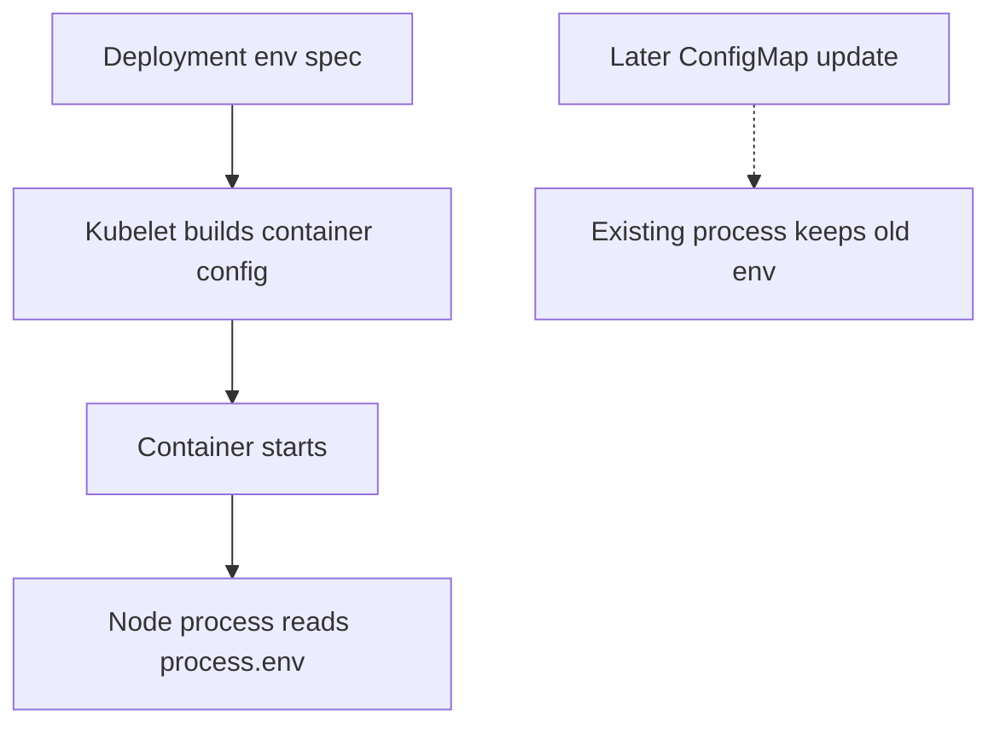

## Table of Contents

1. [The Container Environment as a Startup Contract](#the-container-environment-as-a-startup-contract)
2. [Literals, ConfigMaps, and Secrets](#literals-configmaps-and-secrets)
3. [envFrom and Explicit env Entries](#envfrom-and-explicit-env-entries)
4. [Expansion Order and Dependent Variables](#expansion-order-and-dependent-variables)
5. [Failure Mode: CreateContainerConfigError](#failure-mode-createcontainerconfigerror)
6. [Validating Values in the Application](#validating-values-in-the-application)
7. [Rollouts and Environment Changes](#rollouts-and-environment-changes)
8. [A Practical Environment Variable Review](#a-practical-environment-variable-review)
9. [Pod Metadata as Environment Input](#pod-metadata-as-environment-input)
10. [Environment Drift Across Namespaces](#environment-drift-across-namespaces)

## The Container Environment as a Startup Contract

Most application frameworks already have one simple configuration interface: environment variables. In Node.js, `process.env.PORT` and `process.env.NODE_ENV` are just strings attached to the process when it starts. Kubernetes can fill those strings from literals, ConfigMaps, Secrets, and Pod metadata.

Environment variables are a startup contract. They tell `devpolaris-orders-api` which port to listen on, which downstream service to call, and which behavior to enable before the first request arrives. They are easy to use because the app does not need to open a file or call the Kubernetes API.

The design constraint is also the main limitation. A running process does not receive a live update when you change an environment variable source. If the Deployment changes, new Pods get new values. Existing processes keep the environment they started with.



This article uses environment variables as the link between earlier ConfigMaps and Secrets. You will see when literals are acceptable, when references are clearer, and how to diagnose a Pod that cannot start because its environment cannot be built.

## Literals, ConfigMaps, and Secrets

A literal environment variable is written directly in the container spec. This is fine for tiny, non-secret values that are tightly coupled to the workload. It is not a good home for environment-specific settings that change often.

```yaml
env:
  - name: NODE_ENV
    value: "production"
  - name: PORT
    value: "8080"
```

For `devpolaris-orders-api`, `NODE_ENV` might stay as a literal because it describes how the image should behave in this Deployment. `CATALOG_API_URL` is better in a ConfigMap because staging and production need different values. `DATABASE_URL` belongs in a Secret because it contains credentials.

```yaml
env:
  - name: CATALOG_API_URL
    valueFrom:
      configMapKeyRef:
        name: orders-api-config
        key: CATALOG_API_URL
  - name: DATABASE_URL
    valueFrom:
      secretKeyRef:
        name: orders-api-secrets
        key: DATABASE_URL
```

This split keeps review honest. A teammate can review public routing values in one file while credential handling follows a stricter path. The Deployment still shows every value the application expects, which helps when you debug startup failures.

## envFrom and Explicit env Entries

`envFrom` imports all keys from a ConfigMap or Secret. It is convenient, especially when an application owns the whole object. The risk is accidental growth. A new key added for one purpose becomes visible to the container even if the Deployment never named it.

```yaml
envFrom:
  - configMapRef:
      name: orders-api-config
  - secretRef:
      name: orders-api-secrets
```

Explicit `env` entries take more space but make the contract readable in the Deployment. For shared clusters and production workloads, that readability often matters more than saving a few lines.

| Pattern | Use It When | Watch Out For |
|---------|-------------|---------------|
| Literal `value` | The value is small, safe, and tied to this Deployment | Environment drift across namespaces |
| `configMapKeyRef` | The value is plain configuration | Missing key blocks startup |
| `secretKeyRef` | The value is sensitive | Do not print it during debugging |
| `envFrom` | The object exists only for this container | Unintended keys become visible |

A good review question is: would a new teammate understand the app's startup contract by reading this Deployment? If not, prefer explicit entries until the pattern is obvious.

## Expansion Order and Dependent Variables

Kubernetes can expand environment variables that refer to earlier variables in the same container spec. This is useful for building a URL from smaller pieces, but it only works in order. A variable can reference one that appeared earlier, not one that appears later.

```yaml
env:
  - name: ORDERS_HOST
    value: "orders-api.devpolaris-staging.svc.cluster.local"
  - name: ORDERS_BASE_URL
    value: "http://$(ORDERS_HOST):8080"
```

Inside the container, `ORDERS_BASE_URL` becomes `http://orders-api.devpolaris-staging.svc.cluster.local:8080`. Kubernetes performs this expansion while it builds the container environment.

A broken order leaves the reference unresolved in many cases, which can produce a confusing application error later.

```yaml
env:
  - name: ORDERS_BASE_URL
    value: "http://$(ORDERS_HOST):8080"
  - name: ORDERS_HOST
    value: "orders-api.devpolaris-staging.svc.cluster.local"
```

If the application logs `http://$(ORDERS_HOST):8080`, inspect the Deployment spec before chasing DNS. The string never became a real hostname.

## Failure Mode: CreateContainerConfigError

Environment variable wiring fails before the container starts when a required ConfigMap or Secret reference is missing. The Pod status is usually `CreateContainerConfigError`, and application logs are empty because there is no application process yet.

```bash
$ kubectl get pods -n devpolaris-staging
NAME                          READY   STATUS                       RESTARTS   AGE
orders-api-774dfd6f9c-wk5l8   0/1     CreateContainerConfigError   0          58s

$ kubectl describe pod orders-api-774dfd6f9c-wk5l8 -n devpolaris-staging
Events:
  Type     Reason  Age   From     Message
  Warning  Failed  56s   kubelet  Error: couldn't find key CATALOG_API_URL in ConfigMap devpolaris-staging/orders-api-config
```

The fix direction depends on intent. If the key should exist, add it to the ConfigMap and let the Pod recreate. If the application can run without the value, mark the reference optional or provide a safe default in code. Be careful with optional secrets: optional can turn a clear startup failure into a later production error.

```yaml
env:
  - name: OPTIONAL_BANNER_TEXT
    valueFrom:
      configMapKeyRef:
        name: orders-api-config
        key: OPTIONAL_BANNER_TEXT
        optional: true
```

Use optional references only when the application treats absence as a deliberate state. For required dependencies, a failed Pod is better than a Pod that starts and serves broken requests.

## Validating Values in the Application

Kubernetes can check that a referenced object exists. It cannot know whether `PORT="banana"` is valid for your Node process. The application must validate environment variables during startup and exit with a useful error.

A small startup log helps operators connect the Deployment to the process without leaking secrets.

```text
2026-05-07T12:01:02.114Z INFO configuration loaded
service=devpolaris-orders-api port=8080 catalogApiUrl=http://catalog-api.devpolaris-staging.svc.cluster.local:8080 databaseUrl=present
```

A failed validation should name the field, the bad value when it is safe to print, and the expected shape.

```text
2026-05-07T12:04:18.330Z ERROR configuration validation failed
field=PORT value=banana expected="integer between 1 and 65535"
```

This is an application responsibility because each service knows its own rules. Kubernetes provides strings. The application decides which strings are meaningful.

## Rollouts and Environment Changes

A Deployment rollout replaces Pods when the Pod template changes. Editing a ConfigMap that feeds environment variables does not change the Pod template by itself. That means a ConfigMap update and an environment update are not always the same operational event.

```bash
$ kubectl apply -f k8s/staging/orders-api-configmap.yaml
configmap/orders-api-config configured

$ kubectl rollout status deployment/orders-api -n devpolaris-staging
deployment "orders-api" successfully rolled out
```

The rollout command above can be misleading if no rollout actually happened after the ConfigMap edit. It only says the current Deployment is healthy. To force new Pods, restart the Deployment or use a tool that changes the Pod template when referenced config changes.

```bash
$ kubectl rollout restart deployment/orders-api -n devpolaris-staging
deployment.apps/orders-api restarted
```

After the restart, verify from application evidence rather than only from Kubernetes object state. A log line, metrics label, or internal diagnostic endpoint should show the new value or version.

## A Practical Environment Variable Review

Environment variables are simple enough that teams sometimes stop reviewing them carefully. That is where mistakes enter. A single typo in `CATALOG_API_URL` can send requests to a dead Service. A feature flag can enable a code path that staging has not tested.

For `devpolaris-orders-api`, review the environment contract like this:

| Review Point | Example Question |
|--------------|------------------|
| Source | Is this value literal, ConfigMap, Secret, or Pod metadata? |
| Sensitivity | Would printing this value expose a credential? |
| Startup behavior | Does changing it require a Pod restart? |
| Validation | Will the app fail early on bad values? |
| Evidence | Which log or endpoint proves the running value? |

That small checklist prevents two common errors: hiding sensitive values in the wrong object and assuming a running process picked up a value that only changed in the API server.

## Pod Metadata as Environment Input

Kubernetes can also put information about the Pod itself into environment variables through the Downward API. The Downward API is a Kubernetes feature that exposes selected Pod and container metadata to the running process. It is useful when logs, metrics, or traces should include the namespace, Pod name, or node name without hardcoding those values.

For `devpolaris-orders-api`, the app can include the Pod name and namespace in structured logs. That makes it easier to match an application error to a Kubernetes object during an incident.

```yaml
env:
  - name: POD_NAME
    valueFrom:
      fieldRef:
        fieldPath: metadata.name
  - name: POD_NAMESPACE
    valueFrom:
      fieldRef:
        fieldPath: metadata.namespace
  - name: NODE_NAME
    valueFrom:
      fieldRef:
        fieldPath: spec.nodeName
```

The application should treat these as diagnostic context, not business configuration. A Pod name changes during rollout. A node name changes when scheduling changes. Do not use them as stable customer-facing identifiers.

A healthy log line might include the fields like this:

```text
2026-05-07T12:18:09.552Z INFO request completed service=devpolaris-orders-api pod=orders-api-774dfd6f9c-wk5l8 namespace=devpolaris-staging node=worker-3 route=/orders status=200 durationMs=34
```

When the same error appears on only one node or one Pod revision, that metadata narrows the search. You can move from the log line to `kubectl describe pod` without guessing which instance emitted it.

## Environment Drift Across Namespaces

Environment variables become risky when staging and production drift in ways no one intended. A staging namespace may point at `catalog-api.devpolaris-staging`, while production should point at `catalog-api.devpolaris-prod`. If a copied manifest keeps the staging URL in production, Kubernetes will happily inject it.

The failure can look like a normal dependency error rather than a configuration mistake.

```text
2026-05-07T12:22:41.881Z ERROR catalog lookup failed
catalogApiUrl=http://catalog-api.devpolaris-staging.svc.cluster.local:8080 orderId=ord_7912 status=404
```

The diagnostic path is to compare the live environment against the intended manifest for that namespace.

```bash
$ kubectl exec deploy/orders-api -n devpolaris-prod -- printenv CATALOG_API_URL
http://catalog-api.devpolaris-staging.svc.cluster.local:8080

$ rg 'CATALOG_API_URL' k8s/prod k8s/staging
k8s/prod/orders-api-configmap.yaml:  CATALOG_API_URL: "http://catalog-api.devpolaris-staging.svc.cluster.local:8080"
k8s/staging/orders-api-configmap.yaml:  CATALOG_API_URL: "http://catalog-api.devpolaris-staging.svc.cluster.local:8080"
```

The wrong string was injected through configuration. Correct the production ConfigMap, roll the Deployment, and add a review check that environment-specific hostnames match the target namespace.

This is why environment variables should be reviewed as a contract. They are strings, but those strings decide which systems your application trusts and calls.

A final useful check is comparing the Deployment template with a running Pod. The template is intent. The Pod is what the scheduler and kubelet actually created.

```bash
$ kubectl get deploy orders-api -n devpolaris-staging -o jsonpath='{.spec.template.spec.containers[0].env[*].name}'
NODE_ENV PORT CATALOG_API_URL DATABASE_URL POD_NAME POD_NAMESPACE NODE_NAME

$ kubectl get pod orders-api-774dfd6f9c-wk5l8 -n devpolaris-staging -o jsonpath='{.spec.containers[0].env[*].name}'
NODE_ENV PORT CATALOG_API_URL DATABASE_URL POD_NAME POD_NAMESPACE NODE_NAME
```

If those lists differ after a rollout, you may be looking at an old Pod, a different ReplicaSet, or a different container in the same Pod. That sounds basic, but it prevents a lot of confusion when several deploys happen close together.

For values that must never be printed, compare names and application behavior instead of values. You can also inspect the ReplicaSet revision.

```bash
$ kubectl get rs -n devpolaris-staging -l app=orders-api
NAME                    DESIRED   CURRENT   READY   AGE
orders-api-774dfd6f9c   2         2         2       8m
orders-api-68f59f977d   0         0         0       2h
```

The active ReplicaSet should match the rollout you intended to verify. If the environment change was applied but the old ReplicaSet still owns ready Pods, finish the rollout investigation before debugging application code.

One last production habit is to record the source object beside the variable in your service runbook. That keeps the handoff clear when another engineer needs to change a value.

```text
Environment source map
PORT: Deployment literal
LOG_LEVEL: orders-api-config ConfigMap
CATALOG_API_URL: orders-api-config ConfigMap
DATABASE_URL: orders-api-secrets Secret
POD_NAME: Downward API field metadata.name
```

The map is not a replacement for manifests. It is a quick orientation tool that points the reader to the right Kubernetes object before they start changing values.

---

**References**

- [Define Environment Variables for a Container](https://kubernetes.io/docs/tasks/inject-data-application/define-environment-variable-container/) - Official task guide for setting container environment variables in Pods.
- [Define Dependent Environment Variables](https://kubernetes.io/docs/tasks/inject-data-application/define-dependent-environment-variables/) - Official task guide for environment variable expansion order inside a container spec.
- [Kubernetes ConfigMaps](https://kubernetes.io/docs/concepts/configuration/configmap/) - Official concept page for ConfigMap objects, keys, size guidance, and common usage patterns.
- [Kubernetes Secrets](https://kubernetes.io/docs/concepts/configuration/secret/) - Official concept page for Secret types, storage cautions, and Pod usage patterns.
