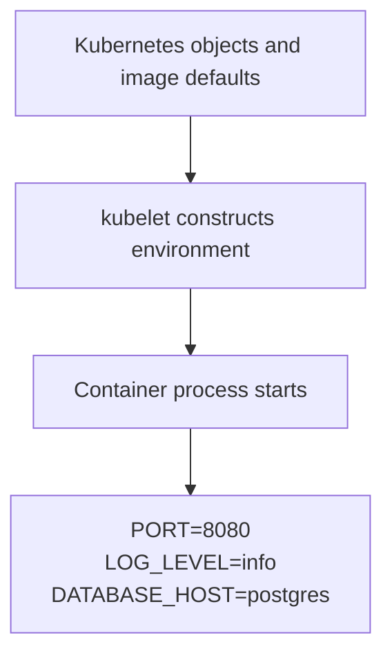
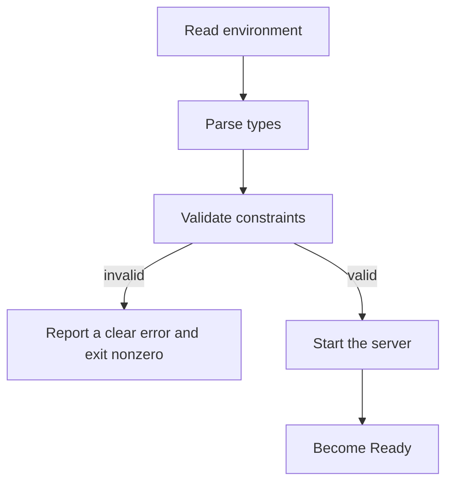
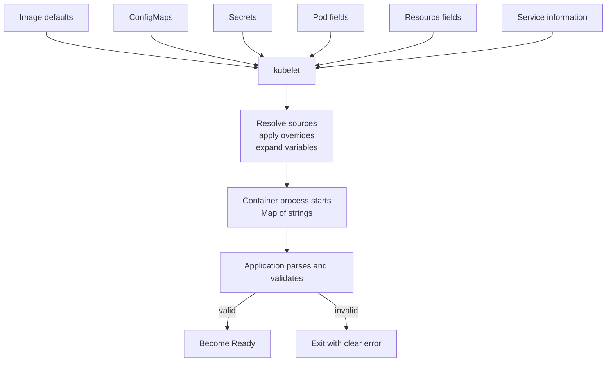

## Table of Contents

1. [What is an environment variable in Kubernetes?](#what-is-an-environment-variable-in-kubernetes)
2. [Where can a container's values come from?](#where-can-a-containers-values-come-from)
3. [How do env and envFrom resolve overlaps?](#how-do-env-and-envfrom-resolve-overlaps)
4. [How does variable expansion work?](#how-does-variable-expansion-work)
5. [How can a container learn its Pod identity?](#how-can-a-container-learn-its-pod-identity)
6. [What happens when a source value changes?](#what-happens-when-a-source-value-changes)
7. [How does an application validate the startup contract?](#how-does-an-application-validate-the-startup-contract)
8. [Check Your Answers](#check-your-answers)
9. [References](#references)

The simplest mental model for Kubernetes environment variables is this:

> A container starts a process with a snapshot of named strings. Kubernetes constructs that snapshot before the process starts.

That model connects `env`, `envFrom`, ConfigMaps, Secrets, the Downward API, expansion, updates, and validation through seven questions:

1. **What is an environment variable in Kubernetes?**
2. **Where can a container's values come from?**
3. **How do env and envFrom resolve overlaps?**
4. **How does variable expansion work?**
5. **How can a container learn its Pod identity?**
6. **What happens when a source value changes?**
7. **How does an application validate the startup contract?**

## What is an environment variable in Kubernetes?
<!-- section-summary: Kubernetes resolves named strings before container startup, and the process keeps that startup snapshot. -->

Begin below Kubernetes, at the operating-system process boundary. A **process** is a running instance of a program, and its **environment** is a collection of named values supplied when it starts:

```text
PORT=8080
LOG_LEVEL=info
DATABASE_HOST=postgres.default.svc
```

An **environment variable** is one `NAME=value` entry in that collection. Every value is a string. The operating system does not know that `PORT="8080"` should become an integer or that `DEBUG="false"` should become a Boolean; application code must interpret those characters.

The environment belongs to the process. Kubernetes objects provide source data, and the **kubelet**, the Kubernetes agent on the Pod's node, resolves that data before starting the container process:


```mermaid
flowchart TD
    Sources[Kubernetes objects and image defaults] --> Kubelet[kubelet constructs environment]
    Kubelet --> Process[Container process starts]
    Process --> Snapshot["PORT=8080<br/>LOG_LEVEL=info<br/>DATABASE_HOST=postgres"]
```

Once the process is running, Kubernetes does not continuously synchronize that environment table. Environment variables are startup configuration rather than live configuration.

Kubernetes does not create a special new kind of variable. The Pod specification simply says which `NAME=value` pairs to place into the container process:

```yaml
containers:
  - name: api
    image: my-api:1.0
    env:
      - name: LOG_LEVEL
        value: "info"
      - name: PORT
        value: "8080"
```

The application receives `LOG_LEVEL=info` and `PORT=8080`. The `env` list is a recipe for constructing that startup environment, not a database to which the process remains connected.

Once that snapshot model is clear, the next question is where Kubernetes can obtain each string.

### Constructing the snapshot is a startup operation

The timeline matters. Before the process exists, Kubernetes has Pod configuration and references to other API objects. The kubelet resolves those references, applies override rules, performs supported expansion, and hands the resulting strings to the container runtime as part of process creation.

```text
Pod specification and referenced objects
-> kubelet resolves NAME=value entries
-> container process starts with that environment
-> application parses and validates the strings
-> application becomes Ready
```

After process creation, the environment belongs to that process. Updating a ConfigMap changes a Kubernetes object, not the memory of an already-running process. This is the same reason a normal operating-system process does not receive a rewritten environment merely because the file or command that originally supplied a value later changes.

The snapshot model also explains why two replicas can temporarily have different environments during a rollout. An older process may have started from configuration `v42`, while its replacement starts from `v43`. Kubernetes does not transform the old process into the new one; it replaces the population through the workload controller.

## Where can a container's values come from?
<!-- section-summary: Image defaults, literals, configuration objects, Pod facts, resources, and service information can all contribute startup strings. -->

An application might expect `PORT`, `LOG_LEVEL`, `DATABASE_HOST`, `DATABASE_PASSWORD`, `POD_NAME`, and `MEMORY_LIMIT`. Those values can come from different owners:

| Source | Kubernetes mechanism | Typical purpose |
|---|---|---|
| Container image | Dockerfile `ENV` | Image defaults |
| Literal Pod configuration | `env.value` | Small deployment-specific values |
| ConfigMap | `configMapKeyRef` | Non-secret configuration |
| Secret | `secretKeyRef` | Credentials or tokens |
| Entire ConfigMap | `envFrom.configMapRef` | Bulk ordinary configuration |
| Entire Secret | `envFrom.secretRef` | Bulk sensitive configuration |
| Pod metadata | `fieldRef` | Pod name, namespace, IP, or node |
| Container resources | `resourceFieldRef` | CPU or memory requests and limits |
| Services | Kubelet-generated service variables | Legacy discovery for Services that existed before the Pod started |

A literal places the string directly in the Pod definition:

```yaml
env:
  - name: LOG_LEVEL
    value: "info"
```

A ConfigMap reference selects one ordinary value:

```yaml
apiVersion: v1
kind: ConfigMap
metadata:
  name: api-config
data:
  database-host: postgres.default.svc
```

```yaml
env:
  - name: DATABASE_HOST
    valueFrom:
      configMapKeyRef:
        name: api-config
        key: database-host
```

The source key `database-host` and process variable `DATABASE_HOST` can have different names. The Pod maps the configuration owner's key to the public interface expected by the application.

A Secret reference uses the same shape for a sensitive value:

```yaml
env:
  - name: DATABASE_PASSWORD
    valueFrom:
      secretKeyRef:
        name: database-credentials
        key: password
```

Inside the process, that value is simply a usable string. Its Secret origin is provenance known to the deployment, not a protective property retained by the process. The application must not log it, and the cluster still needs encryption at rest because Secret objects are not necessarily encrypted in storage by default.

A reference is required unless it sets `optional: true`. If a required ConfigMap, Secret, or selected key is missing, kubelet cannot construct the container's startup environment, so the container does not successfully start. Marking a reference optional changes the contract from “this value is required” to “this value may be absent”; the application then needs a safe behavior for the missing variable.

### Source type records provenance, not runtime type

`env.value`, `configMapKeyRef`, `secretKeyRef`, `fieldRef`, and `resourceFieldRef` answer where Kubernetes should obtain a string. They do not create different kinds of value inside the process. Once startup completes, the application sees one environment map.

For example, `DATABASE_PASSWORD` may come from a Secret, but the running program receives the usable password string. The Secret boundary helps Kubernetes and operators control how that input is stored and granted; it does not prevent the process from logging or mishandling the value. `PORT` may come from a ConfigMap, but it is still the string `"8080"` until application code parses and validates it.

This separates two responsibilities:

```text
Kubernetes: resolve provenance and construct strings
Application: interpret meaning and protect sensitive values
```

Selecting sources one by one is explicit. `envFrom` provides a bulk path, which introduces ordering and precedence rules.

## How do env and envFrom resolve overlaps?
<!-- section-summary: envFrom imports groups of keys, while explicit env entries and later sources take precedence over earlier values. -->

`envFrom` imports all selected key-value pairs from a ConfigMap or Secret:

```yaml
envFrom:
  - configMapRef:
      name: api-config
```

If `api-config` contains these values:

```yaml
data:
  DATABASE_HOST: postgres.default.svc
  LOG_LEVEL: info
```

the process receives both `DATABASE_HOST=postgres.default.svc` and `LOG_LEVEL=info`.

A prefix can place the imported names under a common application namespace:

```yaml
envFrom:
  - prefix: APP_
    configMapRef:
      name: api-config
```

Source keys `HOST` and `PORT` then become `APP_HOST` and `APP_PORT` in the container.

When several sources define the same name, Kubernetes applies two central rules:

1. Among several `envFrom` sources, the later source wins.
2. An explicit `env` entry wins over every `envFrom` value of the same name.

Both `env` and `envFrom` also override a value baked into the container image. Consider this construction:

```yaml
envFrom:
  - configMapRef:
      name: defaults
  - configMapRef:
      name: production
env:
  - name: LOG_LEVEL
    value: "debug"
```

If `defaults` provides `LOG_LEVEL=info` and `PORT=8080`, while `production` provides `LOG_LEVEL=warn` and `DATABASE_HOST=postgres`, the final environment is:

```text
PORT=8080
DATABASE_HOST=postgres
LOG_LEVEL=debug
```

The layers are image defaults, earlier bulk sources, later bulk sources, then explicit entries. This can express base defaults, environment-specific defaults, and a small explicit exception. Too many overlapping layers make it difficult to answer where a value came from, which is why important application dependencies often benefit from explicit `env` mappings.

The contract also differs in breadth. `env.valueFrom` says that the application depends on one selected value. `envFrom` says that the application accepts the entire key set in that source. Importing a large Secret when the process needs only one password widens the sensitive-data boundary. Prefixes can organize a deliberate bulk contract, but shorter YAML is not by itself a reason to use it.

### Reconstruct one conflicting name from bottom to top

Suppose the image contains `LOG_LEVEL=error`. The first `envFrom` ConfigMap sets it to `info`; a later production ConfigMap sets it to `warn`; and explicit `env` sets it to `debug`. The effective value is `debug` because each later layer replaces the earlier value of the same name.

That worked example gives a practical debugging order. Inspect the explicit `env` list first because it has the strongest precedence, then the later `envFrom` sources in reverse order, then earlier sources, and finally image defaults. Reading only the first place where the name appears can produce the wrong answer.

Layering is useful when it expresses ownership—image defaults, environment defaults, then one explicit exception. It becomes harmful when several sources redefine the same names without a clear reason, because the final startup contract becomes difficult to review.

After Kubernetes selects the values and resolves overlaps, it can compose a later value from names already available.

## How does variable expansion work?
<!-- section-summary: Kubernetes substitutes previously available variables into later values using its own ordered $(NAME) syntax. -->

An explicit `env.value` can refer to previously available variables with `$(NAME)`:

```yaml
env:
  - name: HOST
    value: "postgres"
  - name: PORT
    value: "5432"
  - name: ADDRESS
    value: "$(HOST):$(PORT)"
```

The process receives `ADDRESS=postgres:5432`. Kubernetes uses `$(VAR_NAME)`, rather than shell forms such as `$VAR_NAME` or `${VAR_NAME}`. An unresolved reference remains unchanged, and `$$(VAR_NAME)` escapes substitution so the process receives literal `$(VAR_NAME)` text.

Ordering matters because only previously available variables can be expanded. This works:

```yaml
env:
  - name: PROTOCOL
    value: "https"
  - name: URL
    value: "$(PROTOCOL)://example.com"
```

Reversing those entries leaves `$(PROTOCOL)` unresolved when Kubernetes processes `URL`.

Kubelet processes `envFrom` first, then evaluates explicit `env` entries in order while adding each resolved value for later entries. That makes this composition possible:

```yaml
envFrom:
  - configMapRef:
      name: database
env:
  - name: DATABASE_URL
    value: "postgres://$(DATABASE_HOST):$(DATABASE_PORT)/app"
```

If the ConfigMap supplies `DATABASE_HOST=db` and `DATABASE_PORT=5432`, Kubernetes creates `DATABASE_URL=postgres://db:5432/app`.

The ConfigMap itself is not a recursive template. If an imported value contains `postgres://$(HOST):5432`, kubelet loads that text directly. Put the composition in an explicit `env.value`, `command`, or `args` field where Kubernetes performs the expansion step.

Kubernetes expansion and shell expansion are separate interpreters at separate times. This uses Kubernetes substitution while preparing the container command:

```yaml
args:
  - "$(NAME)"
```

This explicitly starts a shell, which later expands `$NAME` inside the running container:

```yaml
command: ["/bin/sh", "-c"]
args:
  - 'echo "$NAME"'
```

Kubernetes does not insert a shell automatically. That timing distinction keeps command construction predictable.

### Expansion is ordered substitution, not a general template engine

Kubelet first makes `envFrom` names available, then walks explicit `env` entries from top to bottom. When it reaches `DATABASE_URL`, it can substitute `DATABASE_HOST` and `DATABASE_PORT` only if those names are already available. A later definition cannot travel backward and repair an earlier unresolved reference.

The same boundary explains why text stored inside a ConfigMap is not recursively rendered. Importing `DATABASE_URL=postgres://$(HOST):5432` through `envFrom` imports that literal value. Moving the composed value into explicit `env.value` tells kubelet to evaluate it at the supported expansion stage.

If a shell is explicitly launched, another interpreter runs later inside the container. Kubernetes `$(NAME)` substitution happens while constructing the command; shell `$NAME` substitution happens after `/bin/sh` starts. Keeping the syntax and timing separate prevents a value from being expanded by the wrong layer—or left literal unexpectedly.

Static configuration explains what the program should do. The Downward API adds facts about the particular Pod Kubernetes created.

## How can a container learn its Pod identity?
<!-- section-summary: The Downward API places selected Pod fields and container resource values into the startup environment. -->

A Deployment can create several Pods from the same image, each with a different generated name, IP address, and node assignment. The **Downward API** lets information flow from Kubernetes' view of a Pod down into the container without giving the application Kubernetes API credentials.

`fieldRef` selects Pod fields:

```yaml
env:
  - name: POD_NAME
    valueFrom:
      fieldRef:
        fieldPath: metadata.name
  - name: POD_NAMESPACE
    valueFrom:
      fieldRef:
        fieldPath: metadata.namespace
  - name: POD_IP
    valueFrom:
      fieldRef:
        fieldPath: status.podIP
  - name: NODE_NAME
    valueFrom:
      fieldRef:
        fieldPath: spec.nodeName
```

The process might receive:

```text
POD_NAME=api-7cc9f7c869-x7p4q
POD_NAMESPACE=production
POD_IP=10.42.7.19
NODE_NAME=worker-03
```

The Downward API can expose the Pod name, namespace, UID, selected labels and annotations, ServiceAccount, node name, Pod IP, and host IP.

`resourceFieldRef` selects the container's declared CPU or memory request or limit:

```yaml
env:
  - name: MEMORY_LIMIT
    valueFrom:
      resourceFieldRef:
        resource: limits.memory
  - name: CPU_REQUEST
    valueFrom:
      resourceFieldRef:
        resource: requests.cpu
```

A **request** describes the resource amount used for scheduling, while a **limit** describes the maximum configured for the container. These values let the application answer who it is, where it runs, and what resources it was given without calling the Kubernetes API.

Downward API values delivered through environment variables join the same startup snapshot. That returns the discussion to the central lifecycle question: what happens when any source object changes afterward?

### Pod identity does not require API credentials

The Downward API is useful because it exposes a controlled set of facts without giving the application a token and asking it to query the Kubernetes API. A replica can label logs with its Pod name, namespace, or Node, and it can inspect its declared resource budget through ordinary environment values.

Those facts still follow snapshot semantics. A generated Pod name and assigned Node naturally remain associated with that Pod, while a resource value delivered through the startup environment does not become a live subscription. The mechanism is information delivery, not general access to cluster state.

## What happens when a source value changes?
<!-- section-summary: Running processes keep their startup environment, while new Pods resolve the current source values. -->

Suppose a ConfigMap originally contains `LOG_LEVEL=info`, and the container starts with that value. If someone changes the ConfigMap to `LOG_LEVEL=debug`, the API object now says `debug` while the running process still holds `info`.

ConfigMaps and Secrets consumed through environment variables follow this same rule. Changing the source cannot mutate the environment of an already-running process. New Pods must start to receive the new snapshot.

Normal ConfigMap and Secret volume files have a different contract: Kubernetes can eventually refresh those projected files, and the application can reread them. A `subPath` mount is an exception and does not receive those automatic file updates.

This distinction creates a practical choice:

```text
Setting remains fixed for one process lifetime -> environment variable
Setting may change while the process runs      -> mounted file plus application reload
```

Requiring a restart for environment configuration can be useful. With twenty replicas, uncontrolled live propagation could leave some processes on the old value and others on the new value. A controlled Deployment rollout makes the two generations visible:

```text
Pod generation A: image=v17, config=v42
Pod generation B: image=v17, config=v43
```

The Deployment replaces generation A with generation B according to its rollout behavior. Teams commonly connect a configuration change to the Pod template or a configuration hash so Kubernetes creates that new generation.

The deeper rule is:

> Configuration version and application version together define the program that is actually running.

### Restarting turns configuration into a visible generation change

With twenty replicas, live mutation could leave twelve processes using an old in-memory value while eight have reloaded a new one. Startup configuration makes the transition explicit instead: one Pod generation runs image `v17` with config `v42`; the next runs the same image with config `v43`.

The workload controller can then apply its normal readiness and availability behavior while replacing the population. Operators can observe which generation is Ready, stop a failing rollout, and return the Pod template to the earlier configuration reference. Requiring new processes is therefore a consistency tool, not only a limitation of environment variables.

Kubernetes can construct a consistent snapshot, but it cannot decide whether the strings form a valid application configuration. That responsibility belongs at process startup.

## How does an application validate the startup contract?
<!-- section-summary: The application parses, validates, and safely reports its startup strings before becoming ready. -->

Linux accepts strings such as `PORT=banana`, `LOG_LEVEL=LOUD`, `DATABASE_URL=`, and `REQUEST_TIMEOUT=-3`. Kubernetes can deliver them, but it does not know the application's domain rules.

A well-designed application treats its environment as a startup interface:


```mermaid
flowchart TD
    Environment[Read environment] --> Parse[Parse types]
    Parse --> Validate[Validate constraints]
    Validate -->|invalid| Error[Report a clear error and exit nonzero]
    Validate -->|valid| Start[Start the server]
    Start --> Ready[Become Ready]
```

The application can require `DATABASE_HOST`, parse `PORT` as an integer from 1 to 65535, require a positive request timeout, allow only known log levels, and require `DATABASE_PASSWORD`. It should perform those checks before accepting traffic. Bad configuration then makes the container exit and prevents the rollout from completing successfully, rather than failing later during a customer request.

Diagnostics should name invalid variables without printing sensitive values:

```text
Invalid configuration:
  PORT: expected integer between 1 and 65535
  DATABASE_PASSWORD: required variable is missing
  LOG_LEVEL: expected debug|info|warn|error
```

The order of startup work should make that report possible before traffic arrives:

| Step | Example responsibility | Failure behavior |
|---|---|---|
| Read | Obtain `PORT`, `LOG_LEVEL`, and database names from the environment | Report which required name is absent |
| Parse | Convert `PORT` from text into an integer and a timeout into a duration | Report the expected type without echoing secrets |
| Validate | Check the port range, positive timeout, and allowed log levels | Exit nonzero with the violated constraint |
| Initialize | Build connection pools and other state from the validated configuration | Remain unready if initialization cannot complete |
| Serve | Start accepting requests only after the startup contract succeeds | Become Ready |

This sequence converts a bad deployment input into immediate, attributable evidence. `PORT=banana` fails while the new container is starting, so the rollout does not replace healthy capacity with a process that will fail later on a customer request. Kubernetes reports the container behavior; the application supplies the domain-specific explanation.

Sensitive inputs need the same validation with safer output. The program can report that `DATABASE_PASSWORD` is missing or empty, but printing the resolved password would move a Secret into logs. The diagnostic contract should reveal the variable name and failed rule while withholding its confidential value.

Readiness completes the handoff: Kubernetes should route work only after the process has accepted this startup interface. A container that merely stays running has not yet proved that its assembled environment is usable.

That final signal connects configuration correctness to controlled rollout progress across every replica safely.

The complete source-resolution example brings every rule together:

```yaml
apiVersion: v1
kind: Pod
metadata:
  name: payments-api
spec:
  containers:
    - name: api
      image: payments-api:v17
      envFrom:
        - configMapRef:
            name: payments-defaults
      env:
        - name: LOG_LEVEL
          value: "info"
        - name: DATABASE_PASSWORD
          valueFrom:
            secretKeyRef:
              name: payments-database
              key: password
        - name: POD_NAME
          valueFrom:
            fieldRef:
              fieldPath: metadata.name
        - name: POD_NAMESPACE
          valueFrom:
            fieldRef:
              fieldPath: metadata.namespace
        - name: MEMORY_LIMIT
          valueFrom:
            resourceFieldRef:
              resource: limits.memory
        - name: DATABASE_URL
          value: "postgres://$(DATABASE_HOST):$(DATABASE_PORT)/payments"
```

Mentally execute the assembly. Image defaults come first. `payments-defaults` supplies `DATABASE_HOST`, `DATABASE_PORT`, and perhaps `LOG_LEVEL=warn`. The explicit literal overrides that log level with `info`. The Secret supplies the password, the Downward API supplies Pod identity, `resourceFieldRef` supplies the memory limit, and the final entry expands the previously available database host and port.

At startup, the process sees one map of strings:

```text
DATABASE_HOST=postgres
DATABASE_PORT=5432
LOG_LEVEL=info
DATABASE_PASSWORD=...
POD_NAME=payments-api
POD_NAMESPACE=default
MEMORY_LIMIT=...
DATABASE_URL=postgres://postgres:5432/payments
```

The process no longer sees ConfigMap, Secret, Downward API, `envFrom`, or `valueFrom` as separate mechanisms. It receives `Map<String, String>` and owns the interpretation and safe handling of every entry.

The complete mental model is:


```mermaid
flowchart TD
    Image[Image defaults] --> Kubelet[kubelet]
    ConfigMaps[ConfigMaps] --> Kubelet
    Secrets[Secrets] --> Kubelet
    PodFields[Pod fields] --> Kubelet
    Resources[Resource fields] --> Kubelet
    Services[Service information] --> Kubelet
    Kubelet --> Resolve["Resolve sources<br/>apply overrides<br/>expand variables"]
    Resolve --> Process["Container process starts<br/>Map of strings"]
    Process --> Validate[Application parses and validates]
    Validate -->|valid| Ready[Become Ready]
    Validate -->|invalid| Exit[Exit with clear error]
```

Three ideas are worth retaining:

1. Environment variables are a snapshot; source changes do not mutate a running process.
2. Kubernetes resolves provenance, while the application resolves meaning.
3. The environment is a versioned startup API between deployment and application, not a collection of unrelated strings.

## Check Your Answers
<!-- section-summary: Revisit the seven questions that connect source values to one validated process snapshot. -->

:::expand[What is an environment variable in Kubernetes?]{kind="recap"}
It is one named string in the environment Kubernetes constructs before a container process starts. The process keeps that startup snapshot, and the application decides how to interpret every string.
:::

:::expand[Where can a container's values come from?]{kind="recap"}
Values can come from image defaults, Pod literals, individual or whole ConfigMaps and Secrets, Pod fields, resource fields, and legacy Service information. Required references must resolve before startup unless the Pod explicitly makes them optional.
:::

:::expand[How do env and envFrom resolve overlaps?]{kind="recap"}
Later `envFrom` sources override earlier bulk sources, explicit `env` overrides `envFrom`, and both override image values. `envFrom` imports a broad group, while explicit `env` entries document individual dependencies.
:::

:::expand[How does variable expansion work?]{kind="recap"}
Kubernetes expands `$(NAME)` from previously available variables, leaves unresolved references unchanged, and uses `$$(NAME)` for a literal reference. This ordered Kubernetes substitution is separate from shell `$NAME` expansion inside a launched shell.
:::

:::expand[How can a container learn its Pod identity?]{kind="recap"}
The Downward API uses `fieldRef` for Pod facts and `resourceFieldRef` for container requests or limits. Those values enter the same startup environment without requiring the application to call the Kubernetes API.
:::

:::expand[What happens when a source value changes?]{kind="recap"}
Existing processes retain their startup values, while newly created Pods resolve the current ConfigMap or Secret. A controlled rollout can move the workload from one image-and-configuration generation to another.
:::

:::expand[How does an application validate the startup contract?]{kind="recap"}
The application checks required names, parses types, validates ranges and allowed values, and exits with a safe error before becoming ready when the contract is invalid. Diagnostics name missing or malformed settings without logging credentials.
:::

## References

- [Define Environment Variables for a Container](https://kubernetes.io/docs/tasks/inject-data-application/define-environment-variable-container/)
- [Pod API Reference: env and envFrom](https://kubernetes.io/docs/reference/kubernetes-api/workload-resources/pod-v1/)
- [Define Dependent Environment Variables](https://kubernetes.io/docs/tasks/inject-data-application/define-interdependent-environment-variables/)
- [Expose Pod Information Through Environment Variables](https://kubernetes.io/docs/tasks/inject-data-application/environment-variable-expose-pod-information/)
- [ConfigMaps](https://kubernetes.io/docs/concepts/configuration/configmap/)
- [Secrets](https://kubernetes.io/docs/concepts/configuration/secret/)
