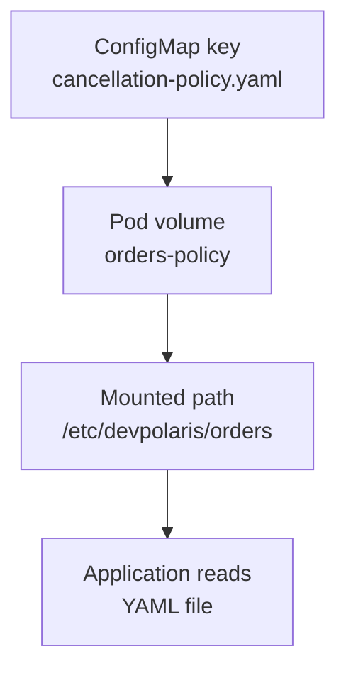

## Table of Contents

1. [Why Some Configuration Belongs on Disk](#why-some-configuration-belongs-on-disk)
2. [Mounting a ConfigMap as a Directory](#mounting-a-configmap-as-a-directory)
3. [Mounting One File with items](#mounting-one-file-with-items)
4. [Using subPath Carefully](#using-subpath-carefully)
5. [Secret Files and Certificates](#secret-files-and-certificates)
6. [Reload Behavior and Application Design](#reload-behavior-and-application-design)
7. [Failure Mode: A Mount Hides Image Files](#failure-mode-a-mount-hides-image-files)
8. [Diagnostics from Pod to Process](#diagnostics-from-pod-to-process)
9. [Choosing Files or Environment Variables](#choosing-files-or-environment-variables)
10. [File Ownership and Read-Only Expectations](#file-ownership-and-read-only-expectations)

## Why Some Configuration Belongs on Disk

Environment variables are convenient for short strings, but many tools already expect configuration files. Nginx reads `.conf` files. OpenTelemetry collectors read YAML. TLS libraries often expect certificate files. Your own application may have a structured config file that is easier to validate than dozens of separate environment variables.

Kubernetes supports this by mounting ConfigMaps and Secrets as volumes. A volume is a directory made available inside the container filesystem. For ConfigMaps and Secrets, Kubernetes builds that directory from object keys. Each key becomes a file, and the value becomes the file content.

For `devpolaris-orders-api`, imagine the team adds an embedded policy file for order cancellation rules. The file is not secret, but it is multi-line YAML. Keeping it in one mounted file is easier to review than flattening it into environment variables.



The mental model is simple: Kubernetes creates a small filesystem view from the API object. Your process reads ordinary files. The tricky parts are mount paths, update behavior, and the fact that mounting a directory can hide files that were already in the image at that path.

## Mounting a ConfigMap as a Directory

Start with a ConfigMap that has one multi-line key. The key name is the filename you want inside the mounted directory.

```yaml
apiVersion: v1
kind: ConfigMap
metadata:
  name: orders-api-files
  namespace: devpolaris-staging
data:
  cancellation-policy.yaml: |
    refunds:
      enabled: false
      allowedReasons:
        - duplicate_order
        - customer_request
    cancellationWindowMinutes: 30
```

The Deployment defines a volume from that ConfigMap and mounts it into the container. The `readOnly` flag makes the intent clear. The application should treat these files as inputs from Kubernetes, not as a place to write runtime state.

```yaml
apiVersion: apps/v1
kind: Deployment
metadata:
  name: orders-api
  namespace: devpolaris-staging
spec:
  template:
    spec:
      volumes:
        - name: orders-policy
          configMap:
            name: orders-api-files
      containers:
        - name: api
          image: ghcr.io/devpolaris/orders-api:1.18.0
          volumeMounts:
            - name: orders-policy
              mountPath: /etc/devpolaris/orders
              readOnly: true
```

Inside the container, the app reads `/etc/devpolaris/orders/cancellation-policy.yaml`. Kubernetes handles the file creation before the application starts.

```bash
$ kubectl exec deploy/orders-api -n devpolaris-staging -- ls -l /etc/devpolaris/orders
total 0
-rw-r--r-- 1 root root 121 May  7 12:31 cancellation-policy.yaml

$ kubectl exec deploy/orders-api -n devpolaris-staging -- cat /etc/devpolaris/orders/cancellation-policy.yaml
refunds:
  enabled: false
  allowedReasons:
    - duplicate_order
    - customer_request
cancellationWindowMinutes: 30
```

Those commands prove the file exists, but they should not be your normal production verification for sensitive data. For non-secret config, direct inspection is fine. For Secret files, verify presence, path, and application behavior without dumping values.

## Mounting One File with items

A ConfigMap can contain several keys, but a container may need only one. The `items` field lets you choose specific keys and filenames. This reduces accidental coupling between one ConfigMap and every container that mounts it.

```yaml
volumes:
  - name: orders-policy
    configMap:
      name: orders-api-files
      items:
        - key: cancellation-policy.yaml
          path: policy.yaml
```

With that mapping, the file appears as `/etc/devpolaris/orders/policy.yaml` even though the ConfigMap key is `cancellation-policy.yaml`.

```bash
$ kubectl exec deploy/orders-api -n devpolaris-staging -- find /etc/devpolaris/orders -maxdepth 1 -type f -print
/etc/devpolaris/orders/policy.yaml
```

This is useful when the application expects a fixed filename that is different from your ConfigMap key. It also makes the mounted directory easier to inspect because it contains only files the process actually uses.

If a listed key does not exist, the Pod fails to start. Kubernetes treats `items` as an exact request. That failure is helpful because a missing file would probably break the application anyway.

## Using subPath Carefully

Sometimes you want to mount one file into a directory that already contains other files from the image. Kubernetes has a `subPath` feature for this. It mounts one file from a volume at one target path instead of mounting the whole volume directory.

```yaml
volumeMounts:
  - name: orders-policy
    mountPath: /app/config/policy.yaml
    subPath: policy.yaml
    readOnly: true
```

This keeps `/app/config` from being replaced by the mounted volume. Only `/app/config/policy.yaml` comes from the ConfigMap.

The tradeoff is update behavior. ConfigMap and Secret volume updates are designed around mounted directories. When you mount a single file with `subPath`, the running container may not receive updates to that file the same way. If you use `subPath` for configuration, plan on restarting Pods when the source changes.

A safe rule for beginners is to prefer mounting a dedicated directory such as `/etc/devpolaris/orders`. Use `subPath` only when an existing tool requires one exact path inside a directory that must keep its image contents.

## Secret Files and Certificates

Secret file mounts look almost the same as ConfigMap file mounts, but the review and diagnostic behavior must be stricter. A common example is a certificate authority bundle or API token file.

```yaml
apiVersion: v1
kind: Secret
metadata:
  name: orders-api-client-cert
  namespace: devpolaris-staging
type: kubernetes.io/tls
stringData:
  tls.crt: "example certificate text"
  tls.key: "example private key text"
```

The Deployment can mount the Secret under a path used by the application's HTTP client.

```yaml
volumes:
  - name: client-cert
    secret:
      secretName: orders-api-client-cert
containers:
  - name: api
    image: ghcr.io/devpolaris/orders-api:1.18.0
    volumeMounts:
      - name: client-cert
        mountPath: /var/run/secrets/devpolaris/client-cert
        readOnly: true
```

Verification should avoid printing the private key. Check filenames, permissions, and application logs.

```bash
$ kubectl exec deploy/orders-api -n devpolaris-staging -- ls -l /var/run/secrets/devpolaris/client-cert
total 0
-rw-r--r-- 1 root root 1115 May  7 12:47 tls.crt
-rw-r--r-- 1 root root 1679 May  7 12:47 tls.key

$ kubectl logs deploy/orders-api -n devpolaris-staging | grep 'client certificate loaded' | tail -1
2026-05-07T12:47:31.902Z INFO client certificate loaded path=/var/run/secrets/devpolaris/client-cert/tls.crt
```

The log proves the application used the file without copying the key into output.

## Reload Behavior and Application Design

Mounted ConfigMap and Secret volumes can update while a Pod is running, but your application still has to notice. A process that reads a YAML file once during startup will keep using the old parsed value until it restarts or reloads. A process that watches the file or reloads on a signal can pick up changes differently.

For `devpolaris-orders-api`, the simplest design is startup validation plus rollout restart. The app reads `policy.yaml`, validates it, logs the policy version, and serves traffic. When the policy changes, the Deployment restarts so every Pod reads the new file from startup.

```text
2026-05-07T13:02:09.113Z INFO policy loaded path=/etc/devpolaris/orders/policy.yaml version=2026-05-07.1 cancellationWindowMinutes=30
```

A more advanced design watches the file and reloads it. That reduces restarts but adds application complexity. The app must handle partial updates, invalid new files, and consistent behavior while requests are in flight.

| Reload Style | Good For | Risk |
|--------------|----------|------|
| Restart Pods | Most web APIs | Brief rollout needed for every change |
| File watcher | Frequently changed policy files | App must reject invalid updates safely |
| Sidecar reload signal | Tools like Nginx or collectors | More containers and coordination |

Beginners should choose the boring path first: validate at startup, roll Pods deliberately, and keep the verification clear.

## Failure Mode: A Mount Hides Image Files

A directory mount replaces the view at the mount path. If your image already has files in `/app/config` and you mount a ConfigMap at `/app/config`, the process sees the ConfigMap files there, not the original image files.

The failure looks like a missing file inside the application even though the file exists in the image.

```text
2026-05-07T13:15:42.606Z ERROR startup failed
error="ENOENT: no such file or directory, open '/app/config/defaults.yaml'"
```

The Deployment may have caused it:

```yaml
volumeMounts:
  - name: orders-policy
    mountPath: /app/config
    readOnly: true
```

If `/app/config/defaults.yaml` was baked into the image, this mount hides it. Diagnose by listing the directory inside the running container and comparing the mount path with the Dockerfile or image contents.

```bash
$ kubectl exec deploy/orders-api -n devpolaris-staging -- ls -l /app/config
total 0
-rw-r--r-- 1 root root 121 May  7 13:14 policy.yaml
```

The fix is to mount the ConfigMap at a dedicated path, or use `subPath` for one file if the application truly needs that exact location.

## Diagnostics from Pod to Process

Mounted file problems can fail at several layers. Kubernetes may fail to create the Pod if the object or key is missing. The container may start but the application may fail because the file path is wrong. The application may start but behave incorrectly because the file content is valid YAML with the wrong meaning.

Use a layered diagnostic path:

```bash
$ kubectl describe pod orders-api-66fd48ff7f-qk9mm -n devpolaris-staging
$ kubectl exec deploy/orders-api -n devpolaris-staging -- mount | grep devpolaris
$ kubectl exec deploy/orders-api -n devpolaris-staging -- find /etc/devpolaris/orders -maxdepth 1 -type f -ls
$ kubectl logs deploy/orders-api -n devpolaris-staging | grep 'policy loaded'
```

Each command answers a different question. `describe` tells you whether kubelet mounted the volume. `mount` shows the filesystem view. `find` confirms filenames. Logs show whether the application parsed and accepted the content.

That order prevents wasted effort. If the Pod event says the ConfigMap key is missing, do not debug YAML parsing yet. If the file exists but the app rejected it, do not recreate the Secret or ConfigMap blindly.

## Choosing Files or Environment Variables

Both environment variables and mounted files are good Kubernetes patterns. The choice depends on how the application naturally consumes configuration and how you want updates to behave.

| Use Environment Variables When | Use Mounted Files When |
|--------------------------------|------------------------|
| Values are short strings | Values are multi-line or structured |
| App reads config only at startup | Tool expects a file path |
| You want the Deployment to show each key | You want a directory of related files |
| Restart on change is acceptable | File permissions and paths matter |

For `devpolaris-orders-api`, `PORT` and `LOG_LEVEL` are environment variables. `cancellation-policy.yaml` is a mounted ConfigMap file. TLS material is a mounted Secret file. That split follows the shape of the data instead of forcing every setting through one mechanism.

The skill is not memorizing a preferred pattern. The skill is tracing how the value moves from a Kubernetes object to the process and knowing which layer to inspect when the process does not see what you expected.

## File Ownership and Read-Only Expectations

Mounted ConfigMap and Secret files are meant to be inputs. The application should not try to edit them. If `devpolaris-orders-api` needs to generate a local cache from a policy file, it should write that cache to a separate writable path such as an `emptyDir` or PVC, not back into the mounted config directory.

A write attempt usually fails with a read-only filesystem error.

```text
2026-05-07T13:31:18.223Z ERROR failed to persist policy cache
path=/etc/devpolaris/orders/policy-cache.json error="EROFS: read-only file system"
```

The fix is to separate source configuration from generated runtime data.

```yaml
volumes:
  - name: orders-policy
    configMap:
      name: orders-api-files
  - name: policy-cache
    emptyDir: {}
volumeMounts:
  - name: orders-policy
    mountPath: /etc/devpolaris/orders
    readOnly: true
  - name: policy-cache
    mountPath: /var/cache/devpolaris/orders
```

That split makes the filesystem contract obvious. Kubernetes-owned files stay read-only. Application-owned scratch files go somewhere disposable or durable depending on their purpose.

---

**References**

- [Kubernetes Volumes](https://kubernetes.io/docs/concepts/storage/volumes/) - Official concept page for Kubernetes volume types, mount behavior, and Pod-level volume configuration.
- [Configure a Pod to Use a ConfigMap](https://kubernetes.io/docs/tasks/configure-pod-container/configure-pod-configmap/) - Official task guide for mounting ConfigMaps and exposing them to containers.
- [Kubernetes Secrets](https://kubernetes.io/docs/concepts/configuration/secret/) - Official concept page for Secret types, storage cautions, and Pod usage patterns.
- [Troubleshooting Applications](https://kubernetes.io/docs/tasks/debug/debug-application/) - Official debugging entry point for inspecting Pods, events, logs, and application failures.
