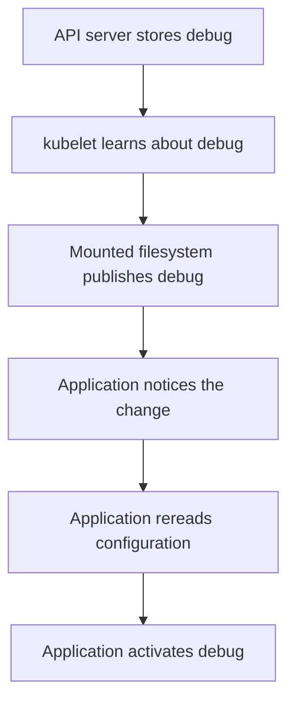

## Table of Contents

1. [Why does some configuration fit a file better than environment variables?](#why-does-some-configuration-fit-a-file-better-than-environment-variables)
2. [How does a ConfigMap key reach an application path?](#how-does-a-configmap-key-reach-an-application-path)
3. [How does Kubernetes replace projected files safely?](#how-does-kubernetes-replace-projected-files-safely)
4. [When does changed content affect application behaviour?](#when-does-changed-content-affect-application-behaviour)
5. [Why does subPath follow a different update path?](#why-does-subpath-follow-a-different-update-path)
6. [When does an immutable ConfigMap fit a release?](#when-does-an-immutable-configmap-fit-a-release)
7. [How do permissions and diagnosis complete the design?](#how-do-permissions-and-diagnosis-complete-the-design)
8. [Check Your Answers](#check-your-answers)
9. [References](#references)

A running program knows how to open a path, read bytes, and parse them. It does not need to understand ConfigMaps, Kubernetes manifests, or the Kubernetes API. Mounted configuration therefore begins with one concrete problem: how can Kubernetes make the desired bytes appear at the path the application already expects?

The complete path crosses several separate states:

```mermaid
flowchart TD
    ConfigMap[ConfigMap in API server] --> Kubelet[kubelet]
    Kubelet --> Projection[Projected volume on node]
    Projection --> Mount[Container mount]
    Mount --> File[/etc/myapp/config.yaml]
    File --> Parse[Application reads and parses file]
    Parse --> Memory[In-memory application configuration]
```

A ConfigMap update, a projected-file update, and an application reload are different events.

Configuration can reach a process through environment variables, command-line arguments, files, an API, or a combination of those interfaces. Files are especially useful when the application already expects formats such as `nginx.conf`, `application.yaml`, `prometheus.yml`, `log4j2.xml`, or `haproxy.cfg`.

Keep these questions in view as you work through the lesson:

1. **Why does some configuration fit a file better than environment variables?**
2. **How does a ConfigMap key reach an application path?**
3. **How does Kubernetes replace projected files safely?**
4. **When does changed content affect application behaviour?**
5. **Why does `subPath` follow a different update path?**
6. **When does an immutable ConfigMap fit a release?**
7. **How do permissions and diagnosis complete the design?**

## Why does some configuration fit a file better than environment variables?
<!-- section-summary: A file preserves structured configuration in the format and path an application already understands. -->

Consider this structured YAML:

```yaml
server:
  port: 8080
database:
  host: postgres
  pool:
    min: 5
    max: 20
```

It could be flattened into independent strings:

```text
SERVER_PORT=8080
DATABASE_HOST=postgres
DATABASE_POOL_MIN=5
DATABASE_POOL_MAX=20
```

The file preserves the parent-child structure and the application's native configuration language. Kubernetes can focus on delivering the bytes while the application remains responsible for understanding their meaning.

Files and environment variables also have different update lifecycles. ConfigMap-backed environment values are copied into the process at container startup and require a new Pod to change. Kubernetes can refresh the files in a mounted ConfigMap volume while the Pod continues running, although the application must still reread them.

ConfigMaps carry ordinary, non-confidential configuration and have a 1 MiB limit. Confidential values belong in Secrets, and larger content belongs in storage designed for larger files.

Once a file is the right interface, the first mechanical question is how a named ConfigMap entry becomes the exact path the program opens.

### Choose the interface the application already has

Imagine an application whose documentation says, “start the process with `--config=/etc/myapp/config.yaml`.” Supplying four environment variables would force the deployment author to invent a translation from the file schema into variable names, and the application would still need code for that alternate interface. Mounting the file preserves the existing contract:

```text
application contract: open /etc/myapp/config.yaml
Kubernetes job:        place the intended bytes at that path
application job:       parse and validate those bytes
```

This division also keeps types and structure where they belong. Kubernetes does not decide whether `pool.max: 20` is a number, whether `debug` is an allowed log level, or whether the database section is complete. It publishes strings and files. The application's configuration parser gives those bytes domain meaning.

The choice is therefore not “files are always better.” A small independent startup value can be clear as an environment variable. A structured document, especially one already understood by the program, is usually clearer as a file. The rest of this article follows the file path because that path has update and filesystem behavior that operators must understand.

## How does a ConfigMap key reach an application path?
<!-- section-summary: The ConfigMap key supplies a filename and bytes, while the Pod volume and container mount supply the destination directory. -->

Start with one key containing a complete file:

```yaml
apiVersion: v1
kind: ConfigMap
metadata:
  name: myapp-config
data:
  config.yaml: |
    server:
      port: 8080
    logLevel: info
```

The Pod defines a **volume**, a Pod-level data source backed by that ConfigMap:

```yaml
volumes:
  - name: config
    configMap:
      name: myapp-config
```

The container then **mounts** the volume, making it visible at a filesystem location:

```yaml
volumeMounts:
  - name: config
    mountPath: /etc/myapp
```

Unless `items` says otherwise, every ConfigMap key becomes a filename below `mountPath`. The basic equation is:

```text
application path = mountPath + "/" + ConfigMap key
```

Here, `config.yaml` appears as `/etc/myapp/config.yaml`, and the key's string value becomes the file contents.

The key and final filename do not have to match. `items` can select keys and assign relative paths:

```yaml
volumes:
  - name: config
    configMap:
      name: myapp-config
      items:
        - key: config.yaml
          path: application.yaml
```

With the same mount, the file appears at `/etc/myapp/application.yaml`. When `items` is present, only the selected keys enter the volume, and the mapping can also set per-file permissions.

A filesystem mount takes over its target path. If the image already contains `defaults.yaml`, `templates/`, and `config.yaml` under `/etc/myapp`, mounting a ConfigMap at `/etc/myapp` hides those image files through that path. This is normal filesystem mount behavior. A dedicated configuration directory avoids unintentionally covering files supplied by the image.

### Put the complete path together

The ConfigMap and Pod can be read as one delivery contract:

```yaml
apiVersion: v1
kind: ConfigMap
metadata:
  name: myapp-config
data:
  config.yaml: |
    server:
      port: 8080
    logLevel: info
---
apiVersion: v1
kind: Pod
metadata:
  name: myapp
spec:
  containers:
    - name: app
      image: example/myapp:1.0
      args: ["--config=/etc/myapp/config.yaml"]
      volumeMounts:
        - name: config
          mountPath: /etc/myapp
          readOnly: true
  volumes:
    - name: config
      configMap:
        name: myapp-config
```

Read it from the bottom upward. `configMap.name` chooses the API object. The volume gives that source the Pod-local name `config`. `volumeMounts.name` connects the container to that volume. `mountPath` chooses the visible directory. Finally, the argument tells the process which file to open. A name mismatch at any link breaks delivery even though every individual YAML block is valid.

Now suppose the ConfigMap also contains `logging.yaml`, but `items` selects only `config.yaml` and renames it to `application.yaml`. The unselected logging key will not appear in the volume, and the application must open `/etc/myapp/application.yaml`. `items` is not just documentation: it changes the projected file set and therefore changes the application-facing filesystem contract.

The path mapping explains where the bytes appear. The next mechanism explains how Kubernetes publishes a new multi-file version without exposing a half-written set.

## How does Kubernetes replace projected files safely?
<!-- section-summary: Kubelet prepares a complete hidden version and atomically switches the data link that visible files follow. -->

Imagine a configuration volume with three related files:

```text
/config/
├── database.yaml
├── logging.yaml
└── feature-flags.yaml
```

Overwriting them one at a time could expose a **torn configuration**: for a short period, one file might contain version 2 while the others still contain version 1. The set would represent neither complete version.

Kubernetes uses an implementation called `AtomicWriter` for projected volumes. Rather than edit the visible files in place, kubelet builds a complete hidden version and then changes which version the visible paths resolve to.

A simplified volume layout looks like this:

```text
/config/
├── ..2026_08_20_14_30_00/
│   └── config.yaml
├── ..data -> ..2026_08_20_14_30_00/
└── config.yaml -> ..data/config.yaml
```

A **symbolic link**, or symlink, is a filesystem entry that points to another path. The user-visible `config.yaml` points through `..data`, and `..data` points to the timestamped directory containing the current bytes.

For an update, kubelet:

1. Creates a new timestamped directory.
2. Writes the complete payload and permissions into it.
3. Creates a temporary `..data_tmp` link to that directory.
4. Atomically renames that link to `..data`.

The rename is the publication point. Before it, path lookups reach version 1; after it, they reach version 2. Kubernetes is publishing a complete configuration version rather than editing a file in place.

“Atomic” applies to that filesystem-namespace switch. It does not make an application's own multi-file reads transactional. An application could open one path before the switch and another afterward. A **file descriptor**, the process's handle to an already opened file, also stays attached to the earlier filesystem object until the application closes and reopens it.

Filesystem watchers must account for the symlink layout. Kubernetes' implementation notes that consumers can monitor the `..data` link for updates, then reopen the relevant paths. Watching only an old target file may miss the relationship when kubelet switches the published version.

### Follow one update through the directory

Suppose version 1 contains three mutually compatible files:

```text
..version-1/
├── database.yaml      # schema A
├── logging.yaml       # info
└── feature-flags.yaml # checkout-v1
```

Kubelet receives version 2. It does not make `database.yaml` visible and then begin writing `logging.yaml`. It first prepares another complete directory:

```text
..version-2/
├── database.yaml      # schema B
├── logging.yaml       # debug
└── feature-flags.yaml # checkout-v2
```

While that directory is being prepared, `..data` still points to version 1. Once all payload files and modes are ready, the publication rename makes `..data` point to version 2. A fresh lookup of any visible path now travels through the new link.

The guarantee is deliberately narrow and useful: Kubernetes does not publish a directory that it is still constructing. It cannot control the order in which application code opens several files. If the application needs all three to form one logical transaction, it should detect the new version, open a complete candidate set, validate relationships between the files, and then replace its in-memory settings as one application operation.

An already-open descriptor explains another common surprise. The process may have opened version 1's `config.yaml` once and retained that descriptor. Changing `..data` changes future path resolution; it does not detach that existing handle and attach it to version 2. A correct reload path normally closes or stops using the old handle and opens the public pathname again.

Atomic projection gives Kubernetes a clean delivery boundary. Application reload begins after that boundary.

Keeping that boundary visible prevents operators from blaming the API, kubelet, filesystem, and process as though they were one indivisible configuration mechanism.

## When does changed content affect application behaviour?
<!-- section-summary: Kubelet eventually publishes fresh bytes, while the application decides whether and when those bytes replace its in-memory configuration. -->

Suppose `kubectl edit configmap myapp-config` changes `logLevel: info` to `logLevel: debug`. The change passes through several independent stages:


```mermaid
flowchart TD
    API[API server stores debug] --> Observe[kubelet learns about debug]
    Observe --> Files[Mounted filesystem publishes debug]
    Files --> Notice[Application notices the change]
    Notice --> Read[Application rereads configuration]
    Read --> Apply[Application activates debug]
```

Kubernetes owns the first three stages. Kubelet periodically reconciles projected data, and its configured change-detection strategy determines how it learns about an updated ConfigMap. The default strategy uses watches. The normal delay relates to the kubelet sync period plus cache or watch propagation delay, so the file refresh is eventual rather than immediate.

The application owns the remaining stages because Kubernetes does not know what `logLevel: debug` means. A process might read the file only at startup, poll it periodically, watch the directory, or wait for a signal such as `SIGHUP` or an explicit reload command.

An application that loads once keeps the old parsed value in memory even after the file contains new bytes. When the application appears stale, the crucial question is whether the file is stale or application memory is stale. Those failures belong to different parts of the chain.

A reload-capable application should reopen the paths, parse and validate a complete candidate, then replace its active in-memory configuration only after the candidate succeeds. If parsing fails, it can keep the last valid version rather than partially applying a broken configuration.

### Separate delivery evidence from adoption evidence

For the `info` to `debug` change, each boundary has a different proof:

| Boundary | Question | Useful evidence |
|---|---|---|
| Desired object | Did the API accept `debug`? | ConfigMap YAML contains `debug` |
| Pod wiring | Is this Pod using that object and path? | Pod spec names the ConfigMap and mount |
| Filesystem delivery | Did kubelet publish the bytes? | `cat` inside the container prints `debug` |
| Parsing | Did the application accept the file? | Reload or application logs report success |
| In-memory adoption | Is the active setting now `debug`? | Application behaviour or its status endpoint changes |

These proofs prevent a misleading restart loop. If the API object still contains `info`, restarting the Pod simply starts another process with the old source. If the mounted file contains `debug` but parsing rejects the document, waiting longer for kubelet changes nothing. Diagnosis advances only after the current boundary is proven.

There are two valid operating models. In the **live-reload model**, kubelet refreshes the directory and the application deliberately adopts a valid new version. In the **release model**, the process reads once at startup and new Pods carry a new configuration identity. Trouble begins when a team expects live behavior from a startup-only application without defining which component performs the reload.

This separation makes the next exception easier to understand: `subPath` changes the filesystem relationship, so the normal projection switch no longer moves the mounted application path.

## Why does `subPath` follow a different update path?
<!-- section-summary: A subPath mount pins the selected projected file instead of following later changes to the volume's data link. -->

An application such as Nginx may require exactly `/etc/nginx/nginx.conf` while the image already contains other files under `/etc/nginx`. Mounting the entire ConfigMap over that directory would hide those files, so the Pod may select one file with `subPath`:

```yaml
volumeMounts:
  - name: nginx-config
    mountPath: /etc/nginx/nginx.conf
    subPath: nginx.conf
```

The container receives a mount bound to the selected file from the projected volume. Later ConfigMap updates create a new timestamped directory and repoint `..data`, but the `subPath` mount remains attached to the filesystem object selected during container setup.

```text
Normal directory mount -> later path opens follow the new projection
subPath file mount      -> selected file remains pinned for that Pod
```

Kubernetes therefore documents that ConfigMaps mounted through `subPath` do not receive normal ConfigMap updates. A new Pod is required to select the current file.

Follow the timing carefully. When the container starts, the `subPath` mount selects the then-current projected `nginx.conf`. Editing the ConfigMap later causes the main projected volume to publish another version, but `/etc/nginx/nginx.conf` in that running container remains bound to the earlier selection. Deleting and replacing the Pod runs container setup again, so the new mount selects the current file.

This yields a practical rule: use `subPath` when preserving the rest of a target directory matters and replacement is an acceptable update mechanism. Do not choose it while also expecting the running Pod to follow live ConfigMap projection changes. Those requirements describe different filesystem relationships.

This is a filesystem consequence rather than an unrelated special rule. It also exposes a larger design choice: whether configuration should change beneath a running process at all.

## When does an immutable ConfigMap fit a release?
<!-- section-summary: An immutable, versioned ConfigMap makes configuration part of the Pod release and rollback identity. -->

Hot updates fit dynamic feature flags, routing rules, log settings, and other configuration that the application can reload safely. A release-oriented model is often simpler for startup-only applications:

```text
code version + configuration version = release
```

Instead of editing `myapp-config` forever, create identifiable versions such as `myapp-config-a8172f`, `myapp-config-c92bd4`, and `myapp-config-f8100c`. The Pod template names the exact version:

```yaml
configMap:
  name: myapp-config-c92bd4
```

A later release changes that reference to `myapp-config-f8100c`. Because the Pod template changed, the Deployment rolls out new Pods with the new configuration. Rollback changes the reference back to the previous name.

Kubernetes also supports immutable ConfigMaps:

```yaml
apiVersion: v1
kind: ConfigMap
metadata:
  name: myapp-config-c92bd4
immutable: true
data:
  config.yaml: |
    logLevel: info
```

`immutable: true` prevents changes to `data` and `binaryData`. Kubernetes documents protection from accidental mutation and reduced API-server watch load as benefits. The broader principle is to treat configuration as an identifiable release artifact rather than mutable global state.

An in-place change to a same-named ConfigMap does not change the Deployment's Pod template and therefore does not itself start a Deployment rollout. A versioned name makes the configuration identity part of the Pod specification.

### Make configuration history visible in the workload

Consider two replicas during a controlled change. With one mutable name, both Pod specifications say `myapp-config`, even if one process still holds old in-memory values and another has reloaded the new file. The Pod template alone cannot distinguish their effective configuration generations.

With versioned names, the old ReplicaSet refers to `myapp-config-c92bd4` and the new ReplicaSet refers to `myapp-config-f8100c`. Kubernetes can roll out the new Pod template, and an operator can answer which artifact each Pod was created to consume by inspecting its specification. The earlier object remains a clear rollback target.

The release sequence becomes concrete:

```text
create and validate config-f8100c
        ↓
change Pod template reference
        ↓
Deployment creates replacement Pods
        ↓
new processes parse config-f8100c at startup
        ↓
readiness admits valid replicas
        ↓
retain config-c92bd4 for rollback
```

Marking each generated object immutable prevents a later edit from silently changing the meaning of that recorded identity. The important guarantee comes from using a new identity and moving the Pod template, while `immutable: true` protects that model from accidental in-place mutation.

Whichever update model the team chooses, the file must still be readable by the application and separated from mutable runtime data.

## How do permissions and diagnosis complete the design?
<!-- section-summary: File modes and read-only boundaries govern access, while diagnosis follows each delivery stage until it finds the stale state. -->

ConfigMap projected files use mode `0644` by default. A **file mode** describes read, write, and execute permissions for the owner, group, and others. Kubernetes accepts a volume-wide `defaultMode` and per-key modes through `items`:

```yaml
volumes:
  - name: config
    configMap:
      name: myapp-config
      defaultMode: 0440
```

YAML can express the mode in octal notation; JSON requires its decimal representation. Security-context settings such as `fsGroup` can affect the final permissions observed by the process.

ConfigMap volumes are read-only configuration sources. An application should not expect to create `config.lock` or modify `runtime.db` beside a mounted configuration file. Separate the filesystem homes:

```text
/etc/myapp/config/ -> read-only configuration
/var/lib/myapp/    -> mutable application state
/var/run/myapp/    -> runtime sockets and PID files
```

If software insists on modifying its supplied configuration, an init container can copy the read-only source into a writable `emptyDir` volume before the main container starts. An **emptyDir** is temporary Pod storage. After the copy, kubelet's ConfigMap updates no longer change that writable copy, so the workload owns any later synchronization.

The copy pattern has two clearly different volumes:

```text
ConfigMap volume (read-only) --init copy--> emptyDir (writable)
                                              ↓
                                       main application
```

The init container completes before the main application starts, giving the application a writable starting copy. That convenience changes the update contract: a later ConfigMap projection refresh affects only the source volume, not the bytes already copied into `emptyDir`. Treat the copy as startup assembly, not as automatic live synchronization.

Diagnosis follows the same pipeline as delivery:

```text
desired configuration
  -> ConfigMap object
  -> Pod reference
  -> kubelet projection
  -> container filesystem
  -> application read
  -> application memory
  -> observable behaviour
```

If the application still reports `logLevel=info` after a change to `debug`, inspect the source object first:

```bash
kubectl get configmap myapp-config -o yaml
```

If the ConfigMap says `debug`, inspect the Pod wiring and verify `volume.configMap.name`, `volumeMount.mountPath`, `items`, and `subPath`:

```bash
kubectl get pod mypod -o yaml
```

Then cross the container boundary:

```bash
kubectl exec mypod -- cat /etc/myapp/config.yaml
```

If the mounted file still says `info`, investigate kubelet delivery, refresh timing, and `subPath`. If the file says `debug` while the application reports `info`, Kubernetes has delivered the value and the remaining questions concern file reopening, parsing, validation, reload signals, filesystem watching, an old file descriptor, or a sidecar/reloader that failed to complete its handoff.

The final model keeps the three states separate:

1. The ConfigMap is the desired bytes in the control plane.
2. The projected file is the version currently visible through the container filesystem.
3. The application configuration is the parsed version currently held in process memory.

Atomic projection prevents half-written published versions. Directory mounts can follow new projections, while `subPath` stays pinned. Read-only configuration belongs apart from mutable state, and immutable names can turn configuration changes into reproducible releases.

## Check Your Answers
<!-- section-summary: Revisit the seven questions that connect structured bytes, path mapping, atomic publication, reload, release identity, and diagnosis. -->

:::expand[Why does some configuration fit a file better than environment variables?]{kind="recap"}
A file preserves nested or repeated structure in the application's native configuration language. Kubernetes delivers the bytes to a path, while the application parses their meaning; environment variables remain useful for small independent startup values.
:::

:::expand[How does a ConfigMap key reach an application path?]{kind="recap"}
The ConfigMap key supplies the default filename and contents, the Pod volume selects the object, and `mountPath` supplies the directory. `items` can select keys, rename relative paths, and assign per-file modes.
:::

:::expand[How does Kubernetes replace projected files safely?]{kind="recap"}
Kubelet writes a complete timestamped directory and then atomically switches the `..data` symlink that visible files follow. Already opened descriptors may still refer to the earlier object, so applications reopen paths when reloading.
:::

:::expand[When does changed content affect application behaviour?]{kind="recap"}
Kubelet eventually refreshes the projected filesystem, but the application must notice, reread, parse, validate, and activate the new bytes. A current file can therefore coexist with old in-memory settings.
:::

:::expand[Why does `subPath` follow a different update path?]{kind="recap"}
A `subPath` mount stays attached to the selected file from container setup while the volume publishes new versions elsewhere through `..data`. The existing Pod remains on the old file, and replacement is the update path.
:::

:::expand[When does an immutable ConfigMap fit a release?]{kind="recap"}
It fits when code and configuration should move as one identifiable release. A new ConfigMap name changes the Pod template and starts a rollout, while the previous name provides a reproducible rollback target.
:::

:::expand[How do permissions and diagnosis complete the design?]{kind="recap"}
File modes, process identity, and the read-only mount determine whether the application can open the projected files. Diagnosis follows the ConfigMap, Pod reference, projection, filesystem, parser, and in-memory state until it finds the stale boundary.
:::

## References

- [ConfigMaps](https://kubernetes.io/docs/concepts/configuration/configmap/)
- [Configure a Pod to Use a ConfigMap](https://kubernetes.io/docs/tasks/configure-pod-container/configure-pod-configmap/)
- [Volumes: ConfigMap and subPath](https://kubernetes.io/docs/concepts/storage/volumes/)
- [ConfigMapVolumeSource API](https://kubernetes.io/docs/reference/kubernetes-api/config-and-storage-resources/volume/#ConfigMapVolumeSource)
- [Kubernetes AtomicWriter Implementation](https://github.com/kubernetes/kubernetes/blob/master/pkg/volume/util/atomic_writer.go)
