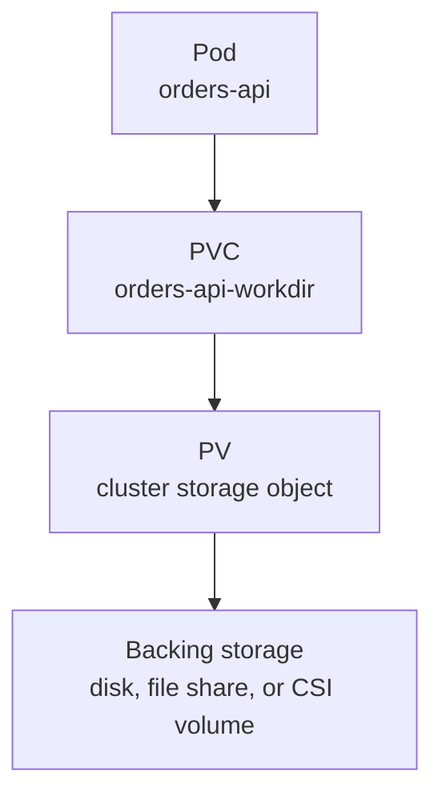

## Table of Contents

1. [Why Pod Files Are Not Enough](#why-pod-files-are-not-enough)
2. [The PV and PVC Mental Model](#the-pv-and-pvc-mental-model)
3. [A Claim for devpolaris-orders-api](#a-claim-for-devpolaris-orders-api)
4. [Mounting a Claim into a Pod](#mounting-a-claim-into-a-pod)
5. [Access Modes and Volume Modes](#access-modes-and-volume-modes)
6. [Binding, Reclaim Policy, and Lifecycle](#binding-reclaim-policy-and-lifecycle)
7. [Failure Mode: Pending Claims](#failure-mode-pending-claims)
8. [Failure Mode: Data Is There but the App Cannot Write](#failure-mode-data-is-there-but-the-app-cannot-write)
9. [Storage Tradeoffs for Application Teams](#storage-tradeoffs-for-application-teams)

## Why Pod Files Are Not Enough

A container filesystem is a poor place for important data. When Kubernetes replaces a Pod, the new Pod starts from the image and attached volumes. Files written only to the container layer can disappear with the old container. That is fine for cache files and temporary scratch data. It is not fine for uploads, generated reports, database files, or queue state.

A PersistentVolume is a Kubernetes object representing durable storage that exists beyond one Pod. A PersistentVolumeClaim is an application's request for that storage. The claim says how much storage the workload needs and what access pattern it expects. The cluster then binds the claim to a real volume, either one an administrator created or one created dynamically by a StorageClass.

For `devpolaris-orders-api`, imagine the API generates invoice PDFs before a background worker ships them to object storage. The team wants a small durable work directory so a Pod restart does not lose files that have not been uploaded yet. That is a reasonable use for a PVC. It is not a replacement for a database or long-term object storage, but it protects a narrow handoff.



The separation matters because the application should not need to know whether the backing storage is an EBS volume, Azure Disk, a file share, or a local test volume. The claim is the application-facing contract.

## The PV and PVC Mental Model

Think of a PVC like a ticket at a storage desk. The application says, "I need 10Gi of filesystem storage that one node can write." The cluster matches that ticket to an available PV or asks a provisioner to create one. Once bound, the Pod uses the claim by name.

The PV is the supply side. It describes capacity, access modes, reclaim policy, and connection details for the real storage. In dynamic provisioning, you may never write PV YAML by hand. The provisioner creates it for you after it sees a PVC.

The PVC is the demand side. Application teams usually write PVCs because they know what the workload needs. Platform teams usually define StorageClasses and policies because they know the cluster's storage systems.

```text
Application team owns: "orders-api needs a 10Gi work directory."
Platform team owns: "fast-retain storage maps to encrypted regional disks."
Kubernetes owns: "bind this claim to a matching volume and mount it into the Pod."
```

This boundary keeps application manifests portable. A local development cluster can bind the same claim to a simple local provisioner, while production can bind it to cloud storage with backups and encryption.

## A Claim for devpolaris-orders-api

Here is a PVC that asks for 10Gi of storage using a class named `standard-retain`. The class is covered in the next article, but you can read it here as the storage profile the cluster offers.

```yaml
apiVersion: v1
kind: PersistentVolumeClaim
metadata:
  name: orders-api-workdir
  namespace: devpolaris-staging
spec:
  accessModes:
    - ReadWriteOnce
  storageClassName: standard-retain
  resources:
    requests:
      storage: 10Gi
```

`ReadWriteOnce` means the volume can be mounted as read-write by one node at a time. It does not mean only one Pod can use it in all cases. If several Pods land on the same node, the exact behavior depends on the storage system and workload pattern. For a beginner, treat `ReadWriteOnce` as best suited for one writer workload, not many replicas writing shared files.

After applying the claim, inspect its status.

```bash
$ kubectl get pvc orders-api-workdir -n devpolaris-staging
NAME                 STATUS   VOLUME                                     CAPACITY   ACCESS MODES   STORAGECLASS      AGE
orders-api-workdir   Bound    pvc-4d8c1d2e-6f35-4b70-9cb5-93e6d0fbb14f   10Gi       RWO            standard-retain   22s
```

`Bound` is the key word. It means Kubernetes found or created a matching PV. If the claim stays `Pending`, the Pod that needs it may also wait.

## Mounting a Claim into a Pod

A Pod uses a PVC through a volume entry. The Deployment names the claim, then mounts that volume into the container.

```yaml
apiVersion: apps/v1
kind: Deployment
metadata:
  name: orders-api
  namespace: devpolaris-staging
spec:
  replicas: 1
  selector:
    matchLabels:
      app: orders-api
  template:
    metadata:
      labels:
        app: orders-api
    spec:
      volumes:
        - name: workdir
          persistentVolumeClaim:
            claimName: orders-api-workdir
      containers:
        - name: api
          image: ghcr.io/devpolaris/orders-api:1.18.0
          volumeMounts:
            - name: workdir
              mountPath: /var/lib/devpolaris/orders-work
```

The application now writes invoice work files under `/var/lib/devpolaris/orders-work`. That path is not just a directory in the image. It is backed by the volume bound to the PVC.

```bash
$ kubectl exec deploy/orders-api -n devpolaris-staging -- sh -c 'echo invoice-123 > /var/lib/devpolaris/orders-work/probe.txt'
$ kubectl delete pod -n devpolaris-staging -l app=orders-api
pod "orders-api-6658fb9c9c-l8mgq" deleted
$ kubectl exec deploy/orders-api -n devpolaris-staging -- cat /var/lib/devpolaris/orders-work/probe.txt
invoice-123
```

That small probe demonstrates persistence across Pod replacement. Use a harmless test file in a non-production namespace. In production, verify through application behavior and storage metrics instead of writing manual probe files into live paths.

## Access Modes and Volume Modes

Access modes describe how a volume can be mounted. They are a request and matching mechanism, not a distributed filesystem guarantee. The storage plugin must support the mode you ask for.

| Access Mode | Meaning | Common Use |
|-------------|---------|------------|
| `ReadWriteOnce` | Read-write by one node | Single-writer app storage |
| `ReadOnlyMany` | Read-only by many nodes | Shared reference data |
| `ReadWriteMany` | Read-write by many nodes | Shared file systems |
| `ReadWriteOncePod` | Read-write by one Pod | Strict single-Pod writer where supported |

Volume mode is different. `Filesystem` gives the container a mounted filesystem. `Block` gives the container a raw block device. Most application teams use `Filesystem` because the app wants paths and files.

```yaml
spec:
  volumeMode: Filesystem
  accessModes:
    - ReadWriteOnce
```

If you ask for `ReadWriteMany` but the cluster only has block-disk storage, the claim may remain Pending. The fix is not to retry the Pod. The fix is to choose a supported storage class or change the application design so it does not require shared writes.

## Binding, Reclaim Policy, and Lifecycle

A PVC has its own lifecycle, and the bound PV has a reclaim policy. The reclaim policy tells Kubernetes what should happen to the PV after the claim is deleted. Common policies are `Delete` and `Retain`.

`Delete` is convenient for disposable environments. Delete the claim, and the dynamically provisioned backing storage is also deleted. `Retain` protects data by keeping the PV after the claim is gone, but it requires human cleanup or recovery steps.

For `devpolaris-orders-api`, a staging work directory might use `Delete`. Production work storage might use `Retain` if files could matter during incident recovery.

```bash
$ kubectl get pv pvc-4d8c1d2e-6f35-4b70-9cb5-93e6d0fbb14f
NAME                                       CAPACITY   ACCESS MODES   RECLAIM POLICY   STATUS   CLAIM
pvc-4d8c1d2e-6f35-4b70-9cb5-93e6d0fbb14f   10Gi       RWO            Retain           Bound    devpolaris-staging/orders-api-workdir
```

Review reclaim policy before deleting claims. The dangerous mistake is assuming a PVC delete is only a Kubernetes cleanup when the storage class is actually configured to delete backing storage too.

## Failure Mode: Pending Claims

A Pending PVC means Kubernetes has not bound the claim to a volume. The Pod may remain Pending because it cannot mount storage that does not exist.

```bash
$ kubectl get pvc -n devpolaris-staging
NAME                 STATUS    VOLUME   CAPACITY   ACCESS MODES   STORAGECLASS   AGE
orders-api-workdir   Pending                                      fast-rwx       4m12s

$ kubectl describe pvc orders-api-workdir -n devpolaris-staging
Events:
  Type     Reason                Age    From                         Message
  Warning  ProvisioningFailed    3m58s  persistentvolume-controller  storageclass.storage.k8s.io "fast-rwx" not found
```

The event tells you the storage class name is wrong. Fix the PVC or create the intended StorageClass. Do not debug the application yet. It has not received storage.

Another Pending shape is unsupported access mode.

```text
waiting for a volume to be created, either by external provisioner "example.csi.driver" or manually created by system administrator
```

That message means Kubernetes is waiting on the storage provisioner or a matching PV. Check the StorageClass, provisioner health, namespace quotas, and events from the CSI controller.

## Failure Mode: Data Is There but the App Cannot Write

A PVC can be Bound and mounted, yet the application still cannot write. The usual causes are filesystem permissions, running as a non-root user, read-only mounts, or storage backend problems.

```text
2026-05-07T14:15:22.119Z ERROR failed to write invoice work file
path=/var/lib/devpolaris/orders-work/invoice-983.json error="EACCES: permission denied"
```

Start by checking the mount and the user inside the container.

```bash
$ kubectl exec deploy/orders-api -n devpolaris-staging -- id
uid=10001(app) gid=10001(app) groups=10001(app)

$ kubectl exec deploy/orders-api -n devpolaris-staging -- ls -ld /var/lib/devpolaris/orders-work
drwxr-xr-x 3 root root 4096 May  7 14:10 /var/lib/devpolaris/orders-work
```

The directory is owned by root, while the process runs as UID 10001. The fix might be an init container that sets ownership, a `fsGroup` security context where appropriate, or a storage class that supports the ownership behavior you need.

```yaml
securityContext:
  fsGroup: 10001
```

Do not add `runAsUser: 0` as the first fix. Running the app as root may hide the storage problem while increasing the blast radius of an application bug.

## Storage Tradeoffs for Application Teams

Persistent volumes are useful, but they are not the default answer to every state problem. Kubernetes makes it easy to attach storage, but your application still has to handle concurrency, backup, restore, performance, and data ownership.

| Need | Better Fit |
|------|------------|
| Relational records | Managed database |
| Generated files for long-term access | Object storage |
| Short-lived scratch space | `emptyDir` |
| Durable per-Pod work directory | PVC |
| Shared writable files across replicas | RWX storage plus careful app design |

For `devpolaris-orders-api`, a PVC can protect in-progress invoice files. The final invoice archive probably belongs in object storage. Orders themselves belong in the database. That separation keeps each storage system responsible for data it is good at handling.

The operating habit is to ask what should survive, who writes it, who reads it, and how you would restore it. A PVC answers only part of that question. The application architecture answers the rest.

### Quotas and Requests

A PVC request can also fail because the namespace has a storage quota. Quotas are useful because they stop one team from consuming all storage in a shared cluster. They also create a diagnostic path that looks different from a missing StorageClass.

```bash
$ kubectl describe pvc orders-api-workdir -n devpolaris-staging
Events:
  Type     Reason        Age   From                         Message
  Warning  FailedCreate  18s   persistentvolume-controller  exceeded quota: staging-storage, requested: requests.storage=50Gi, used: requests.storage=80Gi, limited: requests.storage=100Gi
```

The claim asked for 50Gi, but the namespace had only 20Gi left under its quota. The fix might be to lower the request, delete unused claims, or ask the platform team to raise the quota with a reason.

Check quota directly:

```bash
$ kubectl get resourcequota staging-storage -n devpolaris-staging
NAME              AGE   REQUEST                                                LIMIT
staging-storage   31d   requests.storage: 80Gi/100Gi, persistentvolumeclaims: 8/10
```

This is an engineering tradeoff. Quotas slow down surprise growth, but they also require teams to plan storage needs. A good PVC review includes both the requested size and the evidence that the namespace can support it.

### Migrating Data Between Claims

Sometimes the fix is not resizing a claim. You may need to move data from one PVC to another, perhaps because the original claim used the wrong StorageClass. Kubernetes does not have a universal "change this PVC to another class" button. The migration depends on the storage system and the data.

A simple file-level migration uses a temporary Job or Pod that mounts both claims and copies files. This is appropriate for small work directories, not live databases.

```yaml
volumes:
  - name: old-workdir
    persistentVolumeClaim:
      claimName: orders-api-workdir
  - name: new-workdir
    persistentVolumeClaim:
      claimName: orders-api-workdir-retain
```

The diagnostic and safety steps matter more than the copy command. Stop writers or put the application in maintenance mode, copy the data, verify counts and checksums, then update the Deployment to mount the new claim.

```bash
$ kubectl exec pod/orders-workdir-copy -n devpolaris-staging -- sh -c 'find /old -type f | wc -l && find /new -type f | wc -l'
128
128
```

For data with business value, prefer a storage-native snapshot or application-aware backup when available. File copy is a learning pattern and a small-data tool, not a universal disaster-recovery strategy.

Before you close a storage incident, capture the final state of the claim and the workload that used it.

```bash
$ kubectl get pvc orders-api-workdir -n devpolaris-staging
NAME                 STATUS   VOLUME                                     CAPACITY   ACCESS MODES   STORAGECLASS      AGE
orders-api-workdir   Bound    pvc-4d8c1d2e-6f35-4b70-9cb5-93e6d0fbb14f   10Gi       RWO            standard-retain   2h
```

The claim status proves the storage contract is healthy again. The application readiness check proves the mounted path is useful to the process.

---

**References**

- [Persistent Volumes](https://kubernetes.io/docs/concepts/storage/persistent-volumes/) - Official concept page for PersistentVolume and PersistentVolumeClaim lifecycle, binding, access modes, and reclaim policy.
- [Kubernetes Volumes](https://kubernetes.io/docs/concepts/storage/volumes/) - Official concept page for Kubernetes volume types, mount behavior, and Pod-level volume configuration.
- [Dynamic Volume Provisioning](https://kubernetes.io/docs/concepts/storage/dynamic-provisioning/) - Official explanation of how PVCs can ask a provisioner to create backing storage automatically.
- [Troubleshooting Applications](https://kubernetes.io/docs/tasks/debug/debug-application/) - Official debugging entry point for inspecting Pods, events, logs, and application failures.
