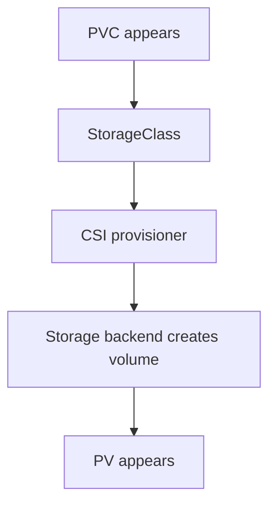
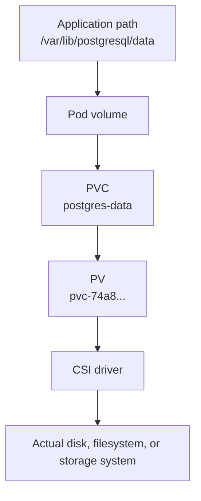
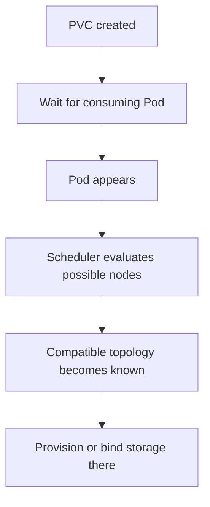

## Table of Contents

1. [Why does application data need a lifecycle beyond a Pod?](#why-does-application-data-need-a-lifecycle-beyond-a-pod)
2. [What jobs do a PVC, PV, and StorageClass each perform?](#what-jobs-do-a-pvc-pv-and-storageclass-each-perform)
3. [How does a claim turn into a mounted filesystem?](#how-does-a-claim-turn-into-a-mounted-filesystem)
4. [Which access modes fit a workload?](#which-access-modes-fit-a-workload)
5. [How do topology and binding time affect Pod scheduling?](#how-do-topology-and-binding-time-affect-pod-scheduling)
6. [What happens when Pods, claims, and volumes are deleted?](#what-happens-when-pods-claims-and-volumes-are-deleted)
7. [How do expansion, permissions, backups, and diagnosis complete the design?](#how-do-expansion-permissions-backups-and-diagnosis-complete-the-design)
8. [Check Your Answers](#check-your-answers)
9. [References](#references)

Kubernetes storage becomes easier to reason about when you begin with one question: what must happen when application data should outlive the process, container, Pod, or node currently using it?

PersistentVolumes, PersistentVolumeClaims, StorageClasses, CSI drivers, access modes, binding, reclaim policies, and recovery all follow from that lifecycle problem. The article connects them through seven questions:

1. **Why does application data need a lifecycle beyond a Pod?**
2. **What jobs do a PVC, PV, and StorageClass each perform?**
3. **How does a claim turn into a mounted filesystem?**
4. **Which access modes fit a workload?**
5. **How do topology and binding time affect Pod scheduling?**
6. **What happens when Pods, claims, and volumes are deleted?**
7. **How do expansion, permissions, backups, and diagnosis complete the design?**

## Why does application data need a lifecycle beyond a Pod?
<!-- section-summary: Pods are replaceable, so persistent data needs an identity and lifetime independent of any one Pod. -->

On an ordinary machine, a process can stop while the disk and its files remain. Containers add a writable filesystem, but containers are intentionally disposable. Kubernetes goes further: Pods are disposable runtime units that controllers can replace.

Suppose a Deployment owns Pod A. If the Pod crashes or its node disappears, Kubernetes can create Pod B from the same workload definition. Pod B is a new Pod, not a resurrected Pod A. Data written only inside Pod A's container filesystem does not automatically reappear inside Pod B.

That behavior can suit caches or temporary work. It usually does not suit PostgreSQL, MySQL, Elasticsearch, uploaded files, queues, or Git repositories.

The first requirement is therefore:

> The lifetime of persistent data must be independent of the lifetime of a Pod.

Follow the identity change carefully. Pod A may write a row under `/var/lib/postgresql/data`, then disappear. The controller creates Pod B with a new name, IP address, container, and writable container layer. Persistence works only because Pod B mounts a storage identity that did not belong to Pod A's lifecycle:

```text
Pod A --deleted--X
   │
   └── uses claim postgres-data
                       │
                       └── preserved bytes
                                  │
Pod B --new------------- mounts the same claim
```

The directory path can look identical inside both containers while the underlying persistence comes from outside both of them. That is the first boundary to internalize: a mount path is where the application sees data, while a claim is how the workload asks Kubernetes to reconnect durable storage to that path.

A **PersistentVolume**, or PV, is a Kubernetes representation of storage whose lifecycle is independent of any individual Pod using it. The Pod can disappear while the storage objects and underlying bytes remain available for a replacement.

Once compute and data have separate lifetimes, Kubernetes must answer several questions: what storage does the application need, where will it come from, which real disk or share satisfies the request, which nodes can mount it, where should it appear in the container, and what should happen when the Pod or user no longer needs it?

Kubernetes separates those answers across demand, supply, and provisioning policy.

## What jobs do a PVC, PV, and StorageClass each perform?
<!-- section-summary: A PVC states demand, a PV represents supply, and a StorageClass describes how Kubernetes should create that supply. -->

The central storage model is:

```text
PVC          = demand
PV           = supply
StorageClass = how supply should be created
```

Each object answers a different question:

| Object | Question it answers |
|---|---|
| Pod | Where should storage appear in the application? |
| PVC | What kind of storage does the workload need? |
| PV | Which storage resource has been allocated? |
| StorageClass | How should Kubernetes obtain or create that storage? |
| CSI driver | How does Kubernetes communicate with the real storage system? |

A **PersistentVolumeClaim**, or PVC, is the workload's request. An application developer can ask for capacity, access, and a named storage profile without knowing a cloud volume ID, zone, encryption key, NFS server, or mount command:

```yaml
apiVersion: v1
kind: PersistentVolumeClaim
metadata:
  name: postgres-data
spec:
  storageClassName: fast
  accessModes:
    - ReadWriteOnce
  resources:
    requests:
      storage: 20Gi
```

This claim says, “Give me at least 20 GiB from the `fast` class with the `ReadWriteOnce` capability.” PVCs are namespaced resources, so a Pod uses a claim in its own namespace.

A **PersistentVolume** represents the storage Kubernetes can give to a claim. It may represent an AWS EBS volume, an NFS share, a Ceph volume, or another backend. The PV is not best understood as the physical disk itself; it is Kubernetes' resource representation of one piece of storage. PVs are cluster resources, and a PVC-to-PV binding is an exclusive one-to-one relationship.

A **StorageClass** is a provisioning recipe or profile. Without it, administrators can create PVs ahead of time and let Kubernetes match claims to those existing resources. That is **static provisioning**.

With **dynamic provisioning**, a claim triggers creation:


```mermaid
flowchart TD
    PVC[PVC appears] --> Class[StorageClass]
    Class --> CSI[CSI provisioner]
    CSI --> Storage[Storage backend creates volume]
    Storage --> PV[PV appears]
```

**CSI**, the Container Storage Interface, is the standard through which Kubernetes storage components call a storage driver. A StorageClass can name the driver and describe parameters, reclaim policy, expansion support, and binding behavior:

```yaml
kind: StorageClass
provisioner: ebs.csi.aws.com
parameters:
  type: gp3
allowVolumeExpansion: true
reclaimPolicy: Delete
volumeBindingMode: WaitForFirstConsumer
```

Separating these objects keeps the application portable. The same PVC concept can be satisfied by EBS, Ceph, Azure storage, or another implementation without changing the application's filesystem interface.

### Compare static and dynamic supply

With static provisioning, an administrator creates PVs before application demand arrives. A compatible claim can bind to one of those existing supplies. Capacity, access modes, class, and other requirements must line up well enough for Kubernetes to match them. If no suitable PV exists, the claim remains `Pending`.

With dynamic provisioning, the claim is the event that asks the StorageClass provisioner to create supply. The resulting PV often receives a generated name, but the application never needs to adopt that name. It continues to refer to `postgres-data`, while Kubernetes records which PV satisfies it.

```text
static:   administrator creates PV -> PVC matches it
dynamic:  PVC selects class -> provisioner creates storage and PV
```

Both paths end at the same contract: one claim bound exclusively to one PV. What changes is whether supply waited in the cluster before the demand or was produced in response to it.

The roles are now distinct. The next step follows one claim until those abstractions become an ordinary directory inside a container.

## How does a claim turn into a mounted filesystem?
<!-- section-summary: Kubernetes provisions and binds storage, then the Pod references the claim and mounts the result at an application path. -->

Begin with the `postgres-data` PVC. When it first appears, its status may be `Pending` because Kubernetes has not yet satisfied the demand.

The StorageClass identifies the CSI provisioner. The driver calls the cloud or storage API to create a 20 GiB resource, and Kubernetes represents that resource with a PV. Kubernetes then binds the claim to that PV:

```text
PVC postgres-data
  -> bound to PV pvc-74a8...
  -> represents actual storage
```

After binding, `kubectl get pvc` can show:

```console
NAME            STATUS   VOLUME
postgres-data   Bound    pvc-74a8...
```

The Pod references the PVC rather than the PV:

```yaml
apiVersion: v1
kind: Pod
metadata:
  name: postgres
spec:
  containers:
    - name: postgres
      image: postgres
      volumeMounts:
        - name: data
          mountPath: /var/lib/postgresql/data
  volumes:
    - name: data
      persistentVolumeClaim:
        claimName: postgres-data
```

The Pod-level volume selects `postgres-data`, and the container's `volumeMount` supplies the application path. If the scheduler chooses Node 7, the storage stack attaches the backend volume to that node when needed, mounts it into the node filesystem, and publishes it into the container.

The complete chain is:


```mermaid
flowchart TD
    Application["Application path<br/>/var/lib/postgresql/data"] --> PodVolume[Pod volume]
    PodVolume --> PVC["PVC<br/>postgres-data"]
    PVC --> PV["PV<br/>pvc-74a8..."]
    PV --> CSI[CSI driver]
    CSI --> Backend[Actual disk, filesystem, or storage system]
```

PostgreSQL ultimately sees an ordinary directory. It does not need to understand PVs, claims, CSI, or the cloud API.

### Read the Pod from the application outward

Start at the line PostgreSQL cares about: `mountPath: /var/lib/postgresql/data`. The container connects that path to the Pod volume named `data`. The Pod volume connects `data` to the namespaced claim `postgres-data`. Binding connects that claim to a cluster-scoped PV, and the PV connects Kubernetes to the backend through its storage driver.

Each name has a different scope and job. The `data` volume name only joins two blocks inside this Pod specification. `postgres-data` is a namespaced API object that other Pods in that namespace can reference. The PV name represents the allocated cluster resource. The backend volume identifier belongs to the storage system. Treating all four as “the volume” hides the exact link that can fail.

The runtime path adds node operations after scheduling:

```text
claim already bound
      ↓
scheduler selects a compatible node
      ↓
storage driver attaches the backend when required
      ↓
kubelet and driver mount and publish it
      ↓
container starts with the directory visible
      ↓
PostgreSQL reads existing bytes
```

A `Bound` PVC proves the demand-to-supply relationship. It does not by itself prove that attachment, mounting, filesystem permissions, or application recovery will succeed.

Having both PVC and PV separates what the application needs from how the platform provides it. The next question refines the request: which attachment capabilities does the workload require?

## Which access modes fit a workload?
<!-- section-summary: Access modes describe whether storage can be mounted read-write or read-only across one node, many nodes, or one Pod. -->

Storage systems have different physical capabilities. A block disk may support writing from one node, while a network filesystem may support many readers or writers across several nodes. PVCs and PVs use **access modes** to express and match those capabilities.

### ReadWriteOnce (RWO)

`ReadWriteOnce` means read-write from one node. It does not necessarily mean one Pod: several Pods on the same node can potentially use an RWO volume.

### ReadWriteOncePod (RWOP)

`ReadWriteOncePod` means one Pod across the cluster. It expresses single-Pod exclusivity more precisely, is supported for CSI storage, and has been stable since Kubernetes 1.29.

### ReadOnlyMany (ROX)

`ReadOnlyMany` allows many nodes to mount the volume read-only.

### ReadWriteMany (RWX)

`ReadWriteMany` allows many nodes to mount the volume read-write. Shared or networked filesystems are more likely to provide this capability.

Support depends on the storage backend and CSI driver. Access modes primarily describe and match storage capabilities; they do not replace Unix file permissions or make every multi-process access pattern safe. `ReadWriteOncePod` is the notable mode that enforces single-Pod mounting at the cluster level.

Choose the mode from the required topology, not from the replica count alone. A single PostgreSQL writer that may move between nodes commonly needs a one-node writable capability such as RWO; it does not need every node to write simultaneously. A shared read-only asset set used across nodes may fit ROX. A filesystem that several Pods on several nodes must update needs backend support for RWX. If one and only one Pod may mount a CSI volume across the cluster, RWOP states that rule more precisely than RWO.

Access mode still does not coordinate application writes. RWX says the storage can be mounted read-write from many nodes; it does not prove that two application instances can safely edit the same files. The workload's own data format and concurrency rules remain part of the design.

Access describes who may mount the volume. For topology-constrained storage, Kubernetes must also decide where to create it relative to the Pod.

## How do topology and binding time affect Pod scheduling?
<!-- section-summary: WaitForFirstConsumer delays provisioning until Kubernetes can choose storage topology compatible with the Pod. -->

**Topology** describes physical placement constraints such as availability zones. Suppose a cluster spans `eu-west-2a`, `eu-west-2b`, and `eu-west-2c`, while each cloud block disk belongs to one zone.

If Kubernetes creates a disk in `eu-west-2a` immediately and the Pod later needs `eu-west-2b`, the scheduler may have no valid node-and-disk combination. Choosing storage placement and compute placement are coupled decisions.

A StorageClass controls this timing with `volumeBindingMode`.

With `Immediate`, Kubernetes provisions or binds storage as soon as the PVC appears. That early choice can be unsuitable for topology-constrained storage because the Pod's scheduling requirements are not yet known.

With `WaitForFirstConsumer`, the PVC can remain `Pending` until a Pod references it. The scheduler can then reason about possible nodes, learn the required topology, and guide provisioning or binding to a compatible location:


```mermaid
flowchart TD
    PVC[PVC created] --> Wait[Wait for consuming Pod]
    Wait --> Pod[Pod appears]
    Pod --> Schedule[Scheduler evaluates possible nodes]
    Schedule --> Topology[Compatible topology becomes known]
    Topology --> Provision[Provision or bind storage there]
```

`WaitForFirstConsumer` exists specifically so storage decisions can account for Pod scheduling constraints and topology. This is why it is common for cloud block storage.

Once Pod and storage placement agree, their independent lifetimes still matter during deletion.

## What happens when Pods, claims, and volumes are deleted?
<!-- section-summary: Pod deletion normally preserves storage, while PVC deletion releases the PV and activates its reclaim policy. -->

Four lifetimes remain separate:

```text
Pod lifetime
PVC lifetime
PV lifetime
physical storage lifetime
```

Deleting a Pod normally leaves its PVC, PV, and underlying data in place. A replacement Pod can reference the same PVC, which remains bound to the same PV and bytes.

Deleting the PVC means that the namespace no longer claims the storage. The PV's **reclaim policy** then controls what follows.

With `Delete`, releasing the dynamically provisioned PV leads to deletion of the backing storage. This is convenient and potentially destructive. `Delete` is the default for dynamically provisioned storage unless the StorageClass says otherwise.

With `Retain`, the PV enters a released state while the underlying storage and data survive. An administrator must inspect, recover, clean, or deliberately prepare that resource for reuse. The older `Recycle` policy has only narrow modern support; normal operational decisions center on `Delete` and `Retain`.

Kubernetes also protects storage objects in active use. If a Pod still uses a PVC when someone requests deletion, the claim can remain `Terminating` until the Pod releases it rather than disappearing from under the running workload.

### Read deletion as a sequence of ownership decisions

Suppose a Deployment is replaced but still names `postgres-data`. Only the Pod identity changes, so the claim remains bound and the new Pod can see the old bytes. Now suppose the claim itself is deleted. Kubernetes interprets that as releasing the demand, and the reclaim policy decides whether the backing supply should be destroyed automatically or preserved for manual work.

This makes `Delete` and `Retain` operationally different promises:

```text
Delete: claim removed -> PV released -> backing storage removed
Retain: claim removed -> PV released -> backing storage preserved
```

Neither policy is universally correct. `Delete` avoids forgotten resources when the data is disposable or independently protected. `Retain` inserts an administrator checkpoint when automatic destruction would be too risky. The correct choice follows the consequence of losing the bytes, not merely the convenience of cleanup.

Deletion shows what persistence protects. The final design must still cover growth, process access, backup, recovery, and a methodical failure investigation.

## How do expansion, permissions, backups, and diagnosis complete the design?
<!-- section-summary: Capacity, filesystem identity, independent recovery copies, and chain-based diagnosis complete persistent storage operations. -->

### Expand demand through the PVC

When 20 GiB is no longer enough, the application changes its demand by increasing the PVC request:

```yaml
resources:
  requests:
    storage: 50Gi
```

If the StorageClass sets `allowVolumeExpansion: true` and the CSI driver supports expansion, the storage controller and resizer grow the backend volume, then the filesystem can grow. Kubernetes supports increasing these volumes rather than shrinking them, and the supported path is to edit the PVC request rather than manually changing PV capacity.

### Separate provisioning from filesystem permissions

A claim can be `Bound`, the disk attached, and the filesystem mounted while the application still receives `Permission denied`. At that point provisioning succeeded; the remaining problem is filesystem identity.

The process may run as UID and GID 1000 while the volume contains files owned by `root:root`. Pod security-context settings can align access:

```yaml
securityContext:
  runAsUser: 1000
  runAsGroup: 1000
  fsGroup: 2000
```

`fsGroup` can influence volume ownership or group accessibility. Kubernetes or the CSI driver performs the relevant handling depending on the storage type and driver. Recursive ownership changes on large volumes can slow startup, which is why `fsGroupChangePolicy: OnRootMismatch` can avoid repeating the work when the root already matches.

Keep three questions separate:

```text
Can Kubernetes obtain storage? -> PVC and PV
Can the node attach and mount it? -> CSI
Can the process access its files? -> Unix permissions
```

### Persistence is not backup

A PVC surviving Pod deletion protects against a Pod disappearing. It does not automatically protect against `rm -rf /`, application corruption, accidental claim deletion with a `Delete` policy, storage-provider failure, or malicious deletion.

Snapshots, backups, replication, and restore procedures provide those additional recovery layers. Persistence separates lifetimes; it does not solve every durability failure.

If a Pod disappears while the claim, PV, and disk remain, another Pod can use the same claim. If a claim disappears but a `Retain` policy preserves the PV and disk, an administrator can prepare a recovery claim. Kubernetes supports pre-binding a PVC to a particular retained PV with `volumeName`, together with the appropriate `claimRef` handling on the PV.

If the underlying disk is gone, PV and PVC abstractions cannot reconstruct the bytes. Recovery then depends on a snapshot, backup, or replica.

Expansion follows the same separation of demand and supply. Raising the PVC request from 20 GiB to 50 GiB states the new desired capacity. The controller and CSI resizer then ask the backend to grow, and the filesystem must expose the additional space. A larger number in a PV object would only change Kubernetes' representation; it would not by itself enlarge the real device, which is why the supported workflow begins with the PVC.

### Diagnose the storage chain

Avoid debugging “Kubernetes storage” as one undivided system. Walk the chain:

```text
Pod
  -> PVC
  -> PV
  -> StorageClass
  -> CSI provisioning
  -> topology and scheduling
  -> attachment
  -> mount
  -> filesystem permissions
  -> application
```

If the PVC is `Pending`, begin with the demand and provisioning policy:

```bash
kubectl get pvc
kubectl describe pvc postgres-data
kubectl get storageclass
kubectl describe storageclass fast
```

Possible causes include no suitable PV, a missing or incorrect default StorageClass, an unavailable provisioner, failed provisioning, an unsupported access mode, or topology that is still unresolved.

For example, a claim asking for RWX from a class backed only by single-node block disks may remain unsatisfied. The YAML is valid, but supply cannot meet the requested capability. In another case, `WaitForFirstConsumer` deliberately leaves the claim pending until a Pod exists; the status is then part of topology-aware provisioning rather than proof of failure. Events and the consuming Pod distinguish those cases.

If the PVC is `Bound`, inspect the PV:

```bash
kubectl get pv
kubectl describe pv <pv-name>
```

Binding has succeeded, so a waiting Pod points later in the chain. `kubectl describe pod <pod>` can reveal scheduler constraints, node affinity, availability zones, `WaitForFirstConsumer`, attachment, or mount failures. Event terms such as `FailedAttachVolume`, `FailedMount`, and `MountVolume` narrow the failure toward CSI, the node, or the filesystem mount.

Cluster-level views can help:

```bash
kubectl get volumeattachments.storage.k8s.io
kubectl get csidrivers
```

If the container starts and receives `Permission denied`, provisioning, binding, scheduling, attachment, and mounting have already succeeded. Inspect the process and filesystem identities:

```bash
kubectl exec <pod> -- id
kubectl exec <pod> -- ls -ln /var/lib/postgresql/data
```

Compare the UID and GID with `runAsUser`, `runAsGroup`, and `fsGroup`.

This chain prevents backward debugging. A process cannot report a filesystem permission error unless the storage reached its container, so changing the StorageClass is unlikely to address that symptom. Conversely, changing `fsGroup` cannot create a missing backend volume for a claim whose provisioning failed. Always begin at the earliest unproven transition and move forward one boundary at a time.

Four sentences summarize the model:

1. A Pod and its persistent data have different lifetimes.
2. A PVC describes what storage the application wants; a PV represents the storage that satisfies it.
3. A StorageClass describes how Kubernetes should provision that storage.
4. A Pod mounts a PVC, not normally a particular physical disk.

## Check Your Answers
<!-- section-summary: Revisit the seven questions that connect storage lifetime, demand, supply, provisioning, topology, reclaim, and recovery. -->

:::expand[Why does application data need a lifecycle beyond a Pod?]{kind="recap"}
Pods and container writable layers are replaceable. Persistent data needs storage objects and underlying bytes that can remain while one Pod disappears and another takes its place.
:::

:::expand[What jobs do a PVC, PV, and StorageClass each perform?]{kind="recap"}
A PVC states the workload's demand, a PV represents the allocated supply, and a StorageClass describes how Kubernetes should create that supply. The CSI driver translates the provisioning and mount operations to the actual storage system.
:::

:::expand[How does a claim turn into a mounted filesystem?]{kind="recap"}
Kubernetes provisions and binds a PV to the PVC, then the Pod names that claim as a volume and mounts it at an application path. The storage stack attaches, mounts, and publishes the backend so the process sees an ordinary directory.
:::

:::expand[Which access modes fit a workload?]{kind="recap"}
RWO permits read-write use on one node, RWOP constrains it to one Pod, ROX permits read-only use on many nodes, and RWX permits read-write use on many nodes. Backend and CSI support determine which modes are available.
:::

:::expand[How do topology and binding time affect Pod scheduling?]{kind="recap"}
Immediate binding can choose storage placement before Kubernetes knows the Pod's constraints. WaitForFirstConsumer delays the decision so the scheduler and provisioner can select compatible compute and storage topology.
:::

:::expand[What happens when Pods, claims, and volumes are deleted?]{kind="recap"}
Deleting a Pod normally preserves its claim, PV, and data. Deleting the PVC releases the PV; `Delete` removes dynamically provisioned backing storage, while `Retain` keeps it for administrator-led recovery or cleanup.
:::

:::expand[How do expansion, permissions, backups, and diagnosis complete the design?]{kind="recap"}
Supported expansion grows demand through the PVC, security context governs process access, and backups or snapshots protect against failures persistence alone cannot cover. Diagnosis follows the claim, volume, class, CSI path, topology, mount, permissions, and application in order.
:::

## References

- [Persistent Volumes](https://kubernetes.io/docs/concepts/storage/persistent-volumes/)
- [Storage Classes](https://kubernetes.io/docs/concepts/storage/storage-classes/)
- [Dynamic Volume Provisioning](https://kubernetes.io/docs/concepts/storage/dynamic-provisioning/)
- [Using Volume Expansion](https://kubernetes.io/docs/concepts/storage/persistent-volumes/#expanding-persistent-volumes-claims)
