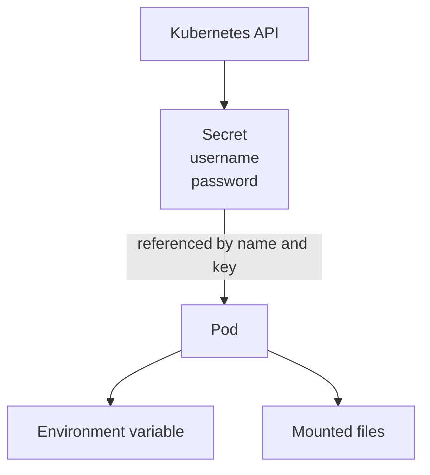
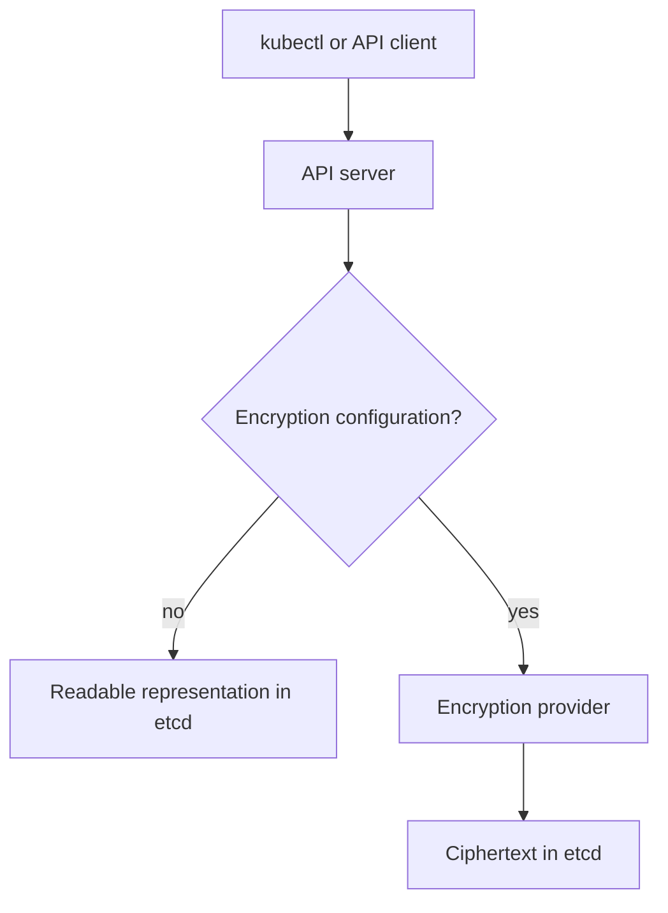
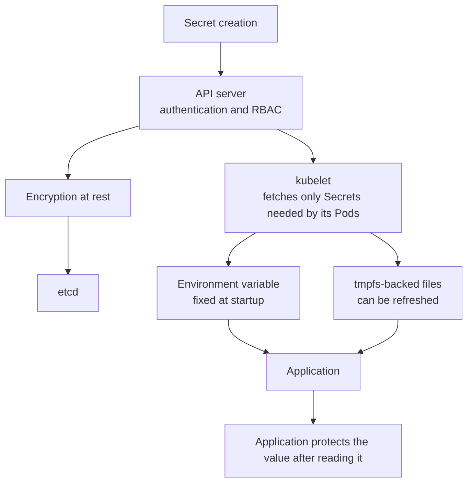

## Table of Contents

1. [What problem does a Secret solve?](#what-problem-does-a-secret-solve)
2. [What does Kubernetes store inside a Secret?](#what-does-kubernetes-store-inside-a-secret)
3. [How should a Pod receive a Secret value?](#how-should-a-pod-receive-a-secret-value)
4. [Who can read a Secret?](#who-can-read-a-secret)
5. [Which protections surround a stored Secret?](#which-protections-surround-a-stored-secret)
6. [How does a team rotate a credential safely?](#how-does-a-team-rotate-a-credential-safely)
7. [How can a team diagnose Secret delivery safely?](#how-can-a-team-diagnose-secret-delivery-safely)
8. [Check Your Answers](#check-your-answers)
9. [References](#references)

The easiest way to understand a Kubernetes Secret is to begin with the difference between ordinary configuration and authority. An application may need a database host, port, username, and password. The first three describe how to connect. Possessing the password may let someone impersonate the application.

Consider these application inputs:

```text
database host     = db.production.svc
database port     = 5432
database username = payments-api
database password = <credential>
```

The host, port, and username describe the system. The password is a **credential**: a value whose possession grants authority. Learning `DATABASE_HOST=db.production.svc` reveals architecture; learning the database password may grant the ability to act as the application.

That property gives a sensitive value different handling requirements. It should stay out of the container image and the Pod manifest, receive tighter access control, reach only the workloads that need it, remain protected while stored, and be replaceable without rebuilding the image.

Keep these questions in view as you work through the lesson:

1. **What problem does a Secret solve?**
2. **What does Kubernetes store inside a Secret?**
3. **How should a Pod receive a Secret value?**
4. **Who can read a Secret?**
5. **Which protections surround a stored Secret?**
6. **How does a team rotate a credential safely?**
7. **How can a team diagnose Secret delivery safely?**

## What problem does a Secret solve?
<!-- section-summary: A Secret separates sensitive bytes from images and workload manifests so access, delivery, and replacement can be controlled independently. -->

Embedding the value directly in a workload violates those requirements:

```yaml
containers:
  - name: api
    image: my-api:v42
    env:
      - name: DATABASE_PASSWORD
        value: hunter2
```

The password can then spread through Git, CI/CD logs, deployment manifests, `kubectl` output, Helm values, debugging output, GitOps repositories, ticket attachments, and copied YAML. Baking it into an image with `ENV DATABASE_PASSWORD=hunter2` also carries the credential through image registries and caches.

The first design rule is therefore to separate the identity of a credential from the place that consumes it. A Kubernetes **Secret** is a named API object intended for confidential data. The workload refers to the Secret and key while the sensitive value stays in the separate object:

```yaml
env:
  - name: DATABASE_PASSWORD
    valueFrom:
      secretKeyRef:
        name: database-credentials
        key: password
```

The Deployment now says which value the container needs without containing that value. The Secret can be created and changed independently of the Pod and image.


```mermaid
flowchart TD
    API[Kubernetes API] --> Secret["Secret<br/>username<br/>password"]
    Secret -->|referenced by name and key| Pod[Pod]
    Pod --> Environment[Environment variable]
    Pod --> Files[Mounted files]
```

This separation creates several useful control points:

- **separation:** the Secret and image have different lifecycles;
- **authorization:** API access to Secret objects can be controlled separately;
- **selective delivery:** only selected Pods and containers receive the value;
- **rotation:** the credential can change without rebuilding the image;
- **reduced accidental exposure:** ordinary workload manifests carry references rather than payloads.

A Secret primarily solves exposure and delivery. It does not automatically become a password manager, encrypt itself, rotate the upstream credential, or protect a value after the application reads it. Kubernetes provides the separate boundary; the surrounding security controls and credential owner complete it.

Follow the database example across that boundary. The Deployment records `database-credentials/password`, not the password bytes. RBAC can separately govern who may retrieve the object. Kubelet can deliver the selected key only to a Pod that refers to it. The image can remain unchanged when the credential changes. Each benefit comes from replacing a copied value with a named relationship.

The separation also limits what a workload reviewer must handle. A manifest review can verify the Secret name, key, namespace, and delivery method without requiring the reviewer to see the credential. The sensitive payload still needs a protected creation path, but it no longer has to travel through every place that stores or discusses the workload manifest.

With that purpose clear, the next question is what Kubernetes actually records inside the object.

## What does Kubernetes store inside a Secret?
<!-- section-summary: A Secret is a namespaced map from keys to bytes, represented through data or convenient stringData input. -->

At its simplest, a Secret is a namespaced map:

```text
key -> bytes
```

A **key** names one item, while the **bytes** are the underlying data stored for that item. A generic Secret can look like this:

```yaml
apiVersion: v1
kind: Secret
metadata:
  name: database-credentials
type: Opaque
data:
  username: cGF5bWVudHMtYXBp
  password: ...
```

Values under `data` appear as Base64 text. **Base64** is a reversible encoding that represents arbitrary bytes with printable characters; it is not encryption and provides no confidentiality. Anyone who obtains the Base64 string can decode it.

Kubernetes also accepts convenient text input through `stringData`:

```yaml
apiVersion: v1
kind: Secret
metadata:
  name: database-credentials
type: Opaque
stringData:
  username: payments-api
  password: example-password
```

Kubernetes converts those strings into the Secret's `data` representation. In both forms, the object has metadata such as its name and namespace, a type, and named data entries.

`Opaque` is the normal generic type. Kubernetes also defines Secret types for expected shapes such as TLS certificates and image-registry credentials. An individual Secret has a 1 MiB limit, which keeps it focused on credentials and other small sensitive values rather than large private files.

The byte model matters because Kubernetes does not infer application semantics. A key named `password` is not automatically checked against a database, rotated, or assigned an expiry. A TLS Secret type describes an expected data shape, but the consuming system still determines whether the certificate is trusted and currently valid. The Secret object carries named bytes; issuers, applications, and security policy give those bytes meaning.

`stringData` is input convenience, not a safer storage state. After the API server processes the object, consumers can still receive the same underlying bytes. Likewise, converting plaintext to Base64 before committing it does not remove the credential from Git. The question is who can obtain the representation and reverse it, not whether the characters look unreadable.

The object now has an identity and payload. Delivery determines which nodes, Pods, containers, and processes receive those bytes.

## How should a Pod receive a Secret value?
<!-- section-summary: Environment variables and mounted files deliver the same Secret through different update and reload lifecycles. -->

Suppose an operator creates a Secret through the Kubernetes API and the API server stores the object in **etcd**, the control plane's backing data store. After the scheduler assigns a Pod to a node, the **kubelet**—the Kubernetes agent on that node—fetches the Secret required by that Pod and delivers it to the container.

Kubernetes does not deliberately send every Secret to every node. A node receives a Secret when a Pod scheduled there requires it. For Secret volumes, kubelet keeps its local copy in memory-backed `tmpfs` storage rather than intentionally persisting the mounted value to durable node storage.

The first common delivery method is an environment variable:

```yaml
containers:
  - name: api
    image: payments-api:v42
    env:
      - name: DATABASE_PASSWORD
        valueFrom:
          secretKeyRef:
            name: database-credentials
            key: password
```

An **environment variable** is a named string supplied to the process when the container starts. The Secret value is copied into that startup environment, and the process keeps the copy. Updating the Secret later does not change the environment of the running process; a new container must start to receive the replacement.

The second common method mounts Secret keys as files:

```yaml
spec:
  volumes:
    - name: db-credentials
      secret:
        secretName: database-credentials
  containers:
    - name: api
      image: payments-api:v42
      volumeMounts:
        - name: db-credentials
          mountPath: /run/secrets/database
          readOnly: true
```

The container sees one file per key:

```text
/run/secrets/database/
├── username
└── password
```

Kubernetes eventually refreshes projected Secret files after the object changes. The update is eventually consistent rather than instantaneous. File delivery still has a second step: an application that read the password once and retained it in memory will keep using the old value until it rereads the file and creates new connections.

A Secret file mounted through `subPath` does not receive automatic Secret updates. Mount the Secret directory when the application needs kubelet's normal refresh behavior.

| Requirement | Better fit |
|---|---|
| Simple application that reads a credential at startup | Environment variable |
| Application supports credential reload | Mounted file |
| Frequent rotation | Mounted file |
| Credential is needed only during startup | Environment variable can fit |
| Application expects certificates | Mounted files |
| Automatic in-place projection updates are required | Mounted file without `subPath` |

The governing rule is to choose the delivery mechanism from the credential's lifecycle rather than convenience alone.

### Trace the two copies after startup

Assume both containers begin with credential `A`. The environment-variable process receives `A` as part of its startup state. The file-based process opens `/run/secrets/database/password` and may also cache `A` in memory. When the Secret changes to `B`, kubelet can eventually publish `B` in the mounted directory, but neither process environment nor application memory changes automatically.

```text
Secret object:          B
environment variable:  A until container replacement
mounted file:           B after projection refresh
application memory:     A until reload
database connection:    may still authenticate with A
```

This snapshot explains why inspecting only the Secret object is insufficient. It proves desired sensitive data, not active consumer state. A complete rotation plan must name which event replaces each remaining copy: rollout for the environment, reload for application memory, and connection renewal when credentials are attached to established connections.

Delivery narrows where the value travels, but it does not by itself answer who can retrieve or consume it.

## Who can read a Secret?
<!-- section-summary: API access, workload creation, application behavior, and node privilege all shape the effective reader set. -->

The first reader is an identity with API permission. Kubernetes **RBAC**, or role-based access control, can authorize operations such as `get`, `list`, and `watch` on Secrets. `list` and `watch` are easy to underestimate because their responses can include complete Secret objects and their data.

Broad rules such as these are dangerous unless the subject truly needs them:

```yaml
resources:
  - secrets
verbs:
  - get
  - list
  - watch
```

The second reader is a workload that receives the Secret. After the application reads a credential, Kubernetes cannot prevent the application from logging it, writing it to disk, returning it in a response, or sending it elsewhere. Secret protection ends where application responsibility begins.

The third reader may be someone allowed to create Pods. Even if a user cannot run `kubectl get secret production-db`, permission to create a Pod in the namespace may let that user create a workload that mounts `production-db` and reads it. Workload-creation permission can therefore become Secret-consumption permission.

A **namespace** is a Kubernetes scope that groups objects and authorization rules. This is why namespace and workload permissions matter nearly as much as direct Secret reads.

The fourth reader may be a highly privileged workload or administrator on the node. Privileged containers can reach host resources and may access Secrets used on that node. Pod security and node security therefore remain part of the boundary.

Normal Secret projection does not require the application's **ServiceAccount**, its Kubernetes workload identity, to have direct `get secrets` permission. Kubelet fetches the selected value from the Pod specification. Grant direct Secret API access only when the application deliberately reads Secret objects through the API.

This produces two distinct authorization questions. “May this ServiceAccount call the API and retrieve Secret objects?” is answered by Secret RBAC. “May a user create a Pod whose specification asks kubelet to project this Secret?” is answered by workload-creation and admission boundaries. Denying the first while allowing unrestricted Pod creation in the same namespace may still permit consumption through the second path.

Node privilege is a third path because projection must eventually place usable bytes near the process. Kubernetes reduces distribution by sending a node only Secrets needed by Pods scheduled there and by using memory-backed storage for Secret volumes, but a sufficiently privileged actor on that node remains inside the delivery trust boundary. Secret design therefore cannot be separated from workload placement and node security.

The effective boundary is broader than Secret RBAC alone:

```text
Secret security
  = API authorization
  + namespace boundaries
  + workload creation permissions
  + Pod security
  + node security
  + control-plane security
  + application security
```

Those reader paths explain why storing the object under `kind: Secret` is only one layer of protection.

## Which protections surround a stored Secret?
<!-- section-summary: Authentication, authorization, encryption, infrastructure security, and application handling protect different copies of the value. -->

Base64 does not make a Secret confidential. Protection comes from layers around the object:

1. **Application design** prevents logging or redistributing the credential after reading it.
2. **Pod isolation** limits what other workloads can reach.
3. **Namespace boundaries** separate groups of objects and permissions.
4. **RBAC** controls allowed API operations.
5. **API authentication** proves which identity is making a request.
6. **Encryption at rest** protects the stored representation.
7. **etcd, node, and control-plane security** protect the infrastructure holding or delivering the value.

Encryption at rest matters because a Secret is not necessarily encrypted in etcd by default. Without an encryption-at-rest configuration, the API server's persistent copy does not gain confidentiality merely because the object has `kind: Secret`.


```mermaid
flowchart TD
    Client[kubectl or API client] --> API[API server]
    API --> Choice{Encryption configuration?}
    Choice -->|no| Plain[Readable representation in etcd]
    Choice -->|yes| Encrypt[Encryption provider]
    Encrypt --> Cipher[Ciphertext in etcd]
```

Kubernetes supports several encryption providers. KMS v2 uses **envelope encryption**: Kubernetes encrypts the data with one key, then an external key-management service protects that data-encryption key. Kubernetes recommends KMS v2 over deprecated KMS v1 when feasible.

With a local key, the etcd data is ciphertext while the control-plane machine also holds the encryption key. With KMS, etcd holds ciphertext while an external system controls the key-encryption key. That separation provides stronger protection when an attacker obtains only an etcd backup.

The better mental model is:

```text
Secret = sensitive-data API + controlled runtime delivery mechanism
```

The object gives the credential an identity, carries its data, creates an authorization boundary, selects its delivery path, and lets its lifecycle differ from the application image. Encryption forms another protective layer around that object.

Each layer protects a different exposure. RBAC limits normal API retrieval. Encryption at rest protects persisted etcd data, especially when the attacker obtains storage rather than a valid API identity. Namespace and workload permissions constrain which Pods can ask for delivery. Node controls protect the place where kubelet must materialize the value. Application behavior governs every copy after reading. No single layer can substitute for all the others.

Because the Secret and upstream credential have separate lifecycles, replacing one safely requires coordination across every copy.

## How does a team rotate a credential safely?
<!-- section-summary: Safe rotation overlaps old and new credentials long enough for every consumer to move to the replacement. -->

**Rotation** replaces an old credential with a new one. Suppose the old value is `A` and the new value is `B`. The real objective is to move every client from `A` to `B` without creating a period in which some client has no valid credential.

Zero-downtime rotation normally needs an overlap period in which the server accepts both values. A safe sequence is:

1. Create credential `B`.
2. Make the server accept both `A` and `B`.
3. Update the Kubernetes Secret to `B`.
4. Reload the application or roll out new Pods.
5. Verify that every workload uses `B`.
6. Revoke `A`.

Revoking `A` before consumers have received `B` turns refresh delay into an outage.

The verification step is what converts the sequence from hope into rotation. During overlap, old and new Pods may coexist. The team needs evidence that replacement Pods received `B`, accepted it, created working database connections, and became ready. Only when every active consumer has crossed those boundaries can the server stop accepting `A` without disconnecting a legitimate client.

Versioned Secret names make that mixed period inspectable. A Pod referencing `database-credentials-v1` is intended to use `A`; one referencing `database-credentials-v2` is intended to use `B`. The Deployment rollout controls the population transition, while the credential issuer controls the validity overlap. These are coordinated lifecycles, not one Kubernetes operation.

A versioned Secret makes the workload transition visible. Instead of changing `database-credentials` in place, create `database-credentials-v1` and `database-credentials-v2`, then update the Deployment's reference. The changed Pod template starts a rolling rollout in which Pods move to `v2` gradually. If the replacement fails, the Deployment can return to `v1`; after success, the team can revoke `A` and remove the old object.

Kustomize's `secretGenerator` can create content-based Secret names so changed input produces a new object and updated workload reference:

```yaml
secretGenerator:
  - name: database-credentials
    literals:
      - username=payments-api
      - password=example-password
```

The delivery method determines the middle of the rotation:

| Consumption method | Secret change | Existing consumer behavior |
|---|---|---|
| `secretKeyRef` environment variable | Object changes | Existing process keeps the old value |
| Secret volume | Object changes | Files eventually change |
| Secret volume plus application reload | Object changes | Rotation can finish without Pod replacement |
| `subPath` Secret mount | Object changes | Mounted file does not refresh automatically |
| Versioned Secret name | New object and Pod-template change | Deployment rolls out new Pods |

“Rotate the Secret” is therefore incomplete. The full sequence is credential issuer, Kubernetes Secret, Pod projection, application memory, and application connections. Each layer must move to the replacement before the old value disappears.

Once the rotation path is explicit, diagnosis can follow the same chain without printing the credential.

## How can a team diagnose Secret delivery safely?
<!-- section-summary: Safe diagnosis checks object metadata, references, events, authorization, and file presence before considering payload inspection. -->

Base64-encoded data is still sensitive, so `kubectl get secret foo -o yaml` should not be the normal first step. Debug metadata and references first; inspect the value only as an explicit last resort.

First, confirm that the Secret exists without dumping its data:

```bash
kubectl get secret database-credentials -n payments
```

```console
NAME                   TYPE     DATA   AGE
database-credentials   Opaque   2      14d
```

`kubectl describe` shows key names and sizes without requiring the payload:

```bash
kubectl describe secret database-credentials -n payments
```

Next, inspect the Pod reference:

```bash
kubectl get pod payments-api-xyz -n payments -o yaml
```

Compare the expected object and key with what the Secret contains:

```text
Pod expects:     database-credentials/password
Secret contains: database-credentials/password
```

Then inspect Pod events:

```bash
kubectl describe pod payments-api-xyz -n payments
```

Kubelet events can report `Secret not found` or `required key "password" missing` without revealing the value.

Check authorization directly when access is in question:

```bash
kubectl auth can-i get secret/database-credentials -n payments

kubectl auth can-i get secrets \
  -n payments \
  --as system:serviceaccount:payments:payments-api
```

For a mounted Secret, prove that the expected files exist before reading them:

```bash
kubectl exec payments-api-xyz -n payments -- \
  ls -l /run/secrets/database
```

An application-level diagnostic can safely report that the credential file exists and is readable while database authentication still fails. It should not print `DATABASE_PASSWORD`.

Avoid making these normal debugging practices:

- `kubectl get secrets -A -o yaml`, because listing returns Secret objects and their data;
- printing Secrets into CI logs;
- copying Secret YAML into chat or tickets;
- committing Base64 values to Git;
- logging the process environment;
- taking screenshots that contain credentials.

The complete flow is now visible:


```mermaid
flowchart TD
    Create[Secret creation] --> API["API server<br/>authentication and RBAC"]
    API --> Encrypt[Encryption at rest]
    Encrypt --> Etcd[etcd]
    API --> Kubelet["kubelet<br/>fetches only Secrets needed by its Pods"]
    Kubelet --> Environment["Environment variable<br/>fixed at startup"]
    Kubelet --> Files["tmpfs-backed files<br/>can be refreshed"]
    Environment --> Application[Application]
    Files --> Application
    Application --> Responsibility[Application protects the value after reading it]
```

Seven rules summarize the model together:

1. A credential is authority, not ordinary configuration.
2. Sensitive values stay separate from images and workload manifests.
3. A Secret is a delivery and access-control abstraction, not inherently an encrypted vault.
4. Base64 is encoding, never confidentiality.
5. The security boundary includes RBAC, workload creation, namespaces, nodes, encryption at rest, and application behavior.
6. Rotation is an end-to-end lifecycle problem, not merely applying a new Secret object.
7. Diagnose references, existence, permissions, events, and file presence before printing a sensitive value.

## Check Your Answers
<!-- section-summary: Revisit the seven questions that connect a credential's authority, storage, delivery, protection, rotation, and diagnosis. -->

:::expand[What problem does a Secret solve?]{kind="recap"}
A Secret gives sensitive bytes a named object that workloads can reference without embedding the value in their image or manifest. It creates separate access, delivery, and replacement decisions, while surrounding security controls still protect the value.
:::

:::expand[What does Kubernetes store inside a Secret?]{kind="recap"}
A Secret stores a namespaced map from keys to bytes plus a type. `data` represents bytes as reversible Base64 text, while `stringData` accepts convenient text input; neither form supplies encryption by itself.
:::

:::expand[How should a Pod receive a Secret value?]{kind="recap"}
Environment variables copy a value into the process at container startup and require a new container to change it. Mounted files can refresh eventually, but the application must reread them, and `subPath` mounts do not receive automatic updates.
:::

:::expand[Who can read a Secret?]{kind="recap"}
Possible readers include identities with Secret API permissions, workloads that receive the value, users who can create Pods that mount it, and highly privileged node actors. The application becomes responsible for the value after reading it.
:::

:::expand[Which protections surround a stored Secret?]{kind="recap"}
Authentication, RBAC, namespaces, Pod isolation, encryption at rest, infrastructure security, and application behavior protect different parts of the lifecycle. KMS can keep the key-encryption key outside Kubernetes, adding separation from an etcd backup.
:::

:::expand[How does a team rotate a credential safely?]{kind="recap"}
Create the replacement, overlap old and new validity, update the Secret delivery path, reload or replace consumers, verify the new value, and only then revoke the old one. Environment, volume, `subPath`, and versioned-name delivery each require a different refresh step.
:::

:::expand[How can a team diagnose Secret delivery safely?]{kind="recap"}
Check object existence, key names, workload references, Pod events, authorization, and mounted-file presence before considering the payload. Keep Secret values out of terminal output, logs, repositories, screenshots, and support messages.
:::

## References

- [Secrets](https://kubernetes.io/docs/concepts/configuration/secret/)
- [Good Practices for Kubernetes Secrets](https://kubernetes.io/docs/concepts/security/secrets-good-practices/)
- [Distribute Credentials Securely Using Secrets](https://kubernetes.io/docs/tasks/inject-data-application/distribute-credentials-secure/)
- [Encrypt Secret Data at Rest](https://kubernetes.io/docs/tasks/administer-cluster/encrypt-data/)
- [Declarative Management of Kubernetes Objects Using Kustomize](https://kubernetes.io/docs/tasks/manage-kubernetes-objects/kustomization/)
