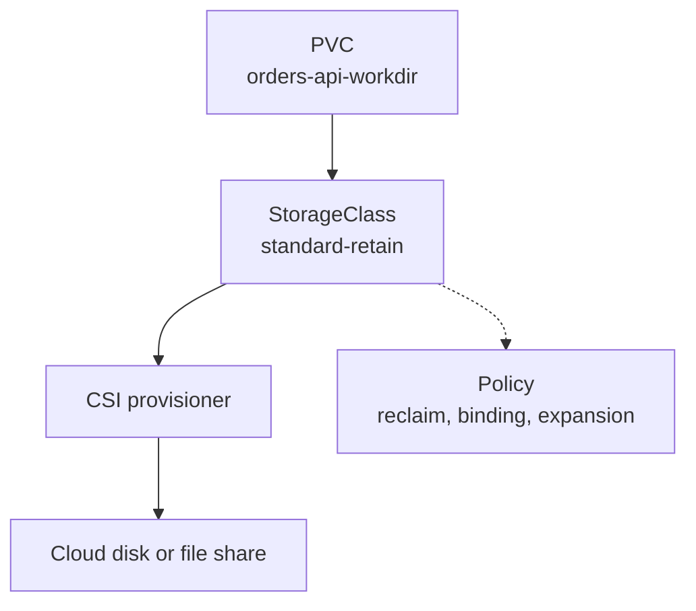

## Table of Contents

1. [Storage Profiles for a Cluster](#storage-profiles-for-a-cluster)
2. [Reading a StorageClass](#reading-a-storageclass)
3. [Dynamic Provisioning from a Claim](#dynamic-provisioning-from-a-claim)
4. [Default StorageClass Behavior](#default-storageclass-behavior)
5. [Volume Binding Mode and Scheduling](#volume-binding-mode-and-scheduling)
6. [Reclaim Policy and Expansion](#reclaim-policy-and-expansion)
7. [Failure Mode: The Wrong Class Name](#failure-mode-the-wrong-class-name)
8. [Choosing Classes for devpolaris-orders-api](#choosing-classes-for-devpolaris-orders-api)
9. [What Application Teams Should Ask Platform Teams](#what-application-teams-should-ask-platform-teams)

## Storage Profiles for a Cluster

A StorageClass is a Kubernetes object that describes a kind of storage the cluster can provide. It might represent fast SSD-backed block storage, cheaper standard disks, a shared file system, or a retained production disk profile. Application teams do not usually need to know every provider parameter. They need to know which profile matches their workload.

This is why PVCs have `storageClassName`. The claim says, "give me 10Gi from this profile." The StorageClass says which provisioner creates the backing storage and which rules apply.

For `devpolaris-orders-api`, staging may use a cheap class for temporary invoice work files. Production may use a retained class with expansion enabled and backup coverage. Both claims can look similar while the class changes the operational behavior behind them.



The StorageClass is cluster-level, not namespaced. A namespace can use it if RBAC, quotas, and policies allow the workload to create claims that reference it.

## Reading a StorageClass

A StorageClass is a cluster-level storage profile, so reading one means reading the operational promises attached to that profile. The `provisioner` identifies the storage driver. `reclaimPolicy` says what happens to dynamically created volumes after their claim is deleted. `volumeBindingMode` controls when binding and provisioning happen. `allowVolumeExpansion` tells you whether a PVC can request more storage later.

Example: `standard-retain` can mean encrypted standard disks, retained backing storage after claim deletion, expansion support, and zone-aware binding.

```yaml
apiVersion: storage.k8s.io/v1
kind: StorageClass
metadata:
  name: standard-retain
provisioner: disk.csi.example.com
reclaimPolicy: Retain
allowVolumeExpansion: true
volumeBindingMode: WaitForFirstConsumer
parameters:
  type: standard
  encrypted: "true"
```

The `parameters` field belongs to the provisioner. A cloud disk driver and a file-share driver use different parameters. That is why application teams should avoid copying random StorageClass examples from the internet into a cluster. The class must match the installed CSI driver, which is the storage integration that talks to the backing system.

Inspect classes before choosing one.

```bash
$ kubectl get storageclass
NAME                    PROVISIONER              RECLAIMPOLICY   VOLUMEBINDINGMODE      ALLOWVOLUMEEXPANSION   AGE
standard-delete         disk.csi.example.com     Delete          WaitForFirstConsumer   true                   42d
standard-retain         disk.csi.example.com     Retain          WaitForFirstConsumer   true                   42d
shared-rwx              files.csi.example.com    Retain          Immediate              true                   18d
```

That table gives you more operational signal than the name alone. A class called `standard` might delete data on claim removal. Always read the fields.

## Dynamic Provisioning from a Claim

Dynamic provisioning means the cluster creates backing storage automatically after it sees a PVC. You create a PVC that references a StorageClass, and the class's provisioner creates the backing PV.


*A StorageClass lets a claim trigger new storage instead of waiting for a manually prepared volume.*


Example: `orders-api-workdir` can request `20Gi` from `standard-retain`, and the CSI provisioner can create the cloud disk and PV without the application team writing a disk ID by hand.

```yaml
apiVersion: v1
kind: PersistentVolumeClaim
metadata:
  name: orders-api-workdir
  namespace: devpolaris-prod
spec:
  storageClassName: standard-retain
  accessModes:
    - ReadWriteOnce
  resources:
    requests:
      storage: 20Gi
```

After the claim is applied, Kubernetes coordinates with the external provisioner. The resulting PV often has a generated name.

```bash
$ kubectl get pvc orders-api-workdir -n devpolaris-prod
NAME                 STATUS   VOLUME                                     CAPACITY   ACCESS MODES   STORAGECLASS      AGE
orders-api-workdir   Bound    pvc-f7b7fdc7-7c62-4d68-83f9-2d45021807a4   20Gi       RWO            standard-retain   1m
```

The application team did not write a cloud disk ID. That is the point. The PVC describes the need. The StorageClass and provisioner handle the provider-specific creation.

## Default StorageClass Behavior

A default StorageClass is the class Kubernetes may use when a PVC does not name one. This is convenient for simple clusters, but it can surprise teams that expect an omitted class to mean "do not dynamically provision anything."

Example: if `standard-delete` is the default, a PVC without `storageClassName` may get storage that is deleted when the claim is deleted, which may be wrong for production handoff files.

```bash
$ kubectl get storageclass
NAME                        PROVISIONER            RECLAIMPOLICY   VOLUMEBINDINGMODE      ALLOWVOLUMEEXPANSION   AGE
standard-delete (default)   disk.csi.example.com   Delete          WaitForFirstConsumer   true                   42d
standard-retain             disk.csi.example.com   Retain          WaitForFirstConsumer   true                   42d
```

A PVC without `storageClassName` may bind to `standard-delete`. That might be fine for staging. It might be dangerous for production if deleting a claim should not delete backing storage.

For important workloads, be explicit:

```yaml
spec:
  storageClassName: standard-retain
```

If you intentionally want no dynamic provisioning, Kubernetes uses a different shape:

```yaml
spec:
  storageClassName: ""
```

That empty string means the claim should bind only to a pre-created PV with no class. It is rare for application teams, but it matters during migrations and static provisioning.

## Volume Binding Mode and Scheduling

Some storage can only attach to Pods in certain places, such as a specific zone or node group. `volumeBindingMode` is the StorageClass setting that decides whether storage is created immediately or waits until Kubernetes knows where the first Pod will run.


*WaitForFirstConsumer delays volume creation until scheduling knows where the pod can run.*


`Immediate` provisions as soon as the PVC appears. `WaitForFirstConsumer` waits until a Pod uses the claim, so Kubernetes can consider where the Pod will run.

That matters for storage tied to zones or nodes. If a disk is created in zone A but the Pod is scheduled in zone B, the Pod may not be able to attach the disk. Waiting for the first consumer lets the scheduler choose a compatible placement before the storage is created.

```text
StorageClass: standard-retain
volumeBindingMode: WaitForFirstConsumer

Pod needs PVC -> scheduler considers node zone -> provisioner creates matching volume -> Pod starts
```

A Pod waiting for storage may show scheduling events rather than application logs.

```bash
$ kubectl describe pod orders-api-846d6bf65d-g8p9d -n devpolaris-prod
Events:
  Type    Reason             Age   From               Message
  Normal  WaitForFirstConsumer 42s  persistentvolume-controller  waiting for first consumer to be created before binding
```

That message is not automatically bad. It can be the expected waiting phase before a Pod consumes the claim. If it stays for a long time, inspect scheduler events and provisioner logs.

## Reclaim Policy and Expansion

Reclaim policy and expansion are lifecycle promises attached to a storage profile. `reclaimPolicy` decides what happens after claim deletion. `allowVolumeExpansion` decides whether the claim can request more capacity later.

Example: a staging scratch disk can use `Delete`, while a production invoice work directory may use `Retain` and expansion so the team can grow from `20Gi` to `40Gi` during a busy period.

For an invoice work directory, expansion can save you during a busy period. The PVC starts at 20Gi, monitoring shows it is near full, and you increase the request to 40Gi if the class and driver support expansion.

```yaml
spec:
  resources:
    requests:
      storage: 40Gi
```

Then inspect the claim and events.

```bash
$ kubectl describe pvc orders-api-workdir -n devpolaris-prod
Status:        Bound
Capacity:      40Gi
Events:
  Type    Reason                 Age   From                         Message
  Normal  FileSystemResizeSuccessful  2m  kubelet                    Mount volume resize succeeded
```

Expansion solves capacity pressure. Backups and restore procedures handle accidental deletion or corruption. Reclaim policy has the same boundary: `Retain` may keep a volume around, but you still need a documented restore path and ownership cleanup.

## Failure Mode: The Wrong Class Name

A typo in `storageClassName` is one of the easiest storage failures to diagnose if you start with the PVC.

```bash
$ kubectl get pvc orders-api-workdir -n devpolaris-prod
NAME                 STATUS    VOLUME   CAPACITY   ACCESS MODES   STORAGECLASS       AGE
orders-api-workdir   Pending                                      standart-retain    6m

$ kubectl describe pvc orders-api-workdir -n devpolaris-prod
Events:
  Type     Reason              Age   From                         Message
  Warning  ProvisioningFailed  5m    persistentvolume-controller  storageclass.storage.k8s.io "standart-retain" not found
```

The Pod is not the root problem. The claim asked for a class that does not exist. Fix the PVC manifest and reapply it. If the PVC has already been created with the wrong class, you may need to delete and recreate the claim, depending on binding state and your data safety requirements.

For production data, stop before deleting anything. Check whether a PV was created, whether it has data, and what the reclaim policy is.

## Choosing Classes for devpolaris-orders-api

Choose a StorageClass by workload behavior, not by the most expensive option. `devpolaris-orders-api` has several possible storage needs, and each points to a different profile.

| Need | Better Class Shape | Reason |
|------|--------------------|--------|
| Staging scratch work | Delete reclaim, cheap disk | Data is disposable |
| Production invoice handoff | Retain reclaim, expandable disk | Data may matter during incidents |
| Shared reports across replicas | RWX file storage | Multiple Pods need read-write access |
| Database storage | Database operator or managed database | Needs database-grade backup and recovery |

The tradeoff is cost and operational responsibility. Retained, backed-up, encrypted, multi-zone storage is safer but costs more and requires cleanup. Disposable storage is cheaper but must never hold data the business needs later.

A helpful label on PVCs can make ownership visible:

```yaml
metadata:
  labels:
    app.kubernetes.io/name: devpolaris-orders-api
    devpolaris.io/data-owner: platform-orders
    devpolaris.io/data-purpose: invoice-workdir
```

Labels do not protect data by themselves, but they make audits, cleanup scripts, and incident reviews easier.

## What Application Teams Should Ask Platform Teams

Application teams do not need to become storage driver experts, but they need enough information to choose safely. Before using a StorageClass in production, ask for the operating contract.

| Question | Why It Matters |
|----------|----------------|
| What reclaim policy does this class use? | Claim deletion may delete real storage |
| Does it support expansion? | Capacity incidents need a safe path |
| Which access modes are supported? | Shared writers require specific storage |
| Is it encrypted? | Sensitive data may require it |
| Is it backed up? | PVC persistence is not the same as recovery |
| Which zones can use it? | Scheduling and attach failures depend on placement |

For `devpolaris-orders-api`, those answers decide whether the work directory is safe for production invoice handoff or only for staging practice. The class name is the start of the conversation, not the whole contract.

### StorageClass Names Are an API for Teams

A StorageClass name is the label application teams put into PVC manifests. That makes it an API for teams, even though it behaves more like a stable platform contract than an HTTP endpoint or library function. If platform engineers rename or remove a class, existing manifests and onboarding guides can break.

That is why names should describe the operating contract, not the provider's internal nickname.

A name like `standard-retain` teaches more than `disk1`. A name like `shared-rwx` tells application teams the class is for shared file access. The parameters can change behind the class as the platform evolves, but the promise should stay stable.

```text
Good class names
- standard-delete
- standard-retain
- shared-rwx
- fast-expandable

Risky class names
- gp2-old
- test
- disk1
- default2
```

This matters during reviews. When `devpolaris-orders-api` asks for `standard-retain`, a reviewer can infer the data should not disappear on claim deletion. If the manifest asks for `default2`, the reviewer has to inspect cluster state to learn the contract.

### Watching the Provisioner

A provisioner is the controller that turns a PVC request into backing storage. In modern clusters, that controller is usually part of a CSI driver, which is the storage integration between Kubernetes and the cloud or storage platform.

When PVC events point at provisioning trouble, the next layer is the CSI controller or external provisioner. Application teams may not own that controller, but they should know how to collect useful evidence before asking for help.

Start with events on the claim.

```bash
$ kubectl describe pvc orders-api-workdir -n devpolaris-prod
Events:
  Type     Reason              Age   From                                                                 Message
  Warning  ProvisioningFailed  2m    disk.csi.example.com_example-csi-controller-5d6bdc7f4d-lsj4r_9f3a  rpc error: code = ResourceExhausted desc = disk quota exceeded
```

That message is different from a YAML typo. The class exists, the provisioner answered, and the backing platform rejected the request because quota was exhausted. The useful escalation includes the PVC name, namespace, StorageClass, requested size, and event text.

```text
Escalation evidence
Namespace: devpolaris-prod
PVC: orders-api-workdir
StorageClass: standard-retain
Request: 20Gi RWO
Event: disk quota exceeded from disk.csi.example.com
Impact: orders-api rollout blocked because Pod cannot mount workdir
```

Good evidence shortens the loop with the platform team. They can check provider quota or provisioner health instead of starting from the application logs.

When the provisioner recovers, confirm the claim moves from `Pending` to `Bound` before restarting application troubleshooting.

```bash
$ kubectl get pvc orders-api-workdir -n devpolaris-prod -w
NAME                 STATUS    VOLUME   CAPACITY   ACCESS MODES   STORAGECLASS      AGE
orders-api-workdir   Pending                                      standard-retain   7m
orders-api-workdir   Bound     pvc-f7b7fdc7-7c62   20Gi       RWO            standard-retain   8m
```

That transition tells you storage provisioning is no longer the blocking layer.


*Use this checklist before choosing a class for data that must survive pod replacement.*

---

**References**

- [Storage Classes](https://kubernetes.io/docs/concepts/storage/storage-classes/) - Official concept page for dynamic provisioning, default classes, reclaim policy, and volume binding mode.
- [Dynamic Volume Provisioning](https://kubernetes.io/docs/concepts/storage/dynamic-provisioning/) - Official explanation of how PVCs can ask a provisioner to create backing storage automatically.
- [Persistent Volumes](https://kubernetes.io/docs/concepts/storage/persistent-volumes/) - Official concept page for PersistentVolume and PersistentVolumeClaim lifecycle, binding, access modes, and reclaim policy.
- [Kubernetes Volumes](https://kubernetes.io/docs/concepts/storage/volumes/) - Official concept page for Kubernetes volume types, mount behavior, and Pod-level volume configuration.
