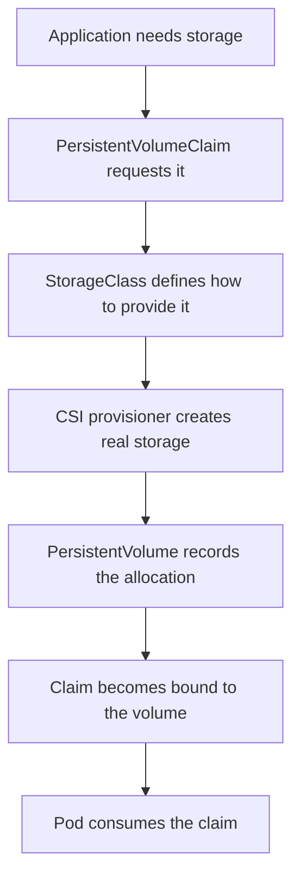

## Table of Contents

1. [Why does Kubernetes need StorageClasses?](#why-does-kubernetes-need-storageclasses)
2. [How does a named profile separate application needs from platform choices?](#how-does-a-named-profile-separate-application-needs-from-platform-choices)
3. [How does a claim select a class?](#how-does-a-claim-select-a-class)
4. [How do provisioner, parameters, and lifecycle settings shape new volumes?](#how-do-provisioner-parameters-and-lifecycle-settings-shape-new-volumes)
5. [When and where does Kubernetes create the volume?](#when-and-where-does-kubernetes-create-the-volume)
6. [How does one storage request travel from a Pod to the backend?](#how-does-one-storage-request-travel-from-a-pod-to-the-backend)
7. [How should teams document and diagnose a storage profile?](#how-should-teams-document-and-diagnose-a-storage-profile)
8. [Check Your Answers](#check-your-answers)
9. [References](#references)

A database may know that it needs 100 GiB of durable storage that survives Pod restarts. It should not need to know whether the cluster uses AWS EBS, Google Persistent Disk, Azure Disk, Ceph, a SAN, or another storage system.

The platform still has to decide how to supply that storage. Someone must choose properties such as SSD or HDD, encryption, replication, filesystem, deletion behavior, expansion support, and availability zone. Kubernetes separates the workload's request from those platform decisions by giving each object a distinct role:

| Object | First-principles role | Plain-language meaning |
|---|---|---|
| Pod | Consumer | “Use this storage.” |
| PersistentVolumeClaim (PVC) | Request | “I need 100 GiB.” |
| StorageClass | Provisioning policy | “This is what `fast` means in this cluster.” |
| PersistentVolume (PV) | Concrete allocation | “Here is the actual volume.” |
| CSI driver and backend | Storage machinery | “Create, attach, and mount the volume.” |

Keep these questions in view as you work through the lesson:

1. **Why does Kubernetes need StorageClasses?**
2. **How does a named profile separate application needs from platform choices?**
3. **How does a claim select a class?**
4. **How do provisioner, parameters, and lifecycle settings shape new volumes?**
5. **When and where does Kubernetes create the volume?**
6. **How does one storage request travel from a Pod to the backend?**
7. **How should teams document and diagnose a storage profile?**

## Why does Kubernetes need StorageClasses?
<!-- section-summary: A StorageClass lets an application request a platform-defined kind of storage without naming the infrastructure that creates it. -->

A **CSI driver** connects Kubernetes to a particular storage system. CSI stands for Container Storage Interface. Kubernetes works with the driver through a standard interface, while the driver translates those operations into calls the storage backend understands.

The overall relationship is:


```mermaid
flowchart TD
    A[Application needs storage] --> B[PersistentVolumeClaim requests it]
    B --> C[StorageClass defines how to provide it]
    C --> D[CSI provisioner creates real storage]
    D --> E[PersistentVolume records the allocation]
    E --> F[Claim becomes bound to the volume]
    F --> G[Pod consumes the claim]
```

This separation is needed because a PersistentVolume can outlive the individual Pod using it. The claim describes **what** the workload needs. The StorageClass describes **how** the platform should produce it and carries some lifecycle policy. The PV records the concrete result.

Follow one database request through those roles. The developer asks for 100 GiB and chooses `fast`; the platform has already decided that `fast` uses encrypted SSD storage through a particular driver. The provisioner creates a backend volume, Kubernetes records that result as a PV, and the database Pod mounts the bound claim. The application sees a directory, while the platform retains a place to change how future requests are fulfilled.

This indirection prevents two kinds of coupling. Application YAML does not depend directly on a vendor API, and Kubernetes does not need built-in code for every storage product. The StorageClass connects a stable Kubernetes request to the installed driver and its provider-specific configuration.

## How does a named profile separate application needs from platform choices?
<!-- section-summary: A StorageClass name is a platform contract whose implementation comes from its driver, parameters, and policies. -->

Suppose a platform team offers three storage profiles:

- `general`
- `fast`
- `shared`

An application can ask for `fast` storage without embedding infrastructure details in its manifest:

```yaml
storageClassName: fast
```

The platform can then define the profile:

```yaml
apiVersion: storage.k8s.io/v1
kind: StorageClass
metadata:
  name: fast
provisioner: csi.example.com
parameters:
  type: ssd
  encrypted: "true"
reclaimPolicy: Delete
allowVolumeExpansion: true
volumeBindingMode: WaitForFirstConsumer
```

Kubernetes does not give the word `fast` any built-in meaning. It is an arbitrary name chosen by the platform operator. Its real meaning comes from the provisioner, parameters, and policies behind it:

```text
fast
├── provisioner: csi.example.com
├── type: ssd
├── encrypted: true
├── reclaim policy: Delete
├── expansion: allowed
└── binding: WaitForFirstConsumer
```

This creates an intentional boundary:

| Application contract | Platform implementation |
|---|---|
| “I want `fast` storage.” | SSD, EBS, Ceph, SAN, or another backend |
| `storageClassName: fast` | Provisioner, parameters, and lifecycle policy |

The platform team owns the implementation. Application teams depend on the named contract.

For example, a claim can state exactly what the workload needs:

```yaml
apiVersion: v1
kind: PersistentVolumeClaim
metadata:
  name: postgres-data
spec:
  accessModes:
    - ReadWriteOnce
  storageClassName: fast
  resources:
    requests:
      storage: 100Gi
```

The PVC asks for 100 GiB, `ReadWriteOnce` access, and the `fast` profile. `ReadWriteOnce` means the volume can be mounted read-write from one node. The claim does not name a cloud, disk product, availability zone, driver version, encryption key, or storage credentials. `storageClassName` is the join key between the request and the profile.

A StorageClass is best understood as factory configuration. It guides the creation of a new PV, but it is not a permanent controller that transforms existing disks. If the platform later changes what `fast` means, already-created volumes do not automatically become a different storage technology. Their materialized settings remain recorded in their PVs and in the storage backend.

That timing makes the profile name a promise about new allocations, not a live label that continually rewrites old ones. Suppose `fast` initially means one SSD type and the platform later points new provisioning at another. A PVC already bound to a PV continues using its existing volume. A later PVC may receive the new implementation. Operators must inspect the PV and backend to know what a particular existing claim actually received.

A useful profile name therefore represents a documented capability rather than an unqualified adjective. `fast-rwo` communicates more than `gold`, but the documentation still needs to state encryption, topology, supported access modes, expansion, reclaim behavior, snapshots, and backup responsibility. Kubernetes recognizes only the string relationship; the organization is responsible for keeping the promise behind it clear.

## How does a claim select a class?
<!-- section-summary: An explicit name selects one class, an omitted field accepts defaulting, and an empty string deliberately requests no class. -->

A PVC can select a StorageClass in three ways.

### Select a class explicitly

```yaml
spec:
  storageClassName: fast
```

This means the claim specifically requests the StorageClass whose `metadata.name` is `fast`.

### Omit the field and accept the default

A platform can mark a StorageClass as the cluster default:

```yaml
metadata:
  annotations:
    storageclass.kubernetes.io/is-default-class: "true"
```

When a PVC omits `storageClassName`, Kubernetes can assign the default class. If no default exists when the claim is created, the unassigned claim can receive a class later when a default becomes available. This is retroactive default assignment.

### Use an empty string to request no class

```yaml
spec:
  storageClassName: ""
```

An empty string is not the same as an omitted field. It explicitly asks for classless storage and prevents default assignment. This is useful when a claim is meant to bind to a statically prepared PV rather than trigger dynamic provisioning.

The three forms therefore express different intentions:

| PVC form | Intention |
|---|---|
| `storageClassName: fast` | Use the named `fast` profile |
| Field omitted | Accept the cluster default |
| `storageClassName: ""` | Do not assign a class |

A platform introducing or changing its default class makes the difference especially important. An explicit name remains explicit, an omitted field accepts default behavior, and an empty string stays classless.

Consider three otherwise identical claims created before a platform adds the `general` default. The explicit `fast` claim continues requesting `fast`. The omitted claim can be assigned `general` when the default appears. The claim with `storageClassName: ""` deliberately remains without a class so it can match classless static supply. One omitted line and one empty string therefore encode different provisioning contracts.

When diagnosis shows an unexpected class, first inspect what the submitted PVC actually expressed. A default is relevant only when selection was left open. It cannot satisfy a misspelled explicit class, and it should not override an explicit request for no class.

## How do provisioner, parameters, and lifecycle settings shape new volumes?
<!-- section-summary: The provisioner performs storage operations, parameters configure its backend, and class policies govern the resulting volume's lifecycle and mounts. -->

Storage can be supplied statically or dynamically.

With **static provisioning**, an administrator creates the backend storage and a matching PV before the claim needs it. Kubernetes then binds a compatible PVC to that prepared PV.

With **dynamic provisioning**, the PVC selects a StorageClass and Kubernetes asks its provisioner to create storage on demand:

```text
PVC request → StorageClass policy → CSI driver → new backend volume → new PV
```

The PVC is like an order, the StorageClass is the product specification, the provisioner is the factory, and the PV is the manufactured item.

### The provisioner identifies the driver

For a CSI-backed class, `provisioner` identifies the external provisioner and driver that handle the request. The provisioner watches for eligible claims, calls the CSI driver's `CreateVolume` operation, and creates a PV that represents the resulting storage.

If the provisioner is unavailable, new claims cannot complete this dynamic path.

### Parameters belong to the selected driver

`parameters` are provider-specific strings passed to the provisioner. One driver may accept a disk type or encryption option; another may define an entirely different set of keys. Kubernetes does not give these keys a universal meaning, so platform teams must use the documentation for the installed driver.

### Reclaim policy controls what happens after release

For dynamically provisioned volumes, the class's `reclaimPolicy` is copied into the new PV:

- `Delete` removes the PV and asks the backend to delete its storage after the claim is released.
- `Retain` keeps the storage for manual recovery, archival, sanitization, or cleanup.

If the class omits this setting, the default is `Delete`. That default has real consequences, so a platform should choose and document the policy deliberately.

### Expansion permits growth, not shrinking

`allowVolumeExpansion: true` allows a PVC to request more capacity when the driver and storage system support expansion. The workload grows the claim by increasing its requested size. Kubernetes does not support shrinking the requested volume through this mechanism.

### Mount options are copied into new PVs

`mountOptions` defines flags used when dynamically provisioned volumes are mounted. Kubernetes does not validate arbitrary mount options in advance. A class can therefore provision a volume successfully and still leave its Pod with a mount failure if an option is invalid for the driver, operating system, or filesystem.

These settings guide future volumes. To understand an existing allocation, inspect the resulting PV because it records the concrete storage class, reclaim policy, mount options, CSI driver, backend handle, and topology chosen for that volume.

### Separate generic policy from driver vocabulary

Fields such as `reclaimPolicy`, `allowVolumeExpansion`, and `volumeBindingMode` have Kubernetes-defined roles. Entries under `parameters` belong to the provisioner. If one class uses `type: ssd` and another driver uses `pool: premium`, Kubernetes passes those strings to the selected machinery; it does not translate them into one universal performance model.

This is why copying parameters between drivers is unsafe even when the YAML parses. The class can exist as a valid Kubernetes object while the provisioner rejects an unknown value or creates storage with a different meaning than the author assumed. Provider documentation and an observed test allocation are part of validating the platform profile.

Lifecycle fields also act at different times. Parameters influence creation. The reclaim policy matters after the claim is released. Expansion permission matters when the claim later asks for more capacity. Mount options matter when a node tries to mount the allocated volume. A provisioning success cannot prove that every later lifecycle operation will succeed.

## When and where does Kubernetes create the volume?
<!-- section-summary: Immediate binding creates storage as soon as the claim appears, while WaitForFirstConsumer lets Pod scheduling guide topology-sensitive provisioning. -->

Storage is sometimes tied to a location. A zonal disk may be accessible only to nodes in one availability zone. Kubernetes therefore has to coordinate two decisions: where the Pod can run and where its storage should exist.

`volumeBindingMode` controls when a claim is bound or dynamically provisioned.

### Immediate

`Immediate` is the default:

```text
PVC created → volume selected or created immediately → Pod appears later
```

Kubernetes chooses storage before it necessarily knows where the consuming Pod can run. This can work for globally accessible storage. For topology-constrained storage, however, the disk could be created in one zone while the Pod's resource requests, affinity, selectors, or tolerations lead it to another.

### WaitForFirstConsumer

`WaitForFirstConsumer` delays the storage decision until a Pod actually references the claim:

```text
PVC created
    ↓
Pending
    ↓ Pod references the claim
Scheduler evaluates Pod resources and placement rules
    ↓
Compatible topology selected
    ↓
Volume created there
    ↓
PVC bound and Pod scheduled
```

Storage placement now participates in Pod scheduling. The scheduler can consider node resources, affinity, selectors, taints and tolerations, and storage topology together.

For that reason, a PVC event saying `waiting for first consumer to be created before binding` is not necessarily an error. It can mean Kubernetes is deliberately waiting for a Pod before deciding where the volume should exist.

### Walk the zonal decision in order

Suppose the database Pod requires a node in `zone-b` because of its placement constraints. With `Immediate`, a volume might already exist in `zone-a`; Kubernetes then has a valid Pod constraint and a valid disk that cannot be combined. With `WaitForFirstConsumer`, the unresolved PVC is allowed to wait while the scheduler evaluates the Pod. Provisioning can then choose storage in `zone-b`, producing a compatible pair.

```text
Pod constraints + candidate nodes + storage topology
                         ↓
                 compatible zone-b
                    ↙         ↘
              schedule Pod   provision disk
```

The important insight is that `Pending` describes incomplete binding, not necessarily malfunction. Before treating it as a failure, determine whether a consuming Pod exists and whether the class intentionally waits for that consumer. Once the Pod exists, conflicting node selectors, affinity, resource availability, or storage topology can still leave no compatible choice.

## How does one storage request travel from a Pod to the backend?
<!-- section-summary: Following one request shows how the Pod, claim, class, CSI provisioner, PV, and backend handle form one continuous storage path. -->

Start with a StorageClass:

```yaml
apiVersion: storage.k8s.io/v1
kind: StorageClass
metadata:
  name: fast
provisioner: csi.example.com
parameters:
  type: ssd
reclaimPolicy: Delete
allowVolumeExpansion: true
volumeBindingMode: WaitForFirstConsumer
```

The claim requests that profile:

```yaml
apiVersion: v1
kind: PersistentVolumeClaim
metadata:
  name: db-data
spec:
  storageClassName: fast
  accessModes:
    - ReadWriteOnce
  resources:
    requests:
      storage: 100Gi
```

The Pod consumes the claim:

```yaml
apiVersion: v1
kind: Pod
metadata:
  name: database
spec:
  containers:
    - name: db
      image: postgres
      volumeMounts:
        - name: data
          mountPath: /var/lib/postgresql/data
  volumes:
    - name: data
      persistentVolumeClaim:
        claimName: db-data
```

Kubernetes follows the references in order:

1. The Pod names the `db-data` PVC.
2. The PVC requests `storageClassName: fast`.
3. The StorageClass selects `csi.example.com` and supplies `type: ssd` plus its policies.
4. The CSI provisioner creates the physical storage.
5. Kubernetes creates a PV for that allocation and binds it to `db-data`.
6. The Pod mounts the claim at `/var/lib/postgresql/data`.

The resulting PV commonly contains a structure like this:

```yaml
apiVersion: v1
kind: PersistentVolume
metadata:
  name: pvc-123456
spec:
  storageClassName: fast
  claimRef:
    namespace: default
    name: db-data
  capacity:
    storage: 100Gi
  csi:
    driver: csi.example.com
    volumeHandle: disk-987654
```

`volumeHandle` is the driver's identifier for the actual backend storage. It completes the runtime path:

```text
Pod → PVC → PV → CSI volumeHandle → actual storage
```

The StorageClass is primarily involved in deciding how the PV is created. The PV then records what was actually allocated.

The names form a sequence of joins. `claimName: db-data` joins the Pod to the PVC in its namespace. `storageClassName: fast` joins the claim to the named platform profile. The provisioner field joins that profile to the driver. The PV's `claimRef` records the winning claim, and `volumeHandle` joins the PV to the provider's real resource. Checking each join independently makes debugging much more precise.

Capacity and requested access modes stay on the PVC, not the StorageClass. The claim answers “how much?”, “how will it be accessed?”, “filesystem or raw block?”, and “which profile?”. The class answers “which provisioner?”, “which provider parameters?”, “when should binding happen?”, “what happens after deletion?”, “can it expand?”, and “which mount options?”.

A friendly class name does not override backend capability. A class called `shared`, for example, does not automatically guarantee `ReadWriteMany`. The storage technology and driver must actually support the requested access mode.

## How should teams document and diagnose a storage profile?
<!-- section-summary: A class serves as a usable platform API if its contract is documented and failures are traced through claim, class, volume, Pod, and driver. -->

StorageClass names are more useful when a platform treats them as contracts rather than unexplained YAML strings. A profile description might state:

| Property | `fast-rwo` |
|---|---|
| Intended use | Databases |
| Backend | SSD block storage |
| Access mode | RWO or RWOP supported |
| Encryption | Enabled |
| Expansion | Supported |
| Reclaim policy | Delete |
| Binding | WaitForFirstConsumer |
| Topology | Zonal |
| Snapshot support | Yes |
| Backup | Separate backup service required |

The platform team publishes and maintains that profile. The application team consumes it with `storageClassName: fast-rwo`. This avoids forcing every workload owner to reverse-engineer provider-specific parameters.

The contract should also say which guarantees belong elsewhere. “Snapshot support: yes” says the driver can create snapshots; it does not say a backup schedule already exists. “Expansion: supported” says the volume may grow; it does not promise shrinking. “Zonal” tells workload owners that Pod placement and storage placement must agree. Stating these boundaries prevents a friendly class name from being mistaken for a complete durability policy.

When storage fails, follow the same object chain Kubernetes used.

Start with the claim:

```bash
kubectl get pvc -n my-namespace
kubectl describe pvc db-data -n my-namespace
```

Check its status, StorageClass, selected volume, and events. Then inspect the class:

```bash
kubectl get storageclass
kubectl get storageclass fast -o yaml
```

Look at the provisioner, parameters, reclaim policy, binding mode, expansion setting, and mount options.

If the PVC is bound, follow its PV:

```bash
kubectl get pv pvc-f819... -o yaml
kubectl describe pv pvc-f819...
```

Check `spec.storageClassName`, `spec.claimRef`, `spec.csi.driver`, `spec.csi.volumeHandle`, `spec.nodeAffinity`, and `status.phase`.

Finally, inspect the consumer and its events:

```bash
kubectl describe pod database -n my-namespace
kubectl get events -n my-namespace --sort-by=.lastTimestamp
```

The point where the chain stops narrows the problem:

| Observed state | Likely area to inspect |
|---|---|
| PVC `Pending` | Missing class or default, failed provisioner, invalid parameters, quota or capacity, or deliberate WaitForFirstConsumer delay |
| PVC `Bound`, Pod `Pending` | Scheduling, topology, node affinity, or attachment constraints |
| PVC `Bound`, Pod `ContainerCreating` | CSI attachment, CSI node plugin, filesystem, or mount options |

A bound PVC means Kubernetes matched the claim to a PV. It does not prove that attachment and mounting succeeded.

Use that fact to avoid restarting the investigation at the wrong layer. A `Pending` claim directs attention to selection, defaulting, the provisioner, capacity, parameters, or an intentional consumer wait. A bound claim with an unschedulable Pod directs attention to placement and topology. A Pod stuck creating its container after binding directs attention toward attachment, the node-side CSI component, the filesystem, and mount options.

For example, an unsupported `mountOptions` entry may not prevent the class from creating a backend disk or the PVC from binding. The node mount is the first point at which the problem is visible. The earlier green states remain useful evidence: they show exactly how far the request travelled before it stopped.

The shortest reliable model is therefore:

```text
PVC          = request
StorageClass = provisioning policy
PV           = concrete allocation
Pod          = consumer
CSI driver   = machinery that makes the allocation real
```

Provisioner, parameters, reclaim policy, mount options, expansion, topology, and binding mode all follow from that separation between application demand and platform implementation.

## Check Your Answers
<!-- section-summary: The closing questions reconnect the reason for StorageClasses with profile selection, provisioning policy, placement, runtime flow, and diagnosis. -->

:::expand[Why does Kubernetes need StorageClasses?]{kind="recap"}
Applications should describe the durable storage they need without embedding cloud, SAN, driver, or backend details. A StorageClass gives the platform a separate policy layer for producing that storage, while the resulting PV records the concrete allocation.
:::

:::expand[How does a named profile separate application needs from platform choices?]{kind="recap"}
The application depends on a stable name such as `fast`. The platform assigns meaning to that name through a provisioner, parameters, and lifecycle policies. Kubernetes does not treat `fast` as a built-in performance guarantee, and changing the class later does not transform existing volumes.
:::

:::expand[How does a claim select a class?]{kind="recap"}
An explicit `storageClassName` selects a named profile. An omitted field accepts the cluster default and can receive one retroactively, while `storageClassName: ""` deliberately requests no class and prevents default assignment.
:::

:::expand[How do provisioner, parameters, and lifecycle settings shape new volumes?]{kind="recap"}
The provisioner identifies the CSI driver, and parameters configure that driver's backend. Reclaim policy, expansion permission, and mount options govern parts of the new volume's lifecycle. These decisions are copied or materialized into future PVs, while static provisioning starts from an administrator-prepared PV instead.
:::

:::expand[When and where does Kubernetes create the volume?]{kind="recap"}
Immediate binding selects or creates storage as soon as the PVC appears. WaitForFirstConsumer delays the decision until the scheduler can consider the consuming Pod's requirements and storage topology together, so a waiting-for-consumer event can be expected behavior.
:::

:::expand[How does one storage request travel from a Pod to the backend?]{kind="recap"}
The Pod references a PVC, the PVC selects a StorageClass, the class directs a CSI provisioner, and Kubernetes records the result in a PV. The PV's CSI `volumeHandle` identifies the actual backend volume, completing the path from Pod to storage.
:::

:::expand[How should teams document and diagnose a storage profile?]{kind="recap"}
The platform should publish each class as a contract covering intended use and capabilities. During diagnosis, follow Pod, PVC, StorageClass, PV, and CSI details in the same order as the provisioning path. A bound claim proves matching, but attachment and mounting must still succeed.
:::

## References

- [Storage Classes](https://kubernetes.io/docs/concepts/storage/storage-classes/)
- [Dynamic Volume Provisioning](https://kubernetes.io/docs/concepts/storage/dynamic-provisioning/)
- [Persistent Volumes](https://kubernetes.io/docs/concepts/storage/persistent-volumes/)
- [CSI Volumes](https://kubernetes.io/docs/concepts/storage/volumes/#csi)
