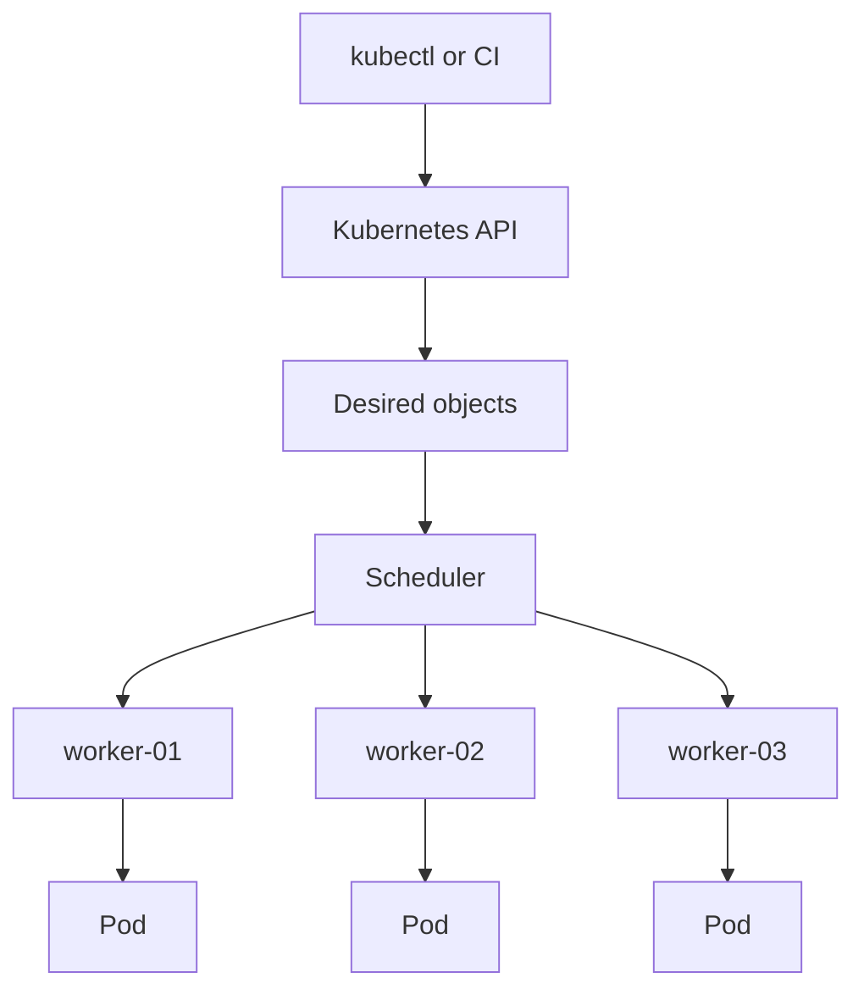

## Table of Contents

1. [One API, Many Machines](#one-api-many-machines)
2. [Nodes Are Where Work Runs](#nodes-are-where-work-runs)
3. [Pods Are the Smallest Scheduling Unit](#pods-are-the-smallest-scheduling-unit)
4. [Objects Are Records of Intent](#objects-are-records-of-intent)
5. [Services Give Moving Pods a Stable Door](#services-give-moving-pods-a-stable-door)
6. [Labels Connect Related Objects](#labels-connect-related-objects)
7. [Capacity Is Real, Even When the API Is Abstract](#capacity-is-real-even-when-the-api-is-abstract)
8. [Failure Mode: Pending Pods](#failure-mode-pending-pods)
9. [A Working Inspection Habit](#a-working-inspection-habit)

## One API, Many Machines

The easiest mistake is picturing a Kubernetes cluster as one huge computer. That picture is close enough to explain why a team sends work to the cluster, but it hides the details you need during debugging. A cluster is a set of machines managed through one control plane API. The API stores objects, controllers watch those objects, and worker nodes run the actual containers.

For `devpolaris-orders-api`, the team should not care which exact node handles a normal request. They should care that enough healthy Pods are running, that those Pods can be reached through a stable Service, and that the cluster has enough CPU and memory to keep the workload healthy. The cluster gives a shared operating surface, not a promise that physical machines disappear.



Read the diagram from top to bottom. Humans and automation talk to the API. The scheduler chooses nodes. Kubelets on those nodes run Pods. When a beginner asks "where is my app?", the practical answer is usually "start at the API object, then follow status to the Pod and node."

## Nodes Are Where Work Runs

A node is a worker machine in the cluster. It can be a VM, a physical server, or a local development node created by a tool such as kind or minikube. Each node runs a kubelet, which is the node agent that communicates with the control plane, and a container runtime, which actually starts containers.

The control plane manages nodes, but the workload does not run inside the API server. Your `devpolaris-orders-api` container runs on a node. If that node loses network connectivity, runs out of disk, or cannot pull an image, the failure shows up in Pod status and node conditions.

```bash
$ kubectl get nodes
NAME        STATUS   ROLES    AGE   VERSION
worker-01   Ready    <none>   28d   v1.34.2
worker-02   Ready    <none>   28d   v1.34.2
worker-03   Ready    <none>   28d   v1.34.2
```

The important field for a first pass is `STATUS`. `Ready` means the node is reporting that it can accept and run normal Pods. A node can still have more detailed issues, but `Ready` is the first health gate. If all nodes are `NotReady`, the problem is below your application YAML.

You can ask where an app's Pods landed:

```bash
$ kubectl get pods -n orders-prod -l app=devpolaris-orders-api -o wide
NAME                                     READY   STATUS    RESTARTS   AGE   IP           NODE
devpolaris-orders-api-6d8f7d9f8c-2k9sl   1/1     Running   0          2h    10.42.1.21   worker-01
devpolaris-orders-api-6d8f7d9f8c-h6p8d   1/1     Running   0          2h    10.42.2.19   worker-02
devpolaris-orders-api-6d8f7d9f8c-xr4mf   1/1     Running   0          2h    10.42.3.11   worker-03
```

The `NODE` column turns the abstraction back into real placement. That matters when one node is unhealthy, when a rollout only fails on one zone, or when a workload has constraints that leave it with nowhere to run.

Node placement also helps explain why identical Pods can behave differently. If only the Pod on `worker-03` reports timeouts to the database, the application image may be fine and the node network path may be suspicious. If all Pods fail in the same way across three nodes, the shared configuration or dependency is more likely.

```text
Question:
  Is this failure tied to one node or every copy of the app?

Evidence to collect:
  kubectl get pods -o wide
  kubectl describe node <node>
  kubectl logs <pod> for one Pod on each node
```

That evidence keeps the mental model practical. A cluster is abstract enough to schedule work for you, but concrete enough that node-level facts still matter.

## Pods Are the Smallest Scheduling Unit

A Pod is the smallest unit Kubernetes schedules. A Pod usually contains one application container, but it can contain multiple containers that need to share the same network address and storage volumes. For most web APIs, read "Pod" as "the wrapper Kubernetes schedules around my application container."

Kubernetes schedules Pods rather than raw containers because a Pod carries more context than a container command. It has labels, environment variables, volumes, probes, resource requests, service account identity, and status. That extra context is what lets Kubernetes connect the running process to the rest of the cluster.

```yaml
apiVersion: v1
kind: Pod
metadata:
  name: devpolaris-orders-api-debug
  namespace: orders-prod
  labels:
    app: devpolaris-orders-api
spec:
  containers:
    - name: api
      image: ghcr.io/devpolaris/orders-api:1.4.2
      ports:
        - containerPort: 3000
```

You rarely manage standalone Pods directly in production because a controller should replace failed Pods for you. The Pod object is still worth understanding because most debugging lands there. A Deployment can be healthy or unhealthy for many reasons, but the Pod shows whether a container is waiting, running, crashing, or ready.

| Pod status | First meaning | First command |
|------------|---------------|---------------|
| `Pending` | Not scheduled or not fully prepared | `kubectl describe pod` |
| `Running` | At least one container is running | `kubectl logs` and readiness |
| `CrashLoopBackOff` | Container repeatedly exits | `kubectl logs --previous` |
| `ImagePullBackOff` | Node cannot pull the image | `kubectl describe pod` |

The status is a starting point, not the whole answer. Always pair it with events, logs, and the related higher-level object.

## Objects Are Records of Intent

Kubernetes objects are records stored by the API server. Each object has metadata, a spec, and often status. Metadata is identity and labels. The spec is what you asked for. Status is what Kubernetes reports after controllers and nodes try to make it real.

That split between `spec` and `status` is one of the most useful mental models in the platform. If `spec.replicas` says `3` and `status.availableReplicas` says `2`, Kubernetes is telling you there is a gap between desired state and current state. The next job is to find where the gap comes from.

```bash
$ kubectl get deployment devpolaris-orders-api -n orders-prod -o jsonpath='{.spec.replicas}{" desired, "}{.status.availableReplicas}{" available\n"}'
3 desired, 2 available
```

The command is not something you need to memorize today. It demonstrates the object shape: desired data and reported data live together, but they mean different things. A GitHub issue has a title you set and comments other people add. A Kubernetes object has a spec you request and status the system updates.

Here is a shortened Deployment view:

```yaml
apiVersion: apps/v1
kind: Deployment
metadata:
  name: devpolaris-orders-api
  namespace: orders-prod
spec:
  replicas: 3
status:
  availableReplicas: 2
  readyReplicas: 2
  updatedReplicas: 3
```

The interesting part is the mismatch. Kubernetes accepted the desired replica count, created updated Pods, but only two are ready. Your investigation should move toward the Pods and their events.

## Services Give Moving Pods a Stable Door

Pods are replaceable. Their names change, their IP addresses change, and they can move to different nodes. A client should not connect directly to a Pod IP in normal application design because that IP may disappear during a rollout or node failure.

A Service gives a stable network name and virtual address for a group of Pods. It usually selects Pods by labels. For `devpolaris-orders-api`, other workloads might call `http://devpolaris-orders-api.orders-prod.svc.cluster.local` instead of memorizing three Pod IPs.

```yaml
apiVersion: v1
kind: Service
metadata:
  name: devpolaris-orders-api
  namespace: orders-prod
spec:
  selector:
    app: devpolaris-orders-api
  ports:
    - name: http
      port: 80
      targetPort: 3000
```

The `port` is the stable Service port. The `targetPort` is the container port on each selected Pod. That mapping lets callers use port `80` while the application continues to listen on `3000` inside the container.

```bash
$ kubectl get svc devpolaris-orders-api -n orders-prod
NAME                    TYPE        CLUSTER-IP      EXTERNAL-IP   PORT(S)   AGE
devpolaris-orders-api   ClusterIP   10.96.184.37    <none>        80/TCP    18d
```

`ClusterIP` means the Service is reachable inside the cluster. It is not automatically public on the internet. Later modules will cover Ingress, load balancers, and gateway patterns. For fundamentals, the important idea is stable identity in front of moving Pods.

## Labels Connect Related Objects

Labels are key-value pairs that Kubernetes uses to group and select objects. They are not only decoration. A Deployment uses labels to know which Pods belong to it. A Service uses labels to know which Pods should receive traffic. Humans use labels to ask targeted questions.

For `devpolaris-orders-api`, the label `app=devpolaris-orders-api` connects the Deployment, Pods, and Service. If the Service selector is wrong, traffic can go nowhere even though the Pods are healthy.

```bash
$ kubectl get pods -n orders-prod --show-labels
NAME                                     READY   STATUS    LABELS
devpolaris-orders-api-6d8f7d9f8c-2k9sl   1/1     Running   app=devpolaris-orders-api,pod-template-hash=6d8f7d9f8c
devpolaris-orders-api-6d8f7d9f8c-h6p8d   1/1     Running   app=devpolaris-orders-api,pod-template-hash=6d8f7d9f8c
```

Now compare the Service selector:

```bash
$ kubectl get svc devpolaris-orders-api -n orders-prod -o jsonpath='{.spec.selector}{"\n"}'
{"app":"devpolaris-orders-api"}
```

Those values must line up. If the Service selects `app=orders-api` while the Pods have `app=devpolaris-orders-api`, the Service exists but has no endpoints. This is one of the cleanest beginner examples of how Kubernetes objects relate through labels rather than hard references.

You can verify the final link by checking endpoints:

```bash
$ kubectl get endpoints devpolaris-orders-api -n orders-prod
NAME                    ENDPOINTS                            AGE
devpolaris-orders-api   10.42.1.21:3000,10.42.2.19:3000      18d
```

If `ENDPOINTS` is empty, do not start by changing DNS. First compare the Service selector, Pod labels, and Pod readiness. Kubernetes will not send Service traffic to Pods that are not selected or not ready.

## Capacity Is Real, Even When the API Is Abstract

Kubernetes can make a fleet feel like one shared pool, but CPU, memory, disk, and network capacity still live on real nodes. When a Pod requests more CPU or memory than any node can provide, the scheduler cannot place it. When every node is full, new Pods wait.

Resource requests tell Kubernetes how much CPU and memory a container needs for scheduling. Limits can cap usage at runtime. A simple API might request `250m` CPU and `256Mi` memory. `250m` means a quarter of one CPU core. `256Mi` means 256 mebibytes of memory.

```yaml
resources:
  requests:
    cpu: "250m"
    memory: "256Mi"
  limits:
    cpu: "500m"
    memory: "512Mi"
```

Requests are a promise to the scheduler: "place this Pod only where this much capacity is available." Limits are a runtime boundary: "do not let this container exceed this much." Bad requests can create two opposite problems. If requests are too low, nodes can become crowded and unstable. If requests are too high, Pods may sit Pending even when the cluster looks mostly idle.

You can inspect allocatable capacity on nodes:

```bash
$ kubectl describe node worker-02
Allocatable:
  cpu:                3900m
  memory:             15839248Ki
Allocated resources:
  Resource           Requests      Limits
  cpu                3200m (82%)   6100m (156%)
  memory             11Gi (71%)    19Gi (123%)
```

The exact numbers vary by cluster. The habit matters more: when scheduling fails, check the node capacity and the Pod requests before assuming Kubernetes is broken.

## Failure Mode: Pending Pods

A Pod in `Pending` state is not running yet. Sometimes it is waiting for an image pull or volume setup, but a common first cause is scheduling failure. The scheduler cannot find a node that satisfies the Pod's requirements.

```bash
$ kubectl get pods -n orders-prod
NAME                                     READY   STATUS    RESTARTS   AGE
devpolaris-orders-api-55b7f957c8-k8v4p   0/1     Pending   0          6m
```

The status alone does not tell you why. Use `describe` and read the events at the bottom.

```bash
$ kubectl describe pod devpolaris-orders-api-55b7f957c8-k8v4p -n orders-prod
Events:
  Type     Reason            Age   From               Message
  ----     ------            ----  ----               -------
  Warning  FailedScheduling  6m    default-scheduler  0/3 nodes are available: 3 Insufficient memory.
```

This is a scheduling problem, not an application bug. The image has not run yet, so application logs cannot help. The fix direction is to reduce the Pod memory request if it was set too high, free capacity by scaling down other workloads, or add node capacity. Which answer is correct depends on whether the request reflects the real memory the API needs.

The diagnosis gets sharper if you compare the Pod request:

```bash
$ kubectl get pod devpolaris-orders-api-55b7f957c8-k8v4p -n orders-prod -o jsonpath='{.spec.containers[0].resources.requests}{"\n"}'
{"cpu":"500m","memory":"4Gi"}
```

If a small Node.js API suddenly requests `4Gi`, the next place to inspect is the Deployment change that created the Pod. A typo in YAML can turn a normal rollout into a scheduling problem before the application starts.

The same idea applies to CPU. A request of `4000m` asks for four full CPU cores. If the largest node has only `3900m` allocatable CPU after system reservations, no node can run that Pod. The scheduler is doing the correct thing by refusing to place work the node cannot promise.

```text
Pod request:
  cpu: 4000m
  memory: 512Mi

Largest node allocatable:
  cpu: 3900m
  memory: 15839248Ki

Result:
  FailedScheduling, because no node can satisfy the CPU request
```

Resource numbers are part of the application contract. They should come from measurement and review, not guesses copied between services.

## A Working Inspection Habit

The cluster mental model becomes useful when it gives you a repeatable inspection path. Start at the object you intended to change. Check its desired and reported state. Move to the Pods. Check events. If the Pod is running, check logs and readiness. If the Pod is not scheduled, check scheduler events and node capacity.

```bash
$ kubectl get deployment devpolaris-orders-api -n orders-prod
$ kubectl describe deployment devpolaris-orders-api -n orders-prod
$ kubectl get pods -n orders-prod -l app=devpolaris-orders-api -o wide
$ kubectl describe pod <pod-name> -n orders-prod
$ kubectl logs <pod-name> -n orders-prod
$ kubectl get nodes
```

This sequence follows the system from desired object to physical placement. It works because Kubernetes is not one hidden machine. It is an API, a set of objects, controllers, a scheduler, nodes, kubelets, and containers. Each layer reports a different part of the truth.

Keep that shape in your head as the rest of the Kubernetes section adds more object types. Deployments, Services, ConfigMaps, Secrets, Jobs, Ingresses, and policies all fit the same basic pattern: you describe intent through the API, Kubernetes reports status, and you inspect the nearest object to the failure.

For a first learning cluster, it is enough to practice this on one service until the chain feels natural. Create or inspect one Deployment, one Service, and the Pods behind it. Change one label on purpose in a safe namespace, watch the Service lose endpoints, then put the label back. That small experiment teaches more than reading a long list of object kinds.

---

**References**

- [Kubernetes Overview](https://kubernetes.io/docs/concepts/overview/) - Official overview of Kubernetes and the platform problems it addresses.
- [Kubernetes Components](https://kubernetes.io/docs/concepts/overview/components/) - Official map of the control plane, nodes, kubelet, scheduler, and container runtime.
- [Nodes](https://kubernetes.io/docs/concepts/architecture/nodes/) - Official explanation of nodes, node status, heartbeats, and node management.
- [Services, Load Balancing, and Networking](https://kubernetes.io/docs/concepts/services-networking/service/) - Official Service concept documentation for stable access to Pods.
