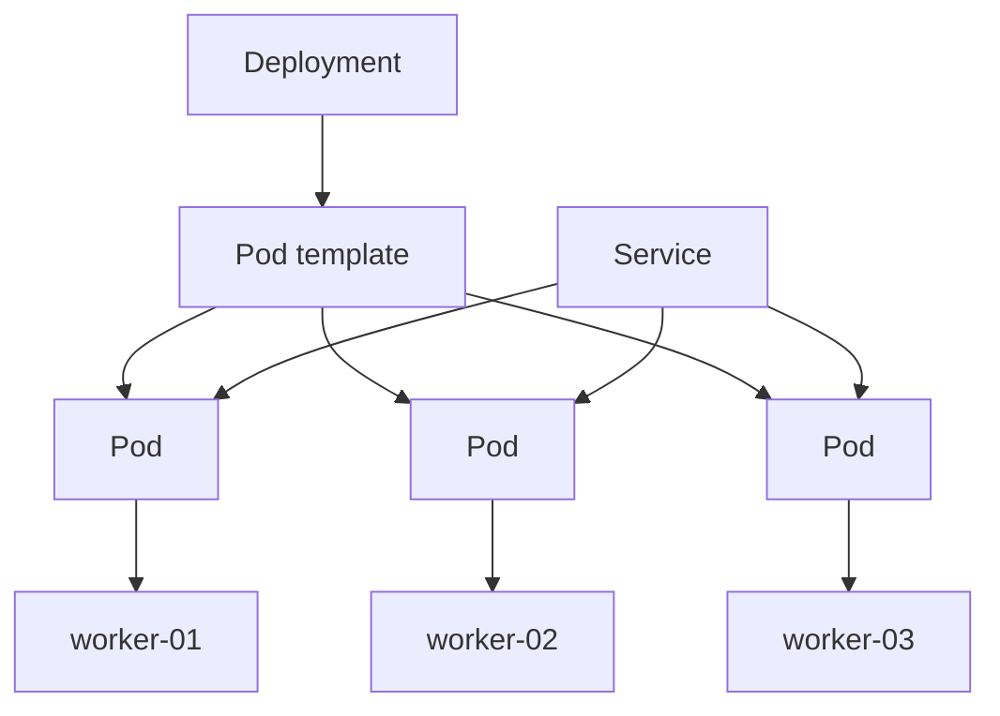
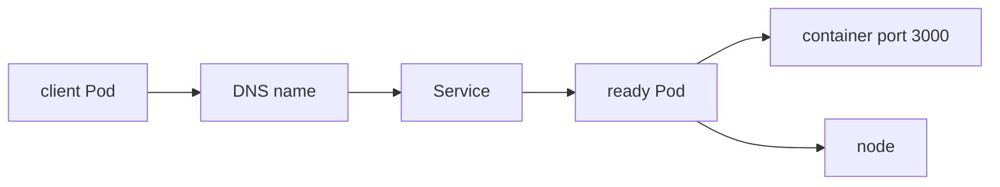

## Table of Contents

1. [The Picture to Keep in Your Head](#the-picture-to-keep-in-your-head)
2. [One Application, Several Objects](#one-application-several-objects)
3. [Nodes](#nodes)
4. [Pods](#pods)
5. [Services](#services)
6. [Labels](#labels)
7. [Capacity](#capacity)
8. [Following One Request](#following-one-request)
9. [Common Wrong Mental Models](#common-wrong-mental-models)
10. [Putting It All Together](#putting-it-all-together)
11. [What's Next](#whats-next)

## The Picture to Keep in Your Head

The previous article explained why Kubernetes exists: a container image is a good package, but a production service needs placement, replacement, networking, configuration, and status. The next step is to form a clear picture of what a cluster is before the object names pile up.

A Kubernetes cluster is a group of machines controlled through one API. The API stores objects. Controllers watch those objects. The scheduler chooses where Pods should run. Worker nodes run the containers. Services give clients a stable way to reach Pods that may be replaced at any time.

The same idea in plain sequence is:

1. A team describes an application through Kubernetes objects.
2. The control plane stores those objects and decides what needs to happen.
3. The scheduler chooses worker nodes for Pods.
4. Worker nodes start the containers inside those Pods.
5. Services give clients a stable route to the ready Pods.

For `devpolaris-api`, the mental model looks like this:



Read the diagram in two directions. The Deployment describes the application copies the team wants. The Pods are the running units created from that description. The nodes are the machines where those Pods run. The Service is the stable network front door for clients inside the cluster.

This is the picture to keep in your head when the object list starts to look crowded. A cluster is not one large server. It is a set of machines coordinated through API objects.

## One Application, Several Objects

A common first reaction is to ask why Kubernetes needs several objects for one application. A single Docker command can run `devpolaris-api`, so why does Kubernetes talk about Deployments, Pods, Services, labels, and namespaces?

The reason is that each object owns a different part of the operating problem.

| Object | Question it answers |
| --- | --- |
| Deployment | How many copies of this application should exist, and which Pod template should they use? |
| Pod | What exact runnable unit should a node start and report on? |
| Service | What stable name and port should clients use while Pods are replaced? |
| Label | Which objects belong together? |
| Namespace | Which scope does this object name live in? |
| Node | Which machine is actually running the Pod? |

Kubernetes separates these jobs because the answers change at different times. A Pod can be replaced while the Service name stays the same. A Deployment can create a new generation of Pods during a rollout while the app label still connects the pieces. A namespace can contain the production copy of `devpolaris-api` while another namespace contains the staging copy with the same application name.

This separation is the main reason Kubernetes can feel verbose. It is also the reason the cluster can replace a Pod without forcing every client to learn a new address.

## Nodes

A node is a machine that can run Pods. It might be a cloud VM, a physical server, or a local VM created by a development tool. It is the place where application containers actually consume CPU and memory.

Each node runs a kubelet, which is the node agent that talks to the control plane, and a container runtime, which starts containers. The control plane can decide that a Pod should run on `worker-02`, but the kubelet on `worker-02` is the component that turns that assignment into local container work.

When you list nodes, you are asking which machines currently belong to the cluster:

```bash
$ kubectl get nodes
NAME        STATUS   ROLES    AGE   VERSION
worker-01   Ready    <none>   28d   v1.34.2
worker-02   Ready    <none>   28d   v1.34.2
worker-03   Ready    <none>   28d   v1.34.2
```

The first field to read is `STATUS`. `Ready` means the node is reporting that it can run normal Pods. If every node is `NotReady`, the problem is below the application. Updating the Deployment will not fix a cluster that has no healthy place to run work.

Nodes also explain why two copies of the same application can behave differently. If the Pod on `worker-03` is the only one timing out to a database, the image may be fine and the network path from that node may be suspicious. Placement matters because real machines still exist underneath the cluster API.

You can see where Pods landed with `-o wide`:

```bash
$ kubectl get pods -n devpolaris-prod -l app=devpolaris-api -o wide
NAME                              READY   STATUS    IP           NODE
devpolaris-api-6d8f7d9f8c-2k9sl   1/1     Running   10.42.1.21   worker-01
devpolaris-api-6d8f7d9f8c-h6p8d   1/1     Running   10.42.2.19   worker-02
devpolaris-api-6d8f7d9f8c-xr4mf   1/1     Running   10.42.3.11   worker-03
```

The `NODE` column turns an abstract workload back into real placement. That column is one of the first things to check when a failure affects only some copies of an application.

## Pods

A Pod is the smallest unit Kubernetes schedules. It wraps one or more containers with shared network identity, shared storage volumes, labels, resource requests, probes, and status. Most web services use one main application container per Pod. Some Pods also include sidecar containers for helper work such as proxying or log shipping.

For a beginner, it helps to read "Pod" as "the runnable unit Kubernetes places on a node." Kubernetes does not schedule raw containers by themselves. It schedules Pods, and the kubelet on the selected node starts the containers inside them.

Kubernetes uses Pods because a running application often needs more than a container image name. It needs an IP address, environment variables, mounted configuration, health checks, resource requests, and status. The Pod is the object that holds those runtime details together.

Most Pods contain one main application container. Multiple containers belong in the same Pod when they need to share the same network address or the same local files. For example, a helper container might prepare files that the main application reads. If two processes can run independently and scale independently, they usually belong in separate Pods.

Here is a small Pod shape for `devpolaris-api`:

```yaml
apiVersion: v1
kind: Pod
metadata:
  name: devpolaris-api-debug
  namespace: devpolaris-prod
  labels:
    app: devpolaris-api
spec:
  containers:
    - name: api
      image: ghcr.io/devpolaris/api:1.4.2
      ports:
        - containerPort: 3000
```

This object contains an application container, but the Pod carries Kubernetes context around that container. The name and namespace identify it. The labels connect it to other objects. The container block tells the node what to run.

Production teams usually do not create standalone Pods for long-running applications. They create Deployments, StatefulSets, Jobs, or DaemonSets, and those controllers create Pods. Still, most debugging eventually reaches a Pod, because the Pod shows whether the container is waiting, running, ready, crashing, or stuck before startup.

| Pod status | First meaning | Useful next evidence |
| --- | --- | --- |
| `Pending` | The Pod has not fully started | Events and node assignment |
| `Running` | At least one container is running | Readiness and logs |
| `CrashLoopBackOff` | A container repeatedly exits | Previous container logs |
| `ImagePullBackOff` | The node cannot pull the image | Pod events and registry tag |

The status is a doorway, not the complete explanation. A Pod can be `Running` while still unready for traffic. A Pod can be `Pending` because of scheduling, image pulling, or volume setup. Read the status, then read events.

## Services

Pods are replaceable. Their names change, their IP addresses change, and controllers create new ones during rollouts or repairs. Clients need a stable way to reach the application even as individual Pods come and go.

A Service gives a stable network identity to a group of Pods. It selects Pods by labels and exposes a consistent name and port. For `devpolaris-api`, other workloads inside the cluster can call the Service instead of tracking Pod IPs.

The Service does not copy traffic by itself into every possible Pod. It uses its selector to find matching Pods, and Kubernetes only treats ready selected Pods as useful backends. This is why Service behavior depends on labels and readiness as well as the Service name.

```yaml
apiVersion: v1
kind: Service
metadata:
  name: devpolaris-api
  namespace: devpolaris-prod
spec:
  selector:
    app: devpolaris-api
  ports:
    - name: http
      port: 80
      targetPort: 3000
```

The `port` is the stable Service port. The `targetPort` is the port on each selected Pod. This lets clients call `devpolaris-api:80` while the container listens on `3000`.

```bash
$ kubectl get svc devpolaris-api -n devpolaris-prod
NAME             TYPE        CLUSTER-IP      EXTERNAL-IP   PORT(S)   AGE
devpolaris-api   ClusterIP   10.96.184.37    <none>        80/TCP    18d
```

`ClusterIP` means the Service is reachable inside the cluster. It does not automatically make the application public on the internet. Ingress, Gateway API, and load balancers handle external traffic, and later networking articles cover those paths.

For the cluster mental model, remember this: Pods move; Services give callers a stable name.

## Labels

Labels are key-value pairs on Kubernetes objects. They are how Kubernetes connects many objects without hardcoding every object name. A Deployment uses labels to manage the Pods it owns. A Service uses labels to decide which Pods should receive traffic. Humans use labels to list related objects.

For `devpolaris-api`, the label `app=devpolaris-api` ties the Deployment, Pods, and Service together.

```bash
$ kubectl get pods -n devpolaris-prod --show-labels
NAME                              READY   STATUS    LABELS
devpolaris-api-6d8f7d9f8c-2k9sl   1/1     Running   app=devpolaris-api,pod-template-hash=6d8f7d9f8c
devpolaris-api-6d8f7d9f8c-h6p8d   1/1     Running   app=devpolaris-api,pod-template-hash=6d8f7d9f8c
```

Now compare the Service selector:

```bash
$ kubectl get svc devpolaris-api -n devpolaris-prod -o jsonpath='{.spec.selector}{"\n"}'
{"app":"devpolaris-api"}
```

Those values have to match. If the Service selects `app=api` while the Pods are labeled `app=devpolaris-api`, the Service exists but has no selected Pods behind it.

```bash
$ kubectl get endpoints devpolaris-api -n devpolaris-prod
NAME             ENDPOINTS                         AGE
devpolaris-api   10.42.1.21:3000,10.42.2.19:3000   18d
```

Endpoints show the selected ready Pod addresses behind the Service. Empty endpoints are often a label or readiness problem. That is a practical example of why labels matter: a single mismatched value can disconnect healthy Pods from their Service.

This label-based connection is different from many systems that use direct references by ID. The Service does not list every Pod name. It says which labels it wants. That lets Kubernetes replace Pods freely, as long as the new Pods carry the right labels and become ready.

## Capacity

Kubernetes can schedule work across a pool of nodes, but it cannot create infinite CPU or memory from that pool. Every Pod competes for real node capacity.

Resource requests tell the scheduler how much CPU and memory a container needs before it is placed. A request is a scheduling input. A limit is a runtime boundary. The two fields are related, but they answer different questions.

```yaml
resources:
  requests:
    cpu: "250m"
    memory: "256Mi"
  limits:
    cpu: "500m"
    memory: "512Mi"
```

`250m` means one quarter of a CPU core. `256Mi` means 256 mebibytes of memory. If a Pod requests more resources than any node can provide, the scheduler leaves it Pending and records an event.

```text
Warning  FailedScheduling  default-scheduler  0/3 nodes are available: 3 Insufficient memory.
```

This is an important beginner lesson. A Pending Pod does not always mean Kubernetes is broken. It may mean the cluster is correctly refusing to place work where it does not fit.

Capacity also affects reliability. If requests are too low, the scheduler may pack too much work onto a node. If requests are too high, useful capacity may sit unused while Pods wait. Later workload articles will cover requests, limits, and quality of service more carefully. For now, keep the simple rule: scheduling decisions depend on real node capacity.

## Following One Request

The cluster model becomes clearer when you follow one request to `devpolaris-api`.

Inside the cluster, another service sends an HTTP request to `http://devpolaris-api`. Cluster DNS resolves that name to the Service. The Service routes the request to one ready Pod selected by its labels. The Pod runs on a node. The container inside the Pod receives the request on port `3000`.



Each step has its own failure shape:

| Step | Failure shape | First place to look |
| --- | --- | --- |
| DNS name | Name does not resolve | Service name and namespace |
| Service | No endpoints | Selector, labels, readiness |
| Pod | Container is not ready | Pod events and logs |
| Node | Pod fails only on one node | Pod placement and node status |

This table is small, but it is the beginning of practical Kubernetes diagnosis. You do not need every command yet. You need to know which object owns each part of the path.

## Common Wrong Mental Models

Beginners often bring useful ideas from Docker, Linux, or cloud VMs, then apply them too directly to Kubernetes. The ideas are not bad. They need adjustment.

One common model is "a cluster is one server." A cluster gives one API, but the work still runs on many machines. Node health, node capacity, and node placement still matter.

Another model is "a Pod is the same as a container." A Pod can contain one container, but the Pod is the Kubernetes scheduling and networking unit. It carries labels, volumes, probes, service account identity, and status around the container.

A third model is "a Service is the application." A Service is the stable network route to selected Pods. It does not run the application. If a Service has no endpoints, traffic has nowhere to go even if the Service object exists.

A fourth model is "names are enough to connect objects." Kubernetes relies heavily on labels and selectors. Names identify objects, but labels often decide relationships.

These corrections make the platform easier to read. When something fails, you can ask a more exact question: is the Deployment asking for the right Pods, are the Pods running, are they ready, does the Service select them, and do they fit on nodes?

## Putting It All Together

A Kubernetes cluster is a group of real machines coordinated through API objects. The control plane stores the requested state. Nodes run Pods. Pods wrap containers with Kubernetes context. Services give clients stable network access to selected ready Pods. Labels connect related objects. Capacity decides where Pods can run.

For `devpolaris-api`, the basic chain is:

```text
Deployment -> Pods -> Nodes
Service -> selected ready Pods
Labels -> relationships between objects
Requests -> scheduling against real capacity
```

This mental model is enough to start reading Kubernetes output without getting lost. When you see a new object, ask what job it owns and which other objects it connects to. That question will be useful through every later Kubernetes topic.

## What's Next

The next article opens the cluster and looks at its main components. You will see what the API server, etcd, scheduler, controllers, kubelet, and container runtime each do when Kubernetes turns an object into running containers.

---

**References**

- [Nodes](https://kubernetes.io/docs/concepts/architecture/nodes/) - Official description of Kubernetes nodes and node status.
- [Pods](https://kubernetes.io/docs/concepts/workloads/pods/) - Official explanation of Pods, Pod networking, and shared Pod resources.
- [Service](https://kubernetes.io/docs/concepts/services-networking/service/) - Official documentation for Services and stable network endpoints.
- [Labels and Selectors](https://kubernetes.io/docs/concepts/overview/working-with-objects/labels/) - Official reference for labels, selectors, and object grouping.
- [Resource Management for Pods and Containers](https://kubernetes.io/docs/concepts/configuration/manage-resources-containers/) - Official explanation of CPU and memory requests and limits.
