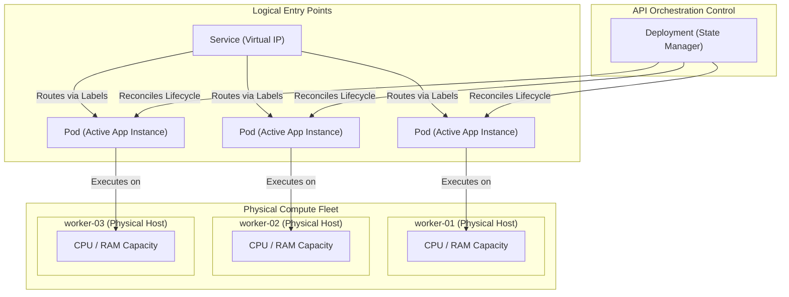
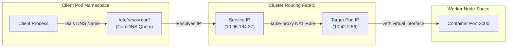

## Table of Contents

1. [The Picture to Keep in Your Head](#the-picture-to-keep-in-your-head)
2. [One Application, Several Objects](#one-application-several-objects)
3. [Nodes](#nodes)
4. [Pods](#pods)
5. [Services](#services)
6. [Labels](#labels)
7. [Capacity](#capacity)
8. [Following One Request](#following-one-request)
9. [Common Wrong Mental Models](#common-wrong-mental-models)
10. [Putting It All Together](#putting-it-all-together)
11. [What's Next](#whats-next)

## The Picture to Keep in Your Head

At its core, a Kubernetes cluster is a group of servers managed through one API.
It is not one giant server, and it does not erase the physical machines underneath it.
Instead, Kubernetes presents the CPU, memory, networking, and storage from multiple servers as one managed runtime pool.
To make that pool manageable, the system divides the responsibilities of running applications among several specialized API resources.

The control plane stores these resources, evaluates configurations, and assigns work.
The worker nodes execute the containerized processes inside Pod wrappers.
The network controllers establish private channels between these workloads.
Finally, Services give external and internal clients a stable entry point to reach moving processes.

We can summarize this coordination sequence in a simple mental path:

- Developers declare the desired application state through API resources.
- The control plane evaluates these resources and chooses the best worker hosts.
- The node agents on those hosts initialize the containers within Pod wrappers.
- The network controllers assign unique, private IP addresses to each Pod.
- Services route client traffic to the active Pods using metadata tags.

Consider the Customer Notification Service that sends SMS alerts and email receipts.
Its cluster architecture connects several logical resources to the physical hardware fleet.



The diagram illustrates how the logical and physical layers remain decoupled.
The Deployment manages the lifecycle of the Pod instances.
The Service handles incoming traffic routing.
Meanwhile, the physical capacity is distributed across distinct worker node servers.

Keep this separation in mind as you learn new Kubernetes nouns.
The API defines how resources relate, and the system works continuously to make those relationships real on the physical hardware.

## One Application, Several Objects

A common question is why Kubernetes requires multiple API objects to run a single service.
A single Docker CLI command can run the Customer Notification Service successfully.
In contrast, Kubernetes introduces Deployments, Pods, Services, and namespaces for the same application.


*A Kubernetes application is usually several objects working together, not one object that contains everything.*


The practical reason is that production operation is not one job.
A Deployment owns replica management, a Pod owns the runtime wrapper, a Service owns stable traffic routing, and a Namespace owns the name boundary.
Example: during a notification API rollout, the Deployment can replace Pods while the Service keeps the same DNS name and the Namespace keeps the production objects separate from staging.

The platform uses this granular design because each object owns a distinct operational job.
By separating these responsibilities, the cluster can change individual components without impacting the entire system.

Consider the jobs owned by each foundational Kubernetes resource:

| API Resource | Conceptual Technical Anchor | Operational Job |
| --- | --- | --- |
| Deployment | *a manager for replaceable stateless Pods* | Controls replica counts and progressive version rollouts |
| Pod | *the smallest Kubernetes wrapper around one or more containers* | Groups containers that share a network address and local volumes |
| Service | *a stable network name and virtual address for changing Pods* | Gives dynamic Pods a persistent DNS name and traffic route |
| Label | *a key-value tag attached to an object* | Identifies target workloads without hardcoding physical names |
| Namespace | *an API name scope inside a cluster* | Separates names and access rules for teams or environments |
| Node | *one physical or virtual server in the cluster* | Provides the CPU, memory, and disk capacity for workloads |

This structural isolation is the reason Kubernetes can perform safe, zero-downtime rolling updates.
During a deployment rollout, the system replaces old Pods with new ones, assigning them fresh private IP addresses.
Because the Service targets Pods using metadata labels rather than fixed IPs, the network routing updates automatically.
Callers continue dialing the same stable Service address without noticing the underlying container shifts.

## Nodes

A node is a single server host machine that belongs to the cluster capacity pool.
It can be a physical bare-metal server, a virtual machine from a cloud provider, or a local VM on a developer's laptop.
It represents the physical boundary where container processes consume actual CPU cycles and memory bytes.
Example: if the notification API Pod runs on `worker-03`, its CPU usage, memory usage, disk reads, and network packets are happening on that specific server.

Every worker node runs two critical system processes to execute workloads:

- **The kubelet agent**: The node representative that listens to the control plane and coordinates container actions.
- **The Container Runtime**: The underlying engine (like containerd) that initializes and stops the actual container processes.

When you query the node fleet, you are auditing the active capacity of the cluster:

```bash
kubectl get nodes
```

The terminal reports the physical membership and ready status of the hosts:

```text
NAME        STATUS   ROLES    AGE   VERSION
worker-01   Ready    <none>   28d   v1.34.2
worker-02   Ready    <none>   28d   v1.34.2
worker-03   Ready    <none>   28d   v1.34.2
```

A status of `Ready` indicates that the host node is reporting healthy communication and has available resources.
If a host reports `NotReady`, it has stopped communicating with the control plane, often due to network failure or hardware crashes.
When a node drops offline, the scheduler automatically evicts its Pods and schedules replacements on healthy servers.

Understanding physical node placement is critical for advanced diagnostics.
If our Customer Notification Service experiences latency spikes only on `worker-03`, the issue is likely a node-specific problem.
The container image is identical across all hosts, suggesting a physical network socket drop or disk bottleneck on that specific server.

You can inspect the active placement of Pods across nodes with the wide output flag:

```bash
kubectl get pods -n notifications-prod -o wide
```

The output reveals the exact host IP address and node name for each Pod instance:

```text
NAME                                READY   STATUS    IP           NODE
notification-api-7c8d9f-a1b2c       1/1     Running   10.42.1.42   worker-01
notification-api-7c8d9f-d3e4f       1/1     Running   10.42.2.56   worker-02
notification-api-7c8d9f-g5h6i       1/1     Running   10.42.3.89   worker-03
```

This mapping translates the logical deployment abstraction back into physical hardware realities.
It allows you to identify host-level hotspots, analyze network pathing, and troubleshoot localized server failures.

## Pods

At its core, a Pod is the smallest unit Kubernetes can schedule onto a node.
It is a wrapper around one or more containers that should run together.
The Pod gives those containers a shared network address, shared local volumes, and shared lifecycle rules.

For a developer, it helps to view a Pod as the logical boundary surrounding a set of tightly coupled containers.
The cluster scheduler does not evaluate raw container images directly.
Instead, it schedules Pods onto host nodes, and the local kubelet agent executes the containers defined inside them.

This architecture enables advanced sidecar deployment patterns.
While a Pod typically runs a single main application container, it can host helper containers next to it.
For example, the main Customer Notification container runs in the same Pod namespace as a local proxy sidecar.
The proxy sidecar intercepts incoming requests, terminates TLS, and forwards traffic to the application over localhost.

Because they share the same network namespace, the containers inside the Pod communicate over `127.0.0.1` at socket speed.
They share the same hostname and port range, meaning two containers in the same Pod cannot bind to the same port.
They can also mount the same local directory volumes to share temporary build files.

Here is a basic, standalone Pod definition for testing:

```yaml
apiVersion: v1
kind: Pod
metadata:
  name: notification-api-test
  namespace: notifications-prod
  labels:
    app: notification-api
spec:
  containers:
    - name: api
      image: ghcr.io/devpolaris/notification-api:1.4.2
      ports:
        - containerPort: 3000
```

The metadata contains labels that connect the Pod to other resources, while the spec defines the container images.
Although you can deploy standalone Pods for testing, production environments manage Pods through high-level controllers.

When troubleshooting, auditing the Pod status is your primary step:

| Pod Status | System Meaning | Core Diagnostic Action |
| --- | --- | --- |
| `Pending` | The Pod is waiting to be scheduled or pull images | Run `kubectl describe pod` to inspect scheduling events |
| `Running` | The Pod has been bound to a node and started containers | Inspect the container logs to verify application startup |
| `CrashLoopBackOff` | The application process started but repeatedly exited | Run `kubectl logs --previous` to read the exit traceback |
| `ImagePullBackOff` | The host node failed to pull the container image | Verify the image name, registry tags, and secret tokens |

The Pod status provides a high-level entry point for debugging.
It signals whether the issue is a scheduling block, an image registry failure, or an application runtime crash.

## Services

Pods are volatile and replaceable.
If a container exceeds its memory limit, the host kernel evicts it, and the cluster creates a replacement.
This replacement Pod receives a new name and a fresh, private IP address.
Clients cannot rely on fixed IP addresses to reach the application.

At its core, a Service is a stable network name and virtual address for a changing set of Pods.
It exists because Pods are replaced often and receive new private IP addresses when they are recreated.
Example: a `notification-svc` Service can keep routing traffic to healthy notification API Pods even while a Deployment replaces old Pods during a rollout.

The Service controller does not copy packets blindly to every Pod name.
Instead, it matches labels to identify target Pods and monitors their readiness health.
Only Pods that pass their active readiness checks are added to the routing table as backend endpoints.

Here is a basic Service manifest for the Customer Notification API:

```yaml
apiVersion: v1
kind: Service
metadata:
  name: notification-svc
  namespace: notifications-prod
spec:
  selector:
    app: notification-api
  ports:
    - name: http
      port: 80
      targetPort: 3000
```

The Service exposes stable port `80` inside the cluster, routing incoming requests to `targetPort: 3000` on the selected Pods.
This port mapping allows client applications to dial `http://notification-svc:80` without managing container-level port changes.

```bash
kubectl get svc notification-svc -n notifications-prod
```

The terminal reports the persistent virtual IP assigned to the Service:

```text
NAME               TYPE        CLUSTER-IP      EXTERNAL-IP   PORT(S)   AGE
notification-svc   ClusterIP   10.96.184.37    <none>        80/TCP    18d
```

The `CLUSTER-IP` is a virtual IP address allocated from the cluster's network range.
It is private to the cluster network fabric and is not routable from the public internet.
External entry points, such as Ingress controllers and Gateway routing rules, manage public ingress traffic.

For our mental model, remember: Pods are volatile; Services provide stable endpoints.

## Labels

Labels are simple key-value metadata tags attached to Kubernetes objects.
They act as the primary glue that connects independent API resources without hardcoding specific resource names.
Deployments use labels to manage Pod lifecycles, and Services use labels to route network traffic.

For the Customer Notification Service, the label pair `app=notification-api` connects our resources:

```bash
kubectl get pods -n notifications-prod --show-labels
```

The terminal displays the metadata tags assigned to the running Pods:

```text
NAME                                READY   STATUS    LABELS
notification-api-7c8d9f-a1b2c       1/1     Running   app=notification-api,pod-template-hash=7c8d9f
notification-api-7c8d9f-d3e4f       1/1     Running   app=notification-api,pod-template-hash=7c8d9f
```

Compare these Pod labels to the Service's selector configurations:

```bash
kubectl get svc notification-svc -n notifications-prod -o jsonpath='{.spec.selector}{"\n"}'
```

The Service is configured to select Pods matching the same metadata tag:

```json
{"app":"notification-api"}
```

These key-value pairs must match exactly.
If the Service selects `app=api` while the Pods are labeled `app=notification-api`, the routing links break.
The Service will exist, but it will have no healthy target backends behind it.

You can verify the active routing endpoints with this command:

```bash
kubectl get endpoints notification-svc -n notifications-prod
```

The output reveals the active private IP addresses of the ready Pods:

```text
NAME               ENDPOINTS                         AGE
notification-svc   10.42.1.42:3000,10.42.2.56:3000   18d
```

An empty endpoints list indicates a label mismatch or a readiness probe failure.
This label-based coupling allows Kubernetes to manage thousands of moving containers dynamically.
The system does not maintain hardcoded target lists; it relies on metadata queries to route traffic.

## Capacity

At its core, cluster capacity is the real CPU and memory available on the worker nodes.
Kubernetes can choose where to place Pods, but it cannot create more CPU cores or RAM than the servers provide.
Example: if every node has only `1Gi` of free memory and a Pod requests `2Gi`, that Pod stays `Pending` until capacity changes.

To prevent resource exhaustion, you must declare the resource needs of your containers:

- **Resource Requests**: The minimum CPU and memory capacity the scheduler must reserve to place a Pod.
- **Resource Limits**: The hard cgroup boundary that restricts a container's active CPU and memory consumption.

Here is a resource configuration block for a container:

```yaml
resources:
  requests:
    cpu: "250m"
    memory: "256Mi"
  limits:
    cpu: "500m"
    memory: "512Mi"
  # Note: 250m represents 250 millicores (a quarter of a CPU core).
  # 256Mi represents 256 Mebibytes of physical RAM.
```

The scheduler reads these requests to choose a node with sufficient unallocated capacity.
If a Pod requests `2Gi` of memory, but no node has `2Gi` of unallocated RAM, the Pod cannot be scheduled.
It remains stuck in a `Pending` state, and the API Server records a scheduling failure:

```text
Warning  FailedScheduling  default-scheduler  0/3 nodes are available: 3 Insufficient memory.
```

This is an important mental model correction for developers.
A `Pending` status is often not a system failure.
Instead, it is the scheduler protecting the active node fleet from resource exhaustion and crashes.

If you declare requests that are too low, the scheduler may place too many Pods on a single node.
If those containers spike to their limits, the host node will experience resource exhaustion.
If you declare requests that are too high, physical capacity sits unused, increasing your infrastructure costs.
Finding the correct balance is critical for operational stability.

## Following One Request

A request path is the route one network request takes from a client process to the application container that handles it.
Tracing that path shows why Services, DNS, Pod IPs, node routing, and virtual interfaces are separate parts of the same system.
Example: an internal database reporting service can call `http://notification-svc`, and Kubernetes resolves that name to one healthy notification API Pod even if the Pods have moved since the caller last made a request.


*A request follows a stable Service contract even while the pods behind it stay replaceable.*




The diagram traces the path of a network packet from the client process to the target container.
A packet is a small chunk of data traveling across the network, such as part of an HTTP request to the notification API:

- The client process dials the DNS hostname: `http://notification-svc`.
- The client container queries the cluster's internal CoreDNS resolver using its local `/etc/resolv.conf` rules.
- CoreDNS resolves the hostname to the stable virtual Service IP: `10.96.184.37`.
- The packet is sent to the Service IP.
- The host node's `kube-proxy` process intercepts the packet. It uses local iptables or IPVS rules to perform destination NAT (DNAT).
- Kube-proxy translates the virtual Service IP into the private IP address of a healthy target Pod: `10.42.2.56`.
- The packet is routed across the cluster network to the target worker node.
- The node passes the packet through the virtual interface (`veth`) into the Pod's network namespace.
- The application container process receives the packet on TCP port `3000`.

This request flow highlights how each component is responsible for a specific part of the network path.
DNS handles name resolution, the Service manages the virtual target mapping, kube-proxy performs NAT translations, and the Pod namespace delivers the packet to the container.

## Common Wrong Mental Models

Wrong mental models are assumptions that make a Kubernetes symptom look like the wrong kind of problem.
They matter because the fix for a failed Deployment depends on whether the issue is a node, Pod, Service, label, or capacity problem.
Example: if you think a Service broadcasts traffic to every Pod, an empty endpoint list may look like a load balancer failure instead of a selector or readiness problem.

Many developers bring assumptions from traditional virtualization or local Docker setups to Kubernetes.
Correcting these early prevents common architectural mistakes:

- **"A cluster is just one large server"**: Although the API presents a single interface, applications still run on discrete servers. Node boundaries, network latencies, and physical host failures still impact your design.
- **"A Pod is identical to a container"**: A Pod is a shared runtime wrapper. It configures shared IP addresses, volumes, and lifecycle policies around one or more containers.
- **"Services copy traffic to all replicas"**: A Service acts as a load-balancing router, not a broadcaster. It forwards each client request to a single target Pod using its endpoint mapping.
- **"Resource limits are only advice"**: Limits are strictly enforced by the host Linux kernel. Exceeding memory limits results in an immediate container process termination (OOMKilled).

Understanding these distinctions allows you to troubleshoot issues effectively.
When a deployment fails, you can isolate whether the problem is a scheduling block, a network routing failure, or a container process crash.

## Putting It All Together

A Kubernetes cluster abstracts a group of physical servers into a unified, managed compute fabric.
The control plane processes configuration manifests, and the worker nodes run the actual applications inside Pod wrappers.
Pods isolate and execute containers, while Services provide stable DNS entry points for dynamic workloads.
Metadata labels connect these resources, and physical node capacity limits overall scalability.

For our Customer Notification Service, this architecture forms a reliable execution chain:

- The Deployment manages the lifecycles and scales of the Pods.
- The Pods wrap the application containers with shared namespaces on worker nodes.
- The Service provides a stable DNS name and load-balances client traffic.
- Key-value labels define the operational relationships between these resources.
- Capacity limits ensure workloads are only scheduled where physical resources are available.

Keeping this mental model in mind simplifies cluster operations.
When you evaluate new Kubernetes features, map them back to these foundational components.

## What's Next

In the next article, we will go deeper into the control plane.
We will explore `etcd`, `kube-apiserver`, the scheduler, and controllers, checking how they coordinate to execute these resources.


*Keep this cluster picture in mind: nodes provide capacity, pods run work, services route requests, and labels connect the pieces.*

---

**References**

- [Kubernetes Architecture](https://kubernetes.io/docs/concepts/architecture/) - Official overview of cluster topologies, nodes, and control processes.
- [Pod Lifecycle](https://kubernetes.io/docs/concepts/workloads/pods/pod-lifecycle/) - Reference of Pod states, container statuses, and event logs.
- [Service Routing](https://kubernetes.io/docs/concepts/services-networking/service/) - Detailed guide on ClusterIP virtual networking and load balancing.
- [Labels and Selectors](https://kubernetes.io/docs/concepts/overview/working-with-objects/labels/) - Official documentation on metadata tagging and resource mapping.
- [Manage Compute Resources](https://kubernetes.io/docs/concepts/configuration/manage-resources-containers/) - Systems-level reference for resource requests, limits, and cgroups.
