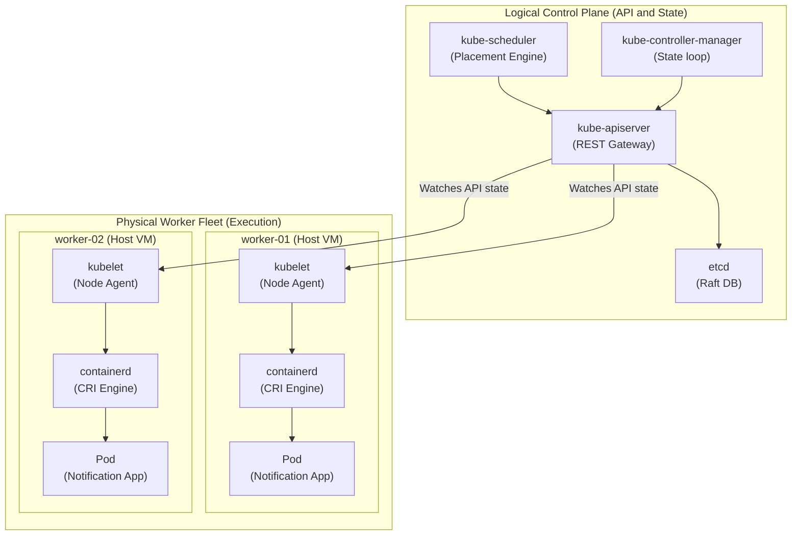

## Table of Contents

1. [Two Kinds of Work](#two-kinds-of-work)
2. [From Request to Running Pod](#from-request-to-running-pod)
3. [The API Server](#the-api-server)
4. [etcd](#etcd)
5. [The Scheduler](#the-scheduler)
6. [Controllers](#controllers)
7. [The Kubelet](#the-kubelet)
8. [The Container Runtime](#the-container-runtime)
9. [Cluster Networking Components](#cluster-networking-components)
10. [Managed Kubernetes](#managed-kubernetes)
11. [Putting It All Together](#putting-it-all-together)
12. [What's Next](#whats-next)

## Two Kinds of Work

At its core, a Kubernetes cluster has two kinds of work: deciding what should happen and running the containers.
The control plane is the API and coordination layer that stores requests, checks permissions, and makes placement decisions.
Worker nodes are the physical or virtual servers that provide CPU, memory, disks, and network interfaces for Pods.


*The control plane records and decides. Worker nodes do the local container-running work.*


This structural split is critical for operational stability.
The control plane processes API requests, validates manifests, monitors health, and schedules workloads.
The worker nodes provide the actual CPU cores, RAM bytes, and network interfaces to run the application containers.
If a worker node crashes, the control plane remains unaffected.
It immediately detects the loss and schedules replacement container workloads on the remaining healthy nodes.

To understand this split, consider our Customer Notification Service.
This service is packaged as a container image that listens on port `3000` to send transactional SMS alerts.
When you deploy this service, you communicate entirely with the control plane.
The control plane processes your request, stores the configuration, and assigns the workload to worker nodes.
The worker nodes then initialize the containers, establish network routing, and host the active processes.



The diagram outlines the core architectural boundaries of the cluster.
All configuration requests pass through the control plane components.
Once a workload is assigned, the local node agent on each worker host coordinates container startup.

This division of labor changes how you troubleshoot cluster failures.
If your command-line commands fail to connect, you have a control plane connectivity problem.
If your commands succeed but the Pods remain pending, the scheduler or physical capacity is the bottleneck.
If the Pods are scheduled but fail to start due to registry errors, the node-side runtime is the root cause.

## From Request to Running Pod

At its core, deploying a Pod is a chain of handoffs between control-plane components and node-side components.
A handoff means one component records or observes a small piece of work, then another component reacts to it.
Example: the API Server stores a Deployment, the scheduler chooses a node for each Pod, and the kubelet on that node starts the containers.
For the notification API, that means a single `kubectl apply` request becomes several separate system actions before any user traffic reaches port `3000`.


*A pod appears only after the request is accepted, recorded, scheduled, and acted on by a kubelet.*


- **api-server**: Accepts the request, validates the schema, and authorizes the caller.
- **etcd**: Persists the validated configuration in the cluster's backing database.
- **controller-manager**: Detects the new deployment and creates the lower-level Pod resources.
- **scheduler**: Evaluates node capacity and binds the Pods to healthy worker hosts.
- **kubelet**: Detects the local Pod assignments, mounts disks, and calls containerd.
- **containerd**: Pulls the container images and starts the application processes.
- **CNI plugin**: Allocates unique IP addresses and creates virtual switches.

This execution path provides a clear diagnostic roadmap.
You do not need to memorize every binary parameter.
Instead, ask which handoff your request has reached.
A schema validation error indicates the request failed at the api-server.
A `Pending` status indicates the scheduler cannot place the Pod.
An `ErrImagePull` warning indicates the request reached the node, but containerd failed to fetch the image.

## The API Server

At its core, the API Server is the secure HTTP entry point for the cluster.
Developers running commands, CI/CD pipelines, and internal controllers all communicate through this API.
The API Server binary is named `kube-apiserver`.
It exposes a secure REST API over HTTPS, serving as the single entry point for cluster administration.

The API Server executes a strict, multi-stage processing pipeline for every incoming request:

- **Authentication**: Verifies the identity of the caller using TLS certificates or bearer tokens.
- **Authorization**: Checks whether the caller has permission to perform the action using RBAC rules.
- **Admission Control**: Intercepts the request using mutating and validating webhooks to enforce policies.
- **Schema Validation**: Ensures the submitted manifest matches the required Kubernetes resource schemas.
- **Persistence**: Writes the validated resource configurations to etcd.

This centralized intercept design is critical for security.
In a shared production cluster, multiple teams and pipelines are continuously updating resources.
The API Server ensures that every change is authenticated, authorized, and audited before it becomes desired state.

Here is a basic standalone Pod configuration manifest that the API Server would process:

```yaml
apiVersion: v1
kind: Pod
metadata:
  name: notification-api-test
  namespace: notifications-prod
spec:
  containers:
    - name: api
      image: ghcr.io/devpolaris/notification-api:1.4.2
      ports:
        - containerPort: 3000
```

When you apply this manifest, the API Server processes the request:

```bash
kubectl apply -f pod.yaml
```

The terminal reports that the resource has been accepted:

```text
pod/notification-api-test created
```

This output confirms that the manifest passed authentication, authorization, and schema validation.
It does not mean the application container is running on a server.
It means the API Server accepted the resource and wrote it to persistent storage.
Other cluster components must now coordinate to execute it.

## etcd

At its core, etcd is the small database where Kubernetes stores cluster objects.
A key-value store saves records under keys, similar to storing a resource path and its JSON data together.
etcd holds the desired configurations and observed statuses of every resource in the cluster.
The API Server is the only component allowed to communicate directly with etcd.
All other components query and update state by sending REST requests to the API Server.

Example: when you create the `notification-api` Deployment, etcd stores the Deployment spec, and later stores status updates reported by controllers and kubelets.

etcd uses the Raft consensus algorithm to maintain database consistency across multiple control plane nodes:

- A cluster typically runs three or five etcd replicas to tolerate node crashes.
- One node acts as the active leader, processing all state changes.
- The leader writes transactions to a local write-ahead log (WAL) and replicates them to followers.
- A transaction is only confirmed as committed after a quorum of replicas acknowledge the write.
- If the leader crashes, the remaining nodes hold a rapid election to select a new leader.

etcd is not an application database.
Our Customer Notification Service still uses its own database (like PostgreSQL) to store SMS transaction logs.
etcd is strictly reserved for cluster configuration state and telemetry metadata.

If etcd experiences an outage or loses quorum in a self-managed cluster, the control plane stops working.
Existing container processes on worker nodes will continue running, but the API Server will reject all writes.
You cannot deploy new applications, scale workloads, or delete resources until etcd recovers.
This is why regular etcd backups are a non-negotiable requirement for operational safety.

## The Scheduler

At its core, scheduling means choosing which node should run a Pod.
It does not mean calendar scheduling, cron execution, or timed jobs.
The scheduler binary is named `kube-scheduler`.
It runs as a continuous loop, watching for newly created Pods that have no assigned node name in their spec.

Example: if a notification API Pod requests `512Mi` of memory, the scheduler filters out nodes that do not have enough unallocated memory before it chooses a host.

To select the best worker host for a Pod, the scheduler executes a two-phase evaluation matrix:

1.  **Filtering (Predicates)**:
    - The scheduler evaluates a set of hard constraints called predicates to eliminate unsuitable hosts.
    - It filters out nodes that lack sufficient unallocated CPU or memory capacity.
    - It eliminates nodes that suffer disk-pressure, memory-pressure, or network outages.
    - It checks taints and affinity rules to ensure the Pod is allowed to run on the node.
2.  **Scoring (Priorities)**:
    - The scheduler runs the remaining healthy nodes through a priority scoring matrix.
    - It prioritizes spreading replicas of the same application across different host racks and zones.
    - It scores nodes based on image locality (favoring nodes that already have the required image cached).
    - The node that scores the highest is selected, and its name is written to the Pod's `spec.nodeName` field.

Once scheduled, you can verify the node assignment from your terminal:

```bash
kubectl get pod notification-api-test -n notifications-prod -o wide
```

The output reveals the active worker node placement:

```text
NAME                     READY   STATUS    IP           NODE
notification-api-test    1/1     Running   10.42.2.19   worker-02
```

If a Pod remains stuck in a `Pending` status with no node assigned, you must inspect the scheduling events:

```bash
kubectl describe pod notification-api-test -n notifications-prod
```

The scheduler records its failure details in the event log:

```text
Warning  FailedScheduling  default-scheduler  0/3 nodes are available: 2 Insufficient memory, 1 node(s) had untolerated taint {maintenance: planned}.
```

This event explains why the Pod is blocked.
The scheduler could not find a node that satisfied the Pod's CPU and memory requests.
No containers have started because the Pod was never bound to a node.
You must add node capacity or adjust your resource requests to resolve the block.

## Controllers

At its core, a controller is a background process that watches API objects and makes follow-up changes.
Reconciliation is the repeated act of comparing the requested configuration with the observed state, then fixing the difference.
The control plane runs many controller loops inside a single binary named `kube-controller-manager`.
Every resource type (Deployments, ReplicaSets, StatefulSets, Services) is managed by a dedicated controller loop.

Controllers operate by watching the API Server for state changes and updating resources:

- The developer updates a Deployment manifest, requesting four replicas instead of three.
- The Deployment controller detects this change and updates the matching ReplicaSet spec.
- The ReplicaSet controller detects the scale mismatch (current: 3, desired: 4).
- It immediately submits a request to the API Server to create a fourth Pod resource.
- The scheduler detects the unassigned Pod and binds it to a healthy node.
- Kubelet and containerd start the container, and the node agent updates the Pod status.
- The ReplicaSet controller reads the updated status and reports that the replica count matches the spec.

This decoupled, event-driven loop design ensures high system resiliency.
Each controller manages a small, focused task, using the central API Server to read desired intent and write observed telemetry.

You can audit these controller operations by reading the event logs of a Deployment:

```bash
kubectl describe deployment notification-api -n notifications-prod
```

The output documents the scaling actions performed by the controllers:

```text
Events:
  Type    Reason             From                   Message
  ----    ------             ----                   -------
  Normal  ScalingReplicaSet  deployment-controller  Scaled up replica set notification-api-7c8d9f to 3
```

The `From` column identifies the controller that executed the step.
`deployment-controller` confirms that the control plane processed your manifest and managed the ReplicaSet scale.

## The Kubelet

At its core, the kubelet is the local Kubernetes agent on each worker node.
An agent is a process that runs on a machine and carries out instructions for a larger system.
It registers the host server with the API Server, sends regular node status heartbeats, and executes workloads.

Example: after the scheduler assigns `notification-api-test` to `worker-02`, the kubelet on `worker-02` pulls the image, mounts volumes, starts the container, and reports status back to the API Server.

The kubelet runs as a native system service (like a systemd daemon) directly on the host operating system.
It does not run inside a container.
It continuously queries the API Server for Pods assigned to its node, executing the actions required to run them:

- It interacts with the local container runtime to pull images and initialize containers.
- It mounts local storage volumes and decrypts Secrets into volatile memory paths.
- It executes HTTP, TCP, or command-line health checks (readiness and liveness probes).
- It monitors container resource usage, reporting metrics and statuses back to the API Server.

When a container crashes, the kubelet immediately detects the process drop.
It reads the Pod's restart policy, waits for a back-off cooldown window, and restarts the container.
This local recovery loop guarantees that crashed application processes are restored without control plane intervention.

If a Pod fails to start, the node agent records the failure in the Pod's events:

```text
Warning  FailedMount  kubelet  configmap "notification-api-settings" not found
Warning  Failed       kubelet  Failed to pull image "ghcr.io/devpolaris/notification-api:1.4.3": not found
```

These warnings pinpoint where the node agent got blocked.
The first indicates a configuration mount error, while the second indicates an image registry pull failure.
The container process has not started because the kubelet was blocked from preparing the runtime environment.

## The Container Runtime

At its core, the container runtime is the node-side engine that pulls images and starts container processes.
Kubernetes uses the Container Runtime Interface (CRI) to decouple the kubelet from specific runtime implementations.
The CRI defines a standard gRPC API over a local UNIX socket.
containerd and CRI-O are the most common OCI-compliant runtimes in production clusters.

The kubelet communicates with containerd using this gRPC interface:

- The kubelet sends an RPC request to pull a specific container image.
- containerd pulls the image from the registry and extracts the layers onto local storage.
- The kubelet sends an RPC request to initialize the container process namespace.
- containerd calls low-level OCI engines (like runC) to configure Linux cgroups and namespaces.
- runC executes the container process, and containerd monitors the active PID.

This interface ensures that Kubernetes remains runtime-agnostic.
Whether the node uses containerd, CRI-O, or virtualized microVM runtimes, the kubelet executes workloads using the same standard commands.

If containerd fails to pull an image or start a process, the Pod status reports the runtime block:

```bash
kubectl get pods -n notifications-prod
```

The status column indicates that containerd cannot initialize the runtime environment:

```text
NAME                                READY   STATUS             RESTARTS   AGE
notification-api-test               0/1     ImagePullBackOff   0          7m
```

The container process has not executed.
The failure occurred at the runtime layer, indicating you must fix the image tag or pull secrets.

## Cluster Networking Components

At its core, Kubernetes networking gives each Pod a private IP address that other Pods can reach.
This exists so application containers can communicate across nodes without knowing which physical server each Pod uses.
Example: a payment worker on `worker-01` can call a notification API Pod on `worker-03` through a Service name, even though the packet eventually crosses host networking, virtual interfaces, and kernel routing rules.
Every Pod is allocated a unique, cluster-routable IP address.
Pods must be able to communicate with all other Pods without using network address translation (NAT).

This model is implemented by three cooperative networking components:

1.  **The CNI Plugin**:
    - The Container Network Interface (CNI) standardizes how network plugins configure container interfaces.
    - Calico, Cilium, and Flannel are common CNI plugins.
    - When a Pod is scheduled, the CNI plugin creates a virtual ethernet pair (`veth`).
    - It binds one interface inside the Pod's network namespace and the other to the host's virtual switch.
    - It assigns a unique IP address to the Pod and updates the host's routing tables.
2.  **kube-proxy**:
    - Every worker node runs a network utility process named `kube-proxy`.
    - It watches for Service and Endpoint objects via the API Server.
    - When a Service is created, `kube-proxy` configures iptables or IPVS rules on the local host kernel.
    - These rules perform destination NAT (DNAT) to route Service IP requests to ready Pod IPs.
3.  **CoreDNS**:
    - Runs as a cluster-internal DNS directory service.
    - Automatically resolves Service names to their virtual ClusterIP addresses.

You can audit these networking targets by inspecting Service endpoints:

```bash
kubectl get endpoints notification-svc -n notifications-prod
```

The output lists the active private IP addresses allocated by the CNI plugin:

```text
NAME               ENDPOINTS                         AGE
notification-svc   10.42.1.42:3000,10.42.2.56:3000   18d
```

These endpoints prove that the CNI plugin successfully configured the virtual network interfaces.
It confirms that the CNI plugin routed traffic from the Service to the container ports.

## Managed Kubernetes

At its core, managed Kubernetes means the cloud provider operates the control plane for you.
Services like AWS EKS, Azure AKS, and Google GKE manage the API Server, etcd quorums, scheduler, and controller managers.
They guarantee high availability and manage control plane upgrades automatically.

Example: in AKS, your team still deploys the notification API and manages its Services, RBAC, probes, and resource requests, but Azure operates the control plane machines.

However, your engineering team still owns significant operational responsibilities:

| Responsibility | Self-Managed Cluster | Managed Cloud Cluster |
| --- | --- | --- |
| API Server Scalability | Your team tunes and scales control nodes | Cloud provider scales nodes automatically |
| etcd Database Quorums | Your team manages backups and Raft consensus | Cloud provider manages snapshots and replication |
| Worker Node Pools | Your team provisions, patches, and monitors hosts | Your team configures scale bounds and node sizes |
| RBAC Access Rules | Your team configures users and permissions | Your team configures users and permissions |
| Workload Manifests | Your team deploys and manages application specs | Your team deploys and manages application specs |
| Observability & Debugging | Your team troubleshoots Pod and application logs | Your team troubleshoots Pod and application logs |

Managed services eliminate database maintenance and server patching, but they do not eliminate application operations.
When a deployment rollout stalls or a Pod remains pending, you must trace the same execution pipeline:
API Server validation, controller scheduling, node agent startup, network routing, and application health.

## Putting It All Together

We began with a simple split: the control plane coordinates the cluster, while worker nodes run the actual applications.
The API Server acts as the secure REST gateway, storing cluster configurations inside etcd.
The scheduler selects healthy worker hosts based on capacity, and controllers run background loops to maintain desired state.
On each worker node, the kubelet agent watches for assigned workloads, using containerd over CRI sockets to start container processes.
Finally, CNI plugins and `kube-proxy` configure virtual network interfaces and route Service traffic.

For our Customer Notification Service, this cooperative architecture executes in a reliable pipeline:

- `kubectl` sends your Deployment manifest to the `kube-apiserver` HTTPS endpoint.
- The api-server validates the schema and writes the resource configuration to `etcd`.
- The `deployment-controller` loop reads `etcd` and creates the required ReplicaSet.
- The `kube-scheduler` filters out overloaded nodes and scores `worker-02` as the best host for Pod `notification-api-test`.
- The `kubelet` agent on `worker-02` detects the assignment via watch APIs.
- The kubelet calls `containerd` over UNIX gRPC sockets to pull the image and start the container process.
- The CNI plugin configures the virtual network namespace and allocates IP `10.42.2.19`.
- `kube-proxy` configures local node `iptables` rules to route Service traffic to the Pod.

Understanding this architecture provides you with a clear troubleshooting model.
You can isolate failures by tracing the handoff chain from logical API validation to physical node execution.

## What's Next

In the next article, we will focus on namespaces and `kubectl` configurations.
We will explore the essential command-line tools and environments required to manage these API resources safely.


*Use this split to debug clusters: control-plane components decide what should happen, and worker components make it happen on nodes.*

---

**References**

- [Kubernetes Components](https://kubernetes.io/docs/concepts/overview/components/) - Official guide on control plane binaries, worker daemons, and plugins.
- [etcd Consensus](https://etcd.io/docs/current/learning/consensus/) - Technical documentation on Raft quorums and WAL transactions.
- [kube-scheduler Algorithms](https://kubernetes.io/docs/concepts/scheduling-eviction/kube-scheduler/) - Systems-level reference for node filtering predicates and priority scoring.
- [CRI Specifications](https://kubernetes.io/docs/concepts/architecture/cri/) - Official reference for the Container Runtime Interface and containerd UNIX sockets.
- [Cluster Networking Model](https://kubernetes.io/docs/concepts/cluster-administration/networking/) - Systems guide on CNI standards, virtual ethernet interfaces, and kube-proxy NAT.
