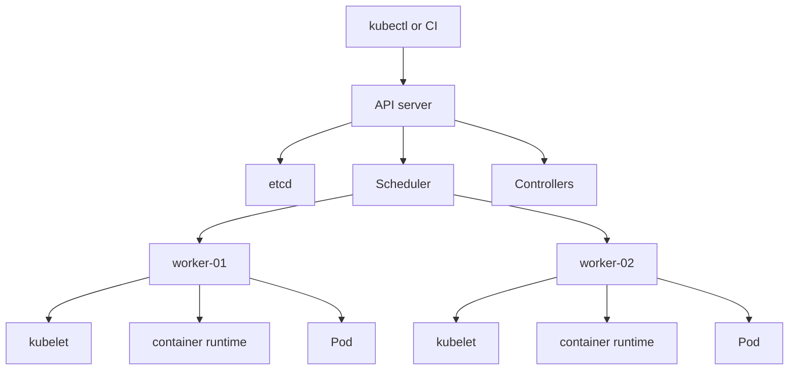
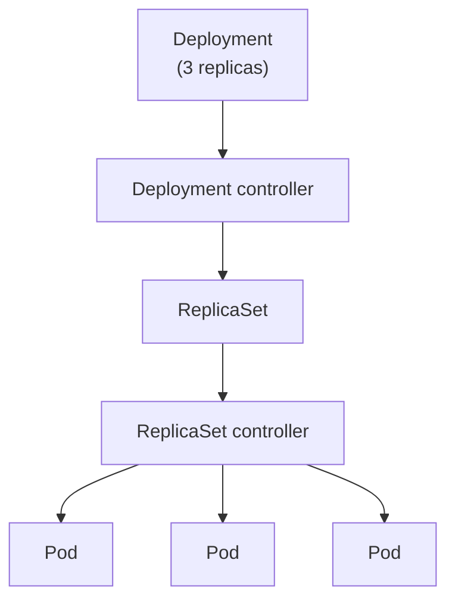
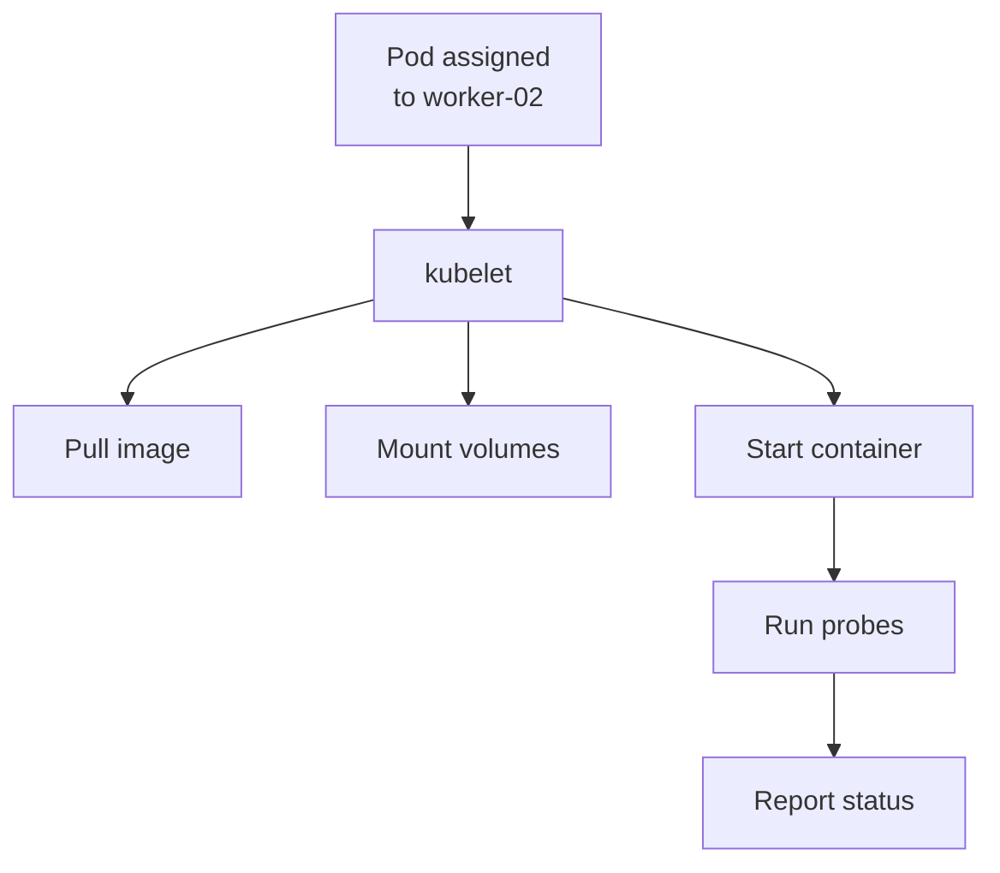

## Table of Contents

1. [Two Kinds of Work](#two-kinds-of-work)
2. [From Request to Running Pod](#from-request-to-running-pod)
3. [The API Server](#the-api-server)
4. [etcd](#etcd)
5. [The Scheduler](#the-scheduler)
6. [Controllers](#controllers)
7. [The Kubelet](#the-kubelet)
8. [The Container Runtime](#the-container-runtime)
9. [Cluster Networking Components](#cluster-networking-components)
10. [Managed Kubernetes](#managed-kubernetes)
11. [Putting It All Together](#putting-it-all-together)
12. [What's Next](#whats-next)

## Two Kinds of Work

The previous article built the cluster picture: API objects describe the application, Pods run on nodes, Services route to ready Pods, and labels connect related objects. This article opens the cluster and looks at the components that make that picture work.

A Kubernetes cluster has two broad kinds of work.

The control plane coordinates the cluster. It is the part you talk to when you use `kubectl` or when CI applies a manifest. It accepts API requests, stores objects, watches for changes, makes scheduling decisions, and runs controllers that move the cluster toward desired state.

Worker nodes run the application Pods. Each node has a local agent, a container runtime, and networking pieces that let Pods start and communicate.



For `devpolaris-api`, customer traffic goes to application Pods through Services and ingress paths. The control plane coordinates those Pods. It is the place where desired state is accepted, stored, watched, and reported.

This split is useful during debugging. If `kubectl` cannot reach the API server, you have a control plane access problem. If the API accepts a Deployment but Pods remain Pending, the scheduler or capacity is closer to the issue. If a Pod is assigned to a node but cannot pull an image, the node-side path is closer.

## From Request to Running Pod

The component names make more sense if you follow one Deployment request. Imagine CI applies a manifest that asks Kubernetes to run three copies of `devpolaris-api`.

The path is not one giant operation. It is a series of handoffs:

| Step | Component | Plain job |
| --- | --- | --- |
| Accept the request | API server | Check and store the Deployment object |
| Store cluster data | etcd | Persist the objects and status the API server manages |
| Notice desired state | Controllers | Create lower-level objects needed by the Deployment |
| Choose machines | Scheduler | Assign each new Pod to a suitable node |
| Start containers | Kubelet and runtime | Pull images, create containers, and report status |
| Connect traffic | Networking components | Give Pods addresses and route Service traffic |

This sequence is the useful mental model. You do not have to memorize every binary name first. Start by asking which handoff the request has reached. A validation error means the API server rejected the object. A Pending Pod with no node means scheduling has not succeeded. An image pull error means the request reached a node, but the node could not start the container.

## The API Server

The API server is the front door of the Kubernetes control plane. `kubectl`, CI systems, dashboards, controllers, and operators all send requests to it.

For a beginner, the API server's job is easier to understand as a sequence. It receives a request, confirms who is making the request, checks whether that caller is allowed to do it, validates the object, runs admission rules if the cluster has them, and stores the accepted object.

Those checks matter because Kubernetes is shared. A production cluster may have many teams and automation systems talking to the same API. The API server is where the cluster can reject malformed objects and enforce access rules before a bad request becomes desired state.

When you apply a Deployment, the API server is the first component that matters:

```bash
$ kubectl apply -f deployment.yaml
deployment.apps/devpolaris-api configured
```

That output means the request reached the API server and the object was accepted. It does not mean the application is running. Other components still need to react.

The API server can also reject the request before it becomes cluster state:

```bash
$ kubectl apply -f deployment.yaml
error: error validating "deployment.yaml": error validating data: ValidationError(Deployment.spec): missing required field "selector"
```

This error is still early in the path. The object shape is invalid, so there is no useful Pod to inspect yet. Fix the manifest before reading node events or application logs.

Because the API server is the normal entry point, direct changes on worker nodes should be rare. If someone SSHes to a node and starts a container by hand, Kubernetes does not manage that container as part of a Deployment. The API server stores Kubernetes objects, and the rest of the cluster works from those objects.

## etcd

etcd is the distributed key-value store where Kubernetes persists API data. It is the control plane's backing store. The API server writes objects and status into etcd. Deployments, Pods, Services, ConfigMaps, Secrets, Leases, and many other records live there as API data.

etcd is not your application database. `devpolaris-api` still uses its own database for product data, users, courses, or orders. etcd stores Kubernetes cluster state: the objects that describe what should run and the status Kubernetes reports about those objects.

Most application developers do not talk to etcd directly. In managed Kubernetes, the cloud provider usually operates the control plane storage. The important idea is that cluster state is stored centrally through the API server rather than scattered across worker nodes.

That design has a serious operational consequence. If etcd is unhealthy in a self-managed cluster, the control plane may be unable to reliably create, update, or read objects. Existing containers on worker nodes may continue running for a while, but the cluster cannot safely coordinate new desired state.

```text
Healthy path:
  kubectl -> API server -> etcd

If etcd is unhealthy:
  New API writes may fail
  Rollouts may stop
  Controllers may lose reliable state
```

This is why etcd backup matters in self-managed clusters. Backing up a worker node disk is not the same as backing up Kubernetes state. The API data that defines the cluster lives in etcd.

## The Scheduler

In Kubernetes, scheduling means choosing a node for a Pod. The word is about placement, not time or cron.

The scheduler watches for Pods that have no assigned node. Its job is to choose a suitable node based on resource requests, node health, taints, affinity rules, topology constraints, and other scheduling inputs. After it chooses, it records the node assignment through the API server.

For `devpolaris-api`, a new rollout may create a Pod with a request for `250m` CPU and `256Mi` memory. The scheduler finds a node with enough available capacity and assigns the Pod there.

```bash
$ kubectl get pod devpolaris-api-6d8f7d9f8c-h6p8d -n devpolaris-prod -o wide
NAME                              READY   STATUS    IP           NODE
devpolaris-api-6d8f7d9f8c-h6p8d   1/1     Running   10.42.2.19   worker-02
```

The `NODE` column shows that scheduling happened. If a Pod is still Pending with no node, read the scheduling events:

```text
Warning  FailedScheduling  default-scheduler  0/3 nodes are available: 2 Insufficient cpu, 1 node(s) had untolerated taint {maintenance: planned}.
```

That event tells you the application has not reached the node startup phase. The image has not been pulled. The container has not started. The scheduler could not place the Pod.

This separation prevents wasted work. You do not read container logs for a Pod that was never assigned to a node.

## Controllers

Controllers are loops that watch API objects and take action when current state differs from desired state. Kubernetes includes many built-in controllers. The Deployment controller watches Deployments. The ReplicaSet controller watches ReplicaSets. The Job controller watches Jobs. The Node controller watches node health.

Controllers work through the API server. A Deployment controller does not run your container directly. It creates or updates ReplicaSets. ReplicaSets create or delete Pods. The scheduler and kubelets handle later steps.

That indirect design is the first controller detail to understand. A controller usually changes Kubernetes objects, then other components react to those objects. The Deployment controller does not need to know which node will run the container. It needs to make sure the right ReplicaSet and Pod objects exist for the requested Deployment state.

For `devpolaris-api`, the chain looks like this:



This layered behavior is why a rollout has several visible objects. You may start by editing a Deployment, but the running work appears as Pods created through ReplicaSets. The handoff is normal. It is how Kubernetes breaks a large operating task into smaller control loops.

You can see controller activity in events:

```bash
$ kubectl describe deployment devpolaris-api -n devpolaris-prod
Events:
  Type    Reason             From                   Message
  ----    ------             ----                   -------
  Normal  ScalingReplicaSet  deployment-controller  Scaled up replica set devpolaris-api-75c9444bd7 to 3
```

The `From` column names the component that reported the event. When the event comes from `deployment-controller`, you are reading a control plane report. When it comes from `kubelet`, you are reading a node-side report.

## The Kubelet

The kubelet is the node agent. It runs on each worker node and watches for Pods assigned to that node. If the control plane is the coordinating side of Kubernetes, the kubelet is the local worker that makes assigned Pods happen on one machine.

It asks the container runtime to pull images and start containers, mounts volumes, runs probes, reports Pod status, and sends node heartbeats.

When the scheduler assigns a Pod to `worker-02`, the kubelet on `worker-02` becomes responsible for making that Pod real.



Node-side failures usually appear in Pod events. These examples point to different parts of the kubelet's work:

```text
Warning  FailedMount    kubelet  configmap "devpolaris-api-config" not found
Warning  Failed         kubelet  Failed to pull image "ghcr.io/devpolaris/api:1.4.3": not found
Warning  Unhealthy      kubelet  Readiness probe failed: HTTP probe failed with statuscode: 500
```

The kubelet did not make the same mistake in all three cases. The first is missing mounted configuration. The second is image pull failure. The third is an application readiness failure after the container started. Reading the event reason and message matters.

## The Container Runtime

The container runtime starts and manages containers on the node. Kubernetes uses the Container Runtime Interface, often called CRI, to work with runtimes such as containerd and CRI-O. The kubelet tells the runtime what container to run, and the runtime pulls images, creates containers, and reports container state.

You usually notice the runtime boundary when image or container startup fails. If the image tag does not exist, the runtime cannot pull it. If the image exists but the command exits immediately, Kubernetes can report the exit, but the problem may be inside the application or image.

This is the closest part of Kubernetes to the container runtime you already know from Docker. The difference is ownership. In Kubernetes, the kubelet asks the runtime to start containers because a Pod was assigned to the node through the API. The runtime is doing container work, but Kubernetes owns the Pod lifecycle around it.

```bash
$ kubectl get pods -n devpolaris-prod -l app=devpolaris-api
NAME                              READY   STATUS             RESTARTS   AGE
devpolaris-api-75c9444bd7-j9vhw   0/1     ImagePullBackOff   0          7m
```

The status says the Pod reached a node, but the container image could not be pulled successfully. `describe pod` gives the specific registry or tag message.

Container runtime details usually stay behind Kubernetes abstractions for application teams. Still, the boundary matters because a Pod can fail before application code runs. In that case, application logs may be empty, and events are the better evidence.

## Cluster Networking Components

Kubernetes also needs networking components so Pods can receive IP addresses and Services can route traffic. Without this layer, a node could start containers, but workloads would not have the cluster networking behavior that Kubernetes promises.

Most clusters use a network plugin that implements the Container Network Interface, often called CNI. Many clusters also use kube-proxy or another dataplane component to make Service routing work.

The exact implementation varies by cluster. A local kind cluster, a managed cloud cluster, and a cluster using Cilium or Calico may implement the dataplane differently. The beginner model stays the same: Pods get network identity, Services route to selected ready Pods, and network components make that possible on the nodes.

You can often see Service routing from the Kubernetes API:

```bash
$ kubectl get endpoints devpolaris-api -n devpolaris-prod
NAME             ENDPOINTS                         AGE
devpolaris-api   10.42.1.21:3000,10.42.2.19:3000   18d
```

If endpoints are empty, the Service has no ready selected Pods. If endpoints exist but traffic still fails, the next layer may be DNS, Service routing, network policy, ingress, or the application itself. The networking module will cover those details later.

## Managed Kubernetes

Managed Kubernetes services such as EKS, AKS, and GKE run much of the control plane for you. The provider usually operates the API server and etcd. Your team still manages worker node pools, add-ons, namespaces, RBAC, workload manifests, application rollouts, and workload troubleshooting.

The component model remains the same:

| Component area | Self-managed cluster | Managed cluster |
| --- | --- | --- |
| API server | Your team operates it | Provider usually operates it |
| etcd | Your team backs it up and restores it | Provider usually manages it |
| Worker nodes | Your team manages them | Your team manages them, often with provider tooling |
| Workload objects | Your team owns them | Your team owns them |
| Application health | Your team owns it | Your team owns it |

Managed Kubernetes reduces a large amount of control plane work. It does not remove the need to understand what the control plane does. When a rollout is stuck, the same handoff still applies: API object, controller, scheduler, kubelet, runtime, network, application.

## Putting It All Together

When you apply a Deployment for `devpolaris-api`, several components act in sequence:

1. `kubectl` sends the request to the API server.
2. The API server validates and stores the object in etcd.
3. Controllers notice the Deployment and create lower-level objects.
4. The scheduler assigns new Pods to suitable nodes.
5. The kubelet on each selected node starts the containers through the runtime.
6. Networking components give Pods and Services their network behavior.
7. Status and events flow back through the API.

That sequence gives you a practical debugging map. Ask where the work stopped. A validation error points at the API request. A Pending Pod with no node points at scheduling. An image pull error points at node-side startup and the registry. A readiness failure points at the application or its dependencies.

Kubernetes has many objects, but the core path is steady: request, store, watch, schedule, run, report.

## What's Next

The next article focuses on desired state and reconciliation. You have seen the components. Now you will follow the loop they create: specs describe what should happen, status reports what happened, and controllers keep comparing the two.

---

**References**

- [Kubernetes Components](https://kubernetes.io/docs/concepts/overview/components/) - Official overview of control plane components, node components, and add-ons.
- [Nodes](https://kubernetes.io/docs/concepts/architecture/nodes/) - Official documentation for node behavior, status, heartbeats, and node controllers.
- [Controllers](https://kubernetes.io/docs/concepts/architecture/controller/) - Official explanation of controller loops and desired state.
- [Container Runtime Interface](https://kubernetes.io/docs/concepts/architecture/cri/) - Official page describing Kubernetes container runtime integration.
- [Cluster Networking](https://kubernetes.io/docs/concepts/cluster-administration/networking/) - Official overview of the Kubernetes networking model.
