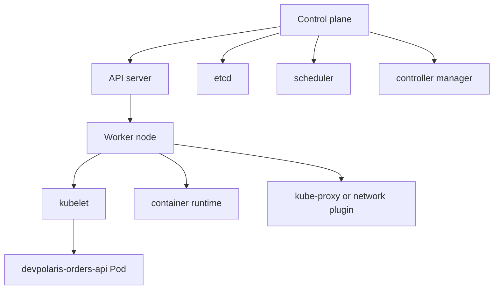

## Table of Contents

1. [Two Jobs in One Cluster](#two-jobs-in-one-cluster)
2. [The API Server Is the Front Door](#the-api-server-is-the-front-door)
3. [etcd Stores Cluster State](#etcd-stores-cluster-state)
4. [The Scheduler Chooses a Node](#the-scheduler-chooses-a-node)
5. [Controllers Keep Watching](#controllers-keep-watching)
6. [The Kubelet Runs Work on Each Node](#the-kubelet-runs-work-on-each-node)
7. [Networking and the Container Runtime](#networking-and-the-container-runtime)
8. [Managed Kubernetes Changes the Work, Not the Model](#managed-kubernetes-changes-the-work-not-the-model)
9. [Failure Mode: The Control Plane Accepts the Object, but No Pod Runs](#failure-mode-the-control-plane-accepts-the-object-but-no-pod-runs)
10. [A Component-Level Diagnostic Path](#a-component-level-diagnostic-path)

## Two Jobs in One Cluster

A Kubernetes cluster has two broad jobs. One job is deciding what should happen: accept API requests, store objects, schedule Pods, and run controllers. That side is the control plane. The other job is running the actual application containers. That side is the worker nodes.

For `devpolaris-orders-api`, the control plane does not process customer orders. It stores a Deployment that says the API should have three replicas, decides where Pods should go, and records status. The worker nodes pull the image, start the containers, attach networking, and report whether the Pods are healthy.



This separation helps you debug. If `kubectl get deployments` works, the API server is reachable. If the Deployment exists but the Pod is `Pending`, the scheduler or capacity is the next place to inspect. If the Pod is scheduled but cannot start, the kubelet, image registry, volume, or container runtime is closer to the failure.

## The API Server Is the Front Door

The API server exposes the Kubernetes API. When you run `kubectl`, apply YAML from CI, or use a dashboard, the request goes to the API server. The API server authenticates the caller, checks authorization, validates the object, runs admission steps if configured, and stores accepted state.

That front-door role is why direct node changes are usually the wrong operating habit. If you SSH to `worker-02` and start a container by hand, Kubernetes does not own that container as part of the desired state. The kubelet manages Pods that come through Kubernetes, not random containers someone started during an incident.

The API server also gives the cluster one place to enforce access rules. A developer might be allowed to read Pods in `orders-prod` but only update Deployments in `orders-staging`. A CI service account might be allowed to patch one Deployment but not read every Secret in the cluster. Those boundaries depend on all normal changes going through the API.

```bash
$ kubectl cluster-info
Kubernetes control plane is running at https://prod-k8s-api.devpolaris.example
CoreDNS is running at https://prod-k8s-api.devpolaris.example/api/v1/namespaces/kube-system/services/kube-dns:dns/proxy
```

This command checks whether your `kubectl` context can reach the API server and discover cluster services. It does not prove every node is healthy. It only confirms the front door is reachable from your machine.

A normal object request also goes through this front door:

```bash
$ kubectl apply -f deployment.yaml
deployment.apps/devpolaris-orders-api configured
```

That output means the API server accepted the object. It does not mean the rollout succeeded. The next step is to watch status, because other components must still act on the object.

You can see the same split when a request is rejected before it becomes desired state:

```bash
$ kubectl apply -f deployment.yaml
error: error validating "deployment.yaml": error validating data: ValidationError(Deployment.spec): missing required field "selector" in io.k8s.api.apps.v1.DeploymentSpec
```

This failure never reached scheduling or kubelet startup. The API client and server-side validation rejected the object shape. Fix the manifest before looking at Pods, because no Pod should exist for this request.

## etcd Stores Cluster State

etcd is the distributed key-value store used by Kubernetes to store API server data. You can think of it as the cluster's durable database. Deployments, Pods, Services, ConfigMaps, Secrets, Lease objects, and status data are stored through the API server into etcd.

Most application developers do not interact with etcd directly. In managed Kubernetes, the provider usually operates it for you. The important beginner idea is that Kubernetes state is not hidden in a random file on each worker node. The API server stores cluster objects in a consistent backing store so controllers can watch and react to changes.

The design has an operational consequence. If etcd is unhealthy, the control plane can become unable to create, update, or reliably read objects. Existing containers may keep running on worker nodes for a while, but the cluster cannot coordinate new desired state correctly.

```text
Symptom:
  kubectl apply hangs or returns storage errors

Likely layer:
  API server to etcd path

Application effect:
  Existing Pods may still serve traffic, but rollouts and repairs are unsafe
```

For a beginner, the action is usually not "log into etcd and fix it." The action is to recognize the layer. In a managed cluster, open the provider health page or platform runbook. In a self-managed cluster, follow the control plane backup and recovery procedure, because etcd data is the cluster's source of truth.

This is also why etcd backups matter in self-managed clusters. Backing up a worker node disk is not the same as backing up cluster state. The desired objects, identities, and status history that the API server uses live in etcd. Losing that data can leave running containers behind without the control plane state needed to manage them correctly.

## The Scheduler Chooses a Node

The scheduler watches for Pods that do not yet have a node assigned. Its job is to choose a suitable node based on constraints, available resources, taints, affinity rules, and other scheduling signals. Once the scheduler chooses, it records the node assignment through the API.

For `devpolaris-orders-api`, a normal rollout might create a new Pod. The scheduler sees that Pod, checks that it requests `250m` CPU and `256Mi` memory, then places it on `worker-02` because the node has enough allocatable capacity.

```bash
$ kubectl get pod devpolaris-orders-api-6d8f7d9f8c-h6p8d -n orders-prod -o wide
NAME                                     READY   STATUS    RESTARTS   AGE   IP           NODE
devpolaris-orders-api-6d8f7d9f8c-h6p8d   1/1     Running   0          42m   10.42.2.19   worker-02
```

Scheduling is not the same as running. Once the Pod has a `NODE`, the scheduler's main decision is done. If the Pod later fails to pull an image, crashes, or fails a readiness probe, the problem has moved to the node execution path or the application configuration.

When a Pod cannot be scheduled, the scheduler writes events:

```text
Warning  FailedScheduling  default-scheduler  0/3 nodes are available: 2 Insufficient cpu, 1 node(s) had untolerated taint {maintenance: planned}.
```

That message is valuable because it separates capacity and placement constraints from app startup. You should not read application logs for a Pod that has never been assigned to a node.

A useful shorthand is to look for the `NODE` column. If it is empty, the scheduler has not placed the Pod. If it has a node, the next failure is probably in node-side preparation or application startup.

```bash
$ kubectl get pods -n orders-prod -o wide
NAME                                     STATUS    NODE
devpolaris-orders-api-55b7f957c8-k8v4p   Pending   <none>
```

`<none>` here is not a networking problem. It means the Pod has not been assigned to a worker node yet.

## Controllers Keep Watching

Controllers are loops that watch cluster state and make changes to bring current state closer to desired state. The Deployment controller watches Deployments and ReplicaSets. The ReplicaSet controller makes sure the right number of Pods exist. The Node controller watches node health. Other controllers handle Jobs, endpoints, namespaces, service accounts, and more.

The important design choice is that controllers work through the API server. The Deployment controller does not SSH to a node and run your container. It updates Kubernetes objects. The scheduler, kubelet, and other components then observe those objects and do their own part.

```text
Deployment spec:
  replicas: 3

ReplicaSet current state:
  2 matching Pods

Controller action:
  Create 1 more Pod object through the API server
```

This layered behavior can feel indirect at first, but it makes the system extensible. A custom controller can watch a custom resource and create ordinary Kubernetes objects. A cloud controller can notice a Service and create a cloud load balancer. The shared API is the handoff point.

For `devpolaris-orders-api`, this means a rollout is not one big command. It is a series of object updates and controller reactions. That is why `kubectl rollout status` can report progress instead of merely saying that a command finished.

## The Kubelet Runs Work on Each Node

The kubelet is the node agent. It watches for Pods assigned to its node, asks the container runtime to start containers, mounts volumes, runs health checks, reports status, and sends node heartbeats. If the control plane is the coordinator, the kubelet is the local worker that turns Pod specs into running processes.

When a Pod is assigned to `worker-02`, the kubelet on `worker-02` becomes responsible for making that Pod run. It pulls the image, prepares the Pod sandbox, starts the container, and updates Pod status through the API server.

```text
Pod assigned to worker-02
  |
  v
kubelet on worker-02
  |
  v
container runtime pulls ghcr.io/devpolaris/orders-api:1.4.2
  |
  v
container starts and readiness probe runs
```

If the kubelet cannot do its job, the failure usually appears in Pod events. `ErrImagePull`, `ImagePullBackOff`, `CreateContainerConfigError`, and volume mount errors all point toward node-side preparation rather than scheduling.

```bash
$ kubectl describe pod devpolaris-orders-api-7bb7f99d9f-pv5ng -n orders-prod
Events:
  Type     Reason                  From     Message
  ----     ------                  ----     -------
  Warning  FailedMount             kubelet  MountVolume.SetUp failed for volume "config": configmap "orders-api-config" not found
  Warning  FailedCreatePodSandBox  kubelet  Failed to create pod sandbox: rpc error: network plugin not ready
```

Read the `From` column. When it says `kubelet`, you are looking at a node agent report. The fix might be application configuration, missing Kubernetes objects, node networking, or container runtime health. The event tells you which layer to inspect next.

## Networking and the Container Runtime

The container runtime is the software that runs containers on the node. Kubernetes uses the Container Runtime Interface, often shortened to CRI, so runtimes such as containerd and CRI-O can provide container execution. The kubelet asks the runtime to pull images and start containers.

Networking is handled by cluster networking components. Many clusters use a network plugin that implements the Container Network Interface, often shortened to CNI. The plugin gives Pods IP addresses and sets up routing so Pods can communicate according to the cluster's network model. kube-proxy or an equivalent dataplane also helps Services route traffic to selected Pods.

For a beginner, the most useful point is that Pod startup can fail before your application code runs. If the image cannot be pulled, the runtime boundary failed. If the network plugin is not ready, the Pod sandbox may not be created. If a Service has no endpoints, the selector or readiness state is more likely than the container runtime.

```bash
$ kubectl get endpoints devpolaris-orders-api -n orders-prod
NAME                    ENDPOINTS                            AGE
devpolaris-orders-api   10.42.1.21:3000,10.42.2.19:3000      18d
```

Endpoints show the Pod IPs currently backing a Service. If the Service exists but `ENDPOINTS` is empty, traffic has no selected ready Pods to reach. That is a different failure from an API server outage or a node that cannot pull an image.

## Managed Kubernetes Changes the Work, Not the Model

Managed Kubernetes services run much of the control plane for you. On EKS, AKS, GKE, and similar services, the provider usually operates the API server and etcd. You still create clusters, configure networking, manage node pools, install add-ons, set RBAC, define workloads, and respond to application failures.

This is an important tradeoff. Managed Kubernetes removes a large amount of control plane maintenance, especially etcd backup and API server availability. It does not remove the need to understand the control plane. Your `kubectl` requests still go to an API server. Pods still land on nodes. Kubelets still run containers. Controllers still reconcile objects.

| Responsibility | Self-managed cluster | Managed cluster |
|----------------|----------------------|-----------------|
| API server uptime | Your team | Provider shared service |
| etcd backup and recovery | Your team | Usually provider managed |
| Worker node health | Your team | Your team, often with provider tooling |
| Workload YAML and rollouts | Your team | Your team |
| App logs and readiness | Your team | Your team |

The managed model is often the right choice. It lets a small platform team focus on workload operations and cluster configuration instead of running every control plane process. The mental model remains the same, which is why fundamentals still matter.

## Failure Mode: The Control Plane Accepts the Object, but No Pod Runs

A confusing first failure looks like this: `kubectl apply` succeeds, but the application never becomes available. The API server accepted the Deployment object, but later components could not complete the work.

```bash
$ kubectl apply -f deployment.yaml
deployment.apps/devpolaris-orders-api configured

$ kubectl rollout status deployment/devpolaris-orders-api -n orders-prod
Waiting for deployment "devpolaris-orders-api" rollout to finish: 0 of 3 updated replicas are available...
```

Do not stop at the apply output. Move to Deployment status:

```bash
$ kubectl describe deployment devpolaris-orders-api -n orders-prod
Conditions:
  Type           Status  Reason
  ----           ------  ------
  Available      False   MinimumReplicasUnavailable
  Progressing    False   ProgressDeadlineExceeded

Events:
  Type     Reason             From                   Message
  ----     ------             ----                   -------
  Normal   ScalingReplicaSet  deployment-controller  Scaled up replica set devpolaris-orders-api-55b7f957c8 to 3
```

The Deployment controller created a ReplicaSet. Now inspect the Pods:

```bash
$ kubectl get pods -n orders-prod -l app=devpolaris-orders-api
NAME                                     READY   STATUS                       RESTARTS   AGE
devpolaris-orders-api-55b7f957c8-4xw9n   0/1     CreateContainerConfigError   0          9m
devpolaris-orders-api-55b7f957c8-k8v4p   0/1     CreateContainerConfigError   0          9m
devpolaris-orders-api-55b7f957c8-zx2j7   0/1     CreateContainerConfigError   0          9m
```

That status tells you the scheduler probably placed the Pods, but the kubelet could not build the container configuration. The next `describe pod` might show a missing Secret or ConfigMap. The fix is to create the missing object or correct the reference, then let the controller retry.

## A Component-Level Diagnostic Path

A useful diagnostic path follows the component handoff. First check whether you can reach the API server. Then check whether the desired object exists. Then check whether controllers created lower-level objects. Then check whether the scheduler assigned Pods. Then check kubelet events and application logs.

```bash
$ kubectl cluster-info
$ kubectl get deployment devpolaris-orders-api -n orders-prod
$ kubectl get rs -n orders-prod -l app=devpolaris-orders-api
$ kubectl get pods -n orders-prod -l app=devpolaris-orders-api -o wide
$ kubectl describe pod <pod-name> -n orders-prod
$ kubectl logs <pod-name> -n orders-prod --previous
```

The order matters because each command answers a different layer question. API reachability comes first. Desired object next. Controller-created objects next. Scheduler placement next. Node-side startup and application logs last.

For `devpolaris-orders-api`, a teammate might report "Kubernetes is down" because the API is returning 503 to users. The diagnostic path turns that into better questions: is the control plane reachable, are the Pods running, are endpoints populated, are readiness probes failing, and are application logs showing a database error? Kubernetes gives you many places to look, so the habit is to follow the handoff rather than jump to the loudest symptom.

You can summarize the handoff as a small map:

| If this is broken | Inspect first | Why |
|-------------------|---------------|-----|
| `kubectl` cannot connect | Context, network, API server | No API request is reaching the front door |
| Deployment exists but no Pods | Deployment and ReplicaSet events | A controller may be blocked |
| Pod has no node | Scheduler events | Placement has not happened |
| Pod has node but will not start | Pod events from kubelet | Node-side startup is failing |
| Pod is running but traffic fails | Readiness, Service endpoints, app logs | Application or routing is now the likely layer |

The table is not a replacement for deeper debugging. It is a way to avoid mixing layers when the first symptom is vague.

For `devpolaris-orders-api`, this map often turns a broad incident report into one concrete owner. If the API server is unavailable, the platform team follows the cluster runbook. If only the new Pods fail readiness, the service team inspects the app change. If the Service has no endpoints because labels do not match, the fix belongs in the manifest review.

```text
Good incident handoff:
  Layer: kubelet on worker-02
  Evidence: Pod event says image pull failed with not found
  Service impact: rollout stuck, old Pods still serving
  Next owner: release engineer verifies CI image tag
```

The goal is not to assign blame. It is to name the layer clearly enough that the next person can act without repeating the whole investigation.

---

**References**

- [Kubernetes Components](https://kubernetes.io/docs/concepts/overview/components/) - Official overview of the API server, etcd, scheduler, controllers, kubelet, kube-proxy, and runtime components.
- [Cluster Architecture](https://kubernetes.io/docs/concepts/architecture/) - Official architecture page that explains control plane, node components, and add-ons.
- [Nodes](https://kubernetes.io/docs/concepts/architecture/nodes/) - Official node documentation covering node status, heartbeats, and node controller behavior.
- [The kubectl Command-Line Tool](https://kubernetes.io/docs/concepts/overview/kubectl/) - Official overview of how kubectl communicates with the control plane through the Kubernetes API.
