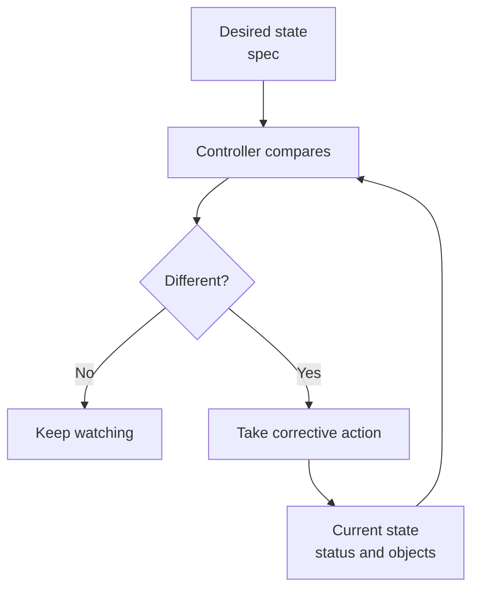

## Table of Contents

1. [The Cluster Keeps Comparing](#the-cluster-keeps-comparing)
2. [Spec Is the Request, Status Is the Report](#spec-is-the-request-status-is-the-report)
3. [Reconciliation Is a Loop](#reconciliation-is-a-loop)
4. [A Deployment as Desired State](#a-deployment-as-desired-state)
5. [Events Tell the Story Between Spec and Status](#events-tell-the-story-between-spec-and-status)
6. [Rollouts Are Reconciliation in Motion](#rollouts-are-reconciliation-in-motion)
7. [Drift and Manual Changes](#drift-and-manual-changes)
8. [Failure Mode: Reconciliation Repeats a Bad Request](#failure-mode-reconciliation-repeats-a-bad-request)
9. [How to Read the Loop During Incidents](#how-to-read-the-loop-during-incidents)

## The Cluster Keeps Comparing

Most command-line tools do one thing and stop. You run `npm test`, it passes or fails, and the command exits. Kubernetes works differently. You submit desired state, and the cluster keeps comparing that desired state with current state while the system runs.

Desired state means the condition you want Kubernetes to maintain. For `devpolaris-orders-api`, desired state might be "run three ready Pods from image `ghcr.io/devpolaris/orders-api:1.4.2` in the `orders-prod` namespace." Current state is what the cluster can observe right now: maybe three Pods are ready, maybe one is crashing, maybe none can be scheduled.

Reconciliation is the process of moving current state closer to desired state. A controller watches objects, notices differences, and takes the next useful action. It may create a Pod, delete an old ReplicaSet, update status, or ask another system to do work.



This loop is the heart of Kubernetes. It is also the source of many beginner surprises. If your desired state is wrong, Kubernetes will faithfully keep trying to make the wrong thing happen.

## Spec Is the Request, Status Is the Report

Most Kubernetes objects have a `spec` field and a `status` field. The `spec` field is the request. It describes what you want. The `status` field is the report. It describes what Kubernetes observed after trying to act on the request.

For a Deployment, `spec.replicas` says how many Pods the Deployment should maintain. `status.readyReplicas` says how many are currently ready. These two fields should usually move toward the same number, but they are not the same kind of truth.

```bash
$ kubectl get deployment devpolaris-orders-api -n orders-prod -o yaml
apiVersion: apps/v1
kind: Deployment
metadata:
  name: devpolaris-orders-api
spec:
  replicas: 3
status:
  availableReplicas: 3
  readyReplicas: 3
  updatedReplicas: 3
```

The YAML above is shortened. It shows the shape that matters first: the spec is what the team requested, and the status is what the cluster reports. When troubleshooting, do not only ask "what does the YAML say?" Ask "what does status say happened after Kubernetes tried?"

The distinction is similar to a pull request. The PR title says what the author intends. The CI check status says what the system observed. You need both before deciding whether the change is safe.

You can make that split visible with a compact command:

```bash
$ kubectl get deployment devpolaris-orders-api -n orders-prod \
  -o custom-columns=NAME:.metadata.name,DESIRED:.spec.replicas,READY:.status.readyReplicas,AVAILABLE:.status.availableReplicas
NAME                    DESIRED   READY   AVAILABLE
devpolaris-orders-api   3         3       3
```

This output is useful because it avoids reading a long YAML document when the first question is simple. Did the status catch up with the request?

## Reconciliation Is a Loop

A reconciliation loop does not need perfect global knowledge. It needs a current observation, a desired target, and a next action. The Deployment controller does not run containers itself. It creates or updates ReplicaSets. ReplicaSets create or delete Pods. The scheduler assigns Pods to nodes. Kubelets start containers and report status.

That chain lets Kubernetes split a large operating problem into smaller loops. Each loop owns part of the work and reports back through the API. The result is a system where several controllers can cooperate without one giant coordinator knowing every detail.

```text
Deployment controller:
  Watches Deployment
  Creates or updates ReplicaSet

ReplicaSet controller:
  Watches ReplicaSet
  Creates or deletes Pods

Scheduler:
  Watches unscheduled Pods
  Assigns each Pod to a node

Kubelet:
  Watches Pods assigned to its node
  Starts containers and reports status
```

The tradeoff is that a failure may be several steps away from the object you edited. You might apply a Deployment successfully, but the scheduler cannot place the Pods. You might schedule Pods successfully, but the kubelet cannot mount a Secret. Reconciliation helps repair the system, but diagnosis still requires following the handoff.

## A Deployment as Desired State

Here is a small Deployment for `devpolaris-orders-api`. Later workload articles will cover every field more carefully. For now, focus on what the object asks Kubernetes to maintain.

```yaml
apiVersion: apps/v1
kind: Deployment
metadata:
  name: devpolaris-orders-api
  namespace: orders-prod
spec:
  replicas: 3
  selector:
    matchLabels:
      app: devpolaris-orders-api
  template:
    metadata:
      labels:
        app: devpolaris-orders-api
    spec:
      containers:
        - name: api
          image: ghcr.io/devpolaris/orders-api:1.4.2
          ports:
            - containerPort: 3000
          readinessProbe:
            httpGet:
              path: /healthz
              port: 3000
```

This object asks for three Pods from the given template. The template is the pattern used to create Pods. The readiness probe tells Kubernetes how to decide whether a Pod should receive traffic. A Pod can be running but not ready, which is common when the process has started but cannot serve requests yet.

After applying the object, the useful question is not "did apply succeed?" It is "did the cluster converge on the desired state?"

```bash
$ kubectl get deployment devpolaris-orders-api -n orders-prod
NAME                    READY   UP-TO-DATE   AVAILABLE   AGE
devpolaris-orders-api   3/3     3            3           22m
```

`READY 3/3` means three desired replicas and three ready replicas. That is a compact sign that the reconciliation loop reached the state you asked for.

## Events Tell the Story Between Spec and Status

Events are short records that Kubernetes attaches to objects when something meaningful happens. They are not full logs, but they often explain why status is stuck. When a Pod cannot be scheduled, cannot pull an image, or cannot mount a volume, events are usually the fastest clue.

```bash
$ kubectl describe pod devpolaris-orders-api-6d8f7d9f8c-xr4mf -n orders-prod
Events:
  Type    Reason     Age   From               Message
  ----    ------     ----  ----               -------
  Normal  Scheduled  4m    default-scheduler  Successfully assigned orders-prod/devpolaris-orders-api-6d8f7d9f8c-xr4mf to worker-03
  Normal  Pulling    4m    kubelet            Pulling image "ghcr.io/devpolaris/orders-api:1.4.2"
  Normal  Pulled     3m    kubelet            Successfully pulled image
  Normal  Created    3m    kubelet            Created container api
  Normal  Started    3m    kubelet            Started container api
```

This healthy event chain shows several components doing their part. The scheduler assigned the Pod. The kubelet pulled the image. The container was created and started. If the Pod still is not ready after these events, the next thing to inspect is usually the readiness probe or application logs.

Events are especially useful because they point to the component that reported the issue. `default-scheduler` points at placement. `kubelet` points at node-side startup. A controller name points at a higher-level reconciliation step.

## Rollouts Are Reconciliation in Motion

A rollout is what happens when you change the Pod template of a Deployment. Updating the image from `1.4.2` to `1.4.3` changes desired state. The Deployment controller creates a new ReplicaSet for the new template and gradually shifts replicas from the old ReplicaSet to the new one.

```bash
$ kubectl set image deployment/devpolaris-orders-api api=ghcr.io/devpolaris/orders-api:1.4.3 -n orders-prod
deployment.apps/devpolaris-orders-api image updated

$ kubectl rollout status deployment/devpolaris-orders-api -n orders-prod
Waiting for deployment "devpolaris-orders-api" rollout to finish: 1 of 3 updated replicas are available...
deployment "devpolaris-orders-api" successfully rolled out
```

The command is a shortcut for changing the Deployment spec. The deeper idea is that Kubernetes does not replace every Pod at once by default. It reconciles toward the new template while trying to keep enough available replicas.

You can see the old and new ReplicaSets during a rollout:

```bash
$ kubectl get rs -n orders-prod -l app=devpolaris-orders-api
NAME                               DESIRED   CURRENT   READY   AGE
devpolaris-orders-api-6d8f7d9f8c   0         0         0       18d
devpolaris-orders-api-75c9444bd7   3         3         3       4m
```

This output is useful during diagnosis because it tells you whether Kubernetes is stuck on old Pods, new Pods, or readiness for the new version.

## Drift and Manual Changes

Drift means current reality differs from the desired state. In Kubernetes, drift can happen when someone manually deletes a Pod, scales a Deployment with a direct command, or changes an object outside the usual Git workflow. Some drift is repaired automatically. Some drift becomes the new desired state because the API object itself was changed.

If someone deletes one Pod from the `devpolaris-orders-api` Deployment, the ReplicaSet controller creates another Pod because the desired replica count still says three.

```bash
$ kubectl delete pod devpolaris-orders-api-75c9444bd7-p8x2m -n orders-prod
pod "devpolaris-orders-api-75c9444bd7-p8x2m" deleted

$ kubectl get pods -n orders-prod -l app=devpolaris-orders-api
NAME                                     READY   STATUS              AGE
devpolaris-orders-api-75c9444bd7-4sjkg   1/1     Running             18m
devpolaris-orders-api-75c9444bd7-h6p8d   1/1     Running             18m
devpolaris-orders-api-75c9444bd7-vc2mb   0/1     ContainerCreating   9s
```

That is repair. But if someone runs `kubectl scale deployment devpolaris-orders-api --replicas=1`, they changed the Deployment spec. Kubernetes now believes desired state is one replica. A GitOps or CI system may later change it back, but Kubernetes itself will follow the latest accepted spec.

This is why teams usually connect production clusters to reviewed manifests. The cluster reconciles whatever desired state it receives. Human process and automation decide whether that desired state is trustworthy.

You can see the difference between repair and a changed request by checking the live spec after a manual scale:

```bash
$ kubectl scale deployment devpolaris-orders-api --replicas=1 -n orders-prod
deployment.apps/devpolaris-orders-api scaled

$ kubectl get deployment devpolaris-orders-api -n orders-prod -o jsonpath='{.spec.replicas}{"\n"}'
1
```

The cluster is not drifting from desired state here. The desired state was changed. That is why production teams care about who can update objects and which automation is allowed to restore the reviewed version.

## Failure Mode: Reconciliation Repeats a Bad Request

Reconciliation is useful only when the desired state is correct. If the Deployment references an image tag that does not exist, Kubernetes keeps creating Pods that cannot pull the image. The repeated attempt is not a bug. It is the system trying to satisfy an impossible request.

```bash
$ kubectl get deployment devpolaris-orders-api -n orders-prod
NAME                    READY   UP-TO-DATE   AVAILABLE   AGE
devpolaris-orders-api   2/3     1            2           18d

$ kubectl get pods -n orders-prod -l app=devpolaris-orders-api
NAME                                     READY   STATUS             AGE
devpolaris-orders-api-6d8f7d9f8c-2k9sl   1/1     Running            3h
devpolaris-orders-api-6d8f7d9f8c-h6p8d   1/1     Running            3h
devpolaris-orders-api-75c9444bd7-j9vhw   0/1     ImagePullBackOff   7m
```

The Deployment is partly available because old Pods are still serving. The new desired image is blocked. `describe pod` gives the reason:

```bash
$ kubectl describe pod devpolaris-orders-api-75c9444bd7-j9vhw -n orders-prod
Events:
  Type     Reason   From     Message
  ----     ------   ----     -------
  Warning  Failed   kubelet  Failed to pull image "ghcr.io/devpolaris/orders-api:1.4.30": not found
  Warning  BackOff  kubelet  Back-off pulling image "ghcr.io/devpolaris/orders-api:1.4.30"
```

The fix direction is to correct the image reference or push the missing image. If production should stay on the previous version, roll back the Deployment. If `1.4.30` was intended, inspect the CI job that should have published it and verify the registry tag exists.

```bash
$ kubectl rollout undo deployment/devpolaris-orders-api -n orders-prod
deployment.apps/devpolaris-orders-api rolled back
```

The lesson is not that rollbacks are always the answer. The lesson is that reconciliation will keep pressing on the desired state you gave it. During an incident, fix the desired state first, then let the loop work.

## How to Read the Loop During Incidents

During an incident, separate the question into three parts. What did we ask Kubernetes to maintain? What does Kubernetes report right now? Which event or log line explains the gap?

```bash
$ kubectl get deployment devpolaris-orders-api -n orders-prod
$ kubectl describe deployment devpolaris-orders-api -n orders-prod
$ kubectl get pods -n orders-prod -l app=devpolaris-orders-api
$ kubectl describe pod <pod-name> -n orders-prod
$ kubectl logs <pod-name> -n orders-prod --previous
```

This path avoids random changes. If the Deployment spec is wrong, correct the spec. If the spec is right but scheduling fails, inspect capacity or constraints. If the Pod starts but readiness fails, inspect the readiness endpoint and application logs. If the Service has no endpoints, check labels and readiness.

For `devpolaris-orders-api`, a useful incident note might read like this:

```text
Intent:
  Deployment should run 3 replicas of ghcr.io/devpolaris/orders-api:1.4.3.

Current status:
  2 old Pods ready, 1 new Pod in ImagePullBackOff.

Evidence:
  Pod event says image tag 1.4.3 was not found in GHCR.

Decision:
  Roll back to 1.4.2, then fix CI image publishing before retrying.
```

That note connects spec, status, evidence, and decision. It is the operating shape Kubernetes wants you to learn.

One final habit helps during longer incidents: write down the rollout revision you inspected. Kubernetes objects can change while you are debugging. If a teammate applies another manifest, your earlier status snapshot may describe an older desired state.

```bash
$ kubectl rollout history deployment/devpolaris-orders-api -n orders-prod
deployment.apps/devpolaris-orders-api
REVISION  CHANGE-CAUSE
12        image orders-api:1.4.2
13        image orders-api:1.4.3
```

Rollout history does not replace Git history or CI records, but it gives you a cluster-side clue about which Deployment revisions Kubernetes knows about. During a rollback discussion, that clue can keep the team from guessing which version is currently being reconciled.

---

**References**

- [Controllers](https://kubernetes.io/docs/concepts/architecture/controller/) - Official explanation of control loops, desired state, and current state.
- [Deployments](https://kubernetes.io/docs/concepts/workloads/controllers/deployment/) - Official documentation for Deployment desired state, rollout behavior, and status.
- [Kubernetes Objects](https://kubernetes.io/docs/concepts/abstractions/overview/) - Official object model overview, including specs and Kubernetes resources.
- [kubectl Reference](https://kubernetes.io/docs/reference/kubectl/generated/) - Official command reference for inspecting, applying, rolling out, and diagnosing Kubernetes objects.
