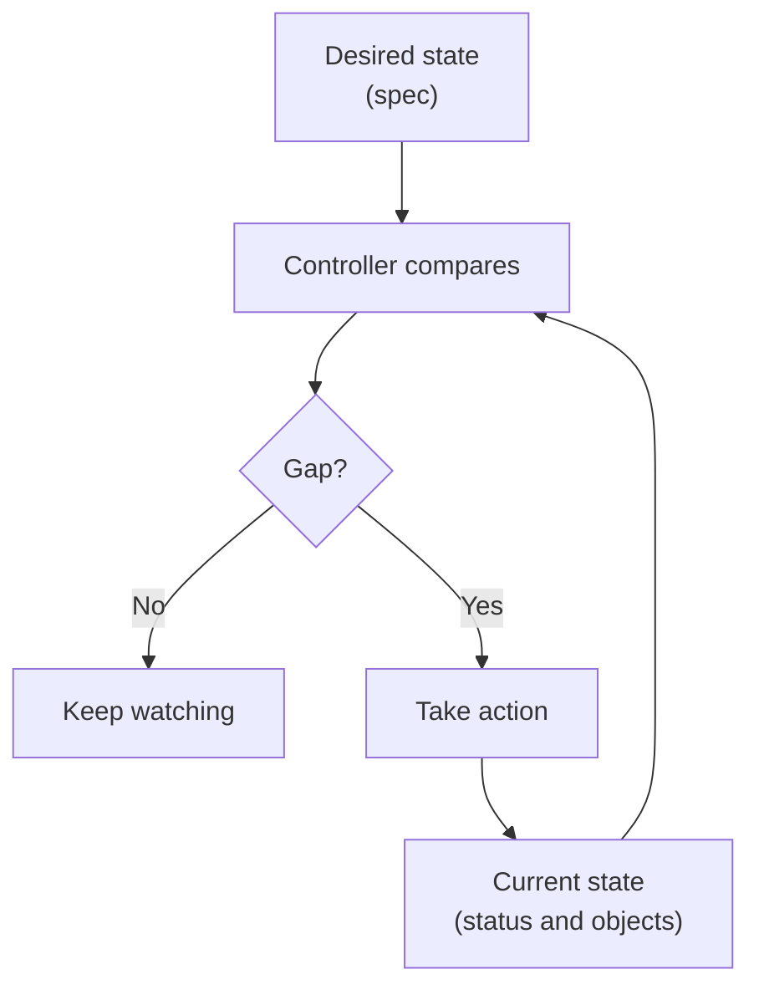
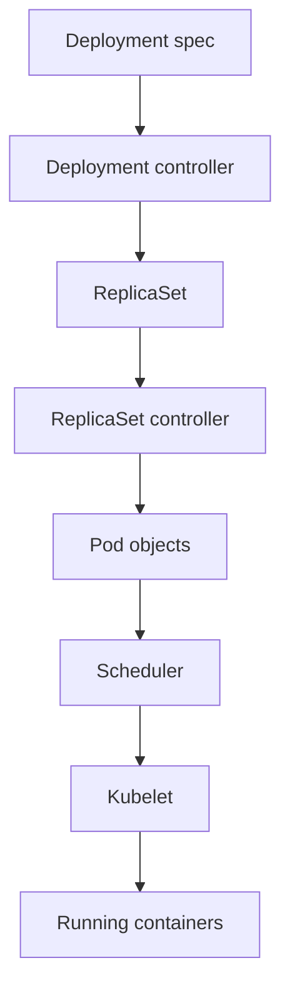

## Table of Contents

1. [The Cluster Keeps Comparing](#the-cluster-keeps-comparing)
2. [The Request and the Report](#the-request-and-the-report)
3. [Spec and Status](#spec-and-status)
4. [Controllers](#controllers)
5. [A Deployment as Desired State](#a-deployment-as-desired-state)
6. [Events](#events)
7. [Rollouts](#rollouts)
8. [Manual Changes](#manual-changes)
9. [Bad Desired State](#bad-desired-state)
10. [Putting It All Together](#putting-it-all-together)
11. [What's Next](#whats-next)

## The Cluster Keeps Comparing

Most command-line tools run once and exit. You run a command, it succeeds or fails, and then it is done. Kubernetes behaves differently. You submit a request, and the cluster keeps comparing that request with what is currently happening while the system runs.

Kubernetes calls the request **desired state**. For `devpolaris-api`, desired state might say:

- The production namespace should have one Deployment named `devpolaris-api`.
- The Deployment should maintain three ready Pods.
- Each Pod should run `ghcr.io/devpolaris/api:1.4.2`.
- Each Pod should expose port `3000`.
- Only ready Pods should receive traffic.

Current state is what the cluster can observe right now. Maybe three Pods are ready. Maybe one Pod is crash-looping. Maybe no node has enough memory. Maybe the new image tag does not exist in the registry.

Reconciliation is the loop that compares those two views and takes the next useful action.



This loop explains both the strength and the sharp edges of Kubernetes. If a Pod disappears, Kubernetes can create a replacement. If the desired state points at a broken image tag, Kubernetes can keep trying the broken request until you change it.

## The Request and the Report

The easiest way to read Kubernetes is to separate the request from the report.

The request is what the team asked Kubernetes to maintain. It usually lives in the object's `spec`. The report is what Kubernetes observed after trying to act on that request. It usually lives in the object's `status`, and it is also visible through events, logs, and related objects.

For `devpolaris-api`, the request might be "three ready Pods." The report might be "two ready Pods, one Pod waiting because the image tag does not exist." Those are different kinds of truth. The request tells you what Kubernetes is trying to do. The report tells you how far it got.

| Word | Plain meaning | Who usually changes it |
| --- | --- | --- |
| Desired state | The condition you want Kubernetes to maintain | Humans or automation |
| Current state | The condition Kubernetes can observe right now | Kubernetes components report it |
| `spec` | The object field that holds the request | Humans or automation |
| `status` | The object field that holds the report | Kubernetes components |
| Reconciliation | The loop that compares request and report | Controllers |

This distinction prevents a common beginner mistake. Seeing a Deployment object in the cluster does not prove the application is healthy. It proves the API server accepted an object. You still need status to know whether the cluster reached the requested state.

## Spec and Status

Most Kubernetes objects separate the request from the report.

The `spec` field describes what you want. The `status` field describes what Kubernetes observed after trying to make it happen. You write or update the spec. Kubernetes components update status.

A shortened Deployment object makes the split visible:

```yaml
apiVersion: apps/v1
kind: Deployment
metadata:
  name: devpolaris-api
  namespace: devpolaris-prod
spec:
  replicas: 3
status:
  readyReplicas: 2
  availableReplicas: 2
  updatedReplicas: 3
```

The object above says the team wants three replicas, but only two are ready and available. That mismatch is the first useful signal. The Deployment object exists, and the requested image may even be updated, but the application has not reached the requested availability.

You can ask for the same split in a compact form:

```bash
$ kubectl get deployment devpolaris-api -n devpolaris-prod \
  -o custom-columns=NAME:.metadata.name,DESIRED:.spec.replicas,READY:.status.readyReplicas,AVAILABLE:.status.availableReplicas
NAME             DESIRED   READY   AVAILABLE
devpolaris-api   3         2       2
```

This command is not required for day-one learning. It shows the habit that matters: compare request and report before changing anything.

The split appears across Kubernetes objects. A Pod spec says which containers, volumes, probes, and resource requests should exist. Pod status reports whether those containers are waiting, running, terminated, ready, or failing. A Service spec says which selector and ports to use. Endpoint data reports which ready Pod addresses are actually behind it.

## Controllers

A controller is a loop that watches one or more object types and acts when current state differs from desired state. Kubernetes includes many controllers. Deployments, ReplicaSets, Jobs, Nodes, Services, and namespaces all have controllers behind their behavior.

The word "controller" can sound abstract, but the job is practical. A controller keeps checking a part of the cluster and makes small changes when the report does not match the request. For a Deployment, the controller checks whether the requested number of Pods exists through ReplicaSets. For a Job, the controller checks whether the requested work has completed. For nodes, a controller checks node health and reacts when nodes stop reporting correctly.

For a Deployment, the loop does not start containers directly. It works through other objects.



This handoff is why Kubernetes can feel indirect at first. You edit a Deployment, but the running container is several steps away. The benefit is that each component owns a smaller job and reports status back through the API.

When a controller takes action, you often see it in events:

```bash
$ kubectl describe deployment devpolaris-api -n devpolaris-prod
Events:
  Type    Reason             From                   Message
  ----    ------             ----                   -------
  Normal  ScalingReplicaSet  deployment-controller  Scaled up replica set devpolaris-api-75c9444bd7 to 3
```

The event tells you that the Deployment controller acted. The next question is whether the ReplicaSet created Pods and whether those Pods became ready.

## A Deployment as Desired State

Here is a small Deployment for `devpolaris-api`. Later workload articles will explain every field in more detail. In this article, focus on how the object expresses intent.

The important parts before reading the YAML are:

| Field area | Question it answers |
| --- | --- |
| `replicas` | How many copies should Kubernetes try to keep ready? |
| `selector` | Which Pods belong to this Deployment? |
| `template` | What should each new Pod look like? |
| `readinessProbe` | How should Kubernetes decide whether a Pod should receive traffic? |

```yaml
apiVersion: apps/v1
kind: Deployment
metadata:
  name: devpolaris-api
  namespace: devpolaris-prod
spec:
  replicas: 3
  selector:
    matchLabels:
      app: devpolaris-api
  template:
    metadata:
      labels:
        app: devpolaris-api
    spec:
      containers:
        - name: api
          image: ghcr.io/devpolaris/api:1.4.2
          ports:
            - containerPort: 3000
          readinessProbe:
            httpGet:
              path: /healthz
              port: 3000
```

This object asks Kubernetes to maintain three Pods created from the template. The selector connects the Deployment to Pods with the label `app=devpolaris-api`. The readiness probe tells Kubernetes how to decide whether a Pod should receive traffic.

After applying it, the useful question is whether the cluster converged on the desired state:

```bash
$ kubectl get deployment devpolaris-api -n devpolaris-prod
NAME             READY   UP-TO-DATE   AVAILABLE   AGE
devpolaris-api   3/3     3            3           22m
```

`READY 3/3` means the Deployment wants three replicas and three are ready. `UP-TO-DATE 3` means three replicas match the current Pod template. `AVAILABLE 3` means three replicas have been available according to the Deployment's availability rules.

That single row is dense. It tells you whether reconciliation reached the state requested by the spec.

## Events

Events are short records that Kubernetes attaches to objects when something meaningful happens. They often explain the space between spec and status.

Think of status as the summary and events as the recent story. Status might say a Pod is `Pending`. Events can say the scheduler could not place it because no node had enough CPU. Status might say a container is waiting. Events can say the kubelet could not pull the image.

A healthy Pod might show this event chain:

```bash
$ kubectl describe pod devpolaris-api-6d8f7d9f8c-xr4mf -n devpolaris-prod
Events:
  Type    Reason     Age   From               Message
  ----    ------     ----  ----               -------
  Normal  Scheduled  4m    default-scheduler  Successfully assigned devpolaris-prod/devpolaris-api-6d8f7d9f8c-xr4mf to worker-03
  Normal  Pulling    4m    kubelet            Pulling image "ghcr.io/devpolaris/api:1.4.2"
  Normal  Pulled     3m    kubelet            Successfully pulled image
  Normal  Created    3m    kubelet            Created container api
  Normal  Started    3m    kubelet            Started container api
```

Read the `From` column. `default-scheduler` means the scheduler reported placement. `kubelet` means the node agent reported image or container work. Controller names point to control plane loops.

Events are useful because the same final symptom can have different causes. An unavailable API might be caused by failed scheduling, image pull failure, missing configuration, a crashing process, or a failed readiness check. Events tell you which part of the reconciliation path reported trouble.

For example:

```text
Warning  FailedScheduling  default-scheduler  0/3 nodes are available: 3 Insufficient cpu.
Warning  Failed            kubelet            Failed to pull image "ghcr.io/devpolaris/api:1.4.3": not found
Warning  Unhealthy         kubelet            Readiness probe failed: HTTP probe failed with statuscode: 500
```

Those lines point to different fixes. The first is capacity or scheduling constraints. The second is registry or image tag. The third is application readiness.

## Rollouts

A rollout happens when the Pod template of a Deployment changes. Updating the image from `1.4.2` to `1.4.3` changes desired state. The Deployment controller creates a new ReplicaSet and gradually moves replicas from the old template to the new template.

```bash
$ kubectl set image deployment/devpolaris-api api=ghcr.io/devpolaris/api:1.4.3 -n devpolaris-prod
deployment.apps/devpolaris-api image updated

$ kubectl rollout status deployment/devpolaris-api -n devpolaris-prod
Waiting for deployment "devpolaris-api" rollout to finish: 1 of 3 updated replicas are available...
deployment "devpolaris-api" successfully rolled out
```

The command is a shortcut for changing the Deployment spec. The deeper behavior is the reconciliation loop. Kubernetes sees a new template, creates new Pods, waits for readiness, and scales down old Pods according to the rollout strategy.

You can see the ReplicaSets during or after the rollout:

```bash
$ kubectl get rs -n devpolaris-prod -l app=devpolaris-api
NAME                        DESIRED   CURRENT   READY   AGE
devpolaris-api-6d8f7d9f8c   0         0         0       18d
devpolaris-api-75c9444bd7   3         3         3       4m
```

The older ReplicaSet remains in history for rollback. The newer ReplicaSet owns the current ready Pods. If the new version gets stuck, this output helps you see whether the problem is old Pods, new Pods, or readiness for the new template.

## Manual Changes

Manual changes interact with reconciliation in two different ways. Some changes create drift that controllers repair. Other changes update desired state, and Kubernetes follows the new request.

Deleting one Pod from a Deployment creates drift. The desired replica count still says three, so the ReplicaSet controller creates a replacement:

```bash
$ kubectl delete pod devpolaris-api-75c9444bd7-p8x2m -n devpolaris-prod
pod "devpolaris-api-75c9444bd7-p8x2m" deleted

$ kubectl get pods -n devpolaris-prod -l app=devpolaris-api
NAME                              READY   STATUS              AGE
devpolaris-api-75c9444bd7-4sjkg   1/1     Running             18m
devpolaris-api-75c9444bd7-h6p8d   1/1     Running             18m
devpolaris-api-75c9444bd7-vc2mb   0/1     ContainerCreating   9s
```

Scaling the Deployment changes desired state:

```bash
$ kubectl scale deployment devpolaris-api --replicas=1 -n devpolaris-prod
deployment.apps/devpolaris-api scaled

$ kubectl get deployment devpolaris-api -n devpolaris-prod -o jsonpath='{.spec.replicas}{"\n"}'
1
```

Kubernetes now believes one replica is the requested state. A GitOps controller or CI pipeline might later restore the reviewed manifest, but Kubernetes itself follows the live spec accepted by the API server.

This is why teams care about who can update production objects. The cluster reconciles toward the desired state it receives. Human process and automation decide which desired state should be trusted.

## Bad Desired State

Reconciliation repeats the request you gave it. If the request is impossible, the cluster keeps reporting failure while trying again.

Imagine a rollout changes the image tag to `1.4.30`, but CI never pushed that image:

```bash
$ kubectl get deployment devpolaris-api -n devpolaris-prod
NAME             READY   UP-TO-DATE   AVAILABLE   AGE
devpolaris-api   2/3     1            2           18d

$ kubectl get pods -n devpolaris-prod -l app=devpolaris-api
NAME                              READY   STATUS             AGE
devpolaris-api-6d8f7d9f8c-2k9sl   1/1     Running            3h
devpolaris-api-6d8f7d9f8c-h6p8d   1/1     Running            3h
devpolaris-api-75c9444bd7-j9vhw   0/1     ImagePullBackOff   7m
```

The Deployment is partly available because two old Pods still serve traffic. The new desired image is blocked. The Pod event gives the reason:

```text
Warning  Failed   kubelet  Failed to pull image "ghcr.io/devpolaris/api:1.4.30": not found
Warning  BackOff  kubelet  Back-off pulling image "ghcr.io/devpolaris/api:1.4.30"
```

The fix is to correct desired state. If `1.4.30` was a typo, roll back or apply the right tag. If `1.4.30` was intended, fix the CI or registry problem so the requested image exists.

```bash
$ kubectl rollout undo deployment/devpolaris-api -n devpolaris-prod
deployment.apps/devpolaris-api rolled back
```

The important habit is to change the request that the loop is following. Restarting the same failing Pod may create another failing Pod with the same bad image reference.

## Putting It All Together

Desired state is the request. Status is the report. Reconciliation is the loop that keeps comparing them. Controllers act through the Kubernetes API, and events show important steps along the way.

For `devpolaris-api`, you can now read a Deployment row with more confidence:

```text
READY 2/3:
  The request asks for three ready replicas, but only two are ready.

UP-TO-DATE 1:
  Only one replica matches the current Pod template.

AVAILABLE 2:
  Two replicas currently satisfy availability rules.
```

Those fields tell you where to look next. Move from the Deployment to ReplicaSets, from ReplicaSets to Pods, from Pod status to events, and from events to logs when the container has actually started.

Kubernetes rewards this habit. Start with the object you requested. Compare spec with status. Follow the event trail to the component that reported the gap.

## What's Next

The next article covers namespaces and `kubectl`. You have seen the API model and reconciliation loop. Now you need the daily command-line habits that keep you in the right cluster and namespace while you inspect those objects.

---

**References**

- [Objects in Kubernetes](https://kubernetes.io/docs/concepts/overview/working-with-objects/) - Official explanation of object specs, status, and manifests.
- [Controllers](https://kubernetes.io/docs/concepts/architecture/controller/) - Official explanation of reconciliation loops and controller behavior.
- [Deployments](https://kubernetes.io/docs/concepts/workloads/controllers/deployment/) - Official documentation for Deployment behavior, rollout, status, and rollback.
- [ReplicaSet](https://kubernetes.io/docs/concepts/workloads/controllers/replicaset/) - Official documentation for the controller that maintains a stable set of replica Pods.
- [Kubernetes Object Management](https://kubernetes.io/docs/concepts/overview/working-with-objects/object-management/) - Official overview of imperative and declarative object management.
