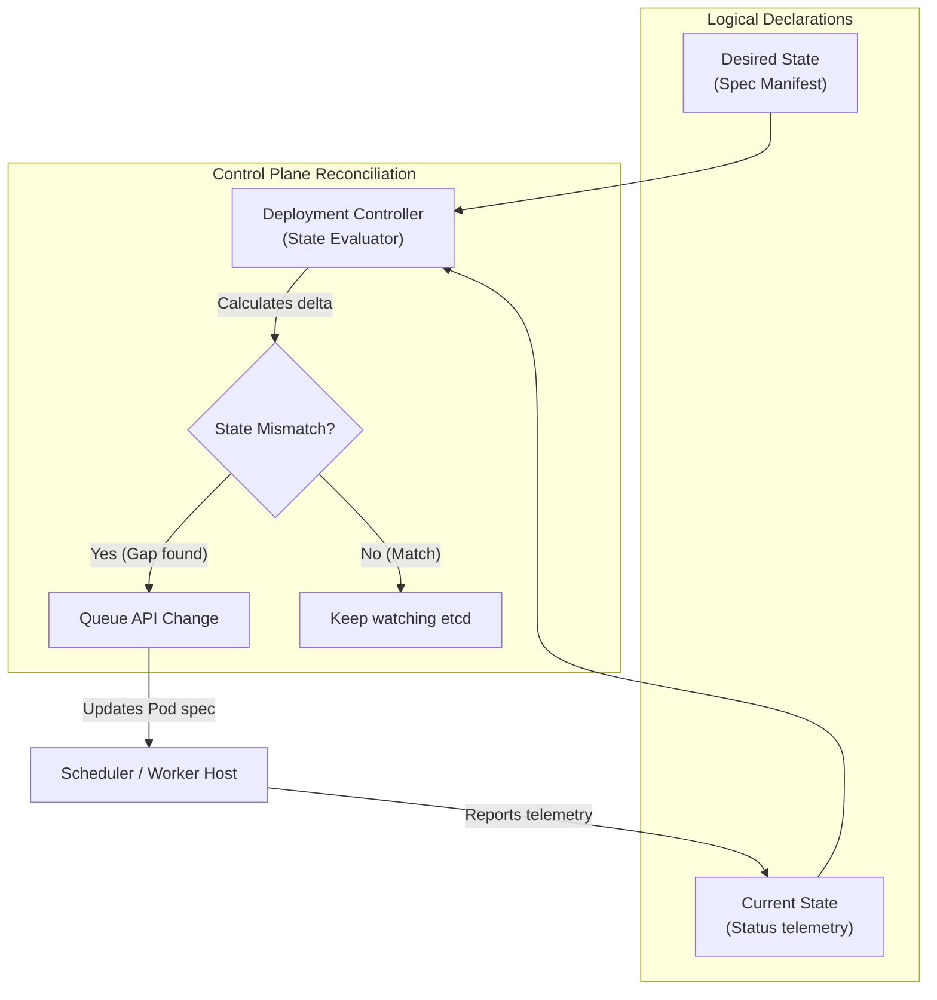
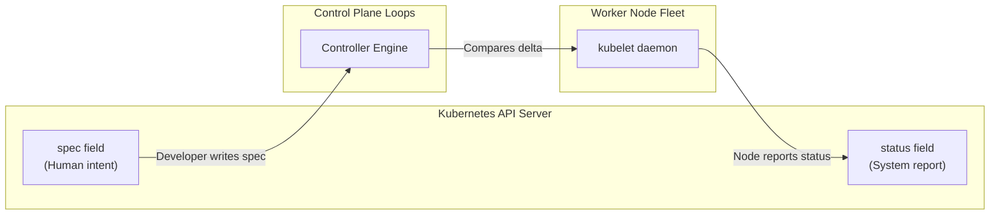
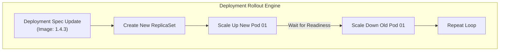

## Table of Contents

1. [The Cluster Keeps Comparing](#the-cluster-keeps-comparing)
2. [The Request and the Report](#the-request-and-the-report)
3. [Spec and Status](#spec-and-status)
4. [Controllers](#controllers)
5. [A Deployment as Desired State](#a-deployment-as-desired-state)
6. [Events](#events)
7. [Rollouts](#rollouts)
8. [Manual Changes](#manual-changes)
9. [Bad Desired State](#bad-desired-state)
10. [Putting It All Together](#putting-it-all-together)
11. [What's Next](#whats-next)

## The Cluster Keeps Comparing

At its core, Kubernetes runs by continuously comparing a request with a report.
The request is the configuration you want, and the report is what the cluster observes on nodes right now.
Example: you request three notification API Pods, but the report says only two are ready because one node failed.


*Reconciliation is the repeated comparison between what the spec asks for and what the cluster reports.*


Traditional scripting tools operate as one-time execution paths.
You run an imperative script to deploy an application, it executes a sequence of SSH commands, and then it exits.
If a server process crashes five minutes later, the script is no longer running to repair it.
Kubernetes uses a fundamentally different operating model.
Instead of running one-off deployment steps, you submit a configuration request, and the cluster monitors that request continuously.

This target configuration is called the **Desired State**.
For our Customer Notification Service, the desired state declared in the API might state:

- The namespace `notifications-prod` must have a Deployment named `notification-api`.
- The Deployment must maintain three healthy, identical replicas of the workload.
- Each container must execute the image `ghcr.io/devpolaris/notification-api:1.4.2`.
- Each instance must expose port `3000` and respond to active health checks.
- Network routing must bypass instances that fail to report healthy status.

The actual, active condition of the cluster is called the **Current State**.
The current state represents what the platform observes on the physical hosts right now.
For example, two Pods are running healthy, but the third node has suffered a physical memory crash.
Or the container registry is offline, preventing the node from pulling the requested image.

Reconciliation is the automated process that compares these two states and calculates the corrective actions required.



The diagram illustrates the continuous loop that drives the cluster.
The controller compares the desired spec and current status.
If a gap is found, the system immediately queues API changes to schedule replacements.
Otherwise, the engine goes back to watching for active state changes.

This reconciliation loop is the core mechanical principle of Kubernetes.
It allows the system to recover from hardware failures and process crashes automatically.
However, it will also repeat a failing instruction indefinitely.
If your desired state references a broken image tag, the cluster will continuously attempt to run it.
It will loop through failures until you update the request.

## The Request and the Report

At its core, the request is what you asked Kubernetes to maintain, and the report is what Kubernetes observed after trying to run it.
The request lives in the object's `spec`.
The report lives in the object's `status`.
Events, container logs, and diagnostic terminal probes provide additional evidence to support the status.

For the Customer Notification Service, the request is three healthy Pod replicas.
If one node crashes, the status reports only two running Pods and one failing Pod.
The spec (your request) has not changed, but the status (the report) reveals that the system has drifted.
The controller immediately acts to align the report with the request.



The diagram outlines the communication boundaries between components.
Developers write to the spec, while the node agents update the status.
The controller engine compares the delta between the two fields to drive execution.

This distinction prevents the common mistake of assuming a resource is healthy just because it exists.
A Deployment object can sit in the cluster API database for weeks while its containers are crashing.
The existence of the object proves the API Server accepted the YAML manifest.
You must read the status block to verify whether the cluster successfully realized that configuration on the hosts.

## Spec and Status

At its core, `spec` is the input field and `status` is the output field.
You write and update the `spec` block to declare your operational intent.
Kubernetes components, like controllers and worker node agents, update the `status` block.
Example: a Deployment spec can request `replicas: 3`, while the status can report `readyReplicas: 2`.

Consider a simplified Deployment manifest showing this structural split:

```yaml
apiVersion: apps/v1
kind: Deployment
metadata:
  name: notification-api
  namespace: notifications-prod
spec:
  replicas: 3
status:
  readyReplicas: 2
  availableReplicas: 2
  updatedReplicas: 3
```

This Deployment status reveals a critical operational gap.
The spec requests three replicas, but only two are marked ready and available for traffic.
This mismatch is your primary diagnostic signal.
It shows that although the API server accepted the updated configuration, the cluster has failed to converge on the target state.

You can query this status split directly from the command line:

```bash
kubectl get deployment notification-api -n notifications-prod
```

The terminal prints the compiled spec and status values in a compact layout:

```text
NAME               READY   UP-TO-DATE   AVAILABLE   AGE
notification-api   2/3     3            2           18d
```

This output quickly reveals the health of your workloads.
`READY 2/3` tells you that one instance is failing to pass health checks.
`UP-TO-DATE 3` tells you that all three instances are running the latest version of your Pod template.
This immediately narrows your diagnostic path: the rollout succeeded, but one new instance is crashing.

This spec-status split runs through every level of the platform.
A Pod's spec declares its container images and limits, while its status reports whether those containers are running or failing.
A Service's spec defines its selector tags, while its endpoint status lists the active Pod IPs that match those tags.

## Controllers

At its core, a controller is a background process that watches Kubernetes objects and makes follow-up changes.
It exists so the cluster can keep working after the original command has finished.
Example: the ReplicaSet controller notices that only two Pods are running for a three-replica Deployment, then asks the API Server to create another Pod.

Kubernetes does not operate as a single master program.
Instead, it runs a suite of independent controller loops compiled into the `kube-controller-manager` binary.
Deployments, ReplicaSets, Services, and Nodes each have their own dedicated controller loops.

A controller's job is to reconcile the difference between the desired spec and the observed status.
The Deployment controller monitors Deployment objects.
The ReplicaSet controller manages Pod counts.
The Node controller monitors host server health and evicts workloads when nodes drop offline.

For a Deployment, the reconciliation loop does not start containers directly.
Instead, it manages resources down an API chain:

- The developer submits a Deployment manifest declaring three replicas.
- The Deployment controller reads the manifest and creates a matching ReplicaSet resource.
- The ReplicaSet controller reads the ReplicaSet resource and creates three individual Pod resources.
- The scheduler reads the unassigned Pod resources and binds them to healthy worker nodes.
- The kubelet agent on each node reads the Pod assignments and instructs containerd to start the containers.

This decoupled architecture ensures high availability.
If one component crashes, the other components continue executing their local reconciliation loops.
The system uses the centralized API Server as the shared coordination point for these steps.

When a controller takes corrective action, it records the event in the API Server.
You can read these records to audit the reconciliation history:

```bash
kubectl describe deployment notification-api -n notifications-prod
```

The output displays the event log at the bottom of the resource description:

```text
Events:
  Type    Reason             From                   Message
  ----    ------             ----                   -------
  Normal  ScalingReplicaSet  deployment-controller  Scaled up replica set notification-api-7c8d9f to 3
```

This event proves that the Deployment controller successfully processed your manifest change.
It tells you that the controller created the matching ReplicaSet.
Your next diagnostic step is to inspect the ReplicaSet's events to verify whether it successfully spawned the Pods.

## A Deployment as Desired State

At its core, a Deployment manifest is the written request for how Kubernetes should run a stateless application.
It exists so the same desired state can be reviewed, applied, rolled out, and repaired by controllers.
Example: the manifest below asks Kubernetes to keep three `notification-api` Pods running from image `1.4.2`.

```yaml
apiVersion: apps/v1
kind: Deployment
metadata:
  name: notification-api
  namespace: notifications-prod
spec:
  replicas: 3
  selector:
    matchLabels:
      app: notification-api
  template:
    metadata:
      labels:
        app: notification-api
    spec:
      containers:
        - name: api
          image: ghcr.io/devpolaris/notification-api:1.4.2
          ports:
            - containerPort: 3000
          readinessProbe:
            httpGet:
              path: /healthz
              port: 3000
```

This declarative configuration defines the target state for our service:

- `replicas` requests that the cluster keep three Pod instances running continuously.
- `selector` binds the Deployment to any Pod carrying the metadata label `app: notification-api`.
- `template` defines the Pod blueprint that the controller must execute.
- `readinessProbe` tells the node agent how to verify the application's startup health.

The readiness probe is critical for traffic routing.
It tells the cluster not to route client requests to a Pod until it responds with an HTTP `200` status on `/healthz`.
This prevents uninitialized containers from receiving and dropping user packets during deployments.

Once applied, you verify that the cluster successfully converged on your declared configuration:

```bash
kubectl get deployment notification-api -n notifications-prod
```

The terminal reports the compiled availability status:

```text
NAME               READY   UP-TO-DATE   AVAILABLE   AGE
notification-api   3/3     3            3           22m
```

A status of `3/3` indicates that all three instances are ready and serving traffic.
This single row confirms that the entire reconciliation loop completed successfully from manifest validation to container execution.

## Events

At its core, an event is a short API record describing something Kubernetes just tried or observed.
If status provides the current operational summary, events provide the recent history.
Example: a Pod event can say the scheduler placed the Pod on `worker-03`, then the kubelet pulled the container image.

When a Pod remains stuck in a `Pending` state, the status summary does not tell you why it is blocked.
You must inspect the event log to read the diagnostic story.
The event log reveals whether the scheduler is blocked by resource limits or the node agent is failing to pull images.

Consider the event log of a healthy Pod startup:

```bash
kubectl describe pod notification-api-7c8d9f-a1b2c -n notifications-prod
```

The event log documents the exact sequence of the reconciliation steps:

```text
Events:
  Type    Reason     Age   From               Message
  ----    ------     ----  ----               -------
  Normal  Scheduled  4m    default-scheduler  Successfully assigned notifications-prod/notification-api-7c8d9f-a1b2c to worker-03
  Normal  Pulling    4m    kubelet            Pulling image "ghcr.io/devpolaris/notification-api:1.4.2"
  Normal  Pulled     3m    kubelet            Successfully pulled image
  Normal  Created    3m    kubelet            Created container api
  Normal  Started    3m    kubelet            Started container api
```

The `From` column identifies the specific component that executed each step.
The scheduler reports the node assignment (`default-scheduler`), and the node agent reports container execution (`kubelet`).

If the reconciliation loop fails, the event log records a warning.
These warnings point you directly to the root cause of the failure:

- `FailedScheduling` indicates that the scheduler cannot place the Pod due to insufficient CPU or memory capacity.
- `Failed` (from kubelet) indicates that the node agent cannot pull the container image or find the registry tag.
- `Unhealthy` indicates that the container is running but failing its readiness probes.

These warnings require different operational fixes.
A scheduling failure requires adjusting your resource requests or scaling your nodes.
An image pull failure requires verifying your container registry credentials or tags.
A readiness probe failure requires fixing your application code or database connections.

## Rollouts

At its core, a rollout is the process of replacing old Pods with new Pods after a Deployment template changes.
When you update the container image from `1.4.2` to `1.4.3`, you write a new desired state to the Deployment spec.
The Deployment controller detects this change and initiates a progressive rolling update.
Example: the notification API can move from `ghcr.io/devpolaris/notification-api:1.4.2` to `1.4.3` one Pod at a time, while the old healthy Pods keep serving traffic until the new ones pass readiness checks.

The controller manages this update by orchestrating two parallel ReplicaSets:

- It creates a new ReplicaSet using the updated Pod template (`1.4.3`).
- It scales up the new ReplicaSet to start one new Pod instance.
- It waits for the new Pod to pass its readiness probes and enter a healthy state.
- It then scales down the old ReplicaSet (`1.4.2`) to terminate one old Pod.
- It repeats this scale-up and scale-down loop until all active Pods are running the new version.



This rolling update pattern ensures zero-downtime deployments.
The system guarantees that a minimum number of healthy Pods remain active to serve user traffic throughout the rollout.

You can monitor the active status of a rollout from your terminal:

```bash
kubectl rollout status deployment/notification-api -n notifications-prod
```

The command monitors the state transitions in real time and reports when the update completes:

```text
Waiting for deployment "notification-api" rollout to finish: 1 of 3 updated replicas are available...
deployment "notification-api" successfully rolled out
```

If the new image version crashes on startup, the new Pods will fail their readiness probes.
The rollout will pause automatically, leaving your old, healthy Pods running to serve users.
This self-healing gate protects your production environment from broken releases.

## Manual Changes

At its core, a manual change either changes the desired state or changes only the current running objects.
If you manually delete an active Pod, you change only the current state, so the desired replica count no longer matches what is running.
The ReplicaSet controller immediately detects this gap and starts a replacement:
Example: deleting one notification API Pod is temporary because the Deployment still asks for three replicas, while scaling the Deployment to five changes the target the controller enforces.


*Manual changes to live objects can disappear because controllers keep rebuilding the requested shape from the spec.*


```bash
kubectl delete pod notification-api-7c8d9f-a1b2c -n notifications-prod
```

The terminal reports the deletion, and a query of the active Pods reveals the recovery:

```text
pod "notification-api-7c8d9f-a1b2c" deleted
```

```bash
kubectl get pods -n notifications-prod
```

The ReplicaSet controller has already spawned a replacement Pod to restore the desired state:

```text
NAME                                READY   STATUS              AGE
notification-api-7c8d9f-d3e4f       1/1     Running             18m
notification-api-7c8d9f-g5h6i       1/1     Running             18m
notification-api-7c8d9f-z9y8x       0/1     ContainerCreating   5s
```

In contrast, if you scale the Deployment, you update the desired state itself:

```bash
kubectl scale deployment notification-api --replicas=5 -n notifications-prod
```

The controller accepts this new scale as its target.
It immediately spawns two additional Pods to meet your updated request.
The reconciliation loop does not fight your manual commands; it executes them by updating the desired state.

This is why modern teams manage configurations using GitOps workflows.
A GitOps agent (like ArgoCD) continuously monitors your Git repository manifests.
If you scale a deployment manually in the cluster, the agent detects the drift from Git and restores the reviewed code.
This keeps your active cluster state in sync with your version-controlled repository.

## Bad Desired State

At its core, bad desired state is a valid request that Kubernetes cannot successfully run.
The API Server may accept the YAML, but the node-side work can still fail later.
Example: a typo in an image tag creates a Deployment that keeps asking nodes to pull an image that does not exist.

Imagine a deployment rollout where you mistyped the container image tag as `1.4.30`:

```bash
kubectl get deployment notification-api -n notifications-prod
```

The status reports that the rollout is blocked:

```text
NAME               READY   UP-TO-DATE   AVAILABLE   AGE
notification-api   2/3     1            2           18d
```

The two old Pods (`1.4.2`) continue running to serve traffic, but the new Pod is failing to start:

```bash
kubectl get pods -n notifications-prod
```

The new Pod reports an image pull failure:

```text
NAME                                READY   STATUS             AGE
notification-api-7c8d9f-d3e4f       1/1     Running            3h
notification-api-7c8d9f-g5h6i       1/1     Running            3h
notification-api-8x9y0z-p1q2r       0/1     ImagePullBackOff   7m
```

The Pod's event log explains the failure: the node agent cannot find the image tag in the registry.
The reconciliation loop is stuck.
It will keep trying to pull the broken image until you change the desired state.

To recover, you must correct the manifest or execute a rollback command:

```bash
kubectl rollout undo deployment/notification-api -n notifications-prod
```

The rollback command instructs the Deployment controller to restore the previous, healthy Pod template spec.
The controller terminates the failing Pod and restores the healthy replica counts.
This highlights the core rule of troubleshooting: always correct the desired state configuration that the loop is executing.

## Putting It All Together

The desired state model defines how Kubernetes operates.
You declare your operational intent in the resource `spec`, and the cluster reports its observed status in the `status` block.
Independent controller loops monitor these fields, calculating state differences and executing repairs automatically.
Events document these state transitions, and rollouts automate progressive version updates safely.

For our Customer Notification Service, this reconciliation model ensures high reliability:

- You write your target configuration to the Deployment's `spec`.
- Kubelet agents and network plugins report container health back to the `status` block.
- The controller manager runs background loops to maintain the replica counts.
- Pod events document the exact sequence of scheduling, pulling, and starting actions.
- Typo configurations or registry failures pause rollouts automatically to protect active traffic.

Adopting this mental model changes how you operate clusters.
Rather than running manual recovery scripts, you manage workloads by maintaining their declarative desired state.

## What's Next

In the next article, we will focus on daily operational command-line habits.
We will explore namespaces and `kubectl` configurations, checking how to navigate and manage these API resources safely.


*Desired state becomes practical when you know where the spec lives, how status reports reality, and which controller closes the gap.*

---

**References**

- [Kubernetes Objects](https://kubernetes.io/docs/concepts/overview/working-with-objects/) - Official reference for declarative schemas, specs, and status fields.
- [Controller Architecture](https://kubernetes.io/docs/concepts/architecture/controller/) - Systems-level description of reconciliation loops and controllers.
- [Deployments and Rollouts](https://kubernetes.io/docs/concepts/workloads/controllers/deployment/) - Detailed guide on deployment updates, strategies, and rollbacks.
- [ReplicaSet Operations](https://kubernetes.io/docs/concepts/workloads/controllers/replicaset/) - Official reference for the ReplicaSet controller managing pod counts.
- [Object Management Strategies](https://kubernetes.io/docs/concepts/overview/working-with-objects/object-management/) - Official overview of declarative vs. imperative object management.
