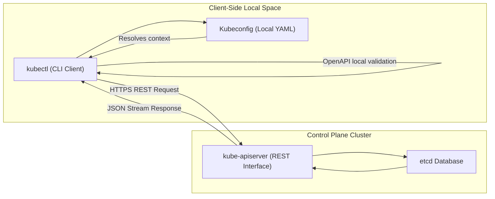

## Table of Contents

1. [Before You Run a Command](#before-you-run-a-command)
2. [Namespaces](#namespaces)
3. [kubectl](#kubectl)
4. [Contexts](#contexts)
5. [Reading Objects](#reading-objects)
6. [Namespaced and Cluster-Scoped Resources](#namespaced-and-cluster-scoped-resources)
7. [Logs and Events](#logs-and-events)
8. [Structured Output](#structured-output)
9. [A Daily Inspection Routine](#a-daily-inspection-routine)
10. [Putting It All Together](#putting-it-all-together)
11. [What's Next](#whats-next)

## Before You Run a Command

At its core, `kubectl` is a client for a remote API, not a command that only affects your laptop.
The same command can target a local cluster, staging, or production depending on your local Kubernetes configuration.
Example: `kubectl delete pod api-1` deletes a Pod from whichever cluster and namespace your current context selects.


*The same kubectl command can inspect different objects depending on the active context and namespace.*


Most command-line utilities execute tasks against a single local environment by default.
In contrast, the same Kubernetes command-line tools can inspect a local development VM, a shared staging cloud, or a high-traffic production system.
A single simple-looking command can read or alter completely different environments based on hidden local variables.

Consider this command:

```bash
kubectl get pods
```

This command looks harmless.
However, its behavior depends entirely on your active client configuration.
Your current context determines which cluster and credential profile are used.
Your current namespace determines the default workspace searched for resources.
If these configurations point to production, your command reads production.
If you execute a write operation, like a resource deletion, it immediately alters production.

The first critical operational habit is to verify your target configuration before executing any change.

To audit your current active profiles, run these commands:

```bash
kubectl config current-context
```

The output reveals the active target context:

```text
notifications-prod
```

Next, query the active default namespace assigned to that context:

```bash
kubectl config view --minify --output 'jsonpath={..namespace}{"\n"}'
```

The terminal reports the default namespace:

```text
notifications-prod
```

If the namespace output is blank, the tool defaults to searching the `default` namespace unless you override it with the `-n` flag.
This verification is the Kubernetes equivalent of checking your git branch before pushing code.
It takes two seconds and prevents expensive operational mistakes in live environments.

## Namespaces

A namespace is a name scope inside a single Kubernetes cluster.
It exists so teams and environments can reuse names without colliding with each other.
Example: `notifications-staging` and `notifications-prod` can both contain a Deployment named `notification-api`.
Deployments, Pods, Services, ConfigMaps, and Secrets belong to namespaces.
This allows a staging environment and a production environment to share a cluster safely without resource name collisions.

For the Customer Notification Service, you can maintain identical resource names across different lifecycle environments:

```bash
kubectl get deployment notification-api -n notifications-staging
```

The terminal reports the status of the staging workload:

```text
NAME               READY   UP-TO-DATE   AVAILABLE   AGE
notification-api   2/2     2            2           12d
```

Now, query the production namespace using the same resource name:

```bash
kubectl get deployment notification-api -n notifications-prod
```

The terminal reports the production status:

```text
NAME               READY   UP-TO-DATE   AVAILABLE   AGE
notification-api   3/3     3            3           18d
```

This resource naming is possible because the namespace forms a core part of the resource's API identity.
It prevents teams from accidentally overwriting sibling workloads.

However, namespaces are virtual dividers, not physical firewalls.
Workloads in different namespaces share the same underlying control plane, node servers, and cluster DNS system.
Unless restricted by Network Policies or RBAC rules, Pods in different namespaces can communicate over the network.
A database in `notifications-prod` must still be secured against unauthorized access from `notifications-staging`.

You can audit the active namespaces in your cluster:

```bash
kubectl get namespaces
```

The output lists the logical partitions and their runtime statuses:

```text
NAME                  STATUS   AGE
default               Active   31d
kube-node-lease       Active   31d
kube-public           Active   31d
kube-system           Active   31d
notifications-staging Active   18d
notifications-prod    Active   18d
```

Kubernetes creates several system namespaces automatically.
`kube-system` holds the core DNS and proxy control plane components.
`kube-public` is reserved for public bootstrap data.
Application teams should always create dedicated namespaces for their workloads.
Deploying production applications directly to `default` is a security risk that complicates access controls.

## kubectl

`kubectl` is the primary command-line client for interacting with the Kubernetes API Server.
It translates command-line verbs, resource names, flags, and YAML files into HTTPS API requests for the API Server.
It parses local credentials, resolves target contexts, executes network queries, and formats JSON outputs.
Example: `kubectl get pods -n notifications-prod` sends an authenticated read request for Pod objects in the `notifications-prod` namespace.
For a beginner, the important point is that `kubectl` does not manage containers by itself.
It asks the API Server to read or change stored Kubernetes objects, and the rest of the cluster reacts to those stored changes.

The tool does not connect directly to worker hosts or execute SSH commands on server operating systems.
Instead, it communicates exclusively with the `kube-apiserver` HTTPS endpoint.
This design guarantees that every command passes through the cluster's centralized authentication and validation loops.



The diagram outlines the network path of a `kubectl` execution.
The client validates the request structure locally using cached OpenAPI schemas before dialing the server.
All transactions pass through the api-server gateway, which reads and writes state to the etcd database.

Most daily cluster operations rely on a small set of verbs:

- `get` lists resources and prints compact status tables.
- `describe` compiles a detailed, human-readable view of a resource and its recent events.
- `logs` retrieves the standard output and error streams of container processes.
- `apply` creates or updates resources using declarative YAML manifests.
- `delete` terminates resources and triggers eviction loops.
- `rollout` monitors and manages deployment version updates.

You do not need to memorize every flag.
Instead, understand the structural grammar of a request: verb, resource type, resource name, target namespace, and output format.

Consider a detailed, explicit inspection command:

```bash
kubectl get deployment notification-api --context notifications-prod -n notifications-prod
```

This command explicitly declares the context and namespace in the command line.
This layout is longer to type, but it prevents environment mistakes.
It provides an explicit record, making it valuable for automation scripts and incident response notes.

## Contexts

At its core, a context is a saved target profile for `kubectl`.
It combines a cluster address, a user credential, and an optional default namespace.
Example: one context can point to `notifications-staging`, while another points to `notifications-prod`.
Your cluster configurations are stored in a local YAML registry called a kubeconfig file.
This file typically lives at `~/.kube/config`.
It enables you to manage access to multiple clusters (local development, staging, production) in one document.

You can audit the contexts registered in your local kubeconfig:

```bash
kubectl config get-contexts
```

The output highlights the registered target profiles:

```text
CURRENT   NAME                  CLUSTER              AUTHINFO                 NAMESPACE
*         notifications-prod    prod-eu-west-2       notifications-prod-user  notifications-prod
          notifications-staging staging-eu-west-2    notifications-stage-user notifications-staging
          kind-notifications    kind-notifications   kind-notifications       default
```

The asterisk (`*`) marks the active context.
If the asterisk points to `notifications-prod`, all commands executed without explicit overrides will run in production.

You can switch your active context at any time:

```bash
kubectl config use-context notifications-staging
```

The terminal confirms the context switch:

```text
Switched to context "notifications-staging".
```

Switching contexts is convenient during focused maintenance sessions.
However, explicit targeting remains the safest approach for ad-hoc commands:

```bash
kubectl get pods --context notifications-staging -n notifications-staging
```

Both habits are valuable.
The key is to avoid guessing.
Before executing any write operation (like `apply`, `scale`, or `delete`), verify your active context.

## Reading Objects

At its core, reading Kubernetes objects means asking the API Server for the current stored record and status summary.
The `get` verb provides a compact, high-level summary of your resources.
Always start diagnostics with the highest-level workload resource.
For our Customer Notification Service, that is the Deployment:
Example: reading the Deployment first tells you whether the service is missing replicas before you inspect individual Pods, events, or container logs.


*kubectl is most useful when you choose the evidence layer that matches the question you are asking.*


```bash
kubectl get deployment notification-api -n notifications-prod
```

The output reports the high-level scaling health:

```text
NAME               READY   UP-TO-DATE   AVAILABLE   AGE
notification-api   3/3     3            3           18d
```

Next, query the active Pods managed by that Deployment using selector labels:

```bash
kubectl get pods -n notifications-prod -l app=notification-api
```

The terminal lists the individual Pod instances and their container statuses:

```text
NAME                                READY   STATUS    RESTARTS   AGE
notification-api-7c8d9f-a1b2c       1/1     Running   0          2h
notification-api-7c8d9f-d3e4f       1/1     Running   0          2h
notification-api-7c8d9f-g5h6i       1/1     Running   0          2h
```

If the Pod status reveals a failure, use `describe` to inspect the detailed events:

```bash
kubectl describe pod notification-api-7c8d9f-a1b2c -n notifications-prod
```

The `describe` output compiles a human-readable summary of the resource configuration, status, and event log:

```text
Name:           notification-api-7c8d9f-a1b2c
Namespace:      notifications-prod
Node:           worker-03/10.240.0.13
Status:         Running
Events:
  Type    Reason     Age   From               Message
  ----    ------     ----  ----               -------
  Normal  Scheduled  4m    default-scheduler  Successfully assigned to worker-03
```

This output is designed for human operators.
It collects all related resource metadata in one terminal view, making it the primary tool for diagnostic research.
For automated scripts, you should rely on structured formats instead.

## Namespaced and Cluster-Scoped Resources

At its core, resource scope defines whether an object belongs to a namespace or to the whole cluster.
Namespaced resources, such as Pods and Services, need a namespace because each team or environment can own separate copies.
Cluster-scoped resources, such as Nodes and StorageClasses, describe shared cluster infrastructure and exist outside any namespace.

Example: `kubectl get pods -n notifications-prod` targets one namespace, but `kubectl get nodes` lists global worker servers for the cluster.

Consider the scope mapping of common cluster resources:

| Resource Kind | SHORTNAMES | API Version | Scope |
| --- | --- | --- | --- |
| Pod | `po` | `v1` | Namespaced |
| Deployment | `deploy` | `apps/v1` | Namespaced |
| Service | `svc` | `v1` | Namespaced |
| Secret | `secret` | `v1` | Namespaced |
| Namespace | `ns` | `v1` | Cluster-scoped |
| Node | `no` | `v1` | Cluster-scoped |
| StorageClass | `sc` | `storage.k8s.io/v1` | Cluster-scoped |

This structural difference explains why some commands reject namespace flags.
Passing `-n notifications-prod` is required when querying Pods.
However, it is rejected or ignored when querying Nodes, because nodes belong to the global cluster capacity.

You can audit the scope of any resource type:

```bash
kubectl api-resources --namespaced=true
```

The terminal lists all namespaced resources available in your cluster API.
To view global resources, query cluster-scoped kinds:

```bash
kubectl api-resources --namespaced=false
```

This query is highly valuable when working with custom resources or third-party operators.
It tells you whether you must provide a namespace flag to target the resource.

## Logs and Events

At its core, logs come from your application process, while events come from Kubernetes components.
Logs represent the stdout and stderr streams generated by the containerized application process.
Events are API records generated by the scheduler, controllers, and kubelet.
You read logs to inspect application code behavior.
You read events to audit cluster scheduling, network setups, and process initializations.

For a healthy Pod, you can read the application's runtime transactions:

```bash
kubectl logs deployment/notification-api -n notifications-prod --tail=20
```

The terminal prints the standard log output of the container process:

```text
2026-05-31T16:11:00Z info server listening on :3000
2026-05-31T16:11:02Z info database connection established
2026-05-31T16:12:45Z info alert sent user_id=4829 type=SMS
```

If a container crashes and restarts, you can inspect the crash traceback using the previous flag:

```bash
kubectl logs pod/notification-api-7c8d9f-a1b2c -n notifications-prod --previous
```

This retrieves the logs from the last terminated container instance.
It allows you to diagnose database timeouts or uncaught memory tracebacks that caused the process to exit.

However, if the container fails to start at all, the application log will be empty.
The failure occurred before the application code could initialize.
In this case, you must read the Pod's events to find the block:

```bash
kubectl describe pod notification-api-7c8d9f-a1b2c -n notifications-prod
```

The event log reveals the runtime startup failure:

```text
Warning  Failed  kubelet  Failed to pull image "ghcr.io/devpolaris/notification-api:1.4.3": not found
```

The event explains the failure: the node agent could not pull the image.
This details the diagnostic rule: use events to audit cluster operations, and use logs to debug application code.

## Structured Output

At its core, structured output is machine-readable data returned by `kubectl`.
It exists so scripts and CI jobs can read exact fields without scraping human-formatted tables.
Example: a deployment check can extract `.status.readyReplicas` and fail a pipeline if fewer than three replicas are ready.

Human-readable output is ideal for active investigation, but it is difficult to parse in scripts.
`kubectl` can format API responses in structured JSON, YAML, JSONPath, or custom columns.
This enables clean integration with CI/CD checks, auditing pipelines, and parsing utilities.

To extract a specific field path, use JSONPath formatting:

```bash
kubectl get deployment notification-api -n notifications-prod \
  -o jsonpath='{.status.readyReplicas}{" replicas are ready\n"}'
```

The command extracts the specific integer value directly:

```text
3 replicas are ready
```

You can compile custom columns to format a clean, tailored terminal dashboard:

```bash
kubectl get deployment notification-api -n notifications-prod \
  -o custom-columns=NAME:.metadata.name,REPLICAS:.spec.replicas,IMAGE:.spec.template.spec.containers[0].image
```

The output returns only the specified columns, removing the default verbose fields:

```text
NAME               REPLICAS   IMAGE
notification-api   3          ghcr.io/devpolaris/notification-api:1.4.2
```

This custom column format is highly valuable for production playbooks.
It allows you to extract precise telemetry data without writing complex regex scripts.

## A Daily Inspection Routine

At its core, a daily inspection routine is an ordered set of reads that moves from broad context to specific failure evidence.
It exists to avoid guessing random commands during an incident.
Example: verify the active context, read the Deployment, list its Pods, inspect one failing Pod's events, then read its logs.

A structured inspection routine follows the dependency chain from the environment context down to the container.
When troubleshooting the Customer Notification Service, execute these commands in sequence:

```bash
kubectl config current-context
kubectl get deployment notification-api -n notifications-prod
kubectl get rs -n notifications-prod -l app=notification-api
kubectl get pods -n notifications-prod -l app=notification-api -o wide
kubectl describe pod <pod-name> -n notifications-prod
kubectl logs <pod-name> -n notifications-prod --tail=50
```

Each step in this routine narrows your diagnostic focus:

- **Current Context**: Verifies which cluster and credential profile are being queried.
- **Deployment**: Checks the overall scaling availability of the workload.
- **ReplicaSets**: Audits which deployment generation owns the active Pods.
- **Pods**: Identifies which specific instances are pending, running, or crashing.
- **Describe Pod**: Audits the event logs to diagnose scheduling or startup failures.
- **Logs**: Reads the application process standard outputs to debug runtime crashes.

This systematic routine avoids random command guesses.
It traces the natural relationships of the cluster components, leading you directly to the root cause.

## Putting It All Together

Namespaces scope and isolate API resources, while contexts map target clusters, user credentials, and default workspaces.
The `kubectl` CLI translates command flags into validated HTTPS requests for the api-server.
API resources are divided into namespaced and cluster-scoped kinds.
Events document cluster operations, and logs expose application process behaviors.

To operate safely, always verify your active environment targets explicitly:

- Identify your active cluster: `kubectl config current-context`.
- Target your resources explicitly: `kubectl get deployment notification-api --context notifications-prod -n notifications-prod`.
- Trace failures systematically: Deployment -> ReplicaSet -> Pod -> events -> logs.

These foundational practices ensure safe, predictable cluster operations.

## What's Next

In the next submodule, we will focus on workloads.
We will explore Pod architectures, resource management, and container specifications in detail, checking how to run applications reliably.


*A reliable kubectl habit starts with context and namespace, then uses get, describe, logs, and events for separate evidence.*

---

**References**

- [Command-line Tool (kubectl)](https://kubernetes.io/docs/reference/kubectl/) - Official overview and command line syntax guide.
- [Configure Access Using kubeconfig](https://kubernetes.io/docs/concepts/configuration/organize-cluster-access-kubeconfig/) - Official reference for kubeconfig files, contexts, and user profiles.
- [Namespaces Overview](https://kubernetes.io/docs/concepts/overview/working-with-objects/namespaces/) - Official reference on namespaces, scoping, and DNS search domains.
- [kubectl Commands Reference](https://kubernetes.io/docs/reference/generated/kubectl/kubectl-commands) - Complete API reference for verbs, resource shortnames, and output formatting.
- [Manage Cluster Resources](https://kubernetes.io/docs/tasks/manage-kubernetes-objects/) - Official task playbooks for applying, auditing, and deleting API resources.
