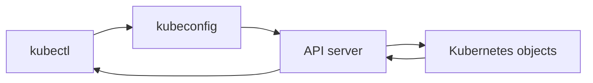

## Table of Contents

1. [Before You Run a Command](#before-you-run-a-command)
2. [Namespaces](#namespaces)
3. [kubectl](#kubectl)
4. [Contexts](#contexts)
5. [Reading Objects](#reading-objects)
6. [Namespaced and Cluster-Scoped Resources](#namespaced-and-cluster-scoped-resources)
7. [Logs and Events](#logs-and-events)
8. [Structured Output](#structured-output)
9. [A Daily Inspection Routine](#a-daily-inspection-routine)
10. [Putting It All Together](#putting-it-all-together)
11. [What's Next](#whats-next)

## Before You Run a Command

The previous articles introduced the Kubernetes API and the reconciliation loop. That model is useful only if you know which API server you are talking to and which namespace your command is reading.

The same command can inspect a local learning cluster, staging, or production:

```bash
$ kubectl get pods
```

That command looks harmless. It depends on hidden local configuration. Your current context decides the cluster and user. Your current namespace decides the default scope for many objects. If those values point at production, the command reads production. If you run a write command, it changes production.

The first habit is simple: check the target before changing anything.

```bash
$ kubectl config current-context
devpolaris-prod

$ kubectl config view --minify --output 'jsonpath={..namespace}{"\n"}'
devpolaris-prod
```

The first command prints the current context. The second prints the default namespace for that context, if one is set. If the namespace output is blank, `kubectl` uses `default` unless you pass `-n`.

This is the Kubernetes version of checking the Git branch before pushing or checking the cloud profile before running an infrastructure command. It is basic, and it prevents expensive mistakes.

## Namespaces

A namespace gives a scope to many Kubernetes object names. Deployments, Pods, Services, ConfigMaps, and Secrets usually live inside a namespace. A cluster can have a Deployment named `devpolaris-api` in `devpolaris-staging` and another Deployment with the same name in `devpolaris-prod`.

```bash
$ kubectl get deployment devpolaris-api -n devpolaris-staging
NAME             READY   UP-TO-DATE   AVAILABLE   AGE
devpolaris-api   2/2     2            2           12d

$ kubectl get deployment devpolaris-api -n devpolaris-prod
NAME             READY   UP-TO-DATE   AVAILABLE   AGE
devpolaris-api   3/3     3            3           18d
```

The same object name can appear in both environments because the namespace is part of the object's identity. That is useful for consistent naming. It also makes namespace mistakes easy.

Namespaces are a scope inside one cluster. They are not separate clusters. Workloads in different namespaces can still share nodes, the same control plane, the same cluster DNS system, and often the same network. Permissions and network policies decide many of the practical boundaries.

You can list namespaces:

```bash
$ kubectl get namespaces
NAME                  STATUS   AGE
default               Active   31d
kube-node-lease       Active   31d
kube-public           Active   31d
kube-system           Active   31d
devpolaris-staging    Active   18d
devpolaris-prod       Active   18d
```

Kubernetes creates several system namespaces. Application teams usually create their own. For production workloads, putting everything in `default` makes ownership and access control harder to see later.

## kubectl

`kubectl` is the main command-line client for Kubernetes. It reads your kubeconfig, chooses a context, authenticates to the API server, sends API requests, and prints the response.

For normal operations, `kubectl` talks to the API server. It does not SSH to worker nodes to list Pods. That matters because the API server is the shared source for objects and status.



Most early Kubernetes work uses a small set of verbs:

| Command shape | Purpose |
| --- | --- |
| `kubectl get` | List objects or show compact status |
| `kubectl describe` | Show a human-readable detail view and events |
| `kubectl logs` | Read container logs through the API |
| `kubectl apply` | Create or update objects from manifests |
| `kubectl delete` | Delete objects |
| `kubectl rollout` | Inspect or control Deployment rollouts |

You do not need to memorize every flag. Learn the shape of the request: verb, resource type, resource name, context, namespace, and output format.

```bash
$ kubectl get deployment devpolaris-api --context devpolaris-prod -n devpolaris-prod
NAME             READY   UP-TO-DATE   AVAILABLE   AGE
devpolaris-api   3/3     3            3           18d
```

This command is longer than `kubectl get deploy devpolaris-api`, but it records the cluster and namespace in the command line. That clarity is valuable in runbooks and incident notes.

## Contexts

A kubeconfig file can contain multiple clusters, users, and contexts. A context combines a cluster, a user, and often a namespace. The current context is the default target for `kubectl`.

```bash
$ kubectl config get-contexts
CURRENT   NAME                 CLUSTER              AUTHINFO                NAMESPACE
*         devpolaris-prod      prod-eu-west-2       devpolaris-prod-user    devpolaris-prod
          devpolaris-staging   staging-eu-west-2    devpolaris-stage-user   devpolaris-staging
          kind-devpolaris      kind-devpolaris      kind-devpolaris         default
```

The star marks the current context. If the star points at production, commands without `--context` go to production.

You can switch context:

```bash
$ kubectl config use-context devpolaris-staging
Switched to context "devpolaris-staging".
```

Switching is convenient during a focused work session. Explicit targeting is safer in shared commands:

```bash
$ kubectl get pods --context devpolaris-staging -n devpolaris-staging
```

Both habits are useful. The key is to avoid guessing. Before a write command such as `apply`, `delete`, `scale`, or `rollout undo`, know the context and namespace.

## Reading Objects

`get` gives a compact view. Start with the object closest to the request. For `devpolaris-api`, that is usually the Deployment:

```bash
$ kubectl get deployment devpolaris-api -n devpolaris-prod
NAME             READY   UP-TO-DATE   AVAILABLE   AGE
devpolaris-api   3/3     3            3           18d
```

Then list the Pods selected by the app label:

```bash
$ kubectl get pods -n devpolaris-prod -l app=devpolaris-api
NAME                              READY   STATUS    RESTARTS   AGE
devpolaris-api-6d8f7d9f8c-2k9sl   1/1     Running   0          2h
devpolaris-api-6d8f7d9f8c-h6p8d   1/1     Running   0          2h
devpolaris-api-6d8f7d9f8c-xr4mf   1/1     Running   0          2h
```

Use `describe` when the compact row is not enough:

```bash
$ kubectl describe deployment devpolaris-api -n devpolaris-prod
Name:                   devpolaris-api
Namespace:              devpolaris-prod
Replicas:               3 desired | 3 updated | 3 total | 3 available
StrategyType:           RollingUpdate
Events:
  Type    Reason             From                   Message
  ----    ------             ----                   -------
  Normal  ScalingReplicaSet  deployment-controller  Scaled up replica set devpolaris-api-6d8f7d9f8c to 3
```

`describe` output is meant for humans. It is useful during investigation because it collects status, related objects, and events in one place. Scripts should use structured output, which appears later in this article.

## Namespaced and Cluster-Scoped Resources

Many Kubernetes resources are namespaced. Some are cluster-scoped. A namespaced resource belongs inside a namespace. A cluster-scoped resource belongs to the whole cluster.

| Resource | Scope |
| --- | --- |
| Pod | Namespaced |
| Deployment | Namespaced |
| Service | Namespaced |
| ConfigMap | Namespaced |
| Secret | Namespaced |
| Namespace | Cluster-scoped |
| Node | Cluster-scoped |
| StorageClass | Cluster-scoped |

This difference explains a common beginner confusion. Passing `-n devpolaris-prod` makes sense for Pods. It does not make sense for Nodes.

```bash
$ kubectl get nodes
NAME        STATUS   ROLES    AGE   VERSION
worker-01   Ready    <none>   31d   v1.34.2
worker-02   Ready    <none>   31d   v1.34.2
worker-03   Ready    <none>   31d   v1.34.2
```

You can ask Kubernetes which resources are namespaced:

```bash
$ kubectl api-resources --namespaced=true | head
NAME          SHORTNAMES   APIVERSION   NAMESPACED   KIND
pods          po           v1           true         Pod
services      svc          v1           true         Service
configmaps    cm           v1           true         ConfigMap

$ kubectl api-resources --namespaced=false | head
NAME          SHORTNAMES   APIVERSION   NAMESPACED   KIND
nodes         no           v1           false        Node
namespaces    ns           v1           false        Namespace
```

This command is useful when you meet a new resource kind. It tells you whether a namespace should be part of the command.

## Logs and Events

Logs and events answer different questions.

Logs come from containers. They show what the application process wrote to stdout or stderr. Events come from Kubernetes components. They show scheduling, image pulling, container creation, probe failures, volume mount errors, and controller activity.

For a healthy Deployment, logs might show application behavior:

```bash
$ kubectl logs deployment/devpolaris-api -n devpolaris-prod --tail=20
2026-05-07T08:16:11.204Z info server listening on :3000
2026-05-07T08:16:14.821Z info health check passed
2026-05-07T08:17:02.441Z info request completed path=/courses status=200
```

For a crashing container, `--previous` asks for logs from the last terminated container instance:

```bash
$ kubectl logs pod/devpolaris-api-55b7f957c8-k8v4p -n devpolaris-prod --previous
2026-05-07T09:02:33.118Z error missing required env var DATABASE_URL
```

If the container never started, logs may be empty. Events are then more useful:

```bash
$ kubectl describe pod devpolaris-api-55b7f957c8-k8v4p -n devpolaris-prod
Events:
  Type     Reason   From     Message
  ----     ------   ----     -------
  Warning  Failed   kubelet  Failed to pull image "ghcr.io/devpolaris/api:1.4.3": not found
```

The practical rule is direct: use events for cluster-side steps, and use logs after the container starts.

## Structured Output

`kubectl get` and `kubectl describe` are good for people. Automation needs stable fields. `kubectl` can print YAML, JSON, JSONPath, and custom columns.

YAML shows the object shape:

```bash
$ kubectl get deployment devpolaris-api -n devpolaris-prod -o yaml
```

JSONPath extracts one field:

```bash
$ kubectl get deployment devpolaris-api -n devpolaris-prod \
  -o jsonpath='{.status.readyReplicas}{" ready\n"}'
3 ready
```

Custom columns make a compact table:

```bash
$ kubectl get deployment devpolaris-api -n devpolaris-prod \
  -o custom-columns=NAME:.metadata.name,DESIRED:.spec.replicas,READY:.status.readyReplicas,IMAGE:.spec.template.spec.containers[0].image
NAME             DESIRED   READY   IMAGE
devpolaris-api   3         3       ghcr.io/devpolaris/api:1.4.2
```

Structured output becomes useful in CI checks, release scripts, and incident notes. It also teaches you the object model because every field path has to name where the data lives.

## A Daily Inspection Routine

A good daily `kubectl` routine follows the object relationships from broad to specific. Start with the target, then move toward the running container.

For `devpolaris-api`, a normal read-only inspection might be:

```bash
$ kubectl config current-context
$ kubectl get deployment devpolaris-api -n devpolaris-prod
$ kubectl get rs -n devpolaris-prod -l app=devpolaris-api
$ kubectl get pods -n devpolaris-prod -l app=devpolaris-api -o wide
$ kubectl describe pod <pod-name> -n devpolaris-prod
$ kubectl logs <pod-name> -n devpolaris-prod --tail=50
```

Each command narrows the question.

| Step | Question |
| --- | --- |
| Current context | Which cluster am I talking to? |
| Deployment | What did the app object report? |
| ReplicaSets | Which rollout generation owns the Pods? |
| Pods | Which copies are running, ready, or stuck? |
| Describe Pod | What events explain the state? |
| Logs | What did the application process report? |

This routine is intentionally simple. It works because it follows Kubernetes relationships instead of jumping straight to random commands.

## Putting It All Together

Namespaces scope many application objects. Contexts decide which cluster and user `kubectl` uses. `kubectl` sends requests to the API server and prints object data, status, events, and logs.

The safety habit is to make the target visible:

```bash
$ kubectl config current-context
$ kubectl get deployment devpolaris-api --context devpolaris-prod -n devpolaris-prod
```

The reading habit is to follow the object chain:

```text
Deployment -> ReplicaSet -> Pod -> events -> logs
```

Those two habits will save more time than memorizing a long command list. Kubernetes has many object types, but the first question is usually simple: which cluster, which namespace, which object, and what did the API report?

## What's Next

The next submodule starts with Pods. You have the cluster model, the main components, reconciliation, namespaces, and `kubectl` basics. Now you can look closely at the smallest runnable unit Kubernetes schedules around your containers.

---

**References**

- [kubectl overview](https://kubernetes.io/docs/concepts/overview/kubectl/) - Official overview of the Kubernetes command-line tool.
- [Organizing Cluster Access Using kubeconfig Files](https://kubernetes.io/docs/concepts/configuration/organize-cluster-access-kubeconfig/) - Official explanation of kubeconfig files, clusters, users, and contexts.
- [Namespaces](https://kubernetes.io/docs/concepts/overview/working-with-objects/namespaces/) - Official documentation for namespace behavior and scope.
- [kubectl commands reference](https://kubernetes.io/docs/reference/generated/kubectl/kubectl-commands) - Official generated reference for kubectl commands and flags.
- [Managing Kubernetes Objects](https://kubernetes.io/docs/tasks/manage-kubernetes-objects/) - Official task documentation for applying, inspecting, and managing Kubernetes objects.
