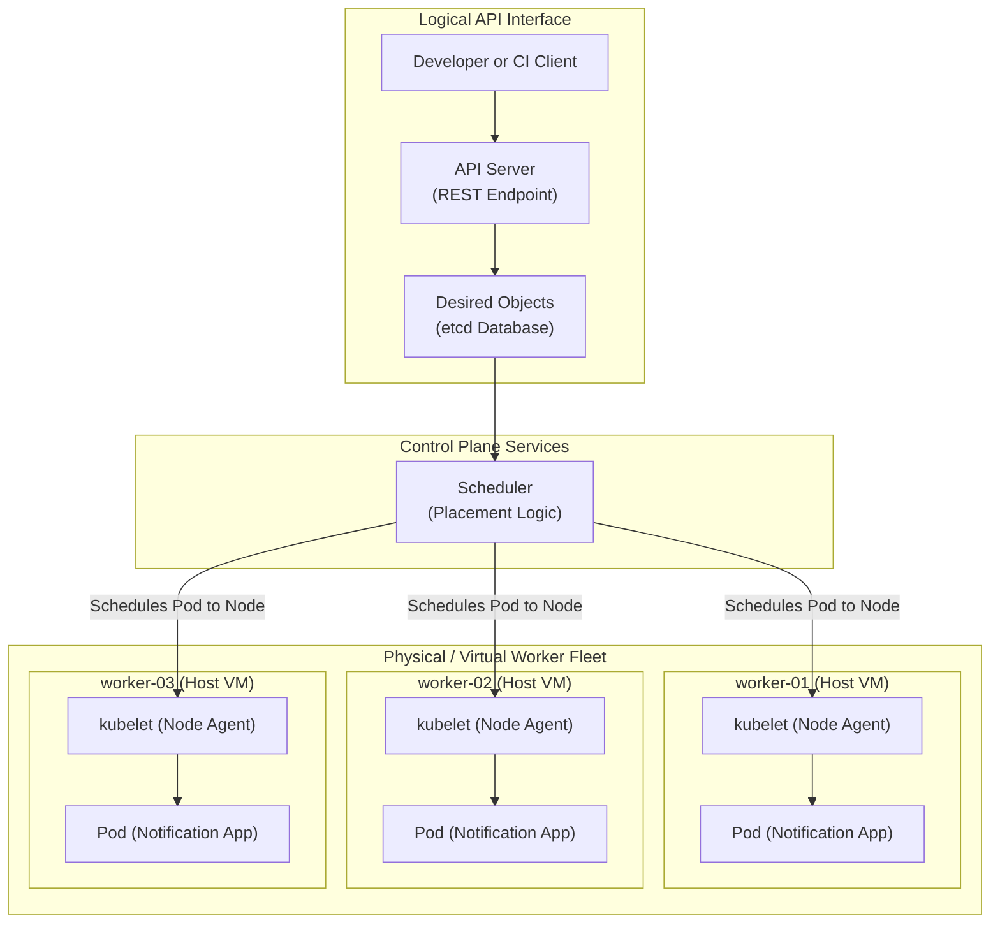
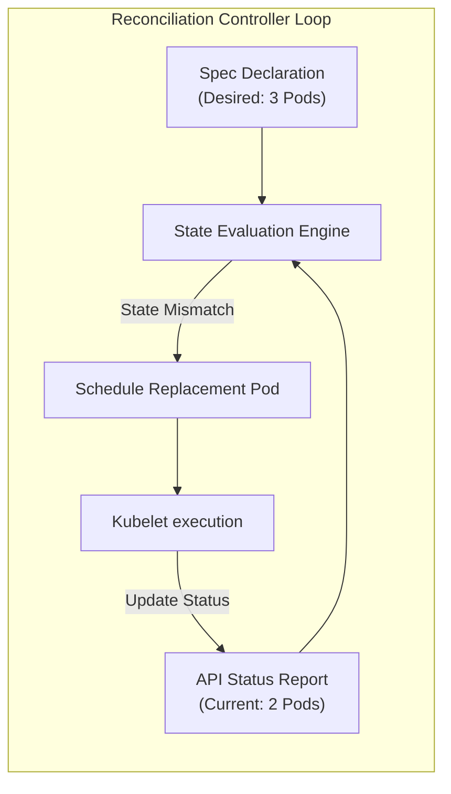
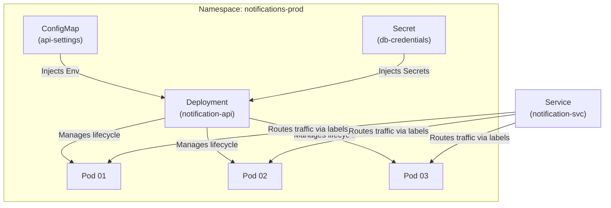

## Table of Contents

1. [After the First Container](#after-the-first-container)
2. [The Work Around the Container](#the-work-around-the-container)
3. [The First Kubernetes Words](#the-first-kubernetes-words)
4. [A Cluster as a Shared Runtime](#a-cluster-as-a-shared-runtime)
5. [The Kubernetes API](#the-kubernetes-api)
6. [Desired State](#desired-state)
7. [The Customer Notification Service Example](#the-customer-notification-service-example)
8. [When Kubernetes Helps](#when-kubernetes-helps)
9. [When Kubernetes Adds Too Much](#when-kubernetes-adds-too-much)
10. [Putting It All Together](#putting-it-all-together)
11. [What's Next](#whats-next)

## After the First Container

Kubernetes exists because a container image does not answer the production questions around that container.
An image gives you a repeatable package for your code and its dependencies, but it does not decide which server should run it, how many copies should exist, how traffic should reach those copies, or what should happen after a crash.
Example: the same `notification-api:1.4.2` image can run perfectly on a laptop, but production still needs three healthy copies, a stable network address, rollout controls, and a recovery path when a server disappears.

Docker simplifies the first half of this problem.
You compile your code, package it next to its dependencies in an image, and run it.
The container runs the same way on a laptop, a virtual machine, or a testing pipeline.
It encapsulates system libraries, environment definitions, and execution variables.
This consistency solves the classic problem of software failing due to minor host environment differences.

The next operational challenge appears when that container must serve real users.
Running a single container in a local terminal is easy to understand.
However, a production system has strict reliability commitments.
A production workload must remain healthy when a process crashes.
It must migrate away from a physical machine that suffers a hardware failure.
It must receive traffic through a stable address even when individual instances are replaced.
It must scale up to handle sudden traffic spikes and scale down to conserve computing costs.
It must also roll out software updates gradually to prevent deployment downtime.

You can solve these problems with custom bash scripts, systemd unit files, load balancers, and deployment pipelines.
Many engineering teams operated this way for decades.
However, managing these custom solutions becomes complex as platforms grow.
When you must coordinate dozens of services across multiple servers, custom scripts become brittle.
A single syntax error in a script can cause deployment failures or silent outages.

At its core, Kubernetes is a control system for running containers across multiple machines.
A control system is software that compares what you asked for with what is actually running, then makes changes until they match.
You describe the configuration you want through a unified HTTP API, and Kubernetes stores that request, chooses host servers, starts containers, and keeps checking whether they are still healthy.
Example: you can ask for three copies of the notification API, and if one host fails, Kubernetes starts a replacement copy on a healthy host.

This automation requires learning new operational terms.
This article introduces these terms conceptually before walking through practical cluster configuration.

## The Work Around the Container

To understand the coordination work, consider a concrete scenario.
Imagine a Customer Notification Service that sends SMS alerts and email receipts.
The service is compiled into a container image that listens on port `3000`.
It requires a connection string to query a backend database.
It also exposes a HTTP health endpoint at `/healthz` to report its internal status.

On a single Linux host, you might start the container with this command:

```bash
docker run -d \
  --name notification-api \
  -p 3000:3000 \
  -e DATABASE_URL=postgres://db.internal/notifications \
  ghcr.io/devpolaris/notification-api:1.4.2
```

This command runs the container successfully in the background.
However, it does not address several key production questions:

| Operating Question | Single-Host Answer | Fleet-Level Challenge |
| --- | --- | --- |
| Where does the process run? | You manually select the host server | The platform must choose dynamically from a pool |
| What if the process exits? | The local container engine restarts it | A replacement must be scheduled on a different healthy host |
| How do clients reach it? | Clients connect to the host IP and port | Containers move frequently, requiring stable discovery |
| How do we deploy updates? | You stop the old container and start the new one | Updates must roll out gradually with no traffic drops |
| Who can change the state? | Anyone with direct SSH access to the host | Teams require role-based access, reviews, and logs |

The container image is still the fundamental unit of deployment.
It provides the platform with a compiled, isolated package to run.
Kubernetes focuses entirely on the operational layer surrounding the container.
It manages scheduling, service discovery, configuration injection, progressive rollouts, and access control.

This is why container orchestration is typically introduced after mastering basic containerization.
If your main challenge is compiling and running an isolated app, Docker is the correct starting point.
If your main challenge is operating multiple services reliably across a fleet of servers, Kubernetes is required.

## The First Kubernetes Words

Kubernetes vocabulary is easiest to learn when each word is tied to a job in the running system.
A term like Pod, Service, or controller is not just a label in a YAML file.
It names one piece of the machinery that places containers, gives them addresses, keeps them healthy, or connects them to other resources.
Example: a Pod wraps the notification API container so Kubernetes can schedule it, while a Service gives that changing Pod set one stable name for clients.

We can introduce these terms by mapping them directly to the operational challenges outlined above:

| Kubernetes Term | Concept-First Technical Anchor | Practical Purpose |
| --- | --- | --- |
| Cluster | *a group of servers that Kubernetes manages as one runtime pool* | Provides shared CPU, memory, networking, and storage for applications |
| Node | *one physical or virtual server in the cluster* | Runs the container runtime that executes your workloads |
| Control Plane | *the API and coordination layer that stores requests and makes placement decisions* | Monitors cluster state and schedules containers to run |
| API Server | *the authenticated HTTP entry point for all cluster changes* | Validates and stores resource manifests in the cluster database |
| Pod | *the smallest Kubernetes wrapper around one or more containers* | Provides the network, storage, and lifecycle boundary Kubernetes manages |
| Controller | *a background loop that watches objects and fixes differences between requested and observed state* | Restores the system to your desired state when failures occur |
| Scheduler | *the component that chooses which node should run a Pod* | Evaluates resource requests to place workloads on healthy servers |

A Pod is the first unfamiliar concept for many developers.
Docker runs containers directly.
Kubernetes runs containers inside Pods.
The Pod adds an operational context around the container.
It configures shared IP addresses, storage volumes, resource allocations, and lifecycle policies.
When Kubernetes manages your application, it monitors Pods rather than raw containers.

The API Server is the central communications hub of the entire system.
You do not SSH into a worker node to start a production container.
Instead, you submit a declarative manifest to the API Server.
The API Server validates the request, writes it to persistent storage, and alerts the controllers.
The system then coordinates node placement and container startups automatically.

## A Cluster as a Shared Runtime

At its core, a Kubernetes cluster is a set of servers managed through one API.
The control plane is the coordination layer that stores requests and makes decisions, while worker nodes are the servers that run the actual containers.
The cluster exists so you can deploy workloads without manually choosing a host for every container.

For the Customer Notification Service, you do not manually allocate a server for each container.
Instead, you declare that three healthy copies of the application should run.
The control plane then selects the best hosts and initializes the workloads.



The diagram illustrates the separation of logical declarations and physical executions.
Clients communicate entirely with the logical API interface.
The scheduler distributes the workload to worker nodes.
The node agent on each worker host then runs the containers inside Pods.

This logical abstraction does not make physical hardware constraints disappear.
CPU cores, RAM gigabytes, network ports, and storage disks still live on real host servers.
However, the cluster provides a unified runtime surface.
It lets developers reason about applications as API resources while letting operators monitor host health.

This shared architecture allows several applications to run on the same hardware.
The Customer Notification Service Pods run alongside payment gateways, background jobs, and system agents.
Kubernetes uses labels, metadata, and namespaces to organize these resources.
This logical separation allows multiple teams to share a single pool of servers safely.

## The Kubernetes API

At its core, the Kubernetes API is the HTTP interface used to read and change cluster objects.
An API object is a stored record such as a Deployment, Pod, Service, ConfigMap, or Secret.
Command-line tools, CI/CD pipelines, dashboard interfaces, and internal controllers all communicate through this API, instead of logging into worker nodes with SSH.

Example: `kubectl apply -f deployment.yaml` sends a Deployment object to the API Server, and the cluster turns that stored object into running Pods.

This centralized design ensures every change is audited, authenticated, and validated.
When you submit a manifest, the API Server verifies your identity.
It then checks whether your configuration matches the required cluster schemas.
Once approved, it writes the resource state to etcd, the cluster's consistent metadata database.

You describe these resources using declarative configuration files.
For example, a Deployment resource manages a set of identical stateless Pods.
It defines the desired container image, scale, and configuration environment.

Here is a basic Deployment manifest for the Customer Notification Service:

```yaml
apiVersion: apps/v1
kind: Deployment
metadata:
  name: notification-api
  namespace: notifications-prod
spec:
  replicas: 3
  selector:
    matchLabels:
      app: notification-api
  template:
    metadata:
      labels:
        app: notification-api
    spec:
      containers:
        - name: api
          image: ghcr.io/devpolaris/notification-api:1.4.2
          ports:
            - containerPort: 3000
```

This manifest is declarative.
It does not contain commands to download images, initialize networks, or start processes.
Instead, it describes the target state that Kubernetes must create and maintain.

The top-level manifest fields follow a consistent API pattern:

- `apiVersion` specifies the schema version of the resource type.
- `kind` declares the type of resource being described.
- `metadata` stores the resource identity, including its name, namespace, and labels.
- `spec` defines the desired configuration and runtime state.

Within the `spec`, `replicas: 3` declares that three identical instances of the Pod must run.
The `selector` defines how the Deployment identifies the Pods it manages.
The `template` defines the Pod specification, specifying the container image and exposed network ports.
The cluster control plane takes this description and executes the actions required to match it.

## Desired State

At its core, desired state is the configuration you ask Kubernetes to maintain.
Current state is what the cluster reports is actually running right now.
Reconciliation is the repeated comparison between those two records, followed by a corrective action when they differ.

For our Customer Notification Service Deployment, the desired state is three healthy replicas.
If a worker node crashes, the actual number of running Pods drops to two.
The Deployment controller detects this difference during its next reconciliation loop.
It immediately requests the creation of a replacement Pod.
The scheduler selects a healthy worker node for the new Pod.
The kubelet agent on that node pulls the image, starts the container, and updates the API Server.



This continuous feedback loop is called reconciliation.
It is the core mechanical principle of Kubernetes.
The cluster operates as a self-healing system, constantly repairing hardware and process failures automatically.

However, a reconciliation loop will also faithfully enforce a broken configuration.
If you specify a non-existent container image tag, the controller will repeatedly attempt to run it.
The Pods will report an `ImagePullBackOff` status and fail to start.
The cluster is executing your instructions exactly as written.
To resolve the error, you must correct the deployment manifest and submit the update.

This architecture changes how you troubleshoot applications.
Instead of inspecting host server logs directly, you query the API Server for resource statuses:

```bash
kubectl get deployment notification-api -n notifications-prod
```

An output showing `READY 2/3` indicates that one Pod is failing to start.
Your next diagnostic step is to inspect that specific Pod's event logs, rather than checking the host server.

## The Customer Notification Service Example

The module's shared example is a Customer Notification Service, a small API that sends email receipts and SMS alerts for a product.
Using one realistic service gives each Kubernetes object a concrete job to perform instead of leaving the terms floating as abstract platform vocabulary.
Example: a notification API needs stable traffic routing, non-sensitive settings, sensitive database credentials, health checks, and multiple production replicas.

This application has a realistic, multi-tier layout:

- It listens on TCP port `3000` to receive client requests.
- It exposes a `/healthz` HTTP endpoint to report its runtime status.
- It reads non-sensitive settings, like log levels, from a ConfigMap.
- It reads sensitive database credentials from an API Secret.
- It must maintain three running instances in production for reliability.
- It receives client requests through a stable load-balanced Service endpoint.

In Kubernetes, this architecture is composed of several cooperative resources:

| Resource Type | Specific Job |
| --- | --- |
| Namespace | Scopes and isolates API resource names between teams |
| Deployment | Maintains the requested number of healthy, stateless application Pods |
| Pod | Encapsulates the application containers with networking and storage |
| Service | Provides a stable DNS name and load balancer for active Pods |
| ConfigMap | Injects non-sensitive environment variables and files into the containers |
| Secret | Injects sensitive passwords and credentials securely |

Understanding the relationships between these resources is the key to mastering Kubernetes.
A Namespace isolates the entire workspace.
The Deployment creates and updates the Pods.
The ConfigMap and Secret inject runtime configurations into the Pods.
Finally, the Service routes network traffic to the Pods using selector labels.



Rather than memorizing YAML schemas in isolation, focus on how these pieces connect.
Every resource owns a specific operational job.
Together, they form a highly resilient runtime for your application.

## When Kubernetes Helps

Kubernetes helps when the same operational problems repeat across several services and teams.
Its practical job is to replace one-off deployment scripts with a shared API for scheduling, recovery, rollout, networking, and policy.
Example: if the notification API, payment worker, and search indexer all need replicas, health checks, traffic routing, and controlled deployments, one cluster model can manage those patterns consistently.

Kubernetes brings significant automation, but it also introduces complexity.
A platform hosting a single simple website may not benefit from it.
However, a microservices fleet operated by multiple teams typically does.

The indicators that suggest Kubernetes is the correct tool include:

- **Consistent Deployment Pipelines**: A shared API prevents teams from writing custom deployment scripts.
- **Automated Scaling and Recovery**: The system automatically replaces failed processes and scales workloads.
- **Dynamic Service Discovery**: Workloads move between hosts seamlessly without manual DNS updates.
- **Unified Policy Enforcement**: Namespaces and role policies enforce security boundaries consistently.
- **Extensible Platform Automation**: Custom controllers can automate infrastructure and application tasks.

Kubernetes also provides a common platform language.
The same YAML manifests run on local testing clusters, staging clouds, and production datacenters.
While the physical infrastructure changes, the resource schemas remain identical.

For our Customer Notification Service, Kubernetes becomes valuable as the system expands.
When the notification API must coordinate with payment processors, workers, and indexers, consistency is critical.
A single, unified operations model simplifies platform management.

## When Kubernetes Adds Too Much

Kubernetes has a significant operational cost.
Operating a cluster requires managing networking layers, ingress gateways, storage bindings, and security rules.
Managed Kubernetes cloud offerings reduce control plane maintenance, but they do not eliminate workload complexity.
Example: a single marketing site that only needs one container and a public HTTPS endpoint may be easier to run on a managed container platform than inside a full Kubernetes cluster with namespaces, Services, Ingress, RBAC, and node capacity planning.

For smaller workloads, a simpler hosting model is often more efficient.
Virtual machines running systemd, serverless functions, or managed container platforms can provide excellent reliability.
These runtimes offer high uptime with significantly fewer operational concepts to manage.

Consider these hosting choices based on your operational needs:

| Hosting Option | Target Fit | Main Tradeoff |
| --- | --- | --- |
| Virtual Machine | A few simple services with stable traffic | Manual scaling, patching, and failover |
| Managed Container PaaS | Teams wanting simple container hosting | Limited control over scheduling and network routing |
| Kubernetes | Multi-service platforms with shared operational needs | High conceptual overhead and platform complexity |

Base your decision on your operational goals.
If you require shared scheduling, dynamic discovery, and policy enforcement across many services, Kubernetes is a strong choice.
If you need to host a simple application with minimal operational overhead, a simpler platform is often better.

## Putting It All Together

We began with a simple problem: running a container image in production requires significant operational work.
You must manage node placement, process recovery, networking traffic, and configuration updates.

Kubernetes solves this by providing a unified, declarative control system:

- **A Cluster**: Combines multiple servers into a single logical pool of compute resources.
- **An API Server**: Provides an authenticated, schema-validated gateway for all configurations.
- **Declarative Resources**: Describe the desired state of workloads, networking, and security.
- **Reconciliation Loops**: Compare actual status against desired spec and correct drift automatically.
- **Worker Nodes**: Execute the container processes inside Pod wrappers.

For our Customer Notification Service, you do not manage servers directly.
Instead, you declare the desired state using API resources.
The cluster then automates the scheduling, routing, and recovery of the application.

This declarative model guides the rest of this module.

## What's Next

In the next article, we will build on this mental model.
We will explore the architecture of the Kubernetes cluster in detail, checking how nodes, network plugins, and storage interfaces cooperate.

---

**References**

- [Kubernetes Overview](https://kubernetes.io/docs/concepts/overview/) - Official introduction to the Kubernetes system architecture and core design.
- [Kubernetes Components](https://kubernetes.io/docs/concepts/overview/components/) - Detailed reference of control plane and worker node processes.
- [Kubernetes Objects](https://kubernetes.io/docs/concepts/overview/working-with-objects/) - Official explanation of declarative specs, statuses, and metadata keys.
- [Reconciliation Architecture](https://kubernetes.io/docs/concepts/architecture/controller/) - Systems-level description of controller loops and state synchronization.
- [Node Management](https://kubernetes.io/docs/concepts/architecture/nodes/) - Reference of node lifecycles, kubelet agents, and container runtime states.
