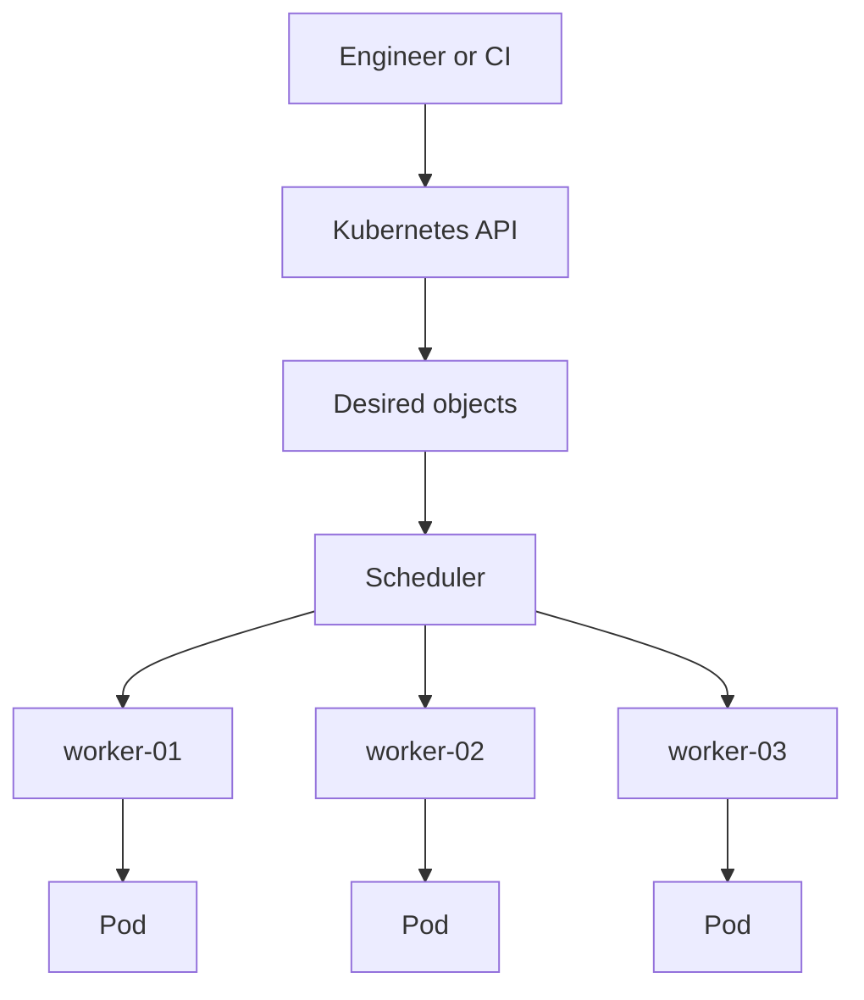
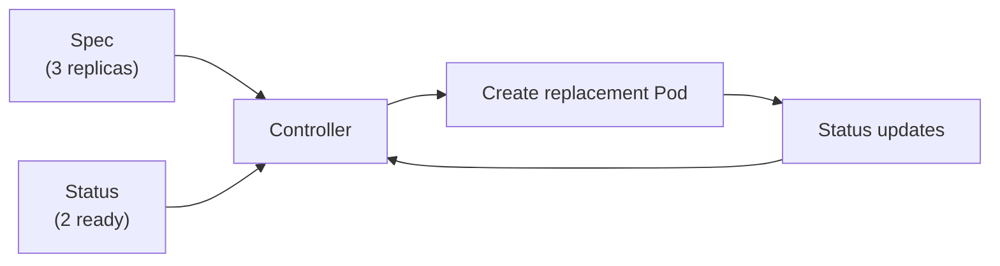
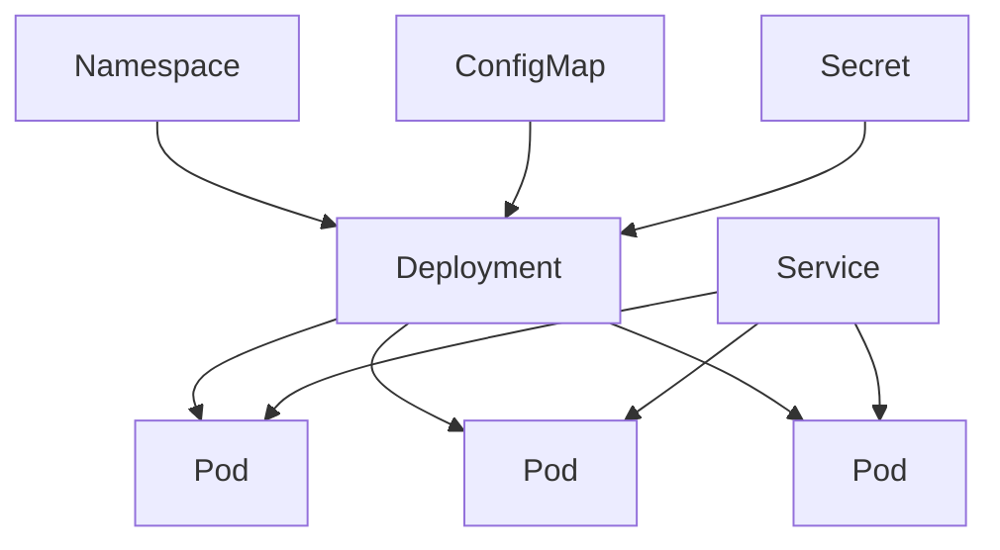

## Table of Contents

1. [After the First Container](#after-the-first-container)
2. [The Work Around the Container](#the-work-around-the-container)
3. [The First Kubernetes Words](#the-first-kubernetes-words)
4. [A Cluster as a Shared Runtime](#a-cluster-as-a-shared-runtime)
5. [The Kubernetes API](#the-kubernetes-api)
6. [Desired State](#desired-state)
7. [The devpolaris-api Example](#the-devpolaris-api-example)
8. [When Kubernetes Helps](#when-kubernetes-helps)
9. [When Kubernetes Adds Too Much](#when-kubernetes-adds-too-much)
10. [Putting It All Together](#putting-it-all-together)
11. [What's Next](#whats-next)

## After the First Container

Docker makes the first step feel clean. You build an image for `devpolaris-api`, run it on your laptop, and the same image can run in CI or on a Linux server. The runtime, application files, environment assumptions, and startup command are now packaged together. That solves a real problem.

The next problem appears when the container has to serve real users. One process on one machine is easy to understand. A production service has more promises attached to it:

- It should keep running when a process exits.
- It should move away from a machine that is unhealthy.
- It should have a stable address even when individual containers change.
- It should roll out a new version without replacing every copy at once.
- It should expose enough status for engineers to see what happened.

You can solve those problems with scripts, SSH, systemd, load balancers, cron jobs, deployment tooling, and careful runbooks. Many teams did that for years. Kubernetes exists because those pieces become hard to coordinate when a platform has many services, many machines, and many teams changing them.

Kubernetes is a system for running containerized applications across a group of machines. You describe the state you want through the Kubernetes API. The cluster stores that description, chooses machines for the work, starts containers, gives workloads network identities, and keeps checking whether the real system still matches the requested state.

That sentence includes many new words. The rest of this article unpacks them slowly.

## The Work Around the Container

Start with a small service. The `devpolaris-api` image listens on port `3000`, connects to a database, and exposes a health endpoint at `/healthz`.

On one server, the operating model might look like this:

```bash
$ docker run -d \
  --name devpolaris-api \
  -p 3000:3000 \
  -e DATABASE_URL=postgres://db.internal/devpolaris \
  ghcr.io/devpolaris/api:1.4.2
```

That command proves the image can run. It does not answer the questions that appear when the service becomes important.

| Question | Single-server answer | Fleet-level problem |
| --- | --- | --- |
| Where does the process run? | On the server you chose | The platform must choose among many machines |
| What if the process exits? | Restart it locally | A replacement may need a different healthy machine |
| How do clients find it? | Use the host address and port | Containers move, so clients need a stable name |
| How is a new version released? | Stop the old one and start the new one | Several copies may need gradual replacement |
| Who can change it? | Whoever can access the host | Teams need review, permissions, and an API trail |

The container image is still valuable. It gives the platform a portable unit to run. Kubernetes focuses on the surrounding operating work: placement, replacement, health, networking, configuration, rollout, and access control.

This is why Kubernetes usually appears after a team already understands containers. If the main problem is packaging an app, Docker is the first tool to learn. If the main problem is operating many containerized services consistently, Kubernetes starts to make sense.

## The First Kubernetes Words

Kubernetes has a lot of nouns. Start by tying the first few to the operating work from the previous section.

| Term | Plain meaning | Why it exists |
| --- | --- | --- |
| Cluster | The whole Kubernetes environment | Gives the team one place to run and inspect workloads |
| Node | A machine in the cluster | Provides real CPU, memory, disk, and network capacity |
| Control plane | The coordinating part of the cluster | Stores requested state and tells other components what needs to happen |
| Kubernetes API | The HTTP API exposed by the control plane | Gives humans and automation one normal way to read and change cluster objects |
| Pod | The runnable wrapper around one or more containers | Gives Kubernetes a unit it can place, start, watch, and replace |
| Controller | A loop that watches cluster state | Repairs gaps between what you requested and what is currently true |
| Scheduler | The component that chooses a node for a Pod | Places work on a machine with suitable capacity and constraints |

A Pod deserves special attention because it is usually the first unfamiliar object. Docker runs containers. Kubernetes runs containers inside Pods. The Pod adds Kubernetes context around the container: labels, networking, volumes, health checks, resource requests, and status. Later articles explain Pods in detail, but this first distinction matters now. When Kubernetes says a workload is running, it is usually reporting on Pods, not raw Docker containers.

The API is the other early idea to slow down on. You do not normally SSH to a worker machine and start production containers by hand. You send a request to the Kubernetes API. The API stores an object that describes what should exist. Other components watch those objects and do the work needed to make them real.

## A Cluster as a Shared Runtime

A Kubernetes cluster is a group of machines managed through one control plane. The machines that run application containers are called nodes. The control plane stores desired state and coordinates work. A node runs Pods, which are the smallest application units Kubernetes schedules.

For `devpolaris-api`, the team should not need to choose a specific machine for every release. The team should be able to say, "run three healthy copies of this image," and let the cluster find suitable nodes.



The diagram shows the first important split. Humans and automation talk to the API. The API stores objects. The scheduler chooses nodes. The nodes run Pods.

This does not make physical machines disappear. CPU, memory, disk, and network capacity still live on real nodes. A cluster gives the team one shared runtime surface for those machines. It lets engineers reason about applications as Kubernetes objects while still exposing enough detail to debug node-level failures.

The word "shared" is important. A cluster can run several applications for several teams. The `devpolaris-api` Pods may run next to `devpolaris-web`, background workers, monitoring agents, and internal tools. Kubernetes needs objects and labels because it has to keep those workloads separate enough to manage, while still running them on a common pool of machines.

## The Kubernetes API

The Kubernetes API is the center of the system. `kubectl`, CI jobs, dashboards, controllers, and operators all talk to it. Normal cluster changes go through this API instead of through direct SSH sessions to worker nodes.

That design gives the platform one place to validate requests, check permissions, store objects, and report status. If a developer applies a Deployment, the API server can check the object shape, authorize the caller, store the requested state, and make it visible to controllers.

A Deployment is a Kubernetes object for running multiple copies of a stateless application. It does not contain the running process itself. It contains the request that says how many Pods should exist and what container those Pods should run.

A small Deployment begins like this:

```yaml
apiVersion: apps/v1
kind: Deployment
metadata:
  name: devpolaris-api
  namespace: devpolaris-prod
spec:
  replicas: 3
  selector:
    matchLabels:
      app: devpolaris-api
  template:
    metadata:
      labels:
        app: devpolaris-api
    spec:
      containers:
        - name: api
          image: ghcr.io/devpolaris/api:1.4.2
          ports:
            - containerPort: 3000
```

This file is not a script. It does not say, "SSH to worker-02, pull this image, then start it." It describes an object the cluster should maintain.

The top-level fields are the first YAML pattern to recognize:

| Field | Meaning |
| --- | --- |
| `apiVersion` | Which Kubernetes API version defines this object shape |
| `kind` | What kind of object this is |
| `metadata` | Name, namespace, labels, and other identity data |
| `spec` | The state you want Kubernetes to create or maintain |

Inside the `spec`, `replicas: 3` asks for three Pods. The `selector` says which Pods belong to this Deployment. The `template` is the pattern used to create each Pod. The container image inside the template is the same kind of image you would run with Docker, but Kubernetes now owns the surrounding lifecycle.

The fields matter because they become part of the API object. A reviewer can inspect them. A controller can watch them. A status report can show whether the cluster has reached them.

## Desired State

Kubernetes works through desired state. You describe what should exist, and the cluster keeps comparing that request with what currently exists.

For the Deployment above, desired state includes three replicas of `ghcr.io/devpolaris/api:1.4.2`. If one Pod exits, the current state has only two running copies. A controller notices the gap and creates another Pod. The scheduler chooses a node for that Pod. The kubelet, which is the node agent, starts the container and reports status back to the API.



This loop is called reconciliation. It is one of the main ideas behind Kubernetes. The cluster runs as a continuing control loop. It keeps watching. If current state drifts from desired state, controllers try to correct it.

The loop is useful when the desired state is correct. It can also repeat a bad request. If the Deployment points at an image tag that does not exist, Kubernetes may keep trying to pull that image and keep reporting `ImagePullBackOff`. The cluster is doing what you asked. The request needs correction.

That detail changes how you debug Kubernetes. You inspect both the request and the report:

```bash
$ kubectl get deployment devpolaris-api -n devpolaris-prod
NAME             READY   UP-TO-DATE   AVAILABLE   AGE
devpolaris-api   2/3     3            2           18d
```

`READY 2/3` tells you the cluster has not reached the desired replica count. The next question is why the third Pod is not ready, not whether the YAML file exists.

## The devpolaris-api Example

This Kubernetes module uses one running example so the pieces connect. Picture a service named `devpolaris-api`.

The service has a simple shape:

- It listens on port `3000`.
- It exposes `GET /healthz`.
- It reads non-secret settings from a ConfigMap.
- It reads credentials from a Secret.
- It should run three copies in production.
- It should receive traffic through a stable Service.

In Kubernetes, the first version of that application might involve several objects:

| Object | Job |
| --- | --- |
| Namespace | Groups related namespaced objects under one scope |
| Deployment | Keeps the requested number of Pods running |
| Pod | Wraps the application container so Kubernetes can run and watch it |
| Service | Gives moving Pods a stable network name |
| ConfigMap | Holds non-secret configuration, such as log level or feature flags |
| Secret | Holds sensitive configuration, such as passwords or tokens |

The important point is the relationship between these objects. A Deployment creates Pods from a template. A Service selects Pods by labels. ConfigMaps and Secrets feed configuration into Pods. A Namespace gives namespaced objects a scope.



Kubernetes becomes easier to read when you trace these relationships instead of memorizing object names in isolation. Later articles will slow down and explain each object. For now, the useful habit is to ask what job each object owns.

## When Kubernetes Helps

Kubernetes is most useful when the same operating problems repeat across services. A platform with one small API may not need it. A platform with many services, background workers, internal tools, and shared runtime rules often does.

The signs are practical:

| Signal | Why Kubernetes can help |
| --- | --- |
| Many services need the same deploy pattern | A shared API and workload model reduce one-off scripts |
| Services need gradual rollout and rollback | Deployments can replace Pods in controlled steps |
| Workloads move across machines | Services and DNS give clients stable names |
| Teams need consistent runtime rules | Namespaces, RBAC, policies, and admission can enforce boundaries |
| Platform automation matters | Controllers can watch API objects and take action |

Kubernetes is also useful when teams need a common language across environments. The same basic objects appear in local learning clusters, staging clusters, production clusters, and managed cloud clusters. The surrounding infrastructure changes, but the core API model remains recognizable.

For DevPolaris, Kubernetes would make more sense when `devpolaris-api`, `devpolaris-web`, `devpolaris-worker`, search indexing, background jobs, and internal admin tools all need one deployment and operations model. The benefit comes from consistency across the platform.

## When Kubernetes Adds Too Much

Kubernetes brings a real operating cost. The team must understand cluster access, node capacity, networking, storage, security, workload identity, health checks, admission policies, upgrades, and observability. Managed Kubernetes services reduce control plane maintenance, but they do not remove workload operations.

A simpler runtime can be a better fit when the app is small and the team mainly needs hosting. A VM with systemd, a container app platform, a serverless function, or a managed application service may give enough reliability with fewer concepts to operate.

| Runtime choice | Good fit | Main cost |
| --- | --- | --- |
| VM with Docker | One or two services with simple traffic | Manual failover and scaling |
| PaaS or container app service | Teams that want managed app hosting | Less control over scheduling and cluster behavior |
| Kubernetes | Many services with shared platform needs | More concepts and more operational responsibility |

This decision should be based on the work the platform must do. If the team needs shared scheduling, service discovery, rollout control, and policy across many services, Kubernetes can be a strong foundation. If the team needs to host one low-traffic app, a smaller platform may be the cleaner choice.

## Putting It All Together

The opening problem was simple: a container image is ready, but production needs more than a running process. The service needs placement, replacement, traffic, configuration, rollout, and status.

Kubernetes answers that problem by giving the team:

- A cluster: many machines managed through one control plane.
- An API: one place for normal changes, validation, permissions, and status.
- Objects: records that describe the workloads, networking, configuration, and boundaries the team wants.
- Controllers: loops that compare desired state with current state and take corrective action.
- Nodes: real machines where Pods run.

For `devpolaris-api`, the first Kubernetes lesson is not every YAML field. The first lesson is the operating model. You describe the service through API objects, then inspect whether the cluster reached that requested state.

That habit will carry through the rest of the module.

## What's Next

The next article builds the cluster mental model in more detail. It explains how nodes, Pods, Services, labels, and capacity fit together when a real application runs inside a Kubernetes cluster.

---

**References**

- [Kubernetes overview](https://kubernetes.io/docs/concepts/overview/) - Official introduction to the Kubernetes system model and core concepts.
- [Kubernetes Components](https://kubernetes.io/docs/concepts/overview/components/) - Official description of control plane and node components.
- [Objects in Kubernetes](https://kubernetes.io/docs/concepts/overview/working-with-objects/) - Official explanation of Kubernetes objects, specs, status, and manifests.
- [Controllers](https://kubernetes.io/docs/concepts/architecture/controller/) - Official explanation of reconciliation loops and controller behavior.
- [Nodes](https://kubernetes.io/docs/concepts/architecture/nodes/) - Official description of worker nodes and the components that run Pods.
