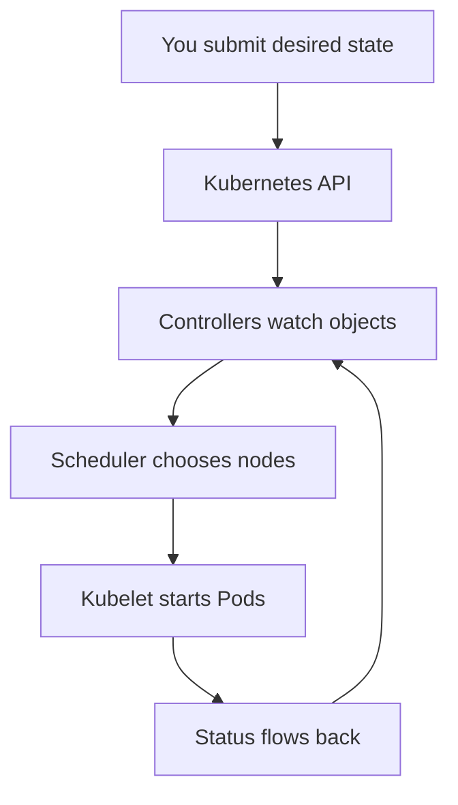

## Table of Contents

1. [The Problem After the First Container](#the-problem-after-the-first-container)
2. [From One Host to a Fleet](#from-one-host-to-a-fleet)
3. [What Kubernetes Adds](#what-kubernetes-adds)
4. [The devpolaris-orders-api Example](#the-devpolaris-orders-api-example)
5. [The Shared API as the Center](#the-shared-api-as-the-center)
6. [Self-Healing and Replacement](#self-healing-and-replacement)
7. [When Kubernetes Is Too Much](#when-kubernetes-is-too-much)
8. [First Failure Mode: The Image Runs, but the Service Does Not](#first-failure-mode-the-image-runs-but-the-service-does-not)
9. [What to Practice First](#what-to-practice-first)

## The Problem After the First Container

Containers make application packaging feel tidy. You put the Node.js runtime, the compiled code, and the startup command for `devpolaris-orders-api` into an image. The image runs the same way on your laptop, in CI, and on a Linux server. That is a big step forward from a server that only works because one person installed the right package by hand last year.

The next problem appears when the image needs to serve real users. One container on one host is a process. A production service is a promise: the API should keep running when a process exits, move away from a broken machine, receive traffic through a stable address, roll out new versions without dropping every request, and expose enough state for operators to diagnose problems. Docker gives you the package and the local runtime. It does not, by itself, decide where the package should run across a fleet of machines.

Kubernetes is a platform for managing containerized workloads and services. It gives you one API for describing what should exist, then uses controllers to keep the real cluster close to that description. A controller is a loop that watches the system and takes action when current state differs from desired state. If that sounds similar to Terraform's plan and apply loop, the connection is useful: both tools care about declared state, but Kubernetes keeps reconciling while the system is running.

This article uses `devpolaris-orders-api`, a small HTTP API that accepts orders and writes order events to a backing service. The example stays intentionally simple. The goal is not to deploy every Kubernetes object yet. The goal is to understand why teams reach for Kubernetes before you start memorizing object names.

## From One Host to a Fleet

Imagine the team starts with a single Linux VM. A Docker container runs on port `3000`, Nginx forwards traffic, and systemd restarts the container when the host reboots. That setup can be perfectly reasonable for a small internal app. You can inspect it with familiar Linux commands, and the operating model fits in one person's head.

```text
internet
  |
  v
nginx on vm-orders-01
  |
  v
container: devpolaris-orders-api:1.4.2
```

The pressure begins when the service needs more than one host. Maybe the API receives more traffic during a course launch. Maybe the team wants staging and production to behave the same way. Maybe one host needs kernel patching while the service stays online. Each new host adds questions that a single Docker command does not answer.

| Question | Single-host habit | Fleet problem |
|----------|-------------------|---------------|
| Where should the container run? | You SSH to one machine | The system must choose among many machines |
| What if it exits? | systemd restarts it locally | Replacement may need a different healthy machine |
| How does traffic find it? | Nginx points to localhost | The address must survive container movement |
| How do you roll out safely? | Replace the container | Several copies may need gradual replacement |
| Who can change it? | Whoever has SSH | Changes need an API, review, and permissions |

Kubernetes exists in that fleet problem. It is not mainly a nicer way to type `docker run`. It is a way to make many machines behave like one managed pool, while still giving you enough hooks to inspect the real containers when something goes wrong.

## What Kubernetes Adds

Kubernetes adds a few core ideas on top of containers. The first is scheduling. Scheduling means choosing a node, which is a machine in the cluster, for a workload. A workload is application work the cluster should run, such as the Pods behind `devpolaris-orders-api`. The scheduler looks at requested CPU and memory, node health, constraints, and existing load before choosing a place to run the Pod.

The second idea is a stable object model. Instead of telling one host to start one process, you send a resource object to the Kubernetes API. A resource object is structured data, usually YAML, that describes something you want in the cluster. A Deployment can say "keep three copies of this API running." A Service can say "give these copies a stable network name." A Namespace can say "put this team's objects in a named scope."

The third idea is continuous repair. Kubernetes components watch the API and compare desired state with current state. If a Pod disappears because a node fails, Kubernetes can create a replacement. If you update the image tag in a Deployment, Kubernetes can roll the new version out gradually. If a container fails its health check, Kubernetes can stop sending traffic to it.



The loop in the diagram is the reason Kubernetes feels different from a shell script. A shell script runs and exits. Kubernetes keeps watching. That can be helpful, but it also means you must learn to inspect both the thing you asked for and the status Kubernetes reports back.

## The devpolaris-orders-api Example

For the rest of this module, picture a service named `devpolaris-orders-api`. The container image has already been built by CI and pushed to a registry. The API listens on port `3000`, exposes `GET /healthz`, and needs two environment variables: `DATABASE_URL` and `ORDER_EVENTS_TOPIC`.

The service might start as one manual container:

```bash
$ docker run -d \
  --name devpolaris-orders-api \
  -p 3000:3000 \
  -e DATABASE_URL=postgres://orders-prod.example.internal/orders \
  -e ORDER_EVENTS_TOPIC=orders.created \
  ghcr.io/devpolaris/orders-api:1.4.2
9f2fd7c51f3a
```

That command is useful because it proves the image can run. It is not a durable operating model for a team. The command does not record who approved the environment variable, how much memory the service needs, what should happen when the host fails, or which copy should receive traffic during a rollout.

In Kubernetes, the same intent starts to move into objects. A later article will teach Deployments and Pods in depth, but this small sketch shows the shape:

```yaml
apiVersion: apps/v1
kind: Deployment
metadata:
  name: devpolaris-orders-api
  namespace: orders-prod
spec:
  replicas: 3
  selector:
    matchLabels:
      app: devpolaris-orders-api
  template:
    metadata:
      labels:
        app: devpolaris-orders-api
    spec:
      containers:
        - name: api
          image: ghcr.io/devpolaris/orders-api:1.4.2
          ports:
            - containerPort: 3000
```

The YAML is not the point by itself. The point is that the team's desired state can be reviewed, applied, watched, and repaired through one API. A reviewer can see that production should run three copies. An operator can ask the cluster whether those three copies exist. A controller can create a replacement when reality drifts away from the description.

## The Shared API as the Center

The Kubernetes API server is the front door of the cluster. `kubectl`, controllers, dashboards, CI jobs, and operators all talk to that API. This design matters because it gives the team one consistent place to validate, store, watch, and authorize changes.

Without a shared API, each automation script invents its own view of the system. One script might SSH to hosts and run Docker. Another might edit an Nginx upstream file. A third might query a cloud load balancer. During an incident, the team has to piece together which tool last changed which machine. Kubernetes does not remove every source of complexity, but it does put the cluster's intended objects and reported status behind one API.

You can see that API-centered habit in ordinary commands:

```bash
$ kubectl get deployments -n orders-prod
NAME                    READY   UP-TO-DATE   AVAILABLE   AGE
devpolaris-orders-api   3/3     3            3           18d

$ kubectl get pods -n orders-prod -l app=devpolaris-orders-api
NAME                                     READY   STATUS    RESTARTS   AGE
devpolaris-orders-api-6d8f7d9f8c-2k9sl   1/1     Running   0          3h
devpolaris-orders-api-6d8f7d9f8c-h6p8d   1/1     Running   0          3h
devpolaris-orders-api-6d8f7d9f8c-xr4mf   1/1     Running   0          3h
```

The first command asks for the higher-level object, the Deployment. The second asks for the Pods selected by its label. A label is a key-value tag on a Kubernetes object, similar to tags on cloud resources or metadata on a GitHub issue. Labels let controllers and humans find related objects without relying on one long name.

## Self-Healing and Replacement

Self-healing means Kubernetes can notice certain failures and take replacement actions. It does not mean the cluster understands your business logic. Kubernetes can restart a crashing container, create a new Pod when a node disappears, and avoid sending traffic to a Pod that fails a readiness check. It cannot decide whether an order was charged twice or whether a database migration is safe.

For `devpolaris-orders-api`, a useful self-healing story begins with replicas. If production should have three Pods and one Pod exits, the Deployment controller notices the mismatch. It asks the API server to create another Pod. The scheduler finds a node. The kubelet on that node asks the container runtime to start the container.

```text
Desired state:
  Deployment devpolaris-orders-api wants 3 replicas

Current state after one Pod exits:
  Running Pods: 2

Controller action:
  Create 1 replacement Pod
```

This is the part people often describe as "Kubernetes keeps apps running." A more precise version is: Kubernetes keeps the cluster close to the desired state you described, within the limits of available capacity, correct configuration, healthy nodes, and working application images.

That precision matters during diagnosis. If the image name is wrong, Kubernetes may keep trying forever and still never get a running Pod. If the container starts but cannot connect to the database, Kubernetes can restart it, but the replacement will have the same broken configuration. Repair loops are useful only when the desired state is valid.

## When Kubernetes Is Too Much

Kubernetes solves real problems, but it also creates a new operating surface. A team must understand cluster upgrades, RBAC, networking, admission policies, storage classes, controller behavior, observability, and cost. Managed Kubernetes reduces the burden of running the control plane, but it does not remove the need to operate the workloads and the cluster configuration.

A small static site or one low-traffic API may be better served by a platform service, a VM with systemd, a container app service, or a serverless runtime. Those options can be easier to secure and explain. The tradeoff is less control over scheduling, networking, custom controllers, and multi-service platform patterns.

| Option | Good fit | Tradeoff |
|--------|----------|----------|
| Single VM with Docker | One service, low team size, simple networking | Manual scaling and failover |
| PaaS or container app service | Teams that want less platform work | Less control over cluster internals |
| Kubernetes | Many services, shared platform needs, custom automation | More concepts and operational responsibility |

For `devpolaris-orders-api`, Kubernetes starts to make sense when it is part of a wider platform: orders, payments, notifications, course access, background workers, and internal tools all need consistent deployment, networking, secrets, and observability. The value comes from a shared operating model, not from putting one container into a more fashionable box.

Here is a practical decision test for a small team considering Kubernetes for the first time:

| Signal | Kubernetes is probably helpful when | A simpler platform may be better when |
|--------|-------------------------------------|---------------------------------------|
| Service count | Many services need the same deployment model | One or two apps need hosting |
| Team needs | Several teams need shared runtime rules | One team owns the whole stack |
| Rollouts | Gradual replacement and rollback matter often | Manual release windows are acceptable |
| Extensibility | Custom controllers or policies are valuable | Built-in platform features are enough |
| Operations | The team can own cluster-level learning | The team mainly needs app hosting |

This table is not a scoring system. It is a way to keep the decision honest. Kubernetes is valuable when its shared operating model removes repeated work across services. It is expensive when it becomes a platform project for a workload that did not need one.

## First Failure Mode: The Image Runs, but the Service Does Not

A common beginner failure is assuming that a successful image build means Kubernetes will run the service successfully. The image can be valid while the cluster cannot pull it, the app cannot start, or the service cannot become ready. The first diagnostic path is to inspect status before changing YAML.

```bash
$ kubectl get pods -n orders-prod -l app=devpolaris-orders-api
NAME                                     READY   STATUS             RESTARTS   AGE
devpolaris-orders-api-7bb7f99d9f-pv5ng   0/1     ImagePullBackOff   0          4m12s
```

`ImagePullBackOff` means the kubelet tried to pull the image and backed off after failures. The next useful command is `describe`, because it shows events attached to the Pod.

```bash
$ kubectl describe pod devpolaris-orders-api-7bb7f99d9f-pv5ng -n orders-prod
Events:
  Type     Reason     Age                  From               Message
  ----     ------     ----                 ----               -------
  Normal   Scheduled  4m20s                default-scheduler  Successfully assigned orders-prod/devpolaris-orders-api-7bb7f99d9f-pv5ng to worker-02
  Normal   Pulling    3m58s                kubelet            Pulling image "ghcr.io/devpolaris/orders-api:1.4.3"
  Warning  Failed     3m57s                kubelet            Failed to pull image "ghcr.io/devpolaris/orders-api:1.4.3": not found
  Warning  BackOff    22s (x6 over 3m20s)  kubelet            Back-off pulling image "ghcr.io/devpolaris/orders-api:1.4.3"
```

This output tells you the scheduler did its job. The Pod was assigned to `worker-02`. The failure moved to the kubelet and registry boundary. A reasonable fix direction is to check whether CI pushed `ghcr.io/devpolaris/orders-api:1.4.3`, whether the tag is spelled correctly, and whether the namespace has the right image pull secret for private images.

If the status is `CrashLoopBackOff`, the diagnostic path changes. Now the image was pulled and the container started, but the process exited repeatedly. You would inspect logs:

```bash
$ kubectl logs -n orders-prod deploy/devpolaris-orders-api
2026-05-07T09:18:42.104Z starting devpolaris-orders-api
2026-05-07T09:18:42.271Z error missing required env var DATABASE_URL
```

Kubernetes can restart that container many times, but every restart uses the same missing environment variable. The fix is not "restart harder." The fix is to correct the desired state so the Pod receives the configuration it needs.

The two failures look similar to users because the API is unavailable either way. They are different operationally:

| Symptom | What already worked | Next useful evidence |
|---------|---------------------|----------------------|
| `ImagePullBackOff` | Scheduling happened | Pod events and registry tag |
| `CrashLoopBackOff` | Image pulled and process started | Container logs, especially `--previous` |
| `Pending` | Object was accepted by the API | Scheduler events and node capacity |
| Service returns 503 | Some Service path exists | Endpoints and readiness status |

This is why Kubernetes beginners should avoid changing several things at once. A changed image tag, a changed Secret name, and a changed resource request can all create different failure shapes. Make one intended change, read the status, then follow the evidence.

## What to Practice First

The first Kubernetes skill is not writing perfect YAML. It is learning to ask clear questions of the cluster. What object did I create? What status did Kubernetes report? Which component is currently blocked? What event or log line proves that?

For `devpolaris-orders-api`, practice following the chain from Deployment to ReplicaSet to Pod to container logs. You do not need to know every field yet. You need to know that Kubernetes resources form relationships, and status usually lives on the object closest to the failure.

```bash
$ kubectl get deployment devpolaris-orders-api -n orders-prod
$ kubectl get rs -n orders-prod -l app=devpolaris-orders-api
$ kubectl get pods -n orders-prod -l app=devpolaris-orders-api
$ kubectl describe pod <pod-name> -n orders-prod
$ kubectl logs <pod-name> -n orders-prod
```

That sequence is a beginner-friendly diagnostic path. It starts with the desired application object, then moves toward the actual running container. Later articles will add Services, ConfigMaps, Secrets, probes, rollout history, and resource requests. Keep the first habit simple: look at desired state, current state, events, then logs.

You can record that habit as a short checklist in a pull request or incident note:

```text
Target:
  Cluster: devpolaris-prod
  Namespace: orders-prod
  Workload: deployment/devpolaris-orders-api

Expected:
  3 ready replicas
  image ghcr.io/devpolaris/orders-api:1.4.2
  Service has ready endpoints

Verified:
  Deployment READY is 3/3
  Pods are spread across worker-01, worker-02, worker-03
  /healthz is passing through readiness probe
```

That level of evidence is more useful than saying "Kubernetes looks fine." It names the target, the expected state, and the checks that support the claim. It also gives the next teammate a starting point if the service fails again.

One final practice is to compare what Kubernetes says with what users experience. A Deployment can show `3/3` ready while an upstream gateway, DNS record, or application dependency is still broken. Kubernetes is responsible for the cluster objects you described, not every outside dependency your service uses.

```text
Cluster evidence:
  Deployment READY is 3/3
  Service has endpoints
  Pod logs show the server started

User evidence:
  GET https://orders.devpolaris.example/healthz returns 502

Next boundary:
  Inspect ingress, gateway, or external load balancer routing
```

That boundary keeps the platform in proportion. Kubernetes can tell you whether the Pods and Services look healthy inside the cluster. You still need normal HTTP, DNS, database, and application diagnostics around it.

That mix of cluster evidence and ordinary service evidence is the real work.

---

**References**

- [Kubernetes Overview](https://kubernetes.io/docs/concepts/overview/) - Official overview of what Kubernetes is, why it exists, and which platform capabilities it provides.
- [Kubernetes Components](https://kubernetes.io/docs/concepts/overview/components/) - Official component map for the control plane, nodes, kubelet, scheduler, and related pieces.
- [Controllers](https://kubernetes.io/docs/concepts/architecture/controller/) - Official explanation of control loops and desired state in Kubernetes.
- [Deployments](https://kubernetes.io/docs/concepts/workloads/controllers/deployment/) - Official guide to the workload object used for stateless application rollout and replacement.
