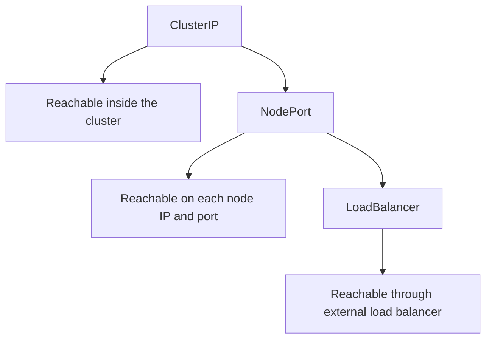

## Table of Contents

1. [One Service API, Three Exposure Shapes](#one-service-api-three-exposure-shapes)
2. [ClusterIP for Internal Contracts](#clusterip-for-internal-contracts)
3. [NodePort for Direct Node Entry](#nodeport-for-direct-node-entry)
4. [LoadBalancer for Infrastructure Integration](#loadbalancer-for-infrastructure-integration)
5. [Choosing by Audience](#choosing-by-audience)
6. [Failure Mode: Pending External IP](#failure-mode-pending-external-ip)
7. [Failure Mode: NodePort Opens More Than Intended](#failure-mode-nodeport-opens-more-than-intended)
8. [A Safe Exposure Progression](#a-safe-exposure-progression)
9. [Production Review Questions](#production-review-questions)
10. [Evidence to Keep During Changes](#evidence-to-keep-during-changes)

## One Service API, Three Exposure Shapes

After you understand that a Service gives Pods a stable identity, the next question is where that identity should be reachable from. Kubernetes answers that with Service types. The type does not change the application code in `devpolaris-orders-api`; it changes how far Kubernetes publishes the Service.

`ClusterIP` is the default. It creates a cluster-internal virtual IP and DNS name. `NodePort` builds on that and opens a high port on every node. `LoadBalancer` builds on those ideas and asks the cloud provider or load balancer implementation to create an external load balancer.



The safe default for most backend APIs is `ClusterIP`. You can still expose that backend through Ingress or Gateway API later. Starting with the narrowest useful exposure keeps accidental public access out of the first design.

## ClusterIP for Internal Contracts

A `ClusterIP` Service is for callers inside the cluster. It is the right shape when `devpolaris-web`, background workers, or another API needs to call `devpolaris-orders-api` without leaving the Kubernetes network.

```yaml
apiVersion: v1
kind: Service
metadata:
  name: devpolaris-orders-api
  namespace: orders
spec:
  type: ClusterIP
  selector:
    app.kubernetes.io/name: devpolaris-orders-api
  ports:
    - name: http
      port: 80
      targetPort: http
```

The Service gets a cluster IP from a range configured for Services. That range is different from Pod IPs and node IPs. Callers do not need to know that range, but operators should remember that overlapping IP ranges can cause confusing routing failures.

```bash
$ kubectl -n orders get svc devpolaris-orders-api -o wide
NAME                    TYPE        CLUSTER-IP    EXTERNAL-IP   PORT(S)   AGE   SELECTOR
devpolaris-orders-api   ClusterIP   10.96.42.18   <none>        80/TCP    4m    app.kubernetes.io/name=devpolaris-orders-api
```

The `<none>` under `EXTERNAL-IP` is not an error. It is the point. This Service is not directly published outside the cluster.

## NodePort for Direct Node Entry

A `NodePort` Service opens the same port on every node and forwards traffic from that node port to the Service. Kubernetes usually allocates a port from the configured node port range. Many clusters use the default range `30000-32767`, but you should check your cluster rather than assume it.

```yaml
apiVersion: v1
kind: Service
metadata:
  name: devpolaris-orders-api-nodeport
  namespace: orders
spec:
  type: NodePort
  selector:
    app.kubernetes.io/name: devpolaris-orders-api
  ports:
    - name: http
      port: 80
      targetPort: http
      nodePort: 31080
```

NodePort is useful for local labs, bare-metal clusters, or integration with load balancers you manage yourself. It is rarely the best public interface for a production web API because it exposes node addresses and requires external firewall rules to match node membership.

```bash
$ kubectl -n orders get svc devpolaris-orders-api-nodeport
NAME                              TYPE       CLUSTER-IP     EXTERNAL-IP   PORT(S)        AGE
devpolaris-orders-api-nodeport    NodePort   10.96.84.201   <none>        80:31080/TCP   31s
```

The `80:31080/TCP` output means clients inside the cluster can still use port 80 on the Service, while clients that can reach a node can use node port 31080.

## LoadBalancer for Infrastructure Integration

A `LoadBalancer` Service asks the cluster's infrastructure integration to create an external load balancer. In a managed cloud cluster, that usually means the cloud controller talks to the cloud provider. In a local or bare-metal cluster, a project such as MetalLB may provide the implementation.

```yaml
apiVersion: v1
kind: Service
metadata:
  name: devpolaris-orders-api-public
  namespace: orders
spec:
  type: LoadBalancer
  selector:
    app.kubernetes.io/name: devpolaris-orders-api
  ports:
    - name: http
      port: 80
      targetPort: http
```

Creation is asynchronous. The Service can exist before the load balancer address is ready. Do not treat `<pending>` as a YAML syntax problem. It usually means the infrastructure side has not finished, lacks permission, or has no load balancer implementation.

```bash
$ kubectl -n orders get svc devpolaris-orders-api-public
NAME                           TYPE           CLUSTER-IP     EXTERNAL-IP      PORT(S)        AGE
devpolaris-orders-api-public   LoadBalancer   10.96.10.44    203.0.113.42     80:31692/TCP   2m
```

The external IP is the outside entry point. The node port may still exist behind the scenes, depending on implementation and configuration.

## Choosing by Audience

Choose the Service type by asking who needs to call the workload. If the only callers are other Pods, use `ClusterIP`. If you need each node to listen on a stable port for a lab or custom load balancer, use `NodePort`. If the cluster should request infrastructure for outside traffic, use `LoadBalancer`.

| Need | Service type | Good fit for `devpolaris-orders-api` |
|------|--------------|--------------------------------------|
| Internal API called by web Pods | `ClusterIP` | Yes, common default |
| Local demo reachable through node IP | `NodePort` | Useful in a lab |
| Public raw TCP or simple HTTP endpoint | `LoadBalancer` | Possible, but Ingress or Gateway often gives better HTTP routing |
| Many hostnames and TLS routes | Ingress or Gateway plus `ClusterIP` backend | Usually best |

The tradeoff is surface area. Wider exposure gives easier access from outside the cluster, but it also adds firewall, DNS, TLS, cost, and ownership questions. Keep the backend Service narrow unless the exposure is part of the design.

## Failure Mode: Pending External IP

A common first `LoadBalancer` failure is a Service that remains pending. The manifest applied successfully, but the external address never appears.

```bash
$ kubectl -n orders get svc devpolaris-orders-api-public
NAME                           TYPE           CLUSTER-IP    EXTERNAL-IP   PORT(S)        AGE
devpolaris-orders-api-public   LoadBalancer   10.96.10.44   <pending>     80:31692/TCP   17m
```

The diagnostic path starts with events. Events often tell you whether the cloud controller lacked permission, a quota was exhausted, an annotation was invalid, or no load balancer implementation exists.

```bash
$ kubectl -n orders describe svc devpolaris-orders-api-public
Events:
  Type     Reason                Age   From                Message
  Warning  SyncLoadBalancerFailed 16m   service-controller  Error syncing load balancer: no available public IP addresses in subnet aks-prod-public
```

That message points to infrastructure capacity, not the Service selector. If the Service also has no endpoints, fix that too, but no amount of Pod restarting will create a public IP address when the subnet has none available.

## Failure Mode: NodePort Opens More Than Intended

NodePort can surprise teams because it opens the port on every node, not only on nodes currently running the backend Pods. That is part of the design. Traffic reaches any node and is then forwarded to an endpoint.

```bash
$ kubectl get nodes -o wide
NAME       INTERNAL-IP   EXTERNAL-IP
worker-1   10.0.1.11     198.51.100.11
worker-2   10.0.1.12     198.51.100.12
worker-3   10.0.1.13     198.51.100.13
```

If firewall rules allow `31080` to every node, all three node IPs become entry points. That may be acceptable in a lab and unacceptable in production. The fix direction is usually to place a controlled load balancer or Ingress in front, restrict firewall rules, or avoid NodePort as the public interface.

```text
Risk check before NodePort:
- Which networks can reach the node IPs?
- Does the cloud firewall allow the node port?
- Is TLS terminated somewhere else?
- Who owns DNS and health checks?
```

These are not paperwork questions. They decide whether a debugging shortcut becomes a public production path.

## A Safe Exposure Progression

For `devpolaris-orders-api`, a safe progression is to begin with a `ClusterIP` Service, test it from a temporary Pod, then place an HTTP routing layer in front if outside users need access. That routing layer can be Ingress today or Gateway API when the platform supports it.

```text
Deployment
  owns Pods and readiness
ClusterIP Service
  owns stable backend identity
Ingress or Gateway
  owns hostname, path, and TLS routing
External load balancer
  owns public address and health checks
```

You can still use `LoadBalancer` directly for simple services, especially non-HTTP workloads. The decision is about how many routing concerns you need. A single raw TCP service may be fine as `LoadBalancer`. A set of APIs with hostnames, paths, and certificates usually deserves Ingress or Gateway API in front of ClusterIP backends.

## Production Review Questions

A production review should connect the YAML to the request path. Ask who can call the workload, which component owns the public address, and how a failed health check will be noticed. For `devpolaris-orders-api`, the answer should name the caller, the Service, and the routing layer rather than saying only "Kubernetes handles it."

```text
Request path review:
- Caller identity and namespace
- DNS name used by the caller
- Service type and Service port
- Backend Pod port and readiness check
- External routing layer if traffic leaves the cluster
- Logs or metrics that prove the path works
```

This review is most valuable before production traffic arrives. It catches exposure mistakes while they are still a pull request, not a customer-facing symptom.

## Evidence to Keep During Changes

When you need to prove the design after deployment, collect one short evidence bundle. The bundle should show object state, one successful request, and the first diagnostic target if the request fails.

```bash
$ kubectl -n orders get svc devpolaris-orders-api -o wide
$ kubectl -n orders get endpointslice -l kubernetes.io/service-name=devpolaris-orders-api
$ kubectl -n web run netcheck --rm -it --restart=Never --image=curlimages/curl -- \
  curl -i http://devpolaris-orders-api.orders/healthz
```

The point is not to archive a large command transcript. The point is to leave enough proof that another engineer can see which network layers were healthy at the time of the check.

A fuller evidence packet for Service type changes should prove both reachability and exposure. For a ClusterIP backend, the evidence stays inside the cluster.

```bash
$ kubectl -n orders get svc devpolaris-orders-api
NAME                    TYPE        CLUSTER-IP    EXTERNAL-IP   PORT(S)   AGE
devpolaris-orders-api   ClusterIP   10.96.42.18   <none>        80/TCP    22m

$ kubectl -n web run clusterip-check --rm -it --restart=Never --image=curlimages/curl -- \
  curl -sS http://devpolaris-orders-api.orders/healthz
{"status":"ok","service":"orders-api"}
```

For a NodePort, include node reachability and firewall ownership. The Service output alone does not tell you which networks can reach the node IPs.

```bash
$ kubectl -n orders get svc devpolaris-orders-api-nodeport
NAME                             TYPE       CLUSTER-IP     EXTERNAL-IP   PORT(S)        AGE
devpolaris-orders-api-nodeport   NodePort   10.96.84.201   <none>        80:31080/TCP   9m

$ kubectl get nodes -o wide
NAME       STATUS   ROLES    INTERNAL-IP   EXTERNAL-IP
worker-1   Ready    <none>   10.0.1.11     198.51.100.11
worker-2   Ready    <none>   10.0.1.12     198.51.100.12
```

For a LoadBalancer, include the external address and the event trail. This is the fastest way to distinguish an application problem from an infrastructure provisioning problem.

```bash
$ kubectl -n orders get svc devpolaris-orders-api-public
NAME                           TYPE           CLUSTER-IP    EXTERNAL-IP    PORT(S)        AGE
devpolaris-orders-api-public   LoadBalancer   10.96.10.44   203.0.113.42   80:31692/TCP   12m

$ kubectl -n orders describe svc devpolaris-orders-api-public | sed -n '/Events:/,$p'
Events:
  Type    Reason                Age   From                Message
  Normal  EnsuringLoadBalancer  12m   service-controller  Ensuring load balancer
  Normal  EnsuredLoadBalancer   11m   service-controller  Ensured load balancer
```

If a future incident says the public endpoint is down, this old packet helps you ask the next question. Did the external address change? Did the cloud controller stop updating the Service? Did endpoint health change while the load balancer stayed the same? The Service type is only one part of the path, but it decides where the path begins.

One last check is to compare the intended contract with the live object. This is where many small mistakes become visible before users notice them.

```bash
$ kubectl -n orders get svc devpolaris-orders-api -o jsonpath='{.spec.selector}{"\n"}{.spec.ports}{"\n"}'
{"app.kubernetes.io/name":"devpolaris-orders-api"}
[{"name":"http","protocol":"TCP","port":80,"targetPort":"http"}]
```

If this output does not match the story in the pull request, stop and resolve the mismatch. Kubernetes will faithfully run the object you applied, not the design you meant to apply.

A final lightweight smoke record can sit in a pull request or release note. It should use the real namespace and the real Service name so future readers can compare it with production symptoms.

```text
Smoke record:
  namespace: orders
  service: devpolaris-orders-api
  caller: web/devpolaris-web
  expected response: HTTP 200 from /healthz
  owner for failures before Service: platform networking
  owner for failures after Service reaches Pod: orders API team
```

That ownership line matters during incidents. It helps the team route the next investigation without turning every networking symptom into a cluster-wide mystery.

---

**References**

- [Service](https://kubernetes.io/docs/concepts/services-networking/service/) - The canonical Kubernetes explanation of Services, selectors, Service types, and EndpointSlices.
- [Debug Services](https://kubernetes.io/docs/tasks/debug/debug-application/debug-service/) - The official troubleshooting path for checking Pods, Services, endpoints, DNS, and kube-proxy behavior.
- [Cluster Networking](https://kubernetes.io/docs/concepts/cluster-administration/networking/) - The official overview of the Kubernetes networking model and IP ranges.
