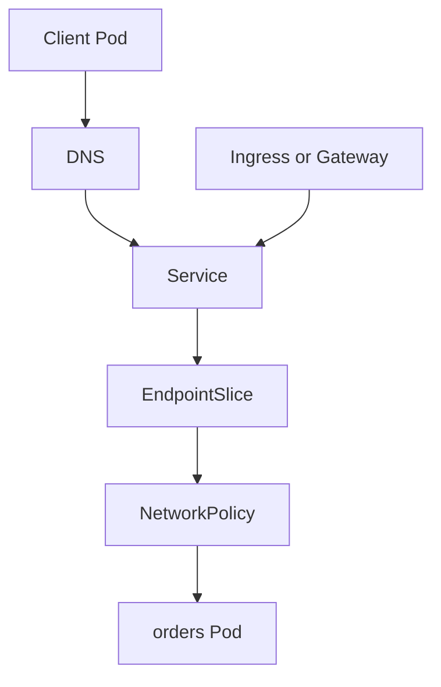

## Table of Contents

1. [Debug One Layer at a Time](#debug-one-layer-at-a-time)
2. [Capture the Exact Symptom](#capture-the-exact-symptom)
3. [Check DNS Before the Service](#check-dns-before-the-service)
4. [Check the Service and EndpointSlices](#check-the-service-and-endpointslices)
5. [Test the Pod Directly](#test-the-pod-directly)
6. [Inspect NetworkPolicies When Traffic Times Out](#inspect-networkpolicies-when-traffic-times-out)
7. [Inspect Ingress or Gateway Separately](#inspect-ingress-or-gateway-separately)
8. [Read Events and Logs After Object State](#read-events-and-logs-after-object-state)
9. [A Repeatable Debug Checklist](#a-repeatable-debug-checklist)
10. [Production Review Questions](#production-review-questions)

## Debug One Layer at a Time

Kubernetes networking has several moving parts, so random debugging wastes time. A client request may pass through DNS, a Service, EndpointSlices, kube-proxy or a CNI data plane, NetworkPolicies, an Ingress or Gateway controller, and finally the application process. A failure message usually tells you which layer to inspect next, but only if you separate the layers.

The running example is `devpolaris-web` calling `devpolaris-orders-api`. The symptom is simple: order pages show an error because the web app cannot reach the orders API. The goal is to build a reliable path of evidence.



Start as close to the failing caller as possible. If the web Pod cannot connect, debug from a Pod in the same namespace and with similar labels when possible.

## Capture the Exact Symptom

Before changing anything, capture what failed. A DNS failure, connection timeout, connection refused, TLS error, 404, 502, and 500 all point to different layers.

```bash
$ kubectl -n web exec deploy/devpolaris-web -- curl -i -m 5 http://devpolaris-orders-api.orders/healthz
curl: (28) Connection timed out after 5001 milliseconds
```

A timeout means the name likely resolved, but packets did not complete a connection. That points toward Service endpoints, policies, routing, or the backend listener. If the error were `Could not resolve host`, DNS would move to the front of the line.

Record the exact URL too. `devpolaris-orders-api`, `devpolaris-orders-api.orders`, and `devpolaris-orders-api.orders.svc.cluster.local` can behave differently depending on the caller namespace and search path.

## Check DNS Before the Service

DNS is a quick proof. Use the same caller namespace so search paths match the application environment.

```bash
$ kubectl -n web exec deploy/devpolaris-web -- nslookup devpolaris-orders-api.orders
Name:      devpolaris-orders-api.orders.svc.cluster.local
Address:   10.96.42.18
```

This says the Service name resolves to a cluster IP. If DNS fails for this one name but `kubernetes.default` works, inspect the Service name and namespace. If every lookup fails, inspect CoreDNS and the Pod resolver config.

```bash
$ kubectl -n web exec deploy/devpolaris-web -- cat /etc/resolv.conf
search web.svc.cluster.local svc.cluster.local cluster.local
nameserver 10.96.0.10
options ndots:5
```

The resolver file explains why short names may work in one namespace and fail in another.

## Check the Service and EndpointSlices

Once DNS resolves, inspect the Service object and its endpoints. The Service should have the selector you expect, and the EndpointSlice should list ready backend addresses.

```bash
$ kubectl -n orders describe svc devpolaris-orders-api
Name:              devpolaris-orders-api
Type:              ClusterIP
IP:                10.96.42.18
Port:              http  80/TCP
TargetPort:        http/TCP
Selector:          app.kubernetes.io/name=devpolaris-orders-api
Endpoints:         10.244.1.17:3000,10.244.2.19:3000

$ kubectl -n orders get endpointslice -l kubernetes.io/service-name=devpolaris-orders-api
NAME                          ADDRESSTYPE   PORTS   ENDPOINTS                 AGE
devpolaris-orders-api-vzkk6   IPv4          3000    10.244.1.17,10.244.2.19   2h
```

If `Endpoints` is `<none>`, inspect Pod labels and readiness. If endpoint ports are not the port your app listens on, inspect Service `targetPort` and container port names.

## Test the Pod Directly

Testing a Pod IP directly is not a production access pattern. It is a diagnostic step. It tells you whether the application is listening before you blame the Service layer.

```bash
$ kubectl -n web run netcheck --rm -it --image=curlimages/curl --restart=Never -- sh
/ $ curl -sS -m 3 http://10.244.1.17:3000/healthz
{"status":"ok","service":"orders-api"}
```

If direct Pod traffic works but Service IP traffic fails, look at Service proxying, kube-proxy, CNI behavior, or NetworkPolicy. If direct Pod traffic fails too, look at the application container, listener port, readiness, and logs.

```bash
$ kubectl -n orders logs deploy/devpolaris-orders-api --tail=20
2026-05-07T09:42:11Z orders-api listening on 127.0.0.1:3000
```

That log has a subtle but serious bug. The process is listening on loopback inside the container. Other Pods cannot reach `127.0.0.1` inside that container. The app should listen on `0.0.0.0:3000` so traffic to the Pod IP can reach it.

## Inspect NetworkPolicies When Traffic Times Out

A NetworkPolicy denial often looks like a timeout. After DNS and endpoints look correct, list policies in the destination namespace and read which Pods they select.

```bash
$ kubectl -n orders get networkpolicy
NAME                            POD-SELECTOR                                      AGE
devpolaris-orders-api-ingress   app.kubernetes.io/name=devpolaris-orders-api      2d

$ kubectl -n orders describe networkpolicy devpolaris-orders-api-ingress
Allowing ingress traffic:
  To Port: 3000/TCP
  From:
    NamespaceSelector: kubernetes.io/metadata.name=frontend
```

The caller namespace is `web`, but the policy allows namespace `frontend`. That explains why Service discovery succeeds and the connection still times out. Fix the policy or the namespace labels after confirming the intended boundary.

```bash
$ kubectl get namespace web --show-labels
NAME   STATUS   AGE   LABELS
web    Active   64d   kubernetes.io/metadata.name=web
```

The evidence points to a label mismatch, not a broken cluster.

## Inspect Ingress or Gateway Separately

External failures add another layer. If `https://api.devpolaris.local/orders/healthz` fails from outside the cluster, first test the backend Service inside the cluster. If the backend works internally, inspect the edge routing layer.

```bash
$ curl -i https://api.devpolaris.local/orders/healthz
HTTP/2 502
server: nginx

$ kubectl -n orders run netcheck --rm -it --image=curlimages/curl --restart=Never -- \
  curl -sS http://devpolaris-orders-api/healthz
{"status":"ok"}
```

That pair proves the backend Service works internally. Now inspect Ingress or Gateway status, controller logs, TLS secrets, and route attachment conditions.

```bash
$ kubectl -n orders describe ingress devpolaris-orders-api
Rules:
  Host                  Path     Backends
  api.devpolaris.local  /orders  devpolaris-orders-api:http (10.244.1.17:3000)
Events:
  Normal  Sync  3m  nginx-ingress-controller  Scheduled for sync
```

If backend addresses appear in the Ingress description, the controller sees the Service. A remaining 502 often points to upstream timeouts, protocol mismatch, or app-level failures.

## Read Events and Logs After Object State

Events and logs are useful after you know which object to inspect. Reading all cluster logs first usually creates noise. Read the Service, endpoints, policies, and route status, then open the log for the component that still looks suspicious.

```bash
$ kubectl -n orders get events --sort-by=.lastTimestamp | tail -5
LAST SEEN   TYPE      REASON      OBJECT                              MESSAGE
2m          Warning   Unhealthy   pod/devpolaris-orders-api-77cb...    Readiness probe failed: HTTP probe failed with statuscode: 500
1m          Normal    Pulled      pod/devpolaris-orders-api-77cb...    Container image already present
```

This event points at readiness and application health. The next command should read the application logs or describe the Pod, not edit the Service.

```bash
$ kubectl -n orders describe pod devpolaris-orders-api-77cbf8d4d9-k7p9x
Readiness:  http-get http://:http/healthz delay=5s timeout=1s period=10s
Conditions:
  Ready   False
```

A not-ready Pod should not receive normal Service traffic, so the Service may have fewer endpoints than replicas. That is a protective behavior.

## A Repeatable Debug Checklist

A good checklist is short enough to remember and strict enough to prevent guessing. Use this sequence for most Kubernetes networking incidents.

```text
1. Capture the exact client error and URL.
2. Run the same test from a Pod near the caller.
3. Resolve the Service DNS name.
4. Inspect the Service selector, ports, and cluster IP.
5. Inspect EndpointSlices and readiness conditions.
6. Test a backend Pod IP and port directly.
7. Inspect NetworkPolicies if connections time out.
8. Inspect Ingress or Gateway only for external failures.
9. Read events and logs for the layer that evidence points to.
10. Change one thing, then rerun the original failing test.
```

The tradeoff in this method is patience. It may feel slower than trying the first fix that comes to mind, but it leaves a trail of facts. That trail matters when the incident involves multiple teams, because each team can see which layer passed and which layer still needs work.

## Production Review Questions

A production review should connect the YAML to the request path. Ask who can call the workload, which component owns the public address, and how a failed health check will be noticed. For `devpolaris-orders-api`, the answer should name the caller, the Service, and the routing layer rather than saying only "Kubernetes handles it."

```text
Request path review:
- Caller identity and namespace
- DNS name used by the caller
- Service type and Service port
- Backend Pod port and readiness check
- External routing layer if traffic leaves the cluster
- Logs or metrics that prove the path works
```

This review is most valuable before production traffic arrives. It catches exposure mistakes while they are still a pull request, not a customer-facing symptom.

### Evidence to Keep During Changes

When you need to prove the design after deployment, collect one short evidence bundle. The bundle should show object state, one successful request, and the first diagnostic target if the request fails.

```bash
$ kubectl -n orders get svc devpolaris-orders-api -o wide
$ kubectl -n orders get endpointslice -l kubernetes.io/service-name=devpolaris-orders-api
$ kubectl -n web run netcheck --rm -it --restart=Never --image=curlimages/curl -- \
  curl -i http://devpolaris-orders-api.orders/healthz
```

Leave enough proof that another engineer can see which network layers were healthy at the time of the check.

Here is the same debug method as a compact incident note. Notice that each line records a fact and the next layer it points to.

```text
Symptom:
  devpolaris-web cannot load order history.

Caller test:
  curl http://devpolaris-orders-api.orders/healthz times out from web namespace.

DNS:
  devpolaris-orders-api.orders resolves to 10.96.42.18.

Service:
  ClusterIP is 10.96.42.18, port 80 targets named port http.

EndpointSlice:
  endpoints are 10.244.1.17:3000 and 10.244.2.19:3000.

Direct Pod test:
  curl http://10.244.1.17:3000/healthz succeeds.

NetworkPolicy:
  destination policy allows namespace frontend, but caller namespace is web.

Fix:
  update namespace selector or namespace label after confirming intended access.

Verification:
  original curl from web namespace returns 200.
```

That note is short, but it has enough evidence for another engineer to follow the reasoning. It does not claim that "networking was broken." It names the exact rule that blocked the path.

A second example points to a different layer.

```text
Symptom:
  external clients receive 502 from https://api.devpolaris.local/orders/healthz.

Internal Service test:
  curl http://devpolaris-orders-api.orders/healthz from web namespace returns 200.

Ingress status:
  host and path point to devpolaris-orders-api:http with two backend endpoints.

Controller log:
  upstream sent no valid HTTP/1.0 header while reading response header from upstream.

Application log:
  orders-api started with HTTPS_ONLY=true and expects TLS from the proxy.

Fix:
  align backend protocol settings between Ingress controller and application, or terminate TLS only at the edge.
```

The exact commands change by controller and cluster, but the habit stays the same: prove the inner path, then prove the edge path, then change the layer that failed its proof.

---

**References**

- [Debug Services](https://kubernetes.io/docs/tasks/debug/debug-application/debug-service/) - The official troubleshooting path for checking Pods, Services, endpoints, DNS, and kube-proxy behavior.
- [Service](https://kubernetes.io/docs/concepts/services-networking/service/) - The canonical Kubernetes explanation of Services, selectors, Service types, and EndpointSlices.
- [DNS for Services and Pods](https://kubernetes.io/docs/concepts/services-networking/dns-pod-service/) - The official behavior for Service names, namespace search paths, and Pod DNS configuration.
- [Network Policies](https://kubernetes.io/docs/concepts/services-networking/network-policies/) - The official behavior for ingress and egress isolation with label-based policy rules.
- [Ingress](https://kubernetes.io/docs/concepts/services-networking/ingress/) - The official API concept for HTTP routing rules that send traffic to Services.
- [Gateway API](https://kubernetes.io/docs/concepts/services-networking/gateway/) - The Kubernetes concept page for Gateway API and its role-oriented resources.
