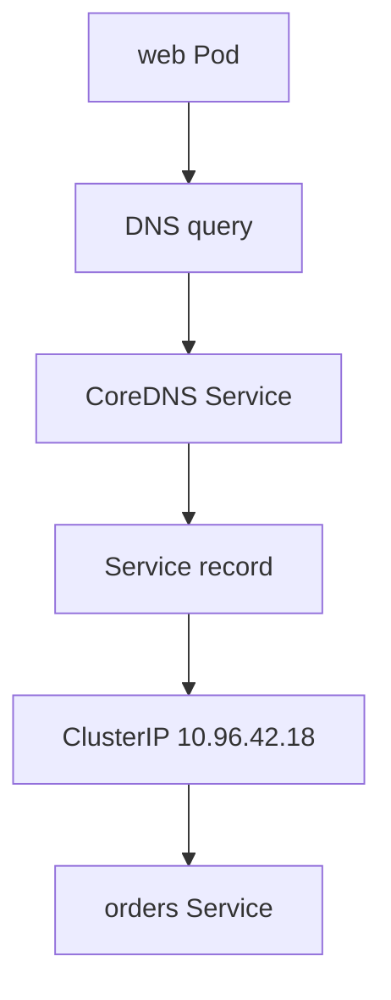

## Table of Contents

1. [Names Replace Temporary Addresses](#names-replace-temporary-addresses)
2. [Service Names Have a Shape](#service-names-have-a-shape)
3. [Namespace Search Paths Explain Short Names](#namespace-search-paths-explain-short-names)
4. [CoreDNS Is the Usual Cluster DNS Server](#coredns-is-the-usual-cluster-dns-server)
5. [Failure Mode: The Name Resolves but Traffic Fails](#failure-mode-the-name-resolves-but-traffic-fails)
6. [Failure Mode: DNS Itself Fails](#failure-mode-dns-itself-fails)
7. [Headless Services Return Pod Addresses](#headless-services-return-pod-addresses)
8. [DNS Habits for Application Config](#dns-habits-for-application-config)
9. [Production Review Questions](#production-review-questions)
10. [Evidence to Keep During Changes](#evidence-to-keep-during-changes)

## Names Replace Temporary Addresses

Applications are easier to operate when they call names instead of temporary IP addresses. In Kubernetes, Pod IPs change during rollouts, reschedules, and repairs. Service cluster IPs are more stable, but application teams still should not hardcode them in config. DNS gives workloads a name that follows the Service.

Kubernetes creates DNS records for Services and configures Pods to use the cluster DNS server. When `devpolaris-web` calls `http://devpolaris-orders-api.orders.svc.cluster.local`, it is asking cluster DNS to resolve the Service named `devpolaris-orders-api` in the `orders` namespace.



DNS does not replace Services. It gives clients a readable way to find them. The Service still owns the stable virtual IP and endpoint selection.

## Service Names Have a Shape

A Service DNS name is the readable address Kubernetes creates for a Service. It has predictable pieces so callers can name a Service in the same namespace, another namespace, or the whole cluster domain.


*Kubernetes service DNS names are structured coordinates, not magic aliases.*


Example: a web Pod in the `web` namespace can call the orders Service with `devpolaris-orders-api.orders`, which includes the Service name and namespace. The fully qualified name usually looks like this:

```text
<service>.<namespace>.svc.cluster.local
```

For the running example, that becomes:

```text
devpolaris-orders-api.orders.svc.cluster.local
```

The first part is the Service name. The second part is the namespace. `svc` tells you this is a Service record. `cluster.local` is the cluster domain used by many clusters, although it can be configured differently. When writing documentation or debugging output, the full name removes ambiguity.

```bash
$ kubectl -n orders get svc devpolaris-orders-api
NAME                    TYPE        CLUSTER-IP    EXTERNAL-IP   PORT(S)   AGE
devpolaris-orders-api   ClusterIP   10.96.42.18   <none>        80/TCP    8m
```

A lookup for the full Service DNS name should return the Service cluster IP for a normal ClusterIP Service.

## Namespace Search Paths Explain Short Names

A DNS search path is a list of suffixes the resolver tries when an application uses a short name. Inside a Pod, Kubernetes writes those search paths into `/etc/resolv.conf`.


*Short names work because the pod resolver expands them through namespace search paths.*


Example: a Pod in the `orders` namespace can often call `http://devpolaris-orders-api`, while a Pod in the `web` namespace should use `http://devpolaris-orders-api.orders` so it reaches the Service in the intended namespace.

```bash
$ kubectl -n web exec deploy/devpolaris-web -- cat /etc/resolv.conf
search web.svc.cluster.local svc.cluster.local cluster.local
nameserver 10.96.0.10
options ndots:5
```

This Pod is in the `web` namespace, so the resolver tries names under `web.svc.cluster.local` first. The Service is in `orders`, not `web`, so the short name may fail or resolve to a different Service if one exists in `web`.

```bash
$ kubectl -n web exec deploy/devpolaris-web -- nslookup devpolaris-orders-api
** server can't find devpolaris-orders-api.web.svc.cluster.local: NXDOMAIN

$ kubectl -n web exec deploy/devpolaris-web -- nslookup devpolaris-orders-api.orders
Name:      devpolaris-orders-api.orders.svc.cluster.local
Address:   10.96.42.18
```

When a caller crosses namespaces, include the namespace in the name. That small habit prevents ambiguous configuration.

## CoreDNS Is the Usual Cluster DNS Server

CoreDNS is the common DNS server implementation that answers Kubernetes Service and Pod name lookups. Pods do not usually query CoreDNS Pods directly. They query the `kube-dns` Service IP, and Kubernetes routes that traffic to ready CoreDNS endpoints.

Example: when a web Pod looks up `devpolaris-orders-api.orders`, the query goes to the cluster DNS Service IP, then to a ready CoreDNS Pod, which reads Kubernetes Service records and returns the orders Service cluster IP.

```bash
$ kubectl -n kube-system get svc kube-dns
NAME       TYPE        CLUSTER-IP   EXTERNAL-IP   PORT(S)                  AGE
kube-dns   ClusterIP   10.96.0.10   <none>        53/UDP,53/TCP,9153/TCP   46d

$ kubectl -n kube-system get pods -l k8s-app=kube-dns
NAME                       READY   STATUS    RESTARTS   AGE
coredns-6f6b679f8f-jh6w7   1/1     Running   0          46d
coredns-6f6b679f8f-vkwm2   1/1     Running   0          46d
```

If every Service name fails from every namespace, inspect CoreDNS health and the `kube-dns` Service. If only one app name fails, inspect the Service, namespace, and spelling first.

## Failure Mode: The Name Resolves but Traffic Fails

DNS success only proves name resolution. It does not prove the Service has endpoints or that the backend application answers. A common mistake is to stop after `nslookup` and assume networking is fine.

```bash
$ kubectl -n web exec deploy/devpolaris-web -- nslookup devpolaris-orders-api.orders
Name:      devpolaris-orders-api.orders.svc.cluster.local
Address:   10.96.42.18

$ kubectl -n web exec deploy/devpolaris-web -- curl -sS http://devpolaris-orders-api.orders/healthz
curl: (7) Failed to connect to devpolaris-orders-api.orders port 80 after 3000 ms: Connection timed out
```

The name resolved to the Service cluster IP. Now the diagnostic path moves to the Service and endpoints.

```bash
$ kubectl -n orders get endpointslice -l kubernetes.io/service-name=devpolaris-orders-api
No resources found in orders namespace.
```

That output says DNS did its job. The Service has no endpoints, so inspect selectors and Pod readiness.

## Failure Mode: DNS Itself Fails

DNS itself is failing when the caller cannot turn even a known cluster name into an address. The useful first split is whether one Service name is wrong or whether all cluster lookups are broken. A failing lookup usually returns `NXDOMAIN`, timeout, or a server failure.

```bash
$ kubectl -n web exec deploy/devpolaris-web -- nslookup kubernetes.default
;; connection timed out; no servers could be reached
```

A timeout for `kubernetes.default` points at cluster DNS, not the orders Service. Check whether the Pod knows the DNS Service IP and whether CoreDNS endpoints are ready.

```bash
$ kubectl -n web exec deploy/devpolaris-web -- cat /etc/resolv.conf
nameserver 10.96.0.10
search web.svc.cluster.local svc.cluster.local cluster.local

$ kubectl -n kube-system get endpoints kube-dns
NAME       ENDPOINTS                                      AGE
kube-dns   10.244.0.8:53,10.244.1.9:53,10.244.0.8:53      46d
```

If CoreDNS endpoints exist, inspect logs for plugin errors, upstream DNS failures, or reload problems.

## Headless Services Return Pod Addresses

A headless Service is a Service that does not hide backends behind one cluster virtual IP. It sets `clusterIP: None` and lets DNS return backend Pod addresses directly.

Example: a stateful cache cluster may need to discover `cache-0`, `cache-1`, and `cache-2` as individual peers. A normal ClusterIP Service returns one virtual IP. A headless Service returns the Pod addresses instead.

```yaml
apiVersion: v1
kind: Service
metadata:
  name: devpolaris-orders-cache
  namespace: orders
spec:
  clusterIP: None
  selector:
    app.kubernetes.io/name: devpolaris-orders-cache
  ports:
    - name: redis
      port: 6379
```

Do not use a headless Service just because it looks more direct. For ordinary HTTP APIs like `devpolaris-orders-api`, a normal ClusterIP Service is usually better because callers do not need to choose individual Pods.

## DNS Habits for Application Config

Application configuration should use a Service name that stays clear from the caller's namespace. A service in the same namespace can use the short Service name. A service in another namespace should include the namespace. Shared libraries and templates should use the full name if they may be reused across namespaces.

```yaml
env:
  - name: ORDERS_API_BASE_URL
    value: http://devpolaris-orders-api.orders.svc.cluster.local
```

The full name is longer, but it is explicit. In an incident, explicit names make it easier to tell whether the caller is reaching the intended namespace. That matters more than saving characters in a manifest.

## Production Review Questions

A production DNS review should connect each configured name to the namespace where the caller runs. Ask which Pod uses the name, which Service object should answer, and whether the short form could resolve differently from another namespace. For `devpolaris-orders-api`, the answer should name the caller namespace, the Service namespace, and the exact DNS name in configuration rather than saying only "Kubernetes handles it."

```text
Request path review:
- Caller identity and namespace
- DNS name used by the caller
- Service type and Service port
- Backend Pod port and readiness check
- External routing layer if traffic leaves the cluster
- Logs or metrics that prove the path works
```

This review is most valuable before production traffic arrives. It catches exposure mistakes while they are still a pull request, not a customer-facing symptom.

## Evidence to Keep During Changes

When you need to prove the design after deployment, collect one short evidence bundle. The bundle should show object state, one successful request, and the first diagnostic target if the request fails.

```bash
$ kubectl -n orders get svc devpolaris-orders-api -o wide
$ kubectl -n orders get endpointslice -l kubernetes.io/service-name=devpolaris-orders-api
$ kubectl -n web run netcheck --rm -it --restart=Never --image=curlimages/curl -- \
  curl -i http://devpolaris-orders-api.orders/healthz
```

Leave enough proof that another engineer can see which network layers were healthy at the time of the check.

A DNS evidence packet should always include the caller namespace. The same short name can mean different things from different namespaces, so the namespace is part of the test.

```bash
$ kubectl -n web exec deploy/devpolaris-web -- nslookup devpolaris-orders-api
** server can't find devpolaris-orders-api.web.svc.cluster.local: NXDOMAIN

$ kubectl -n web exec deploy/devpolaris-web -- nslookup devpolaris-orders-api.orders
Name:      devpolaris-orders-api.orders.svc.cluster.local
Address:   10.96.42.18
```

That output teaches a concrete configuration fix. The application should use `devpolaris-orders-api.orders` or the full name when it runs outside the `orders` namespace.

```yaml
env:
  - name: ORDERS_API_BASE_URL
    value: http://devpolaris-orders-api.orders.svc.cluster.local
```

If even `kubernetes.default` fails, collect CoreDNS state instead of editing the orders API config.

```bash
$ kubectl -n web exec deploy/devpolaris-web -- nslookup kubernetes.default
;; connection timed out; no servers could be reached

$ kubectl -n kube-system get deploy coredns
NAME      READY   UP-TO-DATE   AVAILABLE   AGE
coredns   2/2     2            2           46d

$ kubectl -n kube-system logs deploy/coredns --tail=10
[INFO] plugin/reload: Running configuration MD5 = 8f6c2c9d8c
[ERROR] plugin/errors: 2 devpolaris-orders-api.orders.svc.cluster.local. A: read udp 10.244.0.8:41244->10.96.0.10:53: i/o timeout
```

This packet separates three cases: wrong name, missing Service, and broken cluster DNS. Those cases need different owners and different fixes.

Another useful DNS check is to compare Service existence with name resolution. DNS records are derived from Kubernetes Service objects. If the Service was deleted or created in the wrong namespace, DNS is only reporting that missing object.

```bash
$ kubectl -n orders get svc devpolaris-orders-api
Error from server (NotFound): services "devpolaris-orders-api" not found

$ kubectl -n web exec deploy/devpolaris-web -- nslookup devpolaris-orders-api.orders
** server can't find devpolaris-orders-api.orders.svc.cluster.local: NXDOMAIN
```

That pair is straightforward. Recreate or correct the Service before inspecting CoreDNS. A missing object is not a DNS outage.

If the Service exists but DNS still returns `NXDOMAIN`, then inspect CoreDNS cache, namespace spelling, and the cluster DNS configuration. The difference between those two cases saves a lot of time.

A final lightweight smoke record can sit in a pull request or release note. It should use the real namespace and the real Service name so future readers can compare it with production symptoms.

```text
Smoke record:
  namespace: orders
  service: devpolaris-orders-api
  caller: web/devpolaris-web
  expected response: HTTP 200 from /healthz
  owner for failures before Service: platform networking
  owner for failures after Service reaches Pod: orders API team
```

That ownership line matters during incidents. It helps the team route the next investigation without turning every networking symptom into a cluster-wide mystery.

For a learner, the useful habit is to write the expected path in words before running the command. That prevents a correct command against the wrong namespace, host, or Service from looking like useful evidence.

```text
Expected path:
  caller resolves the intended name
  request reaches the intended Kubernetes Service
  Service forwards only to ready orders API Pods
  application returns the expected health response
```

If the actual result differs, the first mismatching line is the next place to inspect.

This final comparison also keeps the article practical: names and routes are useful only when they match what the running workload actually uses.

Use that mismatch as a pointer, not as an invitation to rewrite every layer.

Small proofs compound into a reliable diagnosis.


*DNS only proves name resolution. The Service and pods still have to pass traffic after the name resolves.*

---

**References**

- [DNS for Services and Pods](https://kubernetes.io/docs/concepts/services-networking/dns-pod-service/) - The official behavior for Service names, namespace search paths, and Pod DNS configuration.
- [Service](https://kubernetes.io/docs/concepts/services-networking/service/) - The canonical Kubernetes explanation of Services, selectors, Service types, and EndpointSlices.
- [Debug Services](https://kubernetes.io/docs/tasks/debug/debug-application/debug-service/) - The official troubleshooting path for checking Pods, Services, endpoints, DNS, and kube-proxy behavior.
