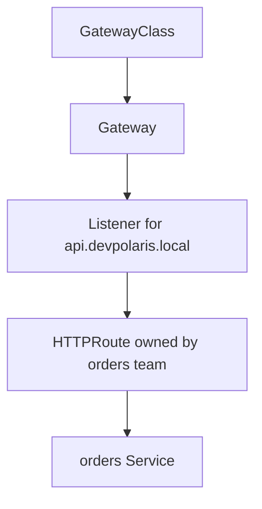

## Table of Contents

1. [Routing Ownership Gets Crowded](#routing-ownership-gets-crowded)
2. [The Main Gateway API Objects](#the-main-gateway-api-objects)
3. [A Platform-Owned Gateway](#a-platform-owned-gateway)
4. [An Application-Owned HTTPRoute](#an-application-owned-httproute)
5. [Status Conditions Are the First Debug Tool](#status-conditions-are-the-first-debug-tool)
6. [Failure Mode: Route Not Allowed](#failure-mode-route-not-allowed)
7. [Gateway API and Ingress Tradeoffs](#gateway-api-and-ingress-tradeoffs)
8. [Reading the Request Path End to End](#reading-the-request-path-end-to-end)
9. [Production Review Questions](#production-review-questions)
10. [Evidence to Keep During Changes](#evidence-to-keep-during-changes)

## Routing Ownership Gets Crowded

Ingress works well when one team owns the edge and the routing rules are simple. As more teams share a cluster, the questions become less about a single path rule and more about ownership. Who owns the public listener? Who can attach routes to it? Which namespaces may use a shared hostname? Which controller features are portable?

Gateway API is a family of Kubernetes APIs for service networking. It separates infrastructure-facing objects from application-facing route objects. A platform team can own the Gateway that listens on ports 80 and 443, while the `orders` team owns an HTTPRoute that attaches `api.devpolaris.local/orders` to `devpolaris-orders-api`.



The useful idea is role separation. The person who manages load balancers and certificates does not have to edit every app route. The application team does not need permission to change the shared listener.

## The Main Gateway API Objects

Gateway API splits routing into separate Kubernetes objects for implementation, listener ownership, and application routes. You do not need all of them on day one. For HTTP routing, the first three are enough: `GatewayClass`, `Gateway`, and `HTTPRoute`.


*Gateway API separates platform-owned entry points from application-owned routes.*


Example: a platform team can own a `Gateway` for `api.devpolaris.local`, while the orders team owns an `HTTPRoute` that maps `/orders` to the orders Service.

| Object | Usually owned by | What it answers |
|--------|------------------|-----------------|
| `GatewayClass` | Platform or cluster admin | Which controller implementation handles this family of Gateways? |
| `Gateway` | Platform team | Which addresses, ports, hostnames, and TLS settings exist? |
| `HTTPRoute` | Application team | Which HTTP requests go to which Services? |

A Gateway API implementation must be installed in the cluster. The API objects describe intent, but a controller still has to make the network changes. This is the same object-controller split you saw with Ingress.

## A Platform-Owned Gateway

A Gateway is the listener and attachment object for traffic entering the cluster. It defines hostnames, ports, TLS settings, and which namespaces may attach routes.

Example: imagine the platform team owns a shared external Gateway for DevPolaris APIs. It listens for HTTPS traffic on `api.devpolaris.local` and allows routes from selected namespaces.

```yaml
apiVersion: gateway.networking.k8s.io/v1
kind: Gateway
metadata:
  name: public-api
  namespace: platform-networking
spec:
  gatewayClassName: devpolaris-gateway
  listeners:
    - name: https
      protocol: HTTPS
      port: 443
      hostname: api.devpolaris.local
      tls:
        mode: Terminate
        certificateRefs:
          - name: devpolaris-api-tls
      allowedRoutes:
        namespaces:
          from: Selector
          selector:
            matchLabels:
              gateway-access: public-api
```

This object is mostly about the edge: class, listener, hostname, port, TLS, and route attachment rules. It does not mention `devpolaris-orders-api` because the platform Gateway should not need to know every backend service in advance.

## An Application-Owned HTTPRoute

An HTTPRoute is the application-owned rule that matches HTTP requests and sends them to backend Services. It attaches to a Gateway through `parentRefs`.

Example: the `orders` team can own the route from `/orders` to the internal `devpolaris-orders-api` Service without owning the public listener or certificate.

```yaml
apiVersion: gateway.networking.k8s.io/v1
kind: HTTPRoute
metadata:
  name: devpolaris-orders-api
  namespace: orders
spec:
  parentRefs:
    - name: public-api
      namespace: platform-networking
      sectionName: https
  hostnames:
    - api.devpolaris.local
  rules:
    - matches:
        - path:
            type: PathPrefix
            value: /orders
      backendRefs:
        - name: devpolaris-orders-api
          port: 80
```

This is the part the application team changes during normal API routing work. It says which host and path belong to the service, but it does not own the external listener or TLS certificate.

## Status Conditions Are the First Debug Tool

Gateway API status conditions are structured status records on Gateway resources. They explain whether a route was accepted, attached, programmed, or rejected.

Example: `Accepted=False` with reason `NotAllowedByListeners` means the route reached the right Gateway, but the listener rules did not allow that namespace or route to attach. Read conditions before guessing.

```bash
$ kubectl -n orders get httproute devpolaris-orders-api -o yaml
status:
  parents:
    - parentRef:
        name: public-api
        namespace: platform-networking
        sectionName: https
      conditions:
        - type: Accepted
          status: "True"
          reason: Accepted
        - type: ResolvedRefs
          status: "True"
          reason: ResolvedRefs
```

`Accepted=True` means the parent Gateway accepted the route. `ResolvedRefs=True` means referenced objects such as backend Services were found and allowed. If either condition is false, the status usually tells you exactly which relationship failed.

## Failure Mode: Route Not Allowed

A route is not allowed when the Gateway sees the route but refuses the attachment. The listener is reachable, but its `allowedRoutes` rules do not permit that namespace or route shape. One common cause is a Gateway that only permits selected namespaces while the application namespace is missing the required label.


*Status conditions show whether the route was accepted before you debug the backend service.*


```bash
$ kubectl -n orders get httproute devpolaris-orders-api -o yaml
status:
  parents:
    - parentRef:
        name: public-api
        namespace: platform-networking
      conditions:
        - type: Accepted
          status: "False"
          reason: NotAllowedByListeners
          message: namespace "orders" is not allowed by listener "https"
```

The diagnostic path is clear. Check the Gateway listener rules, then check the namespace labels.

```bash
$ kubectl get namespace orders --show-labels
NAME     STATUS   AGE   LABELS
orders   Active   41d   kubernetes.io/metadata.name=orders

$ kubectl label namespace orders gateway-access=public-api
namespace/orders labeled
```

That fix is an ownership decision. The platform team should decide which namespaces may attach to a public listener.

## Gateway API and Ingress Tradeoffs

Gateway API gives clearer resource ownership and richer routing models than classic Ingress. It also asks you to learn more objects and verify that your controller supports the features you plan to use. Ingress is still common, stable for basic HTTP routing, and often enough for smaller clusters.

For `devpolaris-orders-api`, Gateway API is attractive when the platform team wants to own shared HTTPS listeners while service teams own their route rules. If one team owns the whole cluster and needs only simple paths, Ingress may be the smaller operational choice.

The practical decision is not "new API good, old API bad." Choose the API that matches the team's ownership boundaries and the controller support in the cluster.

## Reading the Request Path End to End

When Gateway API is working, the path is easy to narrate. A client connects to the Gateway address. The Gateway listener accepts the host and TLS settings. The HTTPRoute matches the path. The backendRef points to a Service. The Service chooses ready Pods.

```text
https://api.devpolaris.local/orders/123
  Gateway public-api listener https
  HTTPRoute orders/devpolaris-orders-api
  Service orders/devpolaris-orders-api:80
  Pod 10.244.2.19:3000
```

During an incident, keep those layers separate. A certificate error belongs near the Gateway. `Accepted=False` belongs near route attachment. `ResolvedRefs=False` often means a missing Service or cross-namespace reference issue. A 500 from the application means the request reached the backend and the application needs inspection.

## Production Review Questions

A production Gateway API review should connect each owner to the part of the route they control. Ask which GatewayClass implementation is accepted, which Gateway listener owns the hostname and TLS settings, which HTTPRoute attaches to it, and which Service receives traffic. For `devpolaris-orders-api`, the answer should name both the platform-owned Gateway and the application-owned HTTPRoute rather than saying only "Kubernetes handles it."

```text
Request path review:
- Caller identity and namespace
- DNS name used by the caller
- Service type and Service port
- Backend Pod port and readiness check
- External routing layer if traffic leaves the cluster
- Logs or metrics that prove the path works
```

This review is most valuable before production traffic arrives. It catches exposure mistakes while they are still a pull request, not a customer-facing symptom.

## Evidence to Keep During Changes

When you need to prove the design after deployment, collect one short evidence bundle. The bundle should show object state, one successful request, and the first diagnostic target if the request fails.

```bash
$ kubectl -n orders get svc devpolaris-orders-api -o wide
$ kubectl -n orders get endpointslice -l kubernetes.io/service-name=devpolaris-orders-api
$ kubectl -n web run netcheck --rm -it --restart=Never --image=curlimages/curl -- \
  curl -i http://devpolaris-orders-api.orders/healthz
```

Leave enough proof that another engineer can see which network layers were healthy at the time of the check.

A Gateway API evidence packet should include both sides of the ownership boundary. The platform team needs to see listener status. The application team needs to see route status and backend references.

```bash
$ kubectl -n platform-networking get gateway public-api
NAME         CLASS                ADDRESS        PROGRAMMED   AGE
public-api   devpolaris-gateway   203.0.113.90   True         2h

$ kubectl -n platform-networking get gateway public-api -o yaml
status:
  conditions:
    - type: Accepted
      status: "True"
    - type: Programmed
      status: "True"
  listeners:
    - name: https
      attachedRoutes: 3
      conditions:
        - type: ResolvedRefs
          status: "True"
```

Then read the application route.

```bash
$ kubectl -n orders get httproute devpolaris-orders-api -o yaml
status:
  parents:
    - parentRef:
        name: public-api
        namespace: platform-networking
        sectionName: https
      conditions:
        - type: Accepted
          status: "True"
        - type: ResolvedRefs
          status: "True"
```

If the Gateway is `Programmed=False`, application teams should not churn their `HTTPRoute` rules first. If the Gateway is programmed but the route is `Accepted=False`, the attachment relationship is the right place to inspect. If both are true and users still see errors, follow the backend Service path.

```bash
$ kubectl -n orders get svc devpolaris-orders-api
NAME                    TYPE        CLUSTER-IP    EXTERNAL-IP   PORT(S)
devpolaris-orders-api   ClusterIP   10.96.42.18   <none>        80/TCP

$ curl -i https://api.devpolaris.local/orders/healthz
HTTP/2 200
content-type: application/json

{"status":"ok","service":"orders-api"}
```

Gateway API gives you better status language than many older routing approaches. Use that language in incident notes. Saying `HTTPRoute was NotAllowedByListeners` is much more useful than saying `Gateway is broken`.

For Gateway API, also check which controller accepted the GatewayClass. This matters when a cluster has multiple implementations or when a development cluster lacks the production controller.

```bash
$ kubectl get gatewayclass
NAME                 CONTROLLER                                      ACCEPTED   AGE
devpolaris-gateway   example.com/devpolaris-gateway-controller        True       9d
```

If `ACCEPTED` is false, the GatewayClass itself is not ready. Application routes can be perfectly written and still have nowhere to attach. That is a platform problem to solve before route debugging can give useful answers.

A final lightweight smoke record can sit in a pull request or release note. It should use the real namespace and the real Service name so future readers can compare it with production symptoms.

```text
Smoke record:
  namespace: orders
  service: devpolaris-orders-api
  caller: web/devpolaris-web
  expected response: HTTP 200 from /healthz
  owner for failures before Service: platform networking
  owner for failures after Service reaches Pod: orders API team
```

That ownership line matters during incidents. It helps the team route the next investigation without turning every networking symptom into a cluster-wide mystery.


*Use this Gateway API checklist to separate ownership, routing permission, and backend health.*

---

**References**

- [Gateway API](https://kubernetes.io/docs/concepts/services-networking/gateway/) - The Kubernetes concept page for Gateway API and its role-oriented resources.
- [Gateway API Documentation](https://gateway-api.sigs.k8s.io/) - The project documentation for GatewayClass, Gateway, HTTPRoute, conformance, and implementation guidance.
- [Service](https://kubernetes.io/docs/concepts/services-networking/service/) - The canonical Kubernetes explanation of Services, selectors, Service types, and EndpointSlices.
- [Debug Services](https://kubernetes.io/docs/tasks/debug/debug-application/debug-service/) - The official troubleshooting path for checking Pods, Services, endpoints, DNS, and kube-proxy behavior.
