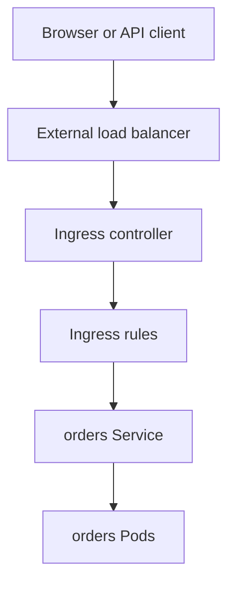

## Table of Contents

1. [HTTP Routing Needs More Than a Service](#http-routing-needs-more-than-a-service)
2. [A First Ingress for devpolaris-orders-api](#a-first-ingress-for-devpolaris-orders-api)
3. [IngressClass Connects Rules to a Controller](#ingressclass-connects-rules-to-a-controller)
4. [Path Matching Is an API Contract](#path-matching-is-an-api-contract)
5. [TLS Belongs at the Edge](#tls-belongs-at-the-edge)
6. [Failure Mode: 502 From the Edge](#failure-mode-502-from-the-edge)
7. [Ingress Tradeoffs](#ingress-tradeoffs)
8. [Production Review Questions](#production-review-questions)
9. [Evidence to Keep During Changes](#evidence-to-keep-during-changes)

## HTTP Routing Needs More Than a Service

A Service can expose one set of Pods, but real web traffic usually has more shape than one port. You may need `api.devpolaris.local` to reach `devpolaris-orders-api`, `/auth` to reach an identity service, and TLS certificates for browser clients. A plain ClusterIP Service cannot express those HTTP routing rules.


*Ingress adds HTTP host, path, and TLS routing in front of a normal Service.*


Ingress is the Kubernetes API object for HTTP and HTTPS routing into Services. It stores rules such as host, path, backend Service, and TLS secret. An Ingress controller is the running component that watches those rules and configures a proxy or load balancer to enforce them.



The split between object and controller is important. Creating an Ingress object without a controller is like writing an Nginx config file on a machine without Nginx running. The API stores your intent, but no traffic changes.

## A First Ingress for devpolaris-orders-api

An Ingress rule maps an external HTTP host and path to an internal Kubernetes Service. The backend Service stays internal, while the Ingress becomes the HTTP entry point for clients outside the cluster.

Example: `api.devpolaris.local/orders` can route to the internal `devpolaris-orders-api` Service on its named `http` port.

```yaml
apiVersion: networking.k8s.io/v1
kind: Ingress
metadata:
  name: devpolaris-orders-api
  namespace: orders
spec:
  ingressClassName: nginx
  rules:
    - host: api.devpolaris.local
      http:
        paths:
          - path: /orders
            pathType: Prefix
            backend:
              service:
                name: devpolaris-orders-api
                port:
                  name: http
```

Read the manifest from the outside inward. A request for host `api.devpolaris.local` and path beginning with `/orders` should go to the Service named `devpolaris-orders-api` on its `http` port. The Ingress does not select Pods directly. The Service still owns that layer.

```bash
$ kubectl -n orders get ingress devpolaris-orders-api
NAME                    CLASS   HOSTS                 ADDRESS        PORTS   AGE
devpolaris-orders-api   nginx   api.devpolaris.local  203.0.113.80   80      44s
```

The address usually belongs to the load balancer in front of the controller. If it is empty, check the controller and its Service before changing backend application code.

## IngressClass Connects Rules to a Controller

An IngressClass is the link between an Ingress rule and the controller implementation that should enforce it. Multiple controllers can exist in one cluster, so the class prevents a rule from being handled by the wrong edge component.

Example: `ingressClassName: nginx` means the NGINX Ingress Controller should read this object and program its proxy configuration.

```bash
$ kubectl get ingressclass
NAME    CONTROLLER             PARAMETERS   AGE
nginx   k8s.io/ingress-nginx   <none>       12d
```

If the class is wrong or missing in a cluster without a default class, the Ingress may sit unused. The rule looks correct, the Service works internally, and outside traffic still returns a default backend or timeout because no controller accepted the object.

```bash
$ kubectl -n orders describe ingress devpolaris-orders-api
Events:
  Type     Reason             Age   From                      Message
  Warning  Rejected           2m    nginx-ingress-controller  ingress class "ngnix" not found
```

The typo is small, but the effect is complete. Fix the class name or configure a default class intentionally.

## Path Matching Is an API Contract

Path matching is the rule that decides which backend receives an HTTP request after the hostname matches. It becomes an API contract as soon as clients build URLs against it.

Example: `pathType: Prefix` lets `/orders/123` match the `/orders` route, while `pathType: Exact` would match `/orders` only. `ImplementationSpecific` lets the controller decide, which may be acceptable for advanced controller features but is less portable.

For `devpolaris-orders-api`, a prefix route is a reasonable API contract if the application serves all order endpoints under `/orders`. The application and Ingress must agree on whether the prefix is preserved or rewritten. Rewrites are controller-specific and should be used carefully because they hide part of the URL from the backend.

| Request path | Prefix `/orders` match? | Exact `/orders` match? |
|--------------|-------------------------|------------------------|
| `/orders` | Yes | Yes |
| `/orders/123` | Yes | No |
| `/orders-v2` | Usually no with element-wise prefix matching | No |

When a route returns 404, check whether the request reached the controller and whether the backend received the path it expects. A 404 from the controller means routing did not match. A 404 from the application means routing matched, but the app did not have that endpoint.

## TLS Belongs at the Edge

TLS termination is the point where an edge component accepts HTTPS, presents the certificate, decrypts the request, and forwards traffic to the backend Service. With Ingress, that usually happens at the controller or the load balancer in front of it.

Example: the browser connects to `https://api.devpolaris.local`, the Ingress edge presents the `devpolaris-api-tls` certificate, then the controller forwards plain HTTP to the internal orders Service if that is how the backend is configured.

```yaml
spec:
  tls:
    - hosts:
        - api.devpolaris.local
      secretName: devpolaris-api-tls
  rules:
    - host: api.devpolaris.local
      http:
        paths:
          - path: /orders
            pathType: Prefix
            backend:
              service:
                name: devpolaris-orders-api
                port:
                  name: http
```

The TLS secret must exist in the same namespace as the Ingress. If it is missing, clients may see a default certificate, a TLS handshake error, or a controller-specific warning.

```bash
$ kubectl -n orders get secret devpolaris-api-tls
Error from server (NotFound): secrets "devpolaris-api-tls" not found
```

That error is not a Service problem. The backend can be healthy while the edge cannot prove its identity to clients.

## Failure Mode: 502 From the Edge

A `502 Bad Gateway` from an Ingress usually means the controller accepted the client request but could not get a healthy response from the backend. The route matched. The edge is alive. The next layer is the Service and Pods.


*A 502 from the edge is usually a broken backend path, not proof that DNS or TLS is wrong.*


```bash
$ curl -i https://api.devpolaris.local/orders/healthz
HTTP/2 502
server: nginx
content-type: text/html

<html><body><h1>502 Bad Gateway</h1></body></html>
```

Start by checking the backend Service from inside the cluster. If the Service fails internally, fix that before changing Ingress. If it works internally, inspect controller logs and upstream configuration.

```bash
$ kubectl -n orders run netcheck --rm -it --image=curlimages/curl --restart=Never -- \
  curl -sS http://devpolaris-orders-api/healthz
{"status":"ok"}

$ kubectl -n ingress-nginx logs deploy/ingress-nginx-controller --tail=5
upstream timed out while connecting to upstream, client: 198.51.100.25, server: api.devpolaris.local, request: "GET /orders/healthz HTTP/2.0", upstream: "http://10.244.2.19:3000/healthz"
```

That log says the controller tried a Pod IP and port. Now inspect readiness, network policy, and application listener behavior.

## Ingress Tradeoffs

Ingress is a shared HTTP entry rule for Services. It is widely supported and simple for common host, path, and TLS routing. The tradeoff is that many advanced behaviors live in controller-specific annotations. Rate limits, rewrites, authentication, and timeouts often differ between controllers.

For a small platform, that is acceptable if the controller choice is deliberate and documented. For a larger platform with multiple teams and richer traffic management, Gateway API may give clearer roles and more portable resources.

Keep this boundary in mind: Ingress routes HTTP traffic to Services. It does not replace Services, NetworkPolicies, application authorization, DNS ownership, or observability. It is one layer in the path, not the whole path.

## Production Review Questions

A production Ingress review should connect the public URL to the internal Service path. Ask which controller owns the address, which host and path should match, which TLS secret clients receive, and which Service receives the request. For `devpolaris-orders-api`, the answer should name the Ingress, the backend Service, and the controller rather than saying only "Kubernetes handles it."

```text
Request path review:
- Caller identity and namespace
- DNS name used by the caller
- Service type and Service port
- Backend Pod port and readiness check
- External routing layer if traffic leaves the cluster
- Logs or metrics that prove the path works
```

This review is most valuable before production traffic arrives. It catches exposure mistakes while they are still a pull request, not a customer-facing symptom.

## Evidence to Keep During Changes

When you need to prove the design after deployment, collect one short evidence bundle. The bundle should show object state, one successful request, and the first diagnostic target if the request fails.

```bash
$ kubectl -n orders get svc devpolaris-orders-api -o wide
$ kubectl -n orders get endpointslice -l kubernetes.io/service-name=devpolaris-orders-api
$ kubectl -n web run netcheck --rm -it --restart=Never --image=curlimages/curl -- \
  curl -i http://devpolaris-orders-api.orders/healthz
```

Leave enough proof that another engineer can see which network layers were healthy at the time of the check.

A useful Ingress evidence packet includes the rule, the controller address, the backend Service, and one external request. The goal is to prove whether the failure is at the edge or behind it.

```bash
$ kubectl -n orders get ingress devpolaris-orders-api
NAME                    CLASS   HOSTS                 ADDRESS        PORTS     AGE
devpolaris-orders-api   nginx   api.devpolaris.local  203.0.113.80   80,443    18m

$ kubectl -n orders describe ingress devpolaris-orders-api
Rules:
  Host                  Path     Backends
  api.devpolaris.local  /orders  devpolaris-orders-api:http (10.244.1.17:3000,10.244.2.19:3000)
TLS:
  devpolaris-api-tls terminates api.devpolaris.local
```

The backend addresses in `describe ingress` are a strong signal. They show the controller can resolve the Service to endpoints. If the list is empty, inspect the Service. If the list is populated and users still see `502`, inspect controller logs, protocol expectations, timeouts, and the application.

```bash
$ curl -i https://api.devpolaris.local/orders/healthz
HTTP/2 200
content-type: application/json

{"status":"ok","service":"orders-api"}
```

When the same request fails, compare status codes carefully.

```text
404 from the controller
  The host or path rule probably did not match.

502 from the controller
  The rule matched, but the controller could not get a good backend response.

500 from orders-api
  The request reached the application, and the application failed.

TLS certificate warning
  The edge certificate or hostname is wrong before HTTP routing starts.
```

This is why Ingress debugging should not begin by editing annotations. First decide whether the request reached the rule, the Service, and the application. Each answer narrows the next change.

For TLS problems, keep one command in your pocket that shows the certificate name the client actually receives. HTTP tools can hide that detail behind a browser warning.

```bash
$ openssl s_client -connect api.devpolaris.local:443 -servername api.devpolaris.local </dev/null 2>/dev/null   | openssl x509 -noout -subject -issuer
subject=CN=api.devpolaris.local
issuer=CN=DevPolaris Local CA
```

If the subject is a default controller certificate, the Ingress may not be using the intended TLS secret. If the subject is correct but the browser still complains, check the issuer trust chain and hostname. That is a certificate path problem, not a backend Service problem.

This separation is the main operational lesson for Ingress. A request can fail before it reaches HTTP routing, after routing but before the backend responds, or inside the application. The status code, certificate, controller event, and backend test tell you which one it is.

A final lightweight smoke record can sit in a pull request or release note. It should use the real namespace and the real Service name so future readers can compare it with production symptoms.

```text
Smoke record:
  namespace: orders
  service: devpolaris-orders-api
  caller: web/devpolaris-web
  expected response: HTTP 200 from /healthz
  owner for failures before Service: platform networking
  owner for failures after Service reaches Pod: orders API team
```

That ownership line matters during incidents. It helps the team route the next investigation without turning every networking symptom into a cluster-wide mystery.

For a learner, the useful habit is to write the expected path in words before running the command. That prevents a correct command against the wrong namespace, host, or Service from looking like useful evidence.

```text
Expected path:
  caller resolves the intended name
  request reaches the intended Kubernetes Service
  Service forwards only to ready orders API Pods
  application returns the expected health response
```

If the actual result differs, the first mismatching line is the next place to inspect.

This final comparison also keeps the article practical: names and routes are useful only when they match what the running workload actually uses.

Use that mismatch as a pointer, not as an invitation to rewrite every layer.

Small proofs compound into a reliable diagnosis.

Keep the original failing URL beside every successful backend check.


*Use this checklist to find where an HTTP request stops between the edge and pods.*

---

**References**

- [Ingress](https://kubernetes.io/docs/concepts/services-networking/ingress/) - The official API concept for HTTP routing rules that send traffic to Services.
- [Ingress Controllers](https://kubernetes.io/docs/concepts/services-networking/ingress-controllers/) - The official explanation of controllers that make Ingress resources take effect.
- [Service](https://kubernetes.io/docs/concepts/services-networking/service/) - The canonical Kubernetes explanation of Services, selectors, Service types, and EndpointSlices.
- [Debug Services](https://kubernetes.io/docs/tasks/debug/debug-application/debug-service/) - The official troubleshooting path for checking Pods, Services, endpoints, DNS, and kube-proxy behavior.
