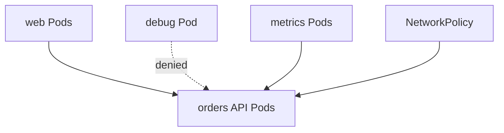

## Table of Contents

1. [Open Pod Networks Need Boundaries](#open-pod-networks-need-boundaries)
2. [Select the Protected Pods First](#select-the-protected-pods-first)
3. [Allow the Web Tier to Call Orders](#allow-the-web-tier-to-call-orders)
4. [Egress Rules Control Outbound Calls](#egress-rules-control-outbound-calls)
5. [Failure Mode: Selector Allows Too Much](#failure-mode-selector-allows-too-much)
6. [Failure Mode: Connection Timeout After Policy](#failure-mode-connection-timeout-after-policy)
7. [NetworkPolicy Limits](#networkpolicy-limits)
8. [Rollout Strategy for Policies](#rollout-strategy-for-policies)
9. [Production Review Questions](#production-review-questions)
10. [Evidence to Keep During Changes](#evidence-to-keep-during-changes)

## Open Pod Networks Need Boundaries

The default Kubernetes networking model allows Pods to communicate across the cluster unless something restricts them. That openness makes service discovery simple, but it is too broad for many production systems. A metrics scraper may need to call every service. A public web Pod may need to call `devpolaris-orders-api`. A random debug Pod in another namespace probably should not reach order creation endpoints.

A NetworkPolicy is a Kubernetes object that describes allowed network traffic for selected Pods. Traffic here means packets, which are small chunks of data moving between network addresses and ports. A policy is label-based, namespace-aware, and enforced by the cluster network plugin.

Example: a policy can allow Pods labeled `app.kubernetes.io/name=devpolaris-web` in the `web` namespace to connect to orders API Pods on TCP port `3000`, while denying a debug Pod from the `default` namespace. If the network plugin does not support NetworkPolicy, creating the object may succeed while traffic remains unrestricted.



NetworkPolicy is not application authentication. It is a network boundary. The API must still verify users, tokens, and permissions.

## Select the Protected Pods First

A NetworkPolicy starts by selecting the destination Pods it protects. The `podSelector` is not an allow rule by itself, it defines the set of Pods the policy applies to.

Example: for `devpolaris-orders-api`, the policy should select Pods with the stable application label, then add separate rules for the callers that are allowed to reach them.

```yaml
apiVersion: networking.k8s.io/v1
kind: NetworkPolicy
metadata:
  name: devpolaris-orders-api-ingress
  namespace: orders
spec:
  podSelector:
    matchLabels:
      app.kubernetes.io/name: devpolaris-orders-api
  policyTypes:
    - Ingress
```

By itself, a policy that selects Pods and declares `Ingress` without ingress rules creates default deny ingress for those selected Pods. That is a strong move. Apply it only when you are ready to add the allowed callers in the same change or immediately after.

The key mental model is selection first, permission second. The policy does not protect the namespace as a whole unless the selector matches every Pod in it.

## Allow the Web Tier to Call Orders

An ingress allow rule is the exception that lets a selected source reach protected Pods. For `devpolaris-orders-api`, the useful first exception is `devpolaris-web` Pods in the `web` namespace reaching TCP port `3000` on the orders API Pods. The Service exposes port 80, but NetworkPolicy checks traffic at the Pod port after forwarding, so the allowed port should match the container listener.

```yaml
apiVersion: networking.k8s.io/v1
kind: NetworkPolicy
metadata:
  name: devpolaris-orders-api-ingress
  namespace: orders
spec:
  podSelector:
    matchLabels:
      app.kubernetes.io/name: devpolaris-orders-api
  policyTypes:
    - Ingress
  ingress:
    - from:
        - namespaceSelector:
            matchLabels:
              kubernetes.io/metadata.name: web
          podSelector:
            matchLabels:
              app.kubernetes.io/name: devpolaris-web
      ports:
        - protocol: TCP
          port: 3000
```

The `namespaceSelector` and `podSelector` inside the same `from` item are combined. That means the source must be a matching Pod in a matching namespace. Splitting them into two separate list items would allow more traffic than intended.

## Egress Rules Control Outbound Calls

Ingress rules control who may connect to selected Pods. Egress rules control where selected Pods may connect outbound.

Example: the orders API may need outbound traffic to PostgreSQL on port `5432` and DNS on port `53`, but it should not be able to open arbitrary connections to every namespace. Many teams start with ingress restrictions because it protects service entry points. Egress restrictions are useful when you need to limit where a workload can send data.

For example, `devpolaris-orders-api` may need to call PostgreSQL and cluster DNS, but not arbitrary services. A first egress policy might allow DNS plus a database namespace.

```yaml
policyTypes:
  - Ingress
  - Egress
egress:
  - to:
      - namespaceSelector:
          matchLabels:
            kubernetes.io/metadata.name: kube-system
    ports:
      - protocol: UDP
        port: 53
      - protocol: TCP
        port: 53
  - to:
      - namespaceSelector:
          matchLabels:
            kubernetes.io/metadata.name: data
        podSelector:
          matchLabels:
            app.kubernetes.io/name: orders-postgres
    ports:
      - protocol: TCP
        port: 5432
```

If you add egress deny rules and forget DNS, many applications fail in a way that looks like service discovery broke. The policy is doing exactly what you asked: blocking the DNS query.

## Failure Mode: Selector Allows Too Much

A selector that is too broad turns a narrow network boundary into a namespace-wide permission. NetworkPolicy mistakes are often label mistakes, and a namespace selector by itself can allow every Pod in that namespace when you meant to allow one app.

```yaml
from:
  - namespaceSelector:
      matchLabels:
        kubernetes.io/metadata.name: web
```

That rule allows all Pods in the `web` namespace. If `web` contains frontend Pods, one-off debug Pods, and old test workloads, all of them can connect. Add a `podSelector` when the source application matters.

```bash
$ kubectl -n orders describe networkpolicy devpolaris-orders-api-ingress
PodSelector:     app.kubernetes.io/name=devpolaris-orders-api
Allowing ingress traffic:
  To Port: 3000/TCP
  From:
    NamespaceSelector: kubernetes.io/metadata.name=web
```

`describe` is useful because it translates the YAML into the effective shape. Read it after applying the policy.

## Failure Mode: Connection Timeout After Policy

A denied NetworkPolicy flow often looks like a timeout. The client can resolve the Service name, but the TCP connection never completes.

```bash
$ kubectl -n web exec deploy/devpolaris-web -- curl -m 3 -sS http://devpolaris-orders-api.orders/healthz
curl: (28) Connection timed out after 3001 milliseconds
```

The diagnostic path is to prove DNS, Service endpoints, and direct allowed source labels. Then inspect policies selecting the destination Pod.

```bash
$ kubectl -n orders get networkpolicy
NAME                            POD-SELECTOR                                      AGE
devpolaris-orders-api-ingress   app.kubernetes.io/name=devpolaris-orders-api      9m

$ kubectl -n web get pod -l app.kubernetes.io/name=devpolaris-web --show-labels
NAME                            READY   STATUS    LABELS
devpolaris-web-7c9f998fb-l7w6r  1/1     Running   app.kubernetes.io/name=devpolaris-web
```

If the source labels and namespace labels do not match the rule, fix the labels or the policy. Do not weaken the policy to `0.0.0.0/0` just to make the timeout disappear.

## NetworkPolicy Limits

NetworkPolicy is a network reachability control, not a full application security system. It can allow or deny traffic based on Pod labels, namespaces, IP blocks, and ports, but it cannot understand the business meaning of a request.

Example: it can allow `web` Pods to connect to orders Pods on TCP port `3000`, but it cannot decide whether user `123` is allowed to view order `456`. It does not authenticate users, inspect JSON bodies, enforce HTTP methods, or decide whether an order belongs to a customer. It also depends on the network plugin enforcing the API.

| Need | NetworkPolicy fit? | Better layer |
|------|--------------------|--------------|
| Allow web Pods to reach orders Pods | Yes | NetworkPolicy |
| Block all unauthenticated users | No | Application auth or API gateway |
| Restrict POST but allow GET | No | Application, proxy, or service mesh |
| Limit egress to database and DNS | Yes | NetworkPolicy |
| Encrypt traffic between services | No | TLS or service mesh |

Good Kubernetes security is layered. NetworkPolicy reduces reachable paths. It does not replace identity checks inside the API.

## Rollout Strategy for Policies

Treat NetworkPolicy changes like production traffic changes. Start by mapping current traffic, then add a narrow policy in staging, test from allowed and denied sources, and watch application metrics after production rollout.

```text
Policy rollout checklist:
1. Identify selected destination Pods.
2. List required callers by namespace and labels.
3. Include required infrastructure flows such as DNS and metrics.
4. Test allowed traffic from a real caller Pod.
5. Test denied traffic from a temporary Pod.
6. Keep a rollback manifest ready.
```

For `devpolaris-orders-api`, the important tradeoff is safety versus surprise. A default-deny policy is safer after it is correct, but it can break hidden dependencies the first time it lands. Good preparation makes the policy protective instead of disruptive.

## Production Review Questions

A production NetworkPolicy review should connect each allowed flow to one real caller, one destination, and one port. Ask which labels select the protected Pods, which namespace and Pod labels select the caller, and which infrastructure flows such as DNS or metrics must stay allowed. For `devpolaris-orders-api`, the answer should describe the intended packet path rather than saying only "Kubernetes handles it."

```text
Request path review:
- Caller identity and namespace
- DNS name used by the caller
- Service type and Service port
- Backend Pod port and readiness check
- External routing layer if traffic leaves the cluster
- Logs or metrics that prove the path works
```

This review is most valuable before production traffic arrives. It catches exposure mistakes while they are still a pull request, not a customer-facing symptom.

## Evidence to Keep During Changes

When you need to prove the design after deployment, collect one short evidence bundle. The bundle should show object state, one successful request, and the first diagnostic target if the request fails.

```bash
$ kubectl -n orders get svc devpolaris-orders-api -o wide
$ kubectl -n orders get endpointslice -l kubernetes.io/service-name=devpolaris-orders-api
$ kubectl -n web run netcheck --rm -it --restart=Never --image=curlimages/curl -- \
  curl -i http://devpolaris-orders-api.orders/healthz
```

Leave enough proof that another engineer can see which network layers were healthy at the time of the check.

A NetworkPolicy evidence packet should prove both an allowed flow and a denied flow. Only proving the allowed flow can hide a policy that is too broad.

```bash
$ kubectl -n web exec deploy/devpolaris-web -- curl -sS -m 3 http://devpolaris-orders-api.orders/healthz
{"status":"ok","service":"orders-api"}

$ kubectl -n default run denied-check --rm -it --restart=Never --image=curlimages/curl -- \
  curl -sS -m 3 http://devpolaris-orders-api.orders/healthz
curl: (28) Connection timed out after 3001 milliseconds
```

Then capture the labels that made those results happen.

```bash
$ kubectl get namespace web --show-labels
NAME   STATUS   AGE   LABELS
web    Active   64d   kubernetes.io/metadata.name=web

$ kubectl -n web get pod -l app.kubernetes.io/name=devpolaris-web --show-labels
NAME                            READY   STATUS    LABELS
devpolaris-web-7c9f998fb-l7w6r  1/1     Running   app.kubernetes.io/name=devpolaris-web
```

For egress policies, add DNS to the proof. A workload with blocked DNS can look like it cannot reach any service, even when the real denial happened before the TCP connection.

```bash
$ kubectl -n orders exec deploy/devpolaris-orders-api -- nslookup orders-postgres.data
Name:      orders-postgres.data.svc.cluster.local
Address:   10.96.77.21

$ kubectl -n orders exec deploy/devpolaris-orders-api -- nc -vz orders-postgres.data 5432
orders-postgres.data (10.96.77.21:5432) open
```

The tradeoff with strict policies is that hidden dependencies become visible as failures. That is uncomfortable during the first rollout, but it is useful information. Each denied flow should either become an explicit allowed dependency or be removed from the application path.

When policies are hard to reason about, reduce the question to one source, one destination, one port, and one namespace pair. Write that sentence before reading the YAML.

```text
Expected flow:
  Source namespace: web
  Source Pod label: app.kubernetes.io/name=devpolaris-web
  Destination namespace: orders
  Destination Pod label: app.kubernetes.io/name=devpolaris-orders-api
  Destination port: TCP 3000
```

Now read the policy and ask whether it permits exactly that flow. This keeps you from treating a long YAML file like a puzzle and helps reviewers discuss the intended boundary in plain language.

A final lightweight smoke record can sit in a pull request or release note. It should use the real namespace and the real Service name so future readers can compare it with production symptoms.

```text
Smoke record:
  namespace: orders
  service: devpolaris-orders-api
  caller: web/devpolaris-web
  expected response: HTTP 200 from /healthz
  owner for failures before Service: platform networking
  owner for failures after Service reaches Pod: orders API team
```

That ownership line matters during incidents. It helps the team route the next investigation without turning every networking symptom into a cluster-wide mystery.

---

**References**

- [Network Policies](https://kubernetes.io/docs/concepts/services-networking/network-policies/) - The official behavior for ingress and egress isolation with label-based policy rules.
- [Service](https://kubernetes.io/docs/concepts/services-networking/service/) - The canonical Kubernetes explanation of Services, selectors, Service types, and EndpointSlices.
- [DNS for Services and Pods](https://kubernetes.io/docs/concepts/services-networking/dns-pod-service/) - The official behavior for Service names, namespace search paths, and Pod DNS configuration.
