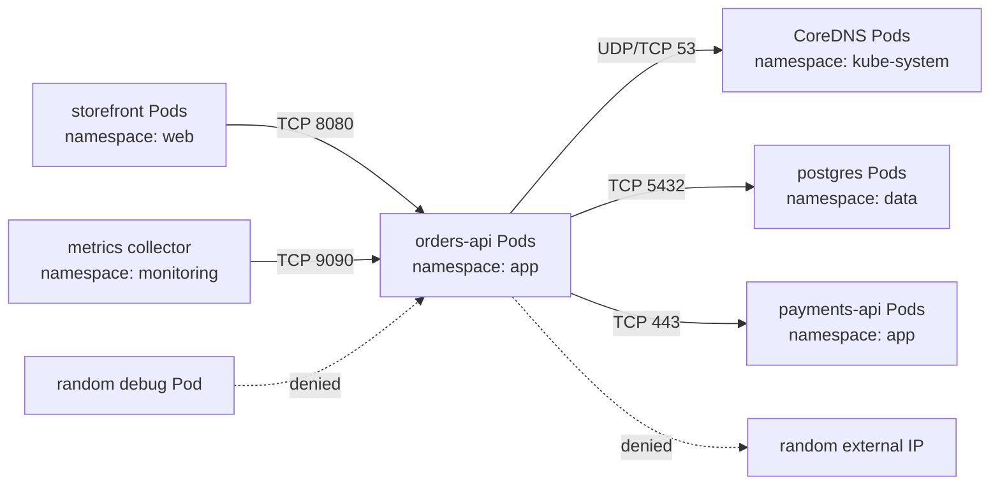

## Table of Contents

1. [The Traffic Problem](#the-traffic-problem)
2. [What A NetworkPolicy Controls](#what-a-networkpolicy-controls)
3. [The Default Open State](#the-default-open-state)
4. [Selecting The Pods To Protect](#selecting-the-pods-to-protect)
5. [Allowing Ingress](#allowing-ingress)
6. [Adding Egress Without Breaking DNS](#adding-egress-without-breaking-dns)
7. [Namespaces, Labels, And Rule Shape](#namespaces-labels-and-rule-shape)
8. [Where NetworkPolicy Ends](#where-networkpolicy-ends)
9. [Rolling Policies Out Safely](#rolling-policies-out-safely)
10. [Putting It All Together](#putting-it-all-together)
11. [What's Next](#whats-next)

## The Traffic Problem
<!-- section-summary: Kubernetes networking starts open, so teams need a clear way to reduce which Pods can talk to each other. -->

Imagine a small shop running in Kubernetes. The `web` namespace has a `storefront` app. The `app` namespace has `orders-api` and `payments-api`. The `data` namespace has `postgres`. The `monitoring` namespace has a metrics collector. This app already uses Services, DNS, and Ingress from the earlier networking articles, so traffic can flow through stable service names instead of raw Pod IPs.

That is useful for shipping the app, and it also leaves too many paths open. A debug Pod in the wrong namespace might reach `orders-api`. A compromised `storefront` Pod might try to connect directly to `postgres`. A batch job might call the payment service even though the business flow says only `orders-api` should do that. The cluster network gives everything a path unless something narrows that path.

**NetworkPolicies** give you that narrowing step. A NetworkPolicy is a Kubernetes object that selects Pods and lists the traffic those Pods should allow. It can control inbound traffic, called **ingress**, and outbound traffic, called **egress**. In plain terms, it lets you say, "`orders-api` may receive traffic from `storefront` on port 8080, and it may send traffic only to DNS, `postgres`, and the payment service."

This article builds that idea in the same order a team usually meets it in production. First we look at what the policy controls. Then we look at the default open state, because that explains why the first policy can surprise a team. After that we write ingress and egress policies, handle namespace labels, talk through the limits, and end with a safe rollout workflow.

## What A NetworkPolicy Controls
<!-- section-summary: A NetworkPolicy controls layer 3 and layer 4 traffic for selected Pods, and the network plugin does the actual enforcement. -->

A **NetworkPolicy** controls network connections involving Pods. Kubernetes defines it as a namespaced object in the `networking.k8s.io/v1` API. The policy uses labels to select the Pods it protects, and then it lists allowed sources, destinations, protocols, and ports. The official API describes the resource as the object that says what network traffic is allowed for a set of Pods.

The important words are **Pods**, **labels**, **ports**, and **directions**. A NetworkPolicy attaches to selected Pods. A Service may be the name the client uses, like `orders-api.app.svc.cluster.local`, while the policy applies to the destination Pods behind that Service. That distinction matters when you debug, because the Service can exist and resolve correctly while the selected backend Pods still reject the connection.

NetworkPolicy works at network layer 3 and layer 4. Layer 3 means IP addresses and CIDR blocks. Layer 4 means protocols and ports such as TCP 8080, TCP 5432, UDP 53, and SCTP if the cluster supports it. HTTP paths, JWT claims, gRPC methods, SQL statements, and TLS certificate details live above that layer. Rules like "allow only `GET /healthz`" or "allow only requests with this service identity" usually belong in a service mesh, gateway, application, or proxy.

There is one more piece before any YAML matters: the **network plugin**. Kubernetes stores the NetworkPolicy object, and the cluster's CNI or network provider enforces it on the nodes. CNI means Container Network Interface, the plugin layer that wires Pod networking into the cluster. Without plugin support, applying perfect-looking policy YAML creates an API object and leaves traffic unchanged. Production clusters often use providers such as Calico, Cilium, Antrea, or a managed cloud plugin with policy support, and the exact provider belongs to the platform setup.

Our shop has the right plugin installed, so the Kubernetes API can store policies and the plugin can enforce them. Now we need to understand the starting traffic shape before the first policy arrives.

## The Default Open State
<!-- section-summary: Pods allow all ingress and egress by default until a NetworkPolicy selects them for that direction. -->

By default, Pods are open for both directions. A Pod can receive inbound connections from other Pods, and it can start outbound connections to other Pods or external IPs if the rest of the cluster and network allow it. Kubernetes calls this non-isolated traffic. In everyday terms, traffic remains open until a NetworkPolicy selects the Pod for that direction.

This default explains a common first surprise. You create a policy for `orders-api`, and suddenly one connection starts timing out while another still works. The reason is that NetworkPolicy isolation happens by direction. A policy can isolate a Pod for ingress, egress, or both, depending on `policyTypes` and the rules you include.

For **ingress**, a Pod enters restricted ingress mode when a NetworkPolicy selects that Pod and applies to ingress. After that, inbound connections must match at least one ingress rule across the policies selecting that Pod. Reply packets for allowed connections are allowed automatically, so a separate return rule is unnecessary.

For **egress**, a Pod enters restricted egress mode when a NetworkPolicy selects that Pod and applies to egress. After that, outbound connections must match at least one egress rule across the policies selecting that Pod. Reply packets for those allowed outbound connections are also allowed automatically.

NetworkPolicies are **additive**. They use a union model instead of a top-to-bottom priority order like some firewall systems. If three policies select `orders-api`, Kubernetes takes the union of the allowed ingress rules and the union of the allowed egress rules for the matching directions. A connection from one Pod to another also needs both sides to agree when both sides are isolated: the source Pod's egress policy must allow leaving, and the destination Pod's ingress policy must allow entering.

The shop team wants a clean starting point in the `app` namespace, so they begin with ingress. They want random Pods to stop calling `orders-api`, while the storefront path keeps working. That goal gives us one protected workload and one allowed caller to model first.

## Selecting The Pods To Protect
<!-- section-summary: The podSelector chooses the protected Pods, so policy quality starts with stable workload labels. -->

Every NetworkPolicy has a **podSelector**. This selector chooses the Pods the policy applies to inside the policy's own namespace. If the policy lives in the `app` namespace, its `podSelector` selects Pods in `app` as protected targets; Pods in `web` or `data` need policies in their own namespaces. That namespaced boundary keeps ownership clearer, because the team that owns a namespace usually writes the policies for the Pods inside that namespace.

Here is the `orders-api` Deployment shape we will use for the examples. The labels in this example give the policy something stable to follow during rollouts. A NetworkPolicy follows the labels that land on the Pods created from this template:

```yaml
apiVersion: apps/v1
kind: Deployment
metadata:
  name: orders-api
  namespace: app
spec:
  selector:
    matchLabels:
      app.kubernetes.io/name: orders-api
      app.kubernetes.io/part-of: shop
  template:
    metadata:
      labels:
        app.kubernetes.io/name: orders-api
        app.kubernetes.io/part-of: shop
        app.kubernetes.io/component: api
    spec:
      containers:
        - name: orders-api
          image: ghcr.io/example/orders-api:1.8.4
          ports:
            - name: http
              containerPort: 8080
```

The policy should select stable identity labels and avoid rollout-specific labels. Labels such as `pod-template-hash` change as ReplicaSets change, so they make fragile policies. Labels such as `app.kubernetes.io/name: orders-api` and `app.kubernetes.io/part-of: shop` describe the workload across rollouts, so they make better policy targets.

A first policy can select `orders-api` and deny all ingress by leaving the ingress allow list empty. This is the smallest policy that proves the selected Pods have entered ingress isolation. The caller list stays empty at this step, so this policy is useful only as the first half of a change that will also add a specific allow rule:

```yaml
apiVersion: networking.k8s.io/v1
kind: NetworkPolicy
metadata:
  name: orders-api-default-deny-ingress
  namespace: app
spec:
  podSelector:
    matchLabels:
      app.kubernetes.io/name: orders-api
  policyTypes:
    - Ingress
```

This policy selects every `orders-api` Pod in the `app` namespace. Because it applies to ingress with an empty allow list, inbound application traffic stays closed for those selected Pods. Outbound traffic from `orders-api` stays open, because `policyTypes` contains only `Ingress`.

That deny policy is useful as a starting point, but it breaks the shop if we stop there. The storefront still needs to call `orders-api` to create carts, submit orders, and show order history. The next step is an allow rule for exactly that flow.

## Allowing Ingress
<!-- section-summary: Ingress rules allow selected sources and ports to reach the protected destination Pods. -->

An **ingress rule** describes traffic allowed into the Pods selected by `spec.podSelector`. The rule has two main pieces: `from` for allowed sources and `ports` for allowed destination ports. A request must match the source side and the port side of the rule. If the rule lists multiple sources, any one matching source can satisfy the source side.

The storefront Pods run in the `web` namespace and carry this label. The policy will use it as the source workload identity. Real workloads may have more labels, but the policy should depend on the labels your platform treats as stable ownership or app identity:

```yaml
metadata:
  labels:
    app.kubernetes.io/name: storefront
    app.kubernetes.io/part-of: shop
```

The namespace also needs a label, because a `podSelector` inside an ingress peer selects Pods in the policy's own namespace unless you combine it with a `namespaceSelector`. Kubernetes automatically sets the immutable `kubernetes.io/metadata.name` label on namespaces, so we can target the `web` namespace by that label. Many teams also add their own labels such as `team=commerce` or `environment=prod` for broader grouping.

Here is the policy that allows the storefront to call `orders-api` on TCP 8080. The destination selection stays in `spec.podSelector`, and the allowed caller lives under `ingress.from`. This is the first allow rule that makes the earlier default deny safe for the real business path:

```yaml
apiVersion: networking.k8s.io/v1
kind: NetworkPolicy
metadata:
  name: allow-storefront-to-orders-api
  namespace: app
spec:
  podSelector:
    matchLabels:
      app.kubernetes.io/name: orders-api
  policyTypes:
    - Ingress
  ingress:
    - from:
        - namespaceSelector:
            matchLabels:
              kubernetes.io/metadata.name: web
          podSelector:
            matchLabels:
              app.kubernetes.io/name: storefront
      ports:
        - protocol: TCP
          port: 8080
```

This policy protects `orders-api` because the policy lives in the `app` namespace and selects Pods with `app.kubernetes.io/name: orders-api`. It allows traffic from Pods named `storefront` in the namespace named `web`. It also limits that allowed traffic to TCP port 8080, which is the container port serving the API.

The shape of the selector matters. In the same `from` item, `namespaceSelector` plus `podSelector` means both must match. That gives us "Pods with this label in namespaces with this label." If those selectors were split into two separate `from` list items, the policy would allow all Pods in the selected namespace and also matching Pods in the policy's own namespace. That one indentation choice changes the access boundary, so production reviews should slow down around combined selectors.

After this policy lands, the expected behavior is simple. `storefront` can reach `orders-api` on 8080. A random debug Pod in `web` without the storefront label stays outside the allowed set. A Pod in `app` with a different label stays outside the allowed set too. A Pod in `monitoring` needs another additive policy before it can scrape or call the API.

The inbound path now matches the business path. The next problem is outbound traffic, because `orders-api` still has open egress unless we isolate it too. That takes us from "who may call this API" to "where may this API send data."

## Adding Egress Without Breaking DNS
<!-- section-summary: Egress rules narrow where selected Pods can connect, and DNS needs an explicit allow rule after default-deny egress. -->

**Egress** means outbound traffic from selected Pods. For `orders-api`, outbound traffic has a few real production reasons. It needs DNS to resolve service names. It needs PostgreSQL on TCP 5432. It may need to call `payments-api` on TCP 443. It may need to send metrics to the collector. Random cluster scans and random internet calls sit outside the business path.

A default deny egress policy looks small. It selects the same Pods, then turns egress into an allow-list. This mirrors the ingress pattern, except now the selected Pods are the traffic source rather than the protected destination:

```yaml
apiVersion: networking.k8s.io/v1
kind: NetworkPolicy
metadata:
  name: orders-api-default-deny-egress
  namespace: app
spec:
  podSelector:
    matchLabels:
      app.kubernetes.io/name: orders-api
  policyTypes:
    - Egress
```

This selects `orders-api` and leaves the egress allow list empty, so outbound connections from those Pods are blocked. This includes DNS. That part catches many teams because the app error message may point to a failed lookup for `postgres.data.svc.cluster.local`, and the real cause is the egress policy blocking UDP or TCP port 53 to the cluster DNS Pods.

A practical egress policy usually starts by allowing DNS. In many clusters, CoreDNS Pods live in `kube-system` and use the label `k8s-app: kube-dns`, but labels can vary. The safer workflow is to check the labels in your own cluster and then write the rule.

```bash
kubectl -n kube-system get pods --show-labels -l k8s-app=kube-dns
```

Here is an egress policy that allows `orders-api` to use DNS, reach PostgreSQL, and call the payment API. It keeps each destination in its own rule so the intent stays readable. The order of these rules helps the reader, while the final policy result still comes from the additive union of matching rules:

```yaml
apiVersion: networking.k8s.io/v1
kind: NetworkPolicy
metadata:
  name: allow-orders-api-egress
  namespace: app
spec:
  podSelector:
    matchLabels:
      app.kubernetes.io/name: orders-api
  policyTypes:
    - Egress
  egress:
    - to:
        - namespaceSelector:
            matchLabels:
              kubernetes.io/metadata.name: kube-system
          podSelector:
            matchLabels:
              k8s-app: kube-dns
      ports:
        - protocol: UDP
          port: 53
        - protocol: TCP
          port: 53
    - to:
        - namespaceSelector:
            matchLabels:
              kubernetes.io/metadata.name: data
          podSelector:
            matchLabels:
              app.kubernetes.io/name: postgres
      ports:
        - protocol: TCP
          port: 5432
    - to:
        - namespaceSelector:
            matchLabels:
              kubernetes.io/metadata.name: app
          podSelector:
            matchLabels:
              app.kubernetes.io/name: payments-api
      ports:
        - protocol: TCP
          port: 443
```

Each egress item is one allowed destination shape. The DNS rule allows UDP and TCP 53 to matching DNS Pods. The PostgreSQL rule allows TCP 5432 to `postgres` Pods in the `data` namespace. The payment rule allows TCP 443 to `payments-api` Pods in the `app` namespace. Other outbound connections from `orders-api` are denied because egress is now isolated and only listed destinations are allowed.

External destinations are trickier. NetworkPolicy can use `ipBlock` with CIDR ranges, which works best for stable IP ranges outside the cluster. Many payment APIs and SaaS services use changing IP ranges, CDNs, or private endpoints, so hardcoding a small public CIDR can turn into fragile operations work. Teams often combine NetworkPolicy with a stable egress gateway, cloud firewall, NAT control, service mesh egress policy, or provider-specific private connectivity for those cases.

Now we have touched both directions. The next piece is rule shape, because most policy bugs come from labels and selector combinations rather than the idea of ingress or egress itself. The YAML indentation carries real security meaning here.

## Namespaces, Labels, And Rule Shape
<!-- section-summary: NetworkPolicy rules depend on label selectors, and small YAML shape changes can widen or narrow access. -->

NetworkPolicy uses labels because Pod IPs are temporary. A Pod can die and come back with a new IP. A Deployment can create a new ReplicaSet during a rollout. The policy follows the labels, so the access rule stays attached to the workload identity instead of one short-lived address.

There are three common ways to describe peers in a rule. A **podSelector** describes Pods by labels. A **namespaceSelector** describes namespaces by labels. An **ipBlock** describes CIDR ranges. You can use them for ingress sources or egress destinations, depending on the direction of the rule.

The most important selector detail is the difference between "same peer item" and "separate peer items." This rule allows only `storefront` Pods in the `web` namespace. Both selectors live under one list item:

```yaml
from:
  - namespaceSelector:
      matchLabels:
        kubernetes.io/metadata.name: web
    podSelector:
      matchLabels:
        app.kubernetes.io/name: storefront
```

The namespace and Pod selector live inside the same list item, so the peer must satisfy both. This rule is usually the shape you want when you mean "this workload in that namespace." Both selectors have to match on the same traffic source, which keeps the allowed source set narrow.

This next rule allows more than many people expect. The visual difference is small, but the allowed source set is larger. This is one of the easiest review mistakes to miss because both snippets look reasonable at a quick glance:

```yaml
from:
  - namespaceSelector:
      matchLabels:
        kubernetes.io/metadata.name: web
  - podSelector:
      matchLabels:
        app.kubernetes.io/name: storefront
```

There are two list items now. The first allows all Pods from the `web` namespace. The second allows `storefront` Pods from the policy's own namespace, because a `podSelector` without a `namespaceSelector` is scoped to the policy namespace. That may be correct for some designs, but it is a wider rule than "storefront in web."

The same shape rule applies to ports. Multiple ports inside one rule mean any listed port can match. A rule with `from` and `ports` requires both a matching source and a matching port. An empty rule item like `ingress: [{}]` or `egress: [{}]` allows everything in that direction for the selected Pods, so teams should use that only when they truly want an explicit allow-all policy.

In production, labels deserve the same review as the policy file. If a team can add `app.kubernetes.io/name: storefront` to any Pod in any namespace, and the policy trusts only that Pod label without a namespace boundary, the policy is too wide. Namespace ownership, admission policy, CI checks, and clear label conventions all support NetworkPolicy because the policy engine trusts the labels it receives.

Selectors give us the tool, and NetworkPolicy still remains one layer in the larger security design. The next section marks the edges so the team knows when another layer should join the design.

## Where NetworkPolicy Ends
<!-- section-summary: NetworkPolicy is useful for Pod traffic boundaries, and other layers handle identity, TLS, HTTP semantics, and some node-level cases. -->

NetworkPolicy gives a strong baseline for Pod traffic boundaries, and it has clear edges. Caller authentication, traffic encryption, HTTP methods, URL paths, request bodies, and user identities all sit outside the standard NetworkPolicy API. RBAC, Pod Security, Secrets management, admission policy, and application authorization still matter because they answer different questions.

The Kubernetes docs call out several jobs that the standard API leaves to other layers. Service-name targets, mandatory shared gateways, TLS policy, and Kubernetes node identity targets sit outside the core NetworkPolicy object. CIDR notation can describe IP-based rules, and node-specific policy usually needs platform networking, cloud firewalls, or another control layer.

There are also implementation details around NAT and Service traffic. Cluster ingress and egress mechanisms may rewrite source or destination IPs, and Kubernetes leaves some ordering details to the network plugin, Service implementation, and cloud provider. That means an `ipBlock` rule might see the original client IP in one environment and a node or load balancer IP in another. Pod and namespace selectors usually make clearer rules for in-cluster traffic.

`hostNetwork` Pods need extra care too. A `hostNetwork` Pod uses the node network namespace, so plugins can handle that traffic differently. Some plugins can distinguish it and apply policy. Others treat it as node traffic. Most application Pods should avoid `hostNetwork`, and platform teams should document how the chosen network plugin treats it.

These limits make NetworkPolicy's job clearer. It answers, "Which Pods can connect to which Pods or IP ranges on which ports?" Service mesh, gateway policy, cloud firewalls, workload identity, and application checks answer different parts of the security story. Good Kubernetes security uses these layers together instead of asking one object to solve every traffic problem.

With those edges clear, the final practical question is rollout. A correct policy can still cause an outage if it lands all at once without observation. The safest teams treat policy changes as application traffic changes, with release visibility, test evidence, and rollback notes.

## Rolling Policies Out Safely
<!-- section-summary: Safe rollout starts with observed traffic, applies narrow policies in stages, and tests both allowed and denied paths. -->

A safe NetworkPolicy rollout starts by listing the flows the workload actually needs. For `orders-api`, the list might include `storefront -> orders-api:8080`, `orders-api -> kube-dns:53`, `orders-api -> postgres:5432`, `orders-api -> payments-api:443`, and `monitoring -> orders-api:9090` for metrics. This list should come from app owners, manifests, logs, tracing, and any flow visibility your CNI provides.

A staged rollout usually starts in a development or staging namespace that matches production labels. The first policy isolates one direction, and each following change adds one allowed path. The team tests an allowed path and a denied path after each small change. This slower workflow gives you a clear answer when something breaks, because the last small policy change gives reviewers a small surface to inspect.

These commands help you see the objects and labels involved. They are basic, but they answer the first review question: which Pods and namespaces will this policy actually match?

```bash
kubectl -n app get networkpolicy
kubectl -n app describe networkpolicy allow-storefront-to-orders-api
kubectl -n app get pods --show-labels
kubectl get namespaces --show-labels
```

Temporary client Pods are useful for path tests. The image only needs the network tools for the check, such as `curl`, and the labels on the temporary Pod decide whether it should match the allow rule. In this example, the temporary Pod carries the same source label as `storefront`:

```bash
kubectl -n web run tmp-client \
  --rm -it \
  --image=curlimages/curl:8.8.0 \
  --labels=app.kubernetes.io/name=storefront \
  -- sh

curl -m 2 http://orders-api.app.svc.cluster.local:8080/healthz
```

A denied-path test uses a Pod without the trusted label or a Pod from another namespace, then repeats the same `curl`. A timeout often means policy blocked the traffic. A fast `Connection refused` usually means the network path reached the Pod or Service and the app listener was missing on that port. A DNS error points back to DNS egress, the Service name, or CoreDNS health. These details help separate policy problems from ordinary application or Service problems.

Rollback works best when the policy change is small and reversible. If a new allow rule was too narrow, the team can add the missing specific rule rather than deleting the whole default deny in production. If the blast radius is active and users are affected, the team can temporarily remove the newest policy object or scale it back with a narrow patch, then record the missing flow before reapplying. NetworkPolicy should move a namespace toward least traffic, but production recovery still needs a short path back to a working state.

The shop now has enough pieces to write the final shape for `orders-api`. The final policy set is just the pieces we already practiced, collected into a production-ready boundary.

## Putting It All Together
<!-- section-summary: A complete NetworkPolicy design protects a workload by selecting the Pods, allowing required ingress, and allowing required egress. -->

Here is the final picture for the shop app. The arrows show allowed paths, and the dotted lines show traffic that should time out after the policies apply. By this point, every arrow has already appeared in one of the ingress or egress examples above:



The policy set has one main job: protect `orders-api` without breaking the real app flow. The ingress side allows the storefront to reach the API on 8080 and the monitoring collector to scrape metrics on 9090. The egress side allows DNS, the database, and the payment API. Everything else is outside the intended access path.

The manifests can live as separate policy objects so each rule has a clear name and owner. Separate policies also make rollbacks smaller. Since policies are additive, splitting them keeps the same final allow result as long as the selectors and directions match.

```yaml
apiVersion: networking.k8s.io/v1
kind: NetworkPolicy
metadata:
  name: orders-api-default-deny
  namespace: app
spec:
  podSelector:
    matchLabels:
      app.kubernetes.io/name: orders-api
  policyTypes:
    - Ingress
    - Egress
---
apiVersion: networking.k8s.io/v1
kind: NetworkPolicy
metadata:
  name: allow-orders-api-ingress
  namespace: app
spec:
  podSelector:
    matchLabels:
      app.kubernetes.io/name: orders-api
  policyTypes:
    - Ingress
  ingress:
    - from:
        - namespaceSelector:
            matchLabels:
              kubernetes.io/metadata.name: web
          podSelector:
            matchLabels:
              app.kubernetes.io/name: storefront
      ports:
        - protocol: TCP
          port: 8080
    - from:
        - namespaceSelector:
            matchLabels:
              kubernetes.io/metadata.name: monitoring
          podSelector:
            matchLabels:
              app.kubernetes.io/name: metrics-collector
      ports:
        - protocol: TCP
          port: 9090
---
apiVersion: networking.k8s.io/v1
kind: NetworkPolicy
metadata:
  name: allow-orders-api-egress
  namespace: app
spec:
  podSelector:
    matchLabels:
      app.kubernetes.io/name: orders-api
  policyTypes:
    - Egress
  egress:
    - to:
        - namespaceSelector:
            matchLabels:
              kubernetes.io/metadata.name: kube-system
          podSelector:
            matchLabels:
              k8s-app: kube-dns
      ports:
        - protocol: UDP
          port: 53
        - protocol: TCP
          port: 53
    - to:
        - namespaceSelector:
            matchLabels:
              kubernetes.io/metadata.name: data
          podSelector:
            matchLabels:
              app.kubernetes.io/name: postgres
      ports:
        - protocol: TCP
          port: 5432
    - to:
        - namespaceSelector:
            matchLabels:
              kubernetes.io/metadata.name: app
          podSelector:
            matchLabels:
              app.kubernetes.io/name: payments-api
      ports:
        - protocol: TCP
          port: 443
```

The first object selects `orders-api` and isolates both directions. The second object adds the inbound business and monitoring paths. The third object adds the outbound dependencies. Since NetworkPolicies are additive, these three objects combine into one allowed traffic set for the selected Pods.

This is the working pattern most teams use. The team selects one workload with stable labels, turns on default deny for the direction it wants to control, and adds the required sources, destinations, and ports as explicit allow rules. The team proves one allowed path and one denied path before moving on. After that evidence is in place, the same sequence can be repeated for the next workload.

NetworkPolicy is one security layer in Kubernetes. It is also one of the first layers that turns a flat cluster network into intentional application traffic, because it makes each workload's allowed paths visible in YAML.

## What's Next

You now have the main NetworkPolicy pieces: selected Pods, ingress rules, egress rules, namespace labels, additive policy behavior, DNS allowances, and safe rollout. The next networking problem is debugging the full path when something still fails.

The next article connects Services, DNS, endpoints, policies, Pods, and node-level clues into a practical Kubernetes networking debugging workflow. That gives you a repeatable path for investigating the timeouts and name-resolution errors that show up after real policy changes.

---

**References**

- [Kubernetes Network Policies](https://kubernetes.io/docs/concepts/services-networking/network-policies/) - Explains the NetworkPolicy model, default pod isolation behavior, additive policy rules, default deny examples, namespace targeting, pod lifecycle behavior, and API limits.
- [Kubernetes NetworkPolicy API reference](https://kubernetes.io/docs/reference/kubernetes-api/networking/network-policy-v1/) - Defines `NetworkPolicy`, `NetworkPolicySpec`, `podSelector`, `policyTypes`, ingress rules, egress rules, peers, IP blocks, and ports.
- [Declare Network Policy](https://kubernetes.io/docs/tasks/administer-cluster/declare-network-policy/) - Walks through applying a simple NetworkPolicy and testing allowed and denied Pod access.
