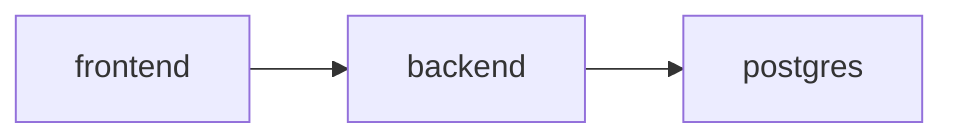

## Table of Contents

1. [Why are reachability and permission separate?](#why-are-reachability-and-permission-separate)
2. [What exactly changes when a policy selects a Pod?](#what-exactly-changes-when-a-policy-selects-a-pod)
3. [How do labels express that frontend may call backend without hard-coded Pod IPs?](#how-do-labels-express-that-frontend-may-call-backend-without-hard-coded-pod-ips)
4. [Why can the receiver allow a request while the sender still blocks it?](#why-can-the-receiver-allow-a-request-while-the-sender-still-blocks-it)
5. [Where does NetworkPolicy stop?](#where-does-networkpolicy-stop)
6. [How do you add a default-deny posture without discovering dependencies through an outage?](#how-do-you-add-a-default-deny-posture-without-discovering-dependencies-through-an-outage)
7. [Check Your Answers](#check-your-answers)
8. [References](#references)

Kubernetes gives Pods a network on which they can usually reach one another. Imagine three workloads:


```mermaid
flowchart LR
    Frontend[frontend] --> Backend[backend]
    Backend --> Postgres[postgres]
```

Without NetworkPolicy, a routable Pod such as `random-pod` can also try to reach those workloads. The intended graph is smaller: frontend may call backend on TCP `8080`, and backend may call postgres on TCP `5432`.

**A NetworkPolicy is a namespaced allow-list around selected Pods.** It tells a compatible network plugin which layer-3 and layer-4 conversations may enter or leave particular Pods. Services own stable routing, while application security owns human and workload authentication.

Connectivity and permission answer different questions. A Service creates a stable route to the backend. NetworkPolicy decides whether Pods with the frontend identity may send TCP traffic to that destination port, while unrelated workloads remain blocked.

Keep these questions in view as you work through the lesson:

1. **Why are reachability and permission separate?**
2. **What exactly changes when a policy selects a Pod?**
3. **How do labels express that frontend may call backend without hard-coded Pod IPs?**
4. **Why can the receiver allow a request while the sender still blocks it?**
5. **Where does NetworkPolicy stop?**
6. **How do you add a default-deny posture without discovering dependencies through an outage?**

## Why are reachability and permission separate?
<!-- section-summary: Kubernetes networking makes Pod communication possible, while NetworkPolicy adds an independent decision about which selected conversations are permitted. -->

The cluster network is designed to carry packets between Pods. A Service such as `backend:8080` makes the destination stable and finds ready backend endpoints. Authorisation remains a separate decision about whether frontend may use that reachable path.

That difference matters after compromise. If an attacker gains code execution in `random-pod`, they inherit that Pod's network position. An application password may still protect the database, but network reachability gives the attacker another interface to probe, another parser to exploit, and another chance to find a leaked credential.

NetworkPolicy reduces that reachable surface. The cluster can enforce two positive relationships: Pods with the frontend identity may reach backend on `8080`, and backend may reach postgres on `5432`.

The API describes these relationships as sets rather than individual machines. Let `F` be every Pod carrying `app=frontend` and `B` every Pod carrying `app=backend`. The first permission is the edge `F --TCP/8080--> B`. When a rollout replaces a Pod and gives the replacement a new IP, membership in `F` or `B` follows the stable labels. NetworkPolicy is therefore an allowed communication graph whose nodes are selected workload sets.

This creates one layer of defence alongside application security. First, the route must exist. Next, NetworkPolicy must permit the source and destination port. Once the connection reaches the application, authentication and application authorisation decide what the caller may do. NetworkPolicy can stop an unrelated Pod before it reaches that interface at all.

The distinction is visible in one packet. The CNI may have a valid route from `10.1.1.4` to `10.1.2.7`, proving that the destination is reachable. A policy can still reject traffic because the source Pod is not a member of the allowed frontend set. Conversely, a perfectly written allow rule cannot create a missing route or start a listener. Routing, network authorization, and application response are consecutive conditions rather than substitutes.

Begin policy design with a sentence, not YAML: “frontend needs TCP `8080` to backend so it can submit API requests.” That sentence names the caller set, receiver set, protocol, port, and reason. The manifest is only the Kubernetes encoding of that reviewed relationship.


## What exactly changes when a policy selects a Pod?
<!-- section-summary: A Pod starts non-isolated in each direction, then receives an allow-list for ingress or egress when a policy selects it for that direction. -->

The most important NetworkPolicy rule comes from selection. Selection changes a direction from open traffic to an allow-list.

By default, a Pod is non-isolated for ingress and egress. While every ingress policy leaves it unselected, NetworkPolicy permits incoming traffic. While every egress policy leaves it unselected, NetworkPolicy permits outgoing traffic.

When one or more policies select a Pod for a direction, Kubernetes treats that direction as isolated. Traffic in that direction is then allowed only when at least one selected policy allows it.

### A. Ingress: who may enter this Pod?

An ingress rule protects the receiving Pod. For `backend`, it can allow frontend on TCP `8080` while rejecting unrelated Pods.

### B. Egress: where may this Pod go?

An egress rule protects the sending Pod. For `backend`, it can allow the database on `5432` and DNS on `53`, while preventing arbitrary outbound connections.

### C. Ingress and egress are independent

A Pod can be isolated for ingress while remaining open for egress, or the reverse. A default-deny ingress policy changes only incoming traffic; outgoing traffic keeps its existing behavior.

This policy selects every Pod in `shop` and isolates ingress without allowing any incoming source:

```yaml
apiVersion: networking.k8s.io/v1
kind: NetworkPolicy
metadata:
  name: default-deny-ingress
  namespace: shop
spec:
  podSelector: {}
  policyTypes:
    - Ingress
```

The empty `podSelector` means “all Pods in this policy's namespace.” Once applied by a network plugin that enforces NetworkPolicy, existing and future Pods in `shop` are ingress-isolated.

Policies are additive. If one policy allows frontend and another allows a monitoring Pod, backend receives the union of both permissions. Standard NetworkPolicy has no ordered deny precedence, so every selected allow contributes to the final permitted set.

For the backend Pods, the result is a union of allowed sources. A policy that allows frontend and another that allows monitoring permit both sources. Omitting frontend from the monitoring policy leaves the frontend permission supplied by the first policy intact.

In set terms, the effective allow-list is `Policy A ∪ Policy B ∪ Policy C`. Kubernetes combines all applicable allows as a union rather than processing an ordered first-match firewall list. Once a direction is isolated, any flow absent from the union is rejected implicitly.

Ingress and egress can be isolated together with an empty allow-list:

```yaml
apiVersion: networking.k8s.io/v1
kind: NetworkPolicy
metadata:
  name: default-deny-all
  namespace: shop
spec:
  podSelector: {}
  policyTypes:
    - Ingress
    - Egress
```

This selects every Pod in `shop`, isolates both directions, and supplies zero allow rules. Additional policies then add the specific relationships the application requires.

### Follow the isolation transition

Suppose backend initially has no selecting ingress policy. Frontend, monitoring, and a random Pod can all attempt to connect because backend is ingress-unisolated. Applying `backend-ingress` changes the model immediately for the selected set:

```text
before: backend ingress = open unless another control blocks it
after:  backend ingress = union of explicit allows
```

If that policy allows only frontend on TCP `8080`, monitoring and random traffic disappear from the effective set. Adding a second policy that allows monitoring on `9090` does not override the first. The union now contains both permitted edges. Removing one policy removes only the edges that no remaining policy contributes.

This is why policy names such as “deny-monitoring” are misleading in the standard model. The resource does not execute in order and win over earlier objects. Selection creates isolation; ingress and egress rules contribute allows; unmatched flows in an isolated direction are rejected.

## How do labels express that frontend may call backend without hard-coded Pod IPs?
<!-- section-summary: Pod and namespace selectors turn mutable workload labels into a durable statement about which application role may communicate across an ownership boundary. -->

Pod IPs are temporary, so useful policies select identities represented by labels. The selector follows current frontend Pods as their addresses change.

We want this sentence:

> Pods labelled `app=frontend` in `shop` may enter Pods labelled `app=backend` on TCP port `8080`.

The corresponding policy belongs in the destination namespace because its `podSelector` chooses the Pods being protected:

```yaml
apiVersion: networking.k8s.io/v1
kind: NetworkPolicy
metadata:
  name: backend-ingress
  namespace: shop
spec:
  podSelector:
    matchLabels:
      app: backend
  policyTypes:
    - Ingress
  ingress:
    - from:
        - podSelector:
            matchLabels:
              app: frontend
      ports:
        - protocol: TCP
          port: 8080
```

Read it from the protected workload outward.

### A. Who is protected?

`spec.podSelector` selects `backend` Pods in the `shop` namespace. A NetworkPolicy's destination selection stays within its own namespace.

### B. Who may call them?

The `from` item selects Pods labelled `app=frontend` in the policy's own namespace.

### C. Which doorway is open?

The rule allows TCP `8080`. A shop Pod trying `5432` falls outside this relationship and is denied.

When namespace and Pod selectors are needed together, the structure of the YAML changes the logic. These two peers are alternatives:

```yaml
from:
  - namespaceSelector:
      matchLabels:
        environment: prod
  - podSelector:
      matchLabels:
        app: frontend
```

They mean “Pods in prod namespaces **OR** frontend Pods in the policy's own namespace.” To require “frontend Pods in prod namespaces,” both selectors must live inside the same list item. A small indentation change can therefore widen access substantially.

Treat identity labels like security inputs. A policy is only as precise as the labels it trusts. If any workload can claim `app: frontend`, that selector provides a weak security boundary. Protect workload manifests and namespace labels through admission and deployment permissions as part of the design.

### Read selector indentation as set logic

Take a backend in the `backend-prod` namespace. The intended caller set is “Pods labelled `app=frontend` that are also inside namespaces labelled `environment=prod`.” Both conditions belong in one peer:

```yaml
from:
  - namespaceSelector:
      matchLabels:
        environment: prod
    podSelector:
      matchLabels:
        app: frontend
```

Splitting them into two `from` entries changes intersection into union. The first entry then admits every Pod in a prod namespace, regardless of application label. The second admits frontend-labelled Pods from the policy's own namespace. Both may be much broader than the original sentence.

Translate each peer back to plain language during review. If the spoken rule contains “and,” the namespace and Pod constraints should describe one combined peer. If the rule genuinely contains “or,” separate peer entries can represent those alternatives.

## Why can the receiver allow a request while the sender still blocks it?
<!-- section-summary: A connection is allowed only when source egress permits it and destination ingress permits it, for whichever directions are isolated. -->

Suppose the backend policy above allows frontend, yet frontend still times out. The destination door may be open while the sender's own exit door remains locked.

For a new connection from frontend to backend, both isolated directions must permit the same flow. Frontend's egress rules must allow the backend Pods on TCP `8080`, and the backend Pods' ingress rules must allow the frontend Pods on TCP `8080`.

While frontend remains open for egress, only the destination ingress rule restricts this path. If a default-deny egress policy also selects frontend, an egress allow is required there as well.

The final decision can be written as:

```text
packet allowed = routing works
                 AND sender egress allows the flow
                 AND receiver ingress allows the flow
```

For a non-isolated direction, that side contributes an effective allow. Once isolation begins, the flow must appear in at least one applicable policy on that side. A successful connection requires the sender and receiver permissions independently.

In policy terms, frontend's egress allow-list needs the backend Pod set on TCP `8080`, while backend's ingress allow-list needs the frontend Pod set on the same port.

There is another dependency that application diagrams often omit: frontend needs DNS before it can find `backend`. A strict egress allow-list that permits only port `8080` to backend may accidentally block DNS queries.

A complete egress design must also allow the DNS path on port `53`; otherwise the caller may be permitted to reach backend by address while still being unable to resolve the Service name.

A review of the backend policy alone misses two caller-side boundaries. The real request crosses the caller's DNS egress, the caller's application egress, and the receiver's ingress. Each isolated boundary must allow its part of the conversation.

Follow the named request as two network flows:

```text
1. frontend -> cluster DNS :53
2. frontend -> backend Pod :8080
```

The second flow is evaluated as frontend egress and backend ingress. If the first is denied, the application may never learn the Service address needed to begin the second. A report such as “cannot resolve backend” can therefore be accurate application evidence for a missing egress allow, even though CoreDNS itself is healthy.

When testing by direct Pod IP succeeds but testing by Service name fails, do not widen the backend rule immediately. The backend connection may already be permitted. Inspect the earlier DNS flow from the same frontend Pod and ensure both UDP and TCP `53` behavior required by the environment is represented.

## Where does NetworkPolicy stop?
<!-- section-summary: Standard NetworkPolicy controls selected network peers, protocols, and ports; users, HTTP actions, Service identity, encryption, and platform-specific data paths belong to adjacent controls. -->

NetworkPolicy is deliberately narrower than a complete security system.

### HTTP meaning belongs to layer seven

Allowing TCP `8080` permits a connection on that port. A layer-seven control such as application authorisation, an API gateway, or service-mesh policy does not distinguish `GET /admin`, JWT claims, SQL query contents, users, or application roles.

### Identity and encryption belong to security protocols

A matching label is a network identity input. TLS and workload identity systems provide cryptographic identity, rotate certificates, and help prove which workload initiated a request; application authentication handles the human identity.

### Rules select network peers instead of Service names

Rules select Pods, namespaces, IP blocks, protocols, and ports. To allow traffic behind `backend`, the policy selects the Service's backend Pods. A Service may translate its virtual IP to a Pod IP before or after policy processing, depending on the cluster's networking implementation. This also makes `ipBlock` behaviour around Service traffic and address translation platform-sensitive.

The standard policy model can describe TCP, UDP, and SCTP flows when the installed network implementation supports the protocol. It still evaluates transport conversations rather than the meaning of the payload carried over them. A TCP rule for `8080` treats every HTTP method on that connection as the same network permission.

The application thinks in terms of `frontend -> backend Service`. Enforcement ultimately evaluates the traffic that reaches the selected backend Pod endpoints. This is why Service existence and a matching policy still need compatible Pod labels: the Service selector discovers the backends, and the NetworkPolicy selector defines their communication boundary.

### It only works when the network implementation enforces it

The Kubernetes API can accept a NetworkPolicy while the installed networking plugin lacks enforcement support. In that case the object exists while traffic remains unaffected. Verify the CNI's support and use its diagnostics or flow logs when available.

The implementation may realise the desired rules through iptables, nftables, eBPF, or another data-plane mechanism. The NetworkPolicy object remains the shared API contract; the installed CNI determines which features are enforced and which diagnostic evidence is available.

### Some edge cases are implementation-dependent

Treatment of existing connections after a policy change, node-local traffic, and address translation details can vary. Test the actual cluster rather than inferring enforcement from accepted YAML.

NetworkPolicy evaluates **network identity and transport reachability**. Application and layer-seven controls evaluate the business meaning carried inside the connection.

Kubernetes RBAC belongs to another axis as well. RBAC controls who may call the Kubernetes API and modify resources. NetworkPolicy controls which workload network flows are allowed after the Pods exist.

These layers should reinforce one another without being confused. NetworkPolicy can prevent `random-pod` from opening PostgreSQL's TCP port, but it cannot decide whether an authenticated database connection may execute `DROP TABLE`. mTLS can prove a workload's cryptographic identity, while a label selector alone trusts Kubernetes workload metadata. RBAC can stop an unauthorized developer from changing the policy, while it does not filter application packets between Pods.

## How do you add a default-deny posture without discovering dependencies through an outage?
<!-- section-summary: Discover required flows, add narrow allows, introduce isolation in stages, and test one required and one forbidden caller so success and denial are both observable. -->

A default-deny policy is a good target, but applying it before you know the application's dependencies converts missing knowledge into downtime.

Start with one workload and draw its required conversations. For frontend, that might be:

The web Pod needs two outbound relationships: DNS on UDP and TCP `53`, followed by `backend` on TCP `8080`. The first lookup discovers the Service address; the second connection carries the application request.

List each concrete external dependency and decide whether the standard policy model can express it safely on this platform. Infrastructure dependencies belong in the same inventory as business services. Typical examples include cluster DNS, metrics and logging collectors, service-mesh components, workload identity services, the Kubernetes API, cloud metadata or provider APIs, databases, message brokers, and explicitly approved external APIs. A broad “internet” rule hides which relationships the application truly needs.

For example, the backend dependency map can include postgres on TCP `5432`, Redis on `6379`, a payments API on `443`, and DNS on `53`. Record required, expected, and unknown flows before isolation; unknown traffic needs investigation rather than permanent permission.

A compact flow inventory makes the desired graph reviewable before it becomes YAML:

| Caller | Required destination | Protocol and port |
|---|---|---|
| frontend | backend | TCP `8080` |
| frontend | DNS | port `53` |
| backend | postgres | TCP `5432` |
| backend | Redis | TCP `6379` |
| backend | payments API | TCP `443` |
| backend | DNS | port `53` |
| worker | postgres | TCP `5432` |
| worker | queue | TCP `5672` |
| worker | DNS | port `53` |

Classify each observed flow as required, expected, or unknown. The policies are an encoding of that reviewed graph, and the labels must express the same workload identities.

Add the narrow allow policies before isolation where your rollout process permits it. Introduce ingress and egress isolation separately so a failure has a smaller search space. After each change, test the real path from the real caller.

A safe first slice can protect only postgres ingress. Apply an allow for backend on `5432`, then isolate postgres, and test three results: backend succeeds, frontend fails, and an unrelated Pod fails. The success proves the required dependency survived; both failures prove the new boundary actually excludes callers outside the intended set.

Only after that relationship is understood should the team expand isolation to backend, namespace-wide ingress, and finally egress. Egress usually reveals more hidden infrastructure dependencies because name resolution, telemetry, identity, provider APIs, and external services all begin as outbound flows.

Also test callers that must be denied. The raw example expects backend-to-postgres to work while frontend-to-postgres and unrelated-Pod-to-postgres fail. Positive and negative tests prove different sides of the boundary.

When a required call fails, inspect selection before editing ports:

1. Does the policy's top-level `podSelector` select the destination Pods you intended?
2. Do the source namespace and Pod labels match the same peer item?
3. Is the caller isolated for egress by another policy?
4. Is DNS allowed before the named call begins?
5. Does the cluster plugin enforce the API, and what do its flow diagnostics show?

Then walk the packet from both ends. Confirm whether the source Pod is egress-isolated, whether DNS and Service routing work, whether the destination Pod is ingress-isolated, whether selectors are combined as AND or OR as intended, and whether address translation changes what the plugin evaluates. The complete result comes from the union of every policy selecting the source and destination.

Record the broken relationship plainly by naming the source, destination, direction, protocol, port, and selector that did not match. That explanation shows which assumption failed and where to repair it.

For example: “frontend Pods are egress-isolated; no selected policy allows UDP/TCP `53` to cluster DNS, so `backend` never resolves.” That statement is actionable and narrow. “NetworkPolicy broke networking” gives no clue whether the missing edge belongs to source egress, destination ingress, selector identity, DNS, or an unenforced CNI feature.

Adoption can progress in stages:

1. Protect a sensitive workload such as postgres while the rest of the namespace remains open.
2. Introduce default-deny ingress after required incoming relationships have explicit allows.
3. Introduce default-deny egress after DNS and external dependencies are mapped.
4. Keep labels, namespace ownership, and policies aligned with the application's real trust boundaries.

The useful completion criterion is that the allowed network graph resembles the intended dependency graph. Merely counting NetworkPolicy objects says little about which conversations the cluster actually permits.

## Check Your Answers
<!-- section-summary: Reconstruct the policy model from application relationships, directional isolation, selector logic, and observable allowed and denied tests. -->

:::expand[Why are reachability and permission separate?]{kind="recap"}
Reachability proves that the network can carry packets to a destination. Permission decides whether this source may use that path. NetworkPolicy reduces the interfaces a compromised or mistaken workload can contact, while application authentication and authorisation govern the actions inside an allowed connection.
:::

:::expand[What exactly changes when a policy selects a Pod?]{kind="recap"}
A Pod starts non-isolated in each direction. A policy that selects it for ingress or egress gives that direction an allow-list. Traffic in the isolated direction must match at least one rule from the union of all policies that select the Pod.
:::

:::expand[How do labels express that frontend may call backend without hard-coded Pod IPs?]{kind="recap"}
The destination policy selects backend Pods, then an ingress peer selects frontend Pods by label. That states a durable workload relationship while individual Pod addresses change. When namespace and Pod selectors are combined in one peer they are AND; separate peers are OR.
:::

:::expand[Why can the receiver allow a request while the sender still blocks it?]{kind="recap"}
Ingress and egress are separate boundaries. If both directions are isolated, frontend egress must allow backend on the port and backend ingress must allow frontend on the same flow. Named calls also require DNS egress before the application connection can begin.
:::

:::expand[Where does NetworkPolicy stop?]{kind="recap"}
Standard NetworkPolicy stops at network peers, protocols, and ports enforced by a compatible network plugin. HTTP methods, users, Service identity, application permissions, encryption, and cryptographic identity belong to higher-level controls.
:::

:::expand[How do you add a default-deny posture without discovering dependencies through an outage?]{kind="recap"}
Map real workload flows first, verify the identity labels, add narrow allows, and introduce ingress and egress isolation in stages. After each step, repeat a required call from its real caller and an unwanted call from a representative denied caller.
:::

## References

- [Network Policies](https://kubernetes.io/docs/concepts/services-networking/network-policies/) - Official isolation, additive-rule, selector, `ipBlock`, and default-policy behaviour.
- [Declare Network Policy](https://kubernetes.io/docs/tasks/administer-cluster/declare-network-policy/) - Official walkthrough for selecting Pods and allowing a specific flow.
- [Default Network Policies](https://kubernetes.io/docs/concepts/services-networking/network-policies/#default-policies) - Official default-deny and allow patterns for ingress and egress.
- [Namespaces](https://kubernetes.io/docs/concepts/overview/working-with-objects/namespaces/) - Official namespace behaviour and the immutable namespace-name label.
- [Service](https://kubernetes.io/docs/concepts/services-networking/service/) - Official Service translation and endpoint model that interacts with policy enforcement.
