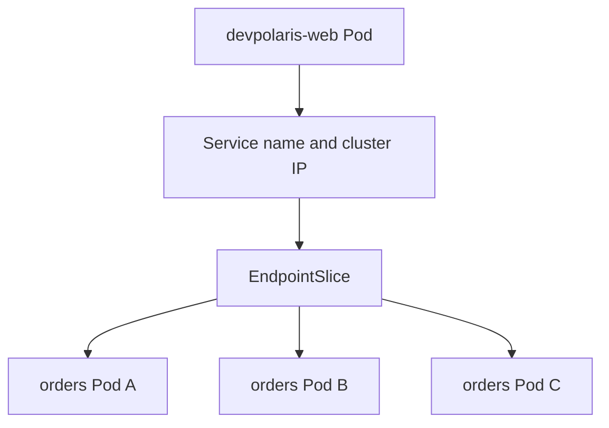

## Table of Contents

1. [Stable Names for Unstable Pods](#stable-names-for-unstable-pods)
2. [The Smallest Useful Service](#the-smallest-useful-service)
3. [Selectors Are the Contract](#selectors-are-the-contract)
4. [Ports Need Two Names](#ports-need-two-names)
5. [Readiness Controls Service Membership](#readiness-controls-service-membership)
6. [What Actually Handles the Traffic](#what-actually-handles-the-traffic)
7. [A Practical Service Debug Path](#a-practical-service-debug-path)
8. [Tradeoffs and Safe Defaults](#tradeoffs-and-safe-defaults)
9. [Service Ownership and Change Review](#service-ownership-and-change-review)
10. [A Complete Service Verification Pass](#a-complete-service-verification-pass)

## Stable Names for Unstable Pods

Kubernetes Pods are intentionally replaceable. A Deployment can create a new Pod during a rollout, delete an old one after a node drain, or start a replacement when a health check fails. That is good for operations, but it creates a problem for callers. A Pod IP address is a temporary address for one running copy, not a contract that another service should remember.


*A Service gives clients a stable contract while the pods behind it are replaced.*


A Service is the Kubernetes object that gives a changing set of Pods a stable network name and virtual address. It selects Pods by labels, publishes one virtual address and DNS name, and keeps the backend list fresh as Pods come and go.

Example: if `devpolaris-web` needs to call `devpolaris-orders-api`, it should call a Service name such as `http://devpolaris-orders-api.orders.svc.cluster.local`, not a temporary Pod IP like `10.244.2.18`. Kubernetes updates the backend endpoint list behind the Service whenever Pods are created, removed, or marked unready.



The Service does not make an unhealthy application healthy. It only gives network traffic a stable route to Pods that match the selector and are considered ready. If the selector is wrong, or the Pods are listening on a different port, the Service can exist and still send traffic nowhere useful.

## The Smallest Useful Service

A useful Service starts with a clear backend workload. The Service does not create Pods by itself, so it needs labels on existing Pods to decide where traffic can go.

Example: start with a Deployment for `devpolaris-orders-api`. The application listens on port `3000` inside the container and exposes an HTTP endpoint at `/healthz`. The Deployment labels matter because the Service will use those labels to find its backends.

```yaml
apiVersion: apps/v1
kind: Deployment
metadata:
  name: devpolaris-orders-api
  namespace: orders
spec:
  replicas: 3
  selector:
    matchLabels:
      app.kubernetes.io/name: devpolaris-orders-api
  template:
    metadata:
      labels:
        app.kubernetes.io/name: devpolaris-orders-api
    spec:
      containers:
        - name: api
          image: ghcr.io/devpolaris/orders-api:1.18.0
          ports:
            - name: http
              containerPort: 3000
```

The Service below publishes port `80` for callers and forwards to the named container port `http`. Using a named `targetPort` is useful because the Service can stay readable even if the container port number changes later. The Deployment owns the implementation detail. The Service owns the contract for callers.

```yaml
apiVersion: v1
kind: Service
metadata:
  name: devpolaris-orders-api
  namespace: orders
spec:
  type: ClusterIP
  selector:
    app.kubernetes.io/name: devpolaris-orders-api
  ports:
    - name: http
      protocol: TCP
      port: 80
      targetPort: http
```

After applying it, the first check is not an external browser. Check whether Kubernetes built the Service and found endpoints.

```bash
$ kubectl -n orders get svc devpolaris-orders-api
NAME                    TYPE        CLUSTER-IP    EXTERNAL-IP   PORT(S)   AGE
devpolaris-orders-api   ClusterIP   10.96.42.18   <none>        80/TCP    24s

$ kubectl -n orders get endpointslice -l kubernetes.io/service-name=devpolaris-orders-api
NAME                          ADDRESSTYPE   PORTS   ENDPOINTS                            AGE
devpolaris-orders-api-vzkk6   IPv4          3000    10.244.1.17,10.244.2.19,10.244.3.8   24s
```

That second command is the practical proof. The Service has a stable cluster IP, and the EndpointSlice lists the current Pod IPs that should receive traffic.

## Selectors Are the Contract

A Service selector is the rule that decides which Pods sit behind the Service. It reads labels on live Pod objects and builds the backend list from the Pods that match. For example, a selector for `app.kubernetes.io/name: devpolaris-orders-api` should find the three orders API Pods and ignore unrelated Pods in the same namespace.


*The selector is the contract that turns matching pod labels into service backends.*


The selector does not care which Deployment created the Pods. It only sees labels on live Pod objects. That makes labels powerful, but it also makes typo failures easy.

For `devpolaris-orders-api`, use labels that describe identity rather than rollout details. A label like `app.kubernetes.io/name: devpolaris-orders-api` should survive image tags, replica counts, and node moves. A label like `version: 1.18.0` is usually too specific for the main Service because the Service would lose endpoints during a version change unless every manifest changed together.

| Label shape | Good Service selector? | Why |
|-------------|------------------------|-----|
| `app.kubernetes.io/name: devpolaris-orders-api` | Yes | Stable identity for the workload |
| `environment: prod` | Usually no | Too broad, may match more than one app |
| `pod-template-hash: 74ddf6d88f` | No | Changes on rollouts |
| `track: stable` | Sometimes | Useful when intentionally splitting stable and canary traffic |

A selector mismatch often looks like a working Service with no endpoints. The object exists, DNS may resolve, and `curl` still fails because there are no backends behind the Service.

```bash
$ kubectl -n orders describe svc devpolaris-orders-api
Name:              devpolaris-orders-api
Namespace:         orders
Type:              ClusterIP
IP:                10.96.42.18
Port:              http  80/TCP
TargetPort:        http/TCP
Selector:          app.kubernetes.io/name=devpolaris-order-api
Endpoints:         <none>
```

The selector has `order-api`, singular, while the Pods are labeled `orders-api`, plural. Fix the label contract so the Service and Pods agree.

## Ports Need Two Names

A Service port is the public number inside the cluster contract, while the target port is the number the container actually listens on. `port` is what callers use when they connect to the Service. `targetPort` is where traffic lands on the backend Pod.

Example: callers can use `http://devpolaris-orders-api:80` while the Node.js process listens on container port `3000`. They are often the same number in small examples, but production systems frequently separate them.

For `devpolaris-orders-api`, callers use `http://devpolaris-orders-api:80` because port 80 is the simple in-cluster contract. The container listens on 3000 because the Node.js application uses that port. The Service bridges those two worlds.

```text
client Pod
  connects to devpolaris-orders-api.orders.svc.cluster.local:80
Service
  chooses a ready endpoint
orders-api Pod
  receives traffic on container port 3000
```

When the port is wrong, the Service may still have endpoints. That is why endpoint existence is necessary but not enough. If `targetPort` points to 8080 while the container listens on 3000, kube-proxy can forward traffic to the Pod IP correctly and the connection will still fail at the application boundary.

```bash
$ kubectl -n orders run netcheck --rm -it --image=curlimages/curl --restart=Never -- \
  curl -sv http://devpolaris-orders-api/healthz
* Host devpolaris-orders-api:80 was resolved.
*   Trying 10.96.42.18:80...
* Connected to devpolaris-orders-api (10.96.42.18) port 80
> GET /healthz HTTP/1.1
< HTTP/1.1 502 Bad Gateway
< content-type: application/json
{"error":"upstream connect failed"}
```

That output proves DNS and the Service IP worked. The next inspection target is the container port, readiness, and application logs, not the Service name.

## Readiness Controls Service Membership

A readiness probe is the Pod-level check that says whether this Pod should receive normal Service traffic. Kubernetes uses it to avoid routing to Pods that started but cannot handle requests yet.

Example: if the orders API process is running but has not connected to PostgreSQL, readiness can fail so the Service keeps that Pod out of the ready backend list. Without a readiness probe, Kubernetes may add a Pod to the Service before the application has opened its listener, warmed its cache, or connected to its database.

For `devpolaris-orders-api`, readiness should represent whether the API can handle ordinary order requests. A simple `/healthz` check is enough for a first pass. A production check might also verify database connectivity if the API cannot serve requests without it.

```yaml
readinessProbe:
  httpGet:
    path: /healthz
    port: http
  initialDelaySeconds: 5
  periodSeconds: 10
  failureThreshold: 3
```

The Service uses ready endpoints. You can see that in the EndpointSlice. A not-ready Pod may still appear in object data, but it should not receive normal traffic as a ready backend.

```bash
$ kubectl -n orders get endpointslice -l kubernetes.io/service-name=devpolaris-orders-api -o yaml
endpoints:
  - addresses:
      - 10.244.1.17
    conditions:
      ready: true
  - addresses:
      - 10.244.2.19
    conditions:
      ready: false
```

If a rollout returns intermittent errors, compare the timing of readiness failures with client errors. A Service may be doing its job correctly by removing not-ready Pods. The failure may be that the application reports ready too early or never reports ready after a configuration change.

## What Actually Handles the Traffic

The Service object is the API record, but packets still need node-level routing to reach a Pod. A packet is a small chunk of network data moving from one address and port to another.

In many clusters, `kube-proxy` watches Services and EndpointSlices and programs node network rules so traffic to a Service IP can reach a backend Pod. Some clusters use CNI implementations that replace part or all of kube-proxy behavior, but the learner-friendly model is the same: the API object describes the desired route, and node-level networking makes it real.

This distinction matters during debugging. If the Service has endpoints and DNS resolves, but traffic to the cluster IP hangs from every Pod, the problem may be in the Service proxy layer or network plugin. That is less common than selector and port mistakes, so check the simple object state first.

```bash
$ kubectl -n kube-system get pods -l k8s-app=kube-proxy
NAME               READY   STATUS    RESTARTS   AGE
kube-proxy-5gqv7   1/1     Running   0          8d
kube-proxy-rh2pn   1/1     Running   0          8d
kube-proxy-z9m6p   1/1     Running   0          8d
```

If your managed cluster does not expose kube-proxy, use the provider or CNI documentation for the equivalent component. The operating habit still holds: verify the API object, verify the endpoint list, then verify the data plane that turns those objects into packet routing.

## A Practical Service Debug Path

When a Service fails, move from caller to Service to backend. This order prevents random changes. You are proving one layer at a time.

Start from inside the cluster with a temporary debugging Pod. That removes external load balancers, DNS zones, browsers, TLS, and firewalls from the first test.

```bash
$ kubectl -n orders run netcheck --rm -it --image=curlimages/curl --restart=Never -- sh
/ $ curl -sS http://devpolaris-orders-api/healthz
{"status":"ok","service":"orders-api"}
```

If the name fails, test the Service IP. If the IP works, look at DNS. If the IP fails, inspect the Service and EndpointSlices. If the endpoints exist, test one Pod IP directly. If direct Pod traffic works but Service IP traffic fails, inspect kube-proxy or the CNI layer.

```text
1. Does the caller resolve the Service name?
2. Does the Service IP accept a connection?
3. Does the Service have EndpointSlices?
4. Do the EndpointSlices point at ready Pods?
5. Does a direct Pod IP and port answer?
6. Does the node proxy or CNI report errors?
```

That path is deliberately plain. It is also how experienced engineers save time. Most Service problems are mismatched labels, wrong target ports, missing readiness, or callers using the wrong namespace.

## Tradeoffs and Safe Defaults

Use a ClusterIP Service as the default internal contract. It keeps traffic inside the cluster and gives other workloads a stable name. Reach for other Service types only when you need traffic from outside the cluster or when another object, such as an Ingress or Gateway, needs a backend.

The tradeoff is indirection. A Service adds another object to inspect, and the network path is less obvious than a direct Pod IP. That cost is worth paying because direct Pod IPs are not stable and do not express readiness.

For `devpolaris-orders-api`, the safe starting shape is simple: Deployment labels are stable, Service selector matches those labels, callers use the Service DNS name, readiness controls endpoint membership, and external traffic comes through a separate routing layer. That gives the team one internal contract and leaves room to add Ingress, Gateway API, or NetworkPolicies without changing every caller.

Before you move on, practice reading the three objects together: Deployment labels, Service selector, and EndpointSlice addresses. If those agree, you understand the core of Kubernetes Services.

## Service Ownership and Change Review

A Service becomes part of the application contract, so review it like code that other teams call. For `devpolaris-orders-api`, the Service name, namespace, port name, and selector are the details callers and routing objects depend on. Changing any of those can break callers even when the Pods still run.

A good review asks what will happen to existing clients during and after the change. Renaming the Service forces callers to update URLs. Changing `port` from 80 to 8080 forces callers to update configuration. Changing `targetPort` may be safe if the named container port still exists. Changing the selector can immediately move traffic to a different set of Pods.

```yaml
# Safer application change: container port number changes, name stays stable
ports:
  - name: http
    containerPort: 8080
---
ports:
  - name: http
    port: 80
    targetPort: http
```

The Service still targets `http`, so the workload can change its internal listener without forcing every caller to learn the new number. That is why named ports are a useful habit for real teams.

```text
Review the Service contract:
- Does the Service name match what callers already use?
- Does the namespace match the intended ownership boundary?
- Does the selector match stable identity labels?
- Does the Service port stay stable for clients?
- Does readiness protect callers during rollout?
```

These questions are small, but they prevent avoidable outages during ordinary Deployment changes.

## A Complete Service Verification Pass

After creating or changing a Service, run a short verification pass that proves each layer. The output should be boring. Boring output is useful because it gives you a baseline for later incidents.

```bash
$ kubectl -n orders get deploy devpolaris-orders-api
NAME                    READY   UP-TO-DATE   AVAILABLE   AGE
devpolaris-orders-api   3/3     3            3           18m

$ kubectl -n orders get svc devpolaris-orders-api
NAME                    TYPE        CLUSTER-IP    EXTERNAL-IP   PORT(S)   AGE
devpolaris-orders-api   ClusterIP   10.96.42.18   <none>        80/TCP    16m

$ kubectl -n orders get endpointslice -l kubernetes.io/service-name=devpolaris-orders-api
NAME                          ADDRESSTYPE   PORTS   ENDPOINTS                            AGE
devpolaris-orders-api-vzkk6   IPv4          3000    10.244.1.17,10.244.2.19,10.244.3.8   16m
```

Then test from a caller-shaped Pod. If the real caller is in the `web` namespace, testing from `orders` only proves less than you think.

```bash
$ kubectl -n web run orders-check --rm -it --restart=Never --image=curlimages/curl -- \
  curl -sS http://devpolaris-orders-api.orders/healthz
{"status":"ok","service":"orders-api"}
```

Keep this verification pass short enough that engineers actually run it. It proves Deployment availability, Service publication, endpoint membership, and caller reachability without turning a concept check into a full incident drill.


*Use this Service checklist when a request cannot find the right pod.*

---

**References**

- [Service](https://kubernetes.io/docs/concepts/services-networking/service/) - The canonical Kubernetes explanation of Services, selectors, Service types, and EndpointSlices.
- [Debug Services](https://kubernetes.io/docs/tasks/debug/debug-application/debug-service/) - The official troubleshooting path for checking Pods, Services, endpoints, DNS, and kube-proxy behavior.
- [Cluster Networking](https://kubernetes.io/docs/concepts/cluster-administration/networking/) - The official overview of the Kubernetes networking model and IP ranges.
