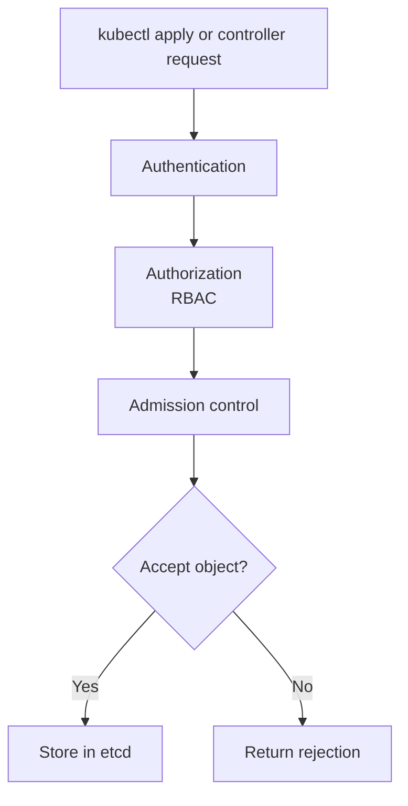

## Table of Contents

1. [The API Server Checkpoint](#the-api-server-checkpoint)
2. [Mutating and Validating Admission](#mutating-and-validating-admission)
3. [Built In Policies and Pod Security](#built-in-policies-and-pod-security)
4. [Validating Admission Policy](#validating-admission-policy)
5. [Policy Engines in Real Clusters](#policy-engines-in-real-clusters)
6. [Design Policies That Developers Can Fix](#design-policies-that-developers-can-fix)
7. [Failure Mode: A Policy Blocks the Release](#failure-mode-a-policy-blocks-the-release)
8. [Policy Review Questions](#policy-review-questions)

## The API Server Checkpoint

Every Kubernetes change passes through the API server. A user runs `kubectl apply`, a GitOps controller syncs a manifest, or a CI job patches a Deployment. Before the object is stored, admission control can inspect the request. Some admission steps can change the object. Others can reject it.

Admission policies exist because prevention is cheaper than cleanup. It is better to reject a `devpolaris-orders-api` Deployment that runs as root than to discover after an incident that every Pod had weak defaults. It is better to require owner labels when the object is created than to spend a cost review guessing who owns a forgotten workload.

Admission control fits after authentication and authorization. RBAC decides whether the caller may create a Deployment at all. Admission decides whether this particular Deployment shape is acceptable.



That ordering means policy is not a replacement for RBAC. It is a second guard that checks object content.

## Mutating and Validating Admission

Admission controllers are usually described as mutating or validating. Mutating admission can modify an object before it is stored. Validating admission can accept or reject the final object.

| Admission type | What it does | Example |
|----------------|--------------|---------|
| Mutating | Adds or changes fields | Add default labels or inject a sidecar |
| Validating | Allows or rejects the object | Reject images without digests |
| Both together | Default first, validate after | Add defaults, then require required fields |

For example, a mutating webhook might add `team=orders` to every object in the `orders` namespace. A validating policy might reject any Pod that lacks `app.kubernetes.io/name`.

The tradeoff is surprise. Mutation can reduce repetitive YAML, but it can also make the stored object differ from what the developer reviewed. Validation is easier to reason about because it says yes or no. Use mutation for safe defaults, and use validation for boundaries that should be explicit.

## Built In Policies and Pod Security

Kubernetes includes Pod Security Admission, which applies Pod Security Standards through namespace labels. This is built in and useful for broad Pod safety.

```bash
$ kubectl label namespace orders \
  pod-security.kubernetes.io/enforce=restricted \
  pod-security.kubernetes.io/audit=restricted \
  pod-security.kubernetes.io/warn=restricted
namespace/orders labeled
```

Now a privileged debug Pod is rejected:

```bash
$ kubectl -n orders run debug-root --image=busybox --privileged -- sleep 3600
Error from server (Forbidden): pods "debug-root" is forbidden:
violates PodSecurity "restricted:latest": privileged, allowPrivilegeEscalation != false,
unrestricted capabilities, runAsNonRoot != true
```

This protects the namespace without requiring every team to write the same policy from scratch. It does not cover every organization rule, such as image registry allowlists, required cost labels, or replica minimums. For those, teams use ValidatingAdmissionPolicy or external policy engines.

## Validating Admission Policy

ValidatingAdmissionPolicy lets clusters validate API requests using CEL, the Common Expression Language. It is useful for rules that can be expressed from the object fields and request context.

Suppose the platform team wants every Deployment in `orders` to carry an owner label. The policy can check that the label exists.

```yaml
apiVersion: admissionregistration.k8s.io/v1
kind: ValidatingAdmissionPolicy
metadata:
  name: require-owner-label
spec:
  matchConstraints:
    resourceRules:
      - apiGroups: ["apps"]
        apiVersions: ["v1"]
        operations: ["CREATE", "UPDATE"]
        resources: ["deployments"]
  validations:
    - expression: "has(object.metadata.labels['devpolaris.io/owner'])"
      message: "Deployments must set devpolaris.io/owner."
```

A binding attaches the policy to a scope.

```yaml
apiVersion: admissionregistration.k8s.io/v1
kind: ValidatingAdmissionPolicyBinding
metadata:
  name: require-owner-label-orders
spec:
  policyName: require-owner-label
  validationActions: ["Deny"]
  matchResources:
    namespaceSelector:
      matchLabels:
        kubernetes.io/metadata.name: orders
```

When a Deployment lacks the label, the API server rejects it with the policy message. The message is part of the developer experience. A clear message turns a denial into a fixable checklist item.

## Policy Engines in Real Clusters

Many clusters use policy engines such as Kyverno, Gatekeeper, or cloud-provider policy tools. These engines can provide higher-level policy formats, audit reports, mutation, image verification, and reusable rule libraries.

The operating idea stays the same. A policy should catch unsafe changes before they become running Pods. For `devpolaris-orders-api`, common rules might include:

| Policy | Failure it prevents |
|--------|---------------------|
| Require approved registry | Prevents images from personal or unknown registries |
| Require immutable image digests | Prevents tags from changing after review |
| Require resource requests | Makes scheduling and autoscaling reliable |
| Require restricted Pod settings | Reduces container escape impact |
| Require owner and service labels | Makes cost, alerts, and incident ownership searchable |

Start with a small set of high-value rules. Too many rules at once create noisy rejections, and teams learn to route around them. A good policy program includes warnings, audit mode, examples, and a clear path for exceptions.

## Design Policies That Developers Can Fix

A useful policy names the problem and the repair. A vague denial such as `policy failed` sends developers searching through platform code. A good denial says exactly which field is missing or unsafe.

Bad message:

```text
admission webhook "policy.platform.local" denied the request: invalid workload
```

Better message:

```text
admission denied: Deployment devpolaris-orders-api must use an image from ghcr.io/devpolaris and must include a digest such as @sha256:...
```

The second message teaches the rule and the next action. It also names the object. This matters during release pressure, when the person seeing the error may not be the person who wrote the policy.

Policy exceptions need the same care. Some controllers need broader permissions or unusual Pod settings. Exceptions should be scoped by namespace, service account, label, or object name, and they should expire or be reviewed. A permanent exception for an entire namespace becomes a quiet policy bypass.

## Failure Mode: A Policy Blocks the Release

Imagine a CI job tries to deploy a new orders API image:

```bash
$ kubectl -n orders apply -f deployment.yaml
Error from server (Forbidden): error when creating "deployment.yaml":
admission denied: container api image "ghcr.io/devpolaris/orders-api:latest"
must use an immutable digest
```

The policy is doing useful work. The `latest` tag can move after review, so the cluster cannot prove which image was approved. The fix is to deploy by digest.

```yaml
containers:
  - name: api
    image: ghcr.io/devpolaris/orders-api@sha256:8f4b9c7a9d1f6e24d5b6b0c2e9f77b0c4f37d8443c188a6eac1d2d5c07e42a91
```

The diagnostic path is:

1. Read the admission error message.
2. Identify whether RBAC or admission rejected the request.
3. Inspect the exact field named by the policy.
4. Fix the manifest or request a scoped exception if the policy cannot support a valid workload.

RBAC errors usually say `cannot create resource`. Admission errors usually say a webhook or policy denied the object content. That distinction tells you who needs to help: access administrators for RBAC, platform policy owners for admission rules.

## Policy Review Questions

Review admission policy as product behavior for developers and safety behavior for the platform.

| Question | Why it matters |
|----------|----------------|
| What incident or mistake does this prevent? | Policies should have a concrete reason |
| Can the message be fixed without asking around? | Clear messages reduce release delays |
| Is there an audit or warn phase first? | Existing workloads may need cleanup |
| Is the scope narrow enough? | Broad policies can block unrelated teams |
| Are exceptions explicit and reviewed? | Hidden bypasses weaken trust |
| Does it overlap with RBAC or Pod Security? | Avoid duplicate controls with different messages |

For `devpolaris-orders-api`, the best policies are boring and predictable: approved registry, immutable image, resource requests, restricted Pod settings, and ownership labels. These rules catch common mistakes before Pods start, and each one has a clear fix.

A policy rollout should have phases. Going straight to deny mode can block unrelated releases if existing manifests are not ready. A staged rollout gives teams evidence and time to fix.

```text
Policy: require immutable images
Scope: orders namespace

Phase 1, audit:
  Record workloads using tags without digests
  Send report to service owners

Phase 2, warn:
  Return warnings on CREATE and UPDATE
  Keep deployments allowed while teams update pipelines

Phase 3, deny:
  Reject new Deployments without image digests
  Allow scoped exceptions for approved break-glass cases
```

That rollout plan treats policy as a production change. It has scope, phases, owners, and an exception path.

A useful audit record names the exact object and field:

```text
namespace=orders
kind=Deployment
name=devpolaris-orders-api
container=api
field=spec.template.spec.containers[0].image
value=ghcr.io/devpolaris/orders-api:2026-05-07.2
required=ghcr.io/devpolaris/orders-api@sha256:<digest>
```

The service team can fix that without reading the policy implementation. The CI pipeline should publish the image, capture the digest, and deploy the digest.

Policy testing should include passing and failing examples. For a required owner label, keep both manifests in a policy test suite or runbook.

```yaml
apiVersion: apps/v1
kind: Deployment
metadata:
  name: missing-owner
  namespace: orders
  labels:
    app.kubernetes.io/name: devpolaris-orders-api
spec:
  selector:
    matchLabels:
      app.kubernetes.io/name: devpolaris-orders-api
  template:
    metadata:
      labels:
        app.kubernetes.io/name: devpolaris-orders-api
    spec:
      containers:
        - name: api
          image: ghcr.io/devpolaris/orders-api@sha256:8f4b9c7a9d1f6e24d5b6b0c2e9f77b0c4f37d8443c188a6eac1d2d5c07e42a91
```

The expected result is denial because `devpolaris.io/owner` is missing. The passing example adds the label:

```yaml
metadata:
  labels:
    app.kubernetes.io/name: devpolaris-orders-api
    devpolaris.io/owner: orders-team
```

If the policy message points at the missing label, the developer experience is healthy. If the message only says `validation failed`, improve the policy before enforcing it widely.

Policies can also fail because webhooks are unavailable. This is a different failure family from a normal denial.

```text
Error from server (InternalError): failed calling webhook "validate.policy.platform.local":
Post "https://policy-webhook.platform.svc:443/validate": context deadline exceeded
```

This error means the API server could not get a response from the webhook. The fix direction is the policy engine Deployment, Service, TLS configuration, network path, or webhook timeout and failure policy. Do not ask the application team to change `devpolaris-orders-api` until the policy service is healthy.

Review webhook `failurePolicy` carefully. `Fail` protects the cluster by rejecting requests when the webhook is unavailable. `Ignore` keeps the API available but lets objects bypass the policy during an outage. The right choice depends on the policy. A security boundary often uses `Fail`. A low-risk labeling helper may use `Ignore` to avoid blocking releases.

This tradeoff should be explicit in the policy review:

| Policy type | Typical failure policy | Reason |
|-------------|------------------------|--------|
| Image signature verification | `Fail` | Running unverified images is a security risk |
| Required ownership labels | Depends on maturity | Missing labels hurt operations but may not justify outage |
| Sidecar injection | Depends on workload | Some services can run without injection, others cannot |
| Restricted Pod settings | `Fail` when enforced | Unsafe Pods should not start in protected namespaces |

Admission policy is powerful because it turns platform expectations into automatic checks. That power deserves careful rollout, clear messages, and regular review.

---

**References**

- [Kubernetes: Admission Controllers](https://kubernetes.io/docs/reference/access-authn-authz/admission-controllers/) - Official overview of admission controller phases and built-in controllers.
- [Kubernetes: Dynamic Admission Control](https://kubernetes.io/docs/reference/access-authn-authz/extensible-admission-controllers/) - Explains mutating and validating admission webhooks.
- [Kubernetes: Validating Admission Policy](https://kubernetes.io/docs/reference/access-authn-authz/validating-admission-policy/) - Official guide for CEL-based validation policies.
- [Kubernetes: Pod Security Admission](https://kubernetes.io/docs/concepts/security/pod-security-admission/) - Built-in namespace-level Pod security enforcement.
