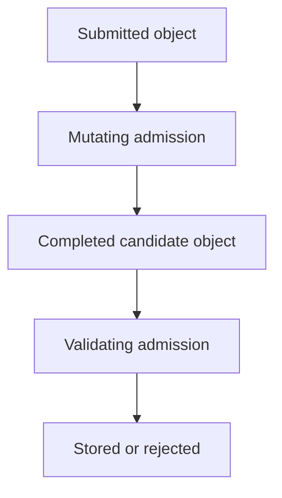

## Table of Contents

1. [Where does admission sit in a Kubernetes API request?](#where-does-admission-sit-in-a-kubernetes-api-request)
2. [How do mutation and validation work together?](#how-do-mutation-and-validation-work-together)
3. [Which policy layer fits a particular cluster rule?](#which-policy-layer-fits-a-particular-cluster-rule)
4. [How do a ValidatingAdmissionPolicy and its binding divide responsibility?](#how-do-a-validatingadmissionpolicy-and-its-binding-divide-responsibility)
5. [How can a team measure policy impact before requests are denied?](#how-can-a-team-measure-policy-impact-before-requests-are-denied)
6. [Which operating choices keep admission webhooks dependable?](#which-operating-choices-keep-admission-webhooks-dependable)
7. [How do you diagnose a rejected request and verify the repair?](#how-do-you-diagnose-a-rejected-request-and-verify-the-repair)
8. [Check Your Answers](#check-your-answers)
9. [References](#references)

Kubernetes stores desired state. Every create, update, or delete request therefore proposes a transition from the current cluster state to a new one. Admission control is the checkpoint that examines that proposed transition after access has been granted but before the result is persisted.

Seven questions build that model:

1. **Where does admission sit in a Kubernetes API request?**
2. **How do mutation and validation work together?**
3. **Which policy layer fits a particular cluster rule?**
4. **How do a ValidatingAdmissionPolicy and its binding divide responsibility?**
5. **How can a team measure policy impact before requests are denied?**
6. **Which operating choices keep admission webhooks dependable?**
7. **How do you diagnose a rejected request and verify the repair?**

## Where does admission sit in a Kubernetes API request?
<!-- section-summary: Admission examines an authorized write after identity and permission checks but before Kubernetes stores the resulting object. -->

### Treat every write as a proposed state transition

Let `S` be the cluster state before a request, `R` the request, and `O` the submitted object. Authentication derives the principal from `R`. Authorization decides whether that principal may attempt the verb on the resource. Admission then evaluates the proposed object before Kubernetes commits a new state.

```text
principal = authenticate(R)
authorize(principal, R.verb, R.resource) -> allow or deny
O' = mutate(O)
validate(O') -> allow or deny
S' = persist(O')
```

This model explains why RBAC and admission are not interchangeable. RBAC may allow Alice to create Deployments in `production`; admission can still reject one particular Deployment because it uses `hostNetwork`, requests `64Gi` of memory, uses an unapproved image tag, or lacks an ownership label. Permission answers **who may attempt the transition**. Admission answers **whether this proposed transition preserves the cluster's rules**.

Start with this proposed Pod:

```yaml
apiVersion: v1
kind: Pod
metadata:
  name: payments
spec:
  containers:
    - name: app
      image: payments:latest
      securityContext:
        privileged: true
```

Kubernetes must answer different questions in order:

1. **Authentication:** who sent the request?
2. **Authorization:** may that identity perform this action on this resource and scope?
3. **Mutating admission:** should the proposed object be changed?
4. **Validating admission:** is the resulting object acceptable?
5. **Persistence:** if every gate succeeds, what exact state should be stored?

Authentication can identify `system:serviceaccount:payments:deploy-agent`, and RBAC can allow that identity to create Deployments in `payments`. Neither answer says that every possible Deployment body is acceptable. Admission evaluates the object and request context after authorization has allowed the attempt.

Admission applies to write requests such as create, update, and delete. Ordinary reads such as get, list, and watch bypass it. Any admission controller can reject the write, so a rejected object never becomes desired state for downstream controllers to reconcile.

### Think in proposed state transitions

Let `S` be the stored cluster state and `O` the object submitted with a write request. Authentication derives a principal from the request. Authorization decides whether that principal may attempt the verb on the resource and scope. Mutating admission transforms the proposal into a candidate `O'`, and validating admission evaluates the candidate. Only an accepted candidate produces new stored state `S'`.

```text
principal = authenticate(request)
authorize(principal, verb, resource, scope)
O' = mutate(O)
allow only if every required validation accepts O'
S' = persist(O')
```

This formal view explains why RBAC and admission are not competing controls. Alice may be authorized to create Deployments in `payments`, while admission rejects only the candidate whose Pod template requests `hostNetwork: true`, a privileged container, an excessive memory request, a missing owner label, or a prohibited image tag. Authorization grants the class of attempt; admission judges the proposed contents and transition.

### Admission guards new writes, not all existing reality

Admission is not a continuous compliance loop. If an old Deployment already lacks an `owner` label, enabling a new owner-label policy does not rewrite or delete it. The policy affects later matching creates and updates that pass through the API server.

That boundary separates three jobs:

- admission prevents unacceptable future state transitions;
- a scanner finds unacceptable state that is already stored;
- a controller can continuously repair existing state toward a desired condition.

Teams often need both an existing-state scan and an admission rule. Otherwise a cluster can enforce a rule for new writes while old objects remain outside it.

## How do mutation and validation work together?
<!-- section-summary: Mutation produces a completed candidate object, and validation decides whether that final candidate may enter cluster state. -->

### Mutation establishes platform-owned defaults

Mutation and validation answer different questions. A mutating controller can add a default label, inject a sidecar, or supply another controlled field. A validating controller checks whether the object is acceptable.

The order matters:


```mermaid
flowchart TD
    Submitted[Submitted object] --> Mutating[Mutating admission]
    Mutating --> Candidate[Completed candidate object]
    Candidate --> Validating[Validating admission]
    Validating --> Result[Stored or rejected]
```

Suppose a user submits a Deployment labelled `app: checkout`, and a mutating controller adds `platform.example.com/managed: "true"`. Validation sees the completed object, including that addition. This prevents a mutator from introducing a field that later policy never examines.

Mutation should be deterministic and idempotent: applying its logic again should not keep changing the object. Validation should produce a clear reason tied to the rule that failed. Defaults belong in mutation; invariants such as “every Deployment has a non-empty owner label” belong in validation.

The order also lets the two phases form one contract. Suppose mutation adds `securityContext.seccompProfile.type: RuntimeDefault`, while validation requires a seccomp profile. Validation sees the completed candidate rather than rejecting the original object before the platform default can exist. It can also reject an invalid result introduced by mutation, preventing a mutator from bypassing later invariants.

Kubernetes supplies both native admission behavior and extension points. Built-in controllers participate in concerns such as ResourceQuota, LimitRanger, Pod Security, ServiceAccounts, RuntimeClass, default StorageClasses, and namespace lifecycle. CEL policies evaluate declarative expressions in the API server. Admission webhooks send a review to external code. They occupy the same broad stage but have different capability and operating cost.

### Validation keeps a developer-owned choice explicit

Mutation is convenient, but every mutation hides part of the stored object from the submitted manifest. A platform that injects labels, annotations, resources, proxies, environment variables, volumes, and image changes has effectively placed a hidden compiler between `kubectl apply` and storage.

Use mutation when the platform genuinely owns an automatic default. Use validation when the workload owner should make the choice. “I chose this value for you” and “choose a valid value before I accept the object” create different ownership boundaries. The second usually makes the submitted configuration and its repair path clearer.

## Which policy layer fits a particular cluster rule?
<!-- section-summary: Built-in controllers cover standard Kubernetes controls, CEL policies cover object-local rules, and webhooks or policy engines cover richer external decisions. -->

Choose the simplest layer that can express and operate the rule.

- **Built-in admission controllers** cover standard Kubernetes behavior, including namespace lifecycle, resource defaults and limits, service accounts, storage defaults, and Pod Security Admission.
- **ValidatingAdmissionPolicy** evaluates Common Expression Language, or CEL, inside the API server. It fits rules based on the object, old object, request, namespace, and optional parameter resources.
- **Admission webhooks** fit decisions that need custom runtime logic or an external lookup, such as consulting image signatures, attestations, or a vulnerability service.
- **Policy engines** such as Kyverno or Gatekeeper can add reusable policy libraries, reports, exceptions, and lifecycle tooling. Their controllers and webhooks still remain production dependencies.

A required owner label is object-local, so CEL is enough. Verifying an image signature against an external system is not object-local, so a webhook or policy engine may be justified. Avoid adding a network dependency to the API write path when an in-process expression can decide the rule.

### Start from the invariant, then choose the smallest mechanism

The word *policy* appears across Kubernetes, but these mechanisms govern different boundaries:

| Rule to enforce | Smallest natural layer |
|---|---|
| Who may create or delete a resource? | RBAC or another authorization mechanism |
| A built-in workload or resource invariant | Native admission controller |
| A field invariant belonging to a custom resource API | CRD schema, defaulting, or CEL validation |
| A rule over the submitted object and request context | ValidatingAdmissionPolicy |
| A simple platform-owned object transformation | MutatingAdmissionPolicy |
| A decision requiring custom or external logic | Admission webhook |
| Detecting or repairing objects already stored | Scanner, controller, or reconciliation process |

For example, “developers cannot delete production Namespaces” belongs in authorization if it can be expressed there. “A Widget's replicas must be between 1 and 10” belongs with the Widget API definition. “Every production Deployment needs an owner label” is object-local admission validation. Only the last resort needs an external webhook merely because it is more programmable.

This hierarchy avoids turning “policy” into one vague bucket. NetworkPolicy governs workload network flows. RBAC governs Kubernetes API actions. ResourceQuota governs aggregate namespace consumption. Pod Security Admission enforces a built-in workload-security standard. ValidatingAdmissionPolicy evaluates proposed API object state. Begin with the invariant and its natural boundary, then choose the smallest mechanism that expresses it.

Smaller mechanisms are easier to operate because they have fewer dependencies. An in-process CEL expression does not require DNS, a Service, webhook Pods, certificates, and an external database to remain available for every matching write. External code is valuable when the decision truly needs external information; it is unnecessary risk for a non-empty label check.

## How do a ValidatingAdmissionPolicy and its binding divide responsibility?
<!-- section-summary: The policy defines reusable CEL logic, while the binding selects where it applies and whether violations deny, warn, or audit. -->

### Separate rule, reach, behavior, and configuration

A ValidatingAdmissionPolicy can require every Deployment to carry a non-empty `owner` label:

```yaml
apiVersion: admissionregistration.k8s.io/v1
kind: ValidatingAdmissionPolicy
metadata:
  name: require-owner
spec:
  failurePolicy: Fail
  matchConstraints:
    resourceRules:
      - apiGroups: ["apps"]
        apiVersions: ["v1"]
        operations: ["CREATE", "UPDATE"]
        resources: ["deployments"]
  validations:
    - expression: >-
        'owner' in object.metadata.labels &&
        object.metadata.labels['owner'] != ''
      message: Set metadata.labels.owner to the team responsible for this workload.
```

The policy owns the reusable rule. A binding owns its deployment scope and action:

```yaml
apiVersion: admissionregistration.k8s.io/v1
kind: ValidatingAdmissionPolicyBinding
metadata:
  name: require-owner-production
spec:
  policyName: require-owner
  matchResources:
    namespaceSelector:
      matchLabels:
        environment: production
  validationActions: [Warn, Audit]
```

This separation lets one rule begin in selected namespaces and report violations before it denies them. `Warn` returns a visible warning to the requester. `Audit` records the policy result in audit annotations. `Deny` rejects the request. Warn and Deny cannot be combined in one binding, although either can be combined with Audit.

Bindings can also connect a reusable policy to parameter resources. That keeps the expression stable while an approved parameter object supplies policy data for a particular scope.

For example, the policy can express `object.spec.replicas <= params.maxReplicas` once, while bindings select parameter objects containing `20` for development, `50` for staging, and `200` for production. The logic is reusable; the reach and environment-specific configuration remain separately reviewable.

### CEL can evaluate the transition, not only the final value

Admission CEL can reason about `object`, `oldObject`, the request, parameters, and namespace context. That makes a rule more expressive than a static field check. A final-state rule might require replicas to remain above a floor. A transition rule can compare `oldObject.spec.replicas` with `object.spec.replicas` and reject only a prohibited change.

This is the difference between asking “is the new value valid?” and “is the move from the old value to the new value valid?” The latter is why admission is best understood as policy over state transitions.

The context names clarify what can be expressed. `object` is the proposed candidate, `oldObject` is the previous stored object when one exists, `request` describes the operation and caller context, `params` supplies separately managed configuration, and `namespaceObject` exposes namespace context. A policy can therefore require a final property or constrain how one valid state may change into another without calling an external service.

Validating and mutating policies still answer different questions. A validating policy returns allow or reject after inspection. A mutating policy produces a patch or apply configuration that changes the candidate before validation. Declarative mutation can reduce the need for custom webhook code, but the ownership question remains: automate platform-owned defaults and require developers to state choices they own.

## How can a team measure policy impact before requests are denied?
<!-- section-summary: Inventory, warnings, audit evidence, server dry runs, and a small pilot reveal the affected objects and callers before denial begins. -->

Turning on denial without measuring the current state converts unknown policy violations into deployment failures. Introduce the rule as a staged state transition:

1. inventory existing objects against the intended rule;
2. apply the binding with `Warn` and `Audit` in a bounded scope;
3. observe which workloads, namespaces, users, and automation trigger it;
4. run representative manifests through server-side dry run so they traverse the real admission path without being persisted;
5. repair intended workloads or narrow a policy whose match is wrong;
6. pilot `Deny` in a small, representative scope;
7. expand only after the evidence matches the intended boundary.

A dry run is stronger than local YAML parsing because the API server performs discovery, defaulting, mutation, validation, and authorization for the selected cluster and credentials. It still does not create the object or prove later controller behavior.

Use representative callers as well as representative manifests. A GitOps controller, Helm release, operator, incident script, and developer may update different objects or exercise different operations. A policy that appears harmless under one manual `CREATE` can still block an operator's `UPDATE` or a controller's repair. Observation should identify both the violating object shape and the workflow that proposed it.

Admission metrics show request rate, rejections, latency, and webhook failures. Warnings and audit records identify affected callers. Together they answer both “how often does this happen?” and “who must repair it?”

### Observation and existing-state inventory answer different questions

Warn and Audit reveal violations on requests that actually pass through admission. They do not enumerate every non-compliant object already stored in the cluster. An inventory scan answers “what is already wrong?” while admission observation answers “which current workflows still propose invalid changes?”

That distinction matters before denial. A policy may look quiet because old objects are not being updated, then unexpectedly block an operator, Helm release, GitOps reconciliation, or incident repair when one of those objects finally changes. Repairing existing state and observing live request paths together expose that blast radius.

## Which operating choices keep admission webhooks dependable?
<!-- section-summary: Narrow matching, bounded timeouts, explicit failure behavior, high availability, and deterministic mutation keep webhooks from becoming an uncontrolled API dependency. -->

### A webhook becomes part of the control plane's write path

A webhook places a network call inside the Kubernetes write path. Its operating design therefore affects API availability and latency.

Keep the match surface narrow: select only the resources, operations, API groups, versions, and namespaces the webhook understands. Avoid dependency loops in which the webhook blocks the resources, Events, or Lease renewals required to keep itself healthy.

Set a bounded timeout and budget cumulative latency. If one request visits several webhooks, their delays accumulate. Run enough replicas across failure domains, give them realistic resource requests, monitor their latency and errors, and rehearse certificate and upgrade procedures.

Choose `failurePolicy` from the risk model:

- `Fail` rejects the request when the webhook cannot decide. It preserves a hard policy boundary but couples writes to webhook availability.
- `Ignore` lets the request continue when the webhook fails. It preserves API availability but can admit objects without the intended check.

Neither choice is “safe” in every dimension. `Fail` favors integrity of the enforced invariant while risking write unavailability during webhook failure. `Ignore` favors API availability while creating a window in which the check is absent. The decision should state which risk is accepted for each narrowly matched resource and operation instead of applying one reflexive setting everywhere.

Declare side effects accurately so dry-run behavior is safe. Keep mutation deterministic and idempotent, especially when reinvocation is possible. A webhook that appends another copy of the same value on every call creates unstable desired state.

### Latency and dependency risk compose across webhooks

A webhook decision depends on DNS, networking, Service routing, webhook Pods, TLS, CPU, memory, and the webhook implementation. Mutating webhooks also add their latency sequentially. Several individually small delays therefore become one larger API-write delay, while a single timeout can hold many writes open.

Avoid chains such as API server → webhook → external vulnerability service → registry → database when a precomputed attestation, cached local decision, CI check, or in-process CEL expression can preserve the same intended boundary. Admission is synchronous, so every dependency becomes part of the write's availability model.

Narrow resource and operation matching is therefore more than an optimization. A wildcard policy implicitly claims to understand every current and future resource and operation. Exact matching reduces latency, accidental interactions, upgrade risk, and the number of writes exposed to a webhook failure.

## How do you diagnose a rejected request and verify the repair?
<!-- section-summary: Read the rejection, trace the matching policy and binding, classify workload versus policy error, and repeat the same server-side request after repair. -->

### Make the rejection itself a repair guide

“Admission denied” identifies no actionable boundary. A useful response names what is wrong, where it is wrong, and what the caller should change. For example: “Deployment `payments` is missing `metadata.labels.owner`; set it to the responsible team, such as `payments-platform`.” For a security failure, it should identify the container and prohibited field rather than only an internal policy name.

The message is part of the platform interface. It clearly shortens the path from a failed invariant to a corrected manifest and helps distinguish a workload problem from a broken policy or unavailable webhook.

Begin with the API response. It should identify the policy or webhook and explain the failed rule. Then reproduce the same request with server-side dry run so the investigation exercises the real admission path without changing stored state.

Inspect the policy and every binding that can select the request. Confirm the resource rule, operation, namespace selector, parameter reference, validation action, failure policy, and current object fields. Then classify the failure:

- the object violates the intended rule;
- the binding selects a scope it should not select;
- the expression rejects a valid object or fails to evaluate;
- a webhook is unavailable, slow, or returning an invalid response.

For the owner-label policy, an intended repair is to add a non-empty owner label:

```yaml
metadata:
  labels:
    owner: payments-platform
```

Repeat the same server-side dry run. If it succeeds, submit the real write and confirm that the stored object contains the expected final state. For a webhook failure, also verify webhook health, service endpoints, TLS, latency, and the chosen failure behavior before declaring the policy path restored.

When the request is denied, do not immediately weaken the expression. First determine whether the object is correctly caught, the binding accidentally reaches this namespace, a parameter is missing, or the evaluator failed. Those outcomes belong to the workload owner, policy owner, configuration owner, or webhook operator respectively. A precise rejection and condition trail route the repair to the right owner.

### Follow one request through the complete boundary

Suppose Alice applies a Deployment to `production`. Authentication maps her credential to `alice@example.com`. RBAC allows that identity to create Deployments there. Mutating admission adds the platform-managed label. Validating admission then evaluates the owner rule against the completed candidate.

With a `Warn` binding, the owner-less write can be stored while Alice sees the violation. With `Deny`, persistence stops. Alice adds `owner: payments-platform` and repeats the same request. Authentication and authorization still permit the attempt, mutation adds the same deterministic default, validation now succeeds, and only then does the final object become shared cluster state.

CI should catch the same problem earlier, but it does not replace this boundary. `kubectl`, an operator, another GitOps system, a script, or a new pipeline can bypass one team's CI path. Admission is the final common checkpoint at the Kubernetes API.

## Check Your Answers
<!-- section-summary: Reconstruct admission from its request position, phases, policy layers, binding scope, rollout evidence, and repair path. -->

:::expand[Where does admission sit in a Kubernetes API request?]{kind="recap"}
Admission runs after authentication and authorization but before persistence. It examines writes such as create, update, and delete; ordinary reads bypass it.
:::

:::expand[How do mutation and validation work together?]{kind="recap"}
Mutation creates a completed candidate object. Validation evaluates that final candidate. A rejection stops persistence, while an accepted object becomes the desired state controllers later reconcile.
:::

:::expand[Which policy layer fits a particular cluster rule?]{kind="recap"}
Use built-in controllers for standard Kubernetes controls, ValidatingAdmissionPolicy for object-local CEL rules, and a webhook or policy engine when the decision genuinely needs custom or external logic.
:::

:::expand[How do a ValidatingAdmissionPolicy and its binding divide responsibility?]{kind="recap"}
The policy contains reusable matching and CEL validation. The binding chooses scope, optional parameters, and actions such as Warn, Audit, or Deny.
:::

:::expand[How can a team measure policy impact before requests are denied?]{kind="recap"}
Inventory current objects, begin with warnings and audit evidence, exercise representative server-side dry runs, repair mismatches, and pilot denial in a bounded scope before expansion.
:::

:::expand[Which operating choices keep admission webhooks dependable?]{kind="recap"}
Keep matching narrow, use bounded timeouts, provide enough replicas and resources, avoid dependency loops, choose failure behavior from the risk model, and make mutation deterministic and idempotent.
:::

:::expand[How do you diagnose a rejected request and verify the repair?]{kind="recap"}
Read the rejection, reproduce it with server-side dry run, trace the selecting policy and binding, distinguish an invalid object from policy or webhook failure, repair that boundary, and repeat the same request.
:::

## References

- [Admission Control in Kubernetes](https://kubernetes.io/docs/reference/access-authn-authz/admission-controllers/) - Official request-path position, phases, and built-in controllers.
- [Validating Admission Policy](https://kubernetes.io/docs/reference/access-authn-authz/validating-admission-policy/) - Official CEL policy, binding, parameter, and validation-action behavior.
- [Dynamic Admission Control](https://kubernetes.io/docs/reference/access-authn-authz/extensible-admission-controllers/) - Official webhook matching, timeouts, failure policy, side effects, and reinvocation behavior.
- [Server-Side Apply Dry Run](https://kubernetes.io/docs/reference/using-api/api-concepts/#dry-run) - Official API dry-run behavior used to exercise admission without persistence.
