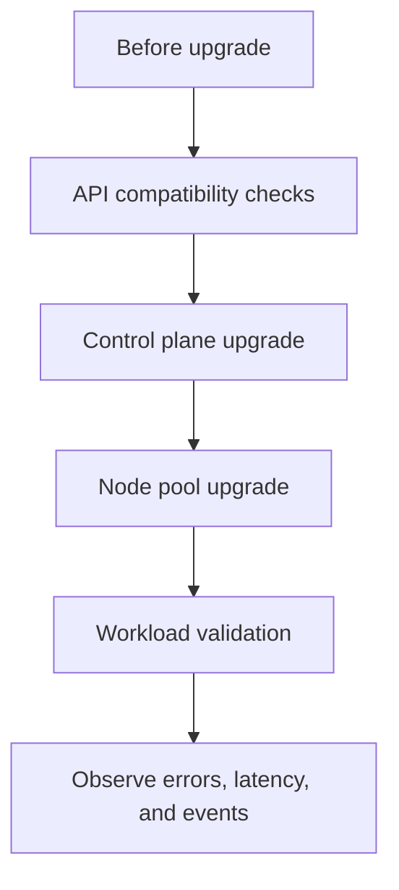

## Table of Contents

1. [An Upgrade Changes the Floor](#an-upgrade-changes-the-floor)
2. [Know What Is Being Upgraded](#know-what-is-being-upgraded)
3. [Check API Compatibility First](#check-api-compatibility-first)
4. [Prepare Workloads for Node Drains](#prepare-workloads-for-node-drains)
5. [Upgrade Control Plane and Nodes Separately](#upgrade-control-plane-and-nodes-separately)
6. [Validate With Real Workload Evidence](#validate-with-real-workload-evidence)
7. [Failure Mode: Pods Cannot Move](#failure-mode-pods-cannot-move)
8. [Upgrade Review Questions](#upgrade-review-questions)

## An Upgrade Changes the Floor

Application deploys change one workload. Cluster upgrades change the platform every workload stands on. The Kubernetes API server, controller manager, scheduler, kubelets, container runtime, CNI plugin, CSI driver, ingress controller, and cloud controller may all be part of the upgrade path depending on the cluster.

That wider blast radius is why cluster upgrades need a plan. Kubernetes must be upgraded for security patches, support windows, new features, and ecosystem compatibility. A good upgrade plan makes the change observable and reversible where possible.

For `devpolaris-orders-api`, the practical questions are concrete. Will its Deployment still use supported API versions? Can its three replicas stay available while nodes drain? Do probes and PodDisruptionBudgets behave correctly? Does the ingress controller still route traffic after nodes roll?



The safe path is staged evidence, not hope.

## Know What Is Being Upgraded

Managed Kubernetes services hide some operational work, but they do not remove the responsibility to understand the change. A provider may upgrade the control plane first, then node pools. Some add-ons may be managed by the provider, while others are installed by your platform team.

Capture the starting state:

```bash
$ kubectl version
Client Version: v1.30.4
Server Version: v1.29.8

$ kubectl get nodes
NAME       STATUS   ROLES    AGE    VERSION
worker-1   Ready    <none>   142d   v1.29.8
worker-2   Ready    <none>   142d   v1.29.8
worker-3   Ready    <none>   142d   v1.29.8
```

Do not memorize the version numbers in this example. In real work, check the provider and Kubernetes release notes for the exact target version. Version skew rules also matter: Kubernetes components support specific version differences between control plane and nodes.

List critical add-ons too:

```bash
$ kubectl -n kube-system get deploy,daemonset
NAME                          READY   UP-TO-DATE   AVAILABLE
deployment.apps/coredns        2/2     2            2
deployment.apps/metrics-server 1/1     1            1

NAME                                      DESIRED   CURRENT   READY
daemonset.apps/cilium                     3         3         3
daemonset.apps/secrets-store-csi-driver   3         3         3
```

If networking, DNS, metrics, or storage add-ons are incompatible with the target version, application health checks will fail even if the application image is unchanged.

## Check API Compatibility First

Kubernetes removes deprecated API versions over time. A manifest that worked last year may fail against a newer API server. Check manifests and live objects for deprecated versions before the upgrade window.

```bash
$ kubectl get ingress -A -o jsonpath='{range .items[*]}{.metadata.namespace}{"/"}{.metadata.name}{" "}{.apiVersion}{"\n"}{end}'
orders/devpolaris-orders-api networking.k8s.io/v1
```

That Ingress uses the stable `networking.k8s.io/v1` API. If you find old API versions, update manifests and controllers before upgrading the cluster.

Server-side dry run can catch objects the target API server rejects when you test against an upgraded staging cluster.

```bash
$ kubectl apply --server-side --dry-run=server -f k8s/orders/
deployment.apps/devpolaris-orders-api serverside-applied (server dry run)
service/devpolaris-orders-api serverside-applied (server dry run)
ingress.networking.k8s.io/devpolaris-orders-api serverside-applied (server dry run)
```

A dry run proves the API server accepts the object shapes. Production rehearsal still needs environment-specific checks such as controllers, admission policy, and runtime behavior.

## Prepare Workloads for Node Drains

Node upgrades usually move Pods. A node is cordoned so no new Pods are scheduled there, then drained so existing Pods are evicted and recreated on other nodes. Your workload must tolerate that movement.

For `devpolaris-orders-api`, three replicas across nodes are a good start. A PodDisruptionBudget can tell Kubernetes how much voluntary disruption is acceptable.

```yaml
apiVersion: policy/v1
kind: PodDisruptionBudget
metadata:
  name: devpolaris-orders-api
  namespace: orders
spec:
  minAvailable: 2
  selector:
    matchLabels:
      app.kubernetes.io/name: devpolaris-orders-api
```

This allows one replica to be voluntarily disrupted while keeping two available. It does not protect against all failures. If two nodes die at once, a PDB cannot stop that. It helps during planned operations such as drains and upgrades.

Test drain behavior in staging:

```bash
$ kubectl drain worker-2 --ignore-daemonsets --delete-emptydir-data
node/worker-2 cordoned
evicting pod orders/devpolaris-orders-api-7c96df7d7c-dh8xq
pod/devpolaris-orders-api-7c96df7d7c-dh8xq evicted
node/worker-2 drained
```

After the drain, the Deployment should return to the desired ready count on other nodes.

## Upgrade Control Plane and Nodes Separately

The control plane handles API requests and reconciliation. Nodes run your Pods. Many upgrade processes update the control plane first and node pools after. Treat those as separate validation points.

After the control plane upgrade, verify that controllers still reconcile and that normal API operations work:

```bash
$ kubectl -n orders rollout status deployment/devpolaris-orders-api
deployment "devpolaris-orders-api" successfully rolled out

$ kubectl -n orders get events --sort-by=.lastTimestamp | tail -5
LAST SEEN   TYPE    REASON              OBJECT                              MESSAGE
4m          Normal  ScalingReplicaSet   deployment/devpolaris-orders-api     Scaled up replica set
2m          Normal  SuccessfulCreate    replicaset/devpolaris-orders-api...  Created pod
```

During node upgrades, watch readiness and scheduling:

```bash
$ kubectl -n orders get pods -o wide -l app.kubernetes.io/name=devpolaris-orders-api
NAME                                      READY   STATUS    NODE
devpolaris-orders-api-7c96df7d7c-2vd6k   1/1     Running   worker-1
devpolaris-orders-api-7c96df7d7c-q94r7   1/1     Running   worker-3
devpolaris-orders-api-7c96df7d7c-x6s8m   1/1     Running   worker-4
```

The new node `worker-4` is serving a ready replica. That is a better proof than "the upgrade command finished."

## Validate With Real Workload Evidence

A cluster upgrade is not done when every node says `Ready`. It is done when critical workloads prove they can serve traffic, scale, resolve DNS, write storage, and report metrics.

For `devpolaris-orders-api`, collect a small evidence set:

```bash
$ kubectl -n orders get deploy devpolaris-orders-api
NAME                    READY   UP-TO-DATE   AVAILABLE
devpolaris-orders-api   3/3     3            3

$ kubectl -n orders run curlcheck --rm -it --image=curlimages/curl --restart=Never -- \
  curl -sS http://devpolaris-orders-api/health/ready
{"status":"ready","database":"ok","queue":"ok"}

$ kubectl -n orders top pods -l app.kubernetes.io/name=devpolaris-orders-api
NAME                                      CPU(cores)   MEMORY(bytes)
devpolaris-orders-api-7c96df7d7c-2vd6k   220m         350Mi
devpolaris-orders-api-7c96df7d7c-q94r7   240m         361Mi
devpolaris-orders-api-7c96df7d7c-x6s8m   235m         358Mi
```

This proves Deployment availability, in-cluster Service routing, readiness dependencies, and metrics collection. Add ingress checks and storage checks if the service uses them.

## Failure Mode: Pods Cannot Move

The most common upgrade failure is a drain that cannot evict Pods safely. A PDB may require too many Pods available, or the cluster may lack spare capacity.

```bash
$ kubectl drain worker-2 --ignore-daemonsets --delete-emptydir-data
error when evicting pods/"devpolaris-orders-api-7c96df7d7c-dh8xq":
Cannot evict pod as it would violate the pod's disruption budget.
```

This error is useful. It says Kubernetes protected availability. Now inspect the PDB and replica count.

```bash
$ kubectl -n orders get pdb devpolaris-orders-api
NAME                    MIN AVAILABLE   MAX UNAVAILABLE   ALLOWED DISRUPTIONS
devpolaris-orders-api   3               N/A               0
```

The PDB requires all three replicas to stay available, so no voluntary disruption is allowed. The fix might be to increase replicas before the upgrade, change the PDB to `minAvailable: 2`, or upgrade nodes in a way that adds surge capacity first. Do not delete the PDB just to make the command pass unless you have accepted the availability risk.

## Upgrade Review Questions

A good upgrade review connects platform change to workload behavior.

| Question | Evidence |
|----------|----------|
| Which version are we moving from and to? | Provider plan and release notes |
| Are deprecated APIs removed from manifests? | Dry run and API scan |
| Can critical Pods move during drains? | PDBs, replicas, staging drain test |
| Do add-ons support the target version? | DNS, CNI, CSI, ingress, metrics status |
| What proves success after each phase? | Workload health, events, metrics, ingress checks |
| What is the rollback or pause point? | Provider process and node pool strategy |

For `devpolaris-orders-api`, the upgrade is acceptable only when users can still place orders, Pods can be recreated on upgraded nodes, readiness stays stable, and platform components continue reporting healthy status.

An upgrade runbook should include preflight, execution, and validation evidence. The format can be simple, but it should be written before the maintenance window.

```text
Cluster: devpolaris-prod-eu
Upgrade target: provider-approved Kubernetes patch release
Primary workload: devpolaris-orders-api

Preflight:
  Deprecated API scan completed
  Add-on compatibility checked
  PDB allows one voluntary disruption
  Staging node drain completed
  Rollback or pause point identified with provider

Execution:
  Control plane upgraded first
  API server health checked
  Node pool upgraded one node at a time
  Workloads watched during each drain

Validation:
  orders Deployment 3/3 available
  internal health check returns ready
  ingress health check returns 200
  metrics API returns Pod metrics
  no new Warning events for orders namespace
```

This kind of record keeps the team from treating the provider console as the only source of truth. The provider may say the upgrade completed while application endpoints are still recovering.

A staging rehearsal should include at least one controlled drain. The point is to discover PDB, topology, and capacity problems before production.

```bash
$ kubectl -n orders get deploy,pdb devpolaris-orders-api
NAME                                      READY   UP-TO-DATE   AVAILABLE
deployment.apps/devpolaris-orders-api     3/3     3            3

NAME                                      MIN AVAILABLE   ALLOWED DISRUPTIONS
poddisruptionbudget.policy/devpolaris-orders-api   2       1

$ kubectl drain worker-2 --ignore-daemonsets --delete-emptydir-data --dry-run=server
node/worker-2 cordoned (server dry run)
pod/devpolaris-orders-api-7c96df7d7c-dh8xq evicted (server dry run)
```

The dry run cannot prove every runtime detail, but it can catch obvious policy blockers. A real staging drain then proves scheduling and readiness behavior.

After each upgraded node returns, inspect Pods by node. This helps catch workloads stuck on old nodes or new nodes that cannot run a class of Pod.

```bash
$ kubectl get pods -A -o wide --field-selector spec.nodeName=worker-4
NAMESPACE     NAME                                      READY   STATUS
kube-system   cilium-7dx2m                              1/1     Running
kube-system   secrets-store-csi-driver-9xqwd            3/3     Running
orders        devpolaris-orders-api-7c96df7d7c-x6s8m    1/1     Running
```

Seeing CNI, CSI, and an application Pod healthy on the new node is stronger evidence than node readiness alone.

Watch events during the upgrade, but keep the namespace scoped for application validation:

```bash
$ kubectl -n orders get events --sort-by=.lastTimestamp | tail -8
LAST SEEN   TYPE    REASON             OBJECT                                      MESSAGE
7m          Normal  Killing            pod/devpolaris-orders-api-...               Stopping container api
6m          Normal  SuccessfulCreate   replicaset/devpolaris-orders-api-...        Created pod
5m          Normal  Pulled             pod/devpolaris-orders-api-...               Container image already present
4m          Normal  Started            pod/devpolaris-orders-api-...               Started container api
3m          Normal  Ready              pod/devpolaris-orders-api-...               Readiness probe passed
```

Those events show normal disruption and recovery. Warning events such as `FailedScheduling`, `FailedMount`, or repeated `Unhealthy` need investigation before moving to the next node pool.

For add-ons, create a separate checklist. Application teams often notice DNS, ingress, storage, and metrics failures first, but platform teams own the add-on compatibility.

| Add-on | Upgrade concern | Quick validation |
|--------|-----------------|------------------|
| CoreDNS | Service discovery breaks | Resolve `devpolaris-orders-api.orders` from a Pod |
| CNI plugin | Pod networking breaks | Curl Pod to Service and Pod to Pod |
| CSI driver | Volumes fail to mount | Restart a Pod that uses storage |
| Ingress controller | External routes fail | Curl public health URL |
| Metrics Server | HPA loses metrics | `kubectl top pods` and HPA conditions |

The upgrade is ready to continue only when both platform add-ons and application workloads show healthy evidence.

---

**References**

- [Kubernetes: Version Skew Policy](https://kubernetes.io/releases/version-skew-policy/) - Official compatibility rules between Kubernetes components.
- [Kubernetes: Deprecated API Migration Guide](https://kubernetes.io/docs/reference/using-api/deprecation-guide/) - Tracks removed and deprecated API versions.
- [Kubernetes: Safely Drain a Node](https://kubernetes.io/docs/tasks/administer-cluster/safely-drain-node/) - Official guide to cordon, drain, and node maintenance.
- [Kubernetes: Pod Disruption Budgets](https://kubernetes.io/docs/tasks/run-application/configure-pdb/) - Explains voluntary disruption limits for workloads.
