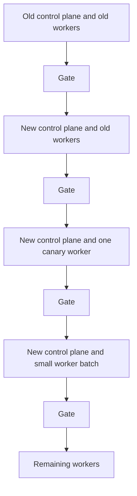

## Table of Contents

1. [What actually changes during a Kubernetes cluster upgrade?](#what-actually-changes-during-a-kubernetes-cluster-upgrade)
2. [How do version-skew rules shape the upgrade order?](#how-do-version-skew-rules-shape-the-upgrade-order)
3. [How can you find deprecated or removed API use before the target change?](#how-can-you-find-deprecated-or-removed-api-use-before-the-target-change)
4. [What makes a workload safe to move during a node drain?](#what-makes-a-workload-safe-to-move-during-a-node-drain)
5. [Why should upgrades use rehearsal, small stages, and explicit gates?](#why-should-upgrades-use-rehearsal-small-stages-and-explicit-gates)
6. [Which evidence proves that each stage is healthy?](#which-evidence-proves-that-each-stage-is-healthy)
7. [How should a team respond when a drain or validation gate fails?](#how-should-a-team-respond-when-a-drain-or-validation-gate-fails)
8. [Check Your Answers](#check-your-answers)
9. [References](#references)

A Kubernetes upgrade is a controlled compatibility transition between two working cluster states. The control plane, nodes, add-ons, API clients, and workloads cannot all change at the same instant, so the middle of the upgrade is deliberately mixed.

Moving from Kubernetes `1.35` to `1.36` changes more than one binary. The connected system can include:

- API servers, controllers, schedulers, and etcd;
- kubelets, kube-proxy, container runtimes, and node operating-system images;
- CNI, CSI, DNS, ingress, autoscaling, policy, observability, and device plug-ins;
- operators, webhooks, backup tools, CI/CD systems, `kubectl`, and client libraries;
- manifests and controllers that call particular Kubernetes APIs;
- workloads that must stay available while Pods move.

Before the upgrade, these components agree on the old world. After it, they should agree on the new world. During the transition, a new API server may talk to an older kubelet, operator, or automation client. Upgrade safety therefore depends on every communication edge staying inside a supported combination.

Keep these questions in view as you work through the lesson:

1. **What actually changes during a Kubernetes cluster upgrade?**
2. **How do version-skew rules shape the upgrade order?**
3. **How can you find deprecated or removed API use before the target change?**
4. **What makes a workload safe to move during a node drain?**
5. **Why should upgrades use rehearsal, small stages, and explicit gates?**
6. **Which evidence proves that each stage is healthy?**
7. **How should a team respond when a drain or validation gate fails?**

## What actually changes during a Kubernetes cluster upgrade?
<!-- section-summary: An upgrade moves a distributed system through mixed versions while every communicating pair must remain compatible. -->

### Model the cluster as a graph of compatibility contracts

A compact model is:

```text
safe upgrade
  = version compatibility
  ∩ API compatibility
  ∩ add-on compatibility
  ∩ workload disruption tolerance
  ∩ sufficient capacity
  ∩ successful runtime validation
```

If one set becomes empty, the next stage should not begin.

The graph matters because upgrade safety is evaluated at every intermediate state, not only at the old and new endpoints. A new API server may temporarily talk to an old kubelet, while an old operator and new admission webhook call the same API. Each edge needs a supported version and API contract during that mixed period.

### List the intermediate worlds explicitly

An upgrade plan should name more than “before” and “after.” For one highly available cluster, the sequence can temporarily include an old and new API server, new control-plane controllers with old workers, and then a mixture of old and new worker nodes. Workloads and automation keep operating throughout those worlds.

```text
State 0: API N,   workers N,   add-ons current
State 1: API N+1 and N, workers N, add-ons compatible with both
State 2: API N+1, workers N,   add-ons compatible with N+1
State 3: API N+1, canary N+1, remaining workers N
State 4: API N+1, workers N+1, target add-ons
```

Every arrow is a compatibility claim. If an admission webhook supports only the old API server, State 2 is invalid. If the target CNI cannot run on old kubelets, State 3 may be invalid. If a workload cannot survive moving from one node, the worker transition is invalid even when every binary version is supported.

The upgrade inventory should therefore answer, for each edge, “who talks to whom, using which API or runtime contract, and what source proves this pair is supported?” The procedure follows only after that graph has a supported route from State 0 to State 4.

## How do version-skew rules shape the upgrade order?
<!-- section-summary: Version-skew policy defines the supported corridor through the mixed state and explains why control-plane and node changes happen in order. -->

### Build the version envelope before sequencing work

Start with the versions that actually communicate:

```bash
kubectl version -o yaml
kubectl get nodes -o wide
```

Then record kube-apiserver, controller manager, scheduler, kubelet, kube-proxy, `kubectl`, client libraries, runtimes, and every installed add-on. Exact patch versions matter; a broad label such as “1.35” can hide already-fixed defects.

Under the Kubernetes 1.36 skew policy used by the raw material:

- highly available API server instances may differ by at most one minor version;
- kubelets must not be newer than the API server and may trail by up to three minor versions;
- `kubectl` is supported within one minor version of the API server;
- API-server minor upgrades proceed one minor version at a time rather than skipping releases.

Those relationships explain the normal direction: API servers move first, compatible control-plane controllers follow, and kubelets move after the API servers they contact support the new version. For kubeadm clusters, the documented high-level order is the first control-plane node, the remaining control-plane nodes, and then worker nodes.

The direction follows from a constraint. Upgrading a kubelet to `1.36` while its API server remains `1.35` would make the kubelet newer than the server. Upgrading the server first creates the supported inverse: API server `1.36` with kubelet `1.35`. “Control plane first” is therefore a consequence of the permitted mixed state, not an arbitrary ritual.

Core skew rules are only the outer corridor. A CNI, CSI driver, ingress controller, webhook, operator, or managed provider can support a narrower set. The actual runbook must satisfy both Kubernetes policy and every installed component's support statement at each intermediate state.

An add-on compatibility matrix determines its own order. If the current CNI supports only the old Kubernetes release but the next CNI supports both old and new, the CNI must move first. Another add-on may require the new server and move afterward. There is no safe universal “all add-ons before” or “all add-ons after” rule.

### Build one matrix for the real platform

The practical matrix should include every component that creates, observes, admits, schedules, networks, stores, or monitors workloads:

| Layer | Current version | Target version | Supports old Kubernetes? | Supports new Kubernetes? | Upgrade position |
|---|---|---|---|---|---|
| Kubernetes | `N` | `N+1` | Yes | Yes | Core transition |
| Container runtime | current | verified target | Verify | Verify | Derived from support |
| CNI | current | verified target | Verify | Verify | Before, during, or after |
| CSI | current | verified target | Verify | Verify | Derived from support |
| CoreDNS | current | verified target | Verify | Verify | Derived from support |
| Ingress or Gateway controller | current | verified target | Verify | Verify | Derived from support |
| Autoscaler and metrics adapter | current | verified target | Verify | Verify | Derived from support |
| Operators and webhooks | current | verified target | Verify | Verify | Derived from APIs and support |
| GitOps, backup, and security tools | current | verified target | Verify | Verify | Derived from client support |

“Current” is not a compatibility result. Each row needs the installed version, a target-compatible release, the intermediate Kubernetes versions it supports, and its own upgrade or rollback procedure. The narrowest row constrains the whole cluster transition.

This is also why a managed control plane does not remove upgrade engineering. The provider may operate API servers and etcd, while the cluster owner still owns workloads, add-ons, client APIs, disruption tolerance, and evidence that the data path works.

## How can you find deprecated or removed API use before the target change?
<!-- section-summary: Source search finds authored API versions, live metrics find active callers, audit data identifies them, and target-version rehearsal proves the replacement. -->

### Inventory API consumers, not only stored objects

An object stored successfully today does not prove that every client uses an API version served by the target release. API servers can convert several served versions into one storage version, so an old controller may keep calling a deprecated endpoint until a later release removes it.

Use four kinds of evidence.

First, search authored and generated sources: plain manifests, Helm templates, Kustomize bases and overlays, operators, scripts, and rendered output. Compare every `apiVersion` with the target release's deprecation guide.

Second, inspect the API-server metric `apiserver_requested_deprecated_apis`. It reports deprecated requests by group, version, resource, subresource, and removal release. Observe a representative time window so recurring controllers and Jobs have time to appear.

Third, use audit records. Deprecated requests can carry the annotation `k8s.io/deprecated: "true"`; the audit event adds the caller identity, user agent, namespace, resource, and request URI. This distinguishes an old object from an old client that will keep recreating the problem.

Fourth, exercise the generated manifests and their real clients in a target-version rehearsal cluster. CRDs and controllers still need paired review: a CRD can install successfully while its controller uses an incompatible client or webhook.

A static search can find an old `apiVersion` in Helm output or a manifest. It cannot prove that an operator, backup tool, security agent, custom script, CI job, or client library does not call a removed endpoint at runtime. Conversely, an existing object can look healthy because it is already stored, then fail days later when automation tries to recreate it through an endpoint the target server no longer serves.

Add-ons belong in the same compatibility inventory. A healthy CNI, CSI driver, DNS server, metrics adapter, ingress controller, or admission webhook on the current version proves only the current state. Target support comes from its release statement plus rehearsal of the path it owns.

### Find both stored definitions and active callers

Suppose a repository search finds no removed API version. An operator image can still contain an older client library that calls that endpoint at runtime. Suppose a deprecated object already exists and remains healthy. It can still hide a future failure because no write occurs until a scheduled Job, Helm upgrade, or recovery script tries to recreate it.

The evidence therefore answers complementary questions:

```text
source and rendered manifests -> what are we prepared to submit?
API metrics                  -> which deprecated endpoints are being called?
audit events                 -> which identity and user agent called them?
target rehearsal             -> does the replacement workflow actually work?
```

Observe long enough to include infrequent controllers, backup jobs, certificate renewals, and deployment pipelines. A quiet ten-minute window cannot rule out a client that runs weekly. The removal risk belongs to the consumer edge, not only to objects visible in `kubectl get` output.

## What makes a workload safe to move during a node drain?
<!-- section-summary: Drain coordinates eviction, while replicas, readiness, disruption tolerance, storage behavior, and spare capacity determine whether service continues. -->

### Drain coordinates movement; application design creates availability

A worker upgrade usually requires the node to stop receiving new Pods and its current Pods to move. `kubectl drain` cordons the node and uses eviction semantics for ordinary workload Pods. It respects PodDisruptionBudgets, handles DaemonSet-managed Pods specially, and must account for node-local `emptyDir` data.

Drain does not create availability. A one-replica Deployment on the drained node necessarily moves through zero available replicas. With three replicas distributed across nodes and a suitable disruption budget, removing one node can leave the other replicas serving.

Drain readiness depends on:

- enough replicas and an appropriate PodDisruptionBudget;
- readiness probes that keep replacements out of traffic until usable;
- graceful termination and application shutdown behavior;
- topology constraints, anti-affinity, stateful quorum rules, and volume attachment behavior;
- controllers that can recreate the Pods;
- accurate resource requests and enough spare CPU and memory to place them elsewhere.

The key question is:

> If this machine vanished now, could the remaining cluster both admit and physically place everything that must move?

Capacity is part of correctness. A cluster whose nodes are already near full can have healthy replicas and budgets while still lacking a valid destination for the evicted Pods. Special hardware, zones, local storage, architecture, large contiguous memory requests, and strict anti-affinity narrow the placement set further.

```text
remaining schedulable capacity
>= existing workload
 + evacuated workload
 + placement constraints
 + operational safety margin
```

Aggregate free CPU is not sufficient evidence. A Pod may require one zone, a GPU, a particular architecture, an attachable volume, or enough contiguous requested memory. The cluster is drain-ready only when the remaining Nodes contain a valid placement for every workload that must move.

### Walk one drain before the maintenance window

Imagine three nodes each host one checkout replica. Draining Node B can preserve two serving replicas while the controller schedules a replacement—provided the disruption budget permits one unavailable replica, the new Pod has a valid destination, and readiness excludes it until startup completes.

Now change one assumption. If every remaining node is at 90% requested capacity, the replacement may remain `Pending`. The PodDisruptionBudget prevented excessive voluntary disruption, but it could not manufacture CPU. If checkout uses a zonal volume unavailable to the candidate node, aggregate capacity still does not create a valid placement. If it has one replica, no scheduling trick avoids the interval with zero available replicas.

Before draining, answer these concrete questions:

1. Which Pods are on the node, and which controller recreates each one?
2. Which Pods are DaemonSet-managed, use `emptyDir`, or depend on node-local state?
3. Which disruption budgets govern eviction, and do current healthy replicas satisfy them?
4. Which nodes satisfy topology, affinity, architecture, device, and volume constraints?
5. Do those nodes have sufficient requested CPU and memory plus safety margin?
6. Will replacement readiness and graceful termination keep traffic on usable replicas?

That rehearsal turns `kubectl drain` from a hopeful command into a verified workload-mobility test.

## Why should upgrades use rehearsal, small stages, and explicit gates?
<!-- section-summary: Rehearsal tests hidden assumptions, while canaries and small batches preserve a narrow fault boundary between two validated states. -->

### Treat the upgrade as a sequence of known states

Rehearse the exact transition in an environment with the target version, the same add-on families, representative manifests, and enough nodes to exercise drain and rescheduling. Test API changes, add-on order, workload movement, and at least one recovery route.

Production should move through small states:


```mermaid
flowchart TD
    Old[Old control plane and old workers] --> Gate1[Gate]
    Gate1 --> Mixed[New control plane and old workers]
    Mixed --> Gate2[Gate]
    Gate2 --> Canary[New control plane and one canary worker]
    Canary --> Gate3[Gate]
    Gate3 --> Batch[New control plane and small worker batch]
    Batch --> Gate4[Gate]
    Gate4 --> Remaining[Remaining workers]
```

Place representative workloads on the canary. A new node that merely reports `Ready` proves mainly that its kubelet can communicate with the control plane. A useful canary also runs the actual CNI, CSI, runtime, DaemonSets, security settings, and workload paths.

Small batches are an observability technique. If the control plane and canary passed but errors begin after the first worker batch, the failed transition lies between those two states. A large batch destroys that precise boundary.

Each gate needs named evidence and a decision: continue, pause and repair, or use the documented recovery path. Elapsed time alone is not a pass condition.

At every arrow, write down what changed, which compatibility assumption permits it, what observation proves it worked, and where the rollout stops if it did not. That turns an upgrade procedure into a state machine whose transitions have explicit preconditions and postconditions.

For example, the control-plane gate can require API availability, current controller health, successful admission dry runs, and no new deprecated-API failures. The canary-node gate can require the node to become Ready, all required DaemonSets to run, a representative Pod to schedule, cross-node networking and DNS to work, and a real volume to attach. The batch gate adds application error rate, latency, pending Pods, and endpoint readiness for workloads that moved.

Promotion is a decision made from those named observations. “It has been twenty minutes” is only an observation window; it is not proof that a weekly Job, storage attach, or external route works. The gate should exercise the capabilities introduced at that stage and retain the result for comparison with the next stage.

## Which evidence proves that each stage is healthy?
<!-- section-summary: Strong validation follows real API and workload paths instead of treating component health or Node Ready as proof of the platform. -->

### Node Ready is necessary but far from sufficient

Begin with control-plane and node state, but do not stop there. Check API availability and errors, controller and scheduler health, webhook behavior, node conditions, kubelet versions, runtime versions, and DaemonSet coverage.

Then create and exercise real Kubernetes work:

1. submit a representative object through admission;
2. let the scheduler place its Pod;
3. let the kubelet and runtime start it;
4. resolve a Service through CoreDNS;
5. reach another Pod across nodes;
6. exercise the CNI and one representative NetworkPolicy;
7. attach the storage class in use and read the data;
8. read ConfigMaps and Secrets;
9. cause a reschedule;
10. verify metrics and telemetry appear;
11. send a real request through the normal ingress and Service path.

That sequence proves a causal chain from API acceptance through admission, scheduling, container creation, networking, storage, discovery, readiness, and application response.

Compare the results with a pre-upgrade baseline. Include error rate and latency, controller queues, recurring Jobs, backup behavior, autoscaling, and workload readiness across a representative observation window. The farther the check travels through the system users depend on, the stronger the evidence.

### Validate both the deployment path and the user path

A deployment-path test begins with an API write. It passes authentication, authorization, admission, persistence, controller reconciliation, scheduling, kubelet, runtime, CNI setup, ConfigMap and Secret delivery, readiness, and Service endpoint publication. If that Pod becomes ready, many control-plane-to-node contracts have been exercised.

A user-path test begins at the normal public or internal entry point. It crosses DNS, load balancing, Ingress or Gateway, Service routing, NetworkPolicy, the application, and any representative storage or service dependency. If that request succeeds and its telemetry appears, the test covers the data plane users actually experience.

Neither replaces the other. An already-running application can answer while new Pods can no longer be admitted or scheduled. A test Pod can become Ready while public routing to the application is broken. Run both after each stage that could affect their path.

## How should a team respond when a drain or validation gate fails?
<!-- section-summary: Stop at the first failed boundary, preserve its evidence, repair or recover that layer, and repeat the same gate before expanding. -->

### Preserve the smallest failed boundary

When a drain blocks, inspect the Pods on the node, their owners, their disruption budgets, local data, storage attachments, and the remaining placement capacity. A blocked eviction is evidence that an availability or ownership contract has not been satisfied. Restore healthy replicas, finish another disruption, add capacity, or resolve the ownership and data decision before retrying.

When a validation gate fails, stop the next batch. Ask:

- what changed at this boundary?
- which workloads moved?
- do failures follow upgraded nodes?
- which dependency is the first one that becomes unhealthy?

Preserve exact versions, timestamps, placement, Events, logs, metrics, and the result of the same representative request before changing more components.

Recovery is boundary-specific. A worker can often be cordoned, drained, and returned to the previous supported node image. An add-on follows its own supported rollback or roll-forward procedure. Control-plane downgrade may be unsupported and can be unsafe because storage and data migration have already changed state. The runbook must state which stages support reversal, replacement, or only forward repair.

Do not use the word “rollback” as one universal escape hatch. Replacing a canary worker with the previous tested image is different from downgrading an API server after it has written newer state. Reverting a manifest is different from reversing a storage migration. For every stage, record whether recovery means undoing the change, replacing the component, restoring state, or fixing forward within the supported version envelope.

After the repair or recovery, repeat the gate from the start. Continue only when the same evidence that stopped the rollout now passes.

Small batches preserve information. If the new control plane passed, a canary worker passed, and errors began only after the first 10% worker batch, the investigation has a precise boundary. Continuing to 50% would enlarge the incident and erase that useful isolation. Pausing is not merely caution; it is how the rollout keeps causal evidence.

## Check Your Answers
<!-- section-summary: Reconstruct the upgrade from compatibility, API use, workload movement, staged evidence, and boundary-specific recovery. -->

:::expand[What actually changes during a Kubernetes cluster upgrade?]{kind="recap"}
The control plane, nodes, runtimes, add-ons, clients, APIs, and workloads form one distributed system. Every communicating pair must remain compatible during the mixed-version transition.
:::

:::expand[How do version-skew rules shape the upgrade order?]{kind="recap"}
Skew policy defines which core versions may communicate and therefore why API servers move before kubelets. Provider and add-on support can narrow that corridor, so the runbook must satisfy every component at each intermediate state.
:::

:::expand[How can you find deprecated or removed API use before the target change?]{kind="recap"}
Search source and rendered manifests, observe deprecated-API metrics, use audit data to identify live callers, and server-dry-run the rendered set against a target-version rehearsal API server.
:::

:::expand[What makes a workload safe to move during a node drain?]{kind="recap"}
Drain coordinates eviction. Replicas, disruption budgets, readiness, shutdown behavior, durable state, topology, controllers, accurate requests, and spare placement capacity keep the application available while Pods move.
:::

:::expand[Why should upgrades use rehearsal, small stages, and explicit gates?]{kind="recap"}
Rehearsal tests commands and assumptions. Canaries and small batches limit the changed boundary, while explicit gates decide from evidence whether the next stage may begin.
:::

:::expand[Which evidence proves that each stage is healthy?]{kind="recap"}
Component health is only the start. Strong evidence exercises API writes, admission, scheduling, runtime, DNS, networking, policy, storage, rescheduling, telemetry, and a real application request, then compares the result with a baseline.
:::

:::expand[How should a team respond when a drain or validation gate fails?]{kind="recap"}
Pause expansion, identify the first failed boundary, preserve exact evidence, repair or recover that layer through its supported procedure, and repeat the same gate before continuing.
:::

## References

- [Kubernetes Version Skew Policy](https://kubernetes.io/releases/version-skew-policy/)
- [Kubernetes Deprecation Policy](https://kubernetes.io/docs/reference/using-api/deprecation-policy/)
- [Deprecated API Migration Guide](https://kubernetes.io/docs/reference/using-api/deprecation-guide/)
- [Safely Drain a Node](https://kubernetes.io/docs/tasks/administer-cluster/safely-drain-node/)
- [Disruptions](https://kubernetes.io/docs/concepts/workloads/pods/disruptions/)
- [Upgrading kubeadm clusters](https://kubernetes.io/docs/tasks/administer-cluster/kubeadm/kubeadm-upgrade/)
