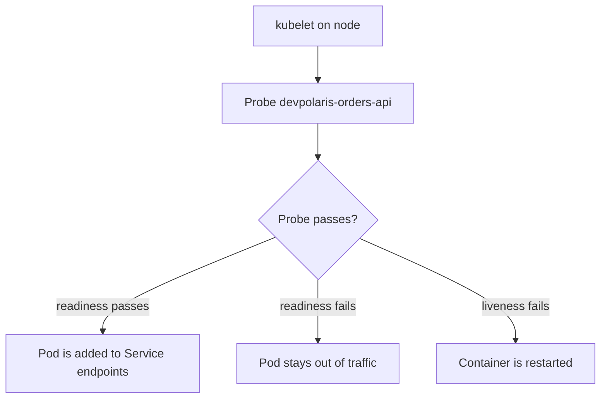

## Table of Contents

1. [Why Kubernetes Asks Health Questions](#why-kubernetes-asks-health-questions)
2. [The Three Probe Types](#the-three-probe-types)
3. [Readiness Protects Traffic](#readiness-protects-traffic)
4. [Liveness Restarts Stuck Containers](#liveness-restarts-stuck-containers)
5. [Startup Probes Give Slow Apps Time](#startup-probes-give-slow-apps-time)
6. [Probe Timing and Failure Thresholds](#probe-timing-and-failure-thresholds)
7. [Failure Mode: A Probe That Restarts a Healthy App](#failure-mode-a-probe-that-restarts-a-healthy-app)
8. [A Review Checklist](#a-review-checklist)

## Why Kubernetes Asks Health Questions

A container can be running while the application inside it is not useful yet. A Node.js process can bind port `8080` before it has connected to PostgreSQL. A Python API can accept TCP connections while its migration lock is still held. Kubernetes needs a way to tell the difference between "the process exists" and "this Pod should receive real user traffic."

Health probes are the questions kubelet asks from the node where the Pod is running. Kubelet is the node agent that starts containers, watches them, and reports Pod status back to the control plane. A probe can be an HTTP request, a TCP socket check, or a command executed inside the container.

For `devpolaris-orders-api`, the team runs three replicas behind a Service. The API stores orders in PostgreSQL and publishes order events to a queue. The Service should send traffic only to Pods that can answer requests. If one Pod deadlocks, Kubernetes should restart that Pod without touching the healthy replicas.



The important mental model is that probes are signals, not monitoring dashboards. They drive Kubernetes behavior. A wrong probe can remove good Pods from traffic or restart a process that only needed a little time.

## The Three Probe Types

Kubernetes has three probe types, and each one answers a different operational question.

| Probe | Question | Kubernetes action when it fails |
|-------|----------|----------------------------------|
| `readinessProbe` | Can this Pod receive traffic now? | Remove the Pod from Service endpoints |
| `livenessProbe` | Is this container stuck beyond repair? | Restart the container |
| `startupProbe` | Has this slow-starting app finished booting? | Delay liveness and readiness checks until startup passes |

The difference matters because the failure actions are different. Readiness is gentle. It stops new traffic from reaching the Pod but leaves the process running so it can recover. Liveness is stronger. It kills and restarts the container. Startup is a guard rail for applications that need longer initialization, such as a JVM service warming caches or a Node API loading a large configuration bundle.

For most web APIs, start with readiness before liveness. Readiness protects users during normal boot, dependency outages, and rollouts. Liveness should be reserved for failures where restarting the process is the best recovery action, such as an event loop deadlock or a permanently wedged worker.

## Readiness Protects Traffic

The readiness endpoint should answer the question "can this replica serve a normal request?" For `devpolaris-orders-api`, that means the HTTP server is listening, the database connection pool can borrow a connection, and required configuration is loaded.

```yaml
apiVersion: apps/v1
kind: Deployment
metadata:
  name: devpolaris-orders-api
spec:
  replicas: 3
  selector:
    matchLabels:
      app.kubernetes.io/name: devpolaris-orders-api
  template:
    metadata:
      labels:
        app.kubernetes.io/name: devpolaris-orders-api
    spec:
      containers:
        - name: api
          image: ghcr.io/devpolaris/orders-api:2026-05-07.1
          ports:
            - name: http
              containerPort: 8080
          readinessProbe:
            httpGet:
              path: /health/ready
              port: http
            initialDelaySeconds: 5
            periodSeconds: 10
            timeoutSeconds: 2
            failureThreshold: 3
```

The probe uses the named port `http`, which keeps the probe stable if the numeric container port moves later. `periodSeconds: 10` means kubelet asks every ten seconds. `failureThreshold: 3` means three failed checks in a row are needed before the Pod is marked not ready.

You can see readiness in the Pod and EndpointSlice status:

```bash
$ kubectl -n orders get pods -l app.kubernetes.io/name=devpolaris-orders-api
NAME                                      READY   STATUS    RESTARTS   AGE
devpolaris-orders-api-7c96df7d7c-2vd6k   1/1     Running   0          4m
devpolaris-orders-api-7c96df7d7c-dh8xq   1/1     Running   0          4m
devpolaris-orders-api-7c96df7d7c-q94r7   0/1     Running   0          55s

$ kubectl -n orders get endpointslice -l kubernetes.io/service-name=devpolaris-orders-api
NAME                           ADDRESSTYPE   PORTS   ENDPOINTS                 AGE
devpolaris-orders-api-cqtzn    IPv4          8080    10.244.1.21,10.244.2.33   4m
```

The third Pod is running but not ready, so it is absent from the endpoint list. That is a good outcome during startup or a dependency problem. The process gets time to finish, and users keep hitting the two ready Pods.

## Liveness Restarts Stuck Containers

A liveness probe should be stricter about the process itself and less strict about external dependencies. If PostgreSQL has a short outage, restarting every API Pod often makes recovery worse because all replicas restart and reconnect at once. Liveness should detect conditions that the current process is unlikely to fix by itself.

For `devpolaris-orders-api`, the liveness endpoint can be a shallow in-process check. It confirms the HTTP server and event loop can respond. It should not fail just because the database is unavailable for a few seconds.

```yaml
livenessProbe:
  httpGet:
    path: /health/live
    port: http
  initialDelaySeconds: 20
  periodSeconds: 20
  timeoutSeconds: 2
  failureThreshold: 3
```

This gives the container at least twenty seconds before liveness starts. After that, kubelet needs three failed checks, spaced twenty seconds apart, before restarting the container. The restart is visible in Pod status.

```bash
$ kubectl -n orders describe pod devpolaris-orders-api-7c96df7d7c-2vd6k
Containers:
  api:
    State:          Running
    Last State:     Terminated
      Reason:       Error
      Exit Code:    137
    Ready:          True
    Restart Count:  1
Events:
  Type     Reason     Age   From     Message
  Warning  Unhealthy  3m    kubelet  Liveness probe failed: HTTP probe failed with statuscode: 500
  Normal   Killing    3m    kubelet  Container api failed liveness probe, will be restarted
```

That event tells you the restart was caused by liveness, not by an image pull failure, node eviction, or application exit. The next diagnostic step is to read the application log around the first failed liveness event.

## Startup Probes Give Slow Apps Time

Some applications are healthy after boot but slow before boot. A startup probe exists for that shape. When a startup probe is configured, Kubernetes waits for it to pass before it starts evaluating liveness and readiness probes.

```yaml
startupProbe:
  httpGet:
    path: /health/startup
    port: http
  periodSeconds: 5
  failureThreshold: 24
```

This allows up to two minutes for startup because `5 * 24 = 120` seconds. That does not mean the app should always take two minutes. It means Kubernetes will not kill the container while it is still doing legitimate startup work.

The endpoint should become successful only when startup is really complete. For `devpolaris-orders-api`, it might wait until configuration has loaded, migrations have been checked, and the HTTP server is ready to accept traffic.

## Probe Timing and Failure Thresholds

Probe timing is a small reliability design. Too aggressive, and normal latency spikes cause restarts. Too loose, and broken Pods stay in traffic for too long. Use real application behavior to choose values instead of copying a snippet.

| Setting | What it controls | Practical starting point |
|---------|------------------|--------------------------|
| `initialDelaySeconds` | Delay before first check | Use startup probe instead for long boot |
| `periodSeconds` | Time between checks | 5 to 20 seconds for APIs |
| `timeoutSeconds` | Time allowed per check | Keep short, often 1 to 3 seconds |
| `failureThreshold` | Consecutive failures before action | Higher for flaky dependencies |
| `successThreshold` | Consecutive successes before ready | Readiness can use more than 1 |

For readiness, a higher `failureThreshold` can avoid endpoint churn when a dependency has a one-second blip. For liveness, a higher threshold prevents restart loops during short CPU pauses. The tradeoff is slower detection. Production values should come from observed startup time, request latency, and dependency behavior.

## Failure Mode: A Probe That Restarts a Healthy App

A common mistake is using the same dependency-heavy endpoint for readiness and liveness. Imagine `/health` checks PostgreSQL, Redis, and the event queue. A database maintenance window starts, and every liveness probe begins returning `500`.

```text
2026-05-07T10:14:20Z health check failed component=postgres error="connection timeout"
2026-05-07T10:14:40Z health check failed component=postgres error="connection timeout"
2026-05-07T10:15:00Z health check failed component=postgres error="connection timeout"
2026-05-07T10:15:01Z received SIGTERM reason="liveness probe failed"
```

The app was not dead. It was reporting a dependency problem. Restarting it does not fix PostgreSQL, and the restart can add load when all replicas reconnect after boot.

The diagnostic path is short:

1. Check `kubectl describe pod` for `Unhealthy` and `Killing` events.
2. Compare the failing probe path with the application health endpoint implementation.
3. Split readiness from liveness if external dependencies are causing liveness failures.
4. Add a startup probe if failures happen only during boot.

The fix is usually to make `/health/ready` dependency-aware and `/health/live` process-aware. Readiness can fail during a database outage so the Pod leaves traffic. Liveness should keep passing if the process is responsive and can recover when the database returns.

## A Review Checklist

Before merging a probe change, review it like production behavior, not decoration. Ask what Kubernetes will do when the probe fails.

| Question | Good signal |
|----------|-------------|
| Does readiness prove the Pod can serve normal traffic? | It checks required local state and critical dependencies |
| Does liveness avoid short dependency failures? | It checks process responsiveness, not every external service |
| Is startup separated for slow boot? | Startup probe gives the app enough time before liveness |
| Are probe paths cheap? | They do not run heavy queries or allocate large objects |
| Can you diagnose probe failures? | Logs name the health component and error clearly |

For `devpolaris-orders-api`, a reviewer should be able to answer: if PostgreSQL is down for thirty seconds, do Pods leave traffic or restart? If one process deadlocks, does Kubernetes replace it? If a new image takes sixty seconds to warm caches, does it survive long enough to become ready?

A useful pull request includes a short probe evidence record. It does not need to be long, but it should prove the probe behavior under one healthy case and one expected failure case. Here is the kind of record a platform reviewer can understand quickly:

```text
Service: devpolaris-orders-api
Namespace: orders
Image: ghcr.io/devpolaris/orders-api:2026-05-07.1

Healthy startup:
  Pod entered Running at 10:02:14Z
  Startup probe passed at 10:02:39Z
  Readiness probe passed at 10:02:42Z
  EndpointSlice included Pod IP at 10:02:44Z

Dependency outage rehearsal:
  PostgreSQL test Service blocked at 10:08:00Z
  readinessProbe failed three times
  Pod removed from EndpointSlice at 10:08:31Z
  livenessProbe continued to pass
  Container restart count stayed 0
```

That record tells the reviewer the design did what it was supposed to do. A database outage removed the Pod from traffic without restarting it. When the database returns, readiness can pass again and the Pod can rejoin endpoints.

You can capture the same behavior with a small watch during a staging test:

```bash
$ kubectl -n orders get pod,endpointslice \
  -l app.kubernetes.io/name=devpolaris-orders-api \
  --watch
NAME                                          READY   STATUS    RESTARTS
pod/devpolaris-orders-api-7c96df7d7c-2vd6k   1/1     Running   0
pod/devpolaris-orders-api-7c96df7d7c-2vd6k   0/1     Running   0
pod/devpolaris-orders-api-7c96df7d7c-2vd6k   1/1     Running   0
```

The changing `READY` value is the signal. The unchanged restart count is just as important. It proves readiness absorbed the temporary dependency failure without liveness killing the process.

One more review habit helps: write down what each endpoint checks. The endpoint names alone are not enough because different teams use the same names differently.

| Endpoint | Checks | Must not check |
|----------|--------|----------------|
| `/health/startup` | Config loaded, server boot complete | Slow external services unless startup truly depends on them |
| `/health/ready` | Required dependencies for normal requests | Optional analytics or background-only integrations |
| `/health/live` | Process responsiveness | PostgreSQL, Redis, queue, or other short-lived dependency failures |

If the liveness row contains the same checks as readiness, stop and discuss the restart behavior before merging. That small conversation can prevent a cluster-wide restart loop during a dependency outage.

When a probe fails in production, keep the diagnostic order narrow:

```bash
$ kubectl -n orders describe pod devpolaris-orders-api-7c96df7d7c-2vd6k | sed -n '/Events:/,$p'
$ kubectl -n orders logs pod/devpolaris-orders-api-7c96df7d7c-2vd6k --tail=80
$ kubectl -n orders get endpointslice -l kubernetes.io/service-name=devpolaris-orders-api -o wide
```

The first command shows what kubelet decided. The second shows what the app reported. The third shows whether traffic routing changed. Together they answer the operational question without editing the Deployment first.

For teams using GitOps, include the probe settings in the same review as the container image and resources. Probes, resources, and rollout settings cooperate. A readiness probe that takes thirty seconds to pass affects rollout speed. A liveness probe with a short timeout can combine badly with CPU limits. A startup probe can prevent false liveness failures after a new image adds initialization work.

That is the final mental model to keep: probe YAML is not a health badge. It is a set of instructions for what Kubernetes should do to real traffic and real containers when the app reports trouble.

If you only remember one operational distinction, remember the action attached to the signal. Readiness changes traffic. Liveness changes the process. Startup changes when the other two signals begin.

```text
Question during review:
  If this check fails, what does Kubernetes do?

Answer for readiness:
  It stops routing new Service traffic to the Pod.

Answer for liveness:
  It restarts the container.

Answer for startup:
  It keeps waiting before applying liveness and readiness behavior.
```

That small question catches many probe mistakes before they become incidents.

For the orders team, this question belongs in every Deployment review. It turns probe discussion from style preference into an operational decision.

That is the habit that keeps probe changes tied to user traffic.

---

**References**

- [Kubernetes: Configure Liveness, Readiness and Startup Probes](https://kubernetes.io/docs/tasks/configure-pod-container/configure-liveness-readiness-startup-probes/) - The official task guide for probe fields and behavior.
- [Kubernetes: Pod Lifecycle](https://kubernetes.io/docs/concepts/workloads/pods/pod-lifecycle/) - Explains Pod phases, container states, and readiness conditions.
- [Kubernetes: Services and EndpointSlices](https://kubernetes.io/docs/concepts/services-networking/endpoint-slices/) - Shows how ready Pods become traffic endpoints for Services.
