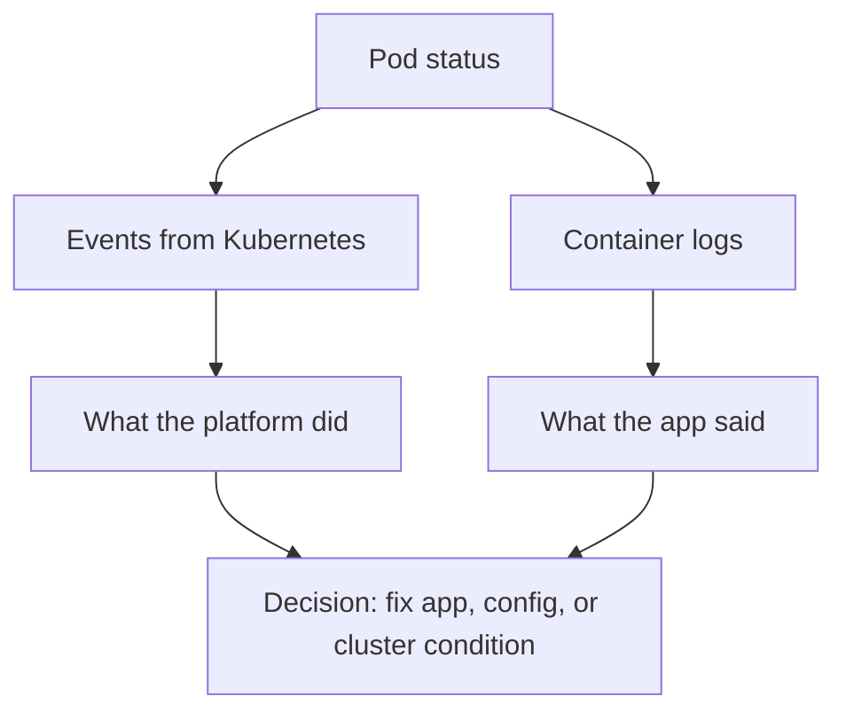

## Table of Contents

1. [Two Different Stories](#two-different-stories)
2. [Start With Object State](#start-with-object-state)
3. [Read Container Logs](#read-container-logs)
4. [Read Previous Container Logs](#read-previous-container-logs)
5. [Use Events for Kubernetes Decisions](#use-events-for-kubernetes-decisions)
6. [Sort Events and Narrow the Namespace](#sort-events-and-narrow-the-namespace)
7. [Failure Mode: The Log Is Empty](#failure-mode-the-log-is-empty)
8. [A Debugging Routine](#a-debugging-routine)

## Two Different Stories

When a Kubernetes workload fails, there are usually two stories happening at the same time. The application tells one story through stdout and stderr, which become container logs. Kubernetes tells another story through object status and events, such as image pull failures, scheduling failures, probe failures, and rollout progress.

You need both stories because each one has blind spots. `devpolaris-orders-api` can log `database connection refused`, but it cannot tell you that the Pod was evicted because the node ran out of memory. Kubernetes can tell you the container restarted, but it cannot explain which line of application code crashed unless the process logged it.

The running example is a Deployment in the `orders` namespace. A new image was rolled out, and the Service has fewer ready endpoints than expected. The job is to prove what changed before editing YAML.



This order matters. Start with object state so you know which Pod, container, or controller deserves attention.

## Start With Object State

Object state is the current status Kubernetes reports for Deployments, ReplicaSets, Pods, and related objects. Starting there tells you which object is failing before you open logs.

Example: if one orders API Pod is `CrashLoopBackOff` and two are `Running`, read the failing Pod first instead of streaming logs from every replica.

```bash
$ kubectl -n orders get deploy,rs,pod -l app.kubernetes.io/name=devpolaris-orders-api
NAME                                      READY   UP-TO-DATE   AVAILABLE   AGE
deployment.apps/devpolaris-orders-api     2/3     3            2           18m

NAME                                                 DESIRED   CURRENT   READY   AGE
replicaset.apps/devpolaris-orders-api-78b6f596dc     3         3         2       18m

NAME                                       READY   STATUS             RESTARTS   AGE
pod/devpolaris-orders-api-78b6f596dc-7x2tb 1/1     Running            0          18m
pod/devpolaris-orders-api-78b6f596dc-mk9z4 0/1     CrashLoopBackOff   5          17m
pod/devpolaris-orders-api-78b6f596dc-qk88c 1/1     Running            0          18m
```

This output tells you where to focus. One Pod is repeatedly crashing. Do not start by reading logs from every replica. Read the failing Pod first, then use the healthy Pods for comparison.

`CrashLoopBackOff` means Kubernetes started the container, the container exited, and Kubernetes is delaying the next restart because repeated restarts are happening. The backoff protects the node from a tight crash loop, but it also means the current logs may belong to the newest short run, not the first failure.

## Read Container Logs

Container logs are the text the application process writes to stdout and stderr. `kubectl logs` reads that text from a container, which makes it the right tool after you know the container actually started.

Example: if the Pod is running but not ready, logs can show `POSTGRES_URL missing` or `database connection refused`, which Kubernetes events cannot explain by themselves.

```bash
$ kubectl -n orders logs deploy/devpolaris-orders-api --tail=40
2026-05-07T10:21:14Z info server starting port=8080
2026-05-07T10:21:15Z error migration check failed code=ECONNREFUSED host=orders-postgres port=5432
2026-05-07T10:21:15Z fatal startup aborted reason="database unavailable"
```

The log tells you the process exited because startup requires PostgreSQL. It does not yet tell you why PostgreSQL was unavailable. The next check might be the database Service, NetworkPolicy, secret, or connection string.

When multiple Pods match, `kubectl logs deploy/...` can be convenient, but precise debugging usually means naming the Pod and container.

```bash
$ kubectl -n orders logs pod/devpolaris-orders-api-78b6f596dc-mk9z4 -c api --tail=80
2026-05-07T10:22:18Z info config loaded environment=prod
2026-05-07T10:22:19Z error POSTGRES_URL missing from environment
2026-05-07T10:22:19Z fatal cannot start without database configuration
```

That second log changes the direction. The issue is not the database itself. The container is missing an environment variable.

## Read Previous Container Logs

Previous logs are logs from the last terminated instance of the same container. They matter when a container keeps restarting because the current run may not have reached the failing line yet.

Example: in `CrashLoopBackOff`, `kubectl logs --previous` can show the startup error from the run that just died. The `--previous` flag reads logs from the previous terminated container instance.

```bash
$ kubectl -n orders logs pod/devpolaris-orders-api-78b6f596dc-mk9z4 -c api --previous --tail=30
2026-05-07T10:19:54Z info server starting port=8080
2026-05-07T10:19:55Z error POSTGRES_URL missing from environment
2026-05-07T10:19:55Z fatal cannot start without database configuration
```

Use `--previous` when `RESTARTS` is greater than zero. Without it, you can miss the first useful error because the current container has not reached the failing line yet.

For rollouts, combine logs with rollout status:

```bash
$ kubectl -n orders rollout status deployment/devpolaris-orders-api
Waiting for deployment "devpolaris-orders-api" rollout to finish: 2 of 3 updated replicas are available...
```

The rollout is waiting because one updated replica never becomes available. Logs explain the application reason, and rollout status explains the controller consequence.

## Use Events for Kubernetes Decisions

Events are short records created by Kubernetes components when something happens to an object. They explain platform decisions that the application cannot log, such as scheduling, pulling images, mounting volumes, failing probes, killing containers, and scaling ReplicaSets.

Example: the app log may say `POSTGRES_URL missing`, while the Pod event says `secret "orders-prod-env" not found`, which explains why the environment variable never arrived.

```bash
$ kubectl -n orders describe pod devpolaris-orders-api-78b6f596dc-mk9z4
Events:
  Type     Reason     Age                 From               Message
  Normal   Scheduled  18m                 default-scheduler  Successfully assigned orders/devpolaris-orders-api-78b6f596dc-mk9z4 to worker-2
  Normal   Pulled     17m                 kubelet            Successfully pulled image "ghcr.io/devpolaris/orders-api:2026-05-07.2"
  Warning  Failed     17m                 kubelet            Error: secret "orders-prod-env" not found
  Normal   BackOff    2m (x7 over 16m)    kubelet            Back-off restarting failed container api
```

The key line is `secret "orders-prod-env" not found`. The app log said `POSTGRES_URL missing`; the event explains why the environment never arrived. That means the fix is probably in the Deployment reference, the Secret name, or the namespace where the Secret was applied.

Events are not permanent audit logs. They are meant for recent operational diagnosis and can expire. For long-term history, send events and logs to your logging platform.

## Sort Events and Narrow the Namespace

An event list is the recent timeline of Kubernetes decisions for objects in a scope. Sorting by timestamp helps you see cause and effect, and narrowing to one namespace keeps unrelated cluster noise out of the first pass. For example, in `orders`, the useful sequence might be a Deployment scaling a ReplicaSet, a Pod failing because a Secret is missing, and kubelet backing off restarts.

```bash
$ kubectl -n orders get events --sort-by=.lastTimestamp
LAST SEEN   TYPE      REASON              OBJECT                                      MESSAGE
18m         Normal    ScalingReplicaSet   deployment/devpolaris-orders-api             Scaled up replica set devpolaris-orders-api-78b6f596dc to 3
17m         Warning   Failed              pod/devpolaris-orders-api-78b6f596dc-mk9z4   Error: secret "orders-prod-env" not found
2m          Normal    BackOff             pod/devpolaris-orders-api-78b6f596dc-mk9z4   Back-off restarting failed container api
```

The sorted view lets you connect cause and effect. The Deployment scaled a new ReplicaSet. The Pod failed because a Secret was missing. The kubelet backed off restarts. This is enough evidence to inspect the Deployment and Secret.

```bash
$ kubectl -n orders get secret orders-prod-env
Error from server (NotFound): secrets "orders-prod-env" not found

$ kubectl -n orders get deploy devpolaris-orders-api -o jsonpath='{.spec.template.spec.containers[0].envFrom}'
[{"secretRef":{"name":"orders-prod-env"}}]
```

The Deployment expects a Secret that does not exist in the `orders` namespace. Applying the Secret to the wrong namespace is a common cause.

## Failure Mode: The Log Is Empty

An empty application log means the process may not have written anything, but it does not mean the cluster did nothing. The container may fail before the process starts, or Kubernetes may be unable to create the container at all. For example, a missing ConfigMap can keep the orders API container in `CreateContainerConfigError`, so there is no application process to log the error.

```bash
$ kubectl -n orders logs pod/devpolaris-orders-api-78b6f596dc-mk9z4 -c api
Error from server (BadRequest): container "api" in pod "devpolaris-orders-api-78b6f596dc-mk9z4" is waiting to start: CreateContainerConfigError
```

This is an event-first failure. The application never started, so there are no application logs to read. Use `describe pod` next.

```bash
$ kubectl -n orders describe pod devpolaris-orders-api-78b6f596dc-mk9z4
State:          Waiting
  Reason:       CreateContainerConfigError
Events:
  Warning  Failed  4m  kubelet  Error: configmap "orders-runtime-config" not found
```

The fix direction is to create the missing ConfigMap in the same namespace or correct the reference in the Deployment. Reading application code would waste time because the process did not start.

## A Debugging Routine

A debugging routine is a fixed inspection order that keeps you from chasing the loudest symptom first. In a noisy production namespace, it helps you identify the failing object, read the right container, and use events for platform decisions before changing manifests. For `devpolaris-orders-api`, the routine might start with the `orders` namespace and the `app.kubernetes.io/name=devpolaris-orders-api` label, then narrow to the one Pod that is failing.

1. Scope the namespace and labels.
2. Read `kubectl get` for current state.
3. Describe the exact failing object.
4. Read current logs from the exact container.
5. Read previous logs if the container restarted.
6. Sort recent events in the namespace.
7. Change one thing only after the evidence points to it.

For `devpolaris-orders-api`, that routine separates app failures from platform failures. A missing Secret is visible in events. A failed database connection is visible in logs. A rollout stuck at two ready replicas is visible in Deployment status. None of those signals replaces the others.

The tradeoff is retention. Native Kubernetes logs and events are enough for immediate diagnosis, but they are short-lived and cluster-local. Production teams usually forward logs to a central system and preserve deploy metadata so a later incident review can connect a Pod crash to the image, commit, and configuration change that introduced it.

A good incident note keeps the two stories separate. Mixing everything into one paragraph makes the next reader work too hard. Use a small evidence grid:

```text
Incident: orders rollout stuck
Window: 2026-05-07 10:18Z to 10:31Z
Namespace: orders
Deployment: devpolaris-orders-api

Kubernetes state:
  Deployment available replicas: 2 of 3
  Failing Pod status: CrashLoopBackOff
  Event reason: secret "orders-prod-env" not found

Application log:
  POSTGRES_URL missing from environment
  startup aborted before HTTP server became ready

Change nearby:
  image ghcr.io/devpolaris/orders-api:2026-05-07.2
  Deployment envFrom changed from orders-env to orders-prod-env
```

That structure protects you from a common mistake: treating the application log as the whole truth. The log says an environment variable is missing. The event says the Secret reference failed. The nearby change says the Deployment changed the Secret name. Together, they point to one fix.

The exact commands that produced the record can be short:

```bash
$ kubectl -n orders get deploy devpolaris-orders-api
$ kubectl -n orders get pods -l app.kubernetes.io/name=devpolaris-orders-api
$ kubectl -n orders describe pod devpolaris-orders-api-78b6f596dc-mk9z4
$ kubectl -n orders logs pod/devpolaris-orders-api-78b6f596dc-mk9z4 -c api --previous --tail=80
$ kubectl -n orders get deploy devpolaris-orders-api -o yaml
```

Notice that the final command reads the Deployment after the failure is understood. Starting with the full YAML can bury the useful signal in hundreds of lines. Reading it after events name the missing Secret makes the inspection targeted.

For multi-container Pods, always name the container. Sidecars can create misleading logs if you forget `-c`.

```bash
$ kubectl -n orders get pod devpolaris-orders-api-78b6f596dc-mk9z4 \
  -o jsonpath='{.spec.containers[*].name}'
api envoy-metrics

$ kubectl -n orders logs pod/devpolaris-orders-api-78b6f596dc-mk9z4 -c api --tail=40
2026-05-07T10:22:19Z fatal cannot start without database configuration
```

The sidecar may be healthy while the application container is broken. The Pod status can also be confusing because one container may be ready and another may not. Container names remove that ambiguity.

Events also help when the error comes before the application process exists. Image pull failures are the clearest example:

```text
Events:
  Type     Reason     Age   From     Message
  Normal   Pulling    2m    kubelet  Pulling image "ghcr.io/devpolaris/orders-api:2026-05-07.9"
  Warning  Failed     2m    kubelet  Failed to pull image "ghcr.io/devpolaris/orders-api:2026-05-07.9": manifest unknown
  Warning  Failed     2m    kubelet  Error: ErrImagePull
  Normal   BackOff    1m    kubelet  Back-off pulling image
```

There are no application logs to read because the container image never started. The fix direction is image publishing, image tag or digest, pull secret, registry access, or the Deployment reference.

For ongoing operations, decide which logs must leave the cluster. `kubectl logs` is a direct tool, but it is not a logging strategy. If a node disappears, local container logs may disappear with it. A central log store lets you search by `requestId`, `pod`, `namespace`, `image`, and `revision` after the Pod has been replaced.

Use Kubernetes labels to make that search easier:

```yaml
metadata:
  labels:
    app.kubernetes.io/name: devpolaris-orders-api
    app.kubernetes.io/component: api
    app.kubernetes.io/part-of: devpolaris
    devpolaris.io/team: orders
```

Good labels make logs and events easier to group. They also make `kubectl` selectors safer, because you can target one service without relying on fragile Pod names.

When you hand off an incident, include the exact time range and selector used for logs. A later responder should not have to guess whether you checked the new ReplicaSet, the old ReplicaSet, or every Pod in the namespace.

```text
Log handoff:
  namespace: orders
  selector: app.kubernetes.io/name=devpolaris-orders-api
  container: api
  time window: 2026-05-07T10:15:00Z to 2026-05-07T10:35:00Z
  useful request id: debug-20260507-1015
  first error: POSTGRES_URL missing from environment
```

This is especially helpful when logs are forwarded to a central system. The cluster may replace the Pod name, but the labels, container name, image, and request ID can still connect the records.

Events need a similar handoff because they expire. If an event explains the failure, copy the important line into the incident note:

```text
Event copied before expiry:
  Warning Failed pod/devpolaris-orders-api-78b6f596dc-mk9z4
  Error: secret "orders-prod-env" not found
```

That copied event can save a future reviewer from asking why the team changed a Secret reference after the event object has disappeared.

The same habit helps during handoff between time zones. Evidence survives better when the important line is written down while the cluster still has it.

Good notes make the next responder faster without requiring them to trust memory.

---

**References**

- [Kubernetes: Viewing Pods and Nodes](https://kubernetes.io/docs/tutorials/kubernetes-basics/explore/explore-intro/) - Shows basic inspection commands for Pods and cluster objects.
- [Kubernetes: kubectl logs](https://kubernetes.io/docs/reference/kubectl/generated/kubectl_logs/) - Official command reference for reading container logs.
- [Kubernetes: Events](https://kubernetes.io/docs/reference/kubernetes-api/cluster-resources/event-v1/) - API reference for event records and fields.
- [Kubernetes: Debug Running Pods](https://kubernetes.io/docs/tasks/debug/debug-application/debug-running-pod/) - Official task guide for inspecting Pods, logs, and events.
