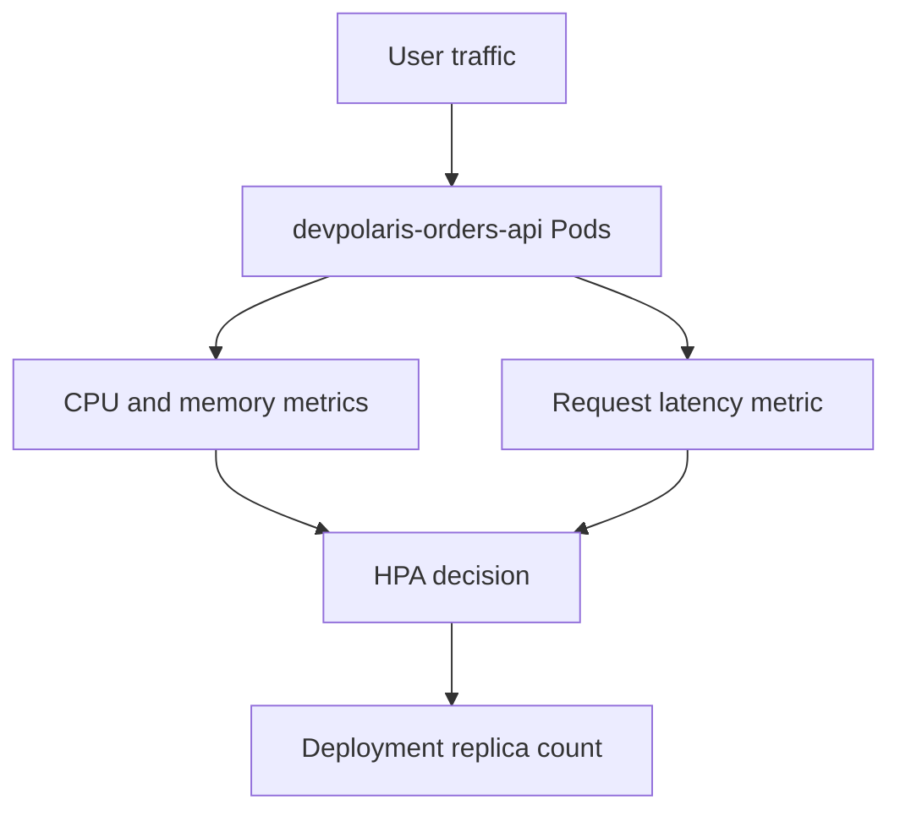

## Table of Contents

1. [Scaling Needs a Signal](#scaling-needs-a-signal)
2. [Requests Make Metrics Useful](#requests-make-metrics-useful)
3. [Reading Pod and Node Metrics](#reading-pod-and-node-metrics)
4. [Horizontal Pod Autoscaling](#horizontal-pod-autoscaling)
5. [Choose Metrics That Match the Bottleneck](#choose-metrics-that-match-the-bottleneck)
6. [Failure Mode: Autoscaling Without Requests](#failure-mode-autoscaling-without-requests)
7. [Failure Mode: Scaling the Wrong Thing](#failure-mode-scaling-the-wrong-thing)
8. [Operational Review Questions](#operational-review-questions)

## Scaling Needs a Signal

Scaling by instinct works for a demo and fails in production. If `devpolaris-orders-api` is slow, adding replicas might help, but only if the bottleneck is per-Pod CPU, concurrency, or request queueing. If the bottleneck is PostgreSQL locks, a saturated queue consumer, or an external payment API, adding more API Pods can increase pressure without improving user latency.

Metrics are measured facts about resource usage or application behavior. Kubernetes can expose CPU and memory usage for Pods and nodes through the resource metrics pipeline. Teams often add application metrics too, such as request rate, latency, queue depth, and error count. Autoscaling is the act of changing capacity based on one or more of those signals.

The common Kubernetes object for replica autoscaling is the HorizontalPodAutoscaler, usually called HPA. Horizontal means more Pods, not bigger Pods. Vertical scaling changes CPU and memory for a Pod. Cluster scaling adds or removes nodes. Those are related decisions, but they solve different constraints.



The autoscaler is only as good as the metric you give it. A junior engineer can learn the YAML quickly. The harder skill is choosing a metric that reflects the real capacity limit.

## Requests Make Metrics Useful

A resource request is the CPU or memory amount Kubernetes uses as the planning baseline for a container. CPU autoscaling uses a percentage of requested CPU, so the request gives the HPA a denominator.

Example: if the orders API requests `500m` CPU and uses `250m`, it is using 50 percent of its requested CPU. Without that request, the HPA cannot calculate a CPU utilization percentage for the container.

```yaml
apiVersion: apps/v1
kind: Deployment
metadata:
  name: devpolaris-orders-api
spec:
  template:
    spec:
      containers:
        - name: api
          image: ghcr.io/devpolaris/orders-api:2026-05-07.1
          resources:
            requests:
              cpu: "500m"
              memory: "512Mi"
            limits:
              cpu: "1"
              memory: "1Gi"
```

The CPU request gives the scheduler and the HPA a baseline. The memory request helps scheduling too, but memory is usually not a good horizontal autoscaling signal because memory pressure does not drop cleanly when you add Pods. A memory leak needs a code fix or restart strategy, not more replicas forever.

If requests are missing, CPU utilization percentages become undefined for HPA. This is why resource requests are not optional decoration in production.

## Reading Pod and Node Metrics

Pod and node metrics are point-in-time measurements of resource usage. The `kubectl top` command reads them from the metrics API, usually served by Metrics Server.

Example: if every orders API Pod is using around `450m` CPU against a `500m` request and latency is rising, the service may be near its per-Pod CPU capacity. `kubectl top` is a quick operational view, not a long-term dashboard.

```bash
$ kubectl -n orders top pods -l app.kubernetes.io/name=devpolaris-orders-api
NAME                                      CPU(cores)   MEMORY(bytes)
devpolaris-orders-api-7c96df7d7c-2vd6k   420m         382Mi
devpolaris-orders-api-7c96df7d7c-dh8xq   465m         401Mi
devpolaris-orders-api-7c96df7d7c-q94r7   438m         390Mi
```

Those Pods request `500m` CPU each, so they are near 85 to 93 percent of requested CPU. If request latency is also rising and database health is normal, more replicas may help.

Node metrics show whether the cluster has room for more Pods:

```bash
$ kubectl top nodes
NAME       CPU(cores)   CPU%   MEMORY(bytes)   MEMORY%
worker-1   1820m        45%    6110Mi          52%
worker-2   2190m        54%    6880Mi          58%
worker-3   2010m        50%    6405Mi          54%
```

If nodes are already full, HPA may request more replicas while the scheduler cannot place them. Then you need cluster autoscaling, larger nodes, or lower per-Pod requests after careful measurement.

## Horizontal Pod Autoscaling

A HorizontalPodAutoscaler is a controller that changes the replica count of a scalable workload. Horizontal means adding or removing Pods, not changing the CPU or memory size of each Pod.

Example: the HPA below watches the orders API Deployment and can move it between three and twelve replicas to keep average CPU near 70 percent of request.

```yaml
apiVersion: autoscaling/v2
kind: HorizontalPodAutoscaler
metadata:
  name: devpolaris-orders-api
spec:
  scaleTargetRef:
    apiVersion: apps/v1
    kind: Deployment
    name: devpolaris-orders-api
  minReplicas: 3
  maxReplicas: 12
  metrics:
    - type: Resource
      resource:
        name: cpu
        target:
          type: Utilization
          averageUtilization: 70
```

This asks Kubernetes to keep average CPU usage near 70 percent of requested CPU across the Pods. It will not scale below three replicas or above twelve. Those limits are part of the design. `minReplicas` protects availability. `maxReplicas` protects dependencies and cost.

Read HPA status after applying it:

```bash
$ kubectl -n orders get hpa devpolaris-orders-api
NAME                   REFERENCE                         TARGETS   MINPODS   MAXPODS   REPLICAS   AGE
devpolaris-orders-api  Deployment/devpolaris-orders-api   88%/70%   3         12        5          6m
```

The HPA increased replicas because average CPU is above target. That is useful evidence, but you still need to verify user-facing latency and dependency health.

## Choose Metrics That Match the Bottleneck

A bottleneck is the part of the request path that runs out of capacity first. The autoscaling metric should measure that part, or the autoscaler will change replicas without improving the user symptom. CPU is a reasonable first metric for CPU-bound APIs, but it is not always the right metric. If `devpolaris-orders-api` spends most of its time waiting on PostgreSQL, CPU may stay low while users see slow responses. In that case, CPU autoscaling will not react.

| Bottleneck shape | Better signal | Scaling decision |
|------------------|---------------|------------------|
| CPU-heavy JSON validation | CPU utilization | Add API replicas if nodes have room |
| Request queueing in the API | In-flight requests or latency | Add replicas and inspect downstream limits |
| Queue consumer backlog | Queue depth per consumer | Scale workers, not necessarily API Pods |
| Database lock contention | DB wait and lock metrics | Fix query, index, or transaction behavior |
| Memory leak | Memory growth over time | Fix code and set safe limits |

Autoscaling should protect the system, not hide every performance issue. More Pods can be the right answer when each Pod can independently serve more requests. More Pods are the wrong answer when they multiply calls to a dependency that is already failing.

## Failure Mode: Autoscaling Without Requests

Autoscaling without requests fails because the HPA has no baseline for CPU utilization. A CPU target such as 70 percent means 70 percent of the requested CPU, not 70 percent of the node. If the orders API container has no CPU request, the autoscaler cannot calculate that percentage and may report an unknown target.

```bash
$ kubectl -n orders get hpa devpolaris-orders-api
NAME                   REFERENCE                         TARGETS         MINPODS   MAXPODS   REPLICAS
devpolaris-orders-api  Deployment/devpolaris-orders-api   <unknown>/70%   3         12        3

$ kubectl -n orders describe hpa devpolaris-orders-api
Conditions:
  Type           Status  Reason                   Message
  AbleToScale    True    ReadyForNewScale          recommended size matches current size
  ScalingActive  False   FailedGetResourceMetric   missing request for cpu in container api of Pod devpolaris-orders-api-7c96df7d7c-2vd6k
```

Add realistic CPU requests to the Deployment, roll out the change, and then watch HPA status again. Requests should come from observation. Start with a value near normal steady usage plus headroom, then refine after load testing.

## Failure Mode: Scaling the Wrong Thing

Imagine the orders API accepts checkout requests and writes an event to a queue. Users see slow checkout. CPU sits at 25 percent. The HPA does not scale. Someone raises `maxReplicas` from 12 to 40, but latency stays high.

```text
checkout_latency_p95_seconds 4.8
orders_api_cpu_utilization   0.25
order_events_queue_depth     18420
order_worker_replicas        2
postgres_lock_wait_seconds   0.03
```

The queue depth is the clue. The API can accept requests, but the worker fleet cannot process order events fast enough. Scaling the API adds more events to the queue. The right fix may be scaling `devpolaris-orders-worker`, improving worker throughput, or adding backpressure before the queue grows without bound.

The diagnostic path is:

1. Compare user latency with Pod CPU.
2. Check dependency and queue metrics.
3. Identify which component owns the slow step.
4. Scale that component only if the dependency can absorb the extra work.

This is why autoscaling is operations work expressed through YAML.

## Operational Review Questions

An autoscaling review is a capacity design review, not only a YAML review. Reviewers should know which user symptom should improve, which metric represents the limit, and which dependency might receive more load when replicas increase. Before enabling or changing autoscaling, ask these questions:

| Question | Why it matters |
|----------|----------------|
| What user symptom should improve? | Autoscaling should map to an outcome, not a habit |
| Which metric represents the bottleneck? | The wrong metric changes replicas without fixing latency |
| Are requests set and realistic? | HPA CPU percentages depend on requests |
| Can the cluster place more Pods? | HPA cannot help if scheduling fails |
| Can dependencies handle more traffic? | Scaling callers can overload databases and queues |
| What is the maximum safe replica count? | `maxReplicas` is a safety boundary |

For `devpolaris-orders-api`, a good first autoscaling setup uses CPU only if load tests show CPU rises with request pressure. If latency rises while CPU stays low, use application metrics and dependency metrics to find the real constraint before changing replica counts.

A useful autoscaling review includes a short load observation instead of only the HPA YAML. The review should show what happens when traffic increases, what metric reacts, and whether the added replicas improve the user-facing symptom.

```text
Load test: checkout-read mix
Duration: 20 minutes
Namespace: orders
Deployment: devpolaris-orders-api

Before traffic increase:
  replicas: 3
  p95 latency: 180ms
  average CPU: 42 percent of request
  database connections: 18

During traffic increase:
  replicas: 7
  p95 latency: 260ms
  average CPU: 68 percent of request
  database connections: 41

After traffic returns to normal:
  replicas: 3
  p95 latency: 175ms
  average CPU: 39 percent of request
```

This evidence says CPU tracked the added work and the autoscaler returned to the floor afterward. It also checks database connections because scaling API Pods can multiply downstream connections. If the database connection count jumps beyond the pool budget, the HPA may need a lower `maxReplicas`, a smaller per-Pod pool, or a separate connection proxy.

HPA status gives more detail than the short `kubectl get` table:

```bash
$ kubectl -n orders describe hpa devpolaris-orders-api
Metrics:                                               (current / target)
  resource cpu on pods  (as a percentage of request):  68% (340m) / 70%
Min replicas:                                          3
Max replicas:                                          12
Deployment pods:                                       7 current / 7 desired
Conditions:
  Type            Status  Reason              Message
  AbleToScale     True    ReadyForNewScale     recommended size matches current size
  ScalingActive   True    ValidMetricFound     the HPA was able to calculate a replica count
  ScalingLimited  False   DesiredWithinRange   the desired count is within the acceptable range
```

The condition names are worth reading. `ScalingActive=False` means the HPA cannot calculate from the metric. `ScalingLimited=True` often means the recommended count hit `minReplicas` or `maxReplicas`. Those conditions explain why a replica count did or did not change.

Pending Pods are the next place to look when HPA asks for replicas but capacity does not appear:

```bash
$ kubectl -n orders get pods -l app.kubernetes.io/name=devpolaris-orders-api
NAME                                      READY   STATUS    RESTARTS
devpolaris-orders-api-7c96df7d7c-2vd6k   1/1     Running   0
devpolaris-orders-api-7c96df7d7c-dh8xq   1/1     Running   0
devpolaris-orders-api-7c96df7d7c-q94r7   1/1     Running   0
devpolaris-orders-api-7c96df7d7c-tb8mc   0/1     Pending   0

$ kubectl -n orders describe pod devpolaris-orders-api-7c96df7d7c-tb8mc
Events:
  Warning  FailedScheduling  42s  default-scheduler  0/3 nodes are available: 3 Insufficient cpu.
```

The autoscaler did its part. The scheduler cannot place the new Pod. Now the decision moves to node capacity, cluster autoscaling, or resource request tuning. Raising `maxReplicas` would not fix this case because the cluster has nowhere to put the Pods.

Scaling down deserves review too. A service that scales down too quickly can remove warm replicas between traffic bursts. A service that never scales down wastes money and may keep unnecessary database connections open.

```text
Scale-down observation:
  Traffic dropped at 11:20Z
  HPA held 7 replicas until 11:25Z
  Deployment returned to 3 replicas at 11:26Z
  p95 latency stayed below 220ms during the next burst at 11:28Z
```

That observation says the default stabilization behavior was acceptable for this service. For spiky traffic, you may need a higher minimum replica count or custom HPA behavior. The tradeoff is cost versus response time for sudden bursts.

For application metrics, keep the same review discipline. If you scale on queue depth, write down the target in plain language:

```text
Metric: order_events_ready
Target: keep fewer than 100 ready events per worker replica
Reason: one worker drains about 100 events per minute at normal database latency
Safety limit: do not exceed 20 worker replicas without database review
```

That note prevents the metric from becoming a mystery number. Future reviewers can see the operational reason and know when to revisit it.

Finally, treat manual scaling as an incident action that needs cleanup. If someone runs `kubectl scale` during a traffic spike, the reviewed steady-state manifest may still say three replicas.

```bash
$ kubectl -n orders scale deployment devpolaris-orders-api --replicas=8
deployment.apps/devpolaris-orders-api scaled

$ kubectl -n orders get hpa devpolaris-orders-api
NAME                    TARGETS   MINPODS   MAXPODS   REPLICAS
devpolaris-orders-api   32%/70%   3         12        8
```

If HPA owns the Deployment, it may later move the replica count back down. If GitOps owns the manifest, it may revert the manual change. Record why the manual scale happened and decide whether the steady-state HPA or manifest should change afterward.

The cleanup question is direct: was this a one-time surge, or did normal traffic outgrow the old capacity model? One answer leads to no config change. The other leads to new requests, HPA targets, replica floors, or dependency limits.

---

**References**

- [Kubernetes: Horizontal Pod Autoscaling](https://kubernetes.io/docs/tasks/run-application/horizontal-pod-autoscale/) - Official guide to HPA behavior and configuration.
- [Kubernetes: Resource Management for Pods and Containers](https://kubernetes.io/docs/concepts/configuration/manage-resources-containers/) - Explains requests, limits, and scheduling resource decisions.
- [Kubernetes: Metrics for Kubernetes System Components](https://kubernetes.io/docs/concepts/cluster-administration/system-metrics/) - Official overview of Kubernetes metrics concepts.
- [Kubernetes: Metrics Server](https://kubernetes.io/docs/tasks/debug/debug-cluster/resource-metrics-pipeline/) - Explains the resource metrics pipeline used by `kubectl top` and HPA.
