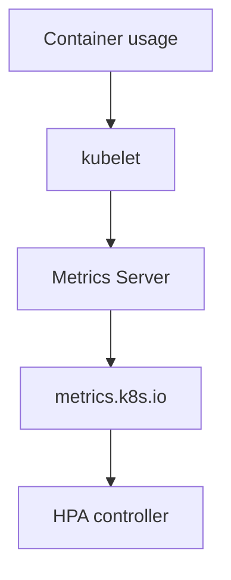

## Table of Contents

1. [How does a CPU measurement travel from a container to the HPA controller?](#how-does-a-cpu-measurement-travel-from-a-container-to-the-hpa-controller)
2. [How does the HPA turn a metric value into a replica recommendation?](#how-does-the-hpa-turn-a-metric-value-into-a-replica-recommendation)
3. [Which workload pressure makes a useful autoscaling signal?](#which-workload-pressure-makes-a-useful-autoscaling-signal)
4. [How do application and external metrics enter the Kubernetes scaling loop?](#how-do-application-and-external-metrics-enter-the-kubernetes-scaling-loop)
5. [How do replica limits, rate policies, and stabilization shape the response?](#how-do-replica-limits-rate-policies-and-stabilization-shape-the-response)
6. [How do you diagnose an HPA that chooses an unexpected replica count?](#how-do-you-diagnose-an-hpa-that-chooses-an-unexpected-replica-count)
7. [How do you prove that added replicas improved the application?](#how-do-you-prove-that-added-replicas-improved-the-application)
8. [Check Your Answers](#check-your-answers)
9. [References](#references)

A HorizontalPodAutoscaler, or HPA, is a feedback controller. Work arrives, Pods process it, a metrics pipeline measures pressure, and the HPA changes the target workload's desired replica count. The important question is not merely whether a metric is high. It is whether adding healthy Pods should make that metric fall.

Seven questions build that model:

1. **How does a CPU measurement travel from a container to the HPA controller?**
2. **How does the HPA turn a metric value into a replica recommendation?**
3. **Which workload pressure makes a useful autoscaling signal?**
4. **How do application and external metrics enter the Kubernetes scaling loop?**
5. **How do replica limits, rate policies, and stabilization shape the response?**
6. **How do you diagnose an HPA that chooses an unexpected replica count?**
7. **How do you prove that added replicas improved the application?**

## How does a CPU measurement travel from a container to the HPA controller?
<!-- section-summary: Kubelets measure container usage, Metrics Server exposes resource metrics through metrics.k8s.io, and the HPA reads that API as its sensor. -->

### Autoscaling is a delayed feedback loop

Before following the metric, name the parts of the control system. The application is the **plant** doing the work. Incoming traffic is a **disturbance**. The metrics pipeline is the **sensor**. The HPA is the **controller**, the target is its **set point**, and replica count is the **actuator**. New Pods change capacity, which should change the next measurement.

```text
incoming work -> Pods -> measured pressure -> HPA
                    ^                         |
                    |---- desired replicas --|
```

This is a loop, not a one-time threshold alert. The HPA repeatedly observes the result of its earlier replica decisions and makes another recommendation.

For CPU and memory, the path is:


```mermaid
flowchart TD
    Usage[Container usage] --> Kubelet[kubelet]
    Kubelet --> MetricsServer[Metrics Server]
    MetricsServer --> MetricsAPI[metrics.k8s.io]
    MetricsAPI --> HPA[HPA controller]
```

The kubelet obtains resource measurements for containers. Metrics Server collects those measurements and exposes the resource metrics API. Both the HPA and `kubectl top` read from that path. Metrics Server is therefore an autoscaling sensor, not a historical observability database.

Suppose `kubectl top pods` reports CPU near `450m` for each `api` Pod. An HPA with an `averageUtilization` target does not compare that usage with the CPU limit. It compares usage with the CPU request:

```text
CPU utilization = CPU usage ÷ CPU request
450m ÷ 500m = 90%
```

```yaml
resources:
  requests:
    cpu: 500m
  limits:
    cpu: "1"
```

Changing the request from `500m` to `1000m` without changing the process would change reported utilization from about 90% to about 45%. Resource requests therefore affect both scheduling and CPU-based autoscaling.

The loop is periodic rather than immediate; Kubernetes documents a default HPA sync period of 15 seconds. Its response includes metric collection, that controller sync, scheduling, image pulling, startup, and readiness. If useful capacity takes 45 seconds to start, a target value cannot make that capacity appear in five seconds.

```text
total response time
= metric delay
+ HPA sync delay
+ scheduling delay
+ image-pull delay
+ application startup
+ readiness delay
```

That sum is the earliest point at which extra replicas can relieve an overload. A five-second traffic spike and a 45-second capacity response are fundamentally mismatched, regardless of how precisely the CPU target is tuned.

### Follow one sample around the loop

Suppose traffic rises and four Pods each use `450m` CPU. Kubelets expose their current resource usage, Metrics Server collects it, and the HPA reads a sample through `metrics.k8s.io`. The controller compares that sample with its target and writes a higher desired replica count through the workload's scale interface. The Deployment creates Pods, the scheduler places them, kubelets start them, and readiness eventually makes them useful.

Only after load redistributes can the next metric sample show whether the action worked:

```text
high per-Pod CPU
      ↓ sensor delay
HPA recommends six replicas
      ↓ controller and scheduler delay
two containers start
      ↓ image, startup, and readiness delay
six Ready Pods share the work
      ↓ next metric samples
per-Pod CPU approaches target
```

Every arrow adds delay. During that interval, the original four Pods continue handling demand. This is why `minReplicas`, spare node capacity, fast startup, and upstream traffic controls can matter as much as the target percentage during a sudden surge.

Metrics Server has a narrow job in this path. It makes recent resource measurements available for autoscaling and `kubectl top`; it is not the durable system used to compare last week's latency, build dashboards, or retain incident history. The HPA sensor and the observability store may use related measurements while serving different lifecycles.

## How does the HPA turn a metric value into a replica recommendation?
<!-- section-summary: The HPA multiplies the current replica count by the ratio between the current metric and the target metric, then rounds up. -->

### The CPU request becomes the utilization denominator

Assume four Pods each request `500m`, each uses about `450m`, and the HPA target is 60% CPU utilization. Current utilization is 90%, or 1.5 times the target:

```text
desired replicas = ceil(current replicas × current metric ÷ target metric)
                 = ceil(4 × 90 ÷ 60)
                 = 6
```

Four Pods consume about `1800m` in total. If work distributes evenly across six Pods, each uses about `300m`, which is 60% of a `500m` request. The central assumption is:

The intended relationship is **more Ready replicas → less work per replica**.

For a service receiving 1,800 requests per second, if one Pod can safely handle 300 requests per second, the same capacity model says six Pods are required. The HPA estimates that parallelism from a chosen measurement.

The CPU request is part of that estimate, not just a scheduler reservation. At `450m` usage, a `500m` request reports 90% utilization, while a `1000m` request reports 45%. The process did identical work in both cases. Changing only the request changes the controller's mathematical view and can reverse whether it wants to scale.

That does not mean requests should be chosen to manipulate the HPA. They should represent realistic scheduling demand and be calibrated with application behavior. Once utilization-based scaling is enabled, however, every request change should be reviewed as both a placement change and an autoscaling-control change.

### The ratio works only when work redistributes

The calculation assumes total demand stays roughly constant during the decision and spreads across the additional healthy replicas. Four Pods at `450m` consume about `1800m`; six Pods reach the target only if that demand redistributes to about `300m` each.

Sticky sessions, a single hot partition, skewed routing, or substantial background CPU can break that assumption. The formula can still be calculated correctly while the resulting Pods fail to lower the measurement. The ratio is therefore a model of the workload, not proof that the workload is horizontally scalable.

For example, one customer can own a hot partition routed to one replica. Adding five ordinary replicas leaves that partition and its CPU on the same Pod. The average may change, but the overloaded request path may not. Likewise, a fixed background computation in every replica adds CPU each time the HPA scales, so total demand is not constant in the way the ratio assumes.

Before relying on automatic scaling, manually change replica count under fixed incoming load. If twice as many Ready Pods do not reduce the chosen per-Pod signal predictably, investigate routing, partitioning, shared dependencies, and per-replica overhead before tuning thresholds.

## Which workload pressure makes a useful autoscaling signal?
<!-- section-summary: A useful signal changes predictably when healthy replicas are added, so the HPA's replica actuator can relieve it. -->

### Match the sensor to the actuator

Use one test: at constant incoming demand, if the number of healthy Pods doubled, should the metric's per-Pod value move toward half?

Strong signals often include CPU per Pod when the service is CPU constrained, requests per second per Pod, work items or queue depth per worker, and active connections per Pod. If one Pod remains healthy at 120 RPS, begins slowing at 180, and becomes unacceptable at 250, a 120 RPS target has a measured meaning. At 600 RPS, it implies five Pods.

With 1,000 queued jobs and a target of 50 jobs per worker, the estimate is 20 workers. Queue growth can also lead CPU: it shows that work is arriving faster than workers drain it, even when workers are blocked on an external service and use little CPU.

Other signals need caution. Memory is useful only when memory per Pod varies with distributable work. A JVM that always holds a 700 MiB heap may still use 700 MiB after replicas double. Latency, errors, database latency, node disk use, and global dependency saturation often describe outcomes or another bottleneck. Scaling on database latency can increase connections and worsen the bottleneck.

### A correlated metric is not necessarily a controllable metric

Latency often rises during overload, but “high latency” does not identify which actuator will fix it. CPU saturation may improve with more application Pods. Database saturation, lock contention, garbage collection, disk delay, or a slow downstream service may not. If database latency triggers more API replicas, those replicas can create more connections and queries, driving the dependency further into saturation.

Memory shows a different failure. If each JVM keeps a 700 MiB heap regardless of traffic, scaling from four to eight Pods does not halve memory per Pod. It doubles the workload's aggregate memory while the HPA still sees the same per-Pod value. A useful primary signal must respond in the intended direction when replica count changes; latency and errors can remain valuable outcome metrics for proving whether the scaling action helped.

Queue depth illustrates a stronger causal fit for workers. A worker can spend little CPU while waiting on an external API even as 1,000 jobs accumulate. CPU says “not busy,” but 50 queued jobs per desired worker implies about 20 replicas. Queue growth also appears before every worker reaches high CPU, so it can signal incoming pressure earlier for workloads with slow startup.

No metric is good merely because it correlates with incidents. The test is intervention: when replica count increases and incoming work stays fixed, does the metric move in the relieving direction? A user-facing outcome such as latency should still be monitored, but the primary control signal should describe pressure the replica actuator can actually change.

## How do application and external metrics enter the Kubernetes scaling loop?
<!-- section-summary: A metrics adapter exposes monitoring data through Kubernetes custom or external metric APIs so autoscaling/v2 can evaluate richer signals. -->

### The adapter translates monitoring data into a Kubernetes metric contract

The `autoscaling/v2` API supports:

| Source | Meaning |
|---|---|
| `Resource` | CPU or memory for Pods |
| `ContainerResource` | Resource usage for a named container |
| `Pods` | A custom metric attached to each Pod |
| `Object` | A metric attached to a Kubernetes object |
| `External` | A metric not attached to a Kubernetes object |

An application exports richer metrics to a monitoring system. An adapter exposes selected data through `custom.metrics.k8s.io` or `external.metrics.k8s.io`, and the HPA reads the Kubernetes API. Kubernetes defines that contract without requiring a particular monitoring product.

```yaml
apiVersion: autoscaling/v2
kind: HorizontalPodAutoscaler
metadata:
  name: api
spec:
  scaleTargetRef:
    apiVersion: apps/v1
    kind: Deployment
    name: api
  minReplicas: 3
  maxReplicas: 30
  metrics:
    - type: Pods
      pods:
        metric:
          name: http_requests_per_second
        target:
          type: AverageValue
          averageValue: "120"
```

If five Pods average 240 RPS, the ratio recommends ten replicas. An external queue metric can express approximately 50 queued messages per replica in the same way.

With several metrics, Kubernetes calculates a recommendation for each and chooses the largest. If CPU recommends seven replicas, RPS eleven, and queue depth nine, the result is eleven. A failed metric can block a scale-down when the remaining metrics recommend fewer replicas, while a healthy metric can still drive a scale-up.

This “largest recommendation wins” rule is intentionally conservative for capacity. It treats the signals as independent reasons to require more workers, rather than averaging away one urgent signal. The cautious failure behavior also avoids withdrawing capacity merely because one of the sensors disappeared.

### Keep the metric pipeline visible

For a per-Pod RPS signal, the application emits request counts, the monitoring system collects them, and an adapter presents a value through `custom.metrics.k8s.io`. For a queue owned outside Kubernetes, an adapter can present queue depth through `external.metrics.k8s.io`. The HPA does not query an arbitrary dashboard directly; it consumes the Kubernetes metrics contract exposed by the adapter.

That creates additional diagnostic boundaries:

```text
application instrumentation
      ↓
monitoring collection and query
      ↓
metrics adapter mapping
      ↓
custom or external metrics API
      ↓
HPA recommendation
```

A flat HPA value can mean the application emitted no data, collection failed, the adapter query selected the wrong series, or the API returned a stale or missing value. Check the signal at each boundary instead of changing replica limits first.

## How do replica limits, rate policies, and stabilization shape the response?
<!-- section-summary: Limits, tolerance, scaling policies, stabilization, and startup handling turn a raw ratio into a controlled capacity change. -->

### The raw ratio is only the first recommendation

Small fluctuations around a target should not cause continual resizing. HPA behavior therefore includes tolerance, rate policies, and stabilization. The cluster-wide default tolerance is 10%, creating a dead zone around the target.

```yaml
apiVersion: autoscaling/v2
kind: HorizontalPodAutoscaler
metadata:
  name: api
spec:
  scaleTargetRef:
    apiVersion: apps/v1
    kind: Deployment
    name: api
  minReplicas: 3
  maxReplicas: 30
  metrics:
    - type: Resource
      resource:
        name: cpu
        target:
          type: Utilization
          averageUtilization: 60
  behavior:
    scaleUp:
      stabilizationWindowSeconds: 0
      policies:
        - type: Percent
          value: 100
          periodSeconds: 60
    scaleDown:
      stabilizationWindowSeconds: 300
      policies:
        - type: Percent
          value: 20
          periodSeconds: 60
```

`minReplicas` buys immediately available capacity. `maxReplicas` bounds capacity, cost, and failure amplification. The target reserves headroom. The scale-down policy withdraws capacity cautiously. Kubernetes' default behavior is similarly asymmetric: scale-up has no stabilization window, while scale-down has a five-minute window. Default scale-up policies allow up to 100% of current replicas or four Pods per 15 seconds and choose the policy that permits the larger change.

New Pods can show initialization CPU, lack measurements, or remain unready while loading dependencies. For CPU, documented defaults include a 30-second initial readiness delay and a five-minute initialization period. Kubernetes handles missing and not-yet-ready metrics conservatively. Correct startup and readiness probes help distinguish a booting process from useful service capacity.

### Startup creates uncertainty inside the loop

Imagine a Java Pod that starts its process at 0 seconds, initializes dependencies at 10 seconds, loads a cache at 20 seconds, warms its runtime at 30 seconds, and becomes Ready at 40 seconds. Its initialization CPU is not yet evidence of normal request pressure, and it cannot share service traffic before readiness succeeds.

Startup probes protect a slow boot from premature liveness restarts. Readiness identifies when the replica can actually accept work. Together with the HPA's conservative handling of initializing and missing measurements, they keep the controller from treating incomplete capacity as if it were already a steady worker.

Requested replicas are not running capacity. The HPA can ask for 20 Pods while only 12 fit on existing Nodes and eight remain Pending. HPA decides how many workload replicas are wanted; node autoscaling addresses the separate infrastructure-capacity question.

The distinction is useful during diagnosis:

```text
HPA desired replicas: 20
Deployment-created Pods: 20
Running and Ready Pods: 12
Pending Pods: 8
```

The workload controller has honored the requested count, but the cluster cannot yet provide the requested capacity. Changing the HPA target does not create Node CPU or memory.

### Read guardrails as operating policy

The example's `minReplicas: 3` pays for three immediately available workers even at low traffic. `maxReplicas: 30` prevents one faulty signal from creating unbounded cost or dependency load, while also defining the highest capacity the controller can request. A 60% CPU target reserves headroom for bursts and for the response delay before new Pods become ready.

Scale-up and scale-down are intentionally asymmetric. Capacity shortage harms requests immediately, so scale-up can move quickly. Removing capacity is less urgent and can create churn when traffic returns, so the five-minute downscale stabilization window remembers higher recent recommendations. The 20% per minute policy then limits how quickly Ready workers disappear.

Tolerance forms a dead zone around the target. With a 60% target and roughly 10% default tolerance, small movement around the target should not provoke constant resizing. Stabilization and rate policies then govern larger recommendations. The raw ratio begins the decision; these controls make that decision safe to apply to a delayed real system.

## How do you diagnose an HPA that chooses an unexpected replica count?
<!-- section-summary: Reconstruct the sensor value, utilization denominator, ratio, behavior limits, readiness state, and actual schedulable capacity before blaming the controller. -->

### Rebuild the decision in the controller's order

1. Inspect `kubectl get hpa <name> -o yaml` and `kubectl describe hpa <name>` for metrics, targets, replicas, conditions, events, and limits.
2. Verify resource data with `kubectl top pods` or `metrics.k8s.io`.
3. Inspect CPU requests.
4. Recalculate `ceil(current replicas × current metric ÷ target metric)`.
5. Apply replica bounds, tolerance, stabilization, and scaling policies.
6. Check missing metrics, startup, and readiness.
7. Confirm requested Pods were scheduled and became Ready.
8. Test whether added replicas reduced the chosen per-replica signal.

If replicas rise from five to ten but CPU, RPS, or queue work per worker does not fall, the HPA may be following its configuration while the metric describes the wrong causal system. Sticky traffic, a hot partition, uneven load balancing, or per-Pod background work can break the expected relationship.

Work one example by hand. If four Pods report 90% CPU against a 60% target, the raw recommendation is six. If `maxReplicas` is five, the final desired count is limited to five and status should explain the cap. If six Pods are requested but two stay Pending, the HPA and Deployment may have completed their work while node capacity blocks useful scaling. If new Pods remain unready, requested capacity exists as objects but has not entered the load-sharing set.

This reconstruction separates controller error from sensor, policy, and actuator constraints. The HPA can calculate the expected ratio while an absent CPU request makes utilization undefined, a stabilization window delays downscale, a missing metric prevents a recommendation, or the cluster cannot schedule the result. Each state needs a different repair.

## How do you prove that added replicas improved the application?
<!-- section-summary: Hold incoming load constant, change replicas, and verify the predicted chain from less work per Pod to recovered user-facing outcomes. -->

### Test the actuator before testing automatic control

Test the actuator before automatic control. At a fixed 1,000 RPS, suppose five replicas show 200 RPS per Pod, 82% CPU, 700 ms p99 latency, and 1.5% errors. Manually increase to ten replicas while holding load constant. Results of 100 RPS per Pod, 43% CPU, 160 ms p99, and 0.1% errors support the claim that replicas relieve the work.

Then enable the controller and look for one chain:


```mermaid
flowchart LR
    Demand[Demand rises] --> Metric[Scaling metric rises]
    Metric --> HPA[HPA recommends more replicas]
    HPA --> Ready[New Pods become Ready]
    Ready --> Redistribute[Work redistributes]
    Redistribute --> Target[Metric approaches its target]
    Target --> Recover[Latency and errors recover]
```

If CPU falls but latency does not, CPU may not control the service objective. If CPU does not fall, the horizontal-scaling model itself needs investigation. Proof means the added workers relieved measured work and improved the intended outcome.

Use a before-and-after table during the manual actuator test:

| Fixed input | Five Ready Pods | Ten Ready Pods | Expected direction |
|---|---:|---:|---|
| Total demand | 1,000 RPS | 1,000 RPS | unchanged |
| RPS per Pod | 200 | 100 | decreases |
| CPU per Pod | 82% | 43% | decreases |
| p99 latency | 700 ms | 160 ms | improves |
| Error rate | 1.5% | 0.1% | improves |

The fixed input is essential. If demand falls while replicas rise, the test cannot attribute improvement to added capacity. After the manual causal relationship is established, automatic testing should observe the same sequence from signal rise through Ready replicas, work redistribution, target recovery, and user-facing improvement.

### Reduce the design to demand, replicas, and work per replica

Let `D` be total demand, `N` the number of Ready replicas, and `M` the measured work per replica. For a well-behaved horizontally scalable workload:

```text
M is proportional to D / N
```

If `M*` is the desired operating point, the required replicas are estimated from the same ratio the HPA uses:

```text
desired N = current N × current M / target M
```

This is the first-principles question beneath every metric choice: at the same incoming demand, would doubling the number of Ready Pods predictably move this per-Pod measurement toward half? If yes, the signal and replica actuator fit one another. If no, the HPA is being asked to control a quantity that its only actuator may not relieve.

## Check Your Answers
<!-- section-summary: Reconstruct autoscaling from its sensor, ratio, signal, metrics API, behavior controls, diagnosis, and causal verification. -->

:::expand[How does a CPU measurement travel from a container to the HPA controller?]{kind="recap"}
The kubelet measures usage, Metrics Server exposes it through `metrics.k8s.io`, and the HPA reads that API. CPU utilization is usage divided by the CPU request.
:::

:::expand[How does the HPA turn a metric value into a replica recommendation?]{kind="recap"}
It calculates `ceil(current replicas × current metric ÷ target metric)`, assuming added healthy replicas reduce work per replica.
:::

:::expand[Which workload pressure makes a useful autoscaling signal?]{kind="recap"}
A strong signal moves predictably when replicas change at constant demand. CPU, per-Pod RPS, concurrency, and queue work often fit; many outcome and dependency metrics do not.
:::

:::expand[How do application and external metrics enter the Kubernetes scaling loop?]{kind="recap"}
A monitoring system collects the signal, an adapter exposes it through a Kubernetes metrics API, and an `autoscaling/v2` HPA evaluates it. The largest recommendation wins.
:::

:::expand[How do replica limits, rate policies, and stabilization shape the response?]{kind="recap"}
They constrain the raw ratio so fluctuations and delayed measurements do not cause churn. Readiness and Node capacity determine when requested replicas become useful.
:::

:::expand[How do you diagnose an HPA that chooses an unexpected replica count?]{kind="recap"}
Verify the metric and requests, repeat the ratio, apply behavior constraints, inspect readiness and scheduling, and test whether the chosen signal falls as replicas rise.
:::

:::expand[How do you prove that added replicas improved the application?]{kind="recap"}
Hold demand constant, increase replicas, and verify that work per Pod falls before user-facing outcomes recover. Then observe the same chain under HPA control.
:::

## References

- [Horizontal Pod Autoscaling](https://kubernetes.io/docs/tasks/run-application/horizontal-pod-autoscale/)
- [HorizontalPodAutoscaler walkthrough](https://kubernetes.io/docs/tasks/run-application/horizontal-pod-autoscale-walkthrough/)
- [Resource metrics pipeline](https://kubernetes.io/docs/tasks/debug/debug-cluster/resource-metrics-pipeline/)
- [Metrics Server](https://github.com/kubernetes-sigs/metrics-server)
