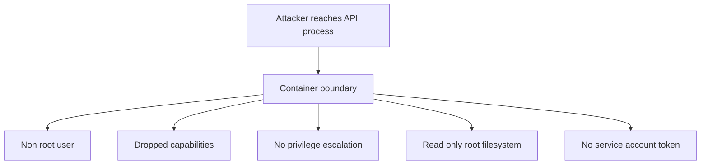

## Table of Contents

1. [Containers Share a Kernel](#containers-share-a-kernel)
2. [Start With the Restricted Shape](#start-with-the-restricted-shape)
3. [Security Contexts on Pods and Containers](#security-contexts-on-pods-and-containers)
4. [Run as Non Root](#run-as-non-root)
5. [Drop Capabilities and Block Privilege Escalation](#drop-capabilities-and-block-privilege-escalation)
6. [Use Pod Security Admission](#use-pod-security-admission)
7. [Failure Mode: The Image Only Works as Root](#failure-mode-the-image-only-works-as-root)
8. [A Practical Security Review](#a-practical-security-review)

## Containers Share a Kernel

A container is an isolated process environment, not a separate operating system kernel. It feels like a small machine while still sharing the host kernel with other containers on the node.

Linux isolation features such as namespaces, cgroups, capabilities, and seccomp create boundaries around processes. Namespaces limit what the process can see, cgroups limit resources, capabilities control privileged kernel operations, and seccomp filters system calls. Those boundaries are useful, but they are still boundaries inside one kernel.

Pod security reduces what a container can do if the application is compromised. If an attacker finds a remote code execution bug in `devpolaris-orders-api`, the container should not be running as root, should not have extra Linux capabilities, should not be able to write to the root filesystem, and should not receive a Kubernetes API token unless it needs one.

Pod security shrinks the next step after a break. A compromised API process should have fewer paths to the node, the cluster API, and other workloads.



The review habit is simple: every exception should have a reason tied to the workload.

## Start With the Restricted Shape

Kubernetes Pod Security Standards are named sets of Pod safety expectations: privileged, baseline, and restricted. The restricted profile is the safer target for ordinary application Pods because it blocks privileged containers and requires safer defaults around privilege escalation and seccomp.

Example: an ordinary orders API Pod should not use host networking, run privileged, or write freely to the image filesystem, so restricted-style settings are the right starting point.

For `devpolaris-orders-api`, the desired shape is an ordinary HTTP API. It does not need host networking, host PID access, privileged mode, raw block devices, or root user access. That makes it a good candidate for restricted-style settings.

The Deployment can carry explicit settings so reviewers do not have to guess what the image does at runtime.

```yaml
apiVersion: apps/v1
kind: Deployment
metadata:
  name: devpolaris-orders-api
  namespace: orders
spec:
  template:
    spec:
      serviceAccountName: orders-api
      automountServiceAccountToken: false
      securityContext:
        runAsNonRoot: true
        seccompProfile:
          type: RuntimeDefault
      containers:
        - name: api
          image: ghcr.io/devpolaris/orders-api:2026-05-07.1
          securityContext:
            allowPrivilegeEscalation: false
            readOnlyRootFilesystem: true
            capabilities:
              drop: ["ALL"]
```

This is the kind of YAML that protects the boring path. It says the app should not run as root, should use the runtime's default seccomp profile, should not gain new privileges, should not write to the image filesystem, and should drop Linux capabilities.

## Security Contexts on Pods and Containers

A security context is a set of security-related fields on a Pod or container. It tells the runtime which Linux user to run as, whether privilege escalation is allowed, which capabilities are present, and which seccomp profile applies. The practical job is to make the safe runtime shape explicit instead of relying on image defaults.

Example: `runAsNonRoot: true`, `allowPrivilegeEscalation: false`, and `capabilities.drop: ["ALL"]` make the orders API process run with fewer privileges than a default container.

| Field | Why it matters |
|-------|----------------|
| `runAsNonRoot` | Prevents the container from running as UID 0 |
| `runAsUser` | Chooses a numeric Linux user ID |
| `allowPrivilegeEscalation` | Blocks gaining more privileges through setuid or similar paths |
| `readOnlyRootFilesystem` | Prevents writes to the image filesystem |
| `capabilities.drop` | Removes extra Linux kernel privileges |
| `seccompProfile` | Restricts available system calls |

Use numeric user IDs rather than names in Kubernetes YAML. The kubelet sees numeric IDs more directly, and images can disagree about `/etc/passwd` contents.

## Run as Non Root

Running as non-root means the application process does not run as Linux user ID `0`. Root inside a container is still root from the process point of view, even when namespaces limit what it can see.

Example: running the orders API as UID `10001` means a file permission mistake or application bug does not automatically start from root privileges inside the container. Many container escapes and misconfigurations become worse when the process starts as root.

```yaml
securityContext:
  runAsNonRoot: true
  runAsUser: 10001
  runAsGroup: 10001
  fsGroup: 10001
```

`runAsUser` and `runAsGroup` set the user and group for container processes. `fsGroup` helps with mounted volumes that need group ownership. For an API that writes temporary files, prefer an explicit writable mount rather than leaving the whole root filesystem writable.

```yaml
volumeMounts:
  - name: tmp
    mountPath: /tmp
volumes:
  - name: tmp
    emptyDir: {}
```

This lets the root filesystem stay read-only while `/tmp` remains writable.

## Drop Capabilities and Block Privilege Escalation

Linux capabilities split root-like powers into smaller pieces, such as changing network settings or overriding file permissions. Dropping capabilities removes those extra kernel permissions from the container.

Example: `devpolaris-orders-api` should not need `NET_ADMIN` to change network settings or `SYS_ADMIN` to perform broad system operations. Most application containers do not need these powers. Dropping all capabilities is a safe starting point.

```yaml
securityContext:
  allowPrivilegeEscalation: false
  capabilities:
    drop:
      - ALL
```

If a workload needs a specific capability, add it explicitly and document the reason in the pull request, not as an inline comment in the manifest. For example, a low-level networking tool may need `NET_ADMIN`, but an orders API should not.

You can inspect the running Pod:

```bash
$ kubectl -n orders get pod devpolaris-orders-api-7c96df7d7c-2vd6k -o jsonpath='{.spec.containers[0].securityContext}'
{"allowPrivilegeEscalation":false,"capabilities":{"drop":["ALL"]},"readOnlyRootFilesystem":true}
```

The output is a quick proof that the running spec has the expected container security context.

## Use Pod Security Admission

Pod Security Admission is a built-in admission controller that applies Pod Security Standards through namespace labels. Its job is to make namespace-level Pod safety rules automatic at the API server. If a Pod violates the configured policy, the API server can warn, audit, or reject it before the Pod is stored.

For the `orders` namespace, a team might start with warnings for the `restricted` profile and then enforce after fixing existing workloads.

```bash
$ kubectl label namespace orders \
  pod-security.kubernetes.io/warn=restricted \
  pod-security.kubernetes.io/audit=restricted
namespace/orders labeled
```

Later, enforcement blocks non-compliant Pods:

```bash
$ kubectl label namespace orders pod-security.kubernetes.io/enforce=restricted
namespace/orders labeled
```

A denied Pod gives a clear error:

```text
Error from server (Forbidden): pods "debug-shell" is forbidden:
violates PodSecurity "restricted:latest": allowPrivilegeEscalation != false,
unrestricted capabilities, runAsNonRoot != true, seccompProfile
```

That error is useful because it names the missing safety fields. Fix the Pod spec rather than turning off the namespace policy.

## Failure Mode: The Image Only Works as Root

A root-dependent image is an image that only starts when its process can write as UID `0` or write into directories owned by root. The most common hardening failure is an image that writes into a root-owned directory. After adding `runAsNonRoot` and `readOnlyRootFilesystem`, the Pod fails.

```bash
$ kubectl -n orders logs deploy/devpolaris-orders-api --tail=20
2026-05-07T11:06:12Z error failed to open cache path=/app/.cache/orders
2026-05-07T11:06:12Z error EACCES: permission denied, mkdir '/app/.cache'
```

Start by deciding whether the app really needs to write there. For a cache or temporary files, redirect writes to `/tmp` or a mounted `emptyDir`. For persistent data, use a proper volume. For build artifacts, fix the image so runtime does not need to write into the application directory.

The diagnostic path is:

1. Read the container log for the denied path.
2. Check whether the path should be writable at runtime.
3. Add a writable mount for temporary state or fix the image ownership.
4. Keep non-root and read-only root filesystem if the app can work with explicit writable paths.

## A Practical Security Review

Pod security review checks what a specific workload needs from the host, the filesystem, and the Kubernetes API. It should stay close to the workload because different Pods have different legitimate needs. A batch image processor may need writable scratch space. A CNI plugin may need host access. A normal HTTP API usually does not.

Use this review table for `devpolaris-orders-api`:

| Check | Expected answer |
|-------|-----------------|
| Does the app need Kubernetes API access? | No, disable token automount |
| Does it need root? | No, run as UID 10001 |
| Does it need to write to the image filesystem? | No, use `/tmp` or explicit volume |
| Does it need Linux capabilities? | No, drop all |
| Does it need host namespaces or privileged mode? | No |
| Does the namespace warn or enforce restricted policy? | At least warn and audit before enforcement |

The tradeoff is compatibility. Stronger defaults can expose images that were built with hidden assumptions about root and writable directories. That is useful pain. Fixing those assumptions makes the workload easier to move, audit, and recover.

A good hardening pull request should show both the desired manifest and the runtime proof. The manifest says what you asked Kubernetes to run. The runtime proof says the Pod that actually started matches the expectation.

```bash
$ kubectl -n orders exec deploy/devpolaris-orders-api -- id
uid=10001 gid=10001 groups=10001

$ kubectl -n orders exec deploy/devpolaris-orders-api -- sh -c 'touch /app/check'
touch: /app/check: Read-only file system

$ kubectl -n orders exec deploy/devpolaris-orders-api -- sh -c 'touch /tmp/check && ls -l /tmp/check'
-rw-r--r--    1 10001    10001           0 May  7 11:24 /tmp/check
```

Those commands prove three things: the process is not root, the application directory is not writable, and the intentional scratch path is writable. That is the difference between a broken hardening change and a working one.

You can also inspect seccomp and token mounting from the API object:

```bash
$ kubectl -n orders get pod devpolaris-orders-api-7c96df7d7c-2vd6k \
  -o jsonpath='{.spec.securityContext.seccompProfile.type}{"\n"}'
RuntimeDefault

$ kubectl -n orders exec deploy/devpolaris-orders-api -- ls /var/run/secrets/kubernetes.io/serviceaccount
ls: /var/run/secrets/kubernetes.io/serviceaccount: No such file or directory
```

The missing service account token path is expected because `automountServiceAccountToken` is false. If the app later needs Kubernetes API access, add a specific reason and RBAC role rather than turning token mounting back on silently.

Some images fail because package managers, frameworks, or loggers assume writable home directories. Node.js services can hit this when a library tries to write cache files under the application directory. Python services can hit it when bytecode cache writes are enabled in a read-only location. The fix should move runtime writes to an explicit writable path.

```yaml
env:
  - name: TMPDIR
    value: /tmp
  - name: NODE_OPTIONS
    value: "--enable-source-maps"
volumeMounts:
  - name: tmp
    mountPath: /tmp
volumes:
  - name: tmp
    emptyDir:
      sizeLimit: 256Mi
```

The `emptyDir` size limit keeps scratch space from growing without a boundary. If the service needs more than temporary scratch space, use a storage design instead of expanding `/tmp` until the problem disappears.

Pod Security Admission should be rolled out with evidence too. Start with `warn` and `audit`, then list violations before enforcing.

```bash
$ kubectl label namespace orders pod-security.kubernetes.io/warn=restricted --overwrite
$ kubectl label namespace orders pod-security.kubernetes.io/audit=restricted --overwrite

$ kubectl -n orders apply -f k8s/orders/deployment.yaml
Warning: would violate PodSecurity "restricted:latest": allowPrivilegeEscalation != false
deployment.apps/devpolaris-orders-api configured
```

That warning phase gives the team a cleanup path. Once the warnings are fixed, enforcement becomes a smaller change:

```bash
$ kubectl label namespace orders pod-security.kubernetes.io/enforce=restricted --overwrite
namespace/orders labeled
```

Use a written exception process for workloads that cannot meet restricted settings. The exception should name the field, reason, owner, and review date.

```text
Exception request:
  workload: packet-capture-debug
  namespace: platform-debug
  field: hostNetwork true
  reason: short-lived network diagnosis on worker nodes
  owner: platform
  expires: 2026-05-14
```

Most application Pods should not need that exception. Making exceptions explicit keeps the normal path safe without pretending every operational tool has the same shape.

You can make the review even clearer by recording the final security posture as a short checklist:

```text
devpolaris-orders-api security posture:
  runs as non-root UID 10001
  drops all Linux capabilities
  blocks privilege escalation
  uses RuntimeDefault seccomp
  has read-only root filesystem
  writes temporary files only to /tmp
  does not mount a Kubernetes API token
  runs in a namespace with restricted Pod Security warnings
```

That checklist is not a substitute for the manifest. It is the human-readable contract the manifest should satisfy. During an incident or audit, it lets the team quickly compare intended posture with the running Pod.

---

**References**

- [Kubernetes: Pod Security Standards](https://kubernetes.io/docs/concepts/security/pod-security-standards/) - Official baseline and restricted policy profiles.
- [Kubernetes: Pod Security Admission](https://kubernetes.io/docs/concepts/security/pod-security-admission/) - Explains namespace labels for warn, audit, and enforce modes.
- [Kubernetes: Configure a Security Context](https://kubernetes.io/docs/tasks/configure-pod-container/security-context/) - Official guide to Pod and container security context fields.
- [Kubernetes: Service Accounts](https://kubernetes.io/docs/concepts/security/service-accounts/) - Useful background for token mounting and workload identities.
