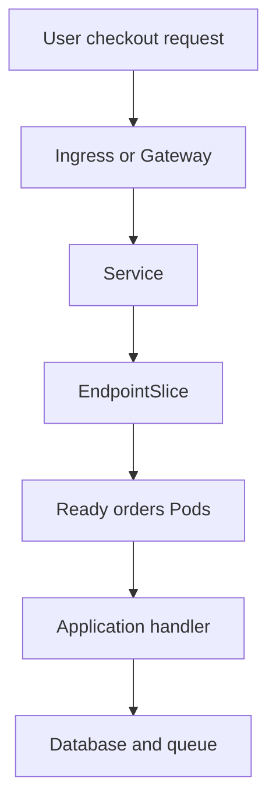

## Table of Contents

1. [Turn the Alert Into a Symptom](#turn-the-alert-into-a-symptom)
2. [Build the Timeline](#build-the-timeline)
3. [Inspect the Deployment Before Changing It](#inspect-the-deployment-before-changing-it)
4. [Follow the Request Path Outside In](#follow-the-request-path-outside-in)
5. [Use Events and Logs to Name the Failure Family](#use-events-and-logs-to-name-the-failure-family)
6. [Check Dependencies From Inside the Cluster](#check-dependencies-from-inside-the-cluster)
7. [Choose Mitigation With Evidence](#choose-mitigation-with-evidence)
8. [Roll Back Safely](#roll-back-safely)
9. [Keep Debugging From Damaging Evidence](#keep-debugging-from-damaging-evidence)
10. [Incident Review and Operational Checklist](#incident-review-and-operational-checklist)

## Turn the Alert Into a Symptom
<!-- section-summary: A useful debugging flow turns a noisy alert into one concrete user symptom, scope, and request example. -->

Production debugging in Kubernetes starts under pressure. An alert fires, people join a call, and somebody wants to run the first command they remember. The safer move is to turn the alert into a concrete **symptom** before changing the cluster.

Use our same production service: `devpolaris-orders-api` in the `orders` namespace. The alert says checkout 5xx rate is high. A useful symptom is more specific: checkout requests to `POST /orders/checkout` return `503` for some users in the EU production cluster, starting around 10:05 UTC.

Capture one request if you can. Add a request ID so the same request can be found in ingress logs, application logs, and traces.

```bash
$ curl -i https://api.devpolaris.local/orders/checkout \
  -H 'x-request-id: debug-20260616-1005'
HTTP/2 503
content-type: application/json

{"error":"orders service unavailable","requestId":"debug-20260616-1005"}
```

That request does not explain the root cause yet. It gives the team a shared target. From here, every Kubernetes check should answer a small question about the same symptom: is traffic reaching the ingress, does the Service have ready endpoints, are Pods ready, are logs showing application errors, and did a recent change line up with the failure?

## Build the Timeline
<!-- section-summary: The timeline connects user impact, recent changes, Kubernetes signals, and mitigation decisions in timestamp order. -->

A **timeline** is a short list of timestamped facts. It keeps debugging honest because it separates what happened from what people think happened. During an incident, the timeline can be simple and still useful.

For the orders incident, write the timeline as soon as you have two or three facts. Add command output, dashboard observations, and human actions as they happen.

| Time UTC | Fact | Evidence |
|----------|------|----------|
| 10:03 | CI deployed image `2026-06-16.2` | Deployment annotation and rollout history |
| 10:05 | Checkout monitor reported 503 responses | Synthetic check dashboard |
| 10:06 | Orders Deployment showed `1/3` available | `kubectl get deploy` |
| 10:07 | New Pods failed readiness | Pod events |
| 10:09 | Rollback decision made | Incident lead note |
| 10:11 | Orders Deployment returned to `3/3` available | Rollout status and health check |

Use Kubernetes rollout history when the team records change cause or deployment metadata. If this output is empty or vague, add better deployment annotations to the release process after the incident.

```bash
$ kubectl -n orders rollout history deployment/devpolaris-orders-api
deployment.apps/devpolaris-orders-api
REVISION  CHANGE-CAUSE
18        image ghcr.io/devpolaris/orders-api:2026-06-15.4
19        image ghcr.io/devpolaris/orders-api:2026-06-16.1
20        image ghcr.io/devpolaris/orders-api:2026-06-16.2
```

The timeline does not need perfect root-cause detail in the first five minutes. It needs enough evidence to guide the next check and enough discipline to record any mutating action before it happens.

## Inspect the Deployment Before Changing It
<!-- section-summary: Read-only Deployment, ReplicaSet, Pod, and event checks show whether the incident is tied to rollout state before anyone mutates production. -->

The first Kubernetes pass should be mostly read-only. **Read-only debugging** means using commands such as `get`, `describe`, `logs`, and dashboard queries before scaling, deleting, editing, or rolling back. This preserves evidence and avoids creating a second incident while the team is still learning.

Set the namespace and app name once to reduce typing errors. In a shared incident note, print the values so everyone can see the target.

```bash
$ export NS=orders
$ export APP=devpolaris-orders-api

$ echo "namespace=$NS app=$APP"
namespace=orders app=devpolaris-orders-api
```

Start with the Deployment and ReplicaSets. The Deployment tells you desired and available state. ReplicaSets show whether a new rollout is involved.

```bash
$ kubectl -n "$NS" get deploy "$APP"
NAME                    READY   UP-TO-DATE   AVAILABLE
devpolaris-orders-api   1/3     3            1

$ kubectl -n "$NS" get rs -l app.kubernetes.io/name="$APP"
NAME                                DESIRED   CURRENT   READY   AGE
devpolaris-orders-api-6df87c7676    1         1         1       2d
devpolaris-orders-api-78b6f596dc    3         3         0       7m
```

This output is already useful. The older ReplicaSet still has one ready Pod, while the new ReplicaSet has three Pods and zero ready. That strongly points toward a rollout or readiness problem rather than a full cluster outage.

Now check the Pods and their nodes. `STATUS=Running` only means the container process is running. `READY=0/1` means the Pod is not serving through the Service.

```bash
$ kubectl -n "$NS" get pods -o wide -l app.kubernetes.io/name="$APP"
NAME                                      READY   STATUS    RESTARTS   AGE   NODE
devpolaris-orders-api-6df87c7676-9j4mt   1/1     Running   0          2d    worker-1
devpolaris-orders-api-78b6f596dc-kzt9p   0/1     Running   0          7m    worker-3
devpolaris-orders-api-78b6f596dc-wc6s2   0/1     Running   0          7m    worker-4
```

At this point, the team has a strong clue without changing the system. The new Pods are alive, yet readiness keeps them out of traffic. The next step is to follow the request path and confirm how that Pod state affects users.

## Follow the Request Path Outside In
<!-- section-summary: Outside-in checks follow the same route as user traffic: ingress, Service, EndpointSlice, ready Pods, logs, and dependencies. -->

**Outside-in debugging** follows the user request path from the edge toward the container. This keeps the team from fixating on the first suspicious Pod while the actual problem sits in routing or dependencies. For the orders API, the path is external route, ingress or gateway, Service, EndpointSlice, ready Pods, then application code and dependencies.



Check whether the Service has ready endpoints. EndpointSlices are a better modern view than the older Endpoints object because they scale better and show endpoint conditions.

```bash
$ kubectl -n "$NS" get endpointslice -l kubernetes.io/service-name="$APP"
NAME                          ADDRESSTYPE   PORTS   ENDPOINTS
devpolaris-orders-api-rb6hb   IPv4          8080    10.244.1.42
```

Only one endpoint appears, which matches the one ready old Pod. If traffic is higher than one replica can handle, users can see 503s or latency even though the Service still has one backend.

Run an internal health check from inside the namespace. This tests DNS, Service routing, and the application's readiness endpoint without the external ingress path.

```bash
$ kubectl -n "$NS" run curlcheck --rm -it --image=curlimages/curl --restart=Never -- \
  curl -sS http://devpolaris-orders-api/health/ready
{"status":"ready","database":"ok","queue":"ok","replica":"old"}
```

Then test the external route. If the internal check works and the external route fails, the investigation moves toward ingress, gateway, TLS, DNS, or external load balancing.

```bash
$ curl -sS -o /dev/null -w '%{http_code} %{time_total}\n' \
  https://api.devpolaris.local/orders/checkout/health
503 0.142810
```

The path now says the cluster has reduced ready capacity and the external route is showing user-visible failure. That is enough to inspect why the new Pods are not ready.

## Use Events and Logs to Name the Failure Family
<!-- section-summary: Events and logs help separate rollout failures, runtime crashes, readiness failures, dependency failures, routing failures, and capacity problems. -->

A **failure family** is a practical bucket for the evidence you are seeing. It helps the team choose the next check. A rollout failure, runtime crash, readiness failure, dependency outage, routing failure, and capacity problem can all show up as user-facing errors, but they have different fixes.

Use this table as a first pass:

| Failure family | Signal | First useful command |
|----------------|--------|----------------------|
| Rollout failure | New ReplicaSet has few or no ready Pods | `kubectl rollout status deployment/$APP` |
| Runtime crash | Pod restarts or `CrashLoopBackOff` | `kubectl logs --previous` |
| Readiness failure | Pods are running but absent from endpoints | `kubectl describe pod <pod>` |
| Dependency failure | Logs show timeouts or refused connections | App logs and dependency probes |
| Routing failure | Internal health works, external route fails | Ingress or Gateway status |
| Capacity problem | `FailedScheduling`, throttling, or HPA limits | Pod events, node capacity, HPA status |

For the current incident, describe one of the new Pods. Events usually explain scheduler, image pull, mount, and probe problems better than the top-level Deployment output.

```bash
$ kubectl -n "$NS" describe pod devpolaris-orders-api-78b6f596dc-kzt9p
Events:
  Type     Reason     Age   From     Message
  Warning  Unhealthy  4m    kubelet  Readiness probe failed: HTTP probe failed with statuscode: 500
```

The kubelet can reach the readiness endpoint, and the endpoint returns 500. That points inside the application or its dependencies. Read the logs from the failing Pod.

```bash
$ kubectl -n "$NS" logs pod/devpolaris-orders-api-78b6f596dc-kzt9p --tail=60
2026-06-16T10:06:22Z info server started port=8080 image=2026-06-16.2
2026-06-16T10:06:23Z error readiness failed component=database error="relation orders_outbox does not exist"
2026-06-16T10:06:33Z error readiness failed component=database error="relation orders_outbox does not exist"
```

Now the failure family is clear enough for a decision. This is a rollout readiness failure caused by the new image expecting a database table that production does not have. The team can still investigate the release process later, but user impact needs mitigation now.

## Check Dependencies From Inside the Cluster
<!-- section-summary: Dependency checks from the same namespace verify DNS, network policy, service routing, and dependency reachability from the workload's point of view. -->

Dependency evidence should come from the workload's point of view. A database may be healthy from the database dashboard while unreachable from the `orders` namespace because of DNS, NetworkPolicy, credentials, or a service mesh change. A quick in-cluster check narrows that gap.

Use a temporary Pod when the namespace allows it. Keep the command read-only and remove the Pod after the check.

```bash
$ kubectl -n "$NS" run netcheck --rm -it --image=busybox:1.36 --restart=Never -- \
  nslookup postgres.orders.svc.cluster.local
Server:    10.96.0.10
Address 1: 10.96.0.10 kube-dns.kube-system.svc.cluster.local

Name:      postgres.orders.svc.cluster.local
Address 1: 10.96.18.44 postgres.orders.svc.cluster.local
```

For HTTP dependencies, use a curl image and hit the same URL the app uses. For databases, prefer application logs, synthetic dependency checks, or a safe health endpoint over ad hoc queries from a shell. Production data systems deserve careful access control even during incidents.

```bash
$ kubectl -n "$NS" run queuecheck --rm -it --image=curlimages/curl --restart=Never -- \
  curl -sS http://orders-queue-health.orders.svc.cluster.local/ready
{"status":"ready","lagSeconds":2}
```

If dependencies look healthy and only the new image reports a missing table, the problem likely sits in release sequencing. Maybe the migration did not run, ran in the wrong environment, or the code reached production before the schema. That conclusion supports rollback more than live debugging inside Pods.

## Choose Mitigation With Evidence
<!-- section-summary: Mitigation should reduce user impact quickly while matching the evidence and preserving a clear path back. -->

**Mitigation** is a change that reduces user impact before the full root-cause fix is ready. In Kubernetes incidents, mitigation might be rollback, scaling, traffic shifting, disabling a feature flag, increasing capacity, or pausing a rollout. The right mitigation depends on the evidence, not on habit.

For this incident, the evidence says the new image is unready because it expects a missing database table. The older ReplicaSet still has one ready Pod. Rollback is a strong mitigation because it returns the Deployment to the last known working Pod template.

Other incidents need different actions. Use a small decision table during the incident call.

| Evidence | Safer mitigation |
|----------|------------------|
| New ReplicaSet unready, old ReplicaSet healthy | Roll back the Deployment |
| All replicas healthy but CPU saturated | Scale replicas or reduce traffic |
| External route failing, internal Service healthy | Shift traffic or fix ingress/gateway |
| Dependency outage confirmed | Use feature flag, fallback mode, or dependency incident process |
| PDB or scheduling blocks node maintenance | Pause maintenance and add capacity |

Avoid making the readiness probe lie. If the application returns readiness 500 because a required table is missing, changing the probe path can send checkout traffic to broken Pods. A mitigation should improve user experience and keep the evidence understandable.

Record the chosen mitigation in the timeline before running the command. That small habit helps later reviewers understand why the system changed.

## Roll Back Safely
<!-- section-summary: Rollback is a controlled Deployment change that returns to a previous Pod template and then requires user-path validation. -->

A **Deployment rollback** returns a Deployment to an earlier Pod template revision. It is useful when a recent rollout is strongly connected to user impact and a previous revision is known to work. The Deployment must have rollout history available, which depends on ReplicaSet retention and the team's deployment practice.

Check the history, choose the revision, and run the rollback. Use `--to-revision` when you know the exact target.

```bash
$ kubectl -n "$NS" rollout history deployment/"$APP"
deployment.apps/devpolaris-orders-api
REVISION  CHANGE-CAUSE
19        image ghcr.io/devpolaris/orders-api:2026-06-16.1
20        image ghcr.io/devpolaris/orders-api:2026-06-16.2

$ kubectl -n "$NS" rollout undo deployment/"$APP" --to-revision=19
deployment.apps/devpolaris-orders-api rolled back

$ kubectl -n "$NS" rollout status deployment/"$APP"
deployment "devpolaris-orders-api" successfully rolled out
```

After rollback, verify both Kubernetes state and user-facing behavior. Recovery is a claim until the service path proves it.

```bash
$ kubectl -n "$NS" get deploy "$APP"
NAME                    READY   UP-TO-DATE   AVAILABLE
devpolaris-orders-api   3/3     3            3

$ kubectl -n "$NS" get endpointslice -l kubernetes.io/service-name="$APP"
NAME                          ADDRESSTYPE   PORTS   ENDPOINTS
devpolaris-orders-api-rb6hb   IPv4          8080    10.244.1.42,10.244.2.17,10.244.4.9

$ curl -sS -o /dev/null -w '%{http_code} %{time_total}\n' \
  https://api.devpolaris.local/orders/checkout/health
200 0.081662
```

Rollback restores service; it does not finish the incident. The follow-up is to fix the release workflow so an image requiring a future schema cannot reach production early. That fix might live in CI, migration tooling, admission policy, or a deployment gate that compares required and current schema versions.

## Keep Debugging From Damaging Evidence
<!-- section-summary: Mutating debug commands should be deliberate because they can remove evidence, restart bad Pods, or create a second production problem. -->

A **mutating debug command** changes the cluster while the team is investigating. Examples include deleting Pods, scaling Deployments, editing live objects, disabling policies, or restarting controllers. These commands can be useful, but they need a reason and a record.

Deleting Pods is the classic trap. If the Deployment still points to the bad image, Kubernetes recreates the same bad Pods and the team loses local evidence such as container state and recent logs.

```bash
$ kubectl -n "$NS" delete pod -l app.kubernetes.io/name="$APP"
pod "devpolaris-orders-api-78b6f596dc-kzt9p" deleted
pod "devpolaris-orders-api-78b6f596dc-wc6s2" deleted
```

That command might help after a stuck runtime issue with a known safe Pod template. In the missing-table incident, it hides evidence and repeats the failure. Prefer controller-level actions such as rollback when the evidence points to a bad rollout.

Use this risk table during first response:

| Action | Risk | Good use |
|--------|------|----------|
| `kubectl get` and `describe` | Low | First state inspection |
| `kubectl logs` | Low to medium because logs may contain sensitive data | Confirm application errors |
| `kubectl debug` with an ephemeral container | Medium because it changes the Pod spec and access surface | Deep network or filesystem inspection with approval |
| `kubectl rollout undo` | Medium because it changes production | Recent bad rollout with known good revision |
| `kubectl scale` | Medium because it changes capacity and dependency load | Capacity incident with healthy Pods |
| `kubectl delete pod` | Medium because it removes local evidence | Stuck Pod after evidence is captured |

The goal is not to freeze during an incident. The goal is to make the first production change match the evidence and keep a path for later review.

## Incident Review and Operational Checklist
<!-- section-summary: The final incident review turns the debugging evidence into prevention work, clearer runbooks, and safer first-responder actions. -->

The incident review should connect symptom, evidence, mitigation, recovery, and prevention. Keep commands and conclusions together. Commands without conclusions force future readers to redo the thinking, while conclusions without evidence are hard to trust.

Use this evidence format in the incident note:

| Command or source | Observation | Conclusion |
|-------------------|-------------|------------|
| `curl /orders/checkout` | Returned 503 with request ID | Users saw checkout failure |
| `kubectl get deploy` | Deployment was `1/3` available | Service had reduced ready capacity |
| `kubectl get rs` | New ReplicaSet had zero ready Pods | Incident likely tied to rollout |
| `kubectl describe pod` | Readiness probe returned HTTP 500 | Pod process ran but stayed out of endpoints |
| `kubectl logs` | Missing `orders_outbox` table | New image expected unapplied schema |
| Rollback validation | Deployment `3/3`, external health 200 | User path recovered |

Then turn the evidence into prevention work. For this incident, the release process needs a schema compatibility gate. The check could run before deployment and block an image if production has not reached the required migration version.

| Prevention item | Owner | Success signal |
|-----------------|-------|----------------|
| Add required schema version to image metadata | Orders team | Build artifact records migration requirement |
| Check production schema version before deploy | Delivery platform | CI blocks incompatible image |
| Add rollout annotations with image and migration ID | Delivery platform | `rollout history` shows useful change cause |
| Add readiness error dashboard panel | Observability owner | Readiness failures grouped by reason |
| Add rollback command to runbook | Service owner | On-call can roll back with approval path |

For daily operations, keep this checklist close to the on-call runbook:

1. Capture the exact user symptom and request ID.
2. Build a timestamped timeline with facts and actions.
3. Run read-only Kubernetes checks before mutating production.
4. Inspect Deployment, ReplicaSets, Pods, EndpointSlices, events, and logs.
5. Follow the request path from external route to Service to Pod.
6. Separate rollout, runtime, dependency, routing, capacity, and policy failures.
7. Choose mitigation that matches the evidence.
8. Record the mitigation decision before running the command.
9. Validate recovery from Kubernetes state, internal health, and external health.
10. Convert the incident evidence into one or more preventive checks.

That workflow gives junior responders a way to help without guessing. It also gives senior responders a shared structure for decisions under pressure. The real skill is moving from one small proof to the next until the team knows what changed, what failed, what restored service, and what will stop the same failure from returning.

---

**References**

- [Kubernetes: Debug Applications](https://kubernetes.io/docs/tasks/debug/debug-application/) - Official entry point for Kubernetes application debugging tasks.
- [Kubernetes: Debug Running Pods](https://kubernetes.io/docs/tasks/debug/debug-application/debug-running-pod/) - Shows how to inspect Pod state, logs, events, and running containers.
- [Kubernetes: Debug Services](https://kubernetes.io/docs/tasks/debug/debug-application/debug-service/) - Explains how to inspect Service routing and endpoints.
- [Kubernetes: Deployments](https://kubernetes.io/docs/concepts/workloads/controllers/deployment/) - Official Deployment behavior, rollout, and rollback reference.
- [Kubernetes: Services](https://kubernetes.io/docs/concepts/services-networking/service/) - Explains Services, endpoint selection, and traffic routing to Pods.
- [Kubernetes: EndpointSlices](https://kubernetes.io/docs/concepts/services-networking/endpoint-slices/) - Documents the modern endpoint API used behind Services.
- [Kubernetes: Ephemeral Containers](https://kubernetes.io/docs/concepts/workloads/pods/ephemeral-containers/) - Explains temporary debug containers for troubleshooting running Pods.
